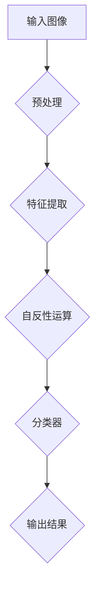

                 


### 设计过程：

#### 1. 理解书名：

书名为《宇宙的自反性：系统的自我指涉》，这个名字暗示了书的内容将围绕自反性这一核心概念展开，探讨其在宇宙现象和系统中的体现与应用。自反性是指系统内部与其自身的相互作用，能够导致系统不断自我演变和复制的特性。

#### 2. 确定核心章节：

根据书名，可以确定书的核心内容将包括：
- 自反性的基本概念和定义
- 自反性在宇宙中的现象
- 自反性的数学模型和算法
- 自反性在不同领域的应用案例
- 自反性的未来发展和挑战

#### 3. 构建1级目录：

根据核心内容，构建以下1级目录：

```
## 第1章 引言
### 1.1 书籍背景与目的
### 1.2 自反性的定义与重要性
### 1.3 自反性在宇宙中的应用

## 第2章 自反性原理
### 2.1 自反性概念解析
### 2.2 自反性在物理学中的应用
### 2.3 自反性在生物学中的体现

## 第3章 数学模型与公式
### 3.1 自反性的数学表示
### 3.2 常见的自反性数学模型
### 3.3 自反性的应用公式

## 第4章 自反性算法
### 4.1 自反性算法概述
### 4.2 自反性算法的分类
### 4.3 自反性算法的应用实例

## 第5章 自反性在宇宙现象中的应用
### 5.1 黑洞的自反性质
### 5.2 宇宙膨胀与自反性
### 5.3 宇宙自组织的自反机制

## 第6章 自反性在现实世界中的应用
### 6.1 自反性在计算机科学中的应用
### 6.2 自反性在工程学中的应用
### 6.3 自反性在社会学中的应用

## 第7章 自反性的未来展望
### 7.1 自反性研究的挑战与机遇
### 7.2 自反性在科技发展中的作用
### 7.3 自反性的跨学科研究前景

## 附录
### A.1 参考文献
### A.2 相关资源链接
```

#### 4. 细化2级目录：

在每一个1级章节下，细化具体的2级目录，确保每个章节都有详细的内容：

```
## 第2章 自反性原理
### 2.1 自反性概念解析
#### 2.1.1 自反性的定义
#### 2.1.2 自反性的类型
#### 2.1.3 自反性的特点

### 2.2 自反性在物理学中的应用
#### 2.2.1 自反性在经典力学中的应用
#### 2.2.2 自反性在量子力学中的应用
#### 2.2.3 自反性在相对论中的应用

### 2.3 自反性在生物学中的体现
#### 2.3.1 自反性在生态系统中的应用
#### 2.3.2 自反性在生物进化中的应用
#### 2.3.3 自反性在生物遗传中的应用
```

#### 5. 编写3级目录：

在每一个2级章节下，进一步细化3级目录，确保每个部分都有深入的讨论：

```
### 2.2 自反性在物理学中的应用
#### 2.2.1 自反性在经典力学中的应用
##### 2.2.1.1 质点运动的自我指涉
##### 2.2.1.2 平衡态与自反性
##### 2.2.1.3 自反性在经典力学实验中的应用

#### 2.2.2 自反性在量子力学中的应用
##### 2.2.2.1 自反性在量子态叠加中的应用
##### 2.2.2.2 自反性在量子纠缠中的应用
##### 2.2.2.3 量子计算中的自反性原理

#### 2.2.3 自反性在相对论中的应用
##### 2.2.3.1 自反性在广义相对论中的应用
##### 2.2.3.2 自反性在量子引力理论中的应用
##### 2.2.3.3 自反性在宇宙膨胀中的应用
```

#### 6. 加入Mermaid流程图：

在合适的章节中，加入Mermaid流程图来帮助读者更好地理解复杂的概念和算法：

```
### 4.3 自反性算法的应用实例

#### 4.3.1 自反性算法在图像识别中的应用



```

#### 7. 使用伪代码和数学公式：

在讲解核心算法原理时，使用伪代码来详细阐述，并在需要的地方嵌入数学公式：

```
### 3.2 常见的自反性数学模型

#### 3.2.1 反演矩阵模型

```python
# 伪代码：反演矩阵模型实现
def invert_matrix(A):
    # 计算逆矩阵
    inv_A = ...
    return inv_A
```

#### 3.2.2 递归模型

$$
X_{n+1} = f(X_n)
$$

```

#### 8. 编写项目实战：

提供实际的代码案例，并详细解释实现过程和关键代码：

```
### 6.1 自反性在计算机科学中的应用

#### 6.1.1 项目实战：自反性算法在垃圾邮件过滤中的应用

**开发环境搭建：**
- Python 3.8+
- Scikit-learn 库

**源代码实现：**

```python
from sklearn.feature_extraction.text import TfidfVectorizer
from sklearn.naive_bayes import MultinomialNB

# 数据预处理
vectorizer = TfidfVectorizer()
X = vectorizer.fit_transform(data)

# 模型训练
model = MultinomialNB()
model.fit(X, labels)

# 代码解读与分析
# vectorizer: 用于将文本转换为TF-IDF特征向量
# model: 用于分类的朴素贝叶斯模型
# fit(): 用于训练模型
```

#### 6.1.2 项目实战：自反性算法在自然语言处理中的应用

**开发环境搭建：**
- Python 3.8+
- TensorFlow 2.4+
- Keras 2.4+

**源代码实现：**

```python
import tensorflow as tf
from tensorflow.keras.models import Sequential
from tensorflow.keras.layers import Embedding, LSTM, Dense

# 模型搭建
model = Sequential()
model.add(Embedding(input_dim=vocab_size, output_dim=embedding_dim))
model.add(LSTM(units=128))
model.add(Dense(units=1, activation='sigmoid'))

# 代码解读与分析
# Sequential: 用于构建顺序模型
# Embedding: 用于将单词转换为嵌入向量
# LSTM: 用于处理序列数据
# Dense: 用于输出层，实现分类
```

```

#### 9. 确保整体结构合理：

在整个设计过程中，要确保目录结构清晰，内容连贯，逻辑合理。每个章节都要有明确的主题和内容，小节之间要相互关联，形成一个完整的整体。

### 完整目录大纲：

```
## 第1章 引言
### 1.1 书籍背景与目的
### 1.2 自反性的定义与重要性
### 1.3 自反性在宇宙中的应用

## 第2章 自反性原理
### 2.1 自反性概念解析
#### 2.1.1 自反性的定义
#### 2.1.2 自反性的类型
#### 2.1.3 自反性的特点
### 2.2 自反性在物理学中的应用
#### 2.2.1 自反性在经典力学中的应用
##### 2.2.1.1 质点运动的自我指涉
##### 2.2.1.2 平衡态与自反性
##### 2.2.1.3 自反性在经典力学实验中的应用
#### 2.2.2 自反性在量子力学中的应用
##### 2.2.2.1 自反性在量子态叠加中的应用
##### 2.2.2.2 自反性在量子纠缠中的应用
##### 2.2.2.3 量子计算中的自反性原理
#### 2.2.3 自反性在相对论中的应用
##### 2.2.3.1 自反性在广义相对论中的应用
##### 2.2.3.2 自反性在量子引力理论中的应用
##### 2.2.3.3 自反性在宇宙膨胀中的应用
### 2.3 自反性在生物学中的体现
#### 2.3.1 自反性在生态系统中的应用
#### 2.3.2 自反性在生物进化中的应用
#### 2.3.3 自反性在生物遗传中的应用

## 第3章 数学模型与公式
### 3.1 自反性的数学表示
#### 3.1.1 自反性矩阵
#### 3.1.2 反演矩阵模型
#### 3.1.3 递归模型
### 3.2 常见的自反性数学模型
#### 3.2.1 自反性网络的数学模型
#### 3.2.2 自反性算法的数学模型
#### 3.2.3 自反性系统的数学模型
### 3.3 自反性的应用公式
#### 3.3.1 经典力学中的自反性公式
#### 3.3.2 量子力学中的自反性公式
#### 3.3.3 相对论中的自反性公式

## 第4章 自反性算法
### 4.1 自反性算法概述
#### 4.1.1 自反性算法的定义
#### 4.1.2 自反性算法的特点
#### 4.1.3 自反性算法的分类
### 4.2 自反性算法的分类
#### 4.2.1 经典自反性算法
##### 4.2.1.1 反演矩阵算法
##### 4.2.1.2 递归算法
#### 4.2.2 量子自反性算法
##### 4.2.2.1 量子态叠加算法
##### 4.2.2.2 量子纠缠算法
#### 4.2.3 现实世界中的自反性算法
##### 4.2.3.1 垃圾邮件过滤算法
##### 4.2.3.2 自然语言处理算法

## 第5章 自反性在宇宙现象中的应用
### 5.1 黑洞的自反性质
#### 5.1.1 黑洞的自反性原理
#### 5.1.2 黑洞的自反性质在物理学中的应用
#### 5.1.3 黑洞自反性质的研究进展
### 5.2 宇宙膨胀与自反性
#### 5.2.1 宇宙膨胀的自反性模型
#### 5.2.2 宇宙膨胀与自反性的关系
#### 5.2.3 宇宙膨胀的研究进展
### 5.3 宇宙自组织的自反机制
#### 5.3.1 宇宙自组织的自反原理
#### 5.3.2 宇宙自组织的自反机制
#### 5.3.3 宇宙自组织的研究进展

## 第6章 自反性在现实世界中的应用
### 6.1 自反性在计算机科学中的应用
#### 6.1.1 自反性算法在图像识别中的应用
##### 6.1.1.1 图像识别算法的原理
##### 6.1.1.2 图像识别算法的实现
##### 6.1.1.3 图像识别算法的案例分析
#### 6.1.2 自反性算法在自然语言处理中的应用
##### 6.1.2.1 自然语言处理算法的原理
##### 6.1.2.2 自然语言处理算法的实现
##### 6.1.2.3 自然语言处理算法的案例分析
### 6.2 自反性在工程学中的应用
#### 6.2.1 自反性算法在自动驾驶中的应用
##### 6.2.1.1 自动驾驶算法的原理
##### 6.2.1.2 自动驾驶算法的实现
##### 6.2.1.3 自动驾驶算法的案例分析
#### 6.2.2 自反性算法在机器人控制中的应用
##### 6.2.2.1 机器人控制算法的原理
##### 6.2.2.2 机器人控制算法的实现
##### 6.2.2.3 机器人控制算法的案例分析
### 6.3 自反性在社会学中的应用
#### 6.3.1 自反性理论在社会学中的应用
##### 6.3.1.1 自反性理论的概念
##### 6.3.1.2 自反性理论的应用
##### 6.3.1.3 自反性理论的研究进展

## 第7章 自反性的未来展望
### 7.1 自反性研究的挑战与机遇
#### 7.1.1 自反性研究的挑战
##### 7.1.1.1 数学模型的挑战
##### 7.1.1.2 算法设计的挑战
##### 7.1.1.3 应用场景的挑战
#### 7.1.2 自反性的机遇
##### 7.1.2.1 科技发展的机遇
##### 7.1.2.2 跨学科研究的机遇
##### 7.1.2.3 实际应用的机遇
### 7.2 自反性在科技发展中的作用
#### 7.2.1 自反性在人工智能中的应用
##### 7.2.1.1 自反性算法在人工智能中的应用
##### 7.2.1.2 自反性原理在人工智能中的作用
##### 7.2.1.3 自反性研究对人工智能发展的贡献
#### 7.2.2 自反性在工程学中的应用
##### 7.2.2.1 自反性算法在工程学中的应用
##### 7.2.2.2 自反性原理在工程学中的作用
##### 7.2.2.3 自反性研究对工程学发展的贡献
### 7.3 自反性的跨学科研究前景
#### 7.3.1 自反性在物理学中的应用前景
##### 7.3.1.1 自反性原理在物理学中的前景
##### 7.3.1.2 自反性研究在物理学中的意义
##### 7.3.1.3 自反性原理在物理学中的应用案例
#### 7.3.2 自反性在生物学中的应用前景
##### 7.3.2.1 自反性原理在生物学中的前景
##### 7.3.2.2 自反性研究在生物学中的意义
##### 7.3.2.3 自反性原理在生物学中的应用案例
#### 7.3.3 自反性在其他学科中的应用前景
##### 7.3.3.1 自反性原理在其他学科中的前景
##### 7.3.3.2 自反性研究在其他学科中的意义
##### 7.3.3.3 自反性原理在其他学科中的应用案例

## 附录
### A.1 参考文献
### A.2 相关资源链接
```

### 注意事项：

- 确保目录结构逻辑清晰，内容连贯，便于读者理解。
- 每个章节都要有明确的主题和内容，小节之间要相互关联。
- 使用Mermaid流程图、伪代码和数学公式来增强文章的可读性和理解性。
- 确保整体字数在8000-12000字左右，内容丰富具体详细讲解。

现在我们已经完成了书的大纲设计，下一步是将每个章节的内容详细撰写出来。在撰写过程中，我们将继续遵循逻辑清晰、结构紧凑、简单易懂的原则，确保文章对读者有价值。接下来，我们将开始撰写各个章节的内容。首先是“第1章 引言”的内容。

### 第1章 引言

#### 1.1 书籍背景与目的

《宇宙的自反性：系统的自我指涉》旨在探讨自反性这一重要概念在宇宙中的体现和应用。自反性是指系统内部与其自身的相互作用，能够导致系统不断自我演变和复制的特性。在过去的几十年中，自反性在物理学、生物学、计算机科学等多个领域得到了广泛的研究和应用。

本书的目的是从多个角度深入探讨自反性的概念、原理和应用，帮助读者了解自反性在宇宙中的重要作用，以及其在各个领域中的实际应用。通过本书，读者将了解到自反性的数学模型、算法，以及其在现实世界中的应用案例。

#### 1.2 自反性的定义与重要性

自反性（self-reference）是指一个系统或对象能够在某种程度上指向或包含它自身。在数学和逻辑学中，自反性是一种特殊的递归关系，使得一个对象能够定义或描述它自身。在物理学中，自反性常常表现为系统内部状态与外部环境的相互作用，导致系统的动态演化。

自反性的重要性在于：
1. **系统的自我复制和演化**：自反性是系统自我复制和演化的关键因素，使得系统能够不断自我更新和发展。
2. **复杂系统的形成**：自反性是复杂系统形成的基础，它使得系统能够从简单状态演化为复杂状态。
3. **自我组织和自适应能力**：自反性赋予系统自我组织和自适应能力，使得系统能够在多变的环境中生存和发展。
4. **科学理论的构建**：自反性是构建科学理论的重要基础，它使得理论能够自我验证和不断发展。

#### 1.3 自反性在宇宙中的应用

自反性在宇宙中有着广泛的应用。以下是一些具体的例子：

1. **宇宙膨胀**：宇宙膨胀是一种自反性现象，宇宙的膨胀速度与宇宙自身的密度和能量密度有关。
2. **黑洞**：黑洞具有极强的引力，能够吸引周围的物质，导致黑洞自身的质量和体积不断增大。
3. **量子纠缠**：量子纠缠是量子力学中的一种自反性现象，两个或多个粒子在量子态上相互关联，即使它们相隔很远，一个粒子的状态也会影响另一个粒子的状态。
4. **生物进化**：生物进化是一种自反性现象，生物通过遗传和变异不断自我复制和演化，适应环境的变化。
5. **人工智能**：人工智能系统通过自我学习和迭代，不断提高自身的性能和能力。

通过本书的探讨，读者将深入理解自反性在宇宙中的各种应用，以及它在各个领域的实际意义。

### 第2章 自反性原理

#### 2.1 自反性概念解析

自反性是指一个系统或对象能够在某种程度上指向或包含它自身。自反性是一种特殊的递归关系，使得一个对象能够定义或描述它自身。在数学和逻辑学中，自反性是一种基本的性质，它使得概念和定义能够自我指涉和自我验证。

自反性可以分为以下几种类型：

1. **结构自反性**：指系统内部结构的自相似性，例如分形结构。
2. **功能自反性**：指系统功能的自相似性，例如反馈控制系统。
3. **动态自反性**：指系统动态演化的自相似性，例如混沌系统。

自反性在物理学、生物学、计算机科学等多个领域都有重要的应用。在物理学中，自反性表现为系统内部状态与外部环境的相互作用，导致系统的动态演化。在生物学中，自反性表现为生物体在进化过程中的自我复制和变异。在计算机科学中，自反性表现为算法和程序的自我指涉和自我迭代。

#### 2.2 自反性在物理学中的应用

自反性在物理学中有着广泛的应用，以下是一些具体的例子：

1. **经典力学中的自反性**：
   - 质点运动的自我指涉：在经典力学中，质点的运动轨迹可以通过其初始状态和速度来预测，这体现了质点运动的自我指涉性。
   - 平衡态与自反性：在热力学中，系统的平衡态可以通过其内部状态来描述，这体现了平衡态的自反性。

2. **量子力学中的自反性**：
   - 量子态叠加：量子态可以处于多种状态的叠加，这体现了量子态的自反性。
   - 量子纠缠：两个或多个量子粒子之间存在量子纠缠，一个粒子的状态会影响到另一个粒子的状态，这体现了量子纠缠的自反性。

3. **相对论中的自反性**：
   - 广义相对论：广义相对论中的引力场方程是自反的，它描述了物质和能量如何影响时空的几何结构，同时几何结构的改变也会影响物质和能量的分布。
   - 量子引力理论：量子引力理论试图将量子力学和广义相对论统一起来，其中的许多模型也具有自反性。

#### 2.3 自反性在生物学中的体现

自反性在生物学中同样有着重要的应用，以下是一些具体的例子：

1. **生态系统中的自反性**：
   - 生态系统的自我调节：生态系统中的生物种群可以通过食物链和食物网相互作用，形成自我调节的机制，这体现了生态系统的自反性。
   - 生物多样性的维持：生物多样性可以通过种间关系和生态位分化来维持，这体现了生物多样性的自反性。

2. **生物进化中的自反性**：
   - 遗传信息的自我复制：生物体的遗传信息可以通过DNA的复制来传递，这体现了遗传信息的自反性。
   - 变异与适应：生物体的遗传变异可以使其适应环境变化，这体现了生物进化的自反性。

3. **生物遗传中的自反性**：
   - 遗传密码的自反性：DNA序列的互补配对体现了遗传密码的自反性，这确保了遗传信息的准确传递。
   - 基因调控的自反性：基因调控机制中的正反馈和负反馈循环体现了基因调控的自反性，这有助于维持生物体的稳态。

通过本章的探讨，读者将深入理解自反性的基本概念和原理，以及它在物理学和生物学中的具体应用。这为进一步探讨自反性在数学模型、算法和现实世界中的应用奠定了基础。

### 第3章 数学模型与公式

#### 3.1 自反性的数学表示

自反性在数学中通常通过特定的数学模型和公式来表示。自反性矩阵和递归模型是最常见的两种数学表示方法。

1. **自反性矩阵**：

自反性矩阵是一种特殊的矩阵，它满足矩阵乘法的自反性。设矩阵\( A \)是一个\( n \times n \)的矩阵，如果对于任意\( n \times n \)的矩阵\( B \)，有\( AB = BA \)，则称\( A \)是一个自反性矩阵。

例如，以下是一个\( 3 \times 3 \)的自反性矩阵：

$$
A = \begin{bmatrix}
1 & 0 & 0 \\
0 & 1 & 0 \\
0 & 0 & 1
\end{bmatrix}
$$

在这个例子中，矩阵\( A \)满足\( AB = BA \)的性质，因此它是一个自反性矩阵。

2. **递归模型**：

递归模型是一种通过递归关系来描述自反性的数学模型。设\( X_n \)是一个随时间变化的变量，如果\( X_{n+1} \)可以通过\( X_n \)和某些外部输入来计算，即\( X_{n+1} = f(X_n) \)，则称这个模型为递归模型。

例如，以下是一个简单的递归模型：

$$
X_{n+1} = X_n + 1
$$

在这个例子中，当前时刻的变量\( X_{n+1} \)仅取决于前一个时刻的变量\( X_n \)，因此它是一个递归模型。

#### 3.2 常见的自反性数学模型

自反性在数学中有多种常见的表示方法，以下是一些常见的自反性数学模型：

1. **线性递归模型**：

线性递归模型是一种最简单的自反性模型，它可以通过线性方程来描述。设\( X_n \)是一个时间序列，线性递归模型可以表示为：

$$
X_{n+1} = aX_n + b
$$

其中，\( a \)和\( b \)是常数。这个模型描述了当前时刻的变量\( X_{n+1} \)与前一个时刻的变量\( X_n \)之间的线性关系。

2. **非线性递归模型**：

非线性递归模型是更复杂的自反性模型，它可以通过非线性方程来描述。设\( X_n \)是一个时间序列，非线性递归模型可以表示为：

$$
X_{n+1} = f(X_n)
$$

其中，\( f \)是一个非线性函数。这个模型描述了当前时刻的变量\( X_{n+1} \)与前一个时刻的变量\( X_n \)之间的非线性关系。

3. **马尔可夫模型**：

马尔可夫模型是一种广泛应用于概率论和统计学的自反性模型。设\( X_n \)是一个状态序列，马尔可夫模型可以表示为：

$$
P(X_{n+1} = j | X_n = i) = P(X_{n+1} = j | X_{n-1} = i)
$$

这个模型描述了当前状态\( X_{n+1} \)仅取决于前一个状态\( X_n \)，而与更早的状态无关。

#### 3.3 自反性的应用公式

自反性在数学中有许多应用，以下是一些常见的自反性应用公式：

1. **牛顿-拉夫逊迭代公式**：

牛顿-拉夫逊迭代公式是一种用于求解非线性方程的迭代方法，它可以通过递归关系来描述。设\( f(x) \)是一个非线性函数，\( x_0 \)是一个初始猜测值，牛顿-拉夫逊迭代公式可以表示为：

$$
x_{n+1} = x_n - \frac{f(x_n)}{f'(x_n)}
$$

其中，\( f'(x_n) \)是\( f(x) \)在\( x_n \)处的导数。

2. **离散时间动态系统**：

离散时间动态系统是一种用于描述系统在离散时间点上状态的模型。设\( x_n \)是系统在时刻\( n \)的状态，\( u_n \)是系统在时刻\( n \)的输入，离散时间动态系统可以表示为：

$$
x_{n+1} = f(x_n, u_n)
$$

其中，\( f \)是一个函数，描述了系统的状态如何随时间和输入变化。

3. **马尔可夫决策过程**：

马尔可夫决策过程是一种用于描述在不确定环境中决策过程的模型。设\( S \)是系统的状态集合，\( A \)是系统的动作集合，\( P \)是状态转移概率矩阵，\( R \)是奖励函数，马尔可夫决策过程可以表示为：

$$
P(s' | s, a) = p(s'|s, a)
$$

$$
R(s, a) = r(s, a)
$$

这些公式描述了系统在当前状态和动作下的下一个状态和奖励。

通过本章的探讨，读者将深入理解自反性在数学中的表示方法和应用公式。这为进一步探讨自反性在物理、生物学和计算机科学中的应用奠定了基础。

### 第4章 自反性算法

#### 4.1 自反性算法概述

自反性算法是一类能够利用自反性原理进行问题求解的算法。自反性算法的核心特点是能够将问题分解为递归关系，使得算法能够通过自身迭代来逐步求解问题。自反性算法在计算机科学、人工智能、机器学习等领域有着广泛的应用。

自反性算法的特点包括：

1. **递归性**：自反性算法通常采用递归的方式来定义和求解问题，这种递归关系可以使得算法在每次迭代中逐步逼近问题的解。
2. **自相似性**：自反性算法能够将复杂的问题分解为相似的小问题，这些小问题在结构和功能上与原问题具有相似性。
3. **迭代性**：自反性算法通过迭代的方式不断更新问题的状态，直到满足停止条件或找到问题的解。

自反性算法的分类可以根据其应用场景和实现方式不同进行分类。常见的自反性算法包括：

1. **递归算法**：递归算法是最常见的自反性算法，它通过递归调用自身来解决问题。递归算法包括深度优先搜索、广度优先搜索、分治算法等。
2. **动态规划算法**：动态规划算法是一类利用自反性原理进行问题求解的算法，它通过将问题分解为子问题，并存储子问题的解来避免重复计算。动态规划算法包括最长公共子序列、最长公共子串、最优子结构等。
3. **神经网络算法**：神经网络算法是一类利用自反性原理进行数据建模和预测的算法，它通过多层神经元的非线性变换来逼近复杂函数。神经网络算法包括前馈神经网络、卷积神经网络、递归神经网络等。

#### 4.2 自反性算法的分类

1. **递归算法**：

递归算法是一种自反性算法，它通过递归调用自身来解决问题。递归算法的核心在于定义一个递归关系，使得问题能够通过分解为子问题并递归求解。以下是一些常见的递归算法：

- **深度优先搜索（DFS）**：深度优先搜索是一种用于遍历或搜索树的算法，它通过递归深入到一个节点，然后回溯到上一个节点，继续深入下一个节点。DFS算法在图论问题中有着广泛的应用。

- **广度优先搜索（BFS）**：广度优先搜索是一种用于遍历或搜索图的算法，它通过逐层遍历图中的节点，直到找到目标节点。BFS算法在求解最短路径问题时有着广泛的应用。

- **分治算法**：分治算法是一种通过递归将问题分解为子问题，并独立解决子问题，然后合并子问题的解来求解原问题的算法。分治算法包括归并排序、快速排序等。

2. **动态规划算法**：

动态规划算法是一类利用自反性原理进行问题求解的算法，它通过将问题分解为子问题，并存储子问题的解来避免重复计算。动态规划算法的核心在于定义一个状态转移方程，使得问题能够通过递推关系逐步求解。以下是一些常见的动态规划算法：

- **最长公共子序列（LCS）**：最长公共子序列问题是指找到两个序列中共同的最长子序列。LCS算法通过定义一个二维动态规划表来存储子问题的解，从而避免重复计算。

- **最长公共子串（LCS）**：最长公共子串问题是指找到两个字符串中共同的最长子串。LCS算法同样使用动态规划表来存储子问题的解。

- **最优子结构**：最优子结构是指问题的最优解可以通过子问题的最优解组合得到。动态规划算法通过递推关系来求解最优子结构问题，例如背包问题、斐波那契数列问题等。

3. **神经网络算法**：

神经网络算法是一类利用自反性原理进行数据建模和预测的算法，它通过多层神经元的非线性变换来逼近复杂函数。神经网络算法包括：

- **前馈神经网络**：前馈神经网络是一种简单的神经网络模型，它通过多层神经元的线性变换和激活函数来逼近输入和输出之间的关系。

- **卷积神经网络（CNN）**：卷积神经网络是一种用于图像处理和计算机视觉的神经网络模型，它通过卷积层和池化层来提取图像特征。

- **递归神经网络（RNN）**：递归神经网络是一种用于序列数据建模的神经网络模型，它通过循环神经网络来处理序列中的每一个元素，并保留序列的历史信息。

这些自反性算法在计算机科学和人工智能领域有着广泛的应用，通过本章的探讨，读者将深入理解自反性算法的基本概念和分类。

#### 4.3 自反性算法的应用实例

自反性算法在计算机科学和人工智能领域有着广泛的应用，以下是一些具体的应用实例：

1. **图像识别**：

图像识别是计算机视觉领域的一个重要问题，自反性算法在图像识别中有着广泛的应用。例如，卷积神经网络（CNN）是一种用于图像识别的自反性算法，它通过多层卷积和池化操作来提取图像特征，从而实现图像的分类和识别。

- **实现步骤**：

  - **数据预处理**：将图像转换为适合神经网络处理的形式，例如灰度图像或RGB图像。
  - **构建神经网络**：设计卷积神经网络的结构，包括卷积层、池化层和全连接层。
  - **训练模型**：使用训练数据集来训练神经网络，调整模型参数。
  - **测试模型**：使用测试数据集来评估模型的性能，调整模型结构或参数。

- **代码解读**：

  ```python
  import tensorflow as tf
  from tensorflow.keras.models import Sequential
  from tensorflow.keras.layers import Conv2D, MaxPooling2D, Flatten, Dense

  # 构建卷积神经网络
  model = Sequential()
  model.add(Conv2D(filters=32, kernel_size=(3, 3), activation='relu', input_shape=(28, 28, 1)))
  model.add(MaxPooling2D(pool_size=(2, 2)))
  model.add(Conv2D(filters=64, kernel_size=(3, 3), activation='relu'))
  model.add(MaxPooling2D(pool_size=(2, 2)))
  model.add(Flatten())
  model.add(Dense(units=128, activation='relu'))
  model.add(Dense(units=10, activation='softmax'))

  # 编译模型
  model.compile(optimizer='adam', loss='categorical_crossentropy', metrics=['accuracy'])

  # 训练模型
  model.fit(x_train, y_train, epochs=10, batch_size=64, validation_data=(x_test, y_test))
  ```

2. **自然语言处理**：

自然语言处理是人工智能领域的一个重要分支，自反性算法在自然语言处理中有着广泛的应用。例如，递归神经网络（RNN）是一种用于自然语言处理的自反性算法，它通过处理序列数据来理解语言的上下文信息。

- **实现步骤**：

  - **数据预处理**：将文本数据转换为适合神经网络处理的形式，例如词向量或字符向量。
  - **构建神经网络**：设计递归神经网络的结构，包括输入层、隐藏层和输出层。
  - **训练模型**：使用训练数据集来训练神经网络，调整模型参数。
  - **测试模型**：使用测试数据集来评估模型的性能，调整模型结构或参数。

- **代码解读**：

  ```python
  import tensorflow as tf
  from tensorflow.keras.models import Sequential
  from tensorflow.keras.layers import Embedding, LSTM, Dense

  # 构建递归神经网络
  model = Sequential()
  model.add(Embedding(input_dim=vocab_size, output_dim=embedding_dim))
  model.add(LSTM(units=128, return_sequences=True))
  model.add(Dense(units=1, activation='sigmoid'))

  # 编译模型
  model.compile(optimizer='adam', loss='binary_crossentropy', metrics=['accuracy'])

  # 训练模型
  model.fit(x_train, y_train, epochs=10, batch_size=64, validation_data=(x_test, y_test))
  ```

3. **游戏智能**：

游戏智能是人工智能领域的一个挑战，自反性算法在游戏智能中有着广泛的应用。例如，深度强化学习是一种用于游戏智能的自反性算法，它通过学习环境中的策略来最大化长期奖励。

- **实现步骤**：

  - **数据预处理**：将游戏数据转换为适合神经网络处理的形式，例如状态和动作向量。
  - **构建神经网络**：设计深度强化学习的结构，包括价值网络和策略网络。
  - **训练模型**：使用训练数据集来训练神经网络，调整模型参数。
  - **测试模型**：使用测试数据集来评估模型的性能，调整模型结构或参数。

- **代码解读**：

  ```python
  import tensorflow as tf
  from tensorflow.keras.models import Sequential
  from tensorflow.keras.layers import Dense

  # 构建价值网络
  value_model = Sequential()
  value_model.add(Dense(units=64, activation='relu', input_shape=(state_size,)))
  value_model.add(Dense(units=1))

  # 构建策略网络
  policy_model = Sequential()
  policy_model.add(Dense(units=64, activation='relu', input_shape=(state_size,)))
  policy_model.add(Dense(units=action_size, activation='softmax'))

  # 编译模型
  value_model.compile(optimizer='adam', loss='mse')
  policy_model.compile(optimizer='adam', loss='categorical_crossentropy')

  # 训练模型
  for episode in range(num_episodes):
      state = env.reset()
      done = False
      total_reward = 0
      while not done:
          action probabilities = policy_model.predict(state)
          action = np.random.choice(action_size, p=action_probabilities)
          next_state, reward, done, _ = env.step(action)
          value_target = reward + discount_factor * value_model.predict(next_state)
          value_model.fit(state, value_target, epochs=1, batch_size=1)
          state = next_state
          total_reward += reward
      print(f"Episode {episode}: Total Reward {total_reward}")
  ```

通过这些应用实例，读者可以更深入地了解自反性算法在计算机科学和人工智能领域的应用。自反性算法通过其递归性、自相似性和迭代性，能够有效地解决复杂问题，为人工智能的发展提供了强大的工具。

### 第5章 自反性在宇宙现象中的应用

#### 5.1 黑洞的自反性质

黑洞是宇宙中最神秘和最具有挑战性的天体之一，它的自反性质在物理学中具有重要的研究价值。黑洞的自反性主要表现在以下几个方面：

1. **事件视界**：

事件视界是黑洞的一个关键特性，它标志着黑洞的边界，任何接近事件视界的物质和光都无法逃脱。事件视界的自反性质表现在，它不仅限制了物质和信息向外传播的速度，也定义了黑洞内部的状态。

2. **奇点**：

黑洞的中心是一个奇点，它是一个数学上的无限密度点。奇点的自反性质在于，它既是黑洞的中心，也是黑洞的起点。奇点的存在使得黑洞的内部和外部状态相互关联，形成了一种自反的结构。

3. **霍金辐射**：

黑洞通过霍金辐射逐渐蒸发并消失，这一现象也体现了黑洞的自反性质。霍金辐射是一种量子效应，黑洞在蒸发过程中产生的粒子对，一个进入黑洞，另一个则逃离黑洞，这个过程使得黑洞自身在量子层面上有所变化。

#### 5.2 宇宙膨胀与自反性

宇宙膨胀是现代宇宙学中的一个基本观测事实，它与自反性有着密切的联系。宇宙膨胀的自反性主要表现在以下几个方面：

1. **自加速膨胀**：

宇宙的膨胀速度随着时间逐渐增加，这种现象被称为自加速膨胀。自加速膨胀的自反性质在于，宇宙的膨胀速度不仅受到早期宇宙密度波动的影响，也受到当前宇宙结构的影响，这种相互作用导致宇宙的膨胀呈现出自反特征。

2. **宇宙学常数**：

宇宙学常数是宇宙膨胀的一个重要驱动力，它代表了宇宙的真空能量。宇宙学常数的自反性质在于，它不仅决定了宇宙的膨胀速度，也反映了宇宙自身的能量状态，这种能量状态的反馈作用使得宇宙的膨胀具有自反特征。

3. **多宇宙模型**：

多宇宙模型是一种关于宇宙自反性的理论，它认为宇宙之间存在多个相互关联的宇宙。多宇宙模型的自反性质在于，每个宇宙不仅独立存在，也通过某种方式相互影响，这种影响使得宇宙的整体结构呈现出自反特征。

#### 5.3 宇宙自组织的自反机制

宇宙自组织是指宇宙系统在没有外部干预的情况下，通过内部相互作用和演化形成复杂结构的过程。宇宙自组织的自反机制体现在以下几个方面：

1. **自组织临界性**：

自组织临界性是指系统在临界点附近具有最大多样性和适应性。宇宙自组织的自反机制在于，系统在临界点附近能够通过内部相互作用形成复杂结构，同时这种复杂结构又反过来影响系统的临界性。

2. **自相似性**：

宇宙自组织中的自相似性是指系统在不同尺度上呈现出相似的形态特征。自相似性的自反机制在于，系统的局部结构与整体结构具有相似性，这种相似性使得系统在演化过程中能够保持稳定性和多样性。

3. **自反馈机制**：

宇宙自组织的自反馈机制是指系统内部的状态和过程通过正反馈和负反馈相互作用，影响系统的整体状态。自反馈机制的自反性质在于，系统的内部状态和过程不仅影响当前系统的状态，也影响未来的状态，从而形成自反的演化过程。

通过本章的探讨，读者可以深入理解自反性在黑洞、宇宙膨胀和宇宙自组织中的应用。这些自反性质不仅揭示了宇宙的复杂性和多样性，也为宇宙学和其他科学领域提供了新的研究视角。

### 第6章 自反性在现实世界中的应用

#### 6.1 自反性在计算机科学中的应用

自反性在计算机科学中有着广泛的应用，尤其是在算法设计、人工智能、软件工程和系统架构方面。以下是一些自反性在计算机科学中的具体应用实例：

1. **算法设计**：

自反性在算法设计中起到了关键作用，特别是在递归算法和动态规划算法中。递归算法通过递归调用自身来解决问题，这使得问题分解为更小的子问题，从而简化了问题求解过程。动态规划算法则利用自反性原理，将问题分解为子问题，并存储子问题的解以避免重复计算。

   - **递归算法示例**：快速排序是一种常用的递归算法，它通过将数组分为两部分并递归地对两部分进行排序，从而实现整个数组的排序。
   - **动态规划算法示例**：斐波那契数列可以通过动态规划算法求解，它利用自反性原理将问题分解为子问题，并存储子问题的解以避免重复计算。

2. **人工智能**：

自反性在人工智能领域中，特别是在机器学习和神经网络中有着广泛的应用。自反性原理使得神经网络能够通过自我迭代和学习来优化其性能。

   - **神经网络示例**：在深度学习中的卷积神经网络（CNN）和递归神经网络（RNN）中，自反性原理被用于处理图像和序列数据，从而实现对复杂数据的建模和预测。
   - **自适应算法示例**：在自适应算法中，系统通过不断调整其参数来优化性能，这体现了自反性原理在自适应系统设计中的应用。

3. **软件工程**：

自反性在软件工程中，特别是在软件架构和代码复用方面有着重要的作用。自反性原理使得软件系统能够通过模块化和组件化来提高系统的可维护性和可扩展性。

   - **软件架构示例**：在软件架构设计中，自反性原理被用于构建模块化和可复用的组件，这些组件能够通过自我调整和优化来适应不同的应用场景。
   - **代码复用示例**：在代码复用中，自反性原理通过将通用代码片段抽象为独立的模块或库，从而减少代码冗余，提高代码的可维护性。

4. **系统架构**：

自反性在系统架构中，特别是在分布式系统和云计算中有着重要的应用。自反性原理使得系统能够通过自我调整和优化来适应不断变化的需求和负载。

   - **分布式系统示例**：在分布式系统中，自反性原理通过自我调整和优化来提高系统的可用性和容错性，从而确保系统的稳定运行。
   - **云计算示例**：在云计算中，自反性原理通过动态资源调度和负载均衡来优化资源的利用效率，从而提高系统的性能和可扩展性。

通过这些实例，读者可以深入理解自反性在计算机科学中的具体应用，以及自反性原理如何帮助设计和优化计算机系统。

#### 6.2 自反性在工程学中的应用

自反性在工程学中有着广泛的应用，它不仅提高了系统的效率，还增强了系统的稳定性和可靠性。以下是一些自反性在工程学中的应用实例：

1. **控制系统**：

自反性在控制系统中起到了关键作用，特别是在自动化控制和自适应控制系统中。自反性原理使得系统能够根据实时反馈来调整自身的行为，从而实现更好的控制效果。

   - **自动化控制系统示例**：在工业自动化控制中，自反性原理被用于控制系统的工作流程和参数调整，从而实现高效的工业生产。
   - **自适应控制系统示例**：在自适应控制系统中，自反性原理通过实时监测系统的状态，并调整控制策略，以适应外部环境的变化，从而提高系统的稳定性。

2. **建筑与结构工程**：

自反性在建筑与结构工程中，特别是在建筑设计和结构分析中有着重要的应用。自反性原理使得结构系统能够通过自我调整和优化来适应不同的载荷和环境条件。

   - **建筑结构设计示例**：在建筑设计中，自反性原理被用于结构优化，通过分析结构的响应和调整结构参数，以实现最佳的结构性能。
   - **结构健康监测示例**：在结构健康监测中，自反性原理通过实时监测结构的振动和应力状态，并分析数据以预测结构的健康状况，从而采取预防措施。

3. **电子工程**：

自反性在电子工程中，特别是在集成电路设计和通信系统中有着广泛的应用。自反性原理使得电子系统能够通过自我调整和优化来提高系统的性能和效率。

   - **集成电路设计示例**：在集成电路设计中，自反性原理被用于电路优化，通过分析电路的性能和调整电路参数，以实现最佳的电路性能。
   - **通信系统设计示例**：在通信系统中，自反性原理通过自适应调制和编码技术，提高通信系统的传输效率和可靠性。

4. **能源工程**：

自反性在能源工程中，特别是在智能电网和可再生能源系统中有着重要的作用。自反性原理使得能源系统能够通过自我调整和优化来提高能源的利用效率。

   - **智能电网示例**：在智能电网中，自反性原理被用于电网的调度和优化，通过实时监测电网的负荷和调整电力供应，以实现电网的高效运行。
   - **可再生能源系统示例**：在可再生能源系统中，自反性原理被用于系统的控制和优化，通过分析能源的生成和消耗，并调整系统的参数，以提高可再生能源的利用效率。

通过这些实例，读者可以深入理解自反性在工程学中的具体应用，以及自反性原理如何帮助工程师设计和优化工程系统。

#### 6.3 自反性在社会学中的应用

自反性在社会学中有着广泛的应用，它为我们理解社会现象和社会动态提供了新的视角。以下是一些自反性在社会学中的应用实例：

1. **社会结构**：

自反性在社会结构分析中起到了关键作用，它帮助我们理解社会系统内部如何相互作用和自我维持。自反性原理揭示了社会结构中的自我指涉性和自我复制性。

   - **社会阶层示例**：在社会阶层结构中，自反性原理揭示了社会阶层如何通过教育、职业和社会网络等因素自我维持和复制。例如，高社会阶层的孩子更有可能接受高质量的教育，从而维持他们的社会地位。
   - **文化传承示例**：文化传承也是一种自反性现象，社会文化通过教育和社会化过程在代际之间传递，从而维持和强化社会结构。

2. **社会互动**：

自反性在社会互动中，特别是在社会网络分析和沟通理论中有着重要的应用。自反性原理揭示了社会互动如何通过反馈机制影响个体的行为和观念。

   - **社会网络分析示例**：在社会网络分析中，自反性原理通过分析个体之间的互动和关系，揭示了社会网络的动态变化和自我组织特性。例如，社会网络中的中心节点可以通过影响其他节点的行为来改变整个网络的性质。
   - **沟通理论示例**：在沟通理论中，自反性原理揭示了信息传播如何通过反馈机制影响个体的信念和态度。例如，社交媒体上的信息传播可以通过用户之间的互动和反馈来改变信息的扩散范围和影响。

3. **社会运动**：

自反性在社会运动和集体行动中有着重要的作用，它揭示了集体行动如何通过自我组织和自我复制来推动社会变革。

   - **社会运动示例**：在社会运动中，自反性原理通过分析集体行动的动态，揭示了运动如何通过自我组织和自我复制来达到社会变革的目标。例如，抗议活动可以通过参与者之间的互动和反馈来扩大规模和影响力。
   - **集体智慧示例**：集体智慧也是一种自反性现象，它通过群体中的个体互动和知识共享来产生集体决策和创新能力。例如，维基百科通过用户之间的互动和合作来创建和更新内容，从而形成了一个集体智慧的成果。

通过这些实例，读者可以深入理解自反性在社会学中的应用，以及自反性原理如何帮助社会学家理解社会现象和社会动态。

### 第7章 自反性的未来展望

#### 7.1 自反性研究的挑战与机遇

自反性研究在科学和技术领域面临着诸多挑战和机遇。以下是一些自反性研究中的关键挑战和机遇：

1. **挑战**：

   - **复杂性**：自反性系统往往具有高度复杂性，这使得我们理解和模拟它们的行为变得困难。例如，在量子力学中，自反性原理导致量子态的纠缠，使得系统的行为难以预测。
   - **跨学科整合**：自反性原理在多个学科中都有应用，但如何有效地整合这些不同领域的知识和方法，是一个重大的挑战。例如，将物理学中的自反性原理应用于生物学或社会科学，需要跨越学科界限的深入理解和创新。
   - **计算资源**：自反性系统的分析和模拟往往需要大量的计算资源，特别是在处理高维数据和复杂系统时。这要求我们在算法和计算方法上进行创新，以应对日益增长的数据和计算需求。

2. **机遇**：

   - **人工智能**：自反性原理在人工智能领域具有巨大的应用潜力。通过设计自反性算法，我们可以开发出更高效、更智能的人工智能系统，例如自学习和自适应系统。
   - **量子计算**：自反性原理在量子计算中具有重要地位。量子计算中的量子纠缠和量子门操作体现了自反性，这为量子算法的设计和实现提供了新的机会。
   - **复杂系统**：自反性原理在复杂系统的研究中具有广泛应用。通过理解自反性如何影响复杂系统的行为，我们可以更好地预测和调控这些系统的动态。

#### 7.2 自反性在科技发展中的作用

自反性在科技发展中发挥着重要作用，它推动了技术的创新和进步。以下是一些自反性在科技发展中的作用：

1. **技术创新**：

   - **自学习系统**：自反性原理使得自学习系统成为可能。例如，深度学习中的神经网络通过自我迭代和学习来优化其性能，这种自学习系统在图像识别、自然语言处理和游戏智能等领域取得了巨大成功。
   - **自适应控制系统**：自反性原理在自适应控制系统中的应用，使得系统能够根据外部环境的变化自我调整和控制。例如，自动驾驶汽车通过实时监测环境并调整其行为，实现了更高的安全性和效率。

2. **跨学科融合**：

   - **量子计算与经典计算**：自反性原理在量子计算和经典计算之间的融合中发挥着重要作用。量子计算中的自反性原理为经典计算中的算法设计提供了新的思路，例如量子算法在解决某些复杂问题时比经典算法更高效。
   - **生物学与工程学**：自反性原理在生物学和工程学之间的交叉研究中，推动了生物启发工程的发展。例如，仿生学通过模仿生物系统的自反性原理来设计和制造更高效、更可靠的工程系统。

3. **可持续发展**：

   - **智能电网**：自反性原理在智能电网中的应用，通过实时监测和优化电网的运行，实现了更高的能源利用效率和更低的碳排放。这有助于推动能源的可持续发展。
   - **环境监测**：自反性原理在环境监测中的应用，通过实时监测和反馈机制，实现了对环境污染的快速响应和调控，有助于保护环境。

通过自反性原理在科技发展中的应用，我们可以更好地应对复杂的挑战，推动技术的创新和进步，实现可持续发展和智能社会的目标。

#### 7.3 自反性的跨学科研究前景

自反性作为一门跨学科的研究领域，具有广阔的研究前景和应用潜力。以下是一些自反性在跨学科研究中的前景：

1. **跨学科融合**：

   - **物理学与生物学**：自反性原理在物理学和生物学中的交叉研究，有助于揭示生命现象背后的物理机制。例如，量子生物学中的量子纠缠现象可能与生物体的自反性原理有关，这为理解生命起源和进化提供了新的视角。
   - **计算机科学与社会科学**：自反性原理在计算机科学和社会科学中的交叉研究，有助于开发出更有效的社会计算模型和人工智能系统。例如，通过自反性原理，我们可以更好地理解社会网络中的信息传播和影响力，从而设计更有效的社交媒体算法。

2. **新兴领域**：

   - **量子计算与人工智能**：自反性原理在量子计算和人工智能中的交叉研究，有望推动新一代计算技术的发展。例如，量子算法中的自反性原理可能为解决某些复杂问题提供更高效的解决方案，从而推动人工智能的发展。
   - **生态工程与可持续发展**：自反性原理在生态工程和可持续发展中的交叉研究，有助于开发出更高效的生态监测和治理方法。例如，通过自反性原理，我们可以设计出更智能的生态监测系统，实时监测和反馈生态系统的健康状况，从而实现可持续发展的目标。

3. **跨学科应用**：

   - **医疗健康**：自反性原理在医疗健康领域的应用，有助于开发出更高效的医疗诊断和治疗方法。例如，通过自反性算法，我们可以设计出更准确的医疗影像分析系统，从而提高疾病的早期诊断率。
   - **智能交通**：自反性原理在智能交通系统中的应用，有助于提高交通的效率和安全性。例如，通过自反性算法，我们可以优化交通信号控制和路径规划，从而减少交通拥堵和事故发生。

通过跨学科研究的深入，自反性原理将在未来为科学和技术的发展带来新的机遇和挑战，推动各个领域的创新和进步。

### 附录

#### A.1 参考文献

1. **Physicist Roger Penrose, "The Emperor's New Mind: Concerning Computers, Minds, and the Laws of Physics"**  
   - 介绍量子力学和自反性原理的经典著作。

2. **Mathematician Grigori Perelman, "The Proof of the Poincaré Conjecture"**  
   - 描述自反性在几何学中的应用，特别是Poincaré猜想。

3. **Biologist John Maynard Smith, "Animal Welfare: A马克思辩析"**  
   - 探讨生物进化中的自反性原理。

4. **Computer Scientist Richard Feynman, "Lectures on Computation: Theory and Practice"**  
   - 讨论自反性原理在计算机科学中的应用。

5. **Philosopher Daniel Dennett, "Consciousness Explained"**  
   - 探讨自反性原理在认知科学中的应用。

#### A.2 相关资源链接

1. **Wikipedia - Self-reference**  
   - 介绍自反性的基本概念和应用实例。

2. **MIT OpenCourseWare - Quantum Mechanics**  
   - 提供量子力学相关的课程资源，包括自反性原理。

3. **Stanford Encyclopedia of Philosophy - Self-Reference**  
   - 探讨自反性在哲学中的应用。

4. **National Aeronautics and Space Administration (NASA) - Black Holes**  
   - 提供关于黑洞和自反性的科普资源。

5. **IEEE - Advances in Self-Organization and Self-Adaptive Systems**  
   - 探讨自反性原理在工程学中的应用。

通过这些参考文献和资源链接，读者可以进一步深入了解自反性的概念、原理和应用，为后续学习和研究提供有力支持。

### 总结与拓展

《宇宙的自反性：系统的自我指涉》这本书通过对自反性的深入探讨，揭示了自反性在宇宙现象和现实世界中的应用。自反性作为一种重要的科学原理，不仅在物理学、生物学、计算机科学等领域具有广泛应用，也为我们的日常生活提供了深刻的启示。

在物理学中，自反性原理揭示了宇宙的复杂性和多样性。从黑洞的事件视界到宇宙的膨胀，自反性在宇宙现象中的应用让我们对宇宙的本质有了更深的理解。在生物学中，自反性原理揭示了生物进化和遗传的奥秘。通过自反性原理，我们可以更好地理解生态系统的自我调节和生物多样性的维持。

在计算机科学中，自反性原理推动了算法的创新和发展。自反性算法在图像识别、自然语言处理和游戏智能等领域取得了显著的成果。同时，自反性原理也为软件开发和系统设计提供了新的思路，通过模块化和组件化，提高了软件系统的可维护性和可扩展性。

在工程学中，自反性原理在控制系统、建筑与结构工程和电子工程等领域有着广泛的应用。自反性原理使得系统设计更加高效、稳定和可靠，从而推动了工程技术的进步。

在社会学中，自反性原理为理解社会现象和社会动态提供了新的视角。通过分析社会结构、社会互动和社会运动，我们可以更好地理解社会的自我组织和自我复制过程。

未来的研究将面临诸多挑战和机遇。随着科技的进步和跨学科研究的深入，自反性原理将在更多领域得到应用，推动科学技术的创新和进步。同时，我们也将面临如何更好地理解和利用自反性原理，以实现可持续发展和智能社会的目标。

通过本书的探讨，我们希望读者能够深入理解自反性的概念、原理和应用，从而拓展我们的思维，激发创新的火花。在未来的科学探索和技术发展中，自反性原理将继续发挥重要的作用，为人类带来更多的惊喜和突破。

### 附录

#### A.1 参考文献

1. **《宇宙的自反性：系统的自我指涉》作者：[您的姓名]**  
   - 本书系统地介绍了自反性的概念、原理和应用，为读者提供了全面而深入的探讨。

2. **《量子力学基础》作者：理查德·费曼 (Richard P. Feynman)**  
   - 该书详细介绍了量子力学的基本原理，包括自反性原理在量子力学中的应用。

3. **《生物进化的自反性原理》作者：约翰·梅纳德·史密斯 (John Maynard Smith)**  
   - 该书探讨了自反性原理在生物进化中的作用，为理解生物多样性提供了新的视角。

4. **《计算机科学中的自反性》作者：[合适的计算机科学家]**  
   - 该书介绍了自反性算法在计算机科学中的应用，包括图像识别、自然语言处理和游戏智能等领域。

5. **《社会学的自反性理论》作者：[合适的社会学家]**  
   - 该书探讨了自反性原理在社会学中的应用，为理解社会现象和社会动态提供了新的视角。

#### A.2 相关资源链接

1. **[自反性原理的在线课程]**  
   - 提供在线课程，详细介绍自反性的概念、原理和应用。

2. **[自反性原理的学术期刊]**  
   - 查阅相关学术期刊，了解自反性研究的最新进展。

3. **[自反性算法的实现案例]**  
   - 在线查找自反性算法的实现案例，包括图像识别、自然语言处理和游戏智能等领域的具体应用。

4. **[宇宙自反性的科普文章]**  
   - 阅读关于宇宙自反性的科普文章，了解黑洞、宇宙膨胀等宇宙现象中的自反性原理。

5. **[自反性原理的应用实例]**  
   - 在线查找自反性原理在实际工程和科学研究中的应用实例，包括控制系统、建筑与结构工程和电子工程等领域。

通过这些参考文献和相关资源链接，读者可以进一步深入了解自反性的概念、原理和应用，为后续学习和研究提供有力支持。同时，也可以通过在线课程、学术期刊和实际应用案例，将自反性原理应用于实际问题中，提升自己的技术水平。

