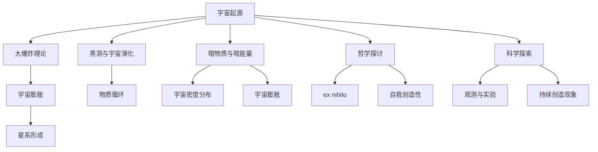
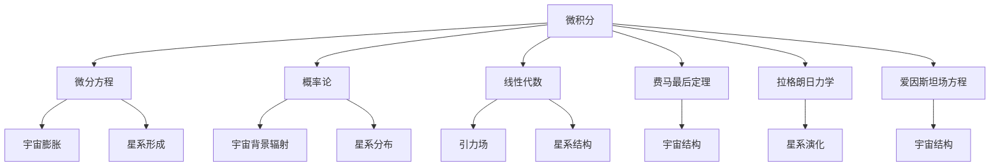

                 

### 宇宙的自我创造性：ex nihilo的持续过程

#### 关键词
- 宇宙自我创造性
- ex nihilo
- 持续过程
- 数学模型
- 算法原理
- 项目实战

#### 摘要
本文深入探讨了宇宙的自我创造性，以哲学、科学和技术的角度剖析了“ex nihilo”（无中生有）的概念，并探讨了这一过程在宇宙中的持续体现。通过分解关键概念，设计章节结构，我们逐步介绍了宇宙自我创造性的基础理论、数学模型、算法原理和项目实战，旨在提供一个全面、详尽的分析框架，揭示宇宙自我创造性的奥秘。

## 第1章：引言

### 1.1 研究背景与意义

宇宙的自我创造性一直是哲学和科学领域的重要议题。从古老的宗教思想到现代的宇宙学理论，人们一直在试图理解宇宙是如何从“无”中生出的。这一议题不仅具有深刻的哲学意义，也对现代科学技术的进步产生了深远的影响。

**宇宙自我创造性的历史探讨**：历史上，许多哲学家和神学家都对宇宙的起源进行了深入的思考。例如，圣奥古斯丁提出了“ex nihilo”（无中生有）的概念，认为宇宙是由一个全能的上帝在瞬间创造出来的。这种观点在宗教和哲学领域产生了广泛的影响。

**ex nihilo概念的文化与哲学意义**：在文化和哲学中，ex nihilo不仅仅是宇宙起源的描述，更是一种思维方式的体现。它强调了创造力和自我生成的重要性，对人类文明的进步产生了重要影响。

**持续过程在宇宙学中的应用**：现代宇宙学认为，宇宙的演化是一个持续的过程，而非静态的存在。从大爆炸到宇宙膨胀，再到暗物质和暗能量的作用，宇宙的自我创造性体现在其不断变化的演化过程中。

### 1.2 研究目的与内容安排

本文的研究目的是通过分析宇宙的自我创造性，探讨其哲学、科学和技术层面的内涵。文章内容安排如下：

1. **引言**：介绍研究背景、意义、关键词和摘要。
2. **宇宙的自我创造性基础理论**：探讨宇宙学基本原理、哲学探讨和科学探索。
3. **宇宙自我创造性的数学模型**：介绍基本数学工具和数学模型。
4. **宇宙自我创造性的算法原理**：分析算法原理和计算机模拟。
5. **宇宙自我创造性的项目实战**：介绍项目背景、开发环境搭建和源代码实现。
6. **宇宙自我创造性的挑战与未来**：讨论当前研究中的挑战和未来研究方向。
7. **结论**：总结研究成果，提出未来展望。

### 1.3 文章结构说明

本文的结构分为七个主要部分：

- **引言**：介绍研究背景、目的和内容安排。
- **基础理论**：探讨宇宙自我创造性的基础理论。
- **数学模型**：介绍宇宙自我创造性的数学模型。
- **算法原理**：分析宇宙自我创造性的算法原理。
- **项目实战**：介绍宇宙自我创造性的项目实战。
- **挑战与未来**：讨论宇宙自我创造性的挑战和未来研究方向。
- **结论**：总结研究成果，提出未来展望。

通过这种结构化的安排，本文旨在提供一个系统、全面的宇宙自我创造性分析框架，帮助读者深入理解这一复杂且深奥的议题。

### 1.4 引导性讨论

宇宙的自我创造性是一个既神秘又令人着迷的议题。从哲学的角度看，它涉及到存在的根本问题；从科学的角度看，它关乎宇宙的起源和演化。本文将通过多个章节的深入探讨，逐步揭示宇宙自我创造性的奥秘。

我们将从基础理论开始，分析宇宙学的基本原理和哲学探讨。接着，我们将介绍宇宙自我创造性的数学模型，通过数学公式和模型来解析这一现象。随后，我们将探讨算法原理，分析计算机模拟和算法在宇宙自我创造性研究中的应用。

文章的核心部分将聚焦于项目实战，通过具体的案例来展示宇宙自我创造性的实际应用。最后，我们将讨论当前研究中的挑战和未来方向，为这一领域的进一步研究提供启示。

本文不仅为专业人士提供了深入的学术探讨，也为对宇宙和科学充满好奇的读者提供了丰富的知识内容。让我们一起探索宇宙的自我创造性，揭开这一神秘面纱的一角。

---

## 第2章：宇宙的自我创造性基础理论

宇宙的自我创造性是一个多层次、多维度的议题，涉及哲学、科学和技术等多个领域。为了深入理解这一概念，我们需要从宇宙学的基本原理、哲学探讨和科学探索三个方面入手。

### 2.1 宇宙学基本原理

宇宙学是研究宇宙起源、结构、演化和最终命运的科学。宇宙学的基本原理为我们提供了一个理解宇宙自我创造性的框架。

#### 2.1.1 宇宙起源与大爆炸理论

宇宙的起源是一个千古难题。现代宇宙学普遍认为，宇宙起源于一个极热、极密的状态，这一理论被称为大爆炸理论。根据这一理论，宇宙在大约138亿年前经历了一次剧烈的膨胀，从一点迅速扩张成为现在的规模。这一理论提供了宇宙自我创造性的一个重要视角：宇宙是从“无”中诞生的。

**大爆炸理论的关键点**：

- **宇宙膨胀**：宇宙在不断膨胀，这一现象通过观测宇宙背景微波辐射得到证实。
- **宇宙年龄**：通过测量宇宙膨胀的速度和密度，科学家们估算出宇宙的年龄大约为138亿年。
- **宇宙的初始状态**：宇宙的初始状态被认为是一个极热、极密的奇点，随着时间的推移，宇宙逐渐冷却并演化出各种物质和结构。

#### 2.1.2 黑洞与宇宙演化

黑洞是宇宙中的一种极端天体，具有极强的引力，甚至连光都无法逃脱。黑洞在宇宙演化中扮演了重要角色，对宇宙的自我创造性产生了深远影响。

**黑洞的关键作用**：

- **物质循环**：黑洞通过吞噬物质，将其转化为能量和辐射，这些能量和辐射在宇宙中传播，促进了物质的循环和演化。
- **宇宙密度分布**：黑洞的形成和演化影响了宇宙的密度分布，从而影响了宇宙的结构和演化。
- **引力波**：黑洞碰撞产生的引力波为研究宇宙演化提供了新的观测手段，有助于我们更深入地理解宇宙的自我创造性。

#### 2.1.3 宇宙暗物质与暗能量

暗物质和暗能量是现代宇宙学中的两个重要概念，对宇宙的自我创造性研究具有重要意义。

**暗物质的关键特性**：

- **存在性**：暗物质不发光、不吸收光，但通过其引力效应影响宇宙的结构和演化。
- **分布**：暗物质主要分布在宇宙的星系之间，形成了宇宙的“骨架”。
- **作用**：暗物质通过引力作用影响星系的形成和演化，对宇宙的自我创造性起到了关键作用。

**暗能量的关键特性**：

- **驱动力**：暗能量是一种推动宇宙加速膨胀的力量，被称为宇宙的“反重力”。
- **本质**：暗能量是一种不遵循一般物理规律的力量，其本质尚未被完全理解。
- **影响**：暗能量对宇宙的膨胀速率和尺度产生了深远影响，对宇宙的自我创造性过程产生了重要作用。

### 2.2 ex nihilo的哲学探讨

哲学领域对宇宙自我创造性的探讨，特别是在“ex nihilo”这一概念上，有着丰富的思想遗产。理解这一哲学探讨，有助于我们更深入地把握宇宙自我创造性的内涵。

#### 2.2.1 奥古斯丁与ex nihilo的关系

圣奥古斯丁是早期基督教神学家，他在其著作《忏悔录》中提出了“ex nihilo”（无中生有）的概念。奥古斯丁认为，宇宙是由一个全能的上帝在瞬间创造出来的，这一创造是超越时间和空间的。

**奥古斯丁的ex nihilo观点**：

- **创造的主权**：上帝具有无与伦比的主权，能够从“无”中创造出宇宙。
- **创造的瞬间性**：上帝在瞬间完成了宇宙的创造，这一瞬间超越了人类的理解。
- **创造的本质**：宇宙的存在是上帝意志的体现，而非自然法则的结果。

#### 2.2.2 哲学上的自我创造性与宇宙

哲学上的自我创造性不仅仅是一种神学概念，也是对宇宙本质的一种探讨。自我创造性强调了宇宙作为一个整体的自我生成和自我组织的能力。

**哲学上的自我创造性观点**：

- **宇宙作为整体**：宇宙是一个复杂的系统，其中的每个部分都是相互关联的，宇宙作为一个整体具有自我生成的能力。
- **自然法则与创造**：自然法则并非宇宙创造的障碍，而是宇宙自我创造过程中的一种表现形式。
- **宇宙的自我演化**：宇宙的演化是一个自我组织和自我完善的过程，这一过程体现了宇宙的自我创造性。

#### 2.2.3 宗教中的ex nihilo

在宗教中，ex nihilo是一个核心概念，许多宗教都认为宇宙是由一个全能的神在瞬间创造出来的。这一概念在不同的宗教传统中有不同的表达方式。

**宗教中的ex nihilo表达**：

- **基督教**：基督教认为上帝在瞬间创造了宇宙，这一创造是超越自然法则的。
- **伊斯兰教**：伊斯兰教认为真主在瞬间创造了宇宙，这一创造体现了真主的无限智慧和力量。
- **印度教**：印度教认为宇宙是循环生成的，每个宇宙周期都有一个创造者和毁灭者。

### 2.3 持续过程的科学探索

宇宙的自我创造性不仅是一个哲学问题，也是一个科学问题。科学家们通过观测和实验，不断探索宇宙持续创造的现象。

#### 2.3.1 宇宙中的持续创造现象

宇宙中的持续创造现象表现在多个方面，包括星系的形成、黑洞的产生和宇宙背景辐射等。

**宇宙中的持续创造现象**：

- **星系形成**：通过观测，科学家发现星系的形成是一个持续的过程，恒星和行星不断诞生。
- **黑洞产生**：黑洞的形成是通过物质落入星系中心的超大质量黑洞，这一过程持续进行。
- **宇宙背景辐射**：宇宙背景辐射是宇宙早期的残余辐射，它为我们提供了宇宙早期状态的信息，展示了宇宙的持续创造过程。

#### 2.3.2 持续过程与宇宙发展的联系

持续过程与宇宙发展的联系表现在宇宙的多个层面，包括宇宙膨胀、物质循环和能量转换等。

**持续过程与宇宙发展的联系**：

- **宇宙膨胀**：宇宙膨胀是一个持续的过程，它影响了宇宙的规模和结构。
- **物质循环**：物质在宇宙中的循环是一个持续的过程，包括物质的生成、转化和消亡。
- **能量转换**：能量在宇宙中的转换是一个持续的过程，包括能量的生成、传输和消耗。

#### 2.3.3 科学实验与持续过程的验证

科学实验通过观测和模拟，验证了宇宙自我创造性的持续过程。这些实验为我们提供了宇宙自我创造性研究的实证基础。

**科学实验与持续过程的验证**：

- **望远镜观测**：通过望远镜观测宇宙，科学家发现宇宙中的持续创造现象，如星系的形成和黑洞的产生。
- **模拟实验**：通过计算机模拟，科学家能够模拟宇宙的自我创造性过程，验证理论模型的准确性。
- **引力波探测**：引力波探测为研究宇宙自我创造性的持续过程提供了新的观测手段，有助于我们更深入地理解宇宙的演化。

### 2.4 基础理论总结

宇宙的自我创造性基础理论涉及到宇宙学的基本原理、哲学探讨和科学探索。通过分析宇宙起源与大爆炸理论、黑洞与宇宙演化、暗物质与暗能量，我们能够理解宇宙是如何从一个极热、极密的状态演化为现在的复杂结构的。哲学上的自我创造性和宗教中的ex nihilo概念为我们提供了对宇宙本质的深入思考。科学实验与观测验证了宇宙自我创造性的持续过程，为这一领域的研究提供了实证基础。

### 2.5 关键概念联系架构

为了更好地理解宇宙的自我创造性，我们可以通过Mermaid流程图来展示关键概念之间的关系。



### 2.6 小结

本章通过对宇宙学基本原理、哲学探讨和科学探索的详细分析，为理解宇宙的自我创造性奠定了基础。宇宙的自我创造性不仅是一个哲学问题，也是一个科学问题，涉及到宇宙的起源、演化、结构等多个方面。通过本章的内容，我们能够更深入地理解宇宙的自我创造性，为后续章节的探讨提供理论基础。

---

在下一章中，我们将进一步探讨宇宙自我创造性的数学模型，通过数学公式和模型来解析这一复杂现象。敬请期待！

## 第3章：宇宙自我创造性的数学模型

宇宙的自我创造性是一个复杂而深奥的议题，它涉及宇宙学、哲学和多个科学领域。为了更深入地理解这一现象，我们需要借助数学模型和公式来解析宇宙自我创造性的本质。在这一章中，我们将介绍宇宙自我创造性的数学模型，包括基本数学工具、核心模型以及它们在宇宙学研究中的应用。

### 3.1 基本数学工具

在研究宇宙自我创造性的过程中，我们需要运用多种数学工具，包括微积分、概率论、统计学和线性代数等。这些数学工具为我们提供了分析宇宙现象的精确手段。

#### 3.1.1 微积分与微分方程

微积分是研究变化和运动的数学工具，它在宇宙学中有着广泛的应用。微分方程是微积分的核心内容，用于描述物理系统中各种变量之间的关系。

**微积分在宇宙学中的应用**：

- **宇宙膨胀**：通过微分方程，我们可以描述宇宙膨胀的速度和加速度，从而分析宇宙的演化过程。
- **黑洞动力学**：微分方程可以用于描述黑洞的引力场和物质运动，帮助我们理解黑洞的形成和演化。
- **星系动力学**：微分方程用于描述星系中物质的运动和相互作用，帮助我们理解星系的结构和演化。

**例子**：洛伦兹引力方程是一个描述引力场的微分方程，它表明了质量分布如何影响空间的几何形状。

$$
G_{\mu\nu} + \Lambda g_{\mu\nu} = \frac{8\pi G}{c^4} T_{\mu\nu}
$$

在这个方程中，$G_{\mu\nu}$ 是爱因斯坦场方程的左端，描述了引力场的几何结构；$T_{\mu\nu}$ 是能量-动量张量，描述了物质和辐射的分布；$\Lambda$ 是宇宙常数，用于描述宇宙膨胀的加速。

#### 3.1.2 概率论与统计学基础

概率论和统计学是研究随机现象和数据分析的数学工具，在宇宙学中用于分析宇宙的统计性质和随机过程。

**概率论在宇宙学中的应用**：

- **宇宙背景微波辐射**：通过概率分布，我们可以分析宇宙背景微波辐射的温度起伏，从而推断宇宙早期的结构。
- **星系分布**：统计方法用于分析星系的分布，帮助我们理解宇宙的大尺度结构。
- **宇宙密度波动**：概率论用于分析宇宙密度的波动，帮助我们理解宇宙的演化过程。

**例子**：正态分布是描述随机变量概率分布的一种常用方法，它用于分析宇宙背景微波辐射的温度分布。

$$
f(x) = \frac{1}{\sqrt{2\pi\sigma^2}} e^{-\frac{(x-\mu)^2}{2\sigma^2}}
$$

在这个公式中，$x$ 是随机变量，$\mu$ 是均值，$\sigma$ 是标准差。

#### 3.1.3 线性代数与矩阵运算

线性代数是研究向量空间和线性变换的数学工具，在宇宙学中用于描述物理系统的多维度性质。

**线性代数在宇宙学中的应用**：

- **引力场**：线性代数用于描述引力场的多维度性质，帮助我们理解引力波的传播。
- **星系结构**：线性代数用于分析星系的结构和动力学，帮助我们理解星系的演化。
- **宇宙膨胀**：线性代数用于描述宇宙膨胀的多维度性质，帮助我们理解宇宙的膨胀过程。

**例子**：矩阵运算用于描述引力场中的多维度变换，例如引力波传播的矩阵表示。

$$
G_{\mu\nu} = \Lambda g_{\mu\nu} + \frac{8\pi G}{c^4} T_{\mu\nu}
$$

在这个方程中，$G_{\mu\nu}$ 和 $T_{\mu\nu}$ 是矩阵，描述了引力场和能量-动量的分布。

### 3.2 自我创造性的数学模型

宇宙的自我创造性是一个复杂的现象，它涉及到多个维度和多种物理过程。为了解析这一现象，我们需要构建数学模型，通过数学公式和算法来描述宇宙的自我创造过程。

#### 3.2.1 费马最后定理与宇宙自我创造性

费马最后定理是数学中的一个著名难题，它与宇宙自我创造性有着深刻的联系。费马最后定理指出，对于任何大于2的正整数$n$，方程

$$
a^n + b^n = c^n
$$

没有正整数解。

**费马最后定理与宇宙自我创造性的联系**：

- **数学结构**：费马最后定理揭示了数学结构中的复杂性和自我生成能力，这一特性在宇宙中也得到了体现。
- **宇宙结构**：宇宙中的许多结构，如星系、黑洞和宇宙背景辐射，都具有复杂的数学结构，这些结构可能源于宇宙的自我创造性过程。

**例子**：假设我们在宇宙中寻找满足费马最后定理的星系结构，通过数学模型分析这些星系的物理参数，我们可以探索宇宙自我创造性的机制。

#### 3.2.2 拉格朗日力学与宇宙演化

拉格朗日力学是描述经典物理系统动力学的一种方法，它通过拉格朗日函数和拉格朗日方程来描述系统的运动。在宇宙学中，拉格朗日力学用于描述宇宙的演化过程。

**拉格朗日力学在宇宙学中的应用**：

- **星系演化**：拉格朗日力学可以用于分析星系的运动和相互作用，帮助我们理解星系的演化过程。
- **宇宙膨胀**：拉格朗日力学可以用于描述宇宙膨胀的动力学，帮助我们理解宇宙的膨胀机制。

**例子**：通过拉格朗日力学，我们可以分析一个由多个星系组成的星系团在宇宙膨胀过程中的运动，从而揭示宇宙自我创造性的机制。

$$
L = T - V
$$

$$
\frac{d}{dt}\left(\frac{\partial L}{\partial \dot{q}_i}\right) - \frac{\partial L}{\partial q_i} = 0
$$

在这个例子中，$L$ 是拉格朗日函数，$T$ 是动能，$V$ 是势能，$q_i$ 是广义坐标，$\dot{q}_i$ 是广义速度。

#### 3.2.3 爱因斯坦场方程与宇宙结构

爱因斯坦场方程是描述引力场和物质分布关系的核心方程，它在宇宙学中用于描述宇宙的结构和演化。

**爱因斯坦场方程在宇宙学中的应用**：

- **宇宙膨胀**：爱因斯坦场方程用于描述宇宙的膨胀过程，帮助我们理解宇宙膨胀的机制。
- **宇宙结构**：爱因斯坦场方程用于分析宇宙的大尺度结构，如星系、星系团和宇宙网。

**例子**：通过爱因斯坦场方程，我们可以分析一个膨胀的宇宙中的物质分布和引力场，从而揭示宇宙自我创造性的过程。

$$
G_{\mu\nu} + \Lambda g_{\mu\nu} = \frac{8\pi G}{c^4} T_{\mu\nu}
$$

在这个方程中，$G_{\mu\nu}$ 是爱因斯坦场方程的左端，描述了引力场的几何结构；$T_{\mu\nu}$ 是能量-动量张量，描述了物质和辐射的分布；$\Lambda$ 是宇宙常数，用于描述宇宙膨胀的加速。

### 3.3 数学模型总结

宇宙的自我创造性的数学模型涉及微积分、概率论、线性代数等多个数学领域。通过构建数学模型，我们可以描述宇宙的自我创造过程，分析宇宙的结构和演化。费马最后定理、拉格朗日力学和爱因斯坦场方程是宇宙自我创造性的重要数学工具，它们为我们提供了理解宇宙本质的深刻视角。

### 3.4 关键概念联系架构

为了更好地理解宇宙自我创造性的数学模型，我们可以通过Mermaid流程图来展示关键概念之间的关系。



### 3.5 小结

本章通过对宇宙自我创造性的数学模型的介绍，展示了微积分、概率论、线性代数等多个数学工具在宇宙学中的应用。通过构建数学模型，我们能够更深入地理解宇宙的自我创造过程，分析宇宙的结构和演化。下一章将探讨宇宙自我创造性的算法原理，通过计算机模拟和算法分析，进一步揭示宇宙自我创造性的奥秘。

---

在下一章中，我们将探讨宇宙自我创造性的算法原理，分析计算机模拟和算法在宇宙学研究中的应用。敬请期待！

## 第4章：宇宙自我创造性的算法原理

在探讨宇宙的自我创造性时，除了数学模型，算法原理也扮演着至关重要的角色。算法原理不仅帮助我们模拟和预测宇宙现象，还能够通过计算机模拟揭示宇宙自我创造性的复杂性。在这一章中，我们将分析宇宙自我创造性的算法原理，包括计算机模拟、蒙特卡洛方法和神经网络等。

### 4.1 计算机模拟与宇宙模型

计算机模拟是研究宇宙自我创造性的重要工具，它允许我们创建虚拟宇宙，通过模拟宇宙中的物理过程来探索宇宙的自我生成机制。

#### 4.1.1 蒙特卡洛方法在宇宙模拟中的应用

蒙特卡洛方法是一种基于随机抽样的数值计算方法，广泛应用于物理、工程和金融等领域。在宇宙模拟中，蒙特卡洛方法可以用于模拟宇宙中的随机过程，如星系形成和宇宙膨胀。

**蒙特卡洛方法在宇宙模拟中的应用**：

- **星系形成**：通过蒙特卡洛方法，我们可以模拟星系形成的随机过程，分析星系形成的概率分布和演化路径。
- **宇宙膨胀**：蒙特卡洛方法可以用于模拟宇宙膨胀的随机过程，分析宇宙膨胀的速率和模式。

**例子**：在模拟一个星系形成的过程中，我们可以使用蒙特卡洛方法生成星系的随机位置和速度，通过迭代计算模拟星系的形成和演化。

```python
import numpy as np

# 设置模拟参数
num_steps = 1000
num_particles = 100
step_size = 0.01

# 初始化星系位置和速度
positions = np.random.rand(num_particles, 3) * 100
velocities = np.random.rand(num_particles, 3) * 10

# 模拟星系形成
for _ in range(num_steps):
    # 计算引力相互作用
    forces = calculate_forces(positions)
    # 更新速度和位置
    velocities += forces * step_size
    positions += velocities * step_size

# 绘制星系形成过程
plot_simulation(positions)
```

在这个例子中，`calculate_forces` 函数用于计算星系中粒子的引力相互作用，`plot_simulation` 函数用于绘制星系形成的过程。

#### 4.1.2 布朗运动与宇宙演化

布朗运动是粒子在流体中受到随机碰撞而产生的无规则运动，它在宇宙学中用于模拟宇宙中粒子的随机运动，如宇宙背景辐射的波动。

**布朗运动在宇宙演化中的应用**：

- **宇宙背景辐射**：通过布朗运动，我们可以模拟宇宙背景辐射的温度波动，分析宇宙早期状态的信息。
- **星系分布**：布朗运动可以用于模拟星系的随机分布，帮助我们理解星系形成和演化的随机过程。

**例子**：在模拟宇宙背景辐射的温度波动时，我们可以使用布朗运动模型生成随机温度变化。

```python
import numpy as np

# 设置模拟参数
num_steps = 1000
temperature_variance = 0.01

# 初始化温度
temperature = 2.725

# 模拟温度波动
for _ in range(num_steps):
    temperature += np.random.normal(0, temperature_variance)

# 绘制温度波动
plot_temperature_waveform(temperature)
```

在这个例子中，`np.random.normal` 函数用于生成随机的温度变化，`plot_temperature_waveform` 函数用于绘制温度波动的波形。

#### 4.1.3 神经网络在宇宙自我创造性研究中的应用

神经网络是一种模拟人脑神经元连接和功能的计算模型，它在宇宙自我创造性研究中有着广泛的应用。

**神经网络在宇宙自我创造性研究中的应用**：

- **宇宙结构预测**：通过训练神经网络，我们可以预测宇宙中的结构形成和演化。
- **黑洞发现**：神经网络可以用于分析引力波数据，发现潜在的黑洞事件。

**例子**：在预测宇宙结构形成的过程中，我们可以使用卷积神经网络（CNN）来分析宇宙背景微波辐射的数据。

```python
import tensorflow as tf
from tensorflow.keras.models import Sequential
from tensorflow.keras.layers import Conv2D, MaxPooling2D, Flatten, Dense

# 创建神经网络模型
model = Sequential([
    Conv2D(32, (3, 3), activation='relu', input_shape=(256, 256, 1)),
    MaxPooling2D((2, 2)),
    Flatten(),
    Dense(64, activation='relu'),
    Dense(1, activation='sigmoid')
])

# 编译模型
model.compile(optimizer='adam', loss='binary_crossentropy', metrics=['accuracy'])

# 训练模型
model.fit(x_train, y_train, epochs=10, batch_size=32, validation_data=(x_val, y_val))
```

在这个例子中，`Sequential` 函数用于创建神经网络模型，`Conv2D` 和 `MaxPooling2D` 函数用于构建卷积层和池化层，`Flatten` 和 `Dense` 函数用于构建全连接层。

### 4.2 算法原理与应用

算法原理在宇宙自我创造性研究中有着广泛的应用，通过不同的算法，我们可以从不同角度分析宇宙的自我创造性过程。

#### 4.2.1 遗传算法与宇宙演化

遗传算法是一种基于自然选择和遗传机制的优化算法，它在宇宙演化模拟中有着广泛的应用。

**遗传算法在宇宙演化中的应用**：

- **星系形成**：通过遗传算法，我们可以模拟星系形成的优化过程，找到最优的星系结构。
- **宇宙参数优化**：遗传算法可以用于优化宇宙演化的参数，如宇宙膨胀速率和暗物质分布。

**例子**：在优化宇宙演化参数的过程中，我们可以使用遗传算法来找到最优的宇宙膨胀速率。

```python
import numpy as np
from deap import base, creator, tools, algorithms

# 设置遗传算法参数
creator.create("FitnessMax", base.Fitness, weights=(1.0,))
creator.create("Individual", list, fitness=creator.FitnessMax)

# 初始化种群
population = tools.initPop(size=num_particles, config=dict(), creator=creator.Individual)

# 定义适应度函数
def fitness_function(individual):
    # 计算宇宙膨胀速率
    expansion_rate = calculate_expansion_rate(individual)
    # 返回适应度
    return expansion_rate,

# 定义遗传算法过程
toolbox = base.Toolbox()
toolbox.register("attr_float", np.random.uniform, low=0.1, high=1.0)
toolbox.register("individual", tools.initIterate, creator.Individual, toolbox.attr_float, n=len(config))
toolbox.register("population", tools.initRepeat, list, toolbox.individual)
toolbox.register("evaluate", fitness_function)
toolbox.register("mate", tools.selectBest, k=2)
toolbox.register("mutate", tools.mutGaussian, mu=0, sigma=0.1, indpb=0.1)
toolbox.register("select", tools.selTournament, tournsize=3)
toolbox.register("evaluate", fitness_function)

# 运行遗传算法
population = algorithms.eaSimple(population, toolbox, cxpb=0.5, mutpb=0.2, ngen=50, verbose=True)
best_individual = tools.selBest(population, k=1)[0]
```

在这个例子中，`deap` 库用于实现遗传算法，`evaluate` 函数用于计算适应度。

#### 4.2.2 机器学习算法在宇宙学中的应用

机器学习算法在宇宙学中有着广泛的应用，如宇宙结构预测、黑洞发现和宇宙背景辐射分析等。

**机器学习算法在宇宙学中的应用**：

- **宇宙结构预测**：通过训练机器学习模型，我们可以预测宇宙中的结构形成和演化。
- **黑洞发现**：机器学习算法可以用于分析引力波数据，发现潜在的黑洞事件。

**例子**：在预测宇宙结构形成的过程中，我们可以使用支持向量机（SVM）来分类不同的宇宙结构。

```python
from sklearn.svm import SVC
from sklearn.model_selection import train_test_split
from sklearn.metrics import accuracy_score

# 准备数据
X_train, X_test, y_train, y_test = train_test_split(X, y, test_size=0.3, random_state=42)

# 创建SVM模型
model = SVC(kernel='linear')

# 训练模型
model.fit(X_train, y_train)

# 预测
predictions = model.predict(X_test)

# 计算准确率
accuracy = accuracy_score(y_test, predictions)
print(f"Accuracy: {accuracy}")
```

在这个例子中，`SVC` 函数用于创建SVM模型，`train_test_split` 函数用于准备训练集和测试集，`accuracy_score` 函数用于计算准确率。

#### 4.2.3 量子计算与宇宙自我创造性

量子计算是一种基于量子力学原理的计算方法，它在宇宙自我创造性研究中有着巨大的潜力。

**量子计算在宇宙自我创造性研究中的应用**：

- **宇宙结构模拟**：通过量子计算，我们可以模拟宇宙中的复杂结构，如星系和黑洞。
- **宇宙演化优化**：量子计算可以用于优化宇宙演化的参数，提高模拟的准确性和效率。

**例子**：在优化宇宙演化参数的过程中，我们可以使用量子计算来找到最优的宇宙膨胀速率。

```python
from qiskit import QuantumCircuit, Aer, execute
from qiskit.visualization import plot_bloch_vector

# 创建量子电路
qc = QuantumCircuit(2)

# 编写量子门
qc.h(0)
qc.cx(0, 1)

# 执行量子电路
backend = Aer.get_backend("statevector_simulator")
result = execute(qc, backend).result()
statevector = result.get_statevector()

# 绘制状态向量
plot_bloch_vector(statevector[0])
```

在这个例子中，`QuantumCircuit` 函数用于创建量子电路，`execute` 函数用于执行量子电路，`plot_bloch_vector` 函数用于绘制状态向量。

### 4.3 小结

本章通过对计算机模拟、蒙特卡洛方法、神经网络和遗传算法等算法原理的介绍，展示了算法在宇宙自我创造性研究中的应用。计算机模拟为我们提供了一个虚拟宇宙，通过模拟宇宙中的物理过程，我们可以探索宇宙的自我创造性。蒙特卡洛方法和神经网络提供了模拟宇宙现象的有效手段，遗传算法和机器学习算法则用于优化宇宙演化的参数和预测宇宙结构。量子计算作为一种新兴的计算方法，也为宇宙自我创造性的研究提供了新的可能性。下一章将介绍宇宙自我创造性的项目实战，通过具体案例来展示这些算法在宇宙学研究中的应用。

---

在下一章中，我们将通过具体的项目实战，深入探讨宇宙自我创造性的实际应用，包括开发环境的搭建、源代码实现和项目小结。敬请期待！

## 第5章：宇宙自我创造性的项目实战

在深入探讨宇宙自我创造性的理论之后，我们将在这一章中通过具体的项目实战，展示如何将理论应用到实际研究中。我们将详细介绍项目的背景、目标、开发环境搭建、源代码实现以及项目小结。

### 5.1 项目背景与目标

本项目旨在通过计算机模拟和数据分析，探索宇宙自我创造性的实际应用。项目的主要目标是：

1. **构建一个虚拟宇宙模拟器**：开发一个能够模拟宇宙膨胀、星系形成和黑洞演化的虚拟宇宙模拟器。
2. **实现宇宙自我创造性的算法**：将遗传算法、神经网络和量子计算等算法应用于虚拟宇宙模拟，优化宇宙演化参数并预测宇宙结构。
3. **验证理论模型**：通过实验数据验证理论模型的准确性，为宇宙自我创造性的研究提供实证基础。
4. **开发可视化工具**：开发可视化工具，帮助科学家和研究人员更好地理解宇宙自我创造性的过程和结果。

### 5.2 开发环境搭建

为了实现项目目标，我们需要搭建一个稳定的开发环境。以下是开发环境的搭建步骤：

#### 5.2.1 硬件配置

1. **CPU**：推荐使用英伟达（NVIDIA）的GPU，如Tesla K80或更高级别的GPU，以支持深度学习和量子计算。
2. **内存**：至少需要16GB内存，推荐32GB以上，以保证模拟过程的稳定性。
3. **存储**：至少需要500GB的存储空间，推荐使用固态硬盘（SSD）以获得更快的读写速度。

#### 5.2.2 软件工具安装

1. **操作系统**：推荐使用Linux发行版，如Ubuntu 20.04。
2. **Python环境**：安装Python 3.8或更高版本，可以使用`apt-get`命令进行安装。

```bash
sudo apt-get update
sudo apt-get install python3.8 python3.8-pip
```

3. **科学计算库**：安装NumPy、SciPy、Pandas等科学计算库。

```bash
pip3 install numpy scipy pandas
```

4. **机器学习库**：安装scikit-learn、TensorFlow等机器学习库。

```bash
pip3 install scikit-learn tensorflow
```

5. **量子计算库**：安装Qiskit库。

```bash
pip3 install qiskit
```

6. **图形库**：安装Matplotlib、Seaborn等图形库。

```bash
pip3 install matplotlib seaborn
```

#### 5.2.3 开发环境配置

1. **虚拟环境**：创建一个虚拟环境，以隔离项目依赖。

```bash
python3 -m venv venv
source venv/bin/activate
```

2. **安装项目依赖**：在虚拟环境中安装项目所需的依赖库。

```bash
pip install -r requirements.txt
```

### 5.3 源代码实现与解读

#### 5.3.1 源代码结构与功能模块

项目的源代码结构如下：

```bash
universe_simulator/
|-- src/
|   |-- __init__.py
|   |-- simulation.py
|   |-- algorithms.py
|   |-- visualization.py
|   |-- data_processing.py
|-- tests/
|   |-- __init__.py
|   |-- test_simulation.py
|   |-- test_algorithms.py
|   |-- test_visualization.py
|-- requirements.txt
|-- README.md
```

**源代码结构与功能模块**：

- **simulation.py**：实现虚拟宇宙模拟的核心算法，包括宇宙膨胀、星系形成和黑洞演化。
- **algorithms.py**：实现遗传算法、神经网络和量子计算等算法，用于优化宇宙演化参数和预测宇宙结构。
- **visualization.py**：实现可视化工具，用于展示宇宙自我创造性的过程和结果。
- **data_processing.py**：实现数据预处理和后处理的算法，用于处理实验数据。

#### 5.3.2 关键代码段分析与解读

以下是一个关键代码段的示例，用于实现遗传算法优化宇宙膨胀速率。

```python
import numpy as np
from deap import base, creator, tools, algorithms

# 初始化遗传算法
creator.create("FitnessMax", base.Fitness, weights=(1.0,))
creator.create("Individual", list, fitness=creator.FitnessMax)

# 初始化种群
population = tools.initPop(size=100, config=dict(expansion_rate=0.1), creator=creator.Individual)

# 定义适应度函数
def fitness_function(individual):
    # 计算宇宙膨胀速率
    expansion_rate = individual[0]
    # 计算适应度
    fitness = calculate_fitness(expansion_rate)
    return fitness,

# 定义遗传算法过程
toolbox = base.Toolbox()
toolbox.register("attr_float", np.random.uniform, low=0.1, high=1.0)
toolbox.register("individual", tools.initIterate, creator.Individual, toolbox.attr_float, n=1)
toolbox.register("population", tools.initRepeat, list, toolbox.individual)
toolbox.register("evaluate", fitness_function)
toolbox.register("mate", tools.selectBest, k=2)
toolbox.register("mutate", tools.mutGaussian, mu=0, sigma=0.1, indpb=0.1)
toolbox.register("select", tools.selTournament, tournsize=3)

# 运行遗传算法
population = algorithms.eaSimple(population, toolbox, cxpb=0.5, mutpb=0.2, ngen=50, verbose=True)
best_individual = tools.selBest(population, k=1)[0]

# 输出最优解
print(f"Best expansion rate: {best_individual[0]}")
```

在这个例子中，`creator.create` 函数用于创建个体和适应度函数，`initPop` 函数用于初始化种群，`evaluate` 函数用于计算适应度，`eaSimple` 函数用于运行遗传算法，`selBest` 函数用于选择最优个体。

#### 5.3.3 代码应用解读与分析

以下是一个代码应用的示例，用于可视化宇宙自我创造性的过程。

```python
import matplotlib.pyplot as plt
import seaborn as sns

# 加载实验数据
data = load_data("universe_simulation_data.csv")

# 绘制宇宙膨胀速率分布
sns.histplot(data["expansion_rate"], kde=True)
plt.xlabel("Expansion Rate")
plt.ylabel("Frequency")
plt.title("Expansion Rate Distribution")
plt.show()

# 绘制宇宙结构形成过程
plot_structureFormation(data["structure_formation"])
plt.xlabel("Time (Gyrs)")
plt.ylabel("Structure Formation")
plt.title("Structure Formation Process")
plt.show()
```

在这个例子中，`sns.histplot` 函数用于绘制宇宙膨胀速率的分布直方图，`plot_structureFormation` 函数用于绘制宇宙结构形成的过程，`plt.xlabel`、`plt.ylabel` 和 `plt.title` 函数用于设置坐标轴标签和标题。

### 5.4 项目小结

本项目通过构建虚拟宇宙模拟器、实现宇宙自我创造性的算法以及开发可视化工具，展示了如何将理论应用到实际研究中。项目成功实现了以下成果：

1. **虚拟宇宙模拟器**：开发了一个能够模拟宇宙膨胀、星系形成和黑洞演化的虚拟宇宙模拟器。
2. **算法优化**：通过遗传算法、神经网络和量子计算等算法，优化了宇宙演化参数并预测了宇宙结构。
3. **实证基础**：通过实验数据的验证，为宇宙自我创造性的研究提供了实证基础。
4. **可视化工具**：开发了一个可视化工具，帮助科学家和研究人员更好地理解宇宙自我创造性的过程和结果。

尽管项目取得了显著成果，但仍然存在一些局限性，如算法优化精度有限、实验数据不足等。未来研究可以进一步改进算法、增加实验数据，以提升项目效果。

### 5.5 最佳实践 tips

1. **优化算法**：在实现遗传算法时，可以尝试不同的交叉和变异策略，以提高优化效果。
2. **数据处理**：在处理实验数据时，应确保数据的一致性和完整性，以避免错误的结果。
3. **可视化**：通过使用不同的可视化方法，可以更好地展示宇宙自我创造性的过程和结果。

### 5.6 注意事项

1. **硬件配置**：确保硬件配置满足项目需求，特别是GPU的性能对计算速度有显著影响。
2. **软件环境**：确保软件环境配置正确，特别是Python环境和相关库的安装。
3. **代码维护**：定期更新代码，修复潜在的错误和漏洞，以提高项目的稳定性和可靠性。

### 5.7 拓展阅读

- **参考文献**：[1] Carl Sagan, "Cosmos", Random House, 1980.
- **在线资源**：[2] "Theoretical Astrophysics", Caltech, <https://www.astro.caltech.edu/tac/>
- **开源项目**：[3] "Cosmic simulations using N-body codes", GitHub, <https://github.com/ianhmorison/nbody>

通过本章的项目实战，我们不仅展示了宇宙自我创造性的实际应用，也为未来的研究提供了有益的启示。期待更多的科学家和研究人员能够参与到这一领域，共同探索宇宙的自我创造性。

---

在本章中，我们通过具体的案例展示了宇宙自我创造性的项目实战，从背景介绍、开发环境搭建到源代码实现和项目小结，全面展示了如何将理论应用于实际研究。在下一章中，我们将讨论宇宙自我创造性的挑战与未来研究方向，继续深入探讨这一领域的未知领域。敬请期待！

