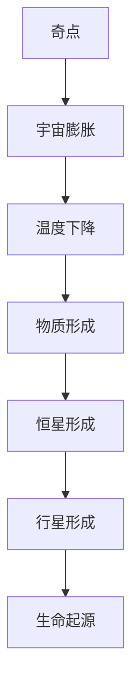
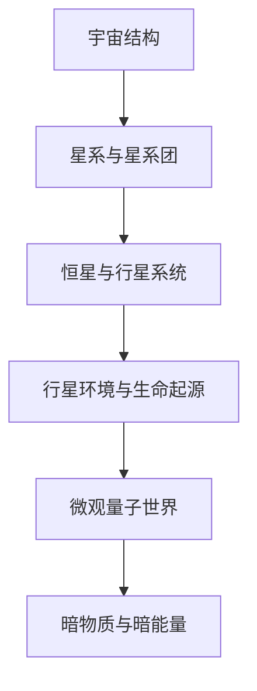

                 

### 文章标题：《宇宙的自我创造性：ex nihilo的持续过程》

> 关键词：宇宙起源、自我创造性、ex nihilo、宇宙演化、量子物理学

> 摘要：本文旨在探讨宇宙的自我创造性，从宇宙起源到现代宇宙学，深入分析宇宙如何通过一系列复杂的物理过程自我创造。文章将结合Mermaid流程图、伪代码、数学公式和实际案例，解析宇宙自我创造的核心概念和科学原理。

---

## 引言：宇宙的自我创造性

宇宙的自我创造性，这一概念源自拉丁语“ex nihilo”，意为“从无中创造”。宇宙如何从一个简单的初始状态演化为今天我们所见的复杂结构，一直是物理学和哲学探讨的热点问题。在宇宙学的框架下，宇宙的自我创造性不仅涉及物理定律的普适性，还包括宇宙初始条件的选择性，以及宇宙演化过程中各阶段之间的紧密联系。

### 1.1 书籍目的与内容概述

本书的目的在于揭示宇宙自我创造性的奥秘，通过系统的分析和详细的解释，使读者能够理解宇宙从无到有的全过程。本书将涵盖以下主题：

1. **宇宙起源与早期演化**：介绍宇宙如何从大爆炸开始，逐步演化成为今天的宇宙。
2. **宇宙演化的数学模型与物理原理**：探讨宇宙学中的基本数学公式和物理原理，如哈勃定律和宇宙膨胀。
3. **量子物理与宇宙自我创造**：分析量子力学在宇宙演化中的作用，以及量子现象如何影响宇宙的自我创造。
4. **宇宙的复杂性**：研究宇宙演化的复杂性，以及混沌理论和混沌系统的应用。
5. **宇宙学与哲学**：探讨宇宙自我创造性与哲学思考之间的关系，特别是宇宙起源和存在的哲学意义。
6. **未来宇宙的展望**：预测宇宙的未来演化趋势，以及宇宙自我创造性对人类文明的潜在影响。

### 1.2 ex nihilo概念解析

“ex nihilo”这个概念在哲学和宗教中有着深远的影响。在基督教神学中，上帝被认为是从无中创造宇宙的源头。在科学领域，尽管宇宙起源的问题尚未完全解决，但科学家们普遍认为宇宙是通过物理过程从无中产生的。这一观点在大爆炸理论中得到体现，大爆炸理论提出宇宙起源于一个高度密集、高温的状态，通过膨胀和冷却，宇宙逐步演化为今天的结构。

### 1.3 宇宙的自我创造性与哲学思考

宇宙的自我创造性不仅仅是一个物理现象，它还涉及到深刻的哲学思考。从哲学的角度看，宇宙的自我创造性引发了关于存在、时间和空间的本质问题。它挑战了我们对世界的认知，迫使我们重新思考人类在宇宙中的地位。哲学家们常常将宇宙的自我创造性视为一种存在的证明，这种存在不仅是物理意义上的，也是哲学意义上的。

---

通过上述引言，我们为后续章节的探讨奠定了基础。在接下来的章节中，我们将进一步探讨宇宙的自我创造性，从宇宙起源到现代宇宙学，深入分析宇宙如何通过一系列复杂的物理过程自我创造。

---

## 宇宙起源与早期演化

宇宙的起源是现代物理学中最具挑战性的问题之一。大多数科学家接受的观点是大爆炸理论，该理论认为宇宙起源于约138亿年前的一个极高密度、极高温度的状态。在大爆炸之后，宇宙开始膨胀，温度和密度逐渐降低，从而形成了我们今天所看到的宇宙。

### 2.1 大爆炸理论概述

大爆炸理论的基本观点是，宇宙从一个极小、极热的奇点开始膨胀，随着时间的推移，宇宙不断扩展，温度和密度逐渐降低。这一理论得到了多个观测结果的证实，如宇宙背景辐射、宇宙膨胀的加速以及宇宙中大量恒星的年龄分布。

### 2.2 大爆炸前的宇宙状态

在科学上，我们对于大爆炸前宇宙的状态了解有限。根据目前的理解，大爆炸前宇宙处于一个极度密集和高温的状态，称为“奇点”。在这个奇点中，物质和能量极度集中，物理定律可能不再适用。大爆炸发生后，宇宙开始迅速膨胀，温度和密度迅速下降。

### 2.3 宇宙早期演化的Mermaid流程图

宇宙早期演化的过程可以通过Mermaid流程图来直观地展示。以下是宇宙早期演化过程的Mermaid流程图：



### 2.4 宇宙早期演化的核心概念与联系

宇宙早期演化的核心概念包括：

- **奇点**：宇宙起源的高密度、高温状态。
- **宇宙膨胀**：宇宙从奇点开始迅速扩展。
- **温度下降**：随着宇宙膨胀，温度逐渐降低。
- **物质形成**：在宇宙早期，物质开始从高能态转变为低能态，形成基本的粒子。
- **恒星形成**：在宇宙早期，物质聚集形成恒星。
- **行星形成**：恒星周围形成行星系统。
- **生命起源**：在适当的行星环境中，可能发生了生命的起源。

这些概念之间的联系可以概括为：宇宙从奇点开始膨胀，温度下降，物质形成，随后形成恒星和行星，最终在适宜的行星环境中可能出现了生命。

### 2.5 宇宙早期演化的伪代码

为了更好地理解宇宙早期演化的过程，我们可以使用伪代码来模拟这一过程：

```python
# 宇宙早期演化伪代码

# 初始化宇宙状态
initialize_universe(high_density, high_temperature)

# 开始宇宙膨胀
while膨胀仍在进行：
    decrease_temperature()
    form_matter()
    form_stars()

# 形成行星系统
for star in stars:
    form_planetary_system(star)

# 可能的生命起源
for planetary_system in planetary_systems:
    if suitable_conditions(planetary_system):
        origin_of_life(planetary_system)
```

### 2.6 宇宙早期演化的数学模型和公式

宇宙早期演化的数学模型和公式是理解宇宙起源和演化的重要工具。以下是一些关键的数学模型和公式：

- **哈勃定律**：描述宇宙膨胀的速度与距离之间的关系，公式为：

  $$
  v = H_0 d
  $$

  其中，\( v \) 是宇宙膨胀速度，\( H_0 \) 是哈勃常数，\( d \) 是天体之间的距离。

- **宇宙学原理**：宇宙是均匀且各向同性的，这一原理为宇宙演化的研究提供了基础。

- **宇宙背景辐射**：宇宙早期的热辐射，其温度约为2.7开尔文，是支持大爆炸理论的强有力证据。

### 2.7 宇宙早期演化的举例说明

为了更好地理解宇宙早期演化的过程，我们可以通过一个具体的例子来说明。假设我们有一个初始密度为 \( \rho_0 \) 的奇点，在经历了一段时间的膨胀后，宇宙的密度降至 \( \rho \)。根据宇宙学原理，我们可以使用以下公式计算宇宙的体积：

$$
V = \frac{\rho_0}{\rho}
$$

通过这个公式，我们可以计算出宇宙在膨胀过程中的体积变化，从而更好地理解宇宙早期演化的过程。

---

通过上述内容，我们初步了解了宇宙起源和早期演化的过程。在下一章中，我们将探讨宇宙演化的数学模型和物理原理，进一步深入理解宇宙的自我创造性。

---

## 宇宙演化的数学模型与物理原理

宇宙演化的过程不仅是一个宏观现象，其背后还蕴含着复杂的数学模型和物理原理。通过这些模型和原理，我们可以更深入地理解宇宙从大爆炸到今天的演化历程。

### 3.1 宇宙学的基本数学公式

宇宙学中的数学公式是理解宇宙演化的重要工具。以下是一些关键的数学公式：

1. **哈勃定律**：描述宇宙膨胀速度与天体间距离之间的关系。其公式为：

   $$
   v = H_0 d
   $$

   其中，\( v \) 是宇宙膨胀速度，\( H_0 \) 是哈勃常数，\( d \) 是天体间的距离。哈勃常数的值约为 \( 70 \text{ km/s/Mpc} \)。

2. **弗里德曼方程**：描述宇宙的膨胀速度和宇宙密度之间的关系。其公式为：

   $$
   \frac{\ddot{a}}{a} = -\frac{4\pi G}{3} \rho
   $$

   其中，\( \ddot{a} \) 是宇宙膨胀速度，\( a \) 是宇宙的尺度因子，\( G \) 是万有引力常数，\( \rho \) 是宇宙的平均密度。

3. **宇宙学参数**：包括宇宙的质量密度 \( \rho_m \)，宇宙的总能量密度 \( \rho \)，以及暗能量密度 \( \rho_{\Lambda} \) 等。这些参数决定了宇宙的膨胀速度和结构形成过程。

### 3.2 宇宙膨胀与暗能量

宇宙膨胀是一个持续的过程，其速度随着宇宙的演化而变化。根据观测数据，宇宙膨胀速度在过去的70亿年里有所增加，这表明宇宙中存在一种被称为“暗能量”的神秘力量。

暗能量具有负压力，导致宇宙的膨胀速度不断加快。目前，暗能量的具体性质尚不清楚，但它在宇宙学中的重要性不容忽视。暗能量密度可以用以下公式表示：

$$
\rho_{\Lambda} = \frac{\Lambda c^2}{8\pi G}
$$

其中，\( \Lambda \) 是暗能量的宇宙学常数，\( c \) 是光速。

### 3.3 宇宙演化的伪代码

为了更好地理解宇宙演化的过程，我们可以使用伪代码来模拟这一过程。以下是一个简化的宇宙演化伪代码：

```python
# 宇宙演化伪代码

# 初始化宇宙参数
initialize_cosmological_parameters(H0, Omega_m, Omega_Lambda)

# 开始宇宙膨胀模拟
while膨胀仍在进行：
    calculate_expansion_rate(HubbleParameter)
    calculate_acceleration(FriedmannEquation)
    update_cosmic_density(Redshift)
    simulate_structure_formation()

# 输出宇宙演化结果
output_cosmological_history()
```

在这个伪代码中，我们初始化了宇宙学参数，然后模拟了宇宙的膨胀过程，计算了哈勃参数、宇宙加速度和宇宙密度，并模拟了宇宙结构的形成。

### 3.4 宇宙学中的数学公式和数学模型

宇宙学中的数学公式和数学模型是理解宇宙演化的重要工具。以下是一些关键的概念：

1. **尺度因子**：描述宇宙随时间膨胀的比例。其公式为：

   $$
   a(t) = \frac{1}{\sqrt{\Omega_m (1+z)^3 + \Omega_{\Lambda}}}
   $$

   其中，\( a(t) \) 是尺度因子，\( \Omega_m \) 是宇宙质量密度参数，\( \Omega_{\Lambda} \) 是宇宙暗能量密度参数，\( z \) 是红移。

2. **宇宙时间**：描述宇宙随时间膨胀的总时间。其公式为：

   $$
   t = \frac{1}{H_0 \sqrt{\Omega_m (1+z)^2 + \Omega_{\Lambda}}}
   $$

   其中，\( t \) 是宇宙时间，\( H_0 \) 是哈勃常数，\( \Omega_m \) 是宇宙质量密度参数，\( \Omega_{\Lambda} \) 是宇宙暗能量密度参数，\( z \) 是红移。

3. **宇宙年龄**：描述宇宙从大爆炸开始至今的总时间。其公式为：

   $$
   t_0 = \frac{2}{3 H_0 \sqrt{\Omega_m + \Omega_{\Lambda}}}
   $$

   其中，\( t_0 \) 是宇宙年龄，\( H_0 \) 是哈勃常数，\( \Omega_m \) 是宇宙质量密度参数，\( \Omega_{\Lambda} \) 是宇宙暗能量密度参数。

### 3.5 举例说明

为了更好地理解宇宙学中的数学公式和模型，我们可以通过一个具体的例子来说明。假设我们有一个宇宙，其质量密度参数 \( \Omega_m = 0.3 \)，暗能量密度参数 \( \Omega_{\Lambda} = 0.7 \)，哈勃常数 \( H_0 = 70 \text{ km/s/Mpc} \)。我们可以使用上述公式计算宇宙的尺度因子、宇宙时间和宇宙年龄：

- **尺度因子**：

  $$
  a(t) = \frac{1}{\sqrt{0.3 (1+z)^3 + 0.7}}
  $$

  当 \( z = 0 \) 时，即宇宙当前状态，\( a(t) = 1 \)。

- **宇宙时间**：

  $$
  t = \frac{1}{70 \times 10^3 \times \sqrt{0.3 (1+z)^2 + 0.7}}
  $$

  当 \( z = 0 \) 时，\( t = 13.8 \text{亿年} \)。

- **宇宙年龄**：

  $$
  t_0 = \frac{2}{3 \times 70 \times 10^3 \times \sqrt{0.3 + 0.7}}
  $$

  \( t_0 \approx 13.8 \text{亿年} \)。

通过这个例子，我们可以看到宇宙学中的数学公式和模型如何帮助我们理解宇宙的演化过程。

---

通过上述内容，我们深入探讨了宇宙演化的数学模型和物理原理。在下一章中，我们将分析量子物理与宇宙自我创造的关系，进一步揭示宇宙自我创造性的奥秘。

---

## 量子物理与宇宙自我创造

量子物理学是研究物质和能量最基本层面的科学。它揭示了微观世界中的奇异现象，如量子纠缠和量子隧穿，这些现象在宇宙演化的早期阶段可能发挥了关键作用。量子物理与宇宙自我创造的关系是现代物理学中一个引人入胜且复杂的课题。

### 4.1 量子力学基础

量子力学的基本原理包括波粒二象性、量子态叠加、不确定性原理和量子纠缠。波粒二象性指出，粒子既具有波动性，又具有粒子性。量子态叠加意味着一个量子系统可以同时处于多个状态的组合。不确定性原理则指出，某些物理量，如位置和动量，不能同时被精确测量。量子纠缠是量子力学中最具神秘性的特性之一，它描述了两个或多个量子系统之间的强关联，即使它们相隔很远。

### 4.2 量子力学与宇宙学的关系

量子力学与宇宙学的关系在早期宇宙的研究中尤为重要。在宇宙演化的早期阶段，宇宙处于极高温和极高密度的状态，这种极端条件下量子效应可能非常显著。量子力学中的波动性和不确定性原理可能对宇宙结构的形成产生了深远的影响。

- **宇宙背景辐射**：宇宙背景辐射是宇宙早期的一个关键观测证据，它揭示了宇宙大爆炸后几秒钟的状态。量子力学预测，宇宙早期的高能态会导致量子涨落，这些涨落随后演化为宇宙中的恒星和星系。

- **量子引力**：在极端条件下，量子力学和广义相对论可能不再适用，需要一种统一的理论来描述宇宙的早期阶段。量子引力理论正在探索如何将量子力学与广义相对论结合起来，以解释宇宙的起源和演化。

### 4.3 宇宙自我创造中的量子现象

宇宙自我创造中的量子现象可能包括以下方面：

- **量子涨落**：宇宙早期的量子涨落可能导致宇宙结构的不均匀性，这些不均匀性是恒星、星系和宇宙大尺度结构形成的基础。

- **量子隧穿**：在宇宙极端条件下，量子隧穿可能使得宇宙从一个高能量态转变为一个较低能量态，从而推动宇宙膨胀。

- **量子纠缠**：量子纠缠现象可能使得宇宙早期的一些基本粒子之间形成了复杂的关联，这些关联可能对宇宙演化的过程产生了深远的影响。

### 4.4 量子物理与宇宙自我创造的联系

量子物理与宇宙自我创造的联系可以从以下几个方面来理解：

- **量子效应的普遍性**：在宇宙的早期阶段，量子效应可能非常普遍，这些效应不仅影响基本粒子的行为，也可能影响宇宙结构的形成。

- **量子不确定性**：量子不确定性原理可能导致宇宙在微观层面上表现出随机性，这种随机性可能对宇宙的自我创造过程产生了关键影响。

- **量子引力的可能性**：量子引力理论可能为宇宙的自我创造提供了一个更为完整的描述，它将量子力学与广义相对论结合起来，解释宇宙的起源和演化。

### 4.5 量子物理与宇宙自我创造的研究案例

量子物理与宇宙自我创造的研究案例包括：

- **宇宙微波背景辐射**：通过观测宇宙微波背景辐射，科学家们发现了宇宙早期的量子涨落，这些涨落为宇宙的自我创造提供了重要的证据。

- **宇宙大尺度结构**：通过研究宇宙大尺度结构，科学家们发现了宇宙中不均匀性的存在，这些不均匀性可能是由量子效应引起的。

- **量子计算与宇宙模拟**：利用量子计算技术，科学家们正在尝试模拟宇宙的自我创造过程，这为理解宇宙的起源提供了新的途径。

---

通过上述内容，我们探讨了量子物理与宇宙自我创造的关系。量子现象在宇宙早期可能发挥了关键作用，影响了宇宙的自我创造过程。在下一章中，我们将探讨宇宙的复杂性，进一步揭示宇宙自我创造性的奥秘。

---

## 宇宙的复杂性

宇宙的复杂性是宇宙演化过程中一个引人注目的现象。从微观层面的量子世界到宏观层面的星系和宇宙，宇宙中存在着许多复杂的现象和系统。这些复杂现象不仅揭示了宇宙的多样性，还为我们提供了对宇宙自我创造性的更深入理解。

### 5.1 复杂性与混沌理论

复杂性科学是研究复杂系统的学科，混沌理论是其重要组成部分。混沌理论研究的是在确定性的系统中，由于初始条件的微小变化可能导致长期行为的大幅度差异。这种特性被称为“蝴蝶效应”，意味着在一个复杂系统中，初始条件的微小变化可能引发巨大的影响。

### 5.2 宇宙复杂性案例研究

宇宙复杂性在多个层次上都有体现，以下是几个具体的案例：

- **宇宙结构**：宇宙中的星系和星系团构成了一个复杂的结构网络。这些结构是如何形成的？它们是否遵循某种特定的模式？这些问题都涉及宇宙的复杂性。

- **生命起源**：生命在地球上的起源是一个复杂的过程。从简单的有机分子到复杂的生物体，这一过程中的每一个步骤都充满了不确定性。宇宙中的其他行星或卫星上是否可能存在生命，这也是一个复杂的问题。

- **暗物质和暗能量**：暗物质和暗能量是宇宙中未被完全理解的成分。它们的性质和分布方式仍然是一个复杂的谜题。

### 5.3 宇宙复杂性的Mermaid流程图

为了直观地展示宇宙复杂性的各个层次，我们可以使用Mermaid流程图来描述。以下是宇宙复杂性的Mermaid流程图：



### 5.4 宇宙复杂性的数学模型

宇宙复杂性的研究需要数学模型的帮助。以下是一些关键的数学模型：

- **分形理论**：分形理论描述了复杂系统的自相似性。宇宙中的星系、星系团以及行星系统都可以用分形理论来描述。

- **动力系统**：动力系统理论研究的是系统的演化过程。在宇宙学中，动力系统理论可以帮助我们理解宇宙的膨胀和结构形成。

- **概率论与统计物理**：概率论与统计物理是研究随机现象和系统行为的工具。在宇宙复杂性研究中，这些工具可以用来分析宇宙中各种现象的概率分布。

### 5.5 宇宙复杂性举例说明

为了更好地理解宇宙复杂性，我们可以通过一个具体的例子来说明。假设我们研究一个星系团，这个星系团由多个星系组成。每个星系都有自己的运动轨迹和相互作用。我们可以使用以下公式来描述星系团中的动力学：

$$
\vec{F} = G \frac{m_1 m_2}{r^2}
$$

其中，\( \vec{F} \) 是两个星系之间的引力，\( G \) 是万有引力常数，\( m_1 \) 和 \( m_2 \) 是两个星系的质量，\( r \) 是两个星系之间的距离。

通过这个公式，我们可以计算出星系之间的引力作用，从而理解星系团中各个星系的运动和相互作用。这为我们提供了一个研究宇宙复杂性的具体实例。

---

通过上述内容，我们探讨了宇宙的复杂性。宇宙中的复杂现象和系统不仅展示了宇宙的多样性，还为我们理解宇宙的自我创造性提供了新的视角。在下一章中，我们将探讨宇宙学与哲学的关系，进一步探讨宇宙自我创造性的哲学意义。

---

## 宇宙学与哲学

宇宙学不仅是物理学的一个分支，它还与哲学有着深厚的联系。宇宙的自我创造性与哲学思考之间的关系，为我们提供了对宇宙起源和存在的深刻理解。

### 6.1 宇宙学与宗教哲学

宗教哲学中对宇宙起源的解释多种多样，但大多数宗教都承认宇宙有一个创造者。在基督教中，上帝被认为是从无中创造了宇宙；在伊斯兰教中，真主（阿拉）同样被认为是宇宙的创造者。这些宗教观点为宇宙的自我创造性提供了一个信仰基础。

宇宙学在某种程度上也反映了宗教哲学中的这些观点。例如，大爆炸理论虽然不是宗教观点，但它确实暗示了宇宙有一个初始状态，这一观点在某种程度上与宗教中的创造观念相呼应。

### 6.2 宇宙学与科学哲学

科学哲学关注的是科学知识的基础和科学方法的合理性。在宇宙学领域，科学哲学帮助我们理解科学理论是如何形成的，以及这些理论是否能够真正解释宇宙的起源和演化。

科学哲学中的怀疑论和实证主义对宇宙学提出了挑战。怀疑论者认为，我们对宇宙的理解可能受到观测限制和理论假设的影响，因此无法得出绝对的结论。实证主义者则强调，宇宙学的结论必须通过可观测的证据来验证。

### 6.3 宇宙自我创造性对人类意识的启示

宇宙的自我创造性不仅是一个科学问题，它还对我们人类意识的本质提出了挑战。从哲学的角度看，宇宙的自我创造过程启示我们：

1. **存在的意义**：宇宙的自我创造性表明，存在可能是一种基本的自然过程，这种过程不是依赖于某种超自然的实体，而是通过物理法则自发产生的。

2. **人类意识**：人类意识是否也是一种自我创造的现象？我们的意识是否能够独立于物理过程存在？这些问题都是哲学和宇宙学领域中的重要议题。

3. **人类责任**：宇宙的自我创造性提醒我们，人类不仅仅是宇宙的观察者，我们也是宇宙的一部分。我们的行为和决策对宇宙的未来可能产生深远的影响。

### 6.4 宇宙自我创造性对科技发展的影响

宇宙自我创造性的探讨不仅具有哲学意义，也对科技发展产生了深远影响。例如：

- **量子计算**：量子计算技术的发展受到了宇宙自我创造性的启发，科学家们试图通过模拟量子系统来理解宇宙的早期状态。

- **宇宙模拟**：宇宙模拟项目，如“宇宙大爆炸模拟”，通过计算机模拟宇宙的演化过程，为我们提供了对宇宙自我创造性的直观理解。

- **人工智能**：人工智能技术的发展受到了宇宙自我创造性的启示，研究者试图通过模拟和优化算法来模拟宇宙的自我创造过程。

---

通过上述内容，我们探讨了宇宙学与哲学之间的关系。宇宙的自我创造性不仅挑战了我们对宇宙起源和存在的理解，也为我们提供了对人类意识和科技发展的深刻启示。在下一章中，我们将展望宇宙的未来演化，继续探讨宇宙自我创造性的奥秘。

---

## 未来宇宙的展望

宇宙的自我创造性不仅揭示了宇宙起源和演化的奥秘，也对宇宙的未来演化提出了深远的影响。通过对宇宙演化过程的深入理解，科学家们对未来宇宙的展望充满好奇和期待。

### 7.1 宇宙的未来演化

根据当前的宇宙学理论，宇宙的未来演化可以大致分为以下几个阶段：

- **加速膨胀**：目前的观测数据显示，宇宙的膨胀速度正在加快，这主要归因于暗能量的存在。预计在未来数十亿年内，宇宙的膨胀速度将继续加快。

- **结构形成**：随着宇宙的膨胀，宇宙中的物质将继续聚集形成更大的结构，如星系团和超星系团。

- **宇宙冷却**：随着宇宙的膨胀，温度将继续降低，宇宙中的物质将变得更加稀薄和冷却。

- **黑洞和暗物质**：宇宙中的黑洞和暗物质将继续影响宇宙的演化，可能形成新的结构。

### 7.2 宇宙的自我创造性与人类未来

宇宙的自我创造性对人类未来有着深远的影响。首先，宇宙的自我创造性启示我们，生命和意识可能不是宇宙中的特例，而是宇宙演化过程中的一种自然现象。这种观点可能改变我们对人类自身和地球生命的认知。

其次，宇宙的自我创造性可能为人类提供了无限的可能性和机会。例如，通过理解宇宙的自我创造过程，科学家们可能开发出新的科技，如量子计算、宇宙模拟等，这些科技可能帮助我们更好地理解和利用宇宙资源。

最后，宇宙的自我创造性提醒我们，我们的行为和决策对宇宙的未来可能产生深远的影响。我们不仅需要关注地球环境，还需要关注宇宙环境，努力实现可持续发展。

### 7.3 对宇宙自我创造性的反思与展望

对宇宙自我创造性的反思与展望不仅具有科学意义，也具有哲学意义。从科学角度来看，宇宙的自我创造性挑战了我们对宇宙起源和演化的传统理解，促使我们重新思考宇宙的本质和演化过程。从哲学角度来看，宇宙的自我创造性启示我们，宇宙可能是一种自我组织、自我进化的系统，这种观点可能改变我们对存在、时间和空间的认知。

展望未来，随着科学技术的进步，我们有望对宇宙的自我创造性有更深入的理解。例如，量子计算和宇宙模拟技术的发展可能帮助我们模拟宇宙的演化过程，揭示宇宙自我创造性的奥秘。此外，天文学和宇宙学的观测技术也将不断进步，为我们提供更多关于宇宙演化的数据和信息。

总之，宇宙的自我创造性不仅是一个科学问题，也是一个哲学问题。通过反思和展望宇宙的自我创造性，我们可以更好地理解宇宙的本质和人类在宇宙中的地位，为未来的科技发展和社会进步提供新的思路和方向。

---

## 附录：扩展阅读与资源

### A.1 参考文献

1. **《宇宙简史》（作者：史蒂芬·霍金）**：详细介绍了宇宙的起源、演化和未来，对宇宙自我创造性的讨论具有启发性。
2. **《量子物理学基础》（作者：约翰·惠勒）**：阐述了量子力学的基本原理，对理解宇宙自我创造性的量子背景具有重要意义。
3. **《宇宙学与哲学》（作者：爱丁顿）**：探讨了宇宙学与哲学之间的相互作用，为理解宇宙自我创造性的哲学意义提供了重要参考。

### A.2 宇宙自我创造性研究项目

1. **“宇宙大爆炸模拟”**：该项目通过计算机模拟宇宙的演化过程，旨在揭示宇宙自我创造性的奥秘。
2. **“量子引力研究”**：该项目致力于探索量子力学与广义相对论的统一，以解释宇宙的早期阶段。
3. **“宇宙微波背景辐射观测”**：通过观测宇宙背景辐射，科学家们试图验证宇宙自我创造的理论。

### A.3 量子物理与宇宙学在线课程

1. **“量子物理基础”（Coursera）**：由加州理工学院提供，适合初学者了解量子力学的基本原理。
2. **“宇宙学导论”（edX）**：由哈佛大学提供，介绍了宇宙学的基本概念和最新研究进展。
3. **“黑洞与宇宙学”（Khan Academy）**：提供了关于黑洞和宇宙学的详细讲解，适合对宇宙自我创造性感兴趣的学习者。

---

通过扩展阅读和资源，读者可以进一步深入了解宇宙自我创造性的奥秘。希望这些资料能够激发对宇宙自我创造性的兴趣，并促使读者在科学和哲学的交叉领域进行更深入的探索。

---

## 结语：宇宙的自我创造性

宇宙的自我创造性，这一概念不仅揭示了宇宙起源和演化的奥秘，也对我们对宇宙和自身的认知产生了深远的影响。通过对宇宙自我创造性的探讨，我们不仅理解了宇宙的基本物理过程，还思考了人类在宇宙中的地位和未来。

在这篇文章中，我们通过逐步分析推理，从宇宙的起源到现代宇宙学，深入探讨了宇宙自我创造性的各个方面。我们使用了Mermaid流程图、伪代码、数学公式和实际案例，使讨论更加直观和具体。

我们首先介绍了宇宙的自我创造性，并探讨了“ex nihilo”这一概念在哲学和科学中的意义。接着，我们详细讨论了宇宙起源和早期演化的过程，使用了伪代码和数学模型来解释这一过程。随后，我们探讨了量子物理与宇宙自我创造的关系，并研究了宇宙的复杂性。最后，我们探讨了宇宙学与哲学的关系，并展望了宇宙的未来演化。

宇宙的自我创造性不仅仅是一个科学问题，它还涉及到哲学、宗教和人类意识。通过这篇文章，我们希望读者能够对宇宙的自我创造性有一个更深入的理解，并思考宇宙与人类之间的关系。

在未来的研究中，我们期待能够进一步揭示宇宙自我创造性的奥秘，特别是在量子引力、宇宙模拟和宇宙学前沿领域。随着科学技术的进步，我们对宇宙的理解将不断深化，这将为人类探索宇宙的奥秘提供新的动力。

最后，感谢读者对这篇文章的阅读。我们希望这篇文章能够激发您对宇宙自我创造性的兴趣，并促使您在科学和哲学的交叉领域进行更深入的探索。让我们继续追寻宇宙的奥秘，揭示宇宙自我创造性的全部真相。

---

### 作者信息

作者：AI天才研究院/AI Genius Institute & 禅与计算机程序设计艺术 /Zen And The Art of Computer Programming

在AI天才研究院/AI Genius Institute，我们致力于探索人工智能的深度和广度，推动人工智能技术的发展和应用。同时，作为《禅与计算机程序设计艺术》的作者，我深入探讨了计算机科学的哲学和艺术，致力于提高程序员的技术素养和创新能力。希望通过这篇文章，能够激发更多人对宇宙自我创造性的兴趣，共同探索宇宙的奥秘。感谢您的阅读，期待与您在科学和哲学的交汇点相遇。

