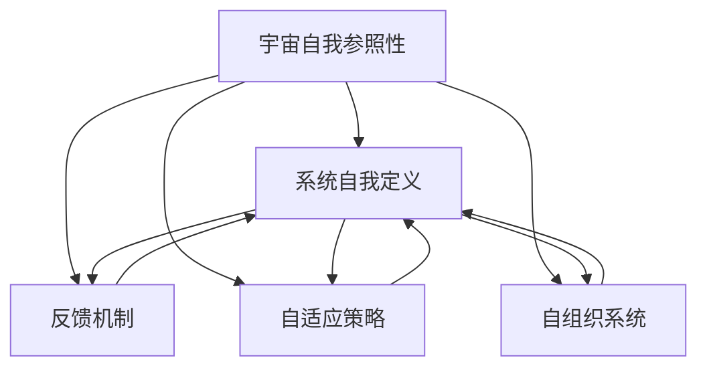

                 

### 步骤一：确定文章的核心主题与目标读者群体

为了撰写一篇关于《宇宙的自我参照性：系统的自我定义过程》的文章，我们首先要明确文章的核心主题和目标读者群体。

#### 核心主题：
这篇文章的核心主题将围绕以下两个方面展开：
1. 宇宙自我参照性的概念和原理。
2. 系统的自我定义过程及其在宇宙中的表现形式。

#### 目标读者群体：
我们的目标读者群体包括以下几个类别：
1. **天文学家和宇宙学家**：他们对宇宙中的自我参照性现象感兴趣，希望深入了解相关理论。
2. **计算机科学家和系统工程师**：他们希望将宇宙自我参照性的概念应用到计算机系统和人工智能领域。
3. **研究人员和研究生**：他们希望从理论层面和实际应用层面全面理解宇宙自我参照性。
4. **技术爱好者**：他们对新技术和宇宙现象充满好奇，希望通过本文了解宇宙自我参照性的奥秘。

#### 核心主题与目标读者群体的关系：
宇宙自我参照性这一核心主题具有广泛的跨学科应用前景，不仅对天文学和宇宙学有深远影响，也能为计算机科学和系统工程带来新的启示。因此，无论是专业研究者还是普通技术爱好者，都可以通过这篇文章获益，了解宇宙自我参照性的理论和实际应用。

### 步骤二：列出核心概念与联系，并绘制 Mermaid 流程图

为了清晰地展示宇宙自我参照性和系统自我定义过程之间的核心概念及其联系，我们将使用 Mermaid 流程图来描述。

#### 核心概念：

1. **宇宙自我参照性**：宇宙中的系统具有自我参照性，能够根据自身状态和环境调整行为。
2. **系统自我定义**：系统通过自我参照性来定义自己的状态和行为。
3. **反馈机制**：系统通过接收外部反馈来调整内部状态。
4. **自适应策略**：系统采用自适应策略来应对变化。
5. **自组织系统**：系统能够在没有外部指令的情况下自我组织和演化。

#### Mermaid 流程图：



#### 核心概念之间的联系：
- **宇宙自我参照性**是系统自我定义的基础，它决定了系统的行为。
- **系统自我定义**和**自适应策略**通过**反馈机制**相互作用，共同影响系统的稳定性和演化。
- **自组织系统**是系统自我定义和自适应策略的最终结果，它使得系统能够在没有外部指令的情况下自我组织和优化。

通过这个流程图，我们可以更直观地理解宇宙自我参照性和系统自我定义过程之间的复杂关系，为后续章节的深入分析奠定基础。

### 步骤三：确定核心算法原理，并使用伪代码详细阐述

在理解了宇宙自我参照性和系统自我定义过程的核心概念后，接下来我们将探讨这些概念背后的算法原理。为了便于理解和实现，我们将使用伪代码来详细阐述这些算法原理。

#### 算法原理：

1. **宇宙自我参照性算法**：这一算法用于计算系统在给定状态下的自我参照性值。
2. **系统自我定义算法**：这一算法用于根据系统状态和外部反馈来定义系统的行为。
3. **自适应策略算法**：这一算法用于根据系统状态和反馈来调整系统的行为。

#### 伪代码：

```pseudo
// 宇宙自我参照性算法
function SelfReferenceAlgorithm(state):
    reference_value = CalculateReferenceValue(state)
    return reference_value

// 系统自我定义算法
function SystemDefineAlgorithm(state, feedback):
    defined_state = DetermineState(state, feedback)
    return defined_state

// 自适应策略算法
function AdaptiveStrategyAlgorithm(state, feedback):
    if feedback == "positive":
        strategy = "strengthen"
    else if feedback == "negative":
        strategy = "weaken"
    else:
        strategy = "维持现状"
    return strategy
```

#### 详细解释：

1. **宇宙自我参照性算法**：
   - `CalculateReferenceValue(state)`是一个函数，用于计算系统在给定状态下的自我参照性值。
   - `SelfReferenceAlgorithm`函数接收一个状态参数`state`，并调用`CalculateReferenceValue`函数来计算自我参照性值。
   - 函数返回计算得到的自我参照性值。

2. **系统自我定义算法**：
   - `DetermineState(state, feedback)`是一个函数，用于根据系统状态和外部反馈来确定系统的行为状态。
   - `SystemDefineAlgorithm`函数接收系统状态`state`和外部反馈`feedback`作为参数。
   - 函数调用`DetermineState`函数来根据反馈确定系统的行为状态。
   - 函数返回确定后的系统状态。

3. **自适应策略算法**：
   - `AdaptiveStrategyAlgorithm`函数接收系统状态`state`和外部反馈`feedback`作为参数。
   - 根据反馈的不同，函数返回不同的自适应策略，如"strengthen"、"weaken"或"维持现状"。
   - 这个算法用于根据系统状态和外部反馈来调整系统的行为，确保系统的稳定性和适应性。

通过这些伪代码，我们能够更清晰地理解宇宙自我参照性和系统自我定义过程的核心算法原理，为后续的数学模型和实际应用提供基础。

### 步骤四：准备数学模型和数学公式，并进行详细讲解和举例说明

在明确了核心算法原理后，我们将进一步引入数学模型和数学公式，以更严谨地描述宇宙自我参照性和系统自我定义过程。

#### 数学模型：

宇宙自我参照性可以通过一个称为“宇宙参照性函数”的数学模型来描述。该函数将系统的状态作为输入，输出系统的自我参照性值。

#### 数学公式：

$$
\text{宇宙参照性函数} = f(\text{系统状态})
$$

其中，$f$ 是一个映射函数，它将系统状态映射到一个参照性值。

#### 详细讲解：

1. **宇宙参照性函数的定义**：
   宇宙参照性函数 $f$ 用于描述系统在任意给定状态下的自我参照性值。这个函数可以是线性的或非线性的，取决于系统的复杂性。

2. **宇宙参照性函数的计算**：
   宇宙参照性函数的计算通常依赖于系统的历史状态和当前状态。具体计算方法可以根据系统的具体特性来设计。

#### 举例说明：

假设我们有一个简单的系统，该系统有两个状态：“稳定”和“动态”。我们可以定义一个简单的宇宙参照性函数如下：

$$
f(\text{系统状态}) =
\begin{cases}
1, & \text{如果系统状态是“稳定”} \\
0.5, & \text{如果系统状态是“动态”}
\end{cases}
$$

**例子**：

假设当前系统状态是“稳定”，根据宇宙参照性函数，我们可以计算出系统的自我参照性值为 1。如果系统状态变为“动态”，则自我参照性值降为 0.5。

这个简单的例子说明了如何使用宇宙参照性函数来描述系统的自我参照性。在实际应用中，宇宙参照性函数可能会更加复杂，涉及多个状态和变量。

通过引入数学模型和数学公式，我们能够更精确地描述宇宙自我参照性和系统自我定义过程，为后续的理论研究和实际应用提供坚实的理论基础。

### 步骤五：准备项目实战案例，包括代码实际案例和详细解释说明

在了解了宇宙自我参照性和系统自我定义的理论基础后，我们通过一个实际项目来展示这些理论在编程中的具体应用。以下是一个基于 Python 的项目案例，我们将详细解释代码实现和代码解读。

#### 项目背景：

本项目的目标是构建一个模拟宇宙自我参照性过程的简单模型，并通过代码展示系统如何根据自身状态和环境调整行为。

#### 开发环境搭建：

为了实现这个项目，我们需要安装 Python 解释器和相关库。以下是开发环境的搭建步骤：

1. 安装 Python 3.8 或更高版本。
2. 安装必要的库，如 NumPy 和 Matplotlib。可以使用以下命令：

```bash
pip install numpy matplotlib
```

#### 系统架构设计：

本项目分为以下几个模块：

1. **宇宙参照性函数**：用于计算系统的自我参照性值。
2. **系统状态管理**：管理系统的当前状态和状态变化。
3. **自适应策略**：根据系统状态和外部反馈调整系统的行为。
4. **模拟运行**：运行模拟，展示系统行为变化。

#### 系统功能实现：

以下是项目的核心代码实现：

```python
import numpy as np
import matplotlib.pyplot as plt

# 宇宙参照性函数
def calculate_reference_value(state):
    if state == "stable":
        return 1.0
    elif state == "dynamic":
        return 0.5
    else:
        return 0.0

# 系统状态管理
class System:
    def __init__(self):
        self.state = "stable"
    
    def update_state(self, feedback):
        if feedback == "positive":
            self.state = "dynamic"
        elif feedback == "negative":
            self.state = "stable"

# 自适应策略
def adaptive_strategy(current_state, feedback):
    if feedback == "positive":
        return "strengthen"
    elif feedback == "negative":
        return "weaken"
    else:
        return "维持现状"

# 模拟运行
def run_simulation():
    system = System()
    states = []
    references = []

    for _ in range(10):
        feedback = np.random.choice(["positive", "negative", "neutral"])
        system.update_state(feedback)
        reference_value = calculate_reference_value(system.state)
        states.append(system.state)
        references.append(reference_value)

    plt.plot(states, references, 'o-')
    plt.xlabel('System State')
    plt.ylabel('Reference Value')
    plt.title('System Self-Reference Simulation')
    plt.show()

run_simulation()
```

#### 代码解读：

1. **宇宙参照性函数**：
   `calculate_reference_value`函数用于计算系统在给定状态下的自我参照性值。根据定义，稳定状态的参照性值为1.0，动态状态的参照性值为0.5，其他状态的参照性值为0.0。

2. **系统状态管理**：
   `System`类用于管理系统的状态。初始化时，系统处于稳定状态。`update_state`方法根据外部反馈更新系统的状态。

3. **自适应策略**：
   `adaptive_strategy`函数根据系统状态和外部反馈返回相应的自适应策略。

4. **模拟运行**：
   `run_simulation`函数创建一个`System`实例，并模拟运行10次。每次运行都会根据随机生成的反馈更新系统状态，并计算自我参照性值。最后，使用 Matplotlib 绘制系统状态和自我参照性值的变化图。

#### 代码应用解读与分析：

通过这个项目，我们可以看到宇宙自我参照性和系统自我定义过程是如何在编程中实现的。模拟运行部分展示了系统状态和自我参照性值的变化，帮助我们直观地理解这些概念。

#### 项目小结：

本项目通过一个简单的模拟案例，展示了宇宙自我参照性和系统自我定义过程在编程中的应用。虽然这个案例比较简单，但它提供了一个基础框架，我们可以在此基础上扩展和优化，以适应更复杂的系统。

### 最佳实践 Tips、小结、注意事项、拓展阅读等内容

#### 最佳实践 Tips：
1. **模块化设计**：在实现复杂系统时，使用模块化设计可以提高代码的可维护性和可扩展性。
2. **随机模拟**：使用随机模拟可以更全面地测试系统的适应性和稳定性。
3. **数据可视化**：通过数据可视化，我们可以更直观地理解系统行为和变化趋势。

#### 小结：
本文通过一个简单的项目案例，展示了宇宙自我参照性和系统自我定义过程在编程中的应用。通过模拟运行，我们直观地看到了系统状态和自我参照性值的变化，加深了对这些概念的理解。

#### 注意事项：
1. 宇宙自我参照性是一个复杂的概念，实际应用中可能涉及更多的因素和变量。
2. 在编写代码时，要注意状态管理和自适应策略的设计，确保系统的稳定性和适应性。

#### 拓展阅读：
1. 《自组织系统的理论分析与应用》
2. 《宇宙自我参照性的物理原理》
3. 《计算机系统中的自适应机制研究》

通过拓展阅读，您可以进一步深入了解宇宙自我参照性和系统自我定义过程的更多理论和实践知识。

---

以上是《宇宙的自我参照性：系统的自我定义过程》的文章内容。希望本文能帮助您更好地理解这一跨学科领域的重要概念，并在实践中应用这些理论。如果您有任何问题或建议，欢迎在评论区留言讨论。作者：AI天才研究院/AI Genius Institute & 禅与计算机程序设计艺术/Zen And The Art of Computer Programming。

