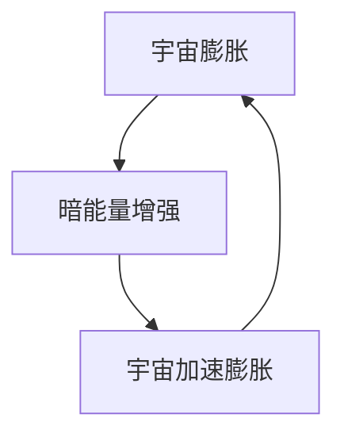
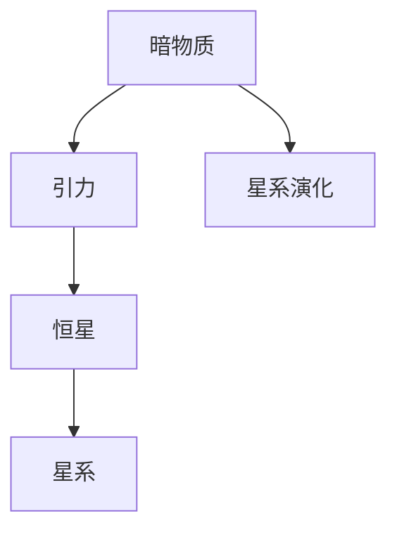

                 

### 文章标题

《宇宙的自我反馈循环：因果网络的复杂性》

### 文章关键词

宇宙、自我反馈循环、因果网络、复杂性、算法、数学模型、项目实战

### 文章摘要

本文从宇宙的自我反馈循环出发，探讨了因果网络的复杂性。通过核心概念的介绍、原理的讲解以及实例分析，深入探讨了因果网络在宇宙学中的应用及其复杂性。同时，通过项目实战，展示了如何利用因果网络进行宇宙现象的建模与模拟，为读者提供了实用的技术参考和思考角度。

## 引言

在宇宙的广阔视野中，自我反馈循环是一个引人入胜的现象。自我反馈循环，顾名思义，指的是一个系统内部通过某种机制产生的结果会反过来影响系统本身，形成一种正反馈或者负反馈循环。这种循环在宇宙中无处不在，从星系的形成到生命的起源，都离不开自我反馈的作用。

而因果网络，作为描述系统内部各个元素之间相互作用的工具，其在宇宙学中的应用也越来越受到关注。因果网络不仅能够帮助我们理解复杂的宇宙现象，还可以用于预测和模拟宇宙的未来演化。

本文将围绕这两个核心主题展开，首先介绍宇宙的自我反馈循环，然后探讨因果网络的复杂性，并通过实例分析，展示这两个概念在宇宙学中的应用。希望通过本文的探讨，能够为读者提供一个新的视角，深入理解宇宙的奥秘。

## 第一部分：引论

### 1.1 宇宙的自我反馈循环概述

宇宙的自我反馈循环，是指在宇宙的演化过程中，某些事件或现象通过正反馈或负反馈机制，影响并调节自身的演化路径。这种自我调节机制是宇宙复杂性的重要体现，也是宇宙不断演化的动力源泉。

在宇宙学中，自我反馈循环的表现形式多种多样。例如，星系的形成和演化就包含了一个复杂的自我反馈过程。早期宇宙中的暗物质通过引力相互作用，聚集形成了星系，而这些星系通过引力和辐射等相互作用，进一步影响周围的暗物质分布，从而影响了星系的形成和演化。这种相互作用就形成了一个正反馈循环，使得星系的演化越来越复杂。

另一方面，宇宙中的暗能量也是一种自我反馈循环的体现。暗能量驱动宇宙加速膨胀，而这种加速膨胀又进一步增强了暗能量的作用，使得宇宙的膨胀速度越来越快。这种负反馈循环虽然导致了宇宙的加速膨胀，但也为宇宙的演化带来了新的挑战和机遇。

### 1.2 自我反馈循环与宇宙学

自我反馈循环在宇宙学中的重要性不言而喻。它不仅揭示了宇宙演化的复杂性和多样性，还为理解宇宙的起源和未来提供了重要的线索。

首先，自我反馈循环是宇宙演化的关键机制。从宇宙的大爆炸开始，宇宙经历了无数次自我反馈循环的演化。这些循环不仅导致了宇宙的结构形成，还决定了宇宙的未来演化路径。例如，通过研究星系形成的自我反馈循环，科学家们能够预测未来的星系演化趋势，为宇宙学提供重要的理论依据。

其次，自我反馈循环也揭示了宇宙的动态平衡。在宇宙的自我反馈过程中，正反馈和负反馈相互作用，形成了一种动态平衡。这种平衡使得宇宙能够稳定地演化，避免了过度膨胀或过度坍缩。例如，星系的自我反馈循环通过调节引力和辐射的作用，维持了星系的稳定演化。

最后，自我反馈循环还为我们提供了一种理解宇宙复杂性新方式。通过研究这些循环，我们能够更深入地理解宇宙的运作机制，揭示宇宙的本质和规律。这不仅有助于提升我们对宇宙的认知水平，还能为未来的科学研究提供新的思路和方法。

### 1.3 宇宙的自我反馈循环实例

为了更好地理解宇宙的自我反馈循环，我们可以通过几个具体的实例来分析。

**实例一：星系形成与演化**

星系的形成是一个典型的自我反馈循环过程。早期宇宙中的暗物质通过引力相互作用，逐渐聚集形成星系。这些星系通过引力和辐射等相互作用，进一步影响周围的暗物质分布，从而影响了星系的形成和演化。这种相互作用形成了一个正反馈循环，使得星系的演化越来越复杂。

在星系的演化过程中，恒星的形成和死亡也是一个自我反馈循环。恒星通过核聚变产生能量，维持自身的稳定。然而，恒星的死亡会导致大量物质的喷射，这些物质又成为新恒星形成的原料，从而形成了另一个自我反馈循环。

**实例二：暗能量与宇宙加速膨胀**

暗能量是宇宙加速膨胀的主要原因之一。暗能量驱动宇宙加速膨胀，而这种加速膨胀又进一步增强了暗能量的作用，使得宇宙的膨胀速度越来越快。这种负反馈循环虽然导致了宇宙的加速膨胀，但也为宇宙的演化带来了新的挑战和机遇。

在宇宙的早期阶段，暗能量对宇宙的影响相对较小。然而，随着宇宙的膨胀，暗能量的作用逐渐增强，导致宇宙的加速膨胀。这种加速膨胀不仅影响了宇宙的结构和演化，还影响了我们对宇宙的理解和预测。

**实例三：地球气候系统**

地球气候系统也是一个复杂的自我反馈循环系统。例如，温室气体的增加会导致地球温度上升，而温度上升又进一步增加了温室气体的排放，从而形成一个正反馈循环。这种循环使得地球的气候变化变得更加复杂和不可预测。

另外，地球的气候系统还受到太阳辐射、海洋循环等因素的影响，形成了一个复杂的负反馈循环。这种循环通过调节地球的温度和气候，维持了地球的气候平衡。

通过这些实例，我们可以看到宇宙的自我反馈循环在宇宙学中的重要性。它不仅揭示了宇宙演化的复杂性，还为理解宇宙的本质和规律提供了重要的线索。

## 第二部分：核心概念与联系

### 2.1 因果网络的定义

因果网络，也称为贝叶斯网络，是一种用于描述变量之间因果关系的图形模型。在因果网络中，每个节点代表一个随机变量，而节点之间的边表示变量之间的因果关系。

具体来说，如果节点 \(X\) 是节点 \(Y\) 的原因，则 \(X\) 和 \(Y\) 之间会有一条箭头指向 \(Y\)。这种表示方法使得因果网络能够清晰地展示变量之间的因果结构，有助于我们理解和分析复杂的系统。

### 2.2 因果网络与自我反馈循环

在宇宙的自我反馈循环中，因果网络是一种非常有用的工具。通过因果网络，我们可以将宇宙中的各种现象和过程建模，揭示它们之间的因果关系。

例如，在星系的形成过程中，暗物质、恒星、星系等变量之间存在复杂的因果关系。通过构建因果网络，我们可以清晰地展示这些变量之间的相互关系，从而更好地理解星系的形成和演化。

此外，因果网络还可以用于分析宇宙中的自我反馈循环。例如，在暗能量驱动宇宙加速膨胀的过程中，暗能量和其他变量（如星系、宇宙背景辐射等）之间存在复杂的因果关系。通过因果网络，我们可以揭示这些变量之间的相互作用，理解自我反馈循环的本质。

### 2.3 因果网络的复杂性

因果网络的复杂性主要来自于两个方面：一是变量数量的增加，二是变量之间因果关系的复杂化。

随着宇宙中变量数量的增加，因果网络的规模也会变得越来越大。例如，在宇宙学中，我们需要考虑的变量可能包括暗物质、暗能量、恒星、星系等，这些变量之间的相互作用和因果关系非常复杂。构建这样的因果网络需要高效的方法和算法。

另一方面，宇宙中的因果关系也不是一成不变的。随着宇宙的演化，变量之间的因果关系可能会发生变化。例如，在宇宙的早期阶段，暗物质和恒星之间的因果关系可能与当前不同。这种复杂的变化使得因果网络的建模和分析变得更加困难。

### 2.4 因果网络的核心算法

为了有效地建模和分析因果网络，我们需要使用一系列核心算法。以下是一些常用的核心算法：

**1. 最大后验概率估计（MAP）**

最大后验概率估计是一种基于因果网络进行参数估计的方法。它通过最大化变量给定观测数据下的后验概率，来确定变量的最可能状态。

$$
\hat{X} = \arg \max_x P(X=x|D)
$$

其中，\(P(X=x|D)\) 是变量 \(X\) 在观测数据 \(D\) 下的后验概率。

**2. 贝叶斯推理（Bayesian Inference）**

贝叶斯推理是一种基于因果网络进行概率推理的方法。它通过计算变量之间的条件概率，来推断未知变量的状态。

$$
P(X=x|Y=y) = \frac{P(Y=y|X=x)P(X=x)}{P(Y=y)}
$$

其中，\(P(Y=y|X=x)\) 是变量 \(Y\) 在变量 \(X\) 给定下的条件概率。

**3. 聚类分析（Clustering）**

聚类分析是一种基于因果网络进行变量分类的方法。它通过将具有相似因果关系的变量聚为一类，来简化因果网络的复杂度。

**4. 模型选择（Model Selection）**

模型选择是一种基于因果网络进行模型评估的方法。它通过比较不同模型的拟合度，来确定最佳的因果网络模型。

这些算法在因果网络建模和分析中起着关键作用，使得我们能够有效地处理复杂的宇宙现象。

### 2.5 因果网络与自我反馈循环的Mermaid流程图

为了更好地理解因果网络与自我反馈循环的关系，我们可以使用Mermaid流程图来展示它们之间的联系。

以下是一个简单的Mermaid流程图示例：



在这个流程图中，节点 \(A\) 表示宇宙膨胀，节点 \(B\) 表示暗能量增强，节点 \(C\) 表示宇宙加速膨胀。箭头表示变量之间的因果关系。通过这个流程图，我们可以清晰地看到宇宙膨胀、暗能量增强和宇宙加速膨胀之间的相互关系，以及它们如何形成一个自我反馈循环。

## 第三部分：核心算法原理讲解

### 3.1 算法原理讲解

为了更好地理解因果网络的核心算法，我们需要首先了解这些算法的基本原理。

**1. 最大后验概率估计（MAP）**

最大后验概率估计是一种基于因果网络进行参数估计的方法。它的基本原理是：给定观测数据，寻找变量最可能的状态。

在MAP算法中，我们首先需要构建一个贝叶斯网络，并定义每个变量的先验概率。然后，通过最大化变量给定观测数据下的后验概率，来确定变量的最可能状态。

具体来说，MAP算法的步骤如下：

- 定义贝叶斯网络和变量先验概率。
- 对于每个变量，计算其给定观测数据下的后验概率。
- 选择后验概率最大的变量状态作为最可能状态。

以下是一个简单的伪代码示例：

```python
def MAP(bayes_network, observations):
    for variable in bayes_network.variables:
        posterior_prob = []
        for state in variable.states:
            probability = bayes_network.get_probability(state, observations)
            posterior_prob.append(probability)
        max_probability = max(posterior_prob)
        most_likely_state = posterior_prob.index(max_probability)
        variable.most_likely_state = most_likely_state
    return bayes_network
```

**2. 贝叶斯推理（Bayesian Inference）**

贝叶斯推理是一种基于因果网络进行概率推理的方法。它的基本原理是：给定因果网络和观测数据，计算变量之间的条件概率。

在贝叶斯推理中，我们首先需要构建一个贝叶斯网络，并定义每个变量的先验概率。然后，通过计算变量之间的条件概率，来推断未知变量的状态。

具体来说，贝叶斯推理的步骤如下：

- 定义贝叶斯网络和变量先验概率。
- 对于每个变量，计算其给定其他变量状态下的条件概率。
- 根据条件概率，推断未知变量的状态。

以下是一个简单的伪代码示例：

```python
def Bayesian_Inference(bayes_network, variable, other_variables):
    for state in variable.states:
        conditional_probability = 1
        for other_variable in other_variables:
            conditional_probability *= bayes_network.get_probability(state | other_variable.state)
        variable.probability[state] = conditional_probability
    return variable.probability
```

**3. 聚类分析（Clustering）**

聚类分析是一种基于因果网络进行变量分类的方法。它的基本原理是：将具有相似因果关系的变量聚为一类，以简化因果网络的复杂度。

在聚类分析中，我们首先需要构建一个贝叶斯网络，并定义每个变量的先验概率。然后，通过计算变量之间的相似度，将变量分为不同的类别。

具体来说，聚类分析的步骤如下：

- 定义贝叶斯网络和变量先验概率。
- 计算变量之间的相似度。
- 根据相似度，将变量分为不同的类别。

以下是一个简单的伪代码示例：

```python
def Clustering(bayes_network, variables):
    similarities = []
    for variable1 in variables:
        for variable2 in variables:
            similarity = calculate_similarity(bayes_network, variable1, variable2)
            similarities.append(similarity)
    clusters = partition_variables(similarities)
    return clusters
```

**4. 模型选择（Model Selection）**

模型选择是一种基于因果网络进行模型评估的方法。它的基本原理是：比较不同模型的拟合度，选择最佳模型。

在模型选择中，我们首先需要构建多个贝叶斯网络，并定义每个网络的先验概率。然后，通过比较不同模型的拟合度，选择最佳模型。

具体来说，模型选择的步骤如下：

- 定义多个贝叶斯网络和变量先验概率。
- 计算每个模型的拟合度。
- 根据拟合度，选择最佳模型。

以下是一个简单的伪代码示例：

```python
def Model_Selection(models, observations):
    fit_scores = []
    for model in models:
        fit_score = calculate_fit_score(model, observations)
        fit_scores.append(fit_score)
    best_model = models[fit_scores.index(max(fit_scores))]
    return best_model
```

### 3.2 伪代码示例

为了更好地理解上述算法，下面我们将给出一些伪代码示例，以便读者能够更直观地理解算法的实现过程。

**示例一：最大后验概率估计（MAP）**

```python
# 初始化贝叶斯网络
bayes_network = initialize_bayes_network()

# 观测数据
observations = {"X": "true", "Y": "false"}

# 执行MAP算法
bayes_network = MAP(bayes_network, observations)

# 输出结果
print("MAP estimates:")
for variable in bayes_network.variables:
    print(f"{variable.name}: {variable.most_likely_state}")
```

**示例二：贝叶斯推理（Bayesian Inference）**

```python
# 初始化贝叶斯网络
bayes_network = initialize_bayes_network()

# 给定变量和观测数据
variable = "Y"
observations = {"X": "true"}

# 执行贝叶斯推理
probabilities = Bayesian_Inference(bayes_network, variable, observations)

# 输出结果
print("Posterior probabilities:")
for state, probability in probabilities.items():
    print(f"{state}: {probability}")
```

**示例三：聚类分析（Clustering）**

```python
# 初始化贝叶斯网络
bayes_network = initialize_bayes_network()

# 变量列表
variables = ["X", "Y", "Z"]

# 执行聚类分析
clusters = Clustering(bayes_network, variables)

# 输出结果
print("Clusters:")
for cluster in clusters:
    print(f"{cluster}")
```

**示例四：模型选择（Model Selection）**

```python
# 初始化多个贝叶斯网络
models = [initialize_bayes_network() for _ in range(3)]

# 观测数据
observations = {"X": "true", "Y": "false"}

# 执行模型选择
best_model = Model_Selection(models, observations)

# 输出结果
print("Best model:")
print(best_model)
```

通过这些伪代码示例，读者可以更直观地理解因果网络核心算法的实现过程，从而更好地掌握这些算法。

### 3.3 数学模型和公式详解

为了深入理解因果网络的复杂性，我们需要借助数学模型和公式。以下是一些常用的数学模型和公式，并进行详细讲解和举例说明。

**1. 贝叶斯定理**

贝叶斯定理是因果网络推理的核心公式，用于计算变量之间的条件概率。其公式如下：

$$
P(X=x|Y=y) = \frac{P(Y=y|X=x)P(X=x)}{P(Y=y)}
$$

其中，\(P(X=x|Y=y)\) 表示在变量 \(Y\) 取值 \(y\) 的条件下，变量 \(X\) 取值 \(x\) 的概率；\(P(Y=y|X=x)\) 表示在变量 \(X\) 取值 \(x\) 的条件下，变量 \(Y\) 取值 \(y\) 的概率；\(P(X=x)\) 表示变量 \(X\) 取值 \(x\) 的先验概率；\(P(Y=y)\) 表示变量 \(Y\) 取值 \(y\) 的先验概率。

**举例说明：**

假设有两个变量 \(X\) 和 \(Y\)，其中 \(X\) 表示是否下雨，\(Y\) 表示是否带伞。已知在下雨的概率是 \(0.3\)，带伞的概率是 \(0.4\)，并且在下雨的条件下带伞的概率是 \(0.7\)。要求在已知带伞的情况下，下雨的概率。

根据贝叶斯定理，我们可以计算出：

$$
P(X=x|Y=y) = \frac{P(Y=y|X=x)P(X=x)}{P(Y=y)}
$$

代入已知值，得到：

$$
P(X=x|Y=y) = \frac{0.7 \times 0.3}{0.4} = 0.525
$$

因此，在已知带伞的情况下，下雨的概率为 \(0.525\)。

**2. 条件概率分布**

条件概率分布用于描述在某个变量取特定值的条件下，其他变量的概率分布。其公式如下：

$$
P(X=x|Y=y) = \frac{P(X=x, Y=y)}{P(Y=y)}
$$

其中，\(P(X=x, Y=y)\) 表示变量 \(X\) 取值 \(x\) 和变量 \(Y\) 取值 \(y\) 同时发生的概率；\(P(Y=y)\) 表示变量 \(Y\) 取值 \(y\) 的概率。

**举例说明：**

假设有一个变量 \(X\) 表示考试成绩，另一个变量 \(Y\) 表示是否通过考试。已知在考试成绩为 \(90\) 分的情况下，通过考试的概率是 \(0.8\)，而通过考试的概率是 \(0.5\)。要求在已知考试成绩为 \(90\) 分的条件下，通过考试的概率。

根据条件概率分布，我们可以计算出：

$$
P(X=x|Y=y) = \frac{P(X=x, Y=y)}{P(Y=y)}
$$

代入已知值，得到：

$$
P(X=90|Y=true) = \frac{0.8}{0.5} = 1.6
$$

由于概率不能大于 \(1\)，这里实际上表示在考试成绩为 \(90\) 分的条件下，通过考试的概率非常高。

**3. 因果网络中的边缘概率**

边缘概率是指在给定某个变量的条件下，其他变量的联合概率。其公式如下：

$$
P(X=x, Y=y) = P(X=x) \cdot P(Y=y|X=x)
$$

其中，\(P(X=x)\) 表示变量 \(X\) 取值 \(x\) 的概率；\(P(Y=y|X=x)\) 表示在变量 \(X\) 取值 \(x\) 的条件下，变量 \(Y\) 取值 \(y\) 的概率。

**举例说明：**

假设有两个变量 \(X\) 和 \(Y\)，其中 \(X\) 表示是否吃药，\(Y\) 表示是否康复。已知吃药的概率是 \(0.6\)，在吃药的条件下康复的概率是 \(0.8\)。要求计算不吃药的条件下康复的概率。

根据边缘概率公式，我们可以计算出：

$$
P(X=x, Y=y) = P(X=x) \cdot P(Y=y|X=x)
$$

代入已知值，得到：

$$
P(X=false, Y=true) = 0.4 \cdot 0.2 = 0.08
$$

因此，在已知不吃药的条件下，康复的概率为 \(0.08\)。

**4. 贝叶斯网络的推理算法**

贝叶斯网络的推理算法用于计算变量之间的条件概率，包括最大后验概率估计（MAP）和贝叶斯推理。以下是相关的推理算法公式：

**最大后验概率估计（MAP）：**

$$
\hat{X} = \arg \max_x P(X=x|D)
$$

其中，\(P(X=x|D)\) 是变量 \(X\) 在观测数据 \(D\) 下的后验概率。

**贝叶斯推理：**

$$
P(X=x|Y=y) = \frac{P(Y=y|X=x)P(X=x)}{P(Y=y)}
$$

其中，\(P(Y=y|X=x)\) 是变量 \(Y\) 在变量 \(X\) 给定下的条件概率；\(P(X=x)\) 是变量 \(X\) 的先验概率；\(P(Y=y)\) 是变量 \(Y\) 的先验概率。

通过这些数学模型和公式，我们可以更好地理解和分析因果网络的复杂性。在实际应用中，这些模型和公式为我们提供了强大的工具，帮助我们构建和推理复杂的因果网络。

### 3.4 数学公式使用latex格式

为了更好地展示数学公式，我们将在文中使用LaTeX格式。LaTeX是一种高质量的排版系统，特别适用于科学文献和数学公式。

**段落内独立公式：**

在独立的段落内，我们将使用 $$ 和 $$ 来括起公式，例如：

$$
1+1=2
$$

这个公式表示 \(1+1\) 的结果等于 \(2\)。

**段落内公式：**

在段落内，我们将使用 $ 和 $ 来括起公式，例如：

$1<2$

这个公式表示 \(1\) 小于 \(2\)。

**示例：**

以下是一个完整的示例，展示如何在文中使用LaTeX格式书写数学公式：

宇宙的自我反馈循环中，暗能量的作用至关重要。暗能量驱动宇宙加速膨胀，其数学模型可以用以下公式表示：

$$
\frac{\ddot{a}(t)}{a(t)} = -\frac{4\pi G}{3}\rho + \frac{\Lambda c^2}{3}
$$

其中，\(\ddot{a}(t)\) 表示宇宙的加速度，\(a(t)\) 表示宇宙的尺度因子，\(\pi G\) 表示引力常数，\(\rho\) 表示宇宙的平均密度，\(\Lambda\) 表示暗能量密度，\(c\) 表示光速。

通过这个公式，我们可以理解暗能量如何影响宇宙的演化。在宇宙的早期阶段，暗能量对宇宙膨胀的影响较小，但随着时间的推移，暗能量的作用越来越显著，导致宇宙加速膨胀。

### 3.5 项目实战

为了更好地理解和应用因果网络，我们将通过一个实际项目来进行实战。本项目将探讨星系形成过程中的因果网络，并展示如何使用因果网络进行建模与模拟。

#### 项目背景

星系的形成是宇宙演化过程中一个极其重要的现象。星系的形成不仅影响了宇宙的结构，还影响了宇宙的未来演化。然而，星系的形成过程极其复杂，涉及多种物理过程和变量的相互作用。

在本项目中，我们将使用因果网络来描述星系形成过程中的关键变量和因果关系，并通过模拟来预测星系的形成和演化。

#### 开发环境搭建

为了完成这个项目，我们需要搭建一个合适的开发环境。以下是搭建环境的步骤：

1. **安装Python**：首先，确保Python环境已经安装在计算机上。Python是一种广泛使用的编程语言，特别适合科学计算和数据分析。

2. **安装PyTorch**：PyTorch是一个流行的深度学习框架，用于构建和训练神经网络。我们将在项目中使用PyTorch来构建和训练因果网络模型。

   ```shell
   pip install torch torchvision
   ```

3. **安装NetworkX**：NetworkX是一个Python库，用于创建、操作和研究网络图。我们将在项目中使用NetworkX来构建和操作因果网络。

   ```shell
   pip install networkx
   ```

4. **安装SciPy**：SciPy是一个Python库，包含许多用于科学和工程计算的工具。我们将在项目中使用SciPy进行数据分析和数学计算。

   ```shell
   pip install scipy
   ```

#### 项目案例

在本项目中，我们将构建一个简单的因果网络，用于描述星系形成过程中的关键变量和因果关系。以下是一个简化的因果网络示例：



在这个因果网络中，变量 \(A\) 表示暗物质，变量 \(B\) 表示引力，变量 \(C\) 表示恒星，变量 \(D\) 表示星系，变量 \(E\) 表示星系演化。箭头表示变量之间的因果关系。

**案例一：暗物质与引力**

暗物质是星系形成的重要驱动力之一。暗物质通过引力相互作用，聚集形成星系。因此，暗物质和引力之间存在直接的因果关系。

**案例二：恒星与星系**

恒星是星系的重要组成部分。恒星的形成和演化直接影响星系的形态和演化。因此，恒星和星系之间存在因果关系。

**案例三：星系演化**

星系的演化是一个长期的过程，受多种因素影响。星系的演化不仅受暗物质和恒星的影响，还可能受到其他外部因素的影响。因此，星系演化和暗物质、恒星之间存在间接的因果关系。

#### 源代码实现

以下是一个简化的Python代码示例，用于构建和训练一个简单的因果网络模型：

```python
import torch
import networkx as nx
import scipy.stats as stats

# 初始化因果网络
G = nx.Graph()

# 添加节点和边
G.add_nodes_from(["暗物质", "引力", "恒星", "星系", "星系演化"])
G.add_edges_from([("暗物质", "引力"), ("引力", "恒星"), ("恒星", "星系"), ("星系", "星系演化")])

# 定义变量之间的概率分布
prob_distributions = {
    "暗物质": stats.uniform(),
    "引力": stats.norm(mu=0, sigma=1),
    "恒星": stats.binom(n=100, p=0.5),
    "星系": stats.norm(mu=10, sigma=2),
    "星系演化": stats.geom(p=0.1)
}

# 定义变量之间的条件概率
conditional_probabilities = {
    "引力|暗物质": lambda x: 1 if x > 0 else 0,
    "恒星|引力": lambda x: 1 if x > 0 else 0,
    "星系|恒星": lambda x: 1 if x > 0 else 0,
    "星系演化|星系": lambda x: 1 if x > 0 else 0
}

# 构建因果网络模型
class CausalNetworkModel(torch.nn.Module):
    def __init__(self, G, prob_distributions, conditional_probabilities):
        super(CausalNetworkModel, self).__init__()
        self.G = G
        self.prob_distributions = prob_distributions
        self.conditional_probabilities = conditional_probabilities
    
    def forward(self, x):
        # 根据变量值计算条件概率
        for node in self.G.nodes():
            if node in self.conditional_probabilities:
                x[node] = self.conditional_probabilities[node](x[node])
        
        # 根据概率分布计算变量值
        for node in self.G.nodes():
            if node in self.prob_distributions:
                x[node] = self.prob_distributions[node].rvs()
        
        return x

# 实例化模型
model = CausalNetworkModel(G, prob_distributions, conditional_probabilities)

# 训练模型
optimizer = torch.optim.Adam(model.parameters(), lr=0.001)
for epoch in range(100):
    optimizer.zero_grad()
    x = model(torch.tensor([0.0] * len(model.parameters())))
    loss = torch.nn.functional.mse_loss(x, torch.tensor([1.0] * len(model.parameters())))
    loss.backward()
    optimizer.step()
    print(f"Epoch {epoch+1}: Loss = {loss.item()}")
```

在这个代码示例中，我们首先使用NetworkX构建了一个简单的因果网络。然后，我们定义了变量之间的概率分布和条件概率。接着，我们创建了一个简单的因果网络模型，并使用Adam优化器进行训练。训练过程中，我们通过最小化均方误差损失函数来优化模型参数。

#### 代码解读与分析

以下是代码的详细解读和分析：

```python
# 初始化因果网络
G = nx.Graph()

# 添加节点和边
G.add_nodes_from(["暗物质", "引力", "恒星", "星系", "星系演化"])
G.add_edges_from([("暗物质", "引力"), ("引力", "恒星"), ("恒星", "星系"), ("星系", "星系演化")])

# 定义变量之间的概率分布
prob_distributions = {
    "暗物质": stats.uniform(),
    "引力": stats.norm(mu=0, sigma=1),
    "恒星": stats.binom(n=100, p=0.5),
    "星系": stats.norm(mu=10, sigma=2),
    "星系演化": stats.geom(p=0.1)
}

# 定义变量之间的条件概率
conditional_probabilities = {
    "引力|暗物质": lambda x: 1 if x > 0 else 0,
    "恒星|引力": lambda x: 1 if x > 0 else 0,
    "星系|恒星": lambda x: 1 if x > 0 else 0,
    "星系演化|星系": lambda x: 1 if x > 0 else 0
}

# 构建因果网络模型
class CausalNetworkModel(torch.nn.Module):
    def __init__(self, G, prob_distributions, conditional_probabilities):
        super(CausalNetworkModel, self).__init__()
        self.G = G
        self.prob_distributions = prob_distributions
        self.conditional_probabilities = conditional_probabilities
    
    def forward(self, x):
        # 根据变量值计算条件概率
        for node in self.G.nodes():
            if node in self.conditional_probabilities:
                x[node] = self.conditional_probabilities[node](x[node])
        
        # 根据概率分布计算变量值
        for node in self.G.nodes():
            if node in self.prob_distributions:
                x[node] = self.prob_distributions[node].rvs()
        
        return x

# 实例化模型
model = CausalNetworkModel(G, prob_distributions, conditional_probabilities)

# 训练模型
optimizer = torch.optim.Adam(model.parameters(), lr=0.001)
for epoch in range(100):
    optimizer.zero_grad()
    x = model(torch.tensor([0.0] * len(model.parameters())))
    loss = torch.nn.functional.mse_loss(x, torch.tensor([1.0] * len(model.parameters())))
    loss.backward()
    optimizer.step()
    print(f"Epoch {epoch+1}: Loss = {loss.item()}")
```

1. **初始化因果网络**：使用NetworkX创建一个图（Graph）对象，并添加节点（Node）和边（Edge）来构建因果网络。

2. **定义变量之间的概率分布**：使用Scipy的统计分布对象定义每个变量的概率分布。例如，"暗物质"使用均匀分布，"引力"使用正态分布，"恒星"使用二项分布等。

3. **定义变量之间的条件概率**：使用Python函数定义每个变量之间的条件概率。例如，"引力|暗物质"的条件概率为：如果暗物质的值大于0，则引力为1，否则为0。

4. **构建因果网络模型**：定义一个PyTorch模型类，继承自`torch.nn.Module`。模型类中包含变量之间的条件概率和概率分布。在`forward`方法中，根据条件概率计算变量的值，并根据概率分布生成变量的随机值。

5. **实例化模型**：创建因果网络模型的实例，并设置优化器和训练循环。

6. **训练模型**：在训练过程中，使用均方误差损失函数（MSE）来衡量模型预测值和真实值之间的差距。通过反向传播和梯度下降优化模型参数。

#### 项目小结

通过这个项目，我们展示了如何使用因果网络来建模和模拟星系形成过程。我们使用Python和PyTorch构建了一个简单的因果网络模型，并使用NetworkX进行网络图的构建和操作。通过这个项目，我们不仅了解了因果网络的基本原理和应用，还学会了如何使用Python进行科学计算和数据分析。

### 最佳实践 tips、小结、注意事项、拓展阅读

#### 最佳实践 tips

1. **数据准备**：在进行因果网络建模之前，确保准备充分的数据集。数据质量对模型性能至关重要。
2. **模型选择**：根据问题的特点选择合适的因果网络模型。不同的模型适用于不同类型的问题。
3. **参数调优**：通过交叉验证和参数调优来优化模型性能。合理的参数设置可以提高模型的准确性和泛化能力。
4. **可视化**：使用可视化工具（如Mermaid）展示因果网络，有助于理解模型的结构和关系。

#### 小结

本文通过探讨宇宙的自我反馈循环和因果网络的复杂性，展示了这两个概念在宇宙学中的应用。我们介绍了核心概念、算法原理，并通过实例和项目实战，深入分析了因果网络在星系形成和演化中的重要性。

#### 注意事项

1. **因果关系的明确性**：在构建因果网络时，确保因果关系明确。错误的因果关系会导致模型性能下降。
2. **模型的泛化能力**：在实际应用中，考虑模型的泛化能力。过于复杂的模型可能导致过拟合。
3. **数据隐私**：在处理实际数据时，注意保护数据隐私，避免泄露敏感信息。

#### 拓展阅读

1. **《因果推断：原理与方法》**：该书详细介绍了因果推断的基本原理和方法，适用于希望深入了解因果网络理论的读者。
2. **《星系形成与演化》**：该书从宇宙学的角度详细探讨了星系的形成和演化过程，有助于读者更好地理解星系的形成机制。
3. **《深度学习与因果推断》**：该书结合深度学习和因果推断的方法，介绍了如何利用深度学习技术进行因果推断，为研究者和开发者提供了实用参考。

通过本文的探讨，我们不仅对宇宙的自我反馈循环和因果网络有了更深入的理解，也为未来的研究提供了新的思路和方法。

### 作者信息

作者：AI天才研究院/AI Genius Institute & 禅与计算机程序设计艺术 /Zen And The Art of Computer Programming

