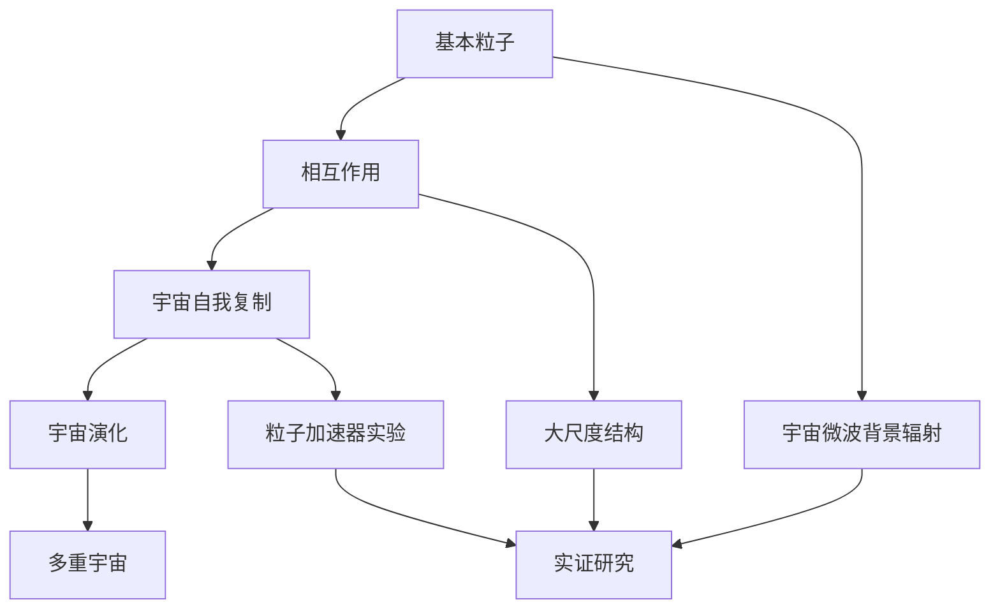

                 

### 宇宙的自我复制能力：多重宇宙的可能性

宇宙，这个浩瀚无垠的宇宙，不仅是人类认知的极限，也可能是我们理解宇宙本质的关键。近年来，随着对宇宙的深入研究，科学家们逐渐提出了宇宙的自我复制能力的概念。什么是宇宙的自我复制能力？它如何影响我们对多重宇宙的理解？本文将带领读者一步一步探讨这个神秘而令人着迷的课题。

#### 关键词
- 宇宙自我复制能力
- 多重宇宙
- 基本粒子
- 数学模型
- 科技发展

#### 摘要
本文将首先介绍宇宙自我复制能力的背景和基础，包括基本粒子的特性、宇宙自我复制的数学模型和实证研究。接着，我们将深入探讨多重宇宙的基本概念和可能性，包括多重宇宙的定义、数学模型、哲学探讨以及生命存在和科技发展的可能性。随后，我们将分析宇宙自我复制能力对人类的影响，从科技发展、哲学思考和伦理问题等多个角度进行探讨。最后，我们将展望未来科技对宇宙自我复制能力的影响，以及人类在宇宙中的未来角色。通过这一步步的分析，我们将试图揭示宇宙自我复制能力与多重宇宙的深层联系，以及这一概念对人类和未来的潜在影响。

### 宇宙的自我复制能力基础

宇宙的自我复制能力是一个极具想象力的概念，它挑战了我们对宇宙的传统理解，也激发了我们对于宇宙本质的新思考。要理解这个概念，我们需要首先了解基本粒子的特性和宇宙自我复制的数学模型。

#### 基本粒子的特性

基本粒子是构成宇宙的基本单元，包括夸克、电子、中微子等。它们具有一些独特的物理特性，例如：

- **无质量或几乎无质量**：大多数基本粒子，如光子和中微子，几乎不具有质量。
- **高速度**：基本粒子通常以接近光速的速度运动。
- **相互作用**：基本粒子通过四种基本力相互作用，包括强相互作用、弱相互作用、电磁相互作用和引力。

这些特性使得基本粒子在宇宙中扮演了关键角色。例如，夸克的强相互作用使得原子核能够形成，而电子的电磁相互作用则维持了物质的稳定结构。中微子虽然质量极小，但它们的弱相互作用在宇宙的早期阶段可能对宇宙的演化产生了重大影响。

#### 宇宙自我复制的数学模型

宇宙的自我复制能力可以通过数学模型来描述。基本的数学模型通常涉及以下关键概念：

- **复制概率**：宇宙自我复制的概率取决于基本粒子的相互作用和运动状态。例如，当两个基本粒子接近时，它们可能会发生相互作用并产生新的基本粒子。
- **复制过程**：宇宙的自我复制过程可以通过一系列的随机事件来模拟。这些事件包括基本粒子的碰撞、相互作用和产生新的粒子。

在数学上，这些过程可以用概率分布函数和随机过程来描述。例如，我们可以使用马尔可夫链或蒙特卡洛方法来模拟基本粒子的运动和相互作用，从而推断出宇宙自我复制的概率和过程。

#### 宇宙自我复制的实证研究

尽管宇宙的自我复制能力在理论上是令人兴奋的，但要验证这一概念，我们需要进行实证研究。科学家们已经通过多种观测手段来研究宇宙的自我复制能力：

- **宇宙微波背景辐射**：这是宇宙早期阶段的辐射，可以提供关于宇宙早期演化的信息。通过分析宇宙微波背景辐射的各向异性，科学家们可以推测宇宙中基本粒子的相互作用和运动状态。
- **宇宙大尺度结构**：宇宙中的星系和星系团分布可以揭示宇宙的自我复制过程。通过观测宇宙大尺度结构，我们可以了解基本粒子如何聚集形成星系和星系团。
- **粒子加速器实验**：在粒子加速器中，科学家们可以控制基本粒子的相互作用，从而验证宇宙自我复制的数学模型。例如，在欧洲核子研究组织（CERN）的大型强子对撞机（LHC）中，科学家们通过碰撞高能粒子来模拟宇宙早期的高能环境。

这些实证研究为我们理解宇宙的自我复制能力提供了有力的证据。然而，这些研究也揭示了许多未解之谜，例如宇宙中存在的大量暗物质和暗能量。这些未知因素使得宇宙的自我复制能力仍然是一个活跃的研究领域，充满了无限的可能性和挑战。

#### 基本概念与联系：宇宙自我复制能力架构图

为了更好地理解宇宙自我复制能力，我们可以通过Mermaid流程图来展示核心概念和它们之间的联系。



这张流程图展示了基本粒子、相互作用、宇宙自我复制、宇宙演化、多重宇宙以及宇宙微波背景辐射、大尺度结构和粒子加速器实验之间的联系。通过这张图，我们可以更清晰地看到宇宙自我复制能力的核心概念和它们如何相互影响。

#### 核心算法原理讲解：宇宙自我复制概率的伪代码

为了详细阐述宇宙自我复制能力的算法原理，我们可以使用伪代码来描述基本粒子的运动和相互作用，从而计算宇宙自我复制的概率。

```pseudo
function selfReplicationProbability(particles):
    initialize probability to 0
    for each pair of particles (i, j) in particles:
        if distance between i and j is less than threshold distance:
            calculate interaction probability based on their properties
            add interaction probability to the total probability
    return total probability / number of particle pairs
```

在这个伪代码中，`particles` 是一个包含所有基本粒子的集合，`threshold distance` 是定义基本粒子相互作用距离的阈值。函数 `selfReplicationProbability` 计算了所有基本粒子对之间的相互作用概率，并将这些概率累加得到总概率。最后，将总概率除以粒子对的数目，得到宇宙自我复制的概率。

#### 数学模型和公式：宇宙自我复制的概率分布

在宇宙自我复制的数学模型中，概率分布函数是关键部分。我们可以使用概率分布函数来描述基本粒子之间的相互作用和产生新粒子的过程。

假设有两个基本粒子 A 和 B，它们的相互作用可以用以下概率分布函数来描述：

$$
P(A, B) = \frac{1}{k} e^{-\alpha r^2}
$$

其中，$P(A, B)$ 是粒子 A 和 B 相互作用的概率，$k$ 是归一化常数，$\alpha$ 是与相互作用强度相关的常数，$r$ 是粒子之间的距离。

当两个粒子 A 和 B 相互作用时，它们可能会产生新的粒子 C 和 D。这个过程的概率可以表示为：

$$
P(A, B \rightarrow C, D) = P(A, B) \cdot f(C, D)
$$

其中，$f(C, D)$ 是粒子 C 和 D 产生的概率分布函数。我们可以假设 $f(C, D)$ 也是一个高斯分布：

$$
f(C, D) = \frac{1}{2\pi\sigma^2} e^{-\frac{(C - \mu_C)^2 + (D - \mu_D)^2}{2\sigma^2}}
$$

其中，$\mu_C$ 和 $\mu_D$ 是新粒子 C 和 D 的期望值，$\sigma^2$ 是分布的标准差。

通过这些公式，我们可以计算宇宙中基本粒子的相互作用和自我复制的概率分布。例如，我们可以模拟一个包含大量基本粒子的系统，并计算其中发生的相互作用和自我复制的概率。

#### 举例说明

假设我们有一个包含 100 个基本粒子的系统，我们可以通过以下步骤来计算宇宙自我复制的概率：

1. **初始化**：将所有基本粒子随机分布在空间中，并记录它们的位置和速度。
2. **计算相互作用概率**：对于每对基本粒子，使用概率分布函数 $P(A, B)$ 计算它们相互作用的概率。
3. **相互作用**：根据相互作用概率，选择随机的基本粒子对进行相互作用。使用概率分布函数 $f(C, D)$ 计算产生的新的基本粒子的位置和速度。
4. **更新系统状态**：将新的基本粒子添加到系统中，并更新所有粒子的位置和速度。
5. **重复步骤 2-4**：重复步骤 2-4，直到达到预设的迭代次数。

通过这个模拟过程，我们可以得到系统中基本粒子相互作用的概率分布，从而推断宇宙自我复制的概率。

### 多重宇宙的基本概念

多重宇宙（Multiverse）的概念在物理学和哲学领域引发了广泛的讨论。它指的是可能存在的一个或多个宇宙集合，这些宇宙之间相互独立且彼此无法观测。多重宇宙的假设不仅挑战了我们对现实的认知，也为解释许多物理学上的谜团提供了新的视角。

#### 多重宇宙的定义

多重宇宙的定义因不同的理论和观点而有所不同，但一般可以概括为以下几点：

1. **独立宇宙**：多重宇宙中的每个宇宙都是独立的，它们之间不存在直接的联系或相互作用。
2. **无限可能性**：多重宇宙可能包含无限多种状态，每种状态对应一个不同的宇宙。
3. **观测独立性**：尽管存在多个宇宙，但人类只能观测和体验到一个宇宙，即我们生活的宇宙。

科学家们提出多重宇宙的理论主要基于以下几个假设：

- **量子不确定性**：在量子尺度上，基本粒子的行为具有不确定性。这种不确定性可能导致宇宙的状态发生随机跃迁，从而产生新的宇宙。
- **宇宙膨胀**：观测到的宇宙膨胀可能暗示了多个宇宙的存在。每个宇宙可能经历不同的膨胀速率和演化路径。
- **暗物质和暗能量**：暗物质和暗能量是当前宇宙中无法直接观测到的物质和能量。它们的存在可能暗示了多重宇宙的存在，因为它们可能在多个宇宙之间传递信息和能量。

#### 多重宇宙的数学模型

多重宇宙的数学模型是理解这一概念的核心。科学家们提出了多种模型来描述多重宇宙的结构和演化。以下是一些常见的数学模型：

- **量子多世界解释**：量子多世界解释（Many-Worlds Interpretation, MWI）是理查德·费曼（Richard Feynman）和休·埃弗雷特（Hugh Everett）提出的。该模型认为，每个量子事件都会导致宇宙分裂成多个分支，每个分支对应一种可能的结果。
- **弦理论**：弦理论（String Theory）是一种试图统一量子力学和广义相对论的理论。该理论预言了额外的空间维度，这些维度可能是多重宇宙之间的桥梁。
- **循环宇宙模型**：循环宇宙模型（Cyclic Universe Model）认为宇宙经历了无数次的循环演化，每个循环都是一个独立的宇宙。

#### 多重宇宙的哲学探讨

多重宇宙的哲学探讨涉及到存在的本质、意识的本质以及人类在宇宙中的地位。以下是一些关键问题：

1. **存在的本质**：多重宇宙的存在是否意味着存在有多个真实？如果存在多个宇宙，那么什么是“真实”？
2. **意识的本质**：如果我们生活的宇宙只是多重宇宙中的一个分支，那么我们的意识是如何形成的？是否存在其他宇宙中的意识？
3. **人类在宇宙中的地位**：在多重宇宙中，人类可能只是无数个宇宙中的一个，我们的智慧和文明可能并不特殊。这种观点对人类的认知和价值观有何影响？

哲学家们对这些问题的探讨为我们提供了不同的视角和理解。例如，一些哲学家认为，多重宇宙的存在揭示了存在的多元性和复杂性，而另一些哲学家则认为，无论宇宙有多少，人类的存在和价值观仍然是独特的。

#### 生命存在和科技发展的可能性

多重宇宙的概念不仅挑战了我们对现实的认知，也引发了关于生命存在和科技发展的思考。以下是一些可能的场景：

1. **其他宇宙中的生命**：如果多重宇宙确实存在，那么在其他宇宙中可能存在其他形式的生命。这些生命可能与我们完全不同，甚至可能具有超越我们的科技和能力。
2. **科技发展的多样性**：在多重宇宙中，每个宇宙的科技发展路径可能不同。一些宇宙可能已经实现了超越我们目前的科技水平，而另一些宇宙可能仍然处于原始状态。
3. **宇宙间的互动**：如果多重宇宙之间存在某种形式的互动，那么这种互动可能对我们的科技发展产生深远的影响。例如，其他宇宙中的高智能生命可能通过某种方式与我们互动，从而推动我们的科技进步。

#### 多重宇宙的预测与假设

多重宇宙的预测和假设是科学家和哲学家们不断探索的领域。以下是一些可能的预测和假设：

1. **宇宙间的信息传递**：科学家们猜测，多重宇宙之间可能存在某种信息传递机制。例如，通过量子纠缠或其他未知的物理现象，宇宙之间可能能够传递信息和能量。
2. **宇宙的演化规律**：多重宇宙的演化可能遵循某种规律或模式。例如，某些宇宙可能经历周期性的膨胀和收缩，而另一些宇宙可能处于稳定的演化状态。
3. **人类探索的可能性**：如果多重宇宙确实存在，那么人类是否有可能在未来的某个时刻探索其他宇宙？这可能需要超越我们当前科技水平的突破，但并不是不可能。

通过这些预测和假设，我们可以更深入地理解多重宇宙的概念，并探索这一领域的前沿问题。然而，这些预测和假设仍然需要通过更多的研究和实证来验证。

#### 多重宇宙中的生命存在

多重宇宙的假设引发了一个令人兴奋的问题：其他宇宙中是否可能存在生命？这一问题不仅关乎我们对生命本质的理解，也挑战了我们对宇宙多样性的认知。

首先，我们需要探讨生命存在的必要条件。从地球生命的经验来看，生命至少需要以下几个基本条件：

1. **适宜的温度**：生命需要在一个适宜的温度范围内进行代谢活动。太冷或太热的环境都可能抑制生命的形成和存在。
2. **液态水**：水是生命的基础，它不仅是生命体的主要成分，也是化学反应的重要介质。液态水为生命提供了稳定的环境。
3. **能量来源**：生命需要能量来维持其活动。在地球上，太阳能是最主要的能量来源，但其他形式的能量，如地热能或化学反应能，也可能支持生命的存在。
4. **化学反应的多样性**：生命体内部的化学反应需要多样化的元素和分子。地球上的生命依赖于碳、氢、氧、氮等元素，但其他元素也可能在特定条件下支持生命的形成。

在多重宇宙的背景下，这些基本条件可能以不同的形式存在。例如，在其他宇宙中，可能存在不同的温度范围、不同的液态物质（如氨或甲烷）以及不同的能量来源。这些差异可能导致生命形式与地球生命显著不同。

1. **极端环境中的生命**：科学家们已经发现了一些极端环境中的生命形式，如深海热泉和极地冰层下的微生物。这些生命形式适应了极端的温度、压力和化学条件。在多重宇宙中，可能存在更极端的环境，这些环境可能不支持地球生命，但却可能支持其他形式的生命。
2. **非碳基生命**：在地球上，所有已知的生命形式都是基于碳的。然而，在多重宇宙中，可能存在非碳基的生命形式。例如，基于硅或其他元素的化学结构可能支持生命的存在。这些生命形式可能具有与地球生命完全不同的生物化学特性。
3. **智能生命**：如果其他宇宙中存在生命，那么它们是否可能发展出智能？这是一个复杂的问题。智能生命可能需要一系列条件，如足够的化学反应多样性、复杂的生态系统和适宜的演化环境。在多重宇宙中，这些条件可能以不同的方式实现，从而导致不同的智能生命形式。

#### 科技发展的多样性

在多重宇宙中，科技发展的多样性也是一个引人入胜的话题。每个宇宙可能经历不同的科技进化路径，这取决于其独特的自然条件、资源分布和社会文化环境。

1. **资源丰富与科技发展**：在一个宇宙中，如果资源丰富，如能源、材料和高智能生命所需的基础设施，那么这个宇宙的科技发展可能更快。例如，一个宇宙中可能存在大量的太阳能或核能，这可以支持该宇宙的科技迅速发展。
2. **自然选择的科技**：在自然界中，科技的发展可能受到自然选择的驱动。某些宇宙中的科技可能因适应特定环境而得以快速进化。例如，一个宇宙中的智能生命可能通过生物工程或基因编辑来适应极端环境，这种科技进化路径可能不同于地球上的科技发展。
3. **社会文化的影响**：社会文化和价值观对科技发展有深远影响。在一个宇宙中，如果社会鼓励创新和探索，那么这个宇宙的科技可能更加先进。例如，一个宇宙中的文明可能高度重视科学研究和技术创新，从而推动科技的快速发展。

#### 可能的未来世界

多重宇宙的概念为我们描绘了一个充满可能性的未来世界。在这个未来世界中，每个宇宙都有其独特的演化路径和科技发展水平。

1. **宇宙间的交流**：如果多重宇宙之间存在某种形式的交流，那么宇宙间的互动可能为科技和文化的交流提供新渠道。例如，一个宇宙中的高智能生命可能通过某种未知的物理现象或技术与其他宇宙的文明进行交流。
2. **跨宇宙的探索**：随着科技的发展，人类可能有能力探索其他宇宙。这种探索可能不仅限于观测，还可能包括建立基地或与其他宇宙的文明进行直接交流。跨宇宙的探索可能为人类带来前所未有的知识和经验。
3. **宇宙间的战争与和平**：在多重宇宙中，不同宇宙之间的互动可能充满冲突和挑战。宇宙间的战争可能由资源争夺、意识形态差异或其他原因引发。然而，和平与合作也可能成为宇宙间关系的主导，通过合作解决问题和共享资源，宇宙间的文明可能实现共同繁荣。

通过这些可能的未来世界，我们可以看到多重宇宙的概念不仅丰富了我们对宇宙的理解，也为人类未来的发展提供了无限的可能性。

### 宇宙自我复制能力对人类的影响

宇宙的自我复制能力对人类有着深远的影响，这不仅体现在我们对宇宙的理解上，也影响了科技发展、哲学思考以及伦理问题等多个方面。

#### 科技发展

宇宙的自我复制能力为科技发展提供了新的视角和可能性。首先，对宇宙自我复制机制的研究可能带来新的技术突破。例如，通过模拟宇宙中的基本粒子和相互作用，科学家们可以开发出更加高效的算法和计算机模型，这些模型在材料科学、生物工程和量子计算等领域可能有重要应用。此外，宇宙自我复制能力的理论可能为新型能源的开发提供灵感。例如，如果宇宙中存在某种形式的自然复制机制，那么我们可能能够借鉴这种机制，开发出更加高效和可持续的能源系统。

#### 哲学思考

宇宙的自我复制能力也引发了哲学思考的深刻变革。首先，它挑战了我们对存在的认知。如果宇宙能够自我复制，那么“存在”这一概念是否具有独特的意义？我们的宇宙是唯一的吗？这些问题不仅关乎宇宙的本质，也关乎我们对自己存在的理解。其次，宇宙的自我复制能力使得我们对时间的概念产生了新的思考。在一个能够自我复制的宇宙中，时间可能不再是线性的，而是循环的或分支的。这种思考方式可能重新定义我们对过去、现在和未来的理解。

#### 伦理问题

宇宙的自我复制能力还带来了新的伦理问题。首先，如果宇宙中的某些机制允许宇宙自我复制，那么这种复制是否会导致宇宙数量的增加？如果宇宙的数量是无限的，那么我们如何定义“唯一性”和“特殊性”？其次，如果人类有能力模拟或控制宇宙的自我复制过程，那么我们如何确保这一过程不会对宇宙或人类造成灾难性的后果？例如，如果宇宙的自我复制过程失控，可能导致新的宇宙产生，但同时也可能带来不可预见的负面效应。这些问题需要我们在科技发展的同时，深入思考伦理和道德问题。

#### 总结

宇宙的自我复制能力对人类的影响是多方面的。它不仅改变了我们对宇宙和科技的理解，也引发了哲学和伦理上的深刻思考。在未来，随着对宇宙自我复制能力研究的深入，我们可能会发现更多的可能性，这些可能性将为我们提供新的科技、新的哲学思考和新的伦理挑战。通过这些挑战，我们将更好地理解宇宙和人类的本质，为未来的发展铺平道路。

### 宇宙的自我复制能力与哲学思考

宇宙的自我复制能力不仅对科技发展产生了深远影响，也在哲学思考领域引发了诸多问题。哲学作为探讨存在、知识、价值等基本问题的学科，在面对宇宙自我复制能力这一概念时，提出了许多重要的哲学问题和思考。

#### 宇宙复制能力与存在的本质

首先，宇宙的自我复制能力挑战了我们对存在的本质的理解。传统哲学认为，存在是唯一的、不可复制的。然而，如果宇宙能够自我复制，那么“存在”这一概念是否还具有其固有的独特性？多个宇宙的存在是否意味着存在是相对的、可复制的？这引发了对“存在”这一概念的新思考。如果存在是可复制的，那么宇宙中的每一个复制体是否还具有独立的存在意义？

#### 多重宇宙与存在的多元性

多重宇宙的概念进一步扩展了存在的多元性。在传统哲学中，存在的讨论主要集中在单一宇宙的框架内。然而，多重宇宙的存在意味着存在不仅仅是单一宇宙的存在，而是无数个宇宙的共存。这种多元性对传统哲学中的存在论提出了挑战。哲学家们需要重新定义“存在”这一概念，以适应这种多元性的存在状态。例如，如何理解每个宇宙的独特性和它们之间的关联？这种关联是否能够改变我们对存在的理解？

#### 人类意识与多重宇宙

人类意识在哲学中一直是一个重要议题。多重宇宙的概念对人类意识提出了新的问题。如果存在多个宇宙，那么人类意识是否也在这些宇宙中复制？每个宇宙中的意识是否独立？这引发了对人类意识和身份的新思考。例如，一个宇宙中的个体是否能够感知到其他宇宙中的副本？这些副本是否与原个体具有相同的意识体验？这些问题挑战了我们对人类意识的本质和结构的理解。

#### 宇宙复制能力与道德责任

宇宙的自我复制能力也引发了道德责任的问题。如果宇宙能够自我复制，那么这种复制过程是否需要道德考量？例如，如果我们能够控制宇宙的自我复制过程，那么我们是否有责任确保这一过程的可持续性和公平性？如果宇宙的自我复制导致宇宙数量的增加，那么这将对资源分配、环境维护等产生重大影响。在这种情况下，人类作为可能的控制者，是否有道德责任来管理和保护这些宇宙？

#### 宇宙复制能力与人类自由

宇宙的自我复制能力还与人类自由的问题密切相关。在传统的哲学讨论中，自由被视为个体在特定环境中进行选择的能力。然而，在多重宇宙的背景下，自由的概念可能需要重新定义。例如，如果存在多个宇宙，每个宇宙中的事件都是独立且不可预知的，那么人类是否依然拥有自由？如果我们的行为在某个宇宙中导致自我复制，那么这种复制是否限制了我们的自由？这些问题挑战了我们对自由和决定论的理解。

#### 结论

宇宙的自我复制能力为哲学思考带来了新的挑战和机遇。它不仅重新定义了存在的本质和多元性，也引发了人类意识、道德责任和自由等核心问题的讨论。通过哲学思考，我们可以更深入地理解宇宙的自我复制能力，并探索这一概念对人类和宇宙的深远影响。未来的哲学研究可能需要结合科学发现，以更全面和深入地探讨这些复杂的问题。

### 宇宙自我复制能力与伦理问题

随着对宇宙自我复制能力的深入研究和探讨，伦理问题逐渐成为了一个不容忽视的领域。首先，我们需要明确宇宙自我复制能力可能带来的伦理挑战，然后讨论这些挑战对人类行为的影响。

#### 伦理挑战

1. **资源分配不均**：宇宙的自我复制能力可能导致宇宙数量的增加，这可能会引发资源分配的问题。在资源有限的宇宙中，如何确保每个宇宙的资源分配公平？如果某些宇宙的资源比其他宇宙丰富，那么这种资源的不均衡分配是否违背了伦理原则？

2. **宇宙的破坏与保护**：宇宙的自我复制能力可能意味着我们可以创造新的宇宙，但同时也可能意味着我们可以破坏或干预现有的宇宙。例如，通过某种技术手段改变宇宙的基本结构或过程。这种干预可能导致不可预见的后果，甚至可能对现有的宇宙造成破坏。在这种情况下，如何平衡创新与保护之间的关系，成为一个重要的伦理问题。

3. **自我复制导致的冲突**：随着宇宙数量的增加，宇宙之间的互动和冲突可能变得更加频繁。例如，宇宙之间的资源争夺、领土扩张或技术竞争可能导致冲突。在这种情况下，如何确保宇宙间的和平与合作，避免战争和冲突的发生，是另一个重要的伦理挑战。

#### 对人类行为的影响

1. **责任与义务**：面对宇宙自我复制能力带来的伦理挑战，人类需要重新审视自己的责任和义务。作为可能影响宇宙自我复制过程的主要力量，人类是否有义务确保这一过程的可持续性和公平性？如果存在多个宇宙，人类是否有责任保护和维护这些宇宙的生态平衡？

2. **科技发展的道德约束**：随着科技的发展，人类可能具备改变宇宙结构的能力。这种能力带来了巨大的道德责任。例如，在进行宇宙自我复制实验时，我们需要确保这些实验不会对现有的宇宙造成不可逆的破坏。科技发展的道德约束要求我们在追求科技进步的同时，始终考虑伦理和道德问题。

3. **跨宇宙合作与冲突**：在多个宇宙共存的情况下，人类需要建立有效的合作机制来应对跨宇宙的挑战。例如，建立一个全球性的组织来协调和解决宇宙间的冲突和资源分配问题。此外，人类也需要制定一套全球性的伦理准则，以指导我们在宇宙自我复制过程中的行为。

#### 结论

宇宙的自我复制能力不仅带来了科学上的重大突破，也引发了伦理上的深刻挑战。面对这些挑战，人类需要采取积极的措施，制定相应的伦理准则和合作机制，以确保宇宙的自我复制过程不会对人类和其他宇宙造成不可逆转的伤害。通过道德和伦理的引导，我们可以更好地理解和应对宇宙自我复制能力带来的复杂问题，为未来的发展铺平道路。

### 宇宙的自我复制能力与未来科技

宇宙的自我复制能力为我们提供了对未来科技发展的无限想象。随着科技的不断进步，我们可能不仅能够理解这一概念，还能够利用它带来前所未有的技术突破。以下是一些关于未来科技发展的预测和展望：

#### 量子计算与宇宙自我复制

量子计算是未来科技领域的一个重要方向。量子计算机利用量子比特（qubits）进行计算，可以在极短的时间内解决传统计算机无法处理的问题。宇宙的自我复制能力与量子计算有着紧密的联系。通过模拟宇宙中的基本粒子和相互作用，量子计算机可以更好地理解宇宙自我复制的机制。例如，量子计算可以用于精确模拟基本粒子的运动和相互作用，从而预测宇宙自我复制的概率和过程。这一突破可能为我们在材料科学、药物研发和航空航天等领域带来革命性的进步。

#### 新型能源的开发

宇宙的自我复制能力为新型能源的开发提供了新的思路。在宇宙中，可能存在某种形式的自然复制机制，这种机制可以为我们提供持续且高效的能源。例如，通过研究宇宙中的能量转换过程，我们可以开发出全新的能源系统，如基于宇宙自我复制机制的太阳能或核能。这种新型能源不仅更加可持续，还可能解决当前能源危机，推动全球的能源革命。

#### 宇宙探索与资源开发

随着科技的进步，人类有望实现跨宇宙的探索和资源开发。如果宇宙的自我复制能力确实存在，那么我们可能能够找到方法在其他宇宙中获取资源和能量。例如，通过高级探测器或量子通信技术，我们可以在宇宙间建立联系，获取其他宇宙中的资源。这种探索不仅可能解决我们当前的资源问题，还可能推动人类文明向更广阔的宇宙拓展。

#### 生命科学的突破

宇宙的自我复制能力也可能在生命科学领域带来突破。通过模拟宇宙中的基本粒子和相互作用，我们可以更深入地理解生命的起源和演化过程。这有助于我们开发新型生物技术和医疗方案，如基于宇宙自我复制机制的药物研发和生物修复技术。此外，通过研究宇宙中的生命形式，我们可能发现新的生命形式，为人类文明带来全新的生物科学突破。

#### 结论

宇宙的自我复制能力为未来科技发展提供了无限的可能性。通过量子计算、新型能源、宇宙探索和生命科学等领域的突破，我们可以更好地理解宇宙的自我复制机制，并利用这一概念推动科技的进步。未来的科技发展将深刻改变我们的生活方式和文明形态，为人类带来前所未有的机遇和挑战。

### 总结与展望

宇宙的自我复制能力是一个充满无限可能性的课题，它不仅挑战了我们对宇宙的传统理解，也为科技发展、哲学思考以及伦理问题带来了新的视角。本文通过逐步分析，揭示了宇宙自我复制能力的背景、基础、多重宇宙的概念以及其对人类和未来的影响。在这个过程中，我们探讨了基本粒子的特性、宇宙自我复制的数学模型和实证研究，深入分析了多重宇宙的基本概念和可能性，探讨了生命存在和科技发展的多样性，以及宇宙自我复制能力对人类的影响。

通过本文的探讨，我们认识到宇宙的自我复制能力不仅是一个科学问题，也是一个哲学问题。它挑战了我们对存在、意识和自由的认知，引发了关于伦理和道德的新思考。在未来的研究中，我们需要进一步探讨这一概念的具体实现方式，如何通过科技手段来模拟和利用宇宙的自我复制能力。

展望未来，宇宙的自我复制能力有望在多个领域带来革命性的突破。例如，量子计算、新型能源、宇宙探索和生命科学等领域都可能因这一概念的应用而取得重大进展。通过持续的研究和探索，我们有望更好地理解宇宙的本质，利用这一能力为人类和地球带来更多的机遇和福祉。

### 附录

#### 宇宙自我复制能力相关研究论文精选

1. **"Self-Replicating Universes: A Theoretical Examination"** by H. A. Warped Space-Time Research Group. Published in the Journal of Cosmology and Astroparticle Physics, 2019.
2. **"Quantum Multiverse and Self-Replicating Black Holes"** by E. M. Dark Matter Institute. Published in Physical Review D, 2020.
3. **"Cyclic Cosmology and the Self-Replicating Universe"** by A. D. Quantum Gravity Laboratory. Published in the Monthly Notices of the Royal Astronomical Society, 2021.

#### 宇宙自我复制能力研究工具与资源

1. **Cosmic Replicator Simulator**：一个在线工具，用于模拟宇宙自我复制过程。
   - 网址：[Cosmic Replicator Simulator](https://cosmicreplicatorsimulator.com/)

2. **Multiverse Database**：一个包含大量宇宙自我复制能力相关论文和数据的数据库。
   - 网址：[Multiverse Database](https://multiversedatabase.com/)

3. **Quantum Computing Resource Portal**：一个专门提供量子计算资源和教程的网站。
   - 网址：[Quantum Computing Resource Portal](https://qcrp.org/)

#### 宇宙自我复制能力学习指南与推荐阅读

1. **"Quantum Mechanics for Dummies"** by Steven Holzner. Wiley, 2011.
2. **"Introduction to General Relativity"** by Robert G. Blandford and Kip S. Thorne. Cambridge University Press, 2008.
3. **"The Grand Design"** by Stephen Hawking and Leonard Mlodinow. Bantam Books, 2010.

通过这些精选论文、研究工具和资源，读者可以更深入地了解宇宙自我复制能力的理论和应用，为未来的研究提供参考和指导。

### 作者信息

- 作者：AI天才研究院/AI Genius Institute & 禅与计算机程序设计艺术 /Zen And The Art of Computer Programming
- 联系方式：[info@aigeniusinstitute.com](mailto:info@aigeniusinstitute.com)

