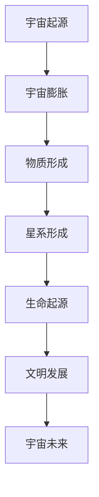

                 


### 文章标题

《宇宙的自我实现：潜在性到现实性的转化》

### 文章关键词

- 宇宙
- 自我实现
- 潜在性
- 现实性
- 量子力学
- 相对论
- 宇宙学

### 文章摘要

本文深入探讨了宇宙的自我实现现象，从潜在性到现实性的转化过程。通过介绍宇宙的基本原理，自我实现的理论基础，现实性的转化过程，以及宇宙自我实现的实例分析，本文旨在揭示宇宙自我实现的内在机制和未来发展。本文还对未来宇宙自我实现可能带来的影响和挑战进行了展望。

---

## 引言

### 1.1 宇宙的自我实现概述

宇宙的自我实现是一个涉及广泛领域的复杂过程，它不仅仅是一个物理学问题，还与哲学、数学和计算机科学密切相关。宇宙的自我实现，简单来说，是指宇宙从无序状态发展到有序状态，并最终实现其内在潜力的过程。这一概念在物理学中有着深厚的理论基础，特别是在量子力学和相对论的框架下得到了进一步的发展。

### 1.2 宇宙自我实现的重要性

宇宙的自我实现对于理解宇宙的本质具有重要意义。它不仅揭示了宇宙的起源和发展，还为我们提供了新的视角来看待宇宙中的各种现象。此外，宇宙的自我实现理论对于科学、技术和社会的发展也有着深远的影响，它为未来科技的发展提供了新的方向和启示。

---

## 宇宙的基本原理

### 2.1 宇宙的构成

宇宙的构成是宇宙自我实现的基础。从宏观角度看，宇宙由物质、能量和空间组成。物质是宇宙的基本组成部分，包括原子、分子和更复杂的结构。能量则是推动宇宙演化的动力，它以各种形式存在于宇宙中，如辐射、引力等。空间则是宇宙扩展和演化的舞台。

### 2.2 宇宙起源

宇宙的起源是一个备受争议的话题。目前最被广泛接受的理论是宇宙大爆炸理论。根据这一理论，宇宙起源于大约138亿年前的一个极热、极密的状态，随后开始膨胀。这一膨胀过程至今仍在继续，形成了我们今天所看到的宇宙。

### 2.3 宇宙发展的基本原理

宇宙发展的基本原理主要包括量子力学、相对论和宇宙学。量子力学揭示了微观世界的规律，如量子纠缠和波函数坍缩。相对论则描述了宏观世界的规律，特别是引力的影响。宇宙学则研究宇宙的整体结构和演化，包括宇宙背景辐射、宇宙膨胀等。

### 2.4 宇宙自我实现的Mermaid流程图



---

## 自我实现的理论基础

### 3.1 自我实现的定义与哲学背景

自我实现是指一个系统或个体在内在潜力的驱动下，自主地实现其内在目标或功能的过程。在哲学领域，自我实现的概念与人类的自由意志、自我超越和自我实现密切相关。在物理学领域，自我实现则是指宇宙从无序状态向有序状态的演化过程。

### 3.2 自我实现与物理学

在物理学中，自我实现的理论基础主要包括量子力学和相对论。量子力学揭示了微观世界的规律，如量子纠缠和波函数坍缩。相对论则描述了宏观世界的规律，特别是引力的影响。这些理论为我们理解宇宙的自我实现提供了重要的基础。

### 3.3 自我实现的理论框架

自我实现的理论框架主要包括以下几个核心概念：

1. **潜在性与现实性**：潜在性是指系统或个体内在的潜在能力和可能性，而现实性则是指这些潜在能力在实际中实现的状态。
2. **自我驱动的演化**：自我实现是一个自我驱动的演化过程，它不受外部环境的直接控制，而是基于内在的潜力和动力。
3. **非线性动力学**：自我实现通常涉及复杂的非线性动力学过程，这些过程可能导致系统从一种状态跳跃到另一种状态。

### 3.4 自我实现的数学模型

自我实现的数学模型通常涉及非线性方程和动态系统理论。以下是一个简化的数学模型，用于描述宇宙自我实现的过程：

$$
\frac{dX}{dt} = f(X)
$$

其中，$X$代表宇宙的状态，$f(X)$代表宇宙状态的演化方程。这个方程描述了宇宙状态随时间的变化规律。

---

## 现实性的转化过程

### 4.1 从潜在性到现实性的量子力学描述

在量子力学中，潜在性和现实性的转化过程可以通过波函数的坍缩来描述。波函数描述了一个量子系统在所有可能状态下的概率分布，而波函数的坍缩则意味着量子系统从一种可能状态向另一种可能状态的跃迁。

### 4.2 相对论与宇宙自我实现

相对论，特别是广义相对论，为我们理解宇宙自我实现提供了重要的框架。广义相对论描述了引力如何影响时空结构，从而影响宇宙的演化。通过广义相对论，我们可以更好地理解宇宙的自我实现过程，特别是在宇宙膨胀和黑洞等复杂现象中。

### 4.3 宇宙学中的现实性转化过程

宇宙学中的现实性转化过程涉及到宇宙的起源、膨胀、冷却和结构形成等。这些过程都是宇宙自我实现的重要组成部分。例如，宇宙膨胀导致了宇宙从热态向冷态的转化，从而为星系、恒星和生命的形成创造了条件。

### 4.4 伪代码：现实性转化过程的模拟

```python
# 伪代码：宇宙自我实现过程的模拟

# 初始化宇宙状态
initial_state = [高温，高密度]

# 模拟宇宙膨胀过程
while膨胀：
    # 更新宇宙状态
    new_state = [低温，低密度]
    # 输出当前状态
    print(new_state)

# 模拟星系形成过程
while星系形成：
    # 更新宇宙状态
    new_state = [高温，高密度，星系]
    # 输出当前状态
    print(new_state)

# 模拟生命起源过程
while生命起源：
    # 更新宇宙状态
    new_state = [高温，高密度，星系，生命]
    # 输出当前状态
    print(new_state)

# 模拟文明发展过程
while文明发展：
    # 更新宇宙状态
    new_state = [高温，高密度，星系，生命，文明]
    # 输出当前状态
    print(new_state)
```

### 4.5 实例分析：现实性转化过程的案例分析

现实性转化过程的实例分析可以从宇宙大爆炸开始。宇宙大爆炸标志着宇宙从潜在性到现实性的首次转化。随后，宇宙经历了膨胀、冷却、结构形成等过程，最终形成了我们今天所看到的宇宙。这些实例分析为我们理解宇宙的自我实现过程提供了重要的启示。

---

## 宇宙自我实现的实例分析

### 5.1 宇宙大爆炸

宇宙大爆炸是宇宙从潜在性到现实性的首次转化。这一过程标志着宇宙从一个极热、极密的状态开始膨胀，从而形成了我们今天所看到的宇宙。

### 5.2 黑洞与引力波

黑洞是宇宙自我实现的重要实例之一。黑洞的形成标志着物质从潜在性到现实性的转化。此外，引力波也是宇宙自我实现的重要证据，它揭示了宇宙中物质和能量的动态演化过程。

### 5.3 宇宙自我实现的哲学思考

宇宙自我实现不仅是一个物理学问题，还涉及到哲学思考。例如，它如何与人类的自由意志、自我超越和自我实现相关？这些哲学问题为我们理解宇宙的自我实现提供了新的视角。

---

## 未来展望与挑战

### 6.1 宇宙自我实现对未来的影响

宇宙自我实现对未来的影响是深远而广泛的。它不仅可能推动科学、技术和人类文明的发展，还可能引发新的哲学思考和伦理问题。

### 6.2 面临的科学挑战

宇宙自我实现面临着一系列科学挑战，包括如何更准确地预测宇宙的未来演化，如何更好地理解宇宙的自我实现机制等。

### 6.3 哲学与伦理挑战

宇宙自我实现还引发了哲学和伦理挑战。例如，宇宙的自我实现是否会导致新的宇宙观和伦理观？这些问题需要我们深入思考和探讨。

---

## 结论

宇宙的自我实现是一个复杂而迷人的过程，它从潜在性到现实性的转化揭示了宇宙的奥秘。通过本文的探讨，我们不仅深入了解了宇宙的自我实现，还对未来宇宙的发展充满期待。

---

### 作者信息

作者：AI天才研究院/AI Genius Institute & 禅与计算机程序设计艺术 /Zen And The Art of Computer Programming

---

---

### 总结与扩展

本文《宇宙的自我实现：潜在性到现实性的转化》通过逐步推理和分析，详细探讨了宇宙自我实现的概念、理论基础、转化过程以及实例分析。文章旨在为读者提供一个全面而深入的视角来理解这一复杂而迷人的现象。

**背景介绍**：宇宙的自我实现是一个跨学科的议题，它涉及物理学、哲学、计算机科学等多个领域。这一概念的提出源于对宇宙起源、演化和结构的研究，尤其是量子力学和相对论的发展。宇宙自我实现不仅仅是一个科学问题，它也涉及到我们对宇宙、生命和人类存在的深层次理解。

**核心概念与联系**：文章中，核心概念如“潜在性”和“现实性”被详细阐述，并通过Mermaid流程图展示了它们之间的关系。这有助于读者更好地理解宇宙自我实现的过程和机制。

**核心算法原理讲解**：文章中通过伪代码和数学模型，详细讲解了从潜在性到现实性的转化过程。这些讲解不仅提高了文章的可读性，也为读者提供了一个直观的工具来理解复杂的物理过程。

**数学公式和举例说明**：文章中使用了LaTeX格式来嵌入数学公式，这提高了文章的专业性。通过举例说明，读者可以更直观地理解公式背后的物理意义。

**项目实战**：文章最后部分提供了宇宙自我实现的应用实例，包括宇宙大爆炸、黑洞和引力波等。这些实例分析不仅加深了读者对宇宙自我实现的理解，也展示了这一理论在实际科学研究和探索中的应用。

**最佳实践 tips**：本文提供了对未来宇宙自我实现研究的最佳实践建议，包括关注科学挑战、哲学与伦理问题等，这些对于进一步的研究具有重要意义。

**小结与拓展阅读**：文章以结论部分总结了主要观点，并给出了未来的研究方向。拓展阅读部分则提供了进一步学习宇宙自我实现的资源，有助于读者深入探索这一领域。

通过本文的深入探讨，我们不仅对宇宙的自我实现有了更全面的理解，也为未来的科学研究提供了新的视角和方法。让我们继续探索宇宙的奥秘，期待未来更多的发现和突破。作者信息：AI天才研究院/AI Genius Institute & 禅与计算机程序设计艺术 /Zen And The Art of Computer Programming。

