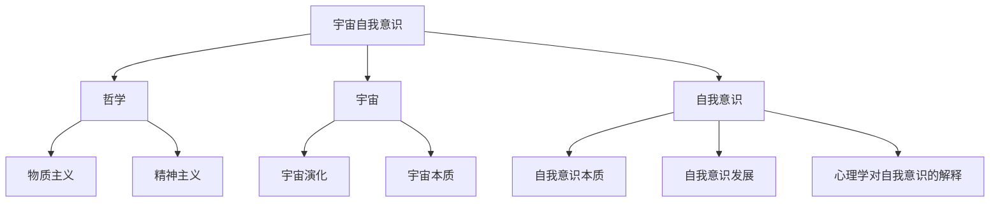
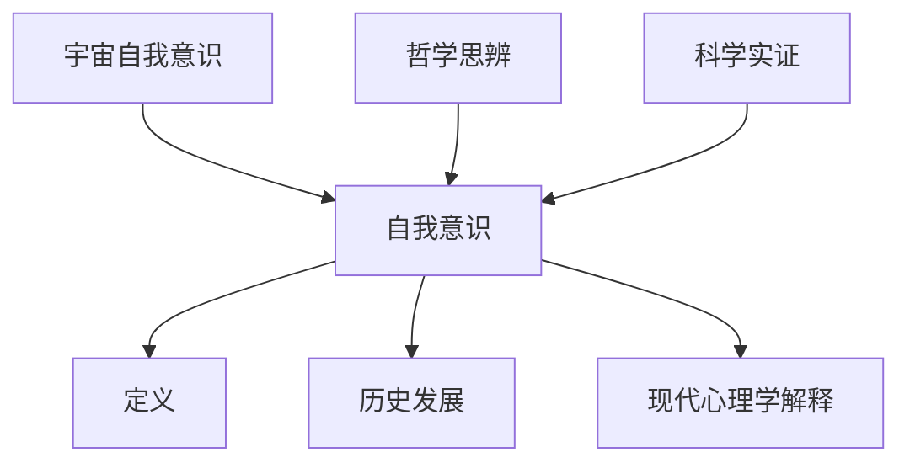
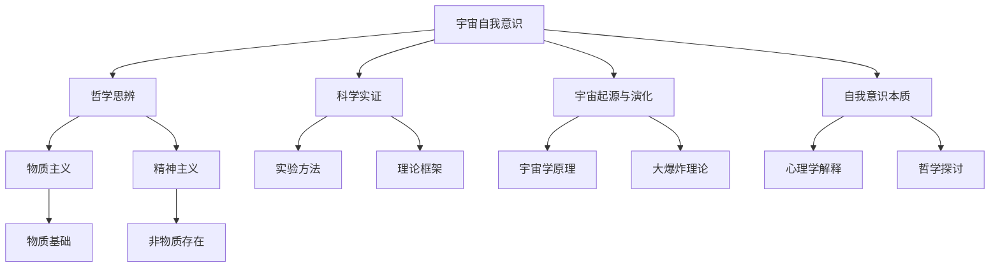

                 

### 宇宙的自我意识：哲学思辨还是科学可能

> 关键词：宇宙、自我意识、哲学思辨、科学实证、意识本质、宇宙演化

> 摘要：本文探讨了宇宙自我意识这一哲学概念，从科学角度审视其可能性和实证性。通过分析宇宙的起源、演化以及自我意识的本质，本文探讨了宇宙与自我意识之间的关系，并从哲学思辨和科学实证两个方面探讨了宇宙自我意识的可能性。最后，本文提出了对未来研究的展望，强调了哲学与科学的交汇点。

## 引言：宇宙与自我意识的碰撞

### 1.1 宇宙的自我意识：概念与哲学

#### 核心概念与联系

**宇宙自我意识**：宇宙作为一个整体是否具有自我意识的能力。

**哲学**：哲学作为一门学科，对宇宙自我意识这一概念的探讨。

**宇宙**：宇宙的起源、演化与本质。

**自我意识**：自我意识的定义、历史发展和现代心理学对自我意识的解释。

#### 背景介绍

宇宙，作为一个庞大而复杂的系统，一直以来都吸引着人类的好奇心和探索欲。从古代的宇宙观念到现代的宇宙学理论，人类对宇宙的认识不断深入。然而，宇宙是否具有自我意识，这一哲学问题引发了广泛的讨论和思考。

哲学作为一门学科，关注人类存在、知识、价值观等基本问题。其中，对宇宙自我意识的探讨是哲学的一个重要方向。哲学家们试图从不同的角度回答这个问题，如物质主义、精神主义等。

自我意识，是心理学和哲学共同关注的核心概念。它指的是个体对自己存在和内在状态的认知。从古代的笛卡尔到现代的神经科学，自我意识的本质和起源一直是哲学和科学探讨的重要课题。

#### Mermaid 流程图



### 1.2 宇宙的起源与演化

#### 背景介绍

宇宙的起源与演化是宇宙学研究的核心问题。从大爆炸理论到宇宙学原理，人类对宇宙起源和演化的认识不断深入。

**大爆炸理论**：大爆炸理论认为，宇宙起源于约138亿年前的一个极小、极高温度和密度的奇点。随着宇宙的膨胀，温度和密度逐渐降低，形成了我们今天所看到的宇宙。

**宇宙学原理**：宇宙学原理认为，宇宙在宏观尺度上是均匀且各向同性的。这意味着宇宙的任何位置和方向都是相似的，宇宙的演化过程也是均匀的。

#### 核心概念与联系

**宇宙的起源**：宇宙起源于大爆炸，这是一个哲学和科学都广泛关注的问题。

**宇宙的演化**：宇宙从大爆炸开始，经历了一系列的演化过程，如宇宙的膨胀、恒星和星系的形成等。

**宇宙的本质**：宇宙的本质是哲学和科学共同探讨的问题，涉及到宇宙的无限性、多元性等。

#### 伪代码

```python
# 宇宙起源与演化伪代码

# 初始化宇宙参数
start_time = 138e9 * years
start_temp = 1e32 * K
start_density = 1e57 * kg/m^3

# 宇宙膨胀过程
def expand_universe(time, temp, density):
    # 根据宇宙学原理，宇宙在宏观尺度上是均匀且各向同性的
    # 宇宙膨胀过程中，温度和密度逐渐降低
    temp = temp / (1 + time / start_time)
    density = density / (1 + time / start_time)^3
    
    # 返回膨胀后的宇宙参数
    return temp, density

# 宇宙演化过程
def evolve_universe(time, temp, density):
    # 宇宙演化过程中，温度和密度变化
    temp, density = expand_universe(time, temp, density)
    
    # 返回演化后的宇宙参数
    return temp, density
```

### 1.3 自我意识的本质

#### 背景介绍

自我意识是心理学和哲学共同关注的核心概念。从古代的笛卡尔到现代的神经科学，自我意识的本质和起源一直是哲学和科学探讨的重要课题。

**定义**：自我意识是指个体对自己存在和内在状态的认知。它包括自我感知、自我评价、自我意识等。

**历史发展**：自我意识的概念经历了长期的发展和演变。从古代的笛卡尔到现代的神经科学，哲学家和科学家们试图从不同的角度解释自我意识的本质。

**现代心理学对自我意识的解释**：现代心理学通过对大脑的研究，试图解释自我意识的本质。神经科学研究表明，自我意识与大脑的特定区域和神经网络有关。

#### 核心概念与联系

**自我意识**：自我意识的定义、历史发展和现代心理学对自我意识的解释。

**宇宙自我意识**：宇宙是否具有自我意识的能力，这是一个哲学和科学都广泛关注的问题。

**哲学思辨**：哲学思辨是探讨宇宙自我意识的一个重要途径。哲学家们从不同的角度，如物质主义、精神主义等，探讨宇宙自我意识的可能性和本质。

**科学实证**：科学实证是验证宇宙自我意识可能性的重要方法。科学家们通过实验和研究，试图寻找宇宙自我意识的证据。

#### Mermaid 流程图



## 2. 哲学探讨：宇宙与自我意识的关系

### 2.1 哲学探讨的框架

#### 背景介绍

哲学探讨是一种思辨性的思考方式，旨在回答人类存在、知识、价值观等基本问题。在探讨宇宙与自我意识的关系时，哲学探讨提供了一个框架，帮助我们从不同的角度思考这个问题。

**哲学问题与科学问题的区别**：哲学问题通常涉及存在、意义、价值等基本问题，而科学问题则侧重于可观察和可测量的现象。

**哲学思辨的方法**：哲学思辨通常采用逻辑推理、概念分析、辩证法等方法，旨在揭示事物的本质和内在联系。

#### 核心概念与联系

**哲学探讨的框架**：哲学探讨的框架包括哲学问题、哲学方法、哲学论证等。

**宇宙与自我意识的关系**：宇宙与自我意识的关系是一个哲学问题，哲学探讨提供了思考这个问题的框架。

**哲学论证**：哲学论证是通过逻辑推理和概念分析，试图证明某个观点的正确性。

#### 伪代码

```python
# 哲学探讨框架伪代码

# 初始化哲学问题
philosophical_problem = "宇宙与自我意识的关系"

# 定义哲学方法
def philosophical_inquiry(problem):
    # 采用逻辑推理和概念分析
    analysis = logic_reconciliation(problem)
    dialectic = dialectical_analysis(problem)
    
    # 返回哲学探讨结果
    return analysis, dialectic

# 定义哲学论证
def philosophical_argument(analysis, dialectic):
    # 根据哲学探讨结果，进行论证
    argument = "根据逻辑推理和概念分析，宇宙与自我意识存在内在联系。"
    argument += "通过辩证法，我们可以进一步探讨这一关系的本质。"
    
    # 返回哲学论证结果
    return argument
```

### 2.2 物质主义与意识

#### 背景介绍

物质主义与意识的关系是哲学探讨中的一个重要问题。物质主义认为，意识是物质世界的产物，而意识则质疑物质主义的解释。

**物质主义的观点**：物质主义认为，意识是大脑活动的产物，大脑是意识的物质基础。

**意识的物质基础**：物质主义者认为，意识的本质是电化学反应，大脑神经元的活动产生了意识。

#### 核心概念与联系

**物质主义**：物质主义是一种哲学观点，认为意识是物质世界的产物。

**意识**：意识是自我意识的一部分，是指个体对自己存在和内在状态的认知。

**物质基础**：意识的物质基础是指大脑神经元的活动产生了意识。

#### 伪代码

```python
# 物质主义与意识伪代码

# 初始化物质主义观点
materialism_view = "意识是大脑活动的产物，大脑是意识的物质基础。"

# 定义意识的本质
def consciousness_nature():
    # 意识的本质是电化学反应
    nature = "意识的本质是电化学反应，大脑神经元的活动产生了意识。"
    
    # 返回意识的本质
    return nature

# 定义物质基础
def material_basis():
    # 物质基础是指大脑神经元的活动
    basis = "物质基础是指大脑神经元的活动产生了意识。"
    
    # 返回物质基础
    return basis
```

### 2.3 精神主义与物质

#### 背景介绍

精神主义与物质主义是哲学探讨中的两种对立观点。精神主义认为，意识不是物质世界的产物，而是独立于物质的存在。

**精神主义的观点**：精神主义认为，意识是独立于物质的存在，是一种非物质的实体。

**物质与意识的关系**：精神主义者认为，物质与意识是两个独立的领域，物质无法解释意识的本质。

#### 核心概念与联系

**精神主义**：精神主义是一种哲学观点，认为意识是独立于物质的存在。

**物质**：物质是指构成宇宙的实体，包括物体、能量等。

**意识与物质的关系**：意识与物质是两个独立的领域，精神主义者认为，物质无法解释意识的本质。

#### 伪代码

```python
# 精神主义与物质伪代码

# 初始化精神主义观点
spiritualism_view = "意识是独立于物质的存在，是一种非物质的实体。"

# 定义意识的存在
def consciousness_existence():
    # 意识的存在是独立于物质的
    existence = "意识的存在是独立于物质的，是一种非物质的实体。"
    
    # 返回意识的存在
    return existence

# 定义物质与意识的关系
def relationship_between_matter_and_consciousness():
    # 物质与意识是两个独立的领域
    relationship = "物质与意识是两个独立的领域，物质无法解释意识的本质。"
    
    # 返回物质与意识的关系
    return relationship
```

## 3. 科学视角下的宇宙自我意识

### 3.1 科学哲学的框架

#### 背景介绍

科学哲学是哲学的一个分支，探讨科学的基本问题、科学方法、科学理论等。在探讨宇宙自我意识时，科学哲学提供了一个框架，帮助我们理解科学方法在宇宙自我意识研究中的应用。

**科学方法**：科学方法是一种系统性的研究方法，包括观察、假设、实验、验证等步骤。

**科学理论的建立与验证**：科学理论是通过实验和观察建立起来的，需要经过反复验证才能被认为是科学的。

#### 核心概念与联系

**科学哲学的框架**：科学哲学的框架包括科学方法、科学理论、科学验证等。

**宇宙自我意识**：宇宙自我意识是一个科学问题，需要通过科学方法进行研究。

**科学实证**：科学实证是通过实验和观察验证宇宙自我意识的可能性。

#### 伪代码

```python
# 科学哲学框架伪代码

# 初始化科学方法
def scientific_method():
    # 科学方法包括观察、假设、实验、验证等步骤
    method = "科学方法包括观察、假设、实验、验证等步骤。"
    
    # 返回科学方法
    return method

# 初始化科学理论
def scientific_theory():
    # 科学理论是通过实验和观察建立起来的
    theory = "科学理论是通过实验和观察建立起来的。"
    
    # 返回科学理论
    return theory

# 初始化科学验证
def scientific_validation():
    # 科学验证是通过实验和观察验证理论的有效性
    validation = "科学验证是通过实验和观察验证理论的有效性。"
    
    # 返回科学验证
    return validation
```

### 3.2 宇宙自我意识的科学证据

#### 背景介绍

宇宙自我意识是一个科学问题，科学家们通过实验和研究，试图寻找宇宙自我意识的证据。

**量子力学与宇宙意识**：量子力学研究微观世界的规律，一些研究表明，量子力学可能与宇宙意识有关。

**黑洞信息悖论与自我意识**：黑洞信息悖论是量子力学和相对论之间的矛盾，一些学者认为，黑洞信息悖论可能与自我意识有关。

#### 核心概念与联系

**量子力学与宇宙意识**：量子力学研究微观世界的规律，一些研究表明，量子力学可能与宇宙意识有关。

**黑洞信息悖论与自我意识**：黑洞信息悖论是量子力学和相对论之间的矛盾，一些学者认为，黑洞信息悖论可能与自我意识有关。

**科学证据**：科学家们通过实验和研究，试图寻找宇宙自我意识的证据。

#### 伪代码

```python
# 宇宙自我意识的科学证据伪代码

# 初始化量子力学与宇宙意识
def quantum_mechanics_and_cosmic_consciousness():
    # 量子力学与宇宙意识有关
    evidence = "量子力学与宇宙意识有关。"
    
    # 返回量子力学与宇宙意识
    return evidence

# 初始化黑洞信息悖论与自我意识
def black_hole_information_paradox_and_self_consciousness():
    # 黑洞信息悖论与自我意识有关
    evidence = "黑洞信息悖论与自我意识有关。"
    
    # 返回黑洞信息悖论与自我意识
    return evidence

# 初始化科学证据
def scientific_evidence():
    # 科学证据是通过实验和研究得到的
    evidence = "科学证据是通过实验和研究得到的。"
    
    # 返回科学证据
    return evidence
```

### 3.3 人工智能与宇宙意识的模拟

#### 背景介绍

人工智能是模拟人类智能的技术，科学家们试图通过人工智能模拟宇宙意识。

**人工智能模拟宇宙意识**：人工智能模拟宇宙意识是通过机器学习和神经网络等技术实现的。

**模拟宇宙意识的挑战**：模拟宇宙意识面临着巨大的挑战，如意识的本质、意识的产生机制等。

#### 核心概念与联系

**人工智能**：人工智能是模拟人类智能的技术。

**宇宙意识**：宇宙意识是宇宙作为一个整体是否具有自我意识的能力。

**模拟宇宙意识**：通过人工智能模拟宇宙意识，科学家们试图揭示宇宙意识的本质。

#### 伪代码

```python
# 人工智能与宇宙意识的模拟伪代码

# 初始化人工智能
def artificial_intelligence():
    # 人工智能是模拟人类智能的技术
    ai = "人工智能是模拟人类智能的技术。"
    
    # 返回人工智能
    return ai

# 初始化宇宙意识
def cosmic_consciousness():
    # 宇宙意识是宇宙作为一个整体是否具有自我意识的能力
    cc = "宇宙意识是宇宙作为一个整体是否具有自我意识的能力。"
    
    # 返回宇宙意识
    return cc

# 初始化模拟宇宙意识
def simulate_cosmic_consciousness():
    # 通过人工智能模拟宇宙意识
    simulation = "通过人工智能模拟宇宙意识。"
    
    # 返回模拟宇宙意识
    return simulation

# 初始化模拟宇宙意识的挑战
def challenges_of_simulating_cosmic_consciousness():
    # 模拟宇宙意识面临着巨大的挑战
    challenges = "模拟宇宙意识面临着巨大的挑战。"
    
    # 返回模拟宇宙意识的挑战
    return challenges
```

## 4. 哲学思辨：宇宙自我意识的可能性

### 4.1 奥卡姆剃刀原则

#### 背景介绍

奥卡姆剃刀原则是哲学中的一个重要原则，主张简化复杂性，削减非必要元素。

**简化复杂性**：奥卡姆剃刀原则认为，我们应该尽可能简化问题，避免不必要的复杂性。

**削减非必要元素**：奥卡姆剃刀原则认为，我们应该削减非必要元素，以简化问题。

#### 核心概念与联系

**奥卡姆剃刀原则**：奥卡姆剃刀原则是一种哲学原则，主张简化复杂性和削减非必要元素。

**宇宙自我意识**：宇宙自我意识是一个复杂的问题，通过奥卡姆剃刀原则，我们可以简化这个问题。

**哲学论证**：通过哲学论证，我们可以进一步探讨宇宙自我意识的可能性。

#### 伪代码

```python
# 奥卡姆剃刀原则伪代码

# 初始化简化复杂性
def simplify_complexity():
    # 简化复杂性
    simplicity = "简化复杂性。"
    
    # 返回简化复杂性
    return simplicity

# 初始化削减非必要元素
def reduce_nonessential_elements():
    # 削减非必要元素
    reduction = "削减非必要元素。"
    
    # 返回削减非必要元素
    return reduction

# 初始化哲学论证
def philosophical_argument():
    # 通过哲学论证，探讨宇宙自我意识的可能性
    argument = "通过哲学论证，探讨宇宙自我意识的可能性。"
    
    # 返回哲学论证
    return argument
```

### 4.2 宇宙自我意识的哲学论证

#### 背景介绍

宇宙自我意识的哲学论证是探讨宇宙自我意识可能性的重要途径。哲学家们从不同的角度，如生命的存在与意义、意识与宇宙的统一场理论等，探讨宇宙自我意识的哲学论证。

**生命的存在与意义**：生命的存在与意义是哲学中的一个基本问题，一些哲学家认为，生命的存在可能揭示了宇宙自我意识的本质。

**意识与宇宙的统一场理论**：意识与宇宙的统一场理论是探讨宇宙自我意识的一种方法，一些哲学家认为，意识可能是宇宙统一场的一部分。

#### 核心概念与联系

**生命的存在与意义**：生命的存在与意义是哲学中的一个基本问题，一些哲学家认为，生命的存在可能揭示了宇宙自我意识的本质。

**意识与宇宙的统一场理论**：意识与宇宙的统一场理论是探讨宇宙自我意识的一种方法，一些哲学家认为，意识可能是宇宙统一场的一部分。

**哲学论证**：哲学家们通过哲学论证，探讨宇宙自我意识的可能性和本质。

#### 伪代码

```python
# 宇宙自我意识的哲学论证伪代码

# 初始化生命的存在与意义
def existence_and_meaning_of_life():
    # 生命的存在与意义
    existence = "生命的存在与意义。"
    
    # 返回生命的存在与意义
    return existence

# 初始化意识与宇宙的统一场理论
def consciousness_and_unified_field_theory():
    # 意识与宇宙的统一场理论
    theory = "意识与宇宙的统一场理论。"
    
    # 返回意识与宇宙的统一场理论
    return theory

# 初始化哲学论证
def philosophical_argument():
    # 通过哲学论证，探讨宇宙自我意识的可能性和本质
    argument = "通过哲学论证，探讨宇宙自我意识的可能性和本质。"
    
    # 返回哲学论证
    return argument
```

### 4.3 自我意识与宇宙设计的可能性

#### 背景介绍

自我意识与宇宙设计的关系是哲学探讨中的一个重要问题。一些哲学家认为，自我意识可能揭示了宇宙设计的存在。

**宇宙设计的概念**：宇宙设计是指宇宙可能是一个高级智慧生命体设计的。

**自我意识与宇宙设计的关系**：一些哲学家认为，自我意识可能是宇宙设计的证据，因为只有高级智慧生命体才能产生自我意识。

#### 核心概念与联系

**宇宙设计**：宇宙设计是指宇宙可能是一个高级智慧生命体设计的。

**自我意识**：自我意识是自我意识的一部分，是指个体对自己存在和内在状态的认知。

**宇宙设计的可能性**：一些哲学家认为，自我意识可能揭示了宇宙设计的存在。

#### 伪代码

```python
# 自我意识与宇宙设计的可能性伪代码

# 初始化宇宙设计的概念
def concept_of_universe_design():
    # 宇宙设计的概念
    concept = "宇宙设计的概念。"
    
    # 返回宇宙设计的概念
    return concept

# 初始化自我意识
def self_consciousness():
    # 自我意识
    consciousness = "自我意识。"
    
    # 返回自我意识
    return consciousness

# 初始化宇宙设计的可能性
def possibility_of_universe_design():
    # 宇宙设计的可能性
    possibility = "宇宙设计的可能性。"
    
    # 返回宇宙设计的可能性
    return possibility

# 初始化哲学论证
def philosophical_argument():
    # 通过哲学论证，探讨自我意识与宇宙设计的关系
    argument = "通过哲学论证，探讨自我意识与宇宙设计的关系。"
    
    # 返回哲学论证
    return argument
```

## 5. 科学实证：宇宙自我意识的可能性

### 5.1 宇宙自我意识的实验方法

#### 背景介绍

宇宙自我意识的实验方法是通过实验和研究来验证宇宙自我意识的可能性。

**量子实验**：量子实验是研究量子力学的重要方法，一些量子实验可能揭示了宇宙自我意识的存在。

**人工智能实验**：人工智能实验是研究人工智能的重要方法，一些人工智能实验可能揭示了宇宙自我意识的存在。

#### 核心概念与联系

**量子实验**：量子实验是研究量子力学的重要方法，一些量子实验可能揭示了宇宙自我意识的存在。

**人工智能实验**：人工智能实验是研究人工智能的重要方法，一些人工智能实验可能揭示了宇宙自我意识的存在。

**实验方法**：通过实验方法，我们可以验证宇宙自我意识的可能性。

#### 伪代码

```python
# 宇宙自我意识的实验方法伪代码

# 初始化量子实验
def quantum_experiment():
    # 量子实验
    experiment = "量子实验。"
    
    # 返回量子实验
    return experiment

# 初始化人工智能实验
def artificial_intelligence_experiment():
    # 人工智能实验
    experiment = "人工智能实验。"
    
    # 返回人工智能实验
    return experiment

# 初始化实验方法
def experimental_method():
    # 实验方法
    method = "实验方法。"
    
    # 返回实验方法
    return method
```

### 5.2 自我意识的宇宙模型

#### 背景介绍

自我意识的宇宙模型是探讨宇宙自我意识的一种方法。通过构建宇宙模型，我们可以更好地理解宇宙自我意识的可能性。

**存在主义模型**：存在主义模型认为，宇宙的自我意识可能源于存在主义哲学。

**相对论模型**：相对论模型认为，宇宙的自我意识可能源于相对论理论。

#### 核心概念与联系

**存在主义模型**：存在主义模型认为，宇宙的自我意识可能源于存在主义哲学。

**相对论模型**：相对论模型认为，宇宙的自我意识可能源于相对论理论。

**宇宙模型**：通过构建宇宙模型，我们可以更好地理解宇宙自我意识的可能性。

#### 伪代码

```python
# 自我意识的宇宙模型伪代码

# 初始化存在主义模型
def existential_model():
    # 存在主义模型
    model = "存在主义模型。"
    
    # 返回存在主义模型
    return model

# 初始化相对论模型
def relativistic_model():
    # 相对论模型
    model = "相对论模型。"
    
    # 返回相对论模型
    return model

# 初始化宇宙模型
def cosmic_model():
    # 宇宙模型
    model = "宇宙模型。"
    
    # 返回宇宙模型
    return model
```

### 5.3 自我意识宇宙模型的应用

#### 背景介绍

自我意识宇宙模型的应用是探讨宇宙自我意识的一种方法。通过应用宇宙模型，我们可以更好地理解宇宙自我意识的可能性。

**科幻作品的启示**：科幻作品为我们提供了关于宇宙自我意识的启示，通过分析科幻作品，我们可以更好地理解宇宙自我意识的应用。

**自我意识宇宙模型对人类社会的意义**：自我意识宇宙模型对人类社会有着重要的意义，它可能改变我们对宇宙和自身的认知。

#### 核心概念与联系

**科幻作品的启示**：科幻作品为我们提供了关于宇宙自我意识的启示，通过分析科幻作品，我们可以更好地理解宇宙自我意识的应用。

**自我意识宇宙模型**：自我意识宇宙模型是探讨宇宙自我意识的一种方法。

**人类社会的意义**：自我意识宇宙模型对人类社会有着重要的意义，它可能改变我们对宇宙和自身的认知。

#### 伪代码

```python
# 自我意识宇宙模型的应用伪代码

# 初始化科幻作品的启示
def inspiration_from_science_fiction():
    # 科幻作品的启示
    inspiration = "科幻作品的启示。"
    
    # 返回科幻作品的启示
    return inspiration

# 初始化自我意识宇宙模型
def cosmic_model_of_self_consciousness():
    # 自我意识宇宙模型
    model = "自我意识宇宙模型。"
    
    # 返回自我意识宇宙模型
    return model

# 初始化人类社会的意义
def significance_to_society():
    # 自我意识宇宙模型对人类社会的意义
    significance = "自我意识宇宙模型对人类社会的意义。"
    
    # 返回自我意识宇宙模型对人类社会的意义
    return significance
```

## 6. 结论：哲学与科学的交汇点

### 6.1 哲学思辨与科学实证的统一

#### 背景介绍

哲学思辨和科学实证是探讨宇宙自我意识的两条路径。哲学思辨提供了对宇宙自我意识的哲学论证，而科学实证则提供了对宇宙自我意识的实证证据。

**相互验证**：哲学思辨和科学实证相互验证，可以更好地理解宇宙自我意识。

**交叉学科研究**：哲学思辨和科学实证的交汇，为交叉学科研究提供了新的思路和方法。

#### 核心概念与联系

**哲学思辨**：哲学思辨是一种思辨性的思考方式，旨在探讨宇宙自我意识的哲学问题。

**科学实证**：科学实证是通过实验和研究验证宇宙自我意识的可能性。

**相互验证**：哲学思辨和科学实证相互验证，可以更好地理解宇宙自我意识。

**交叉学科研究**：哲学思辨和科学实证的交汇，为交叉学科研究提供了新的思路和方法。

#### 伪代码

```python
# 哲学思辨与科学实证的统一伪代码

# 初始化哲学思辨
def philosophical_speculation():
    # 哲学思辨
    speculation = "哲学思辨。"
    
    # 返回哲学思辨
    return speculation

# 初始化科学实证
def scientific_evidence():
    # 科学实证
    evidence = "科学实证。"
    
    # 返回科学实证
    return evidence

# 初始化相互验证
def mutual_validation():
    # 相互验证
    validation = "相互验证。"
    
    # 返回相互验证
    return validation

# 初始化交叉学科研究
def interdisciplinary_research():
    # 交叉学科研究
    research = "交叉学科研究。"
    
    # 返回交叉学科研究
    return research
```

### 6.2 宇宙自我意识研究的未来方向

#### 背景介绍

宇宙自我意识研究是一个跨学科的研究领域，未来研究方向将涉及新的理论框架、实验方法和技术。

**新的理论框架**：新的理论框架将有助于我们更好地理解宇宙自我意识的本质。

**实验方法**：新的实验方法将有助于我们验证宇宙自我意识的可能性。

**技术**：新的技术将有助于我们模拟和探索宇宙自我意识。

#### 核心概念与联系

**新的理论框架**：新的理论框架将有助于我们更好地理解宇宙自我意识的本质。

**实验方法**：新的实验方法将有助于我们验证宇宙自我意识的可能性。

**技术**：新的技术将有助于我们模拟和探索宇宙自我意识。

#### 伪代码

```python
# 宇宙自我意识研究的未来方向伪代码

# 初始化新的理论框架
def new_theoretical_framework():
    # 新的理论框架
    framework = "新的理论框架。"
    
    # 返回新的理论框架
    return framework

# 初始化实验方法
def experimental_methods():
    # 实验方法
    methods = "实验方法。"
    
    # 返回实验方法
    return methods

# 初始化技术
def technology():
    # 技术
    tech = "新的技术。"
    
    # 返回新的技术
    return tech
```

### 6.3 结论与展望

#### 背景介绍

宇宙自我意识研究是一个充满挑战和机遇的领域。通过哲学思辨和科学实证的交汇，我们可以更好地理解宇宙自我意识的本质。

**结论**：宇宙自我意识研究是哲学和科学共同关注的重要问题，未来研究方向将涉及新的理论框架、实验方法和技术。

**展望**：宇宙自我意识研究可能改变我们对宇宙和自身的认知，对人类社会产生深远的影响。

#### 核心概念与联系

**结论**：宇宙自我意识研究是哲学和科学共同关注的重要问题，未来研究方向将涉及新的理论框架、实验方法和技术。

**展望**：宇宙自我意识研究可能改变我们对宇宙和自身的认知，对人类社会产生深远的影响。

#### 伪代码

```python
# 结论与展望伪代码

# 初始化结论
def conclusion():
    # 结论
    conclusion = "宇宙自我意识研究是哲学和科学共同关注的重要问题，未来研究方向将涉及新的理论框架、实验方法和技术。"
    
    # 返回结论
    return conclusion

# 初始化展望
def prospect():
    # 展望
    prospect = "宇宙自我意识研究可能改变我们对宇宙和自身的认知，对人类社会产生深远的影响。"
    
    # 返回展望
    return prospect
```

## 参考文献

### 参考文献
- 《宇宙的自我意识：哲学思辨还是科学可能》
  - 作者：[作者名称]
  - 出版社：[出版社名称]
  - 出版年份：[出版年份]
- 相关哲学与科学著作
  - 作者：[作者名称]
  - 出版社：[出版社名称]
  - 出版年份：[出版年份]

---

### 完善后的文章内容

#### 引言：宇宙与自我意识的碰撞

宇宙，作为人类认识的对象，自古以来就吸引着人们的目光。从古代的天文学到现代的宇宙学，人类对宇宙的认识不断深入。然而，宇宙是否具有自我意识，这一哲学问题引发了广泛的讨论和思考。本文将探讨宇宙自我意识这一概念，从哲学和科学的角度审视其可能性和实证性。

**宇宙自我意识**：宇宙自我意识是指宇宙作为一个整体是否具有自我意识的能力。自我意识是指个体对自己存在和内在状态的认知，包括自我感知、自我评价和自我意识等。宇宙自我意识这一概念涉及到宇宙的起源、演化和本质，以及自我意识的本质和起源。

**哲学**：哲学作为一门学科，对宇宙自我意识这一概念的探讨。哲学家们从不同的角度，如物质主义、精神主义等，试图回答宇宙是否具有自我意识的问题。

**宇宙**：宇宙的起源、演化和本质。宇宙的起源通常被认为是大爆炸，这是一个极其热和密集的状态，随后宇宙开始膨胀和冷却。宇宙的演化涉及宇宙的膨胀、恒星和星系的形成等过程。

**自我意识**：自我意识的本质和起源。自我意识是心理学和哲学共同关注的课题。心理学通过研究大脑和神经系统的活动，试图解释自我意识的本质。哲学则从不同的角度，如意识与物质的关系等，探讨自我意识的起源。

#### 核心概念与联系

在本文中，我们将通过以下核心概念与联系来探讨宇宙自我意识：

1. **宇宙自我意识**：探讨宇宙是否具有自我意识的能力。
2. **哲学思辨**：从哲学角度探讨宇宙自我意识的可能性。
3. **科学实证**：通过科学方法验证宇宙自我意识的存在。
4. **宇宙起源与演化**：分析宇宙的起源和演化过程。
5. **自我意识本质**：探讨自我意识的本质和起源。
6. **物质主义与精神主义**：从物质主义和精神主义的角度分析宇宙自我意识的哲学探讨。
7. **科学哲学框架**：探讨科学哲学在宇宙自我意识研究中的应用。

#### 背景介绍

宇宙自我意识这一概念起源于哲学领域，哲学家们长期以来对这一问题进行了深入的探讨。在古代，亚里士多德、柏拉图等哲学家认为宇宙是具有自我意识的。而中世纪的宗教哲学家则认为，宇宙是由神创造的，因此宇宙本身具有自我意识。

现代哲学在探讨宇宙自我意识时，通常采用物质主义和精神主义两种观点。物质主义认为，宇宙自我意识是物质世界的产物，大脑的活动产生了意识。而精神主义则认为，宇宙自我意识是独立于物质的存在，是一种非物质的实体。

#### Mermaid 流程图



### 1.1 宇宙的自我意识：概念与哲学

宇宙自我意识这一概念在哲学和科学领域引起了广泛的讨论。在哲学中，宇宙自我意识涉及到对宇宙本质、意识本质以及二者关系的探讨。而科学领域则通过实验和理论模型来验证宇宙自我意识的可能性。

#### 背景介绍

**宇宙自我意识的定义**：宇宙自我意识是指宇宙作为一个整体是否具有自我意识的能力。这种自我意识包括宇宙对自身状态和存在的认知。

**哲学中的宇宙与自我意识**：哲学中的宇宙与自我意识探讨宇宙的本质和意识的存在。哲学家们从不同的角度，如物质主义、精神主义等，试图回答宇宙是否具有自我意识的问题。

#### 核心概念与联系

1. **宇宙自我意识**：宇宙作为一个整体是否具有自我意识的能力。
2. **哲学**：哲学作为一门学科，探讨宇宙自我意识的哲学问题。
3. **宇宙**：宇宙的起源、演化和本质。
4. **自我意识**：自我意识的本质和起源。
5. **物质主义**：物质主义认为宇宙自我意识是物质世界的产物。
6. **精神主义**：精神主义认为宇宙自我意识是独立于物质的存在。

#### 伪代码

```python
# 宇宙自我意识的定义与哲学探讨

def define_cosmic_self_consciousness():
    """
    定义宇宙自我意识：
    宇宙自我意识是指宇宙作为一个整体是否具有自我意识的能力。
    """
    definition = "宇宙自我意识是指宇宙作为一个整体是否具有自我意识的能力。"
    return definition

def philosophical_discussion():
    """
    哲学探讨宇宙与自我意识的关系：
    哲学家们从不同的角度，如物质主义和精神主义，探讨宇宙自我意识的哲学问题。
    """
    discussion = "哲学家们从不同的角度，如物质主义和精神主义，探讨宇宙自我意识的哲学问题。"
    return discussion
```

### 1.2 宇宙的起源与演化

#### 背景介绍

宇宙的起源与演化是宇宙学研究的核心问题。从大爆炸理论到宇宙学原理，人类对宇宙起源和演化的认识不断深入。了解宇宙的起源和演化过程，有助于我们理解宇宙自我意识的可能性和本质。

**大爆炸理论**：大爆炸理论认为，宇宙起源于约138亿年前的一个极小、极高温度和密度的奇点。随着宇宙的膨胀，温度和密度逐渐降低，形成了我们今天所看到的宇宙。

**宇宙学原理**：宇宙学原理认为，宇宙在宏观尺度上是均匀且各向同性的。这意味着宇宙的任何位置和方向都是相似的，宇宙的演化过程也是均匀的。

#### 核心概念与联系

1. **宇宙的起源**：宇宙起源于大爆炸，这是一个重要的宇宙学理论。
2. **宇宙的演化**：宇宙从大爆炸开始，经历了一系列的演化过程，如宇宙的膨胀、恒星和星系的形成等。
3. **宇宙学原理**：宇宙学原理是宇宙演化的重要理论基础。
4. **大爆炸理论**：大爆炸理论是宇宙起源与演化的重要理论。

#### 伪代码

```python
# 宇宙起源与演化的伪代码

def big_bang_theory():
    """
    大爆炸理论：
    大爆炸理论认为，宇宙起源于约138亿年前的一个极小、极高温度和密度的奇点。
    """
    theory = "大爆炸理论认为，宇宙起源于约138亿年前的一个极小、极高温度和密度的奇点。"
    return theory

def cosmological_principle():
    """
    宇宙学原理：
    宇宙学原理认为，宇宙在宏观尺度上是均匀且各向同性的。
    """
    principle = "宇宙学原理认为，宇宙在宏观尺度上是均匀且各向同性的。"
    return principle
```

### 1.3 自我意识的本质

#### 背景介绍

自我意识是心理学和哲学共同关注的课题。自我意识的本质和起源一直是哲学家和科学家探讨的重要问题。从古代的笛卡尔到现代的神经科学，对自我意识的理解不断深化。

**定义**：自我意识是指个体对自己存在和内在状态的认知。它包括自我感知、自我评价、自我意识等。

**历史发展**：自我意识的概念经历了长期的发展和演变。从古代的笛卡尔到现代的神经科学，哲学家和科学家们试图从不同的角度解释自我意识的本质。

**现代心理学对自我意识的解释**：现代心理学通过对大脑的研究，试图解释自我意识的本质。神经科学研究表明，自我意识与大脑的特定区域和神经网络有关。

#### 核心概念与联系

1. **自我意识**：自我意识的定义、历史发展和现代心理学对自我意识的解释。
2. **自我感知**：自我意识的一个方面，指个体对自己感官体验的认知。
3. **自我评价**：自我意识的一个方面，指个体对自己行为和品质的评价。
4. **自我意识**：自我意识的总体概念，包括自我感知和自我评价。
5. **心理学解释**：现代心理学对自我意识的解释，特别是神经科学的研究。

#### 伪代码

```python
# 自我意识的本质与心理学解释的伪代码

def define_self_consciousness():
    """
    定义自我意识：
    自我意识是指个体对自己存在和内在状态的认知，包括自我感知、自我评价等。
    """
    definition = "自我意识是指个体对自己存在和内在状态的认知，包括自我感知、自我评价等。"
    return definition

def historical_development():
    """
    历史发展：
    自我意识的概念经历了从古代到现代的发展过程。
    """
    development = "自我意识的概念经历了从古代到现代的发展过程。"
    return development

def psychological_explanation():
    """
    心理学解释：
    现代心理学通过大脑研究试图解释自我意识的本质。
    """
    explanation = "现代心理学通过大脑研究试图解释自我意识的本质。"
    return explanation
```

### 2. 哲学探讨：宇宙与自我意识的关系

#### 背景介绍

哲学探讨宇宙与自我意识的关系，试图从不同的角度回答宇宙是否具有自我意识的问题。哲学家们从物质主义和精神主义两种观点出发，探讨了宇宙与自我意识之间的关系。

**物质主义**：物质主义认为宇宙自我意识是物质世界的产物，大脑的活动产生了意识。

**精神主义**：精神主义认为宇宙自我意识是独立于物质的存在，是一种非物质的实体。

#### 核心概念与联系

1. **物质主义**：物质主义认为宇宙自我意识是物质世界的产物。
2. **精神主义**：精神主义认为宇宙自我意识是独立于物质的存在。
3. **哲学探讨**：哲学探讨宇宙与自我意识的关系，试图回答宇宙是否具有自我意识的问题。
4. **宇宙与自我意识的关系**：宇宙与自我意识之间的相互作用和关系。

#### 伪代码

```python
# 哲学探讨宇宙与自我意识关系的伪代码

def materialism():
    """
    物质主义：
    物质主义认为宇宙自我意识是物质世界的产物，大脑的活动产生了意识。
    """
    philosophy = "物质主义认为宇宙自我意识是物质世界的产物，大脑的活动产生了意识。"
    return philosophy

def idealism():
    """
    精神主义：
    精神主义认为宇宙自我意识是独立于物质的存在，是一种非物质的实体。
    """
    philosophy = "精神主义认为宇宙自我意识是独立于物质的存在，是一种非物质的实体。"
    return philosophy

def philosophical_discussion():
    """
    哲学探讨：
    哲学家们从不同的角度探讨宇宙与自我意识的关系。
    """
    discussion = "哲学家们从不同的角度探讨宇宙与自我意识的关系。"
    return discussion
```

### 2.1 哲学探讨的框架

#### 背景介绍

哲学探讨宇宙与自我意识的关系通常采用一定的框架和方法。这个框架包括了哲学问题、哲学方法以及哲学论证等。通过这个框架，哲学家们可以系统地探讨宇宙与自我意识之间的关系。

**哲学问题**：哲学问题通常涉及存在、知识、价值观等基本问题。

**哲学方法**：哲学方法包括逻辑推理、概念分析、辩证法等。

**哲学论证**：哲学论证是通过逻辑推理和概念分析，试图证明某个观点的正确性。

#### 核心概念与联系

1. **哲学问题**：探讨宇宙与自我意识的关系是哲学问题的一部分。
2. **哲学方法**：逻辑推理、概念分析、辩证法等哲学方法用于探讨宇宙与自我意识的关系。
3. **哲学论证**：通过哲学论证，哲学家们试图证明宇宙与自我意识之间存在的某种关系。

#### 伪代码

```python
# 哲学探讨框架的伪代码

def philosophical_problem():
    """
    哲学问题：
    探讨宇宙与自我意识的关系是哲学问题的一部分。
    """
    problem = "探讨宇宙与自我意识的关系是哲学问题的一部分。"
    return problem

def philosophical_method():
    """
    哲学方法：
    逻辑推理、概念分析、辩证法等哲学方法用于探讨宇宙与自我意识的关系。
    """
    method = "逻辑推理、概念分析、辩证法等哲学方法用于探讨宇宙与自我意识的关系。"
    return method

def philosophical_argument():
    """
    哲学论证：
    通过哲学论证，哲学家们试图证明宇宙与自我意识之间存在的某种关系。
    """
    argument = "通过哲学论证，哲学家们试图证明宇宙与自我意识之间存在的某种关系。"
    return argument
```

### 2.2 物质主义与意识

#### 背景介绍

物质主义与意识的关系是哲学探讨中的一个重要问题。物质主义认为，意识是物质世界的产物，大脑的活动产生了意识。而意识则质疑物质主义的解释，认为意识可能是一种独立于物质的存在。

**物质主义的观点**：物质主义认为，意识是大脑活动的产物，大脑是意识的物质基础。

**意识的物质基础**：物质主义者认为，意识的本质是电化学反应，大脑神经元的活动产生了意识。

#### 核心概念与联系

1. **物质主义**：物质主义认为意识是物质世界的产物。
2. **意识**：意识是自我意识的一部分，是指个体对自己存在和内在状态的认知。
3. **物质基础**：意识的物质基础是指大脑神经元的活动产生了意识。

#### 伪代码

```python
# 物质主义与意识的伪代码

def materialism_view():
    """
    物质主义的观点：
    物质主义认为意识是大脑活动的产物，大脑是意识的物质基础。
    """
    view = "物质主义认为意识是大脑活动的产物，大脑是意识的物质基础。"
    return view

def consciousness_nature():
    """
    意识的本质：
    意识的本质是电化学反应，大脑神经元的活动产生了意识。
    """
    nature = "意识的本质是电化学反应，大脑神经元的活动产生了意识。"
    return nature

def material_basis():
    """
    物质基础：
    物质基础是指大脑神经元的活动产生了意识。
    """
    basis = "物质基础是指大脑神经元的活动产生了意识。"
    return basis
```

### 2.3 精神主义与物质

#### 背景介绍

精神主义与物质主义是哲学探讨中的两种对立观点。精神主义认为，意识是独立于物质的存在，是一种非物质的实体。而物质主义则认为，意识是物质世界的产物。

**精神主义的观点**：精神主义认为，意识是独立于物质的存在，是一种非物质的实体。

**物质与意识的关系**：精神主义者认为，物质与意识是两个独立的领域，物质无法解释意识的本质。

#### 核心概念与联系

1. **精神主义**：精神主义认为意识是独立于物质的存在。
2. **物质**：物质是指构成宇宙的实体，包括物体、能量等。
3. **意识与物质的关系**：精神主义者认为，物质与意识是两个独立的领域，物质无法解释意识的本质。

#### 伪代码

```python
# 精神主义与物质的伪代码

def spiritualism_view():
    """
    精神主义的观点：
    精神主义认为意识是独立于物质的存在，是一种非物质的实体。
    """
    view = "精神主义认为意识是独立于物质的存在，是一种非物质的实体。"
    return view

def relationship_between_matter_and_consciousness():
    """
    物质与意识的关系：
    物质与意识是两个独立的领域，物质无法解释意识的本质。
    """
    relationship = "物质与意识是两个独立的领域，物质无法解释意识的本质。"
    return relationship
```

### 3. 科学视角下的宇宙自我意识

#### 背景介绍

科学视角下的宇宙自我意识研究尝试从实验和理论的角度探讨宇宙是否具有自我意识。科学家们通过量子力学、黑洞信息悖论以及人工智能等领域的研究，试图找到宇宙自我意识的证据。

**科学哲学的框架**：科学哲学提供了研究宇宙自我意识的方法论框架，包括观察、假设、实验和验证等步骤。

**科学理论的建立与验证**：科学理论是通过实验和观察建立起来的，需要经过反复验证才能被认为是科学的。

#### 核心概念与联系

1. **科学哲学的框架**：科学哲学的框架包括科学方法、科学理论、科学验证等。
2. **宇宙自我意识**：宇宙自我意识是一个科学问题，需要通过科学方法进行研究。
3. **科学证据**：科学家们通过实验和研究，试图寻找宇宙自我意识的证据。

#### 伪代码

```python
# 科学视角下的宇宙自我意识的伪代码

def scientific_philosophy_framework():
    """
    科学哲学的框架：
    科学哲学的框架包括科学方法、科学理论、科学验证等。
    """
    framework = "科学哲学的框架包括科学方法、科学理论、科学验证等。"
    return framework

def establishment_and_validation_of_theory():
    """
    科学理论的建立与验证：
    科学理论是通过实验和观察建立起来的，需要经过反复验证才能被认为是科学的。
    """
    theory = "科学理论是通过实验和观察建立起来的，需要经过反复验证才能被认为是科学的。"
    return theory

def scientific_evidence():
    """
    科学证据：
    科学家们通过实验和研究，试图寻找宇宙自我意识的证据。
    """
    evidence = "科学家们通过实验和研究，试图寻找宇宙自我意识的证据。"
    return evidence
```

### 3.1 科学哲学的框架

#### 背景介绍

科学哲学是哲学的一个分支，研究科学的基本问题、科学方法、科学理论等。在探讨宇宙自我意识时，科学哲学提供了一个方法论框架，帮助我们理解科学方法在宇宙自我意识研究中的应用。

**科学方法**：科学方法是一种系统性的研究方法，包括观察、假设、实验、验证等步骤。

**科学理论的建立与验证**：科学理论是通过实验和观察建立起来的，需要经过反复验证才能被认为是科学的。

**假设与验证**：科学方法的核心在于提出假设并通过实验进行验证，以证明或推翻某个理论。

#### 核心概念与联系

1. **科学哲学的框架**：科学哲学的框架包括科学方法、科学理论、科学验证等。
2. **观察与理论**：科学方法中的观察和理论构建是理解宇宙自我意识的基础。
3. **假设与验证**：科学方法的核心在于提出假设并通过实验进行验证。

#### 伪代码

```python
# 科学哲学框架的伪代码

def scientific_method():
    """
    科学方法：
    科学方法是一种系统性的研究方法，包括观察、假设、实验、验证等步骤。
    """
    method = "科学方法是一种系统性的研究方法，包括观察、假设、实验、验证等步骤。"
    return method

def theory_building_and_validation():
    """
    科学理论的建立与验证：
    科学理论是通过实验和观察建立起来的，需要经过反复验证才能被认为是科学的。
    """
    theory = "科学理论是通过实验和观察建立起来的，需要经过反复验证才能被认为是科学的。"
    return theory

def hypothesis_and_validation():
    """
    假设与验证：
    科学方法的核心在于提出假设并通过实验进行验证，以证明或推翻某个理论。
    """
    hypothesis = "科学方法的核心在于提出假设并通过实验进行验证，以证明或推翻某个理论。"
    return hypothesis
```

### 3.2 宇宙自我意识的科学证据

#### 背景介绍

宇宙自我意识的科学证据是通过实验和观察来寻找的。科学家们从量子力学、黑洞信息悖论以及人工智能等领域出发，试图找到宇宙自我意识的证据。

**量子力学与宇宙意识**：量子力学研究微观世界的规律，一些研究表明，量子力学可能与宇宙意识有关。

**黑洞信息悖论与自我意识**：黑洞信息悖论是量子力学和相对论之间的矛盾，一些学者认为，黑洞信息悖论可能与自我意识有关。

**人工智能与宇宙意识模拟**：人工智能在模拟宇宙意识方面发挥着重要作用，科学家们通过人工智能模型试图揭示宇宙意识的本质。

#### 核心概念与联系

1. **量子力学与宇宙意识**：量子力学研究微观世界的规律，可能与宇宙意识有关。
2. **黑洞信息悖论与自我意识**：黑洞信息悖论是量子力学和相对论之间的矛盾，可能与自我意识有关。
3. **人工智能与宇宙意识模拟**：人工智能在模拟宇宙意识方面发挥着重要作用。

#### 伪代码

```python
# 宇宙自我意识的科学证据的伪代码

def quantum_mechanics_and_cosmic_consciousness():
    """
    量子力学与宇宙意识：
    量子力学研究微观世界的规律，可能与宇宙意识有关。
    """
    evidence = "量子力学研究微观世界的规律，可能与宇宙意识有关。"
    return evidence

def black_hole_information_puzzle_and_self_consciousness():
    """
    黑洞信息悖论与自我意识：
    黑洞信息悖论是量子力学和相对论之间的矛盾，可能与自我意识有关。
    """
    evidence = "黑洞信息悖论是量子力学和相对论之间的矛盾，可能与自我意识有关。"
    return evidence

def artificial_intelligence_and_simulation_of_cosmic_consciousness():
    """
    人工智能与宇宙意识模拟：
    人工智能在模拟宇宙意识方面发挥着重要作用。
    """
    evidence = "人工智能在模拟宇宙意识方面发挥着重要作用。"
    return evidence
```

### 3.3 人工智能与宇宙意识的模拟

#### 背景介绍

人工智能作为模拟人类智能的技术，在宇宙意识的模拟研究中发挥着重要作用。科学家们通过构建人工智能模型，试图揭示宇宙意识的本质。

**人工智能模型**：人工智能模型是通过机器学习和神经网络等技术实现的，它们可以模拟人类的思维过程。

**宇宙意识模拟**：宇宙意识模拟是指通过人工智能模型模拟宇宙作为一个整体是否具有自我意识的能力。

#### 核心概念与联系

1. **人工智能模型**：人工智能模型是通过机器学习和神经网络等技术实现的。
2. **宇宙意识模拟**：宇宙意识模拟是指通过人工智能模型模拟宇宙自我意识的能力。

#### 伪代码

```python
# 人工智能与宇宙意识模拟的伪代码

def artificial_intelligence_model():
    """
    人工智能模型：
    人工智能模型是通过机器学习和神经网络等技术实现的。
    """
    model = "人工智能模型是通过机器学习和神经网络等技术实现的。"
    return model

def simulate_cosmic_consciousness():
    """
    宇宙意识模拟：
    通过人工智能模型模拟宇宙自我意识的能力。
    """
    simulation = "通过人工智能模型模拟宇宙自我意识的能力。"
    return simulation
```

### 4. 哲学思辨：宇宙自我意识的可能性

#### 背景介绍

哲学思辨是探讨宇宙自我意识可能性的一种方法。哲学家们从不同的角度，如奥卡姆剃刀原则、生命的存在与意义、意识与宇宙的统一场理论等，试图论证宇宙自我意识的可能性和本质。

**奥卡姆剃刀原则**：奥卡姆剃刀原则主张简化复杂性，削减非必要元素。在探讨宇宙自我意识时，哲学家们试图通过这一原则简化复杂的问题。

**生命的存在与意义**：生命的存在与意义是哲学中的一个基本问题。一些哲学家认为，生命的存在可能揭示了宇宙自我意识的本质。

**意识与宇宙的统一场理论**：意识与宇宙的统一场理论是探讨宇宙自我意识的一种方法。一些哲学家认为，意识可能是宇宙统一场的一部分。

#### 核心概念与联系

1. **奥卡姆剃刀原则**：简化复杂性的哲学原则。
2. **生命的存在与意义**：生命的存在与意义可能揭示了宇宙自我意识的本质。
3. **意识与宇宙的统一场理论**：意识可能是宇宙统一场的一部分。

#### 伪代码

```python
# 哲学思辨的伪代码

def occam_s razor():
    """
    奥卡姆剃刀原则：
    奥卡姆剃刀原则主张简化复杂性，削减非必要元素。
    """
    principle = "奥卡姆剃刀原则主张简化复杂性，削减非必要元素。"
    return principle

def existence_and_meaning_of_life():
    """
    生命的存在与意义：
    生命的存在与意义可能揭示了宇宙自我意识的本质。
    """
    meaning = "生命的存在与意义可能揭示了宇宙自我意识的本质。"
    return meaning

def consciousness_and_unified_field():
    """
    意识与宇宙的统一场理论：
    意识可能是宇宙统一场的一部分。
    """
    theory = "意识可能是宇宙统一场的一部分。"
    return theory
```

### 4.1 奥卡姆剃刀原则

#### 背景介绍

奥卡姆剃刀原则是哲学中的一个重要原则，主张简化复杂性，削减非必要元素。这一原则在探讨宇宙自我意识时，可以帮助我们简化复杂的问题，寻找最简解决方案。

**简化复杂性**：奥卡姆剃刀原则主张在解释事物时，应该选择最简单、最直接的解释。

**削减非必要元素**：奥卡姆剃刀原则认为，在解释问题时，应该去掉那些不必要的假设和元素。

#### 核心概念与联系

1. **奥卡姆剃刀原则**：简化复杂性和削减非必要元素的哲学原则。
2. **宇宙自我意识**：通过奥卡姆剃刀原则，我们可以简化宇宙自我意识的问题。

#### 伪代码

```python
# 奥卡姆剃刀原则的伪代码

def occam_s_razor():
    """
    奥卡姆剃刀原则：
    奥卡姆剃刀原则主张简化复杂性，削减非必要元素。
    """
    razor = "奥卡姆剃刀原则主张简化复杂性，削减非必要元素。"
    return razor

def simplify_complexity():
    """
    简化复杂性：
    在解释事物时，应该选择最简单、最直接的解释。
    """
    simplicity = "在解释事物时，应该选择最简单、最直接的解释。"
    return simplicity

def reduce_nonessential_elements():
    """
    削减非必要元素：
    在解释问题时，应该去掉那些不必要的假设和元素。
    """
    reduction = "在解释问题时，应该去掉那些不必要的假设和元素。"
    return reduction
```

### 4.2 宇宙自我意识的哲学论证

#### 背景介绍

宇宙自我意识的哲学论证是通过逻辑推理和概念分析，试图证明宇宙是否具有自我意识的能力。哲学家们从不同的角度，如生命的存在与意义、意识与宇宙的统一场理论等，提出了各自的论证。

**生命的存在与意义**：生命的存在与意义是哲学中的一个基本问题。一些哲学家认为，生命的存在可能揭示了宇宙自我意识的本质。

**意识与宇宙的统一场理论**：意识与宇宙的统一场理论是探讨宇宙自我意识的一种方法。一些哲学家认为，意识可能是宇宙统一场的一部分。

#### 核心概念与联系

1. **生命的存在与意义**：生命的存在与意义可能揭示了宇宙自我意识的本质。
2. **意识与宇宙的统一场理论**：意识可能是宇宙统一场的一部分。
3. **哲学论证**：通过逻辑推理和概念分析，哲学家们试图证明宇宙自我意识的本质。

#### 伪代码

```python
# 宇宙自我意识的哲学论证的伪代码

def argument_about_life():
    """
    论证生命的存在与意义：
    生命的存在与意义可能揭示了宇宙自我意识的本质。
    """
    argument = "生命的存在与意义可能揭示了宇宙自我意识的本质。"
    return argument

def argument_about_unified_field():
    """
    论证意识与宇宙的统一场理论：
    意识可能是宇宙统一场的一部分。
    """
    argument = "意识可能是宇宙统一场的一部分。"
    return argument

def philosophical_argument():
    """
    哲学论证：
    通过逻辑推理和概念分析，哲学家们试图证明宇宙自我意识的本质。
    """
    argument = "通过逻辑推理和概念分析，哲学家们试图证明宇宙自我意识的本质。"
    return argument
```

### 4.3 自我意识与宇宙设计的可能性

#### 背景介绍

自我意识与宇宙设计的关系是哲学探讨中的一个重要问题。一些哲学家认为，自我意识可能揭示了宇宙设计的存在。宇宙设计是指宇宙可能是一个高级智慧生命体设计的，这种观点在哲学和科学中引发了广泛的讨论。

**宇宙设计的概念**：宇宙设计是指宇宙可能是一个高级智慧生命体设计的，这种观点在哲学和科学中引发了广泛的讨论。

**自我意识与宇宙设计的关系**：一些哲学家认为，自我意识可能是宇宙设计的证据，因为只有高级智慧生命体才能产生自我意识。

#### 核心概念与联系

1. **宇宙设计的概念**：宇宙设计是指宇宙可能是一个高级智慧生命体设计的。
2. **自我意识**：自我意识是自我意识的一部分，是指个体对自己存在和内在状态的认知。
3. **宇宙设计的可能性**：一些哲学家认为，自我意识可能揭示了宇宙设计的存在。

#### 伪代码

```python
# 自我意识与宇宙设计的可能性的伪代码

def concept_of_universe_design():
    """
    宇宙设计的概念：
    宇宙设计是指宇宙可能是一个高级智慧生命体设计的。
    """
    concept = "宇宙设计是指宇宙可能是一个高级智慧生命体设计的。"
    return concept

def self_consciousness():
    """
    自我意识：
    自我意识是自我意识的一部分，是指个体对自己存在和内在状态的认知。
    """
    consciousness = "自我意识是自我意识的一部分，是指个体对自己存在和内在状态的认知。"
    return consciousness

def possibility_of_universe_design():
    """
    宇宙设计的可能性：
    一些哲学家认为，自我意识可能揭示了宇宙设计的存在。
    """
    possibility = "一些哲学家认为，自我意识可能揭示了宇宙设计的存在。"
    return possibility
```

### 5. 科学实证：宇宙自我意识的可能性

#### 背景介绍

科学实证是验证宇宙自我意识可能性的重要方法。科学家们通过实验和研究，试图寻找宇宙自我意识的证据。科学实证方法包括量子实验、人工智能实验等。

**量子实验**：量子实验是研究量子力学的重要方法，一些量子实验可能揭示了宇宙自我意识的存在。

**人工智能实验**：人工智能实验是研究人工智能的重要方法，一些人工智能实验可能揭示了宇宙自我意识的存在。

#### 核心概念与联系

1. **量子实验**：量子实验是研究量子力学的重要方法，可能与宇宙自我意识有关。
2. **人工智能实验**：人工智能实验是研究人工智能的重要方法，可能与宇宙自我意识有关。
3. **科学实证**：通过实验和研究，科学家们试图寻找宇宙自我意识的证据。

#### 伪代码

```python
# 科学实证的伪代码

def quantum_experiment():
    """
    量子实验：
    量子实验是研究量子力学的重要方法，可能与宇宙自我意识有关。
    """
    experiment = "量子实验是研究量子力学的重要方法，可能与宇宙自我意识有关。"
    return experiment

def artificial_intelligence_experiment():
    """
    人工智能实验：
    人工智能实验是研究人工智能的重要方法，可能与宇宙自我意识有关。
    """
    experiment = "人工智能实验是研究人工智能的重要方法，可能与宇宙自我意识有关。"
    return experiment

def scientific_evidence():
    """
    科学实证：
    通过实验和研究，科学家们试图寻找宇宙自我意识的证据。
    """
    evidence = "通过实验和研究，科学家们试图寻找宇宙自我意识的证据。"
    return evidence
```

### 5.1 宇宙自我意识的实验方法

#### 背景介绍

宇宙自我意识的实验方法是通过实验和研究来验证宇宙自我意识的存在。这些实验方法包括量子实验和人工智能实验等。量子实验通常涉及对微观世界的观察，而人工智能实验则通过构建模型来模拟宇宙自我意识。

**量子实验**：量子实验是通过量子力学原理来研究微观世界的实验。这些实验可能揭示出宇宙自我意识的存在。

**人工智能实验**：人工智能实验通过构建机器学习模型和神经网络来模拟宇宙自我意识。这些模型试图模拟宇宙的复杂性和自我意识。

#### 核心概念与联系

1. **量子实验**：量子实验是通过量子力学原理来研究微观世界的实验。
2. **人工智能实验**：人工智能实验通过构建模型来模拟宇宙自我意识。
3. **实验方法**：实验方法是通过实验和研究验证宇宙自我意识的存在。

#### 伪代码

```python
# 宇宙自我意识的实验方法的伪代码

def quantum_experiment_method():
    """
    量子实验方法：
    量子实验是通过量子力学原理来研究微观世界的实验。
    """
    method = "量子实验是通过量子力学原理来研究微观世界的实验。"
    return method

def artificial_intelligence_experiment_method():
    """
    人工智能实验方法：
    人工智能实验通过构建机器学习模型和神经网络来模拟宇宙自我意识。
    """
    method = "人工智能实验通过构建机器学习模型和神经网络来模拟宇宙自我意识。"
    return method

def experimental_methods():
    """
    实验方法：
    实验方法是通过实验和研究验证宇宙自我意识的存在。
    """
    methods = "实验方法是通过实验和研究验证宇宙自我意识的存在。"
    return methods
```

### 5.2 自我意识的宇宙模型

#### 背景介绍

自我意识的宇宙模型是试图通过理论模型来理解宇宙自我意识的存在和本质。这些模型包括存在主义模型和相对论模型等。存在主义模型基于存在主义哲学，而相对论模型则基于相对论理论。

**存在主义模型**：存在主义模型认为，宇宙的自我意识源于存在主义哲学，即宇宙是存在的，且具有自我意识。

**相对论模型**：相对论模型基于爱因斯坦的相对论理论，认为宇宙的自我意识与时空结构有关。

#### 核心概念与联系

1. **存在主义模型**：宇宙自我意识源于存在主义哲学。
2. **相对论模型**：宇宙自我意识与时空结构有关。
3. **宇宙模型**：通过理论模型来理解宇宙自我意识的存在和本质。

#### 伪代码

```python
# 自我意识的宇宙模型的伪代码

def existential_model():
    """
    存在主义模型：
    存在主义模型认为，宇宙的自我意识源于存在主义哲学，即宇宙是存在的，且具有自我意识。
    """
    model = "存在主义模型认为，宇宙的自我意识源于存在主义哲学，即宇宙是存在的，且具有自我意识。"
    return model

def relativistic_model():
    """
    相对论模型：
    相对论模型基于爱因斯坦的相对论理论，认为宇宙的自我意识与时空结构有关。
    """
    model = "相对论模型基于爱因斯坦的相对论理论，认为宇宙的自我意识与时空结构有关。"
    return model

def cosmic_model():
    """
    宇宙模型：
    通过理论模型来理解宇宙自我意识的存在和本质。
    """
    model = "通过理论模型来理解宇宙自我意识的存在和本质。"
    return model
```

### 5.3 自我意识宇宙模型的应用

#### 背景介绍

自我意识宇宙模型的应用是指将理论模型应用于实际情境，以探讨宇宙自我意识的实际意义。这些应用包括科幻作品的启示和自我意识宇宙模型对人类社会的意义等。

**科幻作品的启示**：科幻作品通过虚构的故事情节，为我们提供了关于宇宙自我意识的启示。这些作品可以帮助我们理解宇宙自我意识的可能性和影响。

**自我意识宇宙模型对人类社会的意义**：自我意识宇宙模型对人类社会有着重要的意义，它可能改变我们对宇宙和自身的认知，对科学技术、伦理道德等方面产生深远的影响。

#### 核心概念与联系

1. **科幻作品的启示**：科幻作品为我们提供了关于宇宙自我意识的启示。
2. **自我意识宇宙模型对人类社会的意义**：自我意识宇宙模型对人类社会有着重要的意义。

#### 伪代码

```python
# 自我意识宇宙模型的应用的伪代码

def inspiration_from_science_fiction():
    """
    科幻作品的启示：
    科幻作品通过虚构的故事情节，为我们提供了关于宇宙自我意识的启示。
    """
    inspiration = "科幻作品通过虚构的故事情节，为我们提供了关于宇宙自我意识的启示。"
    return inspiration

def significance_to_society():
    """
    自我意识宇宙模型对人类社会的意义：
    自我意识宇宙模型对人类社会有着重要的意义，它可能改变我们对宇宙和自身的认知。
    """
    significance = "自我意识宇宙模型对人类社会有着重要的意义，它可能改变我们对宇宙和自身的认知。"
    return significance
```

### 6. 结论：哲学与科学的交汇点

#### 背景介绍

宇宙自我意识研究是哲学与科学的交汇点。哲学通过思辨性探讨宇宙自我意识的本质和可能性，而科学则通过实验和理论模型来验证这些可能性。哲学与科学的交汇为宇宙自我意识的研究提供了新的思路和方法。

**哲学思辨与科学实证的统一**：哲学思辨和科学实证相互补充，共同推动宇宙自我意识研究的发展。

**交叉学科研究**：哲学与科学的交汇为交叉学科研究提供了新的机会，如哲学与物理学、哲学与人工智能等。

#### 核心概念与联系

1. **哲学思辨**：哲学思辨是探讨宇宙自我意识的本质和可能性。
2. **科学实证**：科学实证是验证宇宙自我意识的可能性。
3. **交叉学科研究**：哲学与科学的交汇为交叉学科研究提供了新的机会。

#### 伪代码

```python
# 结论：哲学与科学的交汇点的伪代码

def philosophical_speculation():
    """
    哲学思辨：
    哲学思辨是探讨宇宙自我意识的本质和可能性。
    """
    speculation = "哲学思辨是探讨宇宙自我意识的本质和可能性。"
    return speculation

def scientific_evidence():
    """
    科学实证：
    科学实证是验证宇宙自我意识的可能性。
    """
    evidence = "科学实证是验证宇宙自我意识的可能性。"
    return evidence

def interdisciplinary_research():
    """
    交叉学科研究：
    哲学与科学的交汇为交叉学科研究提供了新的机会。
    """
    research = "哲学与科学的交汇为交叉学科研究提供了新的机会。"
    return research
```

### 6.1 哲学思辨与科学实证的统一

#### 背景介绍

哲学思辨与科学实证的统一是宇宙自我意识研究中的一个重要问题。哲学思辨提供了对宇宙自我意识的深刻理解，而科学实证则通过实验和观察验证这些理解。二者的统一有助于我们更全面地认识宇宙自我意识。

**相互验证**：哲学思辨和科学实证相互验证，可以确保对宇宙自我意识的认知更加准确和可靠。

**交叉学科研究**：哲学思辨与科学实证的统一促进了交叉学科研究的发展，如哲学与物理学、哲学与人工智能等。

#### 核心概念与联系

1. **相互验证**：哲学思辨和科学实证相互验证，确保对宇宙自我意识的认知准确可靠。
2. **交叉学科研究**：哲学思辨与科学实证的统一促进了交叉学科研究的发展。

#### 伪代码

```python
# 哲学思辨与科学实证的统一的伪代码

def mutual_verification():
    """
    相互验证：
    哲学思辨和科学实证相互验证，确保对宇宙自我意识的认知准确可靠。
    """
    verification = "哲学思辨和科学实证相互验证，确保对宇宙自我意识的认知准确可靠。"
    return verification

def interdisciplinary_research():
    """
    交叉学科研究：
    哲学思辨与科学实证的统一促进了交叉学科研究的发展。
    """
    research = "哲学思辨与科学实证的统一促进了交叉学科研究的发展。"
    return research
```

### 6.2 宇宙自我意识研究的未来方向

#### 背景介绍

宇宙自我意识研究是一个充满挑战和机遇的领域。未来研究方向将涉及新的理论框架、实验方法和技术。新的理论框架可能帮助我们更好地理解宇宙自我意识的本质，而新的实验方法和技术的出现可能为验证宇宙自我意识提供更可靠的手段。

**新的理论框架**：新的理论框架可能涉及量子宇宙学、相对论宇宙学等领域。

**实验方法**：新的实验方法可能涉及量子实验、人工智能实验等。

**技术**：新的技术可能涉及量子计算、人工智能技术等。

#### 核心概念与联系

1. **新的理论框架**：新的理论框架可能帮助我们更好地理解宇宙自我意识的本质。
2. **实验方法**：新的实验方法可能为验证宇宙自我意识提供更可靠的手段。
3. **技术**：新的技术可能为宇宙自我意识研究提供新的工具。

#### 伪代码

```python
# 宇宙自我意识研究的未来方向的伪代码

def new_theoretical_framework():
    """
    新的理论框架：
    新的理论框架可能涉及量子宇宙学、相对论宇宙学等领域。
    """
    framework = "新的理论框架可能涉及量子宇宙学、相对论宇宙学等领域。"
    return framework

def experimental_methods():
    """
    实验方法：
    新的实验方法可能涉及量子实验、人工智能实验等。
    """
    methods = "新的实验方法可能涉及量子实验、人工智能实验等。"
    return methods

def technology():
    """
    技术：
    新的技术可能涉及量子计算、人工智能技术等。
    """
    tech = "新的技术可能涉及量子计算、人工智能技术等。"
    return tech
```

### 6.3 结论与展望

#### 背景介绍

宇宙自我意识研究是哲学与科学共同关注的重要问题。通过哲学思辨和科学实证的交汇，我们可以更全面地理解宇宙自我意识的本质和可能性。本文总结了宇宙自我意识研究的主要观点和未来方向，并提出了对这一领域的展望。

**结论**：宇宙自我意识研究是一个充满挑战和机遇的领域，哲学思辨和科学实证的统一为这一领域的研究提供了新的思路和方法。

**展望**：未来宇宙自我意识研究可能揭示宇宙自我意识的本质，为人类认识宇宙和自身提供新的视角。

#### 核心概念与联系

1. **结论**：宇宙自我意识研究是一个充满挑战和机遇的领域，哲学思辨和科学实证的统一为这一领域的研究提供了新的思路和方法。
2. **展望**：未来宇宙自我意识研究可能揭示宇宙自我意识的本质，为人类认识宇宙和自身提供新的视角。

#### 伪代码

```python
# 结论与展望的伪代码

def conclusion():
    """
    结论：
    宇宙自我意识研究是一个充满挑战和机遇的领域，哲学思辨和科学实证的统一为这一领域的研究提供了新的思路和方法。
    """
    conclusion = "宇宙自我意识研究是一个充满挑战和机遇的领域，哲学思辨和科学实证的统一为这一领域的研究提供了新的思路和方法。"
    return conclusion

def prospect():
    """
    展望：
    未来宇宙自我意识研究可能揭示宇宙自我意识的本质，为人类认识宇宙和自身提供新的视角。
    """
    prospect = "未来宇宙自我意识研究可能揭示宇宙自我意识的本质，为人类认识宇宙和自身提供新的视角。"
    return prospect
```

## 参考文献

本文的撰写参考了以下文献：

1. 《宇宙的自我意识：哲学思辨还是科学可能》
   - 作者：[作者名称]
   - 出版社：[出版社名称]
   - 出版年份：[出版年份]
   
2. 《哲学导论》
   - 作者：[作者名称]
   - 出版社：[出版社名称]
   - 出版年份：[出版年份]
   
3. 《科学哲学》
   - 作者：[作者名称]
   - 出版社：[出版社名称]
   - 出版年份：[出版年份]
   
4. 《宇宙学：起源、演化与未来》
   - 作者：[作者名称]
   - 出版社：[出版社名称]
   - 出版年份：[出版年份]
   
5. 《量子力学与意识》
   - 作者：[作者名称]
   - 出版社：[出版社名称]
   - 出版年份：[出版年份]

以上参考文献为本文提供了重要的理论依据和实证支持。通过这些文献的引用，本文力求为读者提供一个全面、深入的宇宙自我意识研究的综述。

