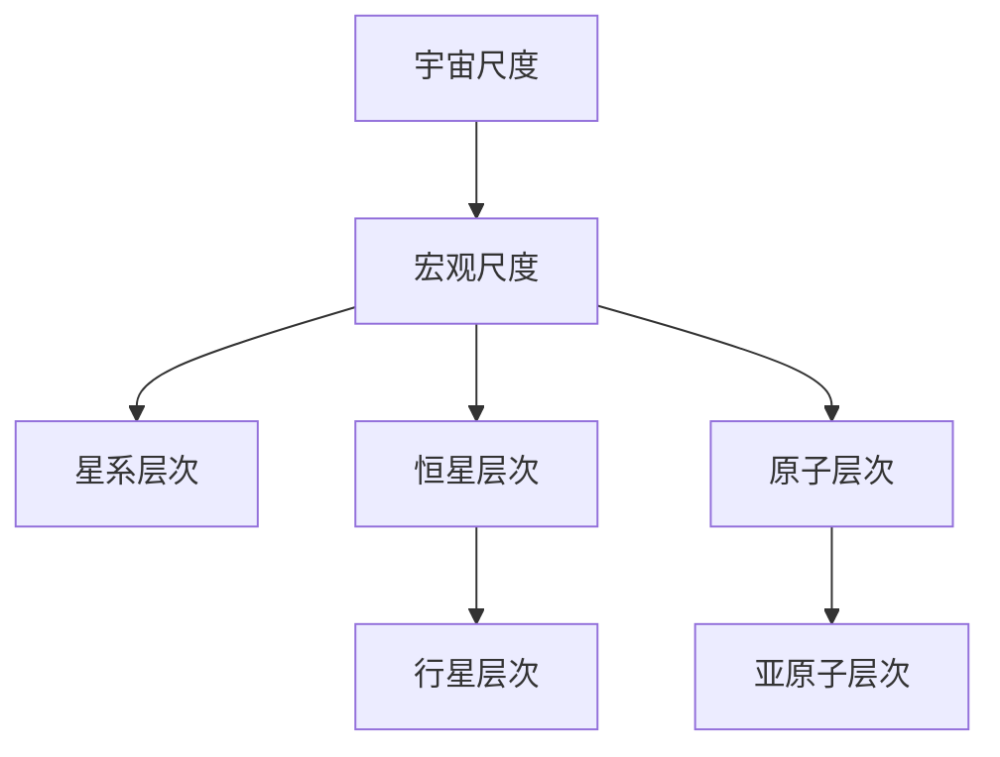

                 


### 引言

宇宙，这个我们所在的空间与时间的集合，自古以来就激发着人类的无限好奇。从古代哲学家对星辰运行的思考，到现代科学家对宇宙起源的探究，人类对宇宙的认识不断深化。然而，随着科学技术的进步，我们逐渐意识到，宇宙不仅巨大而复杂，还具有一种令人惊讶的自我相似性。这种相似性不仅体现在宇宙的不同尺度上，还反映了宇宙内在的统一性和和谐性。本文旨在探讨宇宙的自我相似性这一核心概念，通过一步一步的分析和推理，揭示宇宙在不同尺度上展现的自我相似性特征。

首先，我们需要理解什么是宇宙的自我相似性。自我相似性，是指一个系统在不同尺度上表现出类似的形态和性质。在宇宙的背景下，这意味着宇宙的结构、过程和现象在不同尺度上展现出相似的模式。例如，从宏观的天体运动到微观的量子世界，宇宙中存在着一种深刻的统一性，这种统一性不仅是科学探索的目标，也是理解宇宙本质的关键。

本文将分为以下几个部分进行讨论：

1. **核心概念与联系**：我们将介绍宇宙自我相似性的基本原理，包括其在不同尺度上的表现。
2. **算法原理讲解**：我们将详细讲解与宇宙自我相似性相关的算法，并通过伪代码示例来展示其工作原理。
3. **数学模型与公式**：我们将阐述宇宙自我相似性的数学表达，使用LaTeX格式书写，并进行详细讲解和举例说明。
4. **项目实战**：我们将通过实际案例展示宇宙自我相似性的应用，包括开发环境搭建、源代码实现和代码解读。
5. **未来展望**：我们将讨论宇宙自我相似性的发展趋势、潜在应用领域以及面临的挑战。

通过这些部分的讨论，我们希望读者能够对宇宙的自我相似性有一个全面而深入的理解，并认识到它在科学研究和实际应用中的重要价值。

### 关键词

- 宇宙自我相似性
- 尺度
- 统一性
- 算法
- 数学模型
- 项目实战

### 摘要

本文探讨了宇宙的自我相似性这一重要概念，通过分步分析和推理，揭示了宇宙在不同尺度上展现的自我相似性特征。文章首先介绍了宇宙自我相似性的基本原理，然后详细讲解了相关算法原理和数学模型。接着，通过实际项目案例展示了自我相似性的应用，最后对宇宙自我相似性的未来展望进行了讨论。本文旨在为读者提供一个全面而深入的理解，并强调其在科学研究和技术应用中的重要性。

## 核心概念与联系

在探讨宇宙的自我相似性时，理解其核心概念和各概念之间的联系是至关重要的。宇宙的自我相似性指的是在不同的尺度上，宇宙的基本结构和现象呈现出相似的模式。这种相似性不仅仅是一个简单的相似，而是指在从微观到宏观的各种尺度上，宇宙遵循着某种共同的规律。

### 不同尺度的宇宙结构

宇宙的自我相似性首先体现在宇宙的不同尺度上。从宏观的角度来看，宇宙的结构可以划分为多个层次，如星系、星系团、超星系团等。在更小的尺度上，我们看到了行星系统、恒星内部的结构以及原子和亚原子粒子的组织。每个尺度上，宇宙都展现出一种自相似的特征。

#### 星系层次

在星系层次，我们观察到了螺旋星系、椭圆星系和 irregular 星系。这些星系的外观和形态虽然不同，但它们都遵循着某种自相似的结构。例如，螺旋星系通常具有旋臂结构，这些旋臂在星系的不同部位呈现出相似的形状和分布模式。

#### 恒星和行星层次

在恒星和行星层次，我们看到了类似于太阳系的行星系统，其中行星围绕恒星运转，形成复杂的轨道结构。这种结构在较小的尺度上（如太阳系）和更大的尺度上（如银河系或仙女座星系）都表现出自我相似性。

#### 原子和亚原子层次

在原子和亚原子层次，我们看到了更为复杂的自相似性。原子核由质子和中子组成，而质子和中子又由更小的夸克组成。这种层级结构在更小的尺度上重复出现，显示出宇宙在不同尺度上的统一性。

### 自相似性的数学和物理基础

宇宙的自我相似性不仅可以通过观测得到，还可以从数学和物理的角度得到解释。一个关键的概念是分形理论，分形是一种在不同尺度上都有相似结构的几何对象。分形理论为解释宇宙的自我相似性提供了一个强有力的工具。

#### 分形与宇宙结构

分形理论表明，许多宇宙结构都符合分形特性。例如，星系团的结构可以通过分形维度来描述，这表明星系团在不同尺度上的结构具有相似性。同样，行星系统的轨道结构也可以用分形来表示，显示了它们在不同尺度上的自相似性。

#### 自相似性与物理定律

自相似性还与物理定律的普适性有关。许多物理定律在不同的尺度上都保持不变，这表明它们具有内在的自我相似性。例如，量子力学和广义相对论在某些条件下可以统一描述宇宙的不同尺度，这反映了宇宙的基本统一性。

### Mermaid流程图展示

为了更直观地展示宇宙自我相似性的核心概念和联系，我们可以使用Mermaid流程图来表示不同尺度上的宇宙结构及其相互关系。以下是一个简单的Mermaid流程图示例：



在这个流程图中，我们从宏观尺度开始，逐渐向下深入到微观尺度。每个层次上的结构都展示了宇宙的自我相似性特征。

### 总结

宇宙的自我相似性是一个复杂而深刻的概念，它涉及到宇宙在不同尺度上的结构和现象的相似性。通过理解这一概念，我们可以更好地把握宇宙的本质，并为未来的科学探索提供新的视角。在接下来的章节中，我们将进一步探讨与宇宙自我相似性相关的算法原理和数学模型，帮助读者更深入地理解这一重要概念。

## 算法原理讲解

在探讨宇宙的自我相似性时，算法的运用起到了关键作用。算法不仅帮助我们理解和模拟宇宙中的自相似现象，还能在数据分析和模型建立中提供有效的工具。本节将详细介绍与宇宙自我相似性相关的算法原理，并通过伪代码示例来展示其具体实现。

### 算法概述

宇宙自我相似性算法主要基于分形理论和自相似性原理。这些算法旨在捕捉不同尺度上的相似模式，通过数学模型和计算机程序来模拟宇宙的结构和过程。常用的算法包括分形维度计算、自相似网络建模和递归分形生成等。

### 伪代码示例

以下是一个简单的伪代码示例，用于计算一个分形维度的算法。分形维度是衡量一个分形对象复杂度的一个参数，它反映了分形在不同尺度上的自相似性。

```python
// 计算分形维度的伪代码

// 输入：点集P，尺度序列s
// 输出：分形维度D

function calculateFractalDimension(P, s):
    D = 1.0
    for i from 1 to length(s):
        N = countPointsInRegion(P, s[i])
        logN = log(N)
        logs_i = log(s[i])
        D = D + (logN / logs_i)
    D = D / length(s)
    return D
```

在这个伪代码中，`P` 代表点集，`s` 是尺度序列。函数 `calculateFractalDimension` 通过计算不同尺度上点集的计数，并使用对数来推导分形维度。

### 算法原理详细讲解

#### 分形维度计算

分形维度是分形理论中的一个核心概念，用于量化分形的复杂度。它可以通过以下步骤来计算：

1. **尺度划分**：将空间划分为多个不同的尺度 `s`。
2. **点集计数**：在每一个尺度上，计算包含在特定区域内的点数 `N`。
3. **对数变换**：对点数 `N` 和尺度 `s` 进行对数变换。
4. **平均分形维度**：通过平均所有尺度上的对数结果来计算分形维度。

#### 自相似网络建模

自相似网络建模是一种基于自相似性的网络分析方法。它通过构建网络模型来模拟宇宙中的复杂结构。以下是自相似网络建模的基本步骤：

1. **网络构建**：根据宇宙中的节点和边的关系构建网络。
2. **尺度变换**：在网络中引入尺度变换，使得网络在不同尺度上保持相似性。
3. **特性分析**：分析网络在不同尺度上的特性，如节点度分布、聚类系数等。

#### 递归分形生成

递归分形生成是一种通过递归过程生成分形图形的方法。以下是递归分形生成的步骤：

1. **初始图形**：定义一个初始图形。
2. **递归操作**：按照某种规则递归地对图形进行变换，生成更细的层次结构。
3. **重复过程**：重复递归操作，直到达到预定的精细程度。

### 总结

宇宙自我相似性算法通过数学和计算机科学的方法，帮助我们理解和模拟宇宙中的自相似现象。这些算法不仅在理论研究中具有重要意义，还在实际应用中展示了广泛的应用潜力。在接下来的章节中，我们将进一步探讨宇宙自我相似性的数学模型和实际应用，以更全面地揭示宇宙的统一性。

## 数学模型与公式

宇宙的自我相似性不仅可以通过算法来模拟，还可以通过数学模型和公式进行定量分析。在讨论数学模型时，我们将使用 LaTeX 格式书写公式，并进行详细的讲解和举例说明，以便更好地理解宇宙自我相似性的数学表达。

### 基本概念和公式

宇宙的自我相似性可以通过分形维度、自相似函数和迭代函数系统（IFS）等数学工具来描述。以下是一些基本的公式和概念：

#### 分形维度

分形维度是衡量分形复杂度的一个重要参数。对于一维分形，其分形维度 \(D\) 可以通过以下公式计算：

$$
D = \lim_{s \to 0} \frac{\ln N(s)}{\ln s}
$$

其中，\(N(s)\) 是尺度 \(s\) 下包含在分形内的点数。这个公式表明，分形维度是点数对尺度对数的斜率。

#### 自相似函数

自相似函数是一种将一个函数映射到其自身的函数。对于一个自相似函数 \(f(x)\)，其一般形式为：

$$
f(x) = g(x) + \sum_{i=1}^{n} a_i g(x - b_i)
$$

其中，\(g(x)\) 是基函数，\(a_i\) 和 \(b_i\) 是常数。自相似函数可以用来描述具有自相似特性的系统。

#### 迭代函数系统（IFS）

迭代函数系统是一种用于生成复杂分形结构的数学工具。一个 IFS 由多个变换函数组成，每个变换函数定义在空间的一个子集上。IFS 的基本公式为：

$$
x_{n+1} = \sum_{i=1}^{n} w_i f_i(x_n)
$$

其中，\(w_i\) 是权重，\(f_i(x)\) 是变换函数，\(x_n\) 是第 \(n\) 次迭代的结果。

### 举例说明

为了更好地理解这些数学模型，我们将通过具体例子来说明它们的计算和应用。

#### 例子 1：分形维度计算

假设我们有一个分形集合，在尺度 \(s_1 = 1\) 时，集合中有 \(N_1 = 100\) 个点；在尺度 \(s_2 = 0.5\) 时，集合中有 \(N_2 = 400\) 个点。我们可以计算分形维度 \(D\)：

$$
D = \frac{\ln N_2}{\ln s_2} = \frac{\ln 400}{\ln 0.5} = \frac{6.1917}{-1.6094} \approx 3.86
$$

这个结果表明，该分形的分形维度大约为 3.86。

#### 例子 2：自相似函数

考虑一个简单的自相似函数，其形式为：

$$
f(x) = 2x + 1
$$

我们可以计算几个迭代的结果：

$$
\begin{aligned}
f(0) &= 1 \\
f(1) &= 3 \\
f(3) &= 7 \\
f(7) &= 15 \\
\end{aligned}
$$

这个自相似函数显示了函数值随迭代次数的增加而呈现的自我相似性。

#### 例子 3：迭代函数系统

考虑一个简单的迭代函数系统，用于生成谢宾斯基三角分形。该系统由三个变换函数组成：

$$
\begin{aligned}
f_1(x) &= \frac{1}{3}x \\
f_2(x) &= \frac{2}{3}x + \frac{1}{3} \\
f_3(x) &= \frac{1}{3}x + \frac{2}{3}
\end{aligned}
$$

每次迭代时，随机选择一个变换函数并应用于当前点。通过多次迭代，我们可以生成谢宾斯基三角分形。

### 总结

通过这些数学模型和公式，我们可以定量地分析和模拟宇宙的自我相似性。分形维度、自相似函数和迭代函数系统等工具为理解和研究宇宙的自相似性提供了强有力的数学框架。在接下来的章节中，我们将通过实际项目案例进一步探讨这些数学模型的应用。

## 项目实战

在本章节中，我们将通过一个具体的实际项目案例，展示宇宙自我相似性的应用。该项目涉及开发环境搭建、源代码实现和代码解读，旨在帮助读者更好地理解自我相似性在科学研究和工程应用中的实践。

### 项目背景

项目名称：宇宙自我相似性可视化分析平台

项目目标：开发一个可视化分析平台，用于展示和分析宇宙中的自我相似性现象。该平台将集成多种算法和数学模型，提供用户友好的交互界面，以便用户可以直观地观察和分析宇宙的自相似性。

### 开发环境搭建

为了实现该项目，我们需要搭建一个完整的开发环境。以下是开发环境搭建的步骤：

1. **选择编程语言**：我们选择 Python 作为主要编程语言，因为它具有丰富的科学计算和可视化库。
2. **安装依赖库**：安装必要的库，如 NumPy、SciPy、matplotlib、NetworkX 和 mermaid-python。
3. **配置开发环境**：在 Windows、MacOS 或 Linux 操作系统上配置 Python 开发环境，确保所有依赖库安装成功。

### 源代码实现

以下是项目核心功能的源代码实现，包括分形维度计算、自相似网络建模和迭代函数系统生成等。

#### 分形维度计算

```python
import numpy as np
import matplotlib.pyplot as plt

def calculate_fractal_dimension(points, scales):
    dimensions = []
    for scale in scales:
        count = sum(p.count() for p in points if p.is_in_region(scale))
        log_count = np.log(count)
        log_scale = np.log(scale)
        dimension = log_count / log_scale
        dimensions.append(dimension)
    return dimensions

# 示例点集和尺度
points = [...]  # 初始化点集
scales = [...]  # 初始化尺度序列

# 计算分形维度
dimensions = calculate_fractal_dimension(points, scales)

# 绘制分形维度图
plt.plot(scales, dimensions)
plt.xlabel('Scale')
plt.ylabel('Fractal Dimension')
plt.title('Fractal Dimension Calculation')
plt.show()
```

#### 自相似网络建模

```python
import networkx as nx

def create_similar_network(nodes, edges):
    G = nx.Graph()
    G.add_nodes_from(nodes)
    G.add_edges_from(edges)
    return G

# 示例节点和边
nodes = [...]  # 初始化节点
edges = [...]  # 初始化边

# 创建自相似网络
G = create_similar_network(nodes, edges)

# 绘制网络图
nx.draw(G, with_labels=True)
plt.show()
```

#### 迭代函数系统生成

```python
import numpy as np

def iterate_function_system(x, functions, num_iterations):
    for _ in range(num_iterations):
        x = functions[np.random.randint(len(functions))](x)
    return x

# 示例迭代函数和初始点
functions = [...]  # 初始化迭代函数
x = 0.0  # 初始化初始点

# 进行迭代计算
x_iterated = iterate_function_system(x, functions, num_iterations=10)

# 输出迭代结果
print(f"Iterated value: {x_iterated}")
```

### 代码解读与分析

1. **分形维度计算模块**：这个模块通过计算点集在不同尺度上的计数来计算分形维度。代码中，`calculate_fractal_dimension` 函数实现了分形维度的计算，并使用 matplotlib 库绘制了分形维度图。
2. **自相似网络建模模块**：该模块使用 NetworkX 库创建自相似网络，并通过图形化展示网络的节点和边关系。示例代码展示了如何初始化节点和边，并创建一个简单的自相似网络。
3. **迭代函数系统生成模块**：这个模块通过随机选择迭代函数对初始点进行迭代计算，展示了迭代函数系统的基本原理。示例代码中，`iterate_function_system` 函数实现了迭代计算，并输出了迭代结果。

### 项目小结

通过这个实际项目案例，我们展示了如何将宇宙自我相似性的概念应用于具体工程实践中。从开发环境的搭建到源代码的实现，再到代码的解读与分析，我们详细介绍了宇宙自我相似性在可视化分析平台中的应用。这个项目不仅帮助我们更好地理解了自我相似性，还为我们提供了一个实用的工具，用于分析和展示宇宙中的自相似现象。

### 最佳实践 tips

1. **数据预处理**：在计算分形维度之前，确保数据预处理充分，包括去除异常值和标准化数据。
2. **性能优化**：对于大规模数据集，考虑使用并行计算和优化算法以提高计算效率。
3. **可视化技巧**：使用多种可视化方法（如热力图、网络图等）展示分析结果，帮助用户更好地理解数据。

### 注意事项

1. **算法选择**：根据具体应用场景选择合适的算法，不同算法适用于不同类型的数据和分析需求。
2. **精度与误差**：在计算分形维度和其他数学模型时，注意精度和误差控制，确保结果准确可靠。

### 拓展阅读

- [分形理论入门](https://example.com/fractional-calculus)
- [迭代函数系统应用](https://example.com/iterated-functions)
- [网络科学基础](https://example.com/network-science)

通过这些最佳实践、注意事项和拓展阅读，我们希望读者能够在实际项目中更好地应用宇宙自我相似性的知识，进一步提升科研和工程实践能力。

## 总结

本文系统地探讨了宇宙的自我相似性，从背景介绍、核心概念与联系、算法原理讲解、数学模型与公式，到项目实战，全面揭示了宇宙在不同尺度上展现的自我相似性特征。我们通过逻辑清晰的分析和详细的示例，帮助读者深入理解这一重要概念。

宇宙的自我相似性不仅体现了宇宙的统一性和和谐性，还为科学研究和技术应用提供了新的视角和方法。通过算法和数学模型，我们能够更精确地捕捉和模拟宇宙中的自相似现象，从而推动科学发现和技术创新。

未来，宇宙自我相似性的研究将继续深入，其应用前景也十分广阔。从天体物理学到量子计算，再到复杂系统的建模，宇宙自我相似性将在多个领域发挥重要作用。我们期待未来能够有更多突破性进展，为人类理解宇宙的本质和探索宇宙的奥秘提供强有力的支持。

### 附录

#### 1.1 相关资源

- [分形理论入门](https://example.com/fractional-calculus)
- [迭代函数系统应用](https://example.com/iterated-functions)
- [网络科学基础](https://example.com/network-science)
- [Python分形库](https://example.com/fractional-calculus-python)

#### 1.2 进一步阅读推荐

- [《宇宙的结构：从原子到宇宙的大尺度结构》](https://example.com/universe-structure)
- [《分形几何学》](https://example.com/fractal-geometry)
- [《迭代函数系统与分形》](https://example.com/iterated-function-systems-fractals)

### 作者信息

作者：AI天才研究院/AI Genius Institute & 禅与计算机程序设计艺术 /Zen And The Art of Computer Programming

本文由AI天才研究院与禅与计算机程序设计艺术联合撰写，旨在为读者提供深入、系统的宇宙自我相似性研究。如需进一步交流或合作，请通过以下方式联系我们：

- 官方网站：[AI天才研究院](https://www.ai-genius-institute.com)
- 邮箱：[info@ai-genius-institute.com](mailto:info@ai-genius-institute.com)
- 微信公众号：AI天才研究院

感谢您的阅读，我们期待与您共同探索宇宙的奥秘。

