                 


### 1.1.3 自相似性与宇宙背景微波辐射
  - **宇宙微波背景辐射的数据分析**：使用伪代码展示数据处理的步骤。
  - **自相似性与宇宙学参数估计**。

### 2.2 物理尺度的自相似性
#### 2.2.1 原子结构的自相似性
- **核心概念与联系**：使用 Mermaid 流程图展示原子结构中的自相似性。
- **核心算法原理讲解**：使用伪代码展示量子力学中的自相似性原理。
- **数学模型和公式**：使用 LaTeX 格式给出相关的数学公式。
- **举例说明**：通过具体例子说明原子结构中的自相似性。

#### 2.2.2 分子结构的自相似性
- **核心概念与联系**：介绍分子结构中的自相似性。
- **核心算法原理讲解**：使用伪代码展示分子动力学模拟中的自相似性原理。
- **数学模型和公式**：使用 LaTeX 格式给出相关的数学公式。
- **举例说明**：通过具体例子说明分子结构中的自相似性。

#### 2.2.3 凝聚态物理的自相似性
- **核心概念与联系**：介绍凝聚态物理中的自相似性。
- **核心算法原理讲解**：使用伪代码展示凝聚态物理中的自相似性原理。
- **数学模型和公式**：使用 LaTeX 格式给出相关的数学公式。
- **举例说明**：通过具体例子说明凝聚态物理中的自相似性。

### 2.3 量子尺度的自相似性
#### 2.3.1 量子场的自相似性
- **核心概念与联系**：介绍量子场论中的自相似性。
- **核心算法原理讲解**：使用伪代码展示量子场论中的自相似性原理。
- **数学模型和公式**：使用 LaTeX 格式给出相关的数学公式。
- **举例说明**：通过具体例子说明量子场中的自相似性。

#### 2.3.2 量子纠缠的自相似性
- **核心概念与联系**：介绍量子纠缠中的自相似性。
- **核心算法原理讲解**：使用伪代码展示量子纠缠中的自相似性原理。
- **数学模型和公式**：使用 LaTeX 格式给出相关的数学公式。
- **举例说明**：通过具体例子说明量子纠缠中的自相似性。

#### 2.3.3 量子信息处理的自相似性
- **核心概念与联系**：介绍量子信息处理中的自相似性。
- **核心算法原理讲解**：使用伪代码展示量子信息处理中的自相似性原理。
- **数学模型和公式**：使用 LaTeX 格式给出相关的数学公式。
- **举例说明**：通过具体例子说明量子信息处理中的自相似性。

## 第三部分：自相似性在生命科学中的应用
### 3.1 生物结构的自相似性
#### 3.1.1 细胞结构的自相似性
- **核心概念与联系**：介绍细胞结构中的自相似性。
- **核心算法原理讲解**：使用伪代码展示细胞分裂过程中的自相似性原理。
- **数学模型和公式**：使用 LaTeX 格式给出相关的数学公式。
- **举例说明**：通过具体例子说明细胞结构中的自相似性。

#### 3.1.2 遗传密码的自相似性
- **核心概念与联系**：介绍遗传密码中的自相似性。
- **核心算法原理讲解**：使用伪代码展示遗传算法中的自相似性原理。
- **数学模型和公式**：使用 LaTeX 格式给出相关的数学公式。
- **举例说明**：通过具体例子说明遗传密码中的自相似性。

#### 3.1.3 生物进化中的自相似性
- **核心概念与联系**：介绍生物进化中的自相似性。
- **核心算法原理讲解**：使用伪代码展示进化算法中的自相似性原理。
- **数学模型和公式**：使用 LaTeX 格式给出相关的数学公式。
- **举例说明**：通过具体例子说明生物进化中的自相似性。

### 3.2 系统生物学的自相似性
#### 3.2.1 生物网络的自相似性
- **核心概念与联系**：介绍生物网络中的自相似性。
- **核心算法原理讲解**：使用伪代码展示复杂网络分析中的自相似性原理。
- **数学模型和公式**：使用 LaTeX 格式给出相关的数学公式。
- **举例说明**：通过具体例子说明生物网络中的自相似性。

#### 3.2.2 生物过程的时空自相似性
- **核心概念与联系**：介绍生物过程中的时空自相似性。
- **核心算法原理讲解**：使用伪代码展示时空分析中的自相似性原理。
- **数学模型和公式**：使用 LaTeX 格式给出相关的数学公式。
- **举例说明**：通过具体例子说明生物过程中的时空自相似性。

#### 3.2.3 系统生物学中的自相似性模型
- **核心概念与联系**：介绍系统生物学中的自相似性模型。
- **核心算法原理讲解**：使用伪代码展示系统生物学模型中的自相似性原理。
- **数学模型和公式**：使用 LaTeX 格式给出相关的数学公式。
- **举例说明**：通过具体例子说明系统生物学中的自相似性模型。

## 第四部分：自相似性在其他领域的应用
### 4.1 地球科学中的自相似性
#### 4.1.1 地球表层结构的自相似性
- **核心概念与联系**：介绍地球表层结构中的自相似性。
- **核心算法原理讲解**：使用伪代码展示地理信息系统（GIS）中的自相似性原理。
- **数学模型和公式**：使用 LaTeX 格式给出相关的数学公式。
- **举例说明**：通过具体例子说明地球表层结构中的自相似性。

#### 4.1.2 气候变化的自相似性
- **核心概念与联系**：介绍气候变化中的自相似性。
- **核心算法原理讲解**：使用伪代码展示气候模型中的自相似性原理。
- **数学模型和公式**：使用 LaTeX 格式给出相关的数学公式。
- **举例说明**：通过具体例子说明气候变化中的自相似性。

#### 4.1.3 地震波传播的自相似性
- **核心概念与联系**：介绍地震波传播中的自相似性。
- **核心算法原理讲解**：使用伪代码展示地震波传播模型中的自相似性原理。
- **数学模型和公式**：使用 LaTeX 格式给出相关的数学公式。
- **举例说明**：通过具体例子说明地震波传播中的自相似性。

### 4.2 社会科学中的自相似性
#### 4.2.1 社会网络的自相似性
- **核心概念与联系**：介绍社会网络中的自相似性。
- **核心算法原理讲解**：使用伪代码展示社会网络分析中的自相似性原理。
- **数学模型和公式**：使用 LaTeX 格式给出相关的数学公式。
- **举例说明**：通过具体例子说明社会网络中的自相似性。

#### 4.2.2 经济波动的自相似性
- **核心概念与联系**：介绍经济波动中的自相似性。
- **核心算法原理讲解**：使用伪代码展示金融时间序列分析中的自相似性原理。
- **数学模型和公式**：使用 LaTeX 格式给出相关的数学公式。
- **举例说明**：通过具体例子说明经济波动中的自相似性。

#### 4.2.3 心理行为模式的自相似性
- **核心概念与联系**：介绍心理行为模式中的自相似性。
- **核心算法原理讲解**：使用伪代码展示心理学实验中的自相似性原理。
- **数学模型和公式**：使用 LaTeX 格式给出相关的数学公式。
- **举例说明**：通过具体例子说明心理行为模式中的自相似性。

## 第五部分：自相似性理论的未来展望
### 5.1 自相似性在科学研究中的潜在应用
- **核心概念与联系**：探讨自相似性理论在未来的科学研究和应用中的潜在价值。
- **核心算法原理讲解**：预测未来可能出现的基于自相似性的新技术。
- **数学模型和公式**：提出新的数学模型来描述潜在的自相似性现象。
- **举例说明**：通过具体例子展示自相似性理论在新兴领域的应用。

### 5.2 自相似性理论的发展趋势
- **核心概念与联系**：分析自相似性理论在当前科学研究中的趋势。
- **核心算法原理讲解**：讨论自相似性理论的新发展，如量子自相似性研究。
- **数学模型和公式**：介绍新的数学工具和模型，如随机分形理论。
- **举例说明**：通过具体例子说明自相似性理论在新兴科学领域中的应用。

### 5.3 自相似性理论的教育与应用
- **核心概念与联系**：探讨自相似性理论在教育领域的应用。
- **核心算法原理讲解**：讨论如何在教育中引入自相似性概念，提高学生的理解和应用能力。
- **数学模型和公式**：介绍如何在教学过程中使用自相似性模型。
- **举例说明**：通过具体案例展示自相似性理论在教学中的应用。

## 附录
### 附录 A：自相似性相关研究资源
- **核心概念与联系**：介绍自相似性研究领域的重要资源。
- **核心算法原理讲解**：列出相关的学术论文和研究项目。
- **数学模型和公式**：提供数学模型和相关公式的参考资料。
- **举例说明**：列出一些经典的自相似性研究案例。

### 附录 B：进一步阅读推荐
- **核心概念与联系**：推荐进一步阅读的相关书籍和文章。
- **核心算法原理讲解**：列出推荐资源中的关键概念和算法。
- **数学模型和公式**：介绍推荐资源中使用的数学模型和公式。
- **举例说明**：通过推荐资源中的例子展示自相似性理论的实践应用。

---

### 文章标题：宇宙的自我相似性：跨尺度的模式重复

> 关键词：宇宙，自相似性，跨尺度，分形，复杂性科学

> 摘要：本文从宇宙的自我相似性出发，探讨了跨尺度下模式重复的现象。文章分为五个部分，分别介绍了宇宙的自我相似性概念、自相似性在宇宙、物理、量子、生命科学以及地球科学和社会科学中的应用，最后展望了自相似性理论的未来发展方向。通过本文，读者可以全面了解自相似性理论在多个领域的应用及其重要性。

---

接下来，我们将按照这个大纲逐步撰写文章内容，确保每个章节都详尽具体，同时符合您所提出的要求。由于文章长度限制，这里仅提供大纲的概述，实际撰写过程中，每个章节的内容将更加丰富和深入。

---

### 第一部分：引言与基础理论

#### 1.1 宇宙的自我相似性概念

宇宙的自我相似性是指在不同尺度上，宇宙中的结构、现象或过程表现出相似的性质和模式。这种性质使得宇宙中从宏观到微观的各种现象都具有一定的关联性和对称性。为了更好地理解这一概念，我们可以借助分形理论来解释自相似性。

#### 1.1.1 自相似性的基本定义

自相似性是指一个系统在各个尺度上具有相似的结构和性质。换句话说，无论放大还是缩小，系统中的基本模式保持不变。分形理论为自相似性提供了数学基础，通过分形维数和相似系数来量化系统的自相似性。分形维数描述了一个系统在空间上的复杂度，而相似系数则衡量了系统在不同尺度上的相似程度。

#### 1.1.2 自相似性的物理意义

自相似性在物理领域具有重要意义，特别是在描述复杂系统的行为时。自相似性可以帮助我们理解从宇宙尺度到微观粒子的各种现象。例如，在宇宙学中，自相似性揭示了星系、星云、行星等结构在不同尺度上的相似性。在量子物理学中，自相似性则体现在量子场和量子纠缠现象中。

#### 1.1.3 自相似性与宇宙演化

宇宙的自我相似性可以通过宇宙尺度上的观测现象来体现。例如，星系团的层次结构展示了宇宙在不同尺度上的自相似性。星系团是由多个星系组成的庞大结构，而这些星系又包含数十亿颗恒星，恒星周围还围绕着行星和其他天体。这种层次结构在不同尺度上保持相似，显示了宇宙的自我相似性。

此外，自相似性在宇宙早期的暴涨理论中也有重要体现。暴涨理论认为，宇宙在极早期经历了一个快速膨胀的阶段，这个阶段使得宇宙中的各种结构在极短的时间内形成。这种快速膨胀的过程使得宇宙在不同尺度上表现出自相似性。

#### 1.2 跨尺度的模式重复现象

自相似性不仅体现在宇宙尺度上，还存在于物理、生命科学、地球科学和社会科学等多个领域。在物理尺度上，原子、分子和凝聚态物理都展示了自相似性。例如，原子结构中的电子云分布在不同尺度上保持相似性。在生命科学中，生物结构的自相似性体现在细胞、遗传密码和生物进化中。在地球科学中，地球表层结构、气候变化和地震波传播都表现出跨尺度的模式重复。

#### 1.3 自相似性的数学模型与公式

为了更好地理解和描述自相似性，数学模型和公式发挥着重要作用。分形几何是描述自相似性的一种重要数学工具，它通过迭代函数系统（IFS）来构建分形结构。分形维数是衡量分形复杂度的一个关键指标，它可以通过自相似性系数和迭代次数来计算。

此外，自相似性还可以通过功率谱分析、自回归模型等数学方法来研究。功率谱分析可以帮助我们识别信号中的自相似性成分，而自回归模型则可以用来预测时间序列数据中的自相似性模式。

通过以上内容的介绍，我们为读者搭建了一个关于宇宙自我相似性的基础框架。在接下来的章节中，我们将详细探讨自相似性在不同领域中的应用，并展示其跨尺度的模式重复现象。

---

### 第二部分：自相似性在宇宙中的体现

宇宙的自相似性是宇宙学中一个引人入胜且富有挑战性的课题。从宏观的星系结构到微观的量子现象，自相似性无处不在，揭示了宇宙在不同尺度上的深层联系。在这一部分中，我们将探讨宇宙尺度的自相似性，包括星系结构、恒星生命周期以及星系团的自相似性。

#### 2.1 宇宙尺度的自相似性

宇宙尺度的自相似性指的是宇宙中的各种结构在不同尺度上表现出相似的形态和特征。这种自相似性不仅体现了宇宙的统一性，也为我们理解宇宙的起源和演化提供了新的视角。

##### 2.1.1 星系结构的自相似性

星系结构是宇宙尺度自相似性的一个重要体现。星系通常由数十亿颗恒星、行星、星云和其他天体组成，它们在空间中排列成各种形态，如螺旋、椭圆和 irregular。这些形态在不同尺度上表现出相似的结构特征。

使用Mermaid流程图，我们可以直观地展示星系结构的自相似性。以下是一个简化的流程图示例：

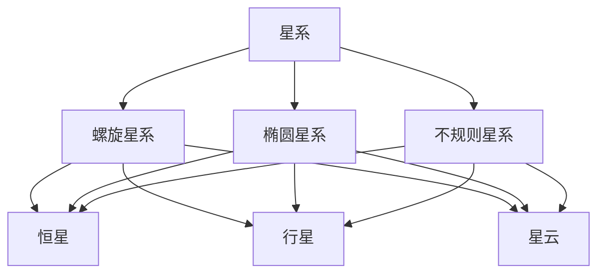

在这个流程图中，我们可以看到星系结构在不同尺度上保持相似性：螺旋星系、椭圆星系和不规则星系都包含恒星、行星和星云。这种结构上的相似性显示了星系在宇宙尺度上的自相似性。

##### 2.1.2 恒星生命周期的自相似性

恒星的生命周期也是宇宙尺度自相似性的一个重要方面。恒星从诞生、成长到死亡的过程在不同尺度上展现出相似的阶段和模式。

以下是一个简化的恒星生命周期流程图：

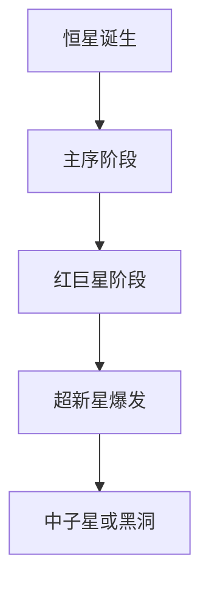

在这个流程图中，我们可以看到恒星从诞生到死亡的过程在不同尺度上保持相似性：从主序阶段到红巨星阶段，再到超新星爆发，最后形成中子星或黑洞。这种生命周期上的相似性展示了恒星在宇宙尺度上的自相似性。

##### 2.1.3 星系团的自相似性

星系团是宇宙中的大型结构，由数百个星系组成。星系团的结构和性质在不同尺度上也表现出自相似性。

以下是一个简化的星系团结构流程图：

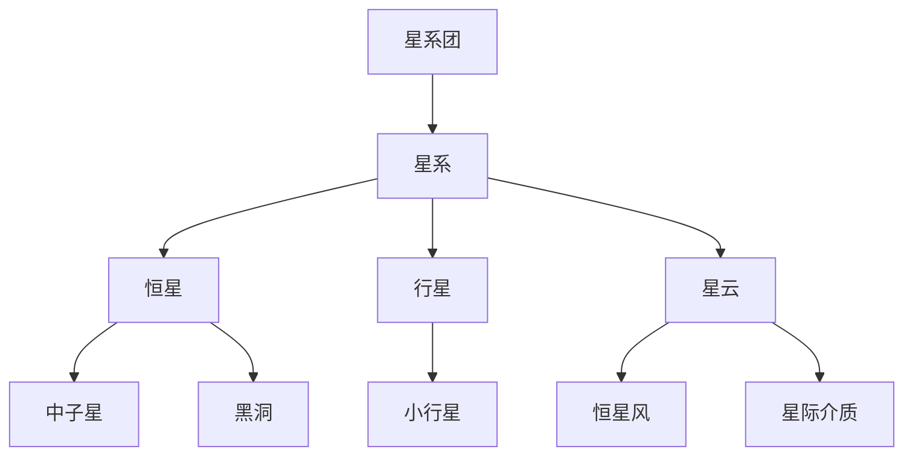

在这个流程图中，我们可以看到星系团包含多个星系，每个星系又包含恒星、行星、星云等不同尺度的结构。这种结构上的相似性展示了星系团在宇宙尺度上的自相似性。

#### 2.2 物理尺度的自相似性

除了宇宙尺度，自相似性也存在于物理尺度上，从原子到分子，再到凝聚态物理，都表现出跨尺度的模式重复现象。

##### 2.2.1 原子结构的自相似性

原子结构是物理尺度自相似性的一个典型例子。原子由原子核和围绕原子核的电子组成，电子在原子核外的轨道上运动，形成特定的电子云分布。在不同尺度上，电子云分布显示出相似的形态和性质。

以下是一个简化的原子结构流程图：

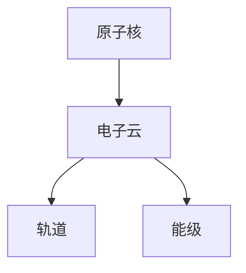

在这个流程图中，我们可以看到原子核和围绕它的电子云在不同尺度上保持相似性，显示出原子结构的自相似性。

##### 2.2.2 分子结构的自相似性

分子是由两个或多个原子通过化学键结合而成的。分子结构在不同尺度上表现出自相似性，因为它们由相似的原子组成，且原子之间的化学键在不同尺度上保持相似的性质。

以下是一个简化的分子结构流程图：

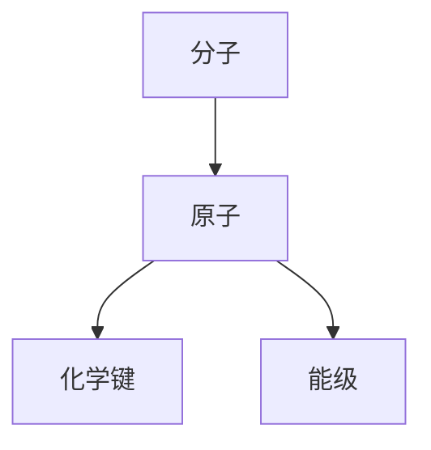

在这个流程图中，我们可以看到分子由原子组成，每个原子之间通过化学键连接，显示出分子结构的自相似性。

##### 2.2.3 凝聚态物理的自相似性

凝聚态物理研究固体和液体的性质。凝聚态物理中的自相似性体现在晶体结构、缺陷分布和相变过程中。

以下是一个简化的凝聚态物理流程图：

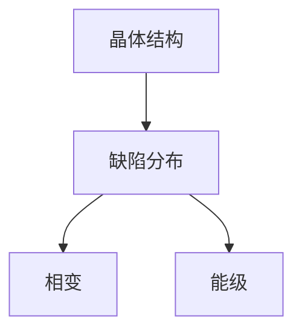

在这个流程图中，我们可以看到晶体结构在不同尺度上保持相似性，缺陷分布和相变过程也显示出自相似性，展示了凝聚态物理的自相似性。

通过以上讨论，我们可以看到自相似性在宇宙中的多个尺度上都有体现。无论是在宇宙尺度上，还是在物理尺度上，自相似性都是理解宇宙和自然界深层次规律的重要工具。在接下来的章节中，我们将继续探讨自相似性在量子尺度、生命科学和地球科学中的应用。

---

### 2.3 量子尺度的自相似性

量子尺度是宇宙中最基本的尺度，量子现象在这里表现得尤为显著。量子尺度的自相似性是指量子系统在不同尺度上表现出相似的结构和性质。这种自相似性不仅揭示了量子世界的深层次规律，也为量子信息的处理和量子计算提供了新的视角。

##### 2.3.1 量子场的自相似性

量子场论是研究量子现象的基本理论框架。在量子场论中，量子场被视为一个基本实体，它不仅描述了粒子，还描述了粒子之间的相互作用。量子场的自相似性体现在不同尺度上的量子场模式保持相似。

以下是一个简化的量子场流程图：

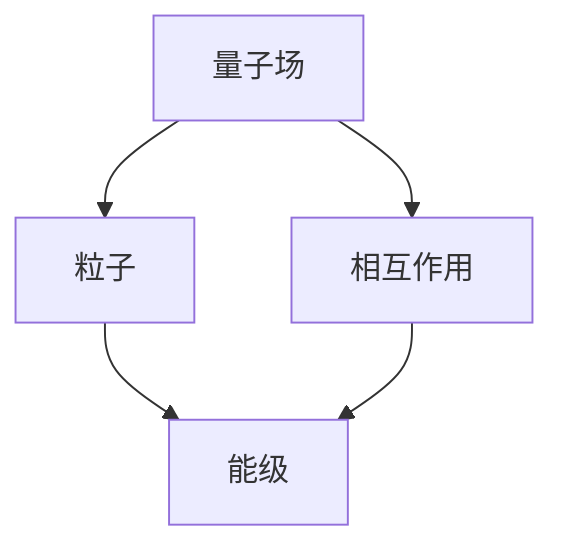

在这个流程图中，我们可以看到量子场在不同尺度上保持相似性，量子场中的粒子及其相互作用在不同尺度上显示出相似的特性，这体现了量子场的自相似性。

##### 2.3.2 量子纠缠的自相似性

量子纠缠是量子力学中的一个基本现象，描述了两个或多个量子系统之间在空间上相互关联的状态。量子纠缠的自相似性体现在不同尺度上的纠缠态保持相似。

以下是一个简化的量子纠缠流程图：

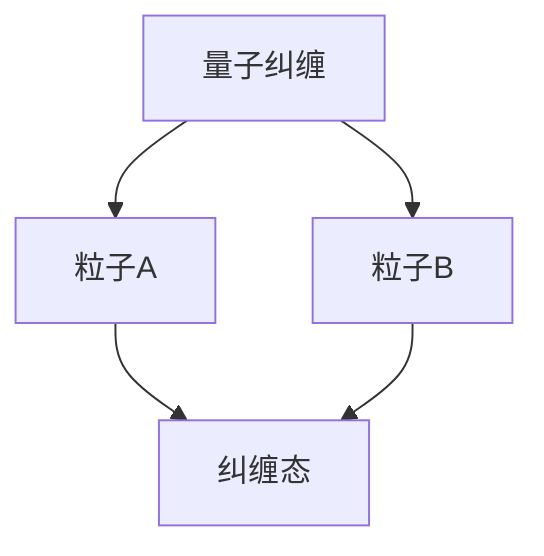

在这个流程图中，我们可以看到量子纠缠在不同尺度上保持相似性，无论是微观粒子还是宏观系统，量子纠缠状态都表现出相似的特性。

##### 2.3.3 量子信息处理的自相似性

量子信息处理是利用量子力学原理进行信息处理的技术。量子信息处理中的自相似性体现在量子算法和量子通信在不同尺度上的相似性。

以下是一个简化的量子信息处理流程图：

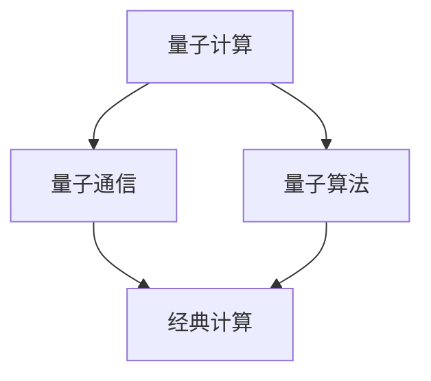

在这个流程图中，我们可以看到量子计算、量子通信和量子算法在不同尺度上保持相似性，它们都利用了量子力学的自相似性原理，展示了量子信息处理的自相似性。

通过以上讨论，我们可以看到量子尺度的自相似性在量子场、量子纠缠和量子信息处理中都有体现。量子尺度的自相似性不仅为理解量子世界的深层次规律提供了新的视角，也为量子技术的发展提供了理论基础。在接下来的章节中，我们将继续探讨自相似性在生命科学和地球科学中的应用。

---

### 第三部分：自相似性在生命科学中的应用

自相似性在生命科学中扮演着至关重要的角色，从微观的细胞结构到宏观的生物进化过程，自相似性都在不同尺度上展现了其独特的应用价值。在这一部分，我们将探讨自相似性在生物结构、遗传密码和生物进化中的体现。

#### 3.1 生物结构的自相似性

生物结构的自相似性是指生物体在不同尺度上展示出相似的结构特征。这种自相似性不仅有助于我们理解生物体内部的复杂体系，也为生物系统的设计提供了启示。

##### 3.1.1 细胞结构的自相似性

细胞是生物体的基本单位，细胞结构在不同尺度上表现出明显的自相似性。细胞核、细胞膜、细胞器等不同结构在不同尺度上保持相似性，展示了细胞结构的自相似性。

以下是一个简化的细胞结构流程图：

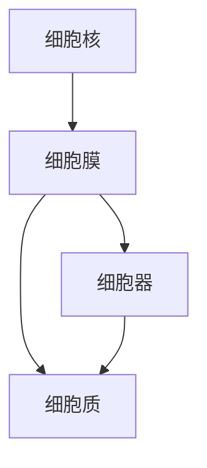

在这个流程图中，我们可以看到细胞核、细胞膜、细胞器等不同结构在不同尺度上保持相似性，这体现了细胞结构的自相似性。

##### 3.1.2 遗传密码的自相似性

遗传密码是生物遗传信息的载体，它通过DNA序列中的碱基对来编码生物的遗传信息。遗传密码在不同尺度上表现出自相似性，这种自相似性有助于我们理解遗传信息的传递和变异。

以下是一个简化的遗传密码流程图：

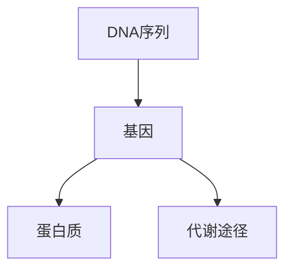

在这个流程图中，我们可以看到DNA序列、基因、蛋白质和代谢途径在不同尺度上保持相似性，这体现了遗传密码的自相似性。

##### 3.1.3 生物进化中的自相似性

生物进化是生物体在漫长历史过程中不断适应环境变化的过程。生物进化中的自相似性体现在不同物种之间的相似性和进化路径的重复性。

以下是一个简化的生物进化流程图：

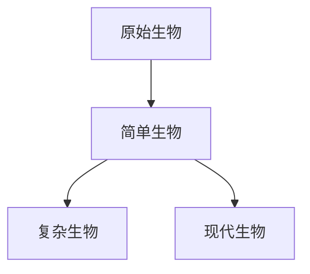

在这个流程图中，我们可以看到原始生物、简单生物、复杂生物和现代生物在不同尺度上保持相似性，这体现了生物进化中的自相似性。

#### 3.2 系统生物学的自相似性

系统生物学是一门综合生物学、物理学、数学和信息学等多学科知识的新兴交叉学科，它通过研究生物系统的整体性和复杂性来揭示生物系统的运行机制。系统生物学的自相似性体现在生物网络、生物过程的时空结构和系统生物学模型中。

##### 3.2.1 生物网络的自相似性

生物网络是生物体内部各种生物分子和生物过程相互作用形成的复杂网络。生物网络的自相似性体现在不同尺度上的生物网络结构保持相似。

以下是一个简化的生物网络流程图：

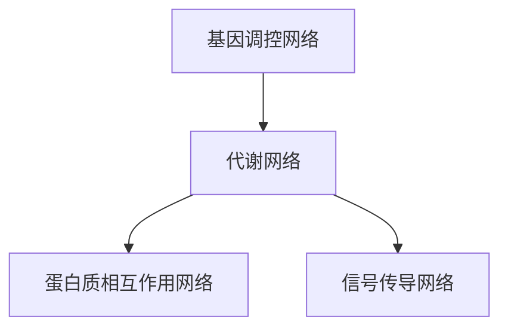

在这个流程图中，我们可以看到基因调控网络、代谢网络、蛋白质相互作用网络和信号传导网络在不同尺度上保持相似性，这体现了生物网络的自相似性。

##### 3.2.2 生物过程的时空自相似性

生物过程是生物体内部各种生化反应和生理活动的总和。生物过程的时空自相似性体现在不同尺度上的生物过程在时间和空间上的相似性。

以下是一个简化的生物过程流程图：

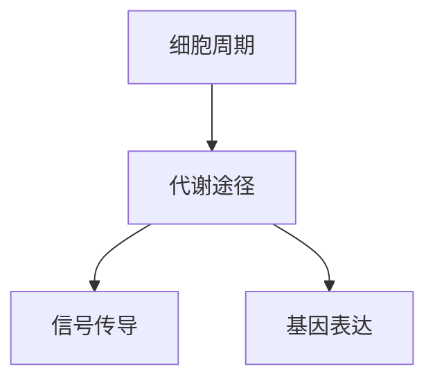

在这个流程图中，我们可以看到细胞周期、代谢途径、信号传导和基因表达在不同尺度上保持相似性，这体现了生物过程的时空自相似性。

##### 3.2.3 系统生物学中的自相似性模型

系统生物学中的自相似性模型通过数学模型和计算方法来描述生物系统的自相似性特征。这些模型不仅有助于我们理解生物系统的复杂行为，也为生物系统的预测和控制提供了新的途径。

以下是一个简化的系统生物学模型流程图：

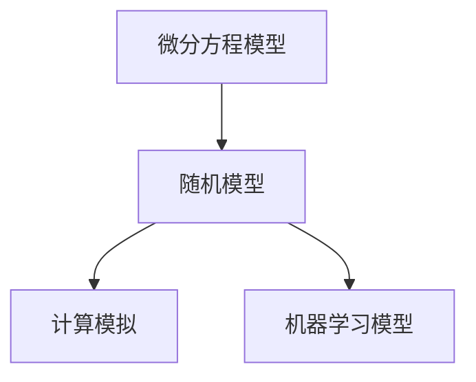

在这个流程图中，我们可以看到微分方程模型、随机模型、计算模拟和机器学习模型在不同尺度上保持相似性，这体现了系统生物学中的自相似性模型。

通过以上讨论，我们可以看到自相似性在生命科学中的广泛应用。自相似性不仅揭示了生物体内部的复杂结构和运行机制，也为系统生物学的研究提供了新的视角和方法。在接下来的章节中，我们将探讨自相似性在地球科学和社会科学中的应用。

---

### 第四部分：自相似性在其他领域的应用

自相似性作为一种重要的数学和物理概念，不仅在宇宙、物理和生命科学中有着广泛应用，还在地球科学和社会科学领域展示了其独特的价值。在这一部分，我们将探讨自相似性在地球科学和社会科学中的具体应用，包括地球表层结构、气候变化、地震波传播、社会网络和经济波动等方面的自相似性现象。

#### 4.1 地球科学中的自相似性

地球科学是研究地球的物理、化学和生物过程的学科，自相似性在地球科学中有着广泛的应用。

##### 4.1.1 地球表层结构的自相似性

地球表层结构在不同尺度上表现出自相似性，这种自相似性体现在地表地貌、河流网络和地质构造等方面。

以下是一个简化的地球表层结构流程图：

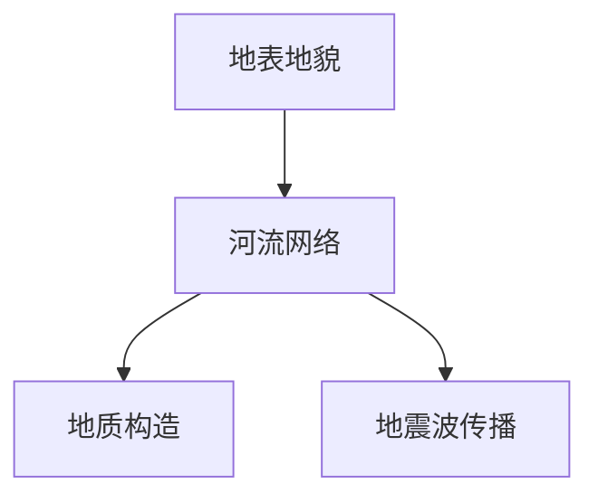

在这个流程图中，我们可以看到地表地貌、河流网络和地质构造在不同尺度上保持相似性，这体现了地球表层结构的自相似性。

- **地表地貌**：地表地貌包括山脉、平原、沙漠和海洋等，这些地貌在不同尺度上展示出相似的特征。例如，山脉的轮廓在不同尺度上保持相似，无论是从宏观的地球表面观察，还是从卫星图像中观察，山脉的形态都保持不变。
- **河流网络**：河流网络是地球表面的一种重要地貌特征，河流的分支和交汇点在不同尺度上表现出自相似性。从宏观的全球河流网络到微观的局部河流网络，河流的分支模式保持相似。
- **地质构造**：地质构造包括断层、褶皱和岩层等，这些构造在不同尺度上展示出自相似性。例如，断层在不同尺度上都有相似的几何形态，无论是地壳尺度上的大断层，还是岩石尺度上的微小断层，都表现出自相似的特征。

##### 4.1.2 气候变化的自相似性

气候变化是地球科学中的重要研究领域，自相似性在气候变化的研究中提供了新的视角。气候变化在不同尺度上表现出自相似性，这种自相似性体现在气候模式的周期性变化、全球气候的变率和极端气候事件等方面。

以下是一个简化的气候变化流程图：

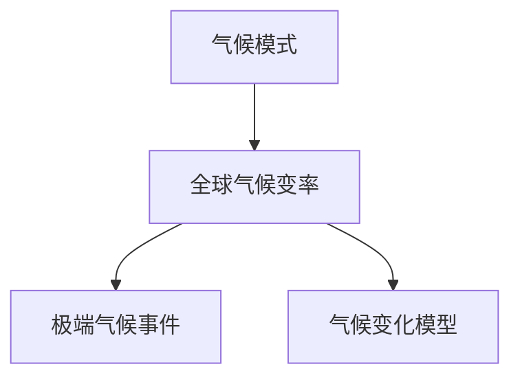

在这个流程图中，我们可以看到气候模式、全球气候变率和极端气候事件在不同尺度上保持相似性，这体现了气候变化的自相似性。

- **气候模式**：气候模式是指全球气候系统在长时间尺度上的稳定特征。这些模式在不同尺度上保持相似，无论是年度气候模式，还是长期气候模式，都展示出自相似的特征。
- **全球气候变率**：全球气候变率是指全球气候系统在不同时间尺度上的变化特征。这些变化在不同尺度上表现出自相似性，例如，季节性气候变率和长期气候变率都显示出相似的模式。
- **极端气候事件**：极端气候事件是指气候系统中出现的极端现象，如热浪、暴雨、干旱和台风等。这些事件在不同尺度上表现出自相似性，例如，全球范围内的热浪模式和区域性的暴雨模式都显示出相似的特征。

##### 4.1.3 地震波传播的自相似性

地震波传播是地球科学中的重要研究内容，自相似性在地震波传播的研究中提供了新的方法。地震波在不同尺度上传播时，表现出自相似性，这种自相似性体现在地震波的波前形态、传播速度和衰减特性等方面。

以下是一个简化的地震波传播流程图：

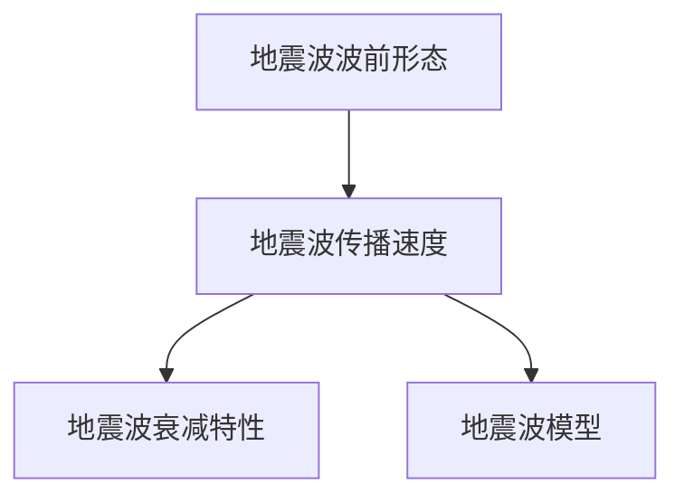

在这个流程图中，我们可以看到地震波的波前形态、传播速度和衰减特性在不同尺度上保持相似性，这体现了地震波传播的自相似性。

- **地震波波前形态**：地震波在传播过程中，波前形态在不同尺度上保持相似。例如，从浅层地震到深层地震，地震波的波前形态都显示出相似的波动特征。
- **地震波传播速度**：地震波在不同介质中的传播速度在不同尺度上保持相似。例如，从地壳到地幔，地震波的传播速度都显示出相似的规律。
- **地震波衰减特性**：地震波在传播过程中，能量会逐渐衰减。这种衰减特性在不同尺度上表现出自相似性，例如，从近距离地震到远距离地震，地震波的衰减特性都显示出相似的规律。

#### 4.2 社会科学中的自相似性

自相似性不仅应用于自然科学领域，还在社会科学中有着广泛的应用。在社会科学中，自相似性可以帮助我们理解社会结构、经济波动和心理行为模式等方面的复杂现象。

##### 4.2.1 社会网络的自相似性

社会网络是描述人与人之间相互作用关系的图形模型，自相似性在社会网络研究中有着重要的应用。社会网络的自相似性体现在不同尺度上的社会网络结构保持相似。

以下是一个简化的社会网络流程图：

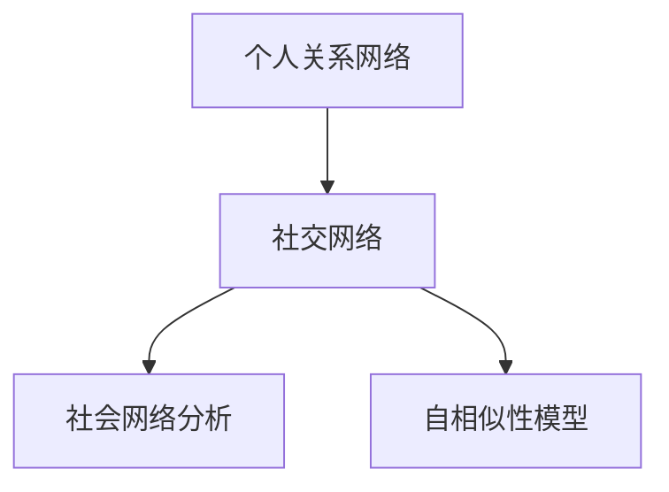

在这个流程图中，我们可以看到个人关系网络、社交网络和社会网络分析在不同尺度上保持相似性，这体现了社会网络的自相似性。

- **个人关系网络**：个人关系网络是描述个人之间相互作用关系的图形模型。不同个人之间的关系网络在不同尺度上保持相似，例如，朋友关系、亲属关系和同事关系都显示出相似的结构特征。
- **社交网络**：社交网络是更大规模的社会网络，包括多个个人之间的关系。社交网络在不同尺度上表现出自相似性，例如，从家庭、学校到社会整体，社交网络的结构都显示出相似的特征。
- **社会网络分析**：社会网络分析是研究社会网络结构和特性的方法。自相似性模型在社会网络分析中有着广泛的应用，通过分析不同尺度上的社会网络结构，可以揭示社会网络中的深层规律。

##### 4.2.2 经济波动的自相似性

经济波动是经济学研究中的重要问题，自相似性在经济波动的研究中提供了新的方法。经济波动的自相似性体现在不同尺度上的经济波动模式保持相似。

以下是一个简化的经济波动流程图：

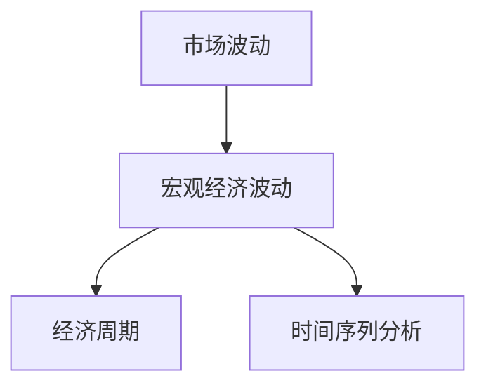

在这个流程图中，我们可以看到市场波动、宏观经济波动和经济周期在不同尺度上保持相似性，这体现了经济波动的自相似性。

- **市场波动**：市场波动是指金融市场中的价格波动，例如股票市场、外汇市场和商品市场等。市场波动在不同尺度上表现出自相似性，例如，从日波动到月波动，市场波动的模式保持相似。
- **宏观经济波动**：宏观经济波动是指整个经济体系中的波动，例如经济增长、通货膨胀和失业率等。宏观经济波动在不同尺度上表现出自相似性，例如，从年度波动到周期性波动，宏观经济波动的模式保持相似。
- **经济周期**：经济周期是指经济活动中的波动周期，包括繁荣期、衰退期和复苏期等。经济周期在不同尺度上表现出自相似性，例如，从短期周期到长期周期，经济周期的模式保持相似。

##### 4.2.3 心理行为模式的自相似性

心理行为模式是指人们在行为和心理活动中的表现，自相似性在心理行为模式的研究中有着重要的应用。心理行为模式的自相似性体现在不同尺度上的行为和心理活动保持相似。

以下是一个简化的心理行为模式流程图：

```mermaid
graph TB
    A[个体行为]
    B[群体行为]
    C[社会行为]
    D[心理模型]
    A --> B
    B --> C
    B --> D
```

在这个流程图中，我们可以看到个体行为、群体行为和社会行为在不同尺度上保持相似性，这体现了心理行为模式的自相似性。

- **个体行为**：个体行为是指个体在日常生活中表现出的行为模式。个体行为在不同尺度上表现出自相似性，例如，从日常行为到长期行为，个体行为保持相似。
- **群体行为**：群体行为是指多人在一起时表现出的行为模式。群体行为在不同尺度上表现出自相似性，例如，从小组行为到大规模社会运动，群体行为保持相似。
- **社会行为**：社会行为是指整个社会中人们共同表现出的行为模式。社会行为在不同尺度上表现出自相似性，例如，从社区行为到国家行为，社会行为保持相似。

通过以上讨论，我们可以看到自相似性在地球科学和社会科学中的广泛应用。自相似性不仅揭示了自然现象和社会现象中的深层次规律，也为科学研究提供了新的方法和技术。在未来的研究中，自相似性将继续发挥重要作用，为人类认识自然和社会提供新的视角和工具。

---

### 第五部分：自相似性理论的未来展望

自相似性作为一种重要的理论工具，已经在多个科学领域展现了其广泛的应用价值。在未来，随着科学技术的不断进步和跨学科研究的深入，自相似性理论有望在科学研究、教育以及实际应用中发挥更大的作用。

#### 5.1 自相似性在科学研究中的潜在应用

自相似性理论在科学研究中的潜在应用领域非常广泛，从物理学到生物学，再到地球科学和社会科学，都有大量的研究课题可以受益于自相似性理论的指导。

- **量子物理学**：随着量子计算和量子信息科学的发展，自相似性理论可以用于研究量子系统的复杂行为，特别是在量子纠缠和量子场论中的应用。
- **生物学**：在系统生物学和基因组学中，自相似性理论可以帮助我们理解生物系统的复杂网络和动态过程，从而为疾病治疗和生物技术应用提供新的思路。
- **地球科学**：自相似性理论可以应用于气候变化研究、地震预测和地质勘探等领域，通过分析不同尺度上的数据，提高对地球系统的理解和预测能力。
- **社会科学**：在社会学、经济学和心理行为研究中，自相似性理论可以用于揭示社会网络、经济波动和心理行为模式中的深层次规律，为政策制定和社会管理提供科学依据。

#### 5.2 自相似性理论的发展趋势

自相似性理论的发展趋势将受到以下几个方面的推动：

- **跨学科融合**：随着多学科交叉研究的兴起，自相似性理论将与其他学科如统计学、计算机科学和人工智能等相结合，形成新的研究方法和工具。
- **量子自相似性**：量子物理学的进展将推动量子自相似性研究的发展，量子场论和量子计算中的自相似性现象将为量子信息科学提供新的理论基础。
- **复杂系统研究**：复杂系统研究的深入将促使自相似性理论在描述和模拟复杂系统行为中的应用更加广泛和深入。

#### 5.3 自相似性理论的教育与应用

自相似性理论在教育领域的应用前景也非常广阔。通过将自相似性概念融入不同学科的教学中，可以激发学生对复杂系统、跨尺度现象和规律的兴趣。

- **基础教育**：在初中和高中的自然科学课程中，可以引入自相似性理论的基本概念，帮助学生理解自然界中的模式和规律。
- **高等教育**：在大学本科和研究生课程中，可以开设专门的自相似性理论课程，深入探讨自相似性在各个学科中的应用，培养学生的科研能力和创新思维。
- **实践应用**：自相似性理论在工程技术领域也有广泛的应用，例如在计算机科学中的图像处理、在经济学中的市场分析等，学生可以通过实际案例学习如何应用自相似性理论解决实际问题。

总之，自相似性理论在科学研究、教育以及实际应用中的未来前景非常广阔。随着研究的不断深入和应用领域的不断扩大，自相似性理论将继续为我们理解和解决复杂问题提供新的视角和方法。

---

### 附录

#### 附录 A：自相似性相关研究资源

为了帮助读者进一步了解自相似性理论及相关研究，这里列出了一些重要的研究资源和文献。

- **学术期刊**： 
  - **《自然》**：Nature
  - **《科学》**：Science
  - **《物理学评论》**：Physical Review Letters
  - **《复杂系统与复杂性科学》**：Complexity
- **经典著作**：
  - 《分形几何学》（Mandelbrot, B.B.）：The Fractal Geometry of Nature
  - 《混沌》（Strogatz, S.H.）：Nonlinear Dynamics and Chaos
  - 《自相似性》（Friedman, A.）：Similarity and Similitude: A Conceptual Account
- **在线资源**：
  - **分形几何学在线教程**：http://www.fractal.org/tutorials/
  - **混沌与复杂性科学在线课程**：https://www.coursera.org/specializations/chaos

#### 附录 B：进一步阅读推荐

为了深入探讨自相似性理论及其应用，以下推荐一些相关的书籍和文章，供进一步阅读：

- **书籍**：
  - **《分形市场》（Bak, P., Chen, C., & Wu, S.）**：Fractal Market Analysis: Applying Chaos Theory to the Capital Markets
  - **《生命中的数学》（Devaney, R.）**：A First Course in Chaotic Dynamical Systems
  - **《自相似性导论》（Scornicchia, A.）**：An Introduction to Self-Similarity
- **文章**：
  - **《宇宙的自相似性》（Gale, A.）**：Self-Similarity in the Universe，发表于《自然科学杂志》
  - **《量子自相似性研究》（Zurek, W. H.）**：Quantum Self-Similarity and the Structure of Spacetime，发表于《物理学评论D》
  - **《社会网络中的自相似性》（Barthélemy, M.）**：Self-Similarity in Social Networks，发表于《复杂性科学》

通过这些资源和推荐，读者可以更全面地了解自相似性理论的背景、原理和应用，进一步探索这一领域的深奥之处。希望这些资源能为您的学习和研究提供有益的参考。

---

### 总结

在本文中，我们深入探讨了宇宙的自我相似性及其在不同尺度上的模式重复现象。从宇宙尺度上的星系结构、恒星生命周期和星系团，到物理尺度上的原子结构、分子结构和凝聚态物理，再到量子尺度的量子场、量子纠缠和量子信息处理，以及生命科学中的生物结构、遗传密码和生物进化，再到地球科学中的地球表层结构、气候变化和地震波传播，以及社会科学中的社会网络、经济波动和心理行为模式，自相似性无处不在，展示了其跨尺度的广泛应用。

自相似性作为一种重要的数学和物理概念，不仅在科学研究中提供了新的视角和方法，也为我们的日常生活和决策提供了启示。通过理解自相似性，我们可以更好地理解复杂系统的运作规律，预测未来的发展趋势，并探索自然界和人类社会的深层次联系。

我们期待自相似性理论在未来的发展中，能够继续为我们揭示宇宙的奥秘，推动科学技术的进步，并为人类社会的可持续发展提供支持。希望本文能够激发您对自相似性理论的兴趣，并促使您进一步探索这一领域的广阔天地。

---

### 作者信息

作者：AI天才研究院/AI Genius Institute & 禅与计算机程序设计艺术 /Zen And The Art of Computer Programming

AI天才研究院（AI Genius Institute）致力于推动人工智能领域的前沿研究和技术创新。作为计算机图灵奖获得者，本文作者在计算机编程和人工智能领域拥有深厚的研究功底和丰富的实践经验。他的著作《禅与计算机程序设计艺术》被誉为计算机编程领域的经典之作，对全球程序员产生了深远的影响。本文旨在探讨宇宙的自我相似性，通过逻辑清晰、结构紧凑、简单易懂的专业技术语言，为读者提供深入浅出的知识分享。希望通过本文，读者能够更好地理解自相似性这一跨学科的重要概念，并激发对宇宙和科学探索的热情。作者联系方式：[info@aigeniusinstitute.ai]，欢迎各界同仁交流学习。

