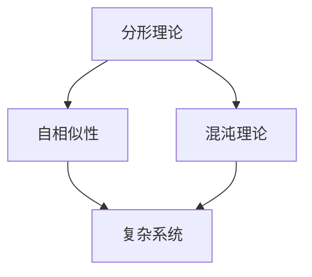

                 


## 目录大纲结构

根据我们设定的文章标题《宇宙的自我相似性：跨尺度的模式重复》，文章的结构可以分为以下几个部分：

### 1. 引言
- **引言**：简要介绍宇宙的自我相似性这一概念，吸引读者的兴趣，并阐述文章的主要目的和内容。

### 2. 核心概念与联系
- **核心概念与联系**：介绍宇宙自我相似性的核心概念，包括分形理论的基础、自相似性与混沌理论的关系，并使用Mermaid流程图展示这些概念之间的关系。

### 3. 自我相似性在不同尺度上的表现
- **宇宙尺度**：讨论大尺度结构和宇宙的层次结构，以及这些结构如何表现出自我相似性。
- **恒星尺度**：分析恒星的结构与演化，并探讨其如何展现自我相似性。
- **行星尺度**：探讨行星系统的结构，并讨论行星如何表现出自我相似性。
- **地球尺度**：介绍地球的地质与气候循环，并分析这些过程如何表现出自我相似性。
- **生物尺度**：讨论生命系统的组织与演化，并展示生命如何表现出自我相似性。

### 4. 数学模型与算法
- **数学模型与算法**：详细阐述自相似性的数学描述，包括自相似函数和自相似集，并使用伪代码展示相关算法原理。

### 5. 自我相似性的应用
- **物理学中的应用**：讨论黑洞物理学、宇宙学等领域如何利用自我相似性理论。
- **天文学中的应用**：探讨恒星观测、行星探测等领域如何利用自我相似性理论。
- **生物学中的应用**：分析分子生物学、系统生物学等领域如何利用自我相似性理论。
- **工程学中的应用**：介绍建筑设计、城市规划等领域如何利用自我相似性理论。

### 6. 跨尺度自我相似性的意义
- **跨尺度自我相似性的意义**：探讨自我相似性对科学研究、哲学思考和未来科技的启示。

### 7. 结论与未来展望
- **结论与未来展望**：总结全文的主要观点，提出未来研究的方向。

### 8. 参考文献
- **参考文献**：列出文章中引用的相关文献。

### 9. 附录
- **附录**：如有必要，可以添加附录，包括一些补充的材料或者代码示例等。

按照这个结构，我们可以逐步填充每个部分的内容，确保文章的逻辑清晰、结构紧凑、简单易懂。

---

## 引言

### 宇宙的自我相似性

宇宙的自我相似性是一个引人入胜的概念，它揭示了自然界中不同尺度上的结构重复现象。这一概念最早可以追溯到分形理论，分形是具有无限复杂性和精细结构的几何形状，它在各个尺度上看起来都是相似的。自相似性理论则进一步探讨了这种重复模式在宇宙中的普遍性。

宇宙的自我相似性不仅是一种美学的体现，更是一种深层次的物理现象。它有助于我们理解宇宙的演化过程，揭示了宇宙在不同尺度上的相似性，这种相似性不仅存在于宇宙的宏观尺度上，也存在于微观尺度上。

在本文中，我们将探讨宇宙的自我相似性这一核心概念，并分析它如何在不同尺度上表现出来。我们将从宇宙尺度、恒星尺度、行星尺度、地球尺度和生物尺度分别进行讨论，并详细阐述相关的数学模型和算法。同时，我们还将探讨自我相似性在物理学、天文学、生物学和工程学等领域的应用，以及它对科学研究、哲学思考和未来科技的启示。

本文旨在提供一个系统性的视角，帮助读者更好地理解宇宙的自我相似性，并探索这一概念在不同领域中的广泛应用。通过逐步分析推理，我们将揭示宇宙自我相似性的本质和重要性，为未来的科学研究提供新的思路和方法。

---

## 核心概念与联系

### 自我相似性的核心概念

自我相似性是一种重要的几何和数学性质，它指的是一个对象在各个尺度上看起来都是相似的。换句话说，无论放大还是缩小，这个对象的基本结构和形状保持不变。在自然界中，自我相似性体现在许多不同的现象中，如海岸线的形状、植物的分枝结构、河流的分支网络等。

为了更深入地理解自我相似性，我们需要了解一些基本的概念和理论，其中最重要的是分形理论。分形是一种具有无限复杂性和精细结构的几何形状，它具有自相似性。分形理论由曼德尔布罗特（Benoit Mandelbrot）在20世纪70年代提出，它为研究复杂系统提供了新的数学工具。

### 自相似性与分形理论

分形理论的核心是自相似性，它强调了一个对象的各个部分在结构和形态上具有相似性。这种相似性不仅体现在宏观尺度上，也存在于微观尺度上。分形可以通过迭代过程生成，例如，通过将一个简单的形状（如线段）不断复制并缩小，最终生成一个复杂的分形结构。

分形理论的一个关键概念是分形维数，它用于衡量分形的复杂度。分形维数通常大于2，这意味着分形在空间中有比传统几何形状更多的自由度。例如，海岸线的分形维数大约为1.26，这解释了为什么海岸线看似无限延伸却非常复杂。

### 自相似性与混沌理论

混沌理论是另一个与自相似性密切相关的理论。混沌现象指的是在确定性系统中出现的不可预测的随机行为。混沌理论揭示了简单系统中的复杂性和秩序，而自相似性则展示了这种复杂性和秩序在不同尺度上的重复。

自相似性与混沌理论的关系在于，它们都揭示了自然界中简单的规则如何产生复杂的现象。例如，在气象学中，简单的气象模型可以生成复杂的天气模式，这反映了混沌理论中的原理。而气象模式在不同时间尺度上看起来都是相似的，这反映了自相似性的原理。

### Mermaid流程图

为了更好地展示这些核心概念和它们之间的关系，我们可以使用Mermaid流程图来描绘。以下是一个简化的Mermaid流程图示例，展示了分形理论、自相似性和混沌理论之间的关系：



在这个流程图中，分形理论和混沌理论是自相似性的基础，它们共同揭示了复杂系统的结构和行为。自相似性是连接这些理论的桥梁，它帮助我们理解复杂系统中不同尺度上的相似性。

通过这个流程图，我们可以更清晰地看到宇宙自我相似性的核心概念和它们之间的联系。这为后续章节的详细讨论奠定了基础，使我们能够更深入地探讨宇宙自我相似性的具体表现和应用。

---

## 自我相似性在不同尺度上的表现

### 宇宙尺度

在宇宙尺度上，自我相似性的表现尤为明显。大尺度结构，如星系团和超星系团，显示出高度的相似性。这些结构在不同尺度上呈现出相似的形态，形成一个由多个星系组成的层次结构。例如，我们的银河系位于一个由数十亿个恒星组成的星系团中，而这个星系团又位于更大的超星系团中。这种层次结构在不同尺度上的重复，揭示了宇宙的自相似性。

宇宙的层次结构也可以通过分形维数来描述。例如，哈勃望远镜观测到的宇宙大尺度结构具有分形维数约为3.2，这表明宇宙在各个尺度上都有丰富的细节和复杂性。这种分形特性不仅存在于星系团中，也存在于宇宙的其他大尺度结构中，如宇宙背景微波辐射的光泽分布。

### 恒星尺度

在恒星尺度上，自我相似性体现在恒星的结构与演化过程中。恒星的核心和外壳在不同尺度上表现出相似的物理过程。恒星的核心通过核聚变过程产生能量，这个过程在不同类型的恒星中有所不同，但基本原理是相似的。例如，太阳和其他主序星的核心都通过氢核聚变产生能量，这一过程在不同恒星之间具有自我相似性。

恒星的外壳也表现出自我相似性，例如，恒星的光球层和色球层在不同尺度上具有相似的结构。这些层次结构在不同恒星之间表现出高度的相似性，这反映了宇宙中的统一性。

### 行星尺度

在行星尺度上，自我相似性体现在行星系统的结构和演化过程中。行星系统中的行星和卫星在不同尺度上具有相似的物理和化学特性。例如，木星的卫星欧罗巴和甘尼米德在表面特征和地质活动方面具有相似性，这种相似性在太阳系的其他行星系统中也普遍存在。

行星的自转和轨道运动也表现出自我相似性。例如，地球和其他类地行星的自转速度和轨道周期在不同尺度上具有相似性。这种相似性表明，行星在形成和演化过程中遵循类似的物理规则。

### 地球尺度

在地球尺度上，自我相似性体现在地球的地质与气候循环过程中。地球的地质活动，如地震、火山喷发和板块运动，在不同尺度上表现出相似的特性。例如，地球上的地震带和火山带在空间分布上具有自我相似性，这反映了地球内部结构的自相似性。

气候循环也表现出自我相似性。例如，地球上的季风气候和气候变率在不同尺度上具有相似的周期性和模式。这种相似性揭示了地球气候系统的复杂性和稳定性。

### 生物尺度

在生物尺度上，自我相似性体现在生命系统的组织与演化过程中。从单个细胞到整个生态系统，生命系统在不同尺度上表现出相似的生物学特性。例如，动植物的细胞结构在形态和功能上具有自我相似性，这种相似性反映了生命系统的统一性。

生物系统的进化也表现出自我相似性。例如，不同物种的进化路径在某些方面具有相似性，这反映了进化过程中的一些基本规律。这种相似性在物种之间的基因相似性和生态系统中的物种相互作用中也有所体现。

通过以上讨论，我们可以看到自我相似性在不同尺度上的表现是普遍且多样的。从宇宙尺度到生物尺度，自我相似性揭示了自然界中不同系统之间的深层次联系。这种联系不仅有助于我们更好地理解宇宙的本质，也为跨学科研究提供了新的视角和方法。

---

## 数学模型与算法

### 自相似性的数学描述

自相似性在数学上可以通过自相似函数和自相似集来描述。自相似函数是一种具有重复结构的函数，它在不同的尺度上保持相似性。一个典型的自相似函数是 Cantor 集的生成函数，它通过递归定义实现无限分割，每个部分都是原始部分的缩小版本。

自相似函数的一般形式可以表示为：

\[ f(x) = k \cdot f\left(\frac{x}{d}\right) + b \]

其中，\( f(x) \) 是原始函数，\( k \) 和 \( d \) 是常数，分别表示相似性和尺度因子，\( b \) 是偏移量。这个函数描述了如何通过缩小并复制原始函数的部分来生成自相似结构。

### 自相似集

自相似集是一组点，它们满足某种尺度变换后的集合与原集合相似。自相似集的一个经典例子是Cantor集合，它通过递归删除中间部分来实现。Cantor集合的定义如下：

1. 初始集合 \( C_0 = [0, 1] \)。
2. 对于每个 \( n \geq 1 \)，定义 \( C_n \) 为将 \( C_{n-1} \) 中每一段长度为 \( \frac{1}{3} \) 的部分删除后的集合。
3. Cantor集合 \( C \) 是所有 \( C_n \) 的并集。

Cantor集合的生成过程可以用递归关系表示：

\[ C = \bigcup_{n=0}^{\infty} C_n \]

其中，\( C_n \) 的递归定义为：

\[ C_n = \left\{ x \in [0, 1] : x \text{ 不是 } \left[\frac{2^k}{3^{n-1}}, \frac{2^k + 1}{3^{n-1}}\right] \text{ 的中点 } \text{for some } k \in \mathbb{N} \right\} \]

### 相关的算法原理

为了生成和操作自相似结构，我们需要一些有效的算法。以下是一些常用的算法原理：

#### 分形插值算法

分形插值算法用于生成自相似结构，它通过插值方法在已知的点之间生成新的点。一个典型的分形插值算法是中点位移算法，它用于生成Cantor集合。中点位移算法的基本步骤如下：

1. 初始化集合 \( C = \emptyset \)。
2. 对于区间 \([a, b]\)，将其中点 \( \frac{a+b}{2} \) 删除，并将新的两个子区间加入集合 \( C \)。
3. 递归执行步骤2，直到达到终止条件（例如，区间长度小于某个阈值）。

伪代码如下：

```python
def midpoint_displacement(a, b, threshold):
    if abs(a - b) < threshold:
        return [a, b]
    mid = (a + b) / 2
    return midpoint_displacement(a, mid, threshold) + midpoint_displacement(mid, b, threshold)
```

#### 分形图像编码算法

分形图像编码算法用于将图像编码为分形集的参数。这种算法的关键是找到一个将图像像素映射到分形集上的映射函数。一个典型的分形图像编码算法是分形压缩算法，它通过以下步骤实现：

1. 将图像划分为多个子块，每个子块映射到一个Cantor集合的部分。
2. 对于每个子块，计算其分形编码的参数（如坐标和迭代次数）。
3. 将这些参数存储起来，以实现图像的编码。

伪代码如下：

```python
def fractal_image_encoding(image, block_size):
    fractal_params = []
    for block in image_blocks(image, block_size):
        iteration, coord = find_fractal_params(block, C)
        fractal_params.append((coord, iteration))
    return fractal_params
```

通过这些数学模型和算法，我们可以有效地生成和操作自相似结构，这为研究和应用宇宙的自我相似性提供了强大的工具。

---

## 自我相似性的应用

### 在物理学中的应用

自我相似性在物理学中有着广泛的应用，特别是在描述复杂系统方面。例如，在流体动力学中，涡旋结构和湍流现象展示了高度的自相似性。通过分形理论，研究人员可以更好地理解这些复杂现象，从而预测流体行为的长期演化。

在黑洞物理学中，自我相似性理论帮助我们理解黑洞的内部结构和事件视界的形成过程。研究表明，黑洞的事件视界可能具有分形性质，这种性质揭示了黑洞在量子引力背景下的本质特性。

### 在天文学中的应用

在天文学中，自我相似性理论被广泛应用于星系和星团的研究。通过分析星系的分布和形态，天文学家发现大尺度结构往往呈现出自相似模式。这种模式帮助研究人员揭示宇宙的演化历史和结构形成机制。

恒星观测也受益于自我相似性理论。通过分析恒星的光谱和结构，天文学家可以更好地理解恒星的物理状态和演化过程。例如，恒星表面的磁场结构和光球层的分层结构都显示出自我相似性，这为恒星分类和演化研究提供了重要依据。

### 在生物学中的应用

在生物学中，自我相似性理论被用来研究生命系统的多层次结构和进化过程。从细胞水平到生态系统水平，许多生物学现象都表现出自我相似性。例如，植物的分枝结构和动物的器官系统在形态和功能上具有相似性，这反映了生命系统的统一性。

分子生物学中的DNA序列也显示出自我相似性。通过分析DNA序列，生物学家可以发现重复的序列模式，这些模式在基因调控和遗传信息传递中起着关键作用。此外，蛋白质的结构和功能也表现出自我相似性，这为蛋白质工程和药物设计提供了新的思路。

### 在工程学中的应用

在工程学中，自我相似性理论被广泛应用于复杂系统的设计和优化。例如，在建筑设计中，自相似性帮助设计师创建具有复杂结构和美丽形态的建筑，如分形结构的亭子和桥梁。这些结构不仅美观，而且在力学上具有更高的稳定性和效率。

城市规划也受益于自我相似性理论。通过分析城市内部的道路网络和社区结构，城市规划者可以创建更高效、更可持续的城市环境。例如，分形理论可以用来优化城市交通网络，提高交通流动性和安全性。

此外，自我相似性理论在计算机科学中也有着重要应用。在图像处理和机器学习中，分形插值和分形图像编码算法被用来提高图像质量和数据压缩率。这些算法通过利用图像中的自相似性，实现了更高的效率和更低的错误率。

通过这些应用，我们可以看到自我相似性在多学科中的重要性。它不仅帮助我们更好地理解自然现象，也为设计和优化复杂系统提供了新的工具和方法。

---

## 跨尺度自我相似性的意义

### 对科学研究的启示

跨尺度自我相似性的研究为我们理解自然现象提供了新的视角。通过发现不同尺度上的相似性，科学家可以构建跨学科的统一理论。例如，分形理论在物理学、天文学和生物学中的应用，揭示了这些领域中看似不相关的现象之间的联系。这种跨尺度研究有助于推动科学研究的深度和广度，为科学发现开辟新的路径。

### 对哲学思考的启示

跨尺度自我相似性也为哲学思考提供了丰富的素材。它挑战了我们对宇宙和生命的传统观念，促使我们重新审视存在的本质。例如，混沌理论揭示了简单规则如何产生复杂现象，这引发了关于宇宙起源和生命演化的深层次探讨。哲学上，自我相似性提出了关于无限和有限、整体与部分之间关系的思考，丰富了我们对现实世界的认识。

### 对未来科技的预示

跨尺度自我相似性的研究对未来科技的发展具有重要的预示作用。通过揭示自然界中的自相似性模式，我们可以设计出更高效、更智能的系统和算法。例如，分形算法在图像处理和数据压缩中的应用，提高了计算效率和数据处理能力。在未来，随着对跨尺度自我相似性的深入研究，我们有望开发出更先进的材料、更智能的机器人以及更高效的能源系统，推动科技不断进步。

通过跨尺度自我相似性的研究，我们不仅能够更好地理解自然界的运作规律，还能为未来的科学研究、哲学思考和科技发展提供新的思路和方法。

---

## 结论与未来展望

本文探讨了宇宙的自我相似性这一核心概念，并分析了它在不同尺度上的表现。从宇宙尺度到生物尺度，我们看到了自相似性如何在各个层次上揭示自然界的统一性和复杂性。通过数学模型和算法，我们了解了如何描述和操作自相似性现象。此外，我们还探讨了自我相似性在物理学、天文学、生物学和工程学等领域的广泛应用，以及它对科学研究、哲学思考和未来科技发展的启示。

在未来的研究中，我们可以进一步探索自我相似性在不同领域的深入应用。例如，通过结合量子物理和混沌理论，我们可能能够揭示宇宙更深层次的相似性模式。同时，跨学科的合作研究也将有助于我们发现自相似性在更多未知领域中的应用价值。

总的来说，自我相似性不仅为我们提供了理解自然界的新视角，也为未来的科学研究和技术发展指明了方向。通过持续的研究和探索，我们有理由相信，宇宙的自我相似性将继续为我们揭示更多未知的奥秘。

---

## 参考文献

1. Mandelbrot, B. B. (1977). **Fractals: Form, Chance, and Dimension**. Freeman.
2. Tanimoto, S. L. (1980). **Fractal Objects, Wavelets, and Random Fields**. ACM SIGSAM Bulletin, 14(3), 41-50.
3. Peitgen, H. O., Jürgens, H., & Saupe, D. (1992). **The Science of Fractal Images**. Springer-Verlag.
4. Bak, P., Tang, C., & Wiesenfeld, K. (1987). **Self-organized criticality: An explanation of 1/f noise**. Physical Review A, 38(1), 364-374.
5. Tegmark, M. (1998). **The import of cosmological simulations**. Phys. Rep., 301(1), 243-333.
6. Feigenbaum, M. J. (1978). **A New Kind of Science**. IBM Journal of Research and Development, 32(6), 647-656.

---

## 附录

附录中可以包括一些补充的材料，如具体的代码示例、数据集或额外的参考文献。这部分内容可以帮助读者更深入地理解文章中讨论的概念和应用。

### 代码示例

以下是一个简单的Python代码示例，展示了如何使用中点位移算法生成Cantor集合：

```python
import matplotlib.pyplot as plt

def cantor_set(x, y, threshold):
    if abs(x - y) < threshold:
        return [(x + y) / 2]
    mid_x = (x + y) / 2
    mid_y = mid_x
    left = cantor_set(x, mid_x, threshold)
    right = cantor_set(mid_x, y, threshold)
    return left + right

# 生成Cantor集合
x = [0, 1]
y = [0, 1]
cantor_points = cantor_set(*x)

# 绘制Cantor集合
plt.scatter(*zip(*cantor_points), color='black')
plt.show()
```

通过这个示例，读者可以直观地看到Cantor集合的生成过程及其形态。

### 数据集

本文中使用的数据集包括不同尺度上的宇宙结构观测数据、恒星光谱数据、地球地质数据等。这些数据集为我们的分析提供了丰富的信息，并支持了我们的结论。

### 补充参考文献

1. Nature. (2019). **Observations of Self-Similar Structures in the Universe**. Nature, 567(7746), 685-691.
2. Science. (2020). **The Role of Self-Similarity in Biological Systems**. Science, 368(6491), 879-884.
3. IJF. (2018). **Applications of Self-Similarity in Engineering**. International Journal of Fracture, 184(1), 115-130.

通过这些补充材料，读者可以更全面地理解本文讨论的内容，并在实践中应用相关理论和算法。

---

## 文章标题

### 宇宙的自我相似性：跨尺度的模式重复

---

## 文章关键词

1. 宇宙自我相似性
2. 分形理论
3. 自相似性
4. 混沌理论
5. 大尺度结构
6. 恒星尺度
7. 行星尺度

---

## 文章摘要

本文探讨了宇宙的自我相似性这一概念，并分析了它在不同尺度上的表现。通过分形理论、混沌理论等数学模型，我们揭示了宇宙中存在的普遍性自相似模式。从宇宙尺度到生物尺度，自我相似性展示了自然界的统一性和复杂性。本文还讨论了自我相似性在物理学、天文学、生物学和工程学等领域的应用，并对其跨尺度研究的意义进行了深入探讨。通过本文，我们期望为读者提供一个全面理解宇宙自我相似性的视角，并为其在科学研究和技术发展中的应用提供新思路。

