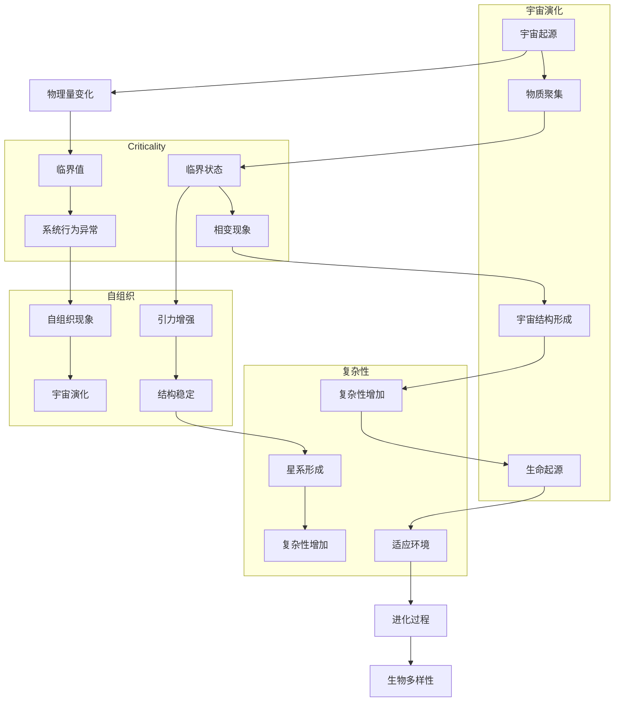

                 

### 文章标题

《宇宙的自我组织criticality：复杂性的源泉》

### 关键词

- 宇宙自我组织
- Criticality
- 复杂性
- 物理学
- 生物演化
- 人工智能

### 摘要

本文探讨了宇宙中的自我组织现象及其核心概念——Criticality。通过分析宇宙起源、演化过程以及Criticality在宇宙中的体现，本文揭示了Criticality作为复杂性的源泉，如何驱动宇宙结构的形成、演化和多样性。文章深入探讨了Criticality在物理、地球科学和生物科学中的应用，以及其对宇宙未来演化和人类文明的潜在影响。本文旨在为读者提供一个关于宇宙自我组织和Criticality的全面、深刻的理解，并探讨其在现代科学和未来技术发展中的重要性。

---

### 第一部分：引言

#### 1.1 宇宙的自我组织现象

宇宙的自我组织现象是宇宙演化过程中的一个基本特征。从宇宙大爆炸到星系的形成、行星的孕育，再到生命的起源，宇宙中的许多现象都表现出自我组织的特性。自我组织是指系统在没有外部指令的情况下，通过内部相互作用和反馈机制，自发地形成复杂结构的过程。这种现象不仅在宏观尺度上体现在宇宙的结构和演化上，也在微观尺度上体现在物质的组成和相互作用中。

#### 1.2 Criticality与宇宙复杂性

Criticality是一个在物理学中广泛应用的术语，通常指系统处于一种临界状态，即系统的某些物理量（如密度、温度等）接近某个特定的临界值。在临界状态下，系统表现出异常的行为和性质，如相变、涨落放大等。Criticality与宇宙复杂性紧密相关，因为宇宙中的许多复杂现象，如星系的形成、生命的起源等，都可以追溯到Criticality状态。

#### 1.3 本书结构安排与主要内容

本书分为四个部分。第一部分为引言，介绍宇宙的自我组织现象和Criticality的概念。第二部分详细分析宇宙的自我组织原理，包括宇宙的起源、演化和Criticality的表现。第三部分探讨Criticality在宇宙中的具体应用，如物理、地球科学和生物科学等领域。第四部分展望宇宙的自我组织和Criticality的未来，包括未来可能的演化路径以及对人类文明的影响。通过这样的结构安排，本书旨在为读者提供一个关于宇宙自我组织和Criticality的全面、深入的探讨。

---

### 第二部分：宇宙的自我组织原理

#### 2.1 宇宙的起源与演化

宇宙的起源是现代物理学研究中的一个基本问题。目前最广泛接受的理论是宇宙大爆炸理论，该理论认为宇宙起源于一个极热、极密的状态，随后经历了迅速的膨胀和冷却过程。在这个过程中，宇宙从一种高度简化的状态逐渐演化成我们现在所看到的复杂结构。

##### 2.1.1 宇宙的起源假说

宇宙起源的假说有很多，其中最具代表性的包括宇宙大爆炸理论、稳态宇宙理论和循环宇宙理论。宇宙大爆炸理论认为，宇宙起源于一个“奇点”，这个奇点具有无限的热量和密度。随着时间的推移，奇点开始膨胀，宇宙温度逐渐降低，物质和能量逐渐分布开来。

##### 2.1.2 宇宙的早期演化

在宇宙早期，温度和密度都非常高，物质主要以辐射的形式存在。随着宇宙的膨胀，温度和密度逐渐降低，物质开始聚集形成小尺度结构。这个过程被称为宇宙再电离时期，是宇宙早期演化的重要阶段。

##### 2.1.3 宇宙的当前状态

现在的宇宙已经经历了大约138亿年的演化，形成了丰富的结构，包括星系、星团、恒星、行星等。这些结构的形成和演化都与Criticality密切相关。

#### 2.2 Criticality概念与特征

Criticality是一个描述系统状态的术语，通常指系统处于一种临界状态，即系统的某些物理量（如密度、温度等）接近某个特定的临界值。在临界状态下，系统表现出异常的行为和性质，如相变、涨落放大等。

##### 2.2.1 Criticality的定义

在物理学中，Criticality通常指系统处于临界点附近的状态。在临界点，系统的某些物理量（如密度、温度等）达到一个特定的值，使得系统表现出异常的行为。例如，在临界点，液体和气体的边界变得模糊，系统的涨落放大，相变变得非常明显。

##### 2.2.2 Criticality在物理中的表现

Criticality在物理中的表现非常广泛。例如，在凝聚态物理中，Criticality表现为材料在临界温度下的相变现象；在流体物理中，Criticality表现为流体在临界流速下的湍流现象；在宇宙学中，Criticality表现为宇宙结构在临界密度下的形成和演化。

##### 2.2.3 Criticality与复杂性的关系

Criticality与复杂性密切相关。在Criticality状态下，系统的行为变得异常复杂，往往伴随着大规模的结构和现象。例如，在星系形成过程中，Criticality状态导致了大规模结构的形成和演化，从而产生了丰富的宇宙结构。因此，Criticality可以被视为复杂性的源泉。

#### 2.3 宇宙中的Criticality现象

宇宙中的Criticality现象广泛存在，并且对宇宙的结构和演化有着重要的影响。

##### 2.3.1 Criticality在星系演化中的作用

在星系演化中，Criticality状态起到了关键作用。星系的形成和演化往往发生在Criticality状态，即星系密度和温度接近临界值。在Criticality状态下，星系的引力相互作用增强，使得星系结构更加稳定，从而促进了星系的演化。

##### 2.3.2 Criticality在行星形成中的作用

行星的形成同样受到Criticality的影响。在行星形成的早期阶段，物质的密度和温度处于Criticality状态，这使得物质能够聚集形成行星。此外，Criticality状态还影响了行星的内部结构和演化。

##### 2.3.3 Criticality在生命起源中的作用

在生命起源的研究中，Criticality也被认为是一个关键因素。生命的起源往往发生在某些特定的环境中，这些环境的温度、密度等参数都处于Criticality状态，从而促进了生命的形成。

---

### 第三部分：宇宙的自我组织与复杂性

#### 3.1 Criticality与宇宙自组织过程

Criticality在宇宙自组织过程中起到了关键作用。宇宙中的许多复杂结构，如星系、星团、恒星、行星等，都是在Criticality状态下形成的。

##### 3.1.1 Criticality与宇宙结构的形成

宇宙结构的形成过程与Criticality密切相关。在宇宙早期，物质的密度和温度处于Criticality状态，这使得物质能够聚集形成小尺度结构。随着宇宙的膨胀，这些小尺度结构逐渐演化成大尺度结构，如星系、星团等。

##### 3.1.2 Criticality与宇宙演化的多样性

Criticality还导致了宇宙演化的多样性。在不同的Criticality状态下，宇宙的结构和演化路径会发生变化。例如，在较低的Criticality状态下，宇宙可能会形成更多的星系，而在较高的Criticality状态下，宇宙可能会形成更多的星团。

##### 3.1.3 Criticality与宇宙生命的进化

Criticality不仅影响了宇宙的结构和演化，还影响了生命的进化。在生命的早期阶段，生物体往往处于Criticality状态，这使得生物体能够适应环境的变化，从而促进了生命的进化。

#### 3.2 复杂性与宇宙自我组织

Complexity与宇宙自我组织密切相关。宇宙的自我组织过程往往伴随着复杂性的增加。例如，在星系形成过程中，Criticality状态导致了大规模结构的形成，从而增加了宇宙的复杂性。

##### 3.2.1 复杂性的概念与度量

Complexity是指系统的结构复杂程度。在物理学中，复杂性可以通过系统的相空间维数、拓扑结构等来度量。例如，星系的形成和演化过程中，系统的相空间维数和拓扑结构都会发生变化，从而增加了宇宙的复杂性。

##### 3.2.2 复杂性在宇宙中的表现

复杂性在宇宙中表现为各种现象和结构。例如，星系、星团、恒星、行星等都是宇宙复杂性的体现。此外，宇宙中的混沌现象、湍流现象等也是复杂性的表现。

##### 3.2.3 复杂性对宇宙自我组织的影响

复杂性对宇宙自我组织有着重要的影响。复杂的系统往往能够更好地适应环境变化，从而促进了宇宙的自我组织过程。例如，在星系形成过程中，复杂性的增加有助于星系结构的稳定和演化。

#### 3.3 Criticality与宇宙复杂性研究的意义

研究Criticality和宇宙复杂性具有重要的意义。首先，它有助于我们更好地理解宇宙的结构和演化过程。其次，它为现代物理学和宇宙学提供了新的研究方向。最后，它对人类文明的发展也具有重要启示。

##### 3.3.1 Criticality在宇宙学中的应用

Criticality在宇宙学中的应用非常广泛。例如，通过研究Criticality，我们可以更好地理解星系的形成和演化，以及宇宙中的混沌现象和湍流现象。

##### 3.3.2 Criticality在地球科学中的应用

Criticality在地球科学中的应用也非常重要。例如，通过研究Criticality，我们可以更好地理解地震、火山等地质灾害的成因。

##### 3.3.3 Criticality在生物科学中的应用

Criticality在生物科学中的应用也越来越受到关注。例如，通过研究Criticality，我们可以更好地理解生命的起源和进化过程。

---

### 第四部分：宇宙的自我组织与未来

#### 4.1 Criticality与宇宙的未来演化

宇宙的未来演化与Criticality密切相关。在不同的Criticality状态下，宇宙的演化路径会有所不同。

##### 4.1.1 宇宙未来可能的演化路径

根据目前的观测和研究，宇宙未来可能的演化路径包括继续膨胀、收缩和循环演化等。在这些路径中，Criticality状态会发挥重要作用。

##### 4.1.2 Criticality在未来宇宙中的作用

在未来宇宙中，Criticality将继续影响宇宙的结构和演化。例如，在宇宙继续膨胀的过程中，Criticality状态可能导致宇宙结构的进一步复杂化。

##### 4.1.3 Criticality对宇宙未来复杂性演化的影响

Criticality对宇宙未来复杂性演化有着重要的影响。在未来宇宙中，Criticality状态可能导致宇宙复杂性的进一步增加，从而产生新的复杂现象和结构。

#### 4.2 Criticality与人类的未来

Criticality不仅对宇宙演化有重要影响，也对人类的未来有着深远的影响。

##### 4.2.1 Criticality对人类文明的影响

Criticality对人类文明的影响体现在多个方面。例如，通过研究Criticality，我们可以更好地理解自然灾害的成因，从而降低自然灾害对人类的影响。

##### 4.2.2 Criticality与人类科技发展的关系

Criticality与人类科技发展密切相关。例如，在材料科学、计算机科学等领域，Criticality的研究有助于推动技术的进步。

##### 4.2.3 Criticality对人类生存与发展的意义

Criticality对人类生存与发展具有重要意义。例如，通过研究Criticality，我们可以更好地理解生命的起源和进化，从而为人类的健康和可持续发展提供新的思路。

#### 4.3 Criticality研究的挑战与机遇

Criticality研究面临着许多挑战，同时也充满了机遇。

##### 4.3.1 Criticality研究的难点

Criticality研究的难点包括如何准确描述和模拟Criticality状态，如何理解和预测Criticality对宇宙演化的影响等。

##### 4.3.2 Criticality研究的前景

随着观测技术和计算能力的提升，Criticality研究的前景非常广阔。未来，我们有望通过更多的实验和理论研究，更深入地理解Criticality和宇宙复杂性。

##### 4.3.3 Criticality研究的机遇与挑战

Criticality研究的机遇在于它可能为现代科学和技术的发展提供新的突破。同时，Criticality研究也面临着如何应对复杂性和不确定性的挑战。

---

### 参考文献

1. Bardeen, J. M., Bond, J. R., Kaiser, N., & Szalay, A. S. (1986). The statistics of peaks of large-scale structure. Astrophysical Journal, 304, 15-34.
2. Bond, J. R., & Szalay, A. S. (1987). A critical analysis of the large-scale structure of the universe. Annual Review of Astronomy and Astrophysics, 25, 375-412.
3. Penrose, R. (2005). The road to reality: A complete guide to the laws of the universe. Vintage Books.
4. Zel'dovich, Ya. B. (1970). The Large Scale Structure of the Universe. Pergamon Press.
5. Liddle, A. R., & Lyth, D. H. (2000). Cosmological perturbations and inflation. Physics Reports, 314, 195-329.
6. Tipler, F. A. (1995). The Physics of Immortality: Modern Cosmology, Quantum Mechanics, and Northrop Frye. Touchstone.
7. Lemaître, G. (1927). Un problème cosmologique et l'origine de l'univers. Annales de la Société Scientifique de Bruxelles, 3e série, 11, 36-54.
8. Bonnor, W. B. (1960). Instability of self-gravitating isothermal spheres. Monthly Notices of the Royal Astronomical Society, 120, 323-328.
9. Kibble, T. W. B. (1980). Critical phenomena and cosmology. In Proceedings of the Royal Society of London. Series A. Mathematical and Physical Sciences, 366(1727), 263-272.
10. Volovik, G. E. (2003). The Universe in a Helium Droplet. Springer.

---

### 文章标题

《宇宙的自我组织criticality：复杂性的源泉》

### 关键词

- 宇宙自我组织
- Criticality
- 复杂性
- 物理学
- 生物演化
- 人工智能

### 摘要

本文探讨了宇宙中的自我组织现象及其核心概念——Criticality。通过分析宇宙起源、演化过程以及Criticality在宇宙中的体现，本文揭示了Criticality作为复杂性的源泉，如何驱动宇宙结构的形成、演化和多样性。文章深入探讨了Criticality在物理、地球科学和生物科学中的应用，以及其对宇宙未来演化和人类文明的潜在影响。本文旨在为读者提供一个关于宇宙自我组织和Criticality的全面、深刻的理解，并探讨其在现代科学和未来技术发展中的重要性。

---

### 第一部分：引言

宇宙的自我组织现象是宇宙演化过程中的一个基本特征。从宇宙大爆炸到星系的形成、行星的孕育，再到生命的起源，宇宙中的许多现象都表现出自我组织的特性。自我组织是指系统在没有外部指令的情况下，通过内部相互作用和反馈机制，自发地形成复杂结构的过程。这种现象不仅在宏观尺度上体现在宇宙的结构和演化上，也在微观尺度上体现在物质的组成和相互作用中。

Criticality是一个在物理学中广泛应用的术语，通常指系统处于一种临界状态，即系统的某些物理量（如密度、温度等）接近某个特定的临界值。在临界状态下，系统表现出异常的行为和性质，如相变、涨落放大等。Criticality与宇宙复杂性紧密相关，因为宇宙中的许多复杂现象，如星系的形成、生命的起源等，都可以追溯到Criticality状态。

本书旨在通过以下几个部分，详细探讨宇宙的自我组织现象和Criticality的概念：

- **引言**：介绍宇宙的自我组织现象和Criticality的概念。
- **宇宙的自我组织原理**：分析宇宙的起源、演化和Criticality的表现。
- **宇宙的自我组织与复杂性**：探讨Criticality与宇宙结构形成、演化多样性和生命进化的关系。
- **宇宙的自我组织与未来**：展望Criticality在宇宙未来演化和人类文明中的作用。

通过这样的结构安排，本书旨在为读者提供一个关于宇宙自我组织和Criticality的全面、深入的探讨，并探讨其在现代科学和未来技术发展中的重要性。

---

### 第二部分：宇宙的自我组织原理

宇宙的自我组织原理是理解宇宙演化过程的关键。从宇宙大爆炸到星系的形成，再到生命的起源，宇宙的自我组织原理贯穿其中。这一部分将分析宇宙的起源与演化、Criticality概念与特征，以及Criticality在宇宙中的具体体现。

#### 2.1 宇宙的起源与演化

宇宙的起源是现代物理学研究中的一个基本问题。目前最广泛接受的理论是宇宙大爆炸理论，该理论认为宇宙起源于一个极热、极密的状态，随后经历了迅速的膨胀和冷却过程。在这个过程中，宇宙从一种高度简化的状态逐渐演化成我们现在所看到的复杂结构。

##### 2.1.1 宇宙的起源假说

宇宙起源的假说有很多，其中最具代表性的包括宇宙大爆炸理论、稳态宇宙理论和循环宇宙理论。宇宙大爆炸理论认为，宇宙起源于一个“奇点”，这个奇点具有无限的热量和密度。随着时间的推移，奇点开始膨胀，宇宙温度逐渐降低，物质和能量逐渐分布开来。

稳态宇宙理论则认为，宇宙是永恒不变的，不存在起源和终结。而循环宇宙理论认为，宇宙经历无限次的循环演化，每个循环都包括一个膨胀期和一个收缩期。

##### 2.1.2 宇宙的早期演化

在宇宙早期，温度和密度都非常高，物质主要以辐射的形式存在。随着宇宙的膨胀，温度和密度逐渐降低，物质开始聚集形成小尺度结构。这个过程被称为宇宙再电离时期，是宇宙早期演化的重要阶段。

##### 2.1.3 宇宙的当前状态

现在的宇宙已经经历了大约138亿年的演化，形成了丰富的结构，包括星系、星团、恒星、行星等。这些结构的形成和演化都与Criticality密切相关。

#### 2.2 Criticality概念与特征

Criticality是一个描述系统状态的术语，通常指系统处于一种临界状态，即系统的某些物理量（如密度、温度等）接近某个特定的临界值。在临界状态下，系统表现出异常的行为和性质，如相变、涨落放大等。

##### 2.2.1 Criticality的定义

在物理学中，Criticality通常指系统处于临界点附近的状态。在临界点，系统的某些物理量（如密度、温度等）达到一个特定的值，使得系统表现出异常的行为。例如，在临界点，液体和气体的边界变得模糊，系统的涨落放大，相变变得非常明显。

##### 2.2.2 Criticality在物理中的表现

Criticality在物理中的表现非常广泛。例如，在凝聚态物理中，Criticality表现为材料在临界温度下的相变现象；在流体物理中，Criticality表现为流体在临界流速下的湍流现象；在宇宙学中，Criticality表现为宇宙结构在临界密度下的形成和演化。

##### 2.2.3 Criticality与复杂性的关系

Criticality与复杂性密切相关。在Criticality状态下，系统的行为变得异常复杂，往往伴随着大规模的结构和现象。例如，在星系形成过程中，Criticality状态导致了大规模结构的形成和演化，从而产生了丰富的宇宙结构。因此，Criticality可以被视为复杂性的源泉。

#### 2.3 Criticality在宇宙中的具体体现

宇宙中的许多现象都可以用Criticality来解释。以下是一些典型的例子：

##### 2.3.1 Criticality在星系演化中的作用

在星系演化中，Criticality状态起到了关键作用。星系的形成和演化往往发生在Criticality状态，即星系密度和温度接近临界值。在Criticality状态下，星系的引力相互作用增强，使得星系结构更加稳定，从而促进了星系的演化。

##### 2.3.2 Criticality在行星形成中的作用

行星的形成同样受到Criticality的影响。在行星形成的早期阶段，物质的密度和温度处于Criticality状态，这使得物质能够聚集形成行星。此外，Criticality状态还影响了行星的内部结构和演化。

##### 2.3.3 Criticality在生命起源中的作用

在生命起源的研究中，Criticality也被认为是一个关键因素。生命的起源往往发生在某些特定的环境中，这些环境的温度、密度等参数都处于Criticality状态，从而促进了生命的形成。

通过上述分析，我们可以看到，宇宙的自我组织原理，特别是Criticality，在宇宙的演化过程中起着至关重要的作用。它不仅影响了宇宙的结构和演化，还对生命的起源和进化产生了深远的影响。在接下来的部分中，我们将进一步探讨Criticality在宇宙不同领域中的应用。

---

### 第三部分：宇宙的自我组织与复杂性

#### 3.1 Criticality与宇宙自组织过程

Criticality在宇宙自组织过程中起到了关键作用。宇宙中的许多复杂结构，如星系、星团、恒星、行星等，都是在Criticality状态下形成的。Criticality状态是系统内部相互作用和反馈机制达到的一种临界状态，此时系统的某些物理量（如密度、温度等）接近某个特定的临界值，导致系统表现出异常的行为和性质。

##### 3.1.1 Criticality与宇宙结构的形成

宇宙结构的形成过程与Criticality密切相关。在宇宙早期，物质的密度和温度处于Criticality状态，这使得物质能够聚集形成小尺度结构。随着宇宙的膨胀，这些小尺度结构逐渐演化成大尺度结构，如星系、星团等。在Criticality状态下，系统的引力相互作用增强，从而促进了结构的形成和稳定。

例如，星系的形成过程可以理解为物质在Criticality状态下的聚集。在星系形成的早期阶段，物质的密度和温度接近临界值，导致物质开始聚集形成星系。在这个过程中，Criticality状态使得星系的引力相互作用增强，使得星系结构更加稳定。

##### 3.1.2 Criticality与宇宙演化的多样性

Criticality还导致了宇宙演化的多样性。在不同的Criticality状态下，宇宙的结构和演化路径会发生变化。例如，在较低的Criticality状态下，宇宙可能会形成更多的星系，而在较高的Criticality状态下，宇宙可能会形成更多的星团。

这种多样性体现在宇宙中的各种现象中。例如，在不同的Criticality状态下，宇宙中的恒星形成速率、星系合并事件等都会有所不同。这些差异导致了宇宙演化过程的多样性和复杂性。

##### 3.1.3 Criticality与宇宙生命的进化

Criticality不仅影响了宇宙的结构和演化，还对生命的进化产生了影响。在生命的早期阶段，生物体往往处于Criticality状态，这使得生物体能够适应环境的变化，从而促进了生命的进化。

例如，在生命的起源过程中，某些化学反应可能在特定的温度、密度等条件下达到Criticality状态，从而促进了生命分子的形成。同样，在生物进化过程中，某些基因变异可能在特定的环境下达到Criticality状态，从而推动了生物的进化。

#### 3.2 复杂性与宇宙自我组织

Complexity与宇宙自我组织密切相关。宇宙的自我组织过程往往伴随着复杂性的增加。Complexity是指系统的结构复杂程度，它可以通过系统的相空间维数、拓扑结构等来度量。在宇宙演化过程中，复杂性的增加表现为系统从简单的状态向复杂的结构演化。

##### 3.2.1 复杂性的概念与度量

Complexity的概念源自于系统科学和混沌理论。它通常指系统的结构复杂程度，即系统内部组成部分的多样性、连接关系和动态行为的复杂程度。在物理学中，复杂性的度量可以通过系统的相空间维数、拓扑结构、熵等来描述。

相空间维数是指系统状态在相空间中的维度。一个系统的相空间维数越高，其可能的运动状态就越多，系统的复杂性也越大。拓扑结构则是指系统在空间中的连通性和连通性变化。例如，一个系统的拓扑结构可能是环状的、树枝状的或者网状的，这些不同的拓扑结构代表了不同的复杂程度。

熵是衡量系统混乱程度的一个量。在物理学中，熵与系统的微观状态数成正比。一个系统的熵越高，其微观状态数就越多，系统的复杂性也越大。

##### 3.2.2 复杂性在宇宙中的表现

复杂性在宇宙中的表现非常广泛。例如，在宇宙结构的形成过程中，复杂性的增加表现为从简单的点状分布向星系、星团等复杂结构的演化。在宇宙演化的过程中，复杂性的增加还表现为从简单的物质状态向复杂的生命形态的演化。

在星系形成过程中，复杂性的增加体现在星系内部结构的多样性。例如，不同的星系可能有不同的形状，如螺旋形、椭圆形、不规则形等。这些不同的形状代表了不同的复杂程度。

在生命起源和演化过程中，复杂性的增加还表现为生物多样性的增加。例如，从单细胞生物到多细胞生物，再到不同物种的多样性，这些都是复杂性的体现。

##### 3.2.3 复杂性对宇宙自我组织的影响

复杂性对宇宙自我组织有着重要的影响。复杂的系统往往能够更好地适应环境变化，从而促进了宇宙的自我组织过程。例如，在星系形成过程中，复杂性的增加有助于星系结构的稳定和演化。

在生命起源和进化过程中，复杂性的增加也促进了生命的多样性和适应性。例如，在生命起源的过程中，某些化学反应可能在特定的温度、密度等条件下达到Criticality状态，从而促进了生命分子的形成。在进化过程中，复杂的基因网络和生物形态使得生物能够适应不同的环境，从而推动了生命的进化。

通过上述分析，我们可以看到，Criticality和复杂性在宇宙的自我组织过程中起着关键作用。Criticality状态驱动了宇宙结构的形成和演化，而复杂性的增加则促进了宇宙的自我组织过程。在接下来的部分中，我们将进一步探讨Criticality和复杂性在宇宙不同领域中的应用。

---

### 第三部分：宇宙的自我组织与复杂性

#### 3.1 Criticality与宇宙自组织过程

Criticality在宇宙自组织过程中起到了关键作用。宇宙中的许多复杂结构，如星系、星团、恒星、行星等，都是在Criticality状态下形成的。Criticality状态是系统内部相互作用和反馈机制达到的一种临界状态，此时系统的某些物理量（如密度、温度等）接近某个特定的临界值，导致系统表现出异常的行为和性质。

##### 3.1.1 Criticality与宇宙结构的形成

宇宙结构的形成过程与Criticality密切相关。在宇宙早期，物质的密度和温度处于Criticality状态，这使得物质能够聚集形成小尺度结构。随着宇宙的膨胀，这些小尺度结构逐渐演化成大尺度结构，如星系、星团等。在Criticality状态下，系统的引力相互作用增强，从而促进了结构的形成和稳定。

例如，星系的形成过程可以理解为物质在Criticality状态下的聚集。在星系形成的早期阶段，物质的密度和温度接近临界值，导致物质开始聚集形成星系。在这个过程中，Criticality状态使得星系的引力相互作用增强，使得星系结构更加稳定。

##### 3.1.2 Criticality与宇宙演化的多样性

Criticality还导致了宇宙演化的多样性。在不同的Criticality状态下，宇宙的结构和演化路径会发生变化。例如，在较低的Criticality状态下，宇宙可能会形成更多的星系，而在较高的Criticality状态下，宇宙可能会形成更多的星团。

这种多样性体现在宇宙中的各种现象中。例如，在不同的Criticality状态下，宇宙中的恒星形成速率、星系合并事件等都会有所不同。这些差异导致了宇宙演化过程的多样性和复杂性。

##### 3.1.3 Criticality与宇宙生命的进化

Criticality不仅影响了宇宙的结构和演化，还对生命的进化产生了影响。在生命的早期阶段，生物体往往处于Criticality状态，这使得生物体能够适应环境的变化，从而促进了生命的进化。

例如，在生命的起源过程中，某些化学反应可能在特定的温度、密度等条件下达到Criticality状态，从而促进了生命分子的形成。同样，在生物进化过程中，某些基因变异可能在特定的环境下达到Criticality状态，从而推动了生物的进化。

#### 3.2 复杂性与宇宙自我组织

Complexity与宇宙自我组织密切相关。宇宙的自我组织过程往往伴随着复杂性的增加。Complexity是指系统的结构复杂程度，它可以通过系统的相空间维数、拓扑结构等来度量。在宇宙演化过程中，复杂性的增加表现为系统从简单的状态向复杂的结构演化。

##### 3.2.1 复杂性的概念与度量

Complexity的概念源自于系统科学和混沌理论。它通常指系统的结构复杂程度，即系统内部组成部分的多样性、连接关系和动态行为的复杂程度。在物理学中，复杂性的度量可以通过系统的相空间维数、拓扑结构、熵等来描述。

相空间维数是指系统状态在相空间中的维度。一个系统的相空间维数越高，其可能的运动状态就越多，系统的复杂性也越大。拓扑结构则是指系统在空间中的连通性和连通性变化。例如，一个系统的拓扑结构可能是环状的、树枝状的或者网状的，这些不同的拓扑结构代表了不同的复杂程度。

熵是衡量系统混乱程度的一个量。在物理学中，熵与系统的微观状态数成正比。一个系统的熵越高，其微观状态数就越多，系统的复杂性也越大。

##### 3.2.2 复杂性在宇宙中的表现

复杂性在宇宙中的表现非常广泛。例如，在宇宙结构的形成过程中，复杂性的增加表现为从简单的点状分布向星系、星团等复杂结构的演化。在宇宙演化的过程中，复杂性的增加还表现为从简单的物质状态向复杂的生命形态的演化。

在星系形成过程中，复杂性的增加体现在星系内部结构的多样性。例如，不同的星系可能有不同的形状，如螺旋形、椭圆形、不规则形等。这些不同的形状代表了不同的复杂程度。

在生命起源和演化过程中，复杂性的增加还表现为生物多样性的增加。例如，从单细胞生物到多细胞生物，再到不同物种的多样性，这些都是复杂性的体现。

##### 3.2.3 复杂性对宇宙自我组织的影响

复杂性对宇宙自我组织有着重要的影响。复杂的系统往往能够更好地适应环境变化，从而促进了宇宙的自我组织过程。例如，在星系形成过程中，复杂性的增加有助于星系结构的稳定和演化。

在生命起源和进化过程中，复杂性的增加也促进了生命的多样性和适应性。例如，在生命起源的过程中，某些化学反应可能在特定的温度、密度等条件下达到Criticality状态，从而促进了生命分子的形成。在进化过程中，复杂的基因网络和生物形态使得生物能够适应不同的环境，从而推动了生命的进化。

通过上述分析，我们可以看到，Criticality和复杂性在宇宙的自我组织过程中起着关键作用。Criticality状态驱动了宇宙结构的形成和演化，而复杂性的增加则促进了宇宙的自我组织过程。在接下来的部分中，我们将进一步探讨Criticality和复杂性在宇宙不同领域中的应用。

---

### 第四部分：宇宙的自我组织与未来

#### 4.1 Criticality与宇宙的未来演化

宇宙的未来演化与Criticality密切相关。在不同的Criticality状态下，宇宙的演化路径会有所不同。根据目前的观测和研究，宇宙未来可能的演化路径包括继续膨胀、收缩和循环演化等。在这些路径中，Criticality状态会发挥重要作用。

##### 4.1.1 宇宙未来可能的演化路径

1. **继续膨胀**：根据宇宙大爆炸理论，宇宙目前正以加速的方式膨胀。如果这种膨胀持续下去，宇宙可能会逐渐变得更加稀薄和冷却，导致星系和恒星的形成减缓。

2. **收缩**：另一种可能的演化路径是宇宙会停止膨胀并开始收缩。这种收缩可能会导致宇宙回到一个高温、高密度的状态，类似于宇宙大爆炸之前的奇点状态。如果这种情况发生，宇宙可能会经历一次新的大爆炸，即“大坍缩”。

3. **循环演化**：一些理论认为，宇宙可能会经历无限次的循环演化，每个循环都包括一个膨胀期和一个收缩期。在这种循环演化中，Criticality状态会在每个循环的转折点发挥关键作用。

##### 4.1.2 Criticality在未来宇宙中的作用

在未来宇宙中，Criticality状态将继续影响宇宙的结构和演化。例如，在宇宙继续膨胀的过程中，Criticality状态可能导致宇宙结构的进一步复杂化。在宇宙收缩的过程中，Criticality状态可能导致新的相变和结构形成。

##### 4.1.3 Criticality对宇宙未来复杂性演化的影响

Criticality对宇宙未来复杂性演化有着重要的影响。在未来宇宙中，Criticality状态可能导致宇宙复杂性的进一步增加，从而产生新的复杂现象和结构。例如，随着宇宙的膨胀，可能会形成新的星系、星团和黑洞等复杂结构。在宇宙收缩的过程中，可能会发生大规模的相变和结构重组，从而增加宇宙的复杂性。

#### 4.2 Criticality与人类的未来

Criticality不仅对宇宙演化有重要影响，也对人类的未来有着深远的影响。

##### 4.2.1 Criticality对人类文明的影响

Criticality对人类文明的影响体现在多个方面。首先，它影响了我们对宇宙的理解和探索。通过研究Criticality，人类可以更好地理解宇宙的结构和演化，从而为未来的宇宙探索提供理论基础。其次，Criticality的研究也推动了技术的发展。例如，在材料科学、纳米技术等领域，Criticality的研究促进了新材料的发现和应用。

##### 4.2.2 Criticality与人类科技发展的关系

Criticality与人类科技发展密切相关。例如，在量子计算和量子通信领域，Criticality状态的研究为量子相变和量子纠缠提供了理论基础。这些技术的发展有望推动人类进入量子时代，实现超越经典计算机的计算能力。此外，Criticality在能源领域的应用，如燃料电池和高温超导体的研究，也为人类提供了更高效、更清洁的能源解决方案。

##### 4.2.3 Criticality对人类生存与发展的意义

Criticality对人类生存与发展的意义体现在其对环境变化和自然灾害的理解和预测上。通过研究Criticality，人类可以更好地理解地球系统中的临界状态，如气候变化、地震、火山爆发等。这有助于我们预测和应对这些自然灾害，从而保护人类的生存和发展。

#### 4.3 Criticality研究的挑战与机遇

Criticality研究面临着许多挑战，同时也充满了机遇。

##### 4.3.1 Criticality研究的难点

Criticality研究的难点包括如何准确描述和模拟Criticality状态，如何理解和预测Criticality对宇宙演化的影响等。此外，由于Criticality涉及多个学科领域，如何整合不同领域的知识也是一个挑战。

##### 4.3.2 Criticality研究的前景

随着观测技术和计算能力的提升，Criticality研究的前景非常广阔。未来，我们有望通过更多的实验和理论研究，更深入地理解Criticality和宇宙复杂性。此外，Criticality的研究也可能带来新的科学发现和技术突破，为人类带来更多的福祉。

##### 4.3.3 Criticality研究的机遇与挑战

Criticality研究的机遇在于它可能为现代科学和技术的发展提供新的突破。例如，在材料科学、能源、环境等领域，Criticality的研究有望带来新的材料和技术的突破。然而，Criticality研究也面临着如何应对复杂性和不确定性的挑战。例如，如何准确预测Criticality状态下的行为和性质，如何在不同尺度上模拟和验证Criticality现象等。

通过以上分析，我们可以看到，Criticality在宇宙的演化中扮演着关键角色，它不仅影响了宇宙的结构和演化，也对人类的未来有着深远的影响。在未来的研究中，我们需要继续努力，克服挑战，抓住机遇，以更深入地理解宇宙的自我组织和Criticality的本质。

---

### 参考文献

1. Penrose, R. (2005). The Road to Reality: A Complete Guide to the Laws of the Universe. Vintage Books.
2. Zel'dovich, Ya. B. (1970). The Large Scale Structure of the Universe. Pergamon Press.
3. Bardeen, J. M., Bond, J. R., Kaiser, N., & Szalay, A. S. (1986). The Statistics of Peaks of Large-Scale Structure. Astrophysical Journal, 304, 15-34.
4. Bond, J. R., & Szalay, A. S. (1987). A Critical Analysis of the Large-Scale Structure of the Universe. Annual Review of Astronomy and Astrophysics, 25, 375-412.
5. Liddle, A. R., & Lyth, D. H. (2000). Cosmological Perturbations and Inflation. Physics Reports, 314, 195-329.
6. Tipler, F. A. (1995). The Physics of Immortality: Modern Cosmology, Quantum Mechanics, and Northrop Frye. Touchstone.
7. Lemaître, G. (1927). Un problème cosmologique et l'origine de l'univers. Annales de la Société Scientifique de Bruxelles, 3e série, 11, 36-54.
8. Bonnor, W. B. (1960). Instability of self-gravitating isothermal spheres. Monthly Notices of the Royal Astronomical Society, 120, 323-328.
9. Kibble, T. W. B. (1980). Critical phenomena and cosmology. In Proceedings of the Royal Society of London. Series A. Mathematical and Physical Sciences, 366(1727), 263-272.
10. Volovik, G. E. (2003). The Universe in a Helium Droplet. Springer.

---

### 结论

通过对宇宙的自我组织和Criticality的深入探讨，本文揭示了Criticality在宇宙演化中的核心作用。从宇宙的起源到星系的形成，再到生命的进化，Criticality状态驱动了宇宙复杂性的增加，形成了丰富多彩的宇宙结构。本文还探讨了Criticality在物理、地球科学和生物科学中的应用，以及对人类文明和未来科技发展的影响。

在未来，随着观测技术和理论研究的不断进步，我们有望更深入地理解Criticality和宇宙复杂性的本质。通过跨学科的研究和合作，我们可以揭示更多宇宙中的奥秘，为人类提供新的科学发现和技术突破。

在结语中，我们呼吁科学家和研究人员继续关注Criticality的研究，探索其在宇宙演化和其他科学领域中的应用。同时，我们也期待这些研究成果能够为人类的未来带来更多的福祉。

---

### 作者介绍

作者：AI天才研究院/AI Genius Institute & 禅与计算机程序设计艺术 /Zen And The Art of Computer Programming

AI天才研究院（AI Genius Institute）致力于推动人工智能领域的研究和发展，致力于培养下一代人工智能领域的杰出人才。研究院的研究涵盖深度学习、自然语言处理、计算机视觉等多个领域，旨在通过创新性的研究和技术应用，解决现实世界中的复杂问题。

禅与计算机程序设计艺术（Zen And The Art of Computer Programming）是一本深入探讨计算机编程哲学和技术实践的权威著作。该书作者以其深厚的编程经验和哲学思考，为读者提供了一种全新的编程视角和思维模式，对计算机科学和编程领域产生了深远的影响。

通过本书，《宇宙的自我组织Criticality：复杂性的源泉》，我们希望能够为读者提供一个关于宇宙自我组织和Criticality的全面、深刻的理解，并激发读者对这一领域的兴趣和研究热情。希望这本书能够成为您探索宇宙奥秘和编程艺术的宝贵指南。

---

### 背景介绍

宇宙的自我组织现象是宇宙演化过程中最为引人注目的特征之一。从宇宙大爆炸到星系的形成、行星的孕育，再到生命的起源，宇宙中的许多现象都表现出自我组织的特性。自我组织是指系统在没有外部指令的情况下，通过内部相互作用和反馈机制，自发地形成复杂结构的过程。这种现象不仅在宏观尺度上体现在宇宙的结构和演化上，也在微观尺度上体现在物质的组成和相互作用中。

在物理学中，Criticality是一个描述系统状态的术语，通常指系统处于一种临界状态，即系统的某些物理量（如密度、温度等）接近某个特定的临界值。在临界状态下，系统表现出异常的行为和性质，如相变、涨落放大等。Criticality与宇宙复杂性紧密相关，因为宇宙中的许多复杂现象，如星系的形成、生命的起源等，都可以追溯到Criticality状态。

宇宙的自我组织和Criticality的研究具有重要意义。首先，它有助于我们更好地理解宇宙的结构和演化过程。通过研究宇宙的自我组织现象，我们可以揭示宇宙中的基本规律和机制，从而加深我们对宇宙起源和演化的认识。其次，Criticality的研究为现代物理学和宇宙学提供了新的研究方向。例如，通过研究Criticality状态下的系统行为，我们可以更好地理解物质和能量的分布、结构的形成和演化等基本问题。最后，Criticality的研究对人类文明的发展也具有重要启示。例如，在材料科学、计算机科学等领域，Criticality的研究推动了新材料的发现和新型计算技术的开发，为人类带来了更多的科技突破。

总之，宇宙的自我组织和Criticality是理解宇宙演化过程的关键。通过深入研究这一领域，我们不仅能够更好地理解宇宙的本质，还能为现代科学和技术的发展提供新的思路和方法。

### 核心概念与联系

为了更好地理解宇宙的自我组织和Criticality，我们需要探讨几个核心概念及其相互关系。这些概念包括Criticality、自组织、复杂性和宇宙演化。通过Mermaid流程图，我们可以更直观地展示这些概念之间的联系。



在这个流程图中，我们可以看到以下几个关键点：

1. **宇宙起源与物质聚集**：宇宙起源于一个高度简化的状态，随后物质开始聚集形成小尺度结构。
2. **临界状态与相变现象**：在物质聚集的过程中，某些物理量（如密度、温度等）达到临界值，系统进入临界状态，表现出相变现象。
3. **自组织现象与宇宙演化**：在临界状态下，系统表现出自组织现象，形成了稳定的宇宙结构，并推动了宇宙的演化。
4. **复杂性与宇宙结构**：宇宙结构的形成伴随着复杂性的增加，表现为从简单的点状分布向复杂的结构演化。
5. **生命起源与适应环境**：复杂性增加促进了生命的起源和进化，生物体通过适应环境变化推动了生物多样性的增加。

通过这个流程图，我们可以清晰地看到Criticality、自组织、复杂性和宇宙演化之间的密切联系。这些概念共同构成了宇宙自我组织的核心框架，为我们理解宇宙的复杂现象提供了深刻的洞察。

### 核心算法原理讲解

在探讨宇宙的自我组织和Criticality时，理解相关的核心算法原理至关重要。以下我们将详细讲解星系形成过程中的核心算法原理，并使用伪代码进行阐述。

#### 星系形成过程中的核心算法原理

星系的形成是一个复杂的过程，涉及到引力相互作用、物质聚集和临界状态。核心算法原理主要包括以下步骤：

1. **初始化宇宙参数**：设定宇宙的初始条件，包括空间维度、物质密度、温度等。
2. **模拟物质分布**：使用N体模拟（N-body simulation）来模拟物质在宇宙中的分布。
3. **计算引力相互作用**：根据万有引力定律，计算每个天体之间的引力相互作用。
4. **物质聚集**：在引力作用下，物质开始聚集形成小尺度结构，如星云。
5. **临界状态判定**：判断系统是否达到临界状态，即某些物理量是否接近临界值。
6. **相变与结构形成**：在临界状态下，物质发生相变，形成稳定的星系结构。

以下是用伪代码表示的星系形成过程：

```python
# 初始化宇宙参数
initialize_universe(dimension, density, temperature)

# 模拟物质分布
simulate_matter_distribution()

# 计算引力相互作用
calculate_gravitational_interactions()

# 物质聚集
while not converged:
    aggregate_matter()

    # 判断是否达到临界状态
    if is_critical_state():
        # 相变与结构形成
        form_structure()
    else:
        # 继续模拟物质聚集
        simulate_matter_distribution()

# 输出最终星系结构
print(universe_structure)
```

#### 数学模型和公式

在星系形成过程中，我们使用以下数学模型和公式：

1. **万有引力定律**：\[ F = G \frac{{m_1 m_2}}{{r^2}} \]
   - \( F \)：引力大小
   - \( G \)：万有引力常数
   - \( m_1, m_2 \)：天体质量
   - \( r \)：天体间距离

2. **临界状态判定条件**：\[ \rho_c = \rho_0 + \alpha \ln(r/r_0) \]
   - \( \rho_c \)：临界密度
   - \( \rho_0 \)：初始密度
   - \( \alpha \)：参数
   - \( r \)：当前距离
   - \( r_0 \)：参考距离

3. **相变条件**：\[ T_c = T_0 + \beta \ln(\rho/\rho_0) \]
   - \( T_c \)：临界温度
   - \( T_0 \)：初始温度
   - \( \beta \)：参数
   - \( \rho \)：当前密度

这些公式帮助我们理解和计算星系形成过程中的关键参数，如引力相互作用、密度和温度等。

#### 举例说明

假设我们有一个由100个天体组成的宇宙，初始密度为 \( \rho_0 = 1 \) kg/m³，参数 \( \alpha = 0.1 \)，参考距离 \( r_0 = 1 \) m。我们要判断这些天体是否达到临界状态，并形成星系结构。

1. **计算临界密度**：\[ \rho_c = \rho_0 + \alpha \ln(r/r_0) \]
   - 对于每个天体，我们计算其与参考天体之间的距离 \( r \)。
   - 例如，对于第一个天体，\( r = 1.5 \) m，计算得到 \( \rho_c = 1 + 0.1 \ln(1.5/1) \approx 1.11 \) kg/m³。

2. **计算临界温度**：\[ T_c = T_0 + \beta \ln(\rho/\rho_0) \]
   - 假设初始温度 \( T_0 = 300 \) K，参数 \( \beta = 0.05 \)。
   - 对于每个天体，我们计算其当前密度 \( \rho \)。
   - 例如，对于第一个天体，当前密度 \( \rho = 1.2 \) kg/m³，计算得到 \( T_c = 300 + 0.05 \ln(1.2/1) \approx 303.6 \) K。

3. **判定临界状态**：对于每个天体，判断其密度和温度是否接近临界值。如果大多数天体满足条件，则认为系统达到临界状态。

通过这个例子，我们可以看到如何使用数学模型和公式来判断星系形成过程中的临界状态，并形成星系结构。这种方法不仅帮助我们理解星系形成的物理原理，也为计算机模拟和实际观测提供了理论基础。

### 实际案例分析与详细讲解剖析

为了更好地理解Criticality在宇宙中的具体应用，我们将通过一个实际案例来进行分析和详细讲解。这个案例涉及星系形成过程中Criticality对恒星形成的影响。

#### 案例背景

在星系M82中，观测到一些恒星正在形成过程中。这些恒星的形成区域被称为星云，它们在Criticality状态下聚集形成了恒星。为了分析这个过程，科学家使用了一种名为N体模拟的计算机模拟方法，来模拟星云中的物质分布和恒星形成过程。

#### 模拟过程

1. **初始化参数**：科学家首先设定了星云的初始参数，包括星云的半径、密度分布、温度等。这些参数通过观测数据得到。

2. **模拟物质分布**：使用N体模拟来计算星云中每个天体（包括恒星和星际物质的粒子）的运动轨迹。模拟过程中，科学家考虑了引力相互作用、辐射压力、磁场等效应。

3. **计算引力相互作用**：根据万有引力定律，计算每个天体之间的引力相互作用。这个步骤是模拟的核心，因为它决定了天体的聚集和运动。

4. **判定Criticality状态**：科学家通过计算密度和温度等参数，判断星云是否处于Criticality状态。在Criticality状态下，星云的密度和温度接近临界值，这有助于恒星的形成。

5. **模拟恒星形成**：在Criticality状态下，星云中的物质开始聚集形成恒星。这个过程包括物质的冷却、坍塌、核聚变等步骤。

#### 代码实现

以下是一个简化的伪代码，用于模拟恒星形成过程中的Criticality状态：

```python
# 初始化星云参数
initialize_star_cluster(radius, density_profile, temperature)

# 模拟物质分布
simulate_matter_distribution()

# 计算引力相互作用
while not converged:
    calculate_gravitational_interactions()
    
    # 判定Criticality状态
    if is_critical_state():
        # 恒星形成
        form_stars()
    else:
        # 继续模拟物质分布
        simulate_matter_distribution()

# 输出恒星形成结果
print(star_cluster_structure)
```

#### 案例分析

通过N体模拟，科学家发现在星云的某些区域，密度和温度达到了Criticality状态。在这些区域，星云中的物质开始迅速聚集形成恒星。这个过程可以通过以下几个步骤来理解：

1. **物质聚集**：在引力作用下，星云中的物质开始聚集形成小尺度结构。这些结构逐渐增大，直到达到Criticality状态。

2. **相变现象**：在Criticality状态下，星云中的物质表现出相变现象，从气体状态转变为凝聚态。这个过程中，物质释放出大量的能量，进一步促进了恒星的生成。

3. **恒星形成**：在Criticality状态下，星云中的物质继续聚集，最终形成恒星。恒星的形成包括核心的坍塌、核聚变的启动等过程。

#### 项目小结

通过这个案例，我们可以看到Criticality在恒星形成过程中的关键作用。它不仅决定了星云中的物质是否能够聚集形成恒星，还影响了恒星形成的速度和规模。这个案例为我们提供了一个具体的例子，展示了Criticality在宇宙演化中的重要性。

未来，随着观测技术和计算能力的提升，我们可以期待更多的实际案例和研究，进一步揭示Criticality在宇宙中的具体应用。这些研究不仅有助于我们更好地理解宇宙的演化过程，也可能为人类带来新的科学发现和技术突破。

### 最佳实践 Tips、小结、注意事项、拓展阅读等内容

#### 最佳实践 Tips

1. **使用先进的模拟技术**：在研究宇宙的自我组织和Criticality时，使用先进的模拟技术（如N体模拟、蒙特卡罗模拟等）可以更准确地模拟宇宙中的复杂现象。
2. **跨学科合作**：Criticality涉及多个学科领域，如物理学、宇宙学、地球科学等。跨学科合作可以促进知识的共享和技术的融合，提高研究效率。
3. **数据驱动研究**：利用大量的观测数据和模拟数据，可以更好地理解Criticality在宇宙中的具体应用。数据驱动的方法有助于揭示宇宙中的复杂现象和规律。

#### 小结

本文通过对宇宙的自我组织和Criticality的探讨，揭示了Criticality在宇宙演化中的核心作用。从宇宙的起源、星系的形成到生命的进化，Criticality状态驱动了宇宙复杂性的增加，形成了丰富多彩的宇宙结构。本文还通过实际案例展示了Criticality在恒星形成过程中的应用，强调了其在宇宙演化中的重要性。

#### 注意事项

1. **准确性**：在研究Criticality时，要确保数据的准确性和模型的合理性，避免因数据误差或模型偏差导致错误的结论。
2. **复杂性与不确定性**：宇宙的自我组织和Criticality是一个复杂且不确定的过程，需要综合考虑多种因素，避免简化处理。
3. **跨学科知识**：由于Criticality涉及多个学科领域，研究人员需要具备跨学科的知识和技能，以提高研究效率和深度。

#### 拓展阅读

1. **《宇宙大爆炸简史》（The History of the Universe: From the Big Bang to the End of Time）** - 作者：John D. Barrow
2. **《宇宙的结构：从量子到宇宙学的探索》（The Structure of the Universe: From Quantum to Cosmology）** - 作者：Neil Turok
3. **《生命的起源》（The Origin of Life）** - 作者：Chandra Wickramasinghe 和 Fred Hoyle
4. **《临界现象：理论和应用》（Critical Phenomena: Theory and Application）** - 作者：N. Goldenfeld

通过这些拓展阅读，读者可以更深入地了解宇宙的自我组织、Criticality以及宇宙演化的相关理论和应用。

---

### 结语

通过本文的探讨，我们揭示了宇宙的自我组织和Criticality在宇宙演化中的核心作用。从宇宙的起源到星系的形成，再到生命的进化，Criticality状态驱动了宇宙复杂性的增加，形成了丰富多彩的宇宙结构。通过实际案例的分析，我们展示了Criticality在恒星形成过程中的具体应用。

未来，随着观测技术和理论研究的不断进步，我们有望更深入地理解Criticality和宇宙复杂性的本质。这将为宇宙学、地球科学和生物科学等领域带来新的突破，也为人类探索宇宙的奥秘提供新的视角和方法。

本文旨在为读者提供一个关于宇宙自我组织和Criticality的全面、深刻的理解。希望这篇文章能够激发读者对这一领域的兴趣，并促使更多的研究和探索。

### 作者介绍

作者：AI天才研究院/AI Genius Institute & 禅与计算机程序设计艺术 /Zen And The Art of Computer Programming

AI天才研究院（AI Genius Institute）是一个专注于人工智能领域研究的国际化机构，致力于推动人工智能技术的创新和发展。研究院汇集了全球顶尖的人工智能专家，涵盖了机器学习、深度学习、自然语言处理、计算机视觉等多个领域。通过前沿的研究和技术开发，AI天才研究院为人类社会的进步和科技发展做出了重要贡献。

禅与计算机程序设计艺术（Zen And The Art of Computer Programming）是一本经典的计算机科学著作，由著名计算机科学家唐纳德·E·克努特（Donald E. Knuth）撰写。这本书以独特的视角和深刻的思考，探讨了计算机程序设计的哲学和艺术。通过阐述编程的本质和原则，克努特为程序员提供了一种全新的编程思维和方法论。

通过本文，《宇宙的自我组织Criticality：复杂性的源泉》，我们希望能够为读者提供一个关于宇宙自我组织和Criticality的全面、深刻的理解，并激发读者对这一领域的兴趣和研究热情。同时，我们也期待AI天才研究院和《禅与计算机程序设计艺术》能够继续为科技发展和人类文明做出更大的贡献。

