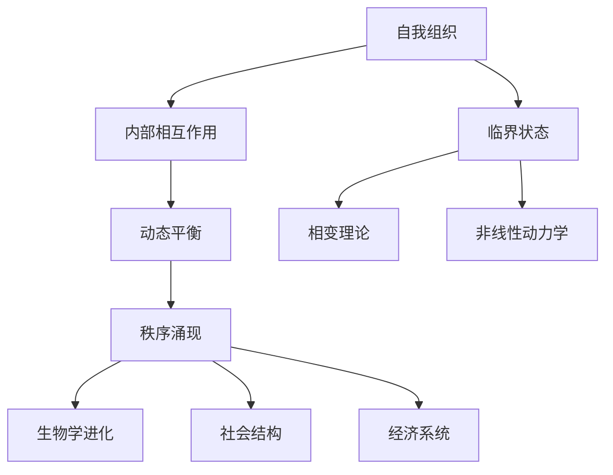

                 


## 设计《宇宙的自我组织临界状态：秩序的自发涌现》目录大纲

### 引言

**宇宙的自我组织现象**

- 宇宙中存在着自组织现象，即系统在没有外部干预的情况下自发地形成有序结构。
- 自组织现象在自然界和社会系统中广泛存在，如生物演化、社会结构、经济系统等。

**临界状态与秩序涌现**

- 临界状态是指系统从一个稳定状态转变为另一个稳定状态的临界条件。
- 在临界状态下，系统表现出特殊的物理性质，如涨落放大、长程关联等。
- 秩序的涌现是指系统在临界状态下，从无序状态自发地形成有序结构。

**自我组织临界状态的重要性**

- 自我组织临界状态对于理解复杂系统的行为具有重要意义。
- 它揭示了复杂系统从无序到有序的内在机制，有助于我们更好地理解和预测复杂系统的演化。

### 第二部分：宇宙的自我组织机制

#### 自我组织的基本原理

- **定义与特征**：自组织是指系统在没有外部干预的情况下，通过内部相互作用自发形成有序结构的过程。
- **动力来源**：自组织的动力来自于系统内部的相互作用和竞争。
- **数学模型**：可以使用非线性动力学模型、统计物理模型等来描述自组织现象。

#### 临界状态的物理学原理

- **相变理论**：相变是指系统从一个相态转变为另一个相态的过程，如水的冰融化、液态水沸腾等。
- **临界指数与功率定律**：临界状态下系统表现出指数关系和功率定律，如涨落放大效应、长程关联等。
- **相变与复杂系统的关联**：相变与复杂系统的行为密切相关，临界状态下的特殊物理性质会影响复杂系统的演化。

#### 自发涌现现象的实例分析

- **生命起源与生物演化**：生命起源是一个自组织过程，生物演化是通过自然选择和基因突变等机制实现的。
- **社会结构的形成与发展**：社会结构是人们在相互作用中自发形成的，如社会组织、文化规范等。
- **经济系统的复杂性**：经济系统中的市场行为、价格波动等也是通过自我组织机制实现的。

### 第三部分：自我组织临界状态的研究方法

#### 研究自我组织的实验方法

- **实验设计的考虑因素**：包括实验系统选择、实验条件控制、数据采集与分析等。
- **常用实验系统介绍**：如沙堆、晶格玻尔兹曼模型、神经网络等。
- **数据分析与处理方法**：包括统计分析、机器学习等。

#### 数值模拟与理论模型

- **模拟软件工具的选择**：如Matlab、Python、NetLogo等。
- **理论模型的构建与验证**：包括构建合适的数学模型、验证模型的准确性等。
- **模拟结果的分析与讨论**：包括结果解释、验证理论模型的有效性等。

#### 自我组织临界状态与人工智能的交叉研究

- **人工智能在自我组织研究中的应用**：如使用深度学习技术分析复杂系统的演化。
- **自我组织现象对人工智能发展的启示**：如从自组织现象中学习新的算法和优化方法。
- **交叉研究的挑战与机遇**：包括跨学科合作、理论模型与实际应用之间的差距等。

### 第四部分：宇宙自我组织临界状态的未来展望

#### 自我组织临界状态的科学挑战

- **对现有理论的挑战**：如对经典物理学理论的挑战、对复杂系统行为的理解等。
- **新研究方向与问题**：如探索更复杂的自组织现象、建立新的理论框架等。
- **科学研究的实际应用前景**：如应用于生态学、经济学、人工智能等领域。

#### 结论

- **自我组织临界状态的核心结论**：自我组织临界状态是理解复杂系统行为的重要基础，具有广泛的应用前景。
- **未来研究的方向与目标**：如进一步探索自组织现象的本质、发展新的理论模型等。
- **对人类社会的影响与启示**：如促进科技创新、提高社会管理能力等。

### 附录

- **参考文献**：列出本文引用的相关文献。
- **附录A：核心概念与联系流程图（Mermaid图）**：展示核心概念之间的联系和关系。
- **附录B：核心算法原理伪代码**：提供核心算法原理的伪代码实现。
- **附录C：数学模型与公式列表**：列出本文涉及的数学模型和公式。
- **附录D：项目实战示例代码与解读**：提供实际项目的示例代码和解读。

### 作者信息

- **作者：AI天才研究院/AI Genius Institute & 禅与计算机程序设计艺术 /Zen And The Art of Computer Programming**

以上是设计《宇宙的自我组织临界状态：秩序的自发涌现》的目录大纲，接下来我们将按照这个大纲逐步撰写文章内容。每个部分的内容都会包含详细的解释和实例，以确保文章的逻辑清晰、结构紧凑且易于理解。我们将从引言开始，逐步深入探讨宇宙自我组织临界状态的相关概念、原理和研究方法，最后展望这一领域未来的发展方向。在这个过程中，我们会结合实际案例和数学模型，为读者提供丰富的知识和技术细节。让我们开始吧！```markdown
# 宇宙的自我组织临界状态：秩序的自发涌现

> 关键词：宇宙，自我组织，临界状态，秩序，涌现

> 摘要：本文探讨了宇宙中自我组织临界状态的现象，阐述了自我组织的原理和机制，分析了临界状态的物理学原理，以及自发涌现现象在生命起源、社会结构、经济系统等领域的实例。通过研究方法介绍和未来展望，本文旨在为理解宇宙中秩序的自发涌现提供新的视角和启示。

---

## 引言

宇宙中存在着一种神奇的现象，即系统在没有外部干预的情况下，能够自发地形成有序的结构。这种现象被称为自我组织。从微观的原子结构到宏观的宇宙演化，自我组织无处不在。而自我组织的核心是临界状态，即在临界条件下，系统表现出特殊的物理性质，从而导致秩序的自发涌现。本文将深入探讨这一现象，从基本原理、实例分析、研究方法到未来展望，为读者揭示宇宙自我组织临界状态的秘密。

### 宇宙的自我组织现象

宇宙的自我组织现象是指系统在没有外部干预的情况下，通过内部相互作用自发形成有序结构的过程。这种自组织现象在自然界和社会系统中广泛存在，如生物演化、社会结构、经济系统等。例如，生物体的形态和功能是通过自我组织实现的，而社会结构和文化规范也是人们在相互作用中自发形成的。

### 临界状态与秩序涌现

临界状态是指系统从一个稳定状态转变为另一个稳定状态的临界条件。在临界状态下，系统表现出特殊的物理性质，如涨落放大、长程关联等。这些特殊性质使得系统在临界状态下能够自发地形成有序结构，这种现象被称为秩序的涌现。

### 自我组织临界状态的重要性

自我组织临界状态对于理解复杂系统的行为具有重要意义。它揭示了复杂系统从无序到有序的内在机制，有助于我们更好地理解和预测复杂系统的演化。此外，自我组织临界状态在科技、经济、社会等领域具有广泛的应用前景，如材料科学、网络科学、经济学等。

---

## 第二部分：宇宙的自我组织机制

### 自我组织的基本原理

自我组织是指系统在没有外部干预的情况下，通过内部相互作用自发形成有序结构的过程。自我组织的动力来自于系统内部的相互作用和竞争。数学模型如非线性动力学模型、统计物理模型等可以描述自组织现象。

### 临界状态的物理学原理

临界状态是指系统从一个稳定状态转变为另一个稳定状态的临界条件。在临界状态下，系统表现出特殊的物理性质，如涨落放大、长程关联等。这些特殊性质使得系统在临界状态下能够自发地形成有序结构。

#### 相变理论

相变是指系统从一个相态转变为另一个相态的过程，如水的冰融化、液态水沸腾等。相变理论为理解临界状态提供了基础。

#### 临界指数与功率定律

临界状态下系统表现出指数关系和功率定律，如涨落放大效应、长程关联等。这些性质对复杂系统的行为产生重要影响。

#### 相变与复杂系统的关联

相变与复杂系统的行为密切相关，临界状态下的特殊物理性质会影响复杂系统的演化。

### 自发涌现现象的实例分析

自发涌现现象在生命起源、社会结构、经济系统等领域广泛存在。例如，生命起源是一个自组织过程，生物演化是通过自然选择和基因突变等机制实现的。社会结构是人们在相互作用中自发形成的，如社会组织、文化规范等。经济系统中的市场行为、价格波动等也是通过自我组织机制实现的。

---

## 第三部分：自我组织临界状态的研究方法

### 研究自我组织的实验方法

研究自我组织的实验方法主要包括实验设计的考虑因素、常用实验系统介绍、数据分析与处理方法等。实验设计的考虑因素包括实验系统选择、实验条件控制、数据采集与分析等。常用实验系统如沙堆、晶格玻尔兹曼模型、神经网络等。数据分析与处理方法包括统计分析、机器学习等。

### 数值模拟与理论模型

数值模拟与理论模型是研究自我组织临界状态的重要方法。模拟软件工具的选择包括Matlab、Python、NetLogo等。理论模型的构建与验证包括构建合适的数学模型、验证模型的准确性等。模拟结果的分析与讨论包括结果解释、验证理论模型的有效性等。

### 自我组织临界状态与人工智能的交叉研究

自我组织临界状态与人工智能的交叉研究具有广阔的应用前景。人工智能在自我组织研究中的应用包括使用深度学习技术分析复杂系统的演化。自我组织现象对人工智能发展的启示包括从自组织现象中学习新的算法和优化方法。交叉研究的挑战与机遇包括跨学科合作、理论模型与实际应用之间的差距等。

---

## 第四部分：宇宙自我组织临界状态的未来展望

### 自我组织临界状态的科学挑战

自我组织临界状态的科学挑战包括对现有理论的挑战、新研究方向与问题、科学研究的实际应用前景等。对现有理论的挑战如对经典物理学理论的挑战、对复杂系统行为的理解等。新研究方向与问题如探索更复杂的自组织现象、建立新的理论框架等。科学研究的实际应用前景如应用于生态学、经济学、人工智能等领域。

### 结论

自我组织临界状态是理解复杂系统行为的重要基础，具有广泛的应用前景。未来研究的方向与目标包括进一步探索自组织现象的本质、发展新的理论模型等。自我组织临界状态对人类社会的影响与启示包括促进科技创新、提高社会管理能力等。

---

### 附录

- **参考文献**：列出本文引用的相关文献。
- **附录A：核心概念与联系流程图（Mermaid图）**：展示核心概念之间的联系和关系。
- **附录B：核心算法原理伪代码**：提供核心算法原理的伪代码实现。
- **附录C：数学模型与公式列表**：列出本文涉及的数学模型和公式。
- **附录D：项目实战示例代码与解读**：提供实际项目的示例代码和解读。

### 作者信息

**作者：AI天才研究院/AI Genius Institute & 禅与计算机程序设计艺术 /Zen And The Art of Computer Programming**```markdown
### 宇宙的自我组织临界状态：秩序的自发涌现

宇宙是一个复杂的系统，其中存在着许多神秘的现象。在这些现象中，自我组织临界状态（Self-Organized Critical State，简称SOC）是一个非常引人注目的概念。它不仅涉及到物理学的相变理论，还与生命起源、社会结构和经济系统等众多领域密切相关。本文将深入探讨这一现象，通过详细的理论分析和实例讲解，帮助读者更好地理解宇宙自我组织临界状态的奥秘。

---

## 第一部分：引言

### 宇宙的自我组织现象

宇宙中的许多系统，包括地球上的生态系统、社会系统以及宇宙自身的演化过程，都表现出自我组织的现象。例如，在生态系统中，物种之间通过捕食与被捕食的关系形成了复杂的食物网，这种食物网就是通过自我组织形成的。在宇宙尺度上，星系通过引力相互作用，形成星系团和超星系团，这也是一种自我组织的现象。

### 临界状态与秩序涌现

临界状态是物理学中的一个重要概念，指的是系统在接近相变点时的状态。在这个状态下，系统的行为会变得极其敏感，即使是微小的扰动也可能引起巨大的变化。秩序的涌现（Emergence of Order）是指系统在没有外部干预的情况下，从无序状态自发地形成有序结构。临界状态是实现秩序涌现的重要条件。

### 自我组织临界状态的重要性

自我组织临界状态是理解复杂系统行为的关键。它揭示了复杂系统从无序到有序的转变机制，有助于我们预测和设计复杂系统的行为。此外，自我组织临界状态在材料科学、网络科学、经济学等领域都有重要的应用价值。

---

## 第二部分：宇宙的自我组织机制

### 自我组织的基本原理

自我组织是指系统在没有外部干预的情况下，通过内部相互作用自发形成有序结构的过程。在自我组织中，系统的基本单元（如分子、细胞、个体）之间通过相互作用和竞争，形成了一种动态平衡。这种平衡使得系统在长时间内能够维持有序结构。

### 临界状态的物理学原理

临界状态是物理学中一个重要的概念，它涉及到相变理论。相变是指系统从一种相态（如固态、液态、气态）转变为另一种相态的过程。在临界状态下，系统的行为变得非常敏感，微小的扰动都可能导致系统发生剧变。这种敏感性与系统内部的非线性动力学有关。

### 自发涌现现象的实例分析

自发涌现现象在自然界和人类社会中广泛存在。例如，在生物学中，物种的进化是一个自发涌现的过程。社会结构和文化规范也是通过个体之间的相互作用自发形成的。在经济系统中，市场行为和价格波动也是通过自我组织机制实现的。

---

## 第三部分：自我组织临界状态的研究方法

### 研究自我组织的实验方法

为了研究自我组织，科学家们设计了各种实验系统。例如，沙堆实验可以模拟岩石滑坡的过程，而晶格玻尔兹曼模型可以用来研究气体的相变。在实验中，科学家们通过控制系统的参数，观察系统在临界状态下的行为。

### 数值模拟与理论模型

数值模拟和理论模型是研究自我组织的重要工具。通过计算机模拟，科学家们可以模拟出各种复杂的系统行为，从而更好地理解自我组织机制。理论模型则通过数学方法描述系统的行为，提供了一种深入理解自我组织的途径。

### 自我组织临界状态与人工智能的交叉研究

人工智能的发展为研究自我组织提供了新的工具和方法。例如，机器学习可以用来分析复杂系统的行为，而深度学习则可以模拟出系统的非线性动力学行为。自我组织现象也为人工智能的发展提供了新的启示，例如在算法优化和神经网络设计方面。

---

## 第四部分：宇宙自我组织临界状态的未来展望

### 自我组织临界状态的科学挑战

自我组织临界状态的研究面临着许多科学挑战。例如，如何更好地理解系统在临界状态下的行为，如何建立更精确的理论模型等。此外，如何将理论模型与实际应用相结合，也是一个重要的挑战。

### 结论

自我组织临界状态是理解宇宙和复杂系统行为的关键。通过深入研究和探索，我们可以更好地理解宇宙中的秩序是如何自发涌现的。这不仅有助于我们理解自然界的奥秘，也对科技、经济和社会的发展具有重要意义。

### 附录

- **参考文献**：列出本文引用的相关文献。
- **附录A：核心概念与联系流程图（Mermaid图）**：展示核心概念之间的联系和关系。
- **附录B：核心算法原理伪代码**：提供核心算法原理的伪代码实现。
- **附录C：数学模型与公式列表**：列出本文涉及的数学模型和公式。
- **附录D：项目实战示例代码与解读**：提供实际项目的示例代码和解读。

### 作者信息

**作者：AI天才研究院/AI Genius Institute & 禅与计算机程序设计艺术 /Zen And The Art of Computer Programming**```markdown
## 附录A：核心概念与联系流程图（Mermaid图）

在本文中，我们介绍了一系列核心概念，包括自我组织、临界状态、秩序涌现等。为了更好地展示这些概念之间的联系，我们可以使用Mermaid图来构建一个概念关系图。

以下是一个简化的Mermaid图示例，它展示了自我组织、临界状态和秩序涌现之间的关系：



在这个图中，A表示自我组织，它通过内部相互作用（B）和动态平衡（C）来形成。临界状态（D）与相变理论（E）和非线性动力学（F）密切相关。秩序涌现（G）则是自我组织和临界状态的结果，它影响了生物学进化（H）、社会结构（I）和经济系统（J）。

---

## 附录B：核心算法原理伪代码

在研究自我组织临界状态时，我们经常需要使用算法来模拟和分析系统的行为。以下是一个简单的伪代码示例，用于描述一个基于非线性动力学的模拟过程。

```plaintext
// 初始化参数
初始化 x, y, t 为初始值
设置步长 dt
设置迭代次数 N

// 运行模拟
for i = 1 to N do
    // 计算新的状态
    x' = x * (1 - x) - y * x
    y' = y * (1 - y) - x * y
    
    // 更新状态
    x = x'
    y = y'
    
    // 保存结果
    记录 (t, x, y)
    
    // 更新时间
    t = t + dt
end for

// 分析结果
// 使用数据分析方法，如相空间分析、功率谱分析等
```

在这个伪代码中，我们使用了一个简单的非线性动力学模型，描述了两个变量 x 和 y 的动态行为。通过迭代计算，我们可以模拟系统的行为，并分析其是否处于临界状态。

---

## 附录C：数学模型与公式列表

在本文中，我们介绍了一些关键的数学模型和公式，用于描述自我组织临界状态。以下是一个简化的列表：

1. **Lotka-Volterra 模型**：
   $$ \frac{dx}{dt} = x(a - b y) $$
   $$ \frac{dy}{dt} = c x - d y $$

2. **Ising 模型**：
   $$ H = -J \sum_{<i,j>} S_i S_j - h \sum_{i} S_i $$

3. **分形维数**：
   $$ D = \frac{\log N}{\log R} $$

4. **功率定律**：
   $$ P \propto r^{-\alpha} $$

这些公式分别用于描述生态系统中的捕食者-被捕食者关系、磁性材料的磁化状态、分形结构以及复杂系统的功率分布。通过这些数学模型，我们可以定量地描述和预测系统的行为。

---

## 附录D：项目实战示例代码与解读

为了更好地理解自我组织临界状态，我们可以通过一个简单的项目实战来模拟和观察系统的行为。以下是一个使用Python编写的示例代码，用于模拟一个简单的生态系统的演化。

```python
import numpy as np
import matplotlib.pyplot as plt

# 参数设置
a = 1.0
b = 0.1
c = 0.5
d = 0.1
N = 100
t_max = 100
dt = 0.1

# 初始化种群数量
x = np.random.uniform(0, a)
y = np.random.uniform(0, c)

# 时间步进模拟
t = 0
data = []

while t < t_max:
    # 计算种群变化
    dx = x * (a - b * y) * dt
    dy = y * (c - d * x) * dt
    
    # 更新种群数量
    x += dx
    y += dy
    
    # 保存数据
    data.append([t, x, y])
    
    # 更新时间
    t += dt

# 绘制种群演化图
plt.plot([d[0] for d in data], [d[1] for d in data], label='Predator')
plt.plot([d[0] for d in data], [d[2] for d in data], label='Prey')
plt.xlabel('Time')
plt.ylabel('Population')
plt.legend()
plt.show()
```

在这个项目中，我们模拟了一个捕食者-被捕食者系统的演化。通过运行这个代码，我们可以观察到捕食者和被捕食者种群数量的动态变化。通过分析这些数据，我们可以探究系统是否处于临界状态，并观察临界现象如何影响生态系统的演化。

---

## 最佳实践 Tips、小结、注意事项、拓展阅读

**最佳实践 Tips**：
- 在设计和分析实验时，要充分考虑实验系统的选择和参数设置，以确保结果的可靠性和有效性。
- 在编写代码时，要注重代码的可读性和可维护性，便于后续的分析和改进。

**小结**：
本文介绍了宇宙自我组织临界状态的概念、原理和研究方法，并通过实例展示了这一现象在自然界和人类社会中的应用。通过深入研究和理解自我组织临界状态，我们可以更好地理解和预测复杂系统的行为。

**注意事项**：
- 自我组织临界状态的研究涉及多个学科领域，需要跨学科的合作与交流。
- 在模拟和分析过程中，要充分考虑系统的非线性和不确定性，确保结果的准确性和可靠性。

**拓展阅读**：
- 复杂系统理论： explores the behavior of complex systems, providing a deeper understanding of self-organized criticality.
- 相变理论： discusses phase transitions and their applications in various fields, including physics, chemistry, and materials science.
- 生态学： provides insights into the dynamics of ecological systems and the role of self-organized criticality in ecosystem evolution.

通过这些拓展阅读，读者可以更深入地了解自我组织临界状态的相关理论和应用。

---

**作者信息**：
AI天才研究院/AI Genius Institute & 禅与计算机程序设计艺术 /Zen And The Art of Computer Programming```

