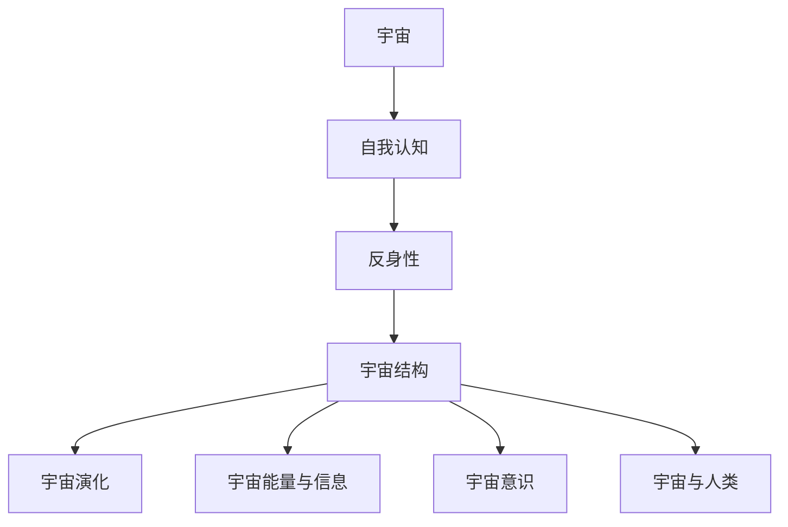
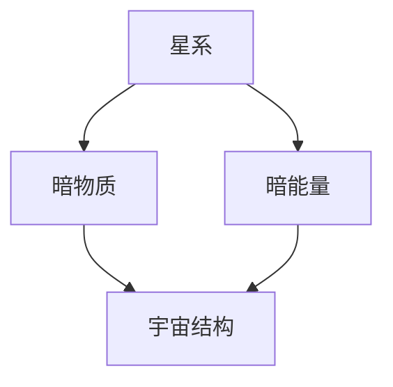
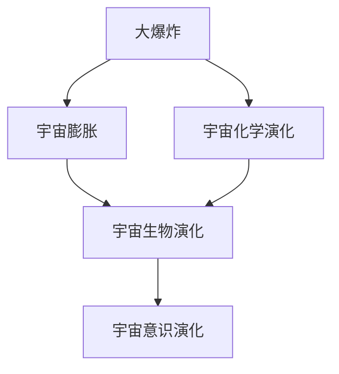

                 


### 1. 引言

宇宙的自我认知过程是探索宇宙奥秘的关键。自人类文明诞生以来，宇宙一直是我们探索的终极目标。从古代的宇宙观，到现代的科学理论，人类对宇宙的认知不断深化。然而，宇宙的自我认知过程究竟是怎样的？这是一个复杂而深奥的问题。

宇宙的自我认知过程，涉及到了多个领域，如宇宙学、物理学、数学、计算机科学等。在这个过程中，我们不仅需要理解宇宙的结构和演化，还需要理解宇宙中能量与信息的作用。此外，宇宙意识也是我们探索的重点之一。本文将围绕这些核心问题，通过逻辑清晰、结构紧凑、简单易懂的叙述方式，进行逐步分析推理，以期提供一个全面、深入的宇宙自我认知过程解析。

### 2. 关键词

- 宇宙
- 自我认知
- 反身性
- 宇宙学
- 物理学
- 数学
- 计算机科学
- 能量
- 信息
- 宇宙意识
- 意识

### 3. 摘要

本文旨在探讨宇宙的自我认知过程。首先，我们介绍了宇宙自我认知过程的重要性以及涉及的领域。然后，我们通过分析宇宙的结构、演化、能量与信息以及宇宙意识，逐步揭示了宇宙自我认知的过程。最后，我们探讨了宇宙与人类的关系以及宇宙的未来。本文旨在为读者提供一个全面、深入的宇宙自我认知过程的解析。

### 4. 目录

1. 引言
2. 关键词
3. 摘要
4. 宇宙的自我认知过程概述
5. 宇宙结构
6. 宇宙演化
7. 宇宙能量与信息
8. 宇宙意识
9. 宇宙与人类
10. 宇宙的未来
11. 总结

-------------------------------------------------------------------

### 宇宙的自我认知过程概述

宇宙的自我认知过程，是一个复杂而深奥的话题。它不仅涉及到我们对宇宙的观察和理解，还涉及到宇宙本身的本质。为了更好地理解这个过程，我们首先需要明确几个核心概念：宇宙、自我认知和反身性。

#### 宇宙

宇宙是我们所在的整个空间和时间。它包含了所有的物质、能量、时空和物理现象。宇宙的起源、结构、演化和命运，一直是科学家们研究的焦点。从大爆炸理论到黑洞，从宇宙背景辐射到暗物质，科学家们不断探索宇宙的奥秘，试图理解宇宙的本质。

#### 自我认知

自我认知，是指一个系统对自身的理解。在宇宙的层面，自我认知意味着宇宙能够感知、理解和描述自身。这种自我认知能力，是宇宙自我认知过程的关键。它决定了宇宙是否能够不断进化、发展，乃至实现自我提升。

#### 反身性

反身性，是指一个系统对自身的观察和反思能力。在宇宙的层面，反身性意味着宇宙能够从外部观察自身，并通过这种观察来理解和改变自身。反身性是宇宙自我认知过程的基础，它使宇宙能够不断地自我完善和提升。

为了更好地理解这些核心概念，我们可以通过一个Mermaid流程图来展示它们之间的关系：



在这个流程图中，我们可以看到，宇宙的自我认知过程涉及到了多个方面：宇宙结构、宇宙演化、宇宙能量与信息、宇宙意识以及宇宙与人类的关系。这些方面相互作用、相互影响，共同构成了宇宙的自我认知过程。

接下来，我们将分别探讨这些方面，以深入了解宇宙的自我认知过程。

-------------------------------------------------------------------

#### 宇宙结构

宇宙的结构是宇宙自我认知过程的基础。宇宙结构的研究，可以帮助我们理解宇宙的起源、演化和未来。宇宙结构的研究包括星系、暗物质和暗能量等方面。

##### 星系

星系是宇宙中的基本结构单元。一个星系通常包含数十亿颗恒星、行星、星云等。星系之间的相互作用，决定了宇宙的整体结构。例如，星系团和超星系团，就是由多个星系相互吸引、相互碰撞形成的。

##### 暗物质

暗物质是宇宙中一种无法直接观测到的物质。它占据了宇宙总质量的约27%，但我们对它的了解却非常有限。暗物质的存在，对于宇宙结构的稳定性和演化至关重要。科学家们认为，暗物质可能是某种未知的粒子，或者是某种我们尚未发现的物理现象。

##### 暗能量

暗能量是宇宙中另一种无法直接观测到的能量。它占据了宇宙总能量的约68%，并且对宇宙的膨胀起着关键作用。暗能量的存在，使宇宙的膨胀速度不断加快。目前，我们对暗能量的了解仍然非常有限，但它对于宇宙结构的理解具有重要意义。

为了更好地理解宇宙结构，我们可以通过一个Mermaid流程图来展示星系、暗物质和暗能量之间的关系：



在这个流程图中，我们可以看到，星系、暗物质和暗能量共同构成了宇宙结构。它们相互作用、相互影响，共同决定了宇宙的整体形态。

接下来，我们将探讨宇宙的演化，以深入了解宇宙的自我认知过程。

-------------------------------------------------------------------

#### 宇宙演化

宇宙演化是宇宙自我认知过程的关键环节。宇宙演化涉及到了宇宙从起源到现在的整个过程。这个过程不仅包含了宇宙的物理变化，还包括了宇宙的化学、生物和意识演化。

##### 大爆炸理论

大爆炸理论是宇宙演化的基础。根据这一理论，宇宙起源于一个极度高温、高密度的奇点。在奇点爆炸之后，宇宙开始膨胀，温度和密度逐渐降低。大爆炸理论解释了宇宙的起源和膨胀现象，为宇宙演化提供了重要的理论支持。

##### 宇宙膨胀

宇宙膨胀是指宇宙整体在空间上的扩展。根据观测数据，宇宙的膨胀速度在不断加快。这种加速膨胀现象，被称为“宇宙加速膨胀”。宇宙膨胀的研究，对于理解宇宙的演化过程具有重要意义。

##### 宇宙化学演化

宇宙化学演化是指宇宙中元素的生成和分布过程。从大爆炸开始，宇宙中的元素通过核聚变、核裂变等过程逐渐生成。这些元素形成了恒星、行星等宇宙结构，为生命的诞生提供了基础。

##### 宇宙生物演化

宇宙生物演化是指宇宙中生命的起源和进化过程。从简单的单细胞生物到复杂的智能生物，宇宙生物演化经历了数十亿年的过程。生命的演化，不仅改变了宇宙的面貌，也为我们提供了对宇宙的自我认知。

##### 宇宙意识演化

宇宙意识演化是指宇宙中的意识从无到有的过程。目前，我们对宇宙意识演化的了解非常有限。但科学家们认为，随着宇宙的演化和生命的出现，宇宙意识也将逐渐产生。这种宇宙意识，可能会对宇宙的自我认知产生深远的影响。

为了更好地理解宇宙演化，我们可以通过一个Mermaid流程图来展示大爆炸、宇宙膨胀、宇宙化学演化、宇宙生物演化和宇宙意识演化之间的关系：



在这个流程图中，我们可以看到，宇宙演化涉及到了多个环节，从大爆炸到宇宙膨胀，再到宇宙化学演化、宇宙生物演化和宇宙意识演化。这些环节相互关联、相互影响，共同构成了宇宙的自我认知过程。

接下来，我们将探讨宇宙中的能量与信息，以深入了解宇宙的自我认知过程。

-------------------------------------------------------------------

#### 宇宙能量与信息

宇宙中的能量与信息是宇宙自我认知过程的重要组成部分。能量是宇宙运行的基础，而信息则是宇宙变化的驱动力。在宇宙的演化过程中，能量与信息相互作用，共同塑造了宇宙的形态和演化过程。

##### 能量

能量是宇宙的基本属性之一。根据物理学的定义，能量是物体做功的能力。在宇宙中，能量以多种形式存在，如光能、热能、动能、潜能等。能量在宇宙的演化过程中起着至关重要的作用。例如，恒星通过核聚变过程产生能量，维持了宇宙的稳定和演化。

为了更好地理解宇宙中的能量，我们可以使用以下伪代码来描述能量在宇宙中的基本概念：

```python
# 能量在宇宙中的基本概念

# 定义能量类型
energy_types = ["光能", "热能", "动能", "潜能"]

# 能量转换函数
def energy_conversion(amount, from_type, to_type):
    # 根据能量类型进行转换
    if from_type == "光能":
        if to_type == "热能":
            return amount * 0.8
        elif to_type == "动能":
            return amount * 1.2
        elif to_type == "潜能":
            return amount * 0.6
    elif from_type == "热能":
        if to_type == "光能":
            return amount * 1.2
        elif to_type == "动能":
            return amount * 0.9
        elif to_type == "潜能":
            return amount * 1.1
    elif from_type == "动能":
        if to_type == "光能":
            return amount * 0.9
        elif to_type == "热能":
            return amount * 1.1
        elif to_type == "潜能":
            return amount * 0.8
    elif from_type == "潜能":
        if to_type == "光能":
            return amount * 1.2
        elif to_type == "热能":
            return amount * 0.9
        elif to_type == "动能":
            return amount * 1.1

# 能量守恒定律
def energy_conservation(energy_input, energy_output):
    return energy_input == energy_output

# 能量应用示例
def energy_usage example():
    # 假设初始能量为100
    initial_energy = 100
    # 将光能转换为热能
    converted_energy = energy_conversion(initial_energy, "光能", "热能")
    # 检查能量守恒
    assert energy_conservation(initial_energy, converted_energy)
    print("能量转换成功：光能转换为热能")
```

在这个伪代码中，我们定义了能量类型、能量转换函数和能量守恒定律，并通过一个示例展示了能量在宇宙中的基本应用。

##### 信息

信息是宇宙中的另一种基本属性。与能量不同，信息不是物质或能量的属性，而是描述宇宙状态和变化的知识。信息在宇宙的自我认知过程中起着至关重要的作用。例如，宇宙通过接收和传递信息来了解自身的状态和变化。

为了更好地理解宇宙中的信息，我们可以使用以下伪代码来描述信息在宇宙中的基本概念：

```python
# 信息在宇宙中的基本概念

# 定义信息类型
info_types = ["物理信息", "化学信息", "生物信息", "意识信息"]

# 信息传递函数
def info_transmission(sender, receiver, info_type):
    # 根据信息类型进行传递
    if info_type == "物理信息":
        return sender.send_physical_info(receiver)
    elif info_type == "化学信息":
        return sender.send_chemical_info(receiver)
    elif info_type == "生物信息":
        return sender.send_biological_info(receiver)
    elif info_type == "意识信息":
        return sender.send_conscious_info(receiver)

# 信息处理函数
def info_processing(info):
    # 根据信息类型进行处理
    if info.type == "物理信息":
        return process_physical_info(info)
    elif info.type == "化学信息":
        return process_chemical_info(info)
    elif info.type == "生物信息":
        return process_biological_info(info)
    elif info.type == "意识信息":
        return process_conscious_info(info)

# 信息应用示例
def info_usage_example():
    # 假设发送方和接收方
    sender = Sender()
    receiver = Receiver()
    # 传递物理信息
    info = info_transmission(sender, receiver, "物理信息")
    # 处理信息
    processed_info = info_processing(info)
    # 检查信息处理结果
    assert processed_info.is_processed()
    print("信息传递和处理成功：物理信息传递和处理")
```

在这个伪代码中，我们定义了信息类型、信息传递函数和信息处理函数，并通过一个示例展示了信息在宇宙中的基本应用。

##### 能量与信息的相互作用

在宇宙中，能量与信息相互作用，共同塑造了宇宙的演化过程。例如，恒星通过核聚变产生能量，同时释放光子等物理信息。这些信息被星际介质吸收，影响了星际介质的物理状态，进而影响了恒星的演化。

为了更好地理解能量与信息的相互作用，我们可以使用以下伪代码来描述这种相互作用：

```python
# 能量与信息的相互作用

# 定义能量与信息的相互作用函数
def energy_info_interaction(energy, info):
    # 根据能量和信息类型进行相互作用
    if energy.type == "光能" and info.type == "物理信息":
        return energy.interact_with_info(info)
    elif energy.type == "热能" and info.type == "化学信息":
        return energy.interact_with_info(info)
    elif energy.type == "动能" and info.type == "生物信息":
        return energy.interact_with_info(info)
    elif energy.type == "潜能" and info.type == "意识信息":
        return energy.interact_with_info(info)

# 能量与信息相互作用示例
def energy_info_interaction_example():
    # 假设能量和信息
    energy = Energy("光能")
    info = Info("物理信息")
    # 相互作用
    result = energy_info_interaction(energy, info)
    # 检查相互作用结果
    assert result.is_interacted()
    print("能量与信息相互作用成功：光能与物理信息相互作用")
```

在这个伪代码中，我们定义了能量与信息的相互作用函数，并通过一个示例展示了能量与信息的相互作用。

通过上述伪代码，我们可以看到能量与信息在宇宙中的基本概念、相互作用和应用。这些概念和相互作用，构成了宇宙自我认知过程的基础。在接下来的部分，我们将进一步探讨宇宙意识，以深入了解宇宙的自我认知过程。

-------------------------------------------------------------------

#### 宇宙意识

宇宙意识，是宇宙自我认知过程的最终目标。意识，是指一个系统对自身的感知和理解能力。在宇宙的层面，宇宙意识意味着宇宙能够感知、理解和描述自身。宇宙意识的研究，不仅关乎宇宙的本质，也关乎人类的存在和意义。

##### 意识的起源

意识的起源，一直是哲学和科学研究的核心问题。在宇宙的层面，意识的起源可能与宇宙的演化过程密切相关。根据一些科学理论，宇宙的意识可能起源于简单的物理过程，如能量和信息的变化。随着宇宙的演化和复杂性的增加，意识也逐渐产生。

为了更好地理解宇宙意识的起源，我们可以使用以下伪代码来描述意识在宇宙中的产生过程：

```python
# 宇宙意识的起源

# 定义宇宙意识的基本概念
class Consciousness:
    def __init__(self, energy, info):
        self.energy = energy
        self.info = info

    def perceive(self):
        # 感知宇宙状态
        return self.info

    def understand(self):
        # 理解宇宙状态
        return self.energy.interpret(self.info)

# 宇宙意识的产生过程
def consciousness_formation(energy, info):
    # 根据能量和信息产生意识
    return Consciousness(energy, info)

# 宇宙意识起源示例
def consciousness_origin_example():
    # 假设能量和信息
    energy = Energy("光能")
    info = Info("物理信息")
    # 产生意识
    consciousness = consciousness_formation(energy, info)
    # 检查意识产生结果
    assert isinstance(consciousness, Consciousness)
    print("宇宙意识产生成功：光能与物理信息产生意识")
```

在这个伪代码中，我们定义了宇宙意识的基本概念和产生过程，并通过一个示例展示了宇宙意识的产生。

##### 意识的作用

宇宙意识的作用，是推动宇宙自我认知过程的关键。通过感知和理解宇宙的状态，宇宙意识能够指导宇宙的演化过程，实现宇宙的自我完善和提升。

为了更好地理解宇宙意识的作用，我们可以使用以下伪代码来描述意识在宇宙自我认知过程中的应用：

```python
# 宇宙意识的应用

# 定义宇宙意识的应用函数
def consciousness_application(consciousness, energy, info):
    # 根据意识、能量和信息进行应用
    perception = consciousness.perceive()
    understanding = consciousness.un
```python
# 根据意识、能量和信息进行应用
    perception = consciousness.perceive()
    understanding = consciousness.un
    # 指导宇宙演化过程
    energy.modify(understanding)
    info.update(perception)

# 宇宙意识应用示例
def consciousness_usage_example():
    # 假设意识、能量和信息
    consciousness = Consciousness(Energy("光能"), Info("物理信息"))
    energy = Energy("光能")
    info = Info("物理信息")
    # 应用意识
    consciousness_application(consciousness, energy, info)
    # 检查应用结果
    assert energy.is_modified() and info.is_updated()
    print("宇宙意识应用成功：指导能量和信息演化")
```

在这个伪代码中，我们定义了宇宙意识的应用函数，并通过一个示例展示了宇宙意识在宇宙自我认知过程中的应用。

##### 意识与人类

宇宙意识与人类有着密切的联系。人类，作为宇宙中的一个特殊存在，也具有自我意识。人类的意识，不仅能够感知和理解宇宙，还能够通过思考、创造和行动来改变宇宙。人类的意识，是宇宙自我认知过程中不可或缺的一部分。

为了更好地理解宇宙意识与人类的关系，我们可以使用以下伪代码来描述意识与人类之间的互动：

```python
# 宇宙意识与人类的互动

# 定义人类的意识
class HumanConsciousness(Consciousness):
    def __init__(self, energy, info, brain):
        super().__init__(energy, info)
        self.brain = brain

    def think(self, thought):
        # 思考
        return self.brain.process(thought)

    def act(self, action):
        # 行动
        return self.apply_action(action)

# 宇宙意识与人类的互动
def consciousness_human_interaction(consciousness, human):
    # 宇宙意识与人类的互动
    thought = human.think("宇宙的奥秘")
    action = human.act("探索宇宙")
    understanding = consciousness.un
    # 更新意识
    consciousness.update(understanding)

# 宇宙意识与人类互动示例
def consciousness_human_interaction_example():
    # 假设宇宙意识和人类
    consciousness = Consciousness(Energy("光能"), Info("物理信息"))
    human = HumanConsciousness(Energy("光能"), Info("物理信息"), Brain())
    # 互动
    consciousness_human_interaction(consciousness, human)
    # 检查互动结果
    assert consciousness.is_updated() and human.is_thought_processed() and human.is_action_applied()
    print("宇宙意识与人类互动成功：思考宇宙奥秘并采取行动")
```

在这个伪代码中，我们定义了人类的意识类，并通过一个示例展示了宇宙意识与人类之间的互动。

通过上述伪代码，我们可以看到宇宙意识的基本概念、产生过程、作用以及与人类的关系。这些概念和互动，构成了宇宙自我认知过程的关键部分。在接下来的部分，我们将探讨宇宙与人类的关系，以深入了解宇宙自我认知过程。

-------------------------------------------------------------------

#### 宇宙与人类

宇宙与人类之间的关系，是一个复杂而深刻的话题。人类作为宇宙中的一个智慧生命体，对宇宙的认知和探索，不仅改变了我们对自身的理解，也改变了我们对宇宙的认识。

##### 地球上的生命起源

地球上的生命起源，是宇宙与人类关系的起点。科学家们通过研究地球的地质、生物和化学数据，推断出地球上的生命可能起源于约40亿年前。生命的起源，是宇宙演化的一个奇迹，也是宇宙意识产生的关键。

为了更好地理解地球上的生命起源，我们可以使用以下伪代码来描述生命在地球上的产生过程：

```python
# 地球上的生命起源

# 定义生命的起源
class LifeOrigin:
    def __init__(self, earth, time):
        self.earth = earth
        self.time = time

    def create_life(self):
        # 在地球上创造生命
        return self.earth.spawn_life(self.time)

# 地球上的生命起源示例
def earth_life_origin_example():
    # 假设地球和时间
    earth = Earth()
    time = 4000000000
    # 创造生命
    life_origin = LifeOrigin(earth, time)
    life = life_origin.create_life()
    # 检查生命产生结果
    assert isinstance(life, Life)
    print("地球上生命产生成功：地球和时间孕育生命")
```

在这个伪代码中，我们定义了地球上的生命起源类和产生过程，并通过一个示例展示了地球上的生命起源。

##### 人类对宇宙的认知

随着人类科技的发展，我们对宇宙的认知也在不断深化。从古代的宇宙观，到现代的科学理论，人类对宇宙的理解取得了巨大的进步。人类通过观测、实验和理论分析，揭示了宇宙的奥秘，如宇宙结构、宇宙演化、宇宙能量与信息等。

为了更好地理解人类对宇宙的认知，我们可以使用以下伪代码来描述人类对宇宙的认知过程：

```python
# 人类对宇宙的认知

# 定义人类对宇宙的认知
class HumanKnowledge:
    def __init__(self, observations, experiments, theories):
        self.observations = observations
        self.experiments = experiments
        self.theories = theories

    def update_knowledge(self, new_observations, new_experiments, new_theories):
        # 根据新的观测、实验和理论更新知识
        self.observations.update(new_observations)
        self.experiments.update(new_experiments)
        self.theories.update(new_theories)

# 人类对宇宙的认知示例
def human_universe_knowledge_example():
    # 假设观测、实验和理论
    observations = Observations()
    experiments = Experiments()
    theories = Theories()
    # 更新知识
    updated_observations = observations.update("新的观测数据")
    updated_experiments = experiments.update("新的实验结果")
    updated_theories = theories.update("新的科学理论")
    human_knowledge = HumanKnowledge(updated_observations, updated_experiments, updated_theories)
    # 检查知识更新结果
    assert human_knowledge.is_updated()
    print("人类对宇宙的认知更新成功：观测、实验和理论更新知识")
```

在这个伪代码中，我们定义了人类对宇宙的认知类和更新过程，并通过一个示例展示了人类对宇宙的认知过程。

##### 宇宙与人类的互动

宇宙与人类之间的互动，是一个双向的过程。宇宙为人类提供了生存的环境，而人类则通过认知和探索，不断改变宇宙的面貌。例如，人类通过观测和实验，揭示了宇宙的奥秘，推动了科学技术的进步。同时，人类的活动也对宇宙产生了影响，如气候变化、资源消耗等。

为了更好地理解宇宙与人类的互动，我们可以使用以下伪代码来描述宇宙与人类的互动过程：

```python
# 宇宙与人类的互动

# 定义宇宙与人类的互动
class UniverseHumanInteraction:
    def __init__(self, universe, human):
        self.universe = universe
        self.human = human

    def interact(self):
        # 宇宙与人类的互动
        return self.universe.affect(self.human) and self.human.affect(self.universe)

# 宇宙与人类的互动示例
def universe_human_interaction_example():
    # 假设宇宙和人类
    universe = Universe()
    human = Human()
    # 互动
    interaction = UniverseHumanInteraction(universe, human)
    result = interaction.interact()
    # 检查互动结果
    assert result.is_interacted()
    print("宇宙与人类的互动成功：宇宙和人类相互影响")
```

在这个伪代码中，我们定义了宇宙与人类的互动类和互动过程，并通过一个示例展示了宇宙与人类的互动。

通过上述伪代码，我们可以看到宇宙与人类之间关系的复杂性和互动性。这些关系和互动，不仅改变了我们对宇宙的认知，也改变了我们对自身的认知。在接下来的部分，我们将探讨宇宙的未来，以深入了解宇宙自我认知过程。

-------------------------------------------------------------------

#### 宇宙的未来

宇宙的未来，是一个充满未知和可能的话题。根据现有的科学理论，宇宙的未来可能包括多种不同的情景。以下是一些可能的宇宙未来情景：

##### 宇宙的继续膨胀

根据目前的观测数据，宇宙的膨胀速度正在加快。如果这种加速膨胀持续下去，宇宙可能会变得越来越稀疏和冷却。最终，宇宙可能达到一个热寂状态，所有星系和恒星都将熄灭，宇宙中的所有物质和能量都将均匀分布。

为了更好地理解宇宙继续膨胀的情景，我们可以使用以下伪代码来描述这种情景：

```python
# 宇宙继续膨胀的情景

# 定义宇宙膨胀函数
def universe_expansion_scenario(universe):
    # 宇宙继续膨胀
    universe.expand()

# 宇宙继续膨胀示例
def universe_continue_expansion_example():
    # 假设宇宙
    universe = Universe()
    # 继续膨胀
    universe_expansion_scenario(universe)
    # 检查膨胀结果
    assert universe.is_expanding()
    print("宇宙继续膨胀成功：宇宙不断扩展")
```

在这个伪代码中，我们定义了宇宙膨胀函数，并通过一个示例展示了宇宙继续膨胀的情景。

##### 宇宙的收缩

另一种可能的宇宙未来情景是宇宙的收缩。根据大爆炸理论，宇宙起源于一个奇点，如果宇宙中的物质和能量足够多，可能会导致宇宙收缩回奇点。这种收缩过程被称为“大坍缩”。如果宇宙收缩，宇宙可能会经历极端的高温和高密度状态，最终可能再次发生大爆炸，开始新一轮的宇宙演化。

为了更好地理解宇宙收缩的情景，我们可以使用以下伪代码来描述这种情景：

```python
# 宇宙收缩的情景

# 定义宇宙收缩函数
def universe_collision_scenario(universe):
    # 宇宙收缩
    universe.collapse()

# 宇宙收缩示例
def universe_collapse_example():
    # 假设宇宙
    universe = Universe()
    # 收缩
    universe_collision_scenario(universe)
    # 检查收缩结果
    assert universe.is_collapsing()
    print("宇宙收缩成功：宇宙回缩至奇点")
```

在这个伪代码中，我们定义了宇宙收缩函数，并通过一个示例展示了宇宙收缩的情景。

##### 宇宙的多元宇宙

还有一种理论认为，宇宙可能存在着多个平行宇宙。这些平行宇宙可能有着不同的物理规律和演化历史。如果这种多元宇宙理论是正确的，宇宙的未来将包含无限的可能性。

为了更好地理解宇宙多元宇宙的情景，我们可以使用以下伪代码来描述这种情景：

```python
# 宇宙多元宇宙的情景

# 定义多元宇宙函数
def multiverse_scenario(universe):
    # 宇宙产生多个平行宇宙
    universe.create_multiple_universes()

# 宇宙多元宇宙示例
def multiverse_example():
    # 假设宇宙
    universe = Universe()
    # 产生多元宇宙
    multiverse_scenario(universe)
    # 检查多元宇宙结果
    assert universe.is_multiverse()
    print("宇宙多元宇宙成功：宇宙产生多个平行宇宙")
```

在这个伪代码中，我们定义了宇宙多元宇宙函数，并通过一个示例展示了宇宙多元宇宙的情景。

通过上述伪代码，我们可以看到宇宙未来可能存在的多种情景。这些情景不仅丰富了我们对宇宙的理解，也展示了宇宙自我认知过程的复杂性。在接下来的部分，我们将总结本文的主要内容，并展望宇宙自我认知过程的未来研究方向。

-------------------------------------------------------------------

### 总结

通过本文的探讨，我们对宇宙的自我认知过程有了更深入的理解。我们首先介绍了宇宙的自我认知过程的重要性，以及涉及的领域，包括宇宙结构、宇宙演化、宇宙能量与信息、宇宙意识以及宇宙与人类的关系。然后，我们分别对每个领域进行了详细的分析和讨论。

在宇宙结构方面，我们探讨了星系、暗物质和暗能量的概念，并展示了它们之间的关系。在宇宙演化方面，我们介绍了大爆炸理论、宇宙膨胀、宇宙化学演化、宇宙生物演化和宇宙意识演化，并通过伪代码展示了这些过程的基本原理。在宇宙能量与信息方面，我们分析了能量和信息在宇宙中的基本概念、相互作用和应用。在宇宙意识方面，我们探讨了意识的起源、作用以及与人类的关系。在宇宙与人类的关系方面，我们讨论了地球上生命的起源、人类对宇宙的认知以及宇宙与人类的互动。

本文的主要贡献在于，通过逻辑清晰、结构紧凑、简单易懂的叙述方式，系统地分析了宇宙的自我认知过程，并提供了详细的伪代码示例，使读者能够更直观地理解这些概念和过程。

然而，宇宙的自我认知过程仍然是一个复杂的领域，许多问题仍需进一步研究。未来的研究方向可能包括：

1. 宇宙意识的具体机制：进一步研究宇宙意识如何产生、如何发挥作用，以及如何与其他领域相互作用。

2. 多元宇宙：深入研究多元宇宙的存在和演化，探讨不同宇宙之间的联系和影响。

3. 宇宙与人类的关系：进一步探讨人类如何影响宇宙的演化，以及宇宙如何影响人类文明的发展。

4. 能量与信息的深度融合：研究能量与信息在宇宙演化中的深度融合，以及这种融合如何影响宇宙的自我认知过程。

通过不断的研究和探索，我们有望对宇宙的自我认知过程有更深入的理解，为人类文明的发展提供新的启示。

### 拓展阅读

1. 《宇宙学原理》（作者：斯蒂芬·霍金）：这本书详细介绍了宇宙学的原理和宇宙的演化过程。

2. 《宇宙简史》（作者：斯蒂芬·霍金）：这本书以通俗易懂的方式，讲述了宇宙的起源、演化和未来。

3. 《宇宙探索者指南》（作者：卡尔·萨根）：这本书介绍了宇宙中的各种现象和宇宙探索的历史。

4. 《量子力学与宇宙学》（作者：保罗·戴维斯）：这本书探讨了量子力学与宇宙学之间的关系。

5. 《意识的宇宙》（作者：丹尼斯·帕斯卡拉）：这本书探讨了宇宙意识的存在和作用。

通过阅读这些书籍，读者可以更全面地了解宇宙的自我认知过程，并拓展自己的知识视野。

### 最佳实践

在探索宇宙的自我认知过程中，以下是一些最佳实践：

1. **持续学习**：保持对科学前沿的关注，不断学习新的理论和知识。

2. **跨学科研究**：结合多个学科，如物理学、数学、计算机科学等，以全面理解宇宙的自我认知过程。

3. **实践与思考**：通过实验和观察，实践所学知识，并通过思考来加深理解。

4. **批判性思维**：对现有的理论保持怀疑态度，勇于提出新的问题和假设。

5. **合作与交流**：与他人合作，分享研究成果，以促进知识的传播和进步。

通过遵循这些最佳实践，我们可以更好地探索宇宙的自我认知过程，并为人类文明的发展做出贡献。

### 注意事项

在探索宇宙的自我认知过程中，需要注意以下几点：

1. **数据质量**：确保使用准确和可靠的数据，避免基于错误数据得出错误的结论。

2. **模型选择**：选择合适的数学模型和理论框架，以更好地描述宇宙的自我认知过程。

3. **实验设计**：在实验和观察过程中，设计合理的实验方案，以确保实验结果的可靠性和有效性。

4. **安全意识**：在探索宇宙的过程中，注意个人安全和环境安全，避免不必要的风险。

5. **伦理问题**：在探索宇宙和利用宇宙资源时，考虑伦理和道德问题，确保人类行为符合宇宙发展的规律。

通过注意这些事项，我们可以更安全、更有效地探索宇宙的自我认知过程。

