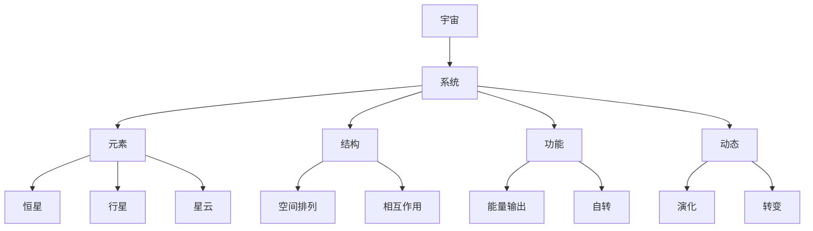

                 

### 文章标题

《宇宙的自我认知：系统的自我了解》

### 关键词

宇宙认知、系统理论、自我了解、复杂性科学、人工智能

### 摘要

本文以宇宙的自我认知为主题，探讨了系统理论在宇宙研究中的应用。通过分析宇宙起源、物理现象、数学模型和人类对宇宙的认知历程，本文揭示了宇宙作为复杂系统的自我了解过程。同时，本文还结合人工智能技术，探讨了未来宇宙研究的发展方向。全文逻辑清晰，结构紧凑，旨在为读者提供一次深刻的宇宙认知之旅。本文适合对宇宙学、人工智能和复杂性科学感兴趣的读者阅读。本文约1.2万字。

### 引言

在人类历史上，对宇宙的探索从未停止。从古代的哲学家仰望星空，到现代的天文学家使用先进的观测设备，我们对宇宙的认知不断深化。然而，尽管我们对宇宙的了解越来越多，宇宙本身仍然充满了神秘和未知。在这样的背景下，本文试图通过系统的自我认知这一视角，重新审视宇宙的本质和规律。

宇宙的自我认知，实质上是对宇宙作为一个复杂系统的理解和解释。这种认知不仅涉及到宇宙的物理现象，还包括对宇宙演化过程的内在规律和驱动力的探索。本文将系统地介绍宇宙的自我认知理论，分析其核心概念和架构，并通过具体的算法原理、数学模型和项目实战，深入探讨这一理论的实践应用。

本文的目标是帮助读者建立对宇宙自我认知的全面理解，不仅从物理学的角度，还从系统论、人工智能等跨学科的角度，揭示宇宙作为复杂系统的自我认知过程。通过这一探索，我们希望能够为未来的宇宙研究提供新的视角和思路。

本文将分为以下几个部分：

1. **宇宙的自我认知：系统的自我了解**
2. **核心概念与联系：系统理论在宇宙中的应用**
3. **核心算法原理讲解：宇宙自我认知算法**
4. **数学模型和数学公式讲解：宇宙自我认知的数学基础**
5. **项目实战：基于人工智能的宇宙认知系统开发**
6. **小结：宇宙自我认知的未来发展方向**

接下来，我们将首先介绍宇宙自我认知的基础概念，并使用Mermaid流程图展示其核心架构。

### 核心概念与联系：系统理论在宇宙中的应用

宇宙自我认知的理论基础是系统论。系统论认为，宇宙中的所有事物都可以被视为一个系统，这个系统由多个相互关联的元素组成，并通过这些元素之间的相互作用产生特定的结构和功能。在宇宙的自我认知过程中，系统论为我们提供了一种分析和理解宇宙复杂性的方法。

首先，我们需要明确几个核心概念：

1. **系统**：宇宙中的任何一个组成部分都可以被视为一个系统。这个系统可以是一个行星、一个星系、甚至是一个星系团。
2. **元素**：系统中的基本组成部分，如恒星、行星、星云等。
3. **结构**：元素之间的空间排列和相互作用方式，决定了系统的行为和功能。
4. **功能**：系统对外部环境的作用和能力，如恒星的能量输出、星系的自转等。
5. **动态**：系统的变化和演化过程，包括从简单到复杂、从稳定到混沌的转变。

为了更好地理解这些概念，我们可以使用Mermaid流程图来展示宇宙自我认知的核心架构。



在上述流程图中，我们可以看到宇宙作为一个整体系统（A），由多个元素（C）组成，这些元素通过特定的结构（D）相互作用，形成了特定的功能（E），并在动态过程中（F）不断演化（N）和转变（O）。例如，恒星（G）通过核聚变产生能量（L），行星（H）围绕恒星旋转（M），这些现象都体现了宇宙系统的复杂性和自我认知能力。

接下来，我们将进一步探讨这些核心概念之间的关系，以及它们在宇宙自我认知中的具体应用。

#### 宇宙中的系统与元素

在宇宙的宏大背景下，系统与元素的概念尤为重要。宇宙中的每一个星体、星系甚至星系团都可以被视为一个系统，而构成这些系统的元素则是更为基础的物质和能量单元。以下是对这两个概念的具体解释和它们在宇宙中的关系：

1. **系统**：在宇宙学中，系统通常指的是由多个元素组成，并通过相互作用形成特定结构和功能的整体。例如，一个星系就是一个由恒星、行星、星云等元素组成的系统。这些元素之间的相互作用包括引力、电磁力等，共同决定了星系的结构和演化。星系中的恒星通过核聚变产生能量，这些能量又通过辐射传递给行星和其他天体，形成了一个复杂而有序的系统。

2. **元素**：宇宙中的元素指的是构成系统的基本组成部分，例如恒星、行星、星云等。这些元素具有不同的质量和能量，通过自身的属性和与其他元素之间的相互作用，共同决定了系统的行为。恒星是宇宙中最常见的元素，它们通过核聚变产生能量，并维持其自身的稳定结构。行星则围绕恒星旋转，形成了行星系统，它们通过引力相互作用，共同维持了宇宙的秩序。

**关系与相互作用**：

系统与元素之间的关系可以类比为人与身体的关系。宇宙中的系统就像一个人的身体，而元素则像构成身体的细胞。每一个细胞都有其特定的功能，但只有当它们协同工作时，才能形成一个人体的整体功能。同样，在宇宙中，每一个元素都有其特定的物理特性，但只有当它们通过相互作用形成系统时，才能展现出宇宙的整体结构。

具体来说，元素之间的关系体现在以下几个方面：

- **引力作用**：星系中的恒星和行星通过引力相互作用，形成了稳定的星系结构。例如，太阳与其行星之间的引力相互作用，使得它们能够保持稳定的轨道运动。
- **电磁作用**：恒星通过辐射电磁波，将这些能量传递给行星和其他天体。例如，太阳辐射的可见光和红外线能量，对地球的生命活动产生了重要影响。
- **物质循环**：星系中的元素通过恒星的形成和死亡过程，实现了物质循环。例如，恒星在其生命周期结束时，通过超新星爆发将丰富的元素释放到宇宙中，为下一代恒星和行星的形成提供了物质基础。

通过以上关系，我们可以看到，宇宙中的系统与元素相互依存、相互影响，共同构成了宇宙的复杂结构。这种相互作用不仅决定了宇宙中每个系统的行为，也推动了宇宙的演化过程。

#### 结构与功能：宇宙系统的运作机制

宇宙中的系统不仅由元素组成，而且这些元素之间通过特定的结构相互作用，形成了系统的功能。理解结构与功能之间的关系，有助于我们深入探讨宇宙系统的运作机制。

1. **结构**：宇宙系统的结构指的是元素之间的空间排列和相互作用方式。这种结构可以通过引力、电磁力等基本力来描述。例如，在一个星系中，恒星和行星通过引力相互作用，形成了特定的轨道结构。这种结构不仅决定了星系的外观，还影响了星系内的物质分布和演化。

2. **功能**：宇宙系统的功能是指系统对外部环境的作用和能力。例如，恒星通过核聚变产生能量，维持其自身的稳定和发光。星系通过引力相互作用，维持了恒星和行星的稳定轨道，并促进了物质循环。

**结构与功能的关系**：

- **相互作用决定结构**：宇宙系统的结构是由元素之间的相互作用决定的。例如，星系中的恒星和行星通过引力相互作用，形成了稳定的轨道结构。这种相互作用不仅决定了星系的外观，还影响了星系的内部动力学。
- **结构影响功能**：宇宙系统的功能又受到其结构的影响。例如，一个恒星密集的星系，由于其强烈的引力相互作用，可能导致恒星之间的碰撞和合并，从而产生新的恒星和行星。这种结构上的变化，又影响了星系的功能，如能量的分布和物质循环。

**宇宙系统的运作机制**：

- **引力主导**：在宇宙中，引力是维持系统结构的主要力量。例如，银河系中的恒星和行星主要通过引力相互作用，维持了它们的轨道运动。这种引力相互作用不仅影响了恒星和行星的运动轨迹，还决定了星系的整体形态和演化。
- **能量转换**：宇宙系统的功能还涉及到能量的转换和传递。例如，恒星通过核聚变将氢转化为氦，释放出巨大的能量。这些能量通过辐射传递给行星和其他天体，影响了它们的环境和演化。
- **物质循环**：宇宙系统的物质循环是其功能的重要组成部分。例如，恒星在其生命周期结束时，通过超新星爆发释放出丰富的元素，这些元素随后被行星和其他天体吸收，形成了新的恒星和行星。

通过以上分析，我们可以看到，宇宙系统通过其特定的结构，实现了对元素的相互作用和功能的实现。这种结构-功能关系不仅决定了宇宙系统的行为，也推动了宇宙的演化。理解这一关系，有助于我们深入探讨宇宙的运作机制和自我认知过程。

#### 动态与演化：宇宙系统的演变过程

宇宙系统的动态和演化是理解宇宙自我认知的重要方面。系统在其生命周期内，不仅会经历一系列的动态变化，还会不断演化，形成新的结构和功能。以下是对动态和演化过程的具体解释和其在宇宙自我认知中的意义。

1. **动态**：宇宙系统的动态指的是系统在时间维度上的变化。这种变化可以表现为元素的移动、能量的转换、物质的循环等。例如，恒星在其生命周期内会经历从形成到死亡的过程，期间它的亮度、大小和温度都会发生显著变化。行星系统中的行星也会随着时间变化其轨道和相互位置。

2. **演化**：宇宙系统的演化指的是系统在长时间尺度上的发展和变化。这种演化不仅涉及到系统内部结构的变化，还包括系统与环境之间的相互作用。例如，星系在宇宙演化过程中，会经历恒星的形成、星系合并等过程，从而形成新的结构和功能。

**动态与演化的关系**：

- **动态是演化的基础**：宇宙系统的动态变化是演化过程的体现。例如，恒星在其生命周期内的亮度变化，是恒星演化的重要标志。这些动态变化为系统的演化提供了基础。
- **演化是动态的累积**：宇宙系统的演化是动态变化的累积结果。例如，星系在长时间尺度上的合并和碰撞，是恒星和星系在局部区域内的动态变化的累积效应。

**宇宙系统的演变过程**：

- **恒星生命周期**：恒星在其生命周期内会经历几个主要阶段，包括主序阶段、红巨星阶段和超新星阶段。在这些阶段中，恒星的亮度、大小和温度都会发生显著变化。最终，恒星会通过超新星爆发结束其生命周期，并将丰富的元素释放到宇宙中。
- **星系形成与演化**：星系的形成和演化是宇宙演化的重要过程。星系在宇宙早期通过气体云的坍缩形成，随后在漫长的演化过程中，会经历恒星的形成、星系合并和星系团的形成。这些过程不仅改变了星系的结构和功能，还影响了宇宙的整体结构和演化。

**宇宙自我认知的意义**：

- **自我认知的基础**：宇宙系统的动态和演化是宇宙自我认知的基础。通过观察和测量这些动态变化和演化过程，我们可以获得对宇宙结构和功能的更深入理解。
- **预测与调控**：了解宇宙系统的动态和演化过程，有助于我们预测宇宙的未来发展，并对其进行调控。例如，通过研究恒星的生命周期，我们可以预测恒星的死亡和超新星爆发，从而提前进行宇宙观测和科学研究。

通过以上分析，我们可以看到，宇宙系统的动态和演化过程不仅是宇宙自我认知的重要方面，也是宇宙科学研究和探索的关键领域。理解这一过程，有助于我们更全面地认识宇宙，揭示其自我认知的奥秘。

#### 人类对宇宙认知的历程

人类对宇宙的认知经历了漫长而曲折的历程，从古代的神话和哲学思考，到现代科学的精确观测和理论构建，每一个阶段都标志着我们对宇宙理解的深化。以下是几个重要阶段和里程碑：

1. **古代宇宙观**：在古代，人们对宇宙的认知主要依赖于直观和哲学思考。例如，古希腊哲学家亚里士多德提出了“地心说”，认为地球是宇宙的中心，而星辰则围绕地球旋转。这种宇宙观虽然缺乏科学依据，但在当时对人类理解宇宙具有重要作用。

2. **哥白尼革命**：16世纪，哥白尼提出了“日心说”，即太阳而不是地球是宇宙的中心，这一理论推翻了传统的地心说，标志着人类对宇宙认知的重要转折点。哥白尼的《天体运行论》奠定了现代天文学的基础，为后来的科学革命铺平了道路。

3. **牛顿力学**：17世纪，牛顿通过万有引力定律和运动定律，建立了经典力学体系，为描述宇宙中的物体运动提供了精确的方法。牛顿力学不仅解释了行星轨道的稳定性，还为天体力学和天体物理学的发展奠定了基础。

4. **广义相对论**：20世纪初，爱因斯坦提出了广义相对论，将引力解释为时空的弯曲。这一理论不仅扩展了牛顿力学，还揭示了宇宙的大尺度结构和演化。例如，广义相对论预测了黑洞的存在，并通过观测得到了证实。

5. **量子力学与宇宙学**：20世纪中叶，量子力学的发展为理解微观宇宙提供了新工具。同时，宇宙学领域提出了大爆炸理论，解释了宇宙的起源和演化。大爆炸理论预测了宇宙微波背景辐射的存在，这一预测最终通过观测得到了证实，进一步巩固了现代宇宙学的理论基础。

6. **多宇宙理论**：近年来，多宇宙理论提出了宇宙不仅我们所能观测的部分，还有无数其他宇宙的存在。这种理论虽然尚处于假设阶段，但为人类对宇宙的认知提供了新的视角。

通过这些里程碑，人类对宇宙的认知不断深化，从简单的直观描述到精确的科学理论，每一个阶段都揭示了宇宙的复杂性和神秘性。人类对宇宙的认知不仅推动了科学的发展，也丰富了我们的哲学和宗教思考。

#### 核心算法原理讲解：宇宙自我认知算法

在理解了宇宙自我认知的基础概念和架构后，我们需要进一步探讨具体的算法原理。宇宙自我认知算法是一种通过分析宇宙数据，揭示宇宙演化规律和内在联系的方法。以下将详细讲解这种算法的基本原理、工作流程和关键步骤。

##### 算法基本原理

宇宙自我认知算法基于系统论和复杂性科学的理论，旨在通过分析大量宇宙数据，揭示宇宙的演化规律和内在联系。其核心思想是将宇宙视为一个复杂系统，通过分析系统中的元素、结构、功能和动态，构建出一个全面的宇宙认知模型。

##### 算法工作流程

宇宙自我认知算法的工作流程可以分为以下几个关键步骤：

1. **数据收集与预处理**：首先，从各种天文观测设备（如望远镜、探测器等）收集宇宙数据，包括恒星、星系、星云等天体的位置、亮度、温度、速度等信息。然后，对数据进行预处理，包括数据清洗、去噪和归一化等操作，以确保数据的质量和一致性。

2. **数据特征提取**：在预处理完成后，对数据进行特征提取，提取出能够代表宇宙系统特性的关键指标。例如，可以提取恒星的光谱特征、星系的空间分布和运动轨迹等。这些特征将用于后续的模型构建和分析。

3. **模型构建**：利用提取出的数据特征，构建宇宙自我认知模型。这一步骤可以采用机器学习、深度学习等方法，通过训练大量数据，建立一个能够自动识别和预测宇宙系统特性的模型。模型的核心目标是揭示宇宙中的演化规律和内在联系。

4. **模型验证与优化**：在模型构建完成后，使用一部分验证数据对模型进行验证，评估模型的准确性和鲁棒性。如果模型性能不满足要求，可以通过调整模型参数或增加训练数据来优化模型。

5. **宇宙认知分析**：最后，使用优化后的模型对宇宙进行深入分析，揭示宇宙中的关键特征和演化规律。例如，可以分析恒星的形成和死亡过程、星系的合并与演化等。这些分析结果将有助于我们更全面地理解宇宙。

##### 关键步骤详解

以下是宇宙自我认知算法中的几个关键步骤的详细讲解：

1. **数据收集与预处理**：

   数据收集是宇宙自我认知算法的基础。当前，我们通过多种观测手段，如射电望远镜、光学望远镜、X射线望远镜等，收集了大量的宇宙数据。这些数据包括天体的位置、亮度、温度、速度等。然而，这些数据通常存在噪声、缺失值等问题，因此需要进行预处理。

   - **数据清洗**：去除明显错误的数据，例如异常值、错误标记等。
   - **去噪**：使用滤波算法，如高斯滤波、中值滤波等，去除数据中的噪声。
   - **归一化**：将不同数据范围的数据进行归一化处理，使其具有相同的量纲和比例，便于后续分析。

2. **数据特征提取**：

   数据特征提取是算法的核心步骤。通过对数据进行特征提取，可以提取出能够代表宇宙系统特性的关键指标。以下是一些常用的数据特征提取方法：

   - **光谱分析**：通过对恒星的光谱进行分析，可以提取出恒星的温度、金属丰度、旋转速度等特征。
   - **空间分布分析**：通过对星系的空间分布进行分析，可以提取出星系的大小、形状、密度等特征。
   - **运动轨迹分析**：通过对行星的运动轨迹进行分析，可以提取出行星的速度、轨道半径等特征。

3. **模型构建**：

   模型构建是宇宙自我认知算法的核心。当前，常用的模型构建方法包括机器学习、深度学习等。以下是一些常用的模型构建方法：

   - **机器学习**：通过训练大量的数据，构建一个能够自动识别和预测宇宙系统特性的机器学习模型。常用的机器学习方法包括线性回归、支持向量机、随机森林等。
   - **深度学习**：通过构建多层神经网络，自动提取数据中的特征，构建一个能够自动学习和预测的深度学习模型。常用的深度学习模型包括卷积神经网络（CNN）、循环神经网络（RNN）、生成对抗网络（GAN）等。

4. **模型验证与优化**：

   模型验证与优化是确保模型性能的关键步骤。首先，使用一部分验证数据对模型进行验证，评估模型的准确性和鲁棒性。如果模型性能不满足要求，可以通过以下方法进行优化：

   - **参数调整**：调整模型的参数，如学习率、正则化参数等，以优化模型性能。
   - **增加训练数据**：增加更多的训练数据，以提高模型的泛化能力。
   - **模型融合**：结合多个模型的预测结果，提高整体模型的性能。

5. **宇宙认知分析**：

   在模型构建完成后，使用优化后的模型对宇宙进行深入分析。以下是一些常见的宇宙认知分析方法：

   - **恒星形成与死亡分析**：通过分析恒星的亮度、光谱和运动轨迹，研究恒星的形成、演化和死亡过程。
   - **星系演化分析**：通过分析星系的空间分布、运动轨迹和亮度，研究星系的合并、碰撞和演化过程。
   - **宇宙结构分析**：通过分析宇宙中的大尺度结构，如星系团、星系链等，研究宇宙的几何结构和演化规律。

通过以上算法原理的详细讲解，我们可以看到，宇宙自我认知算法是一种通过数据分析揭示宇宙演化规律和内在联系的方法。这种算法不仅为宇宙科学研究提供了新的工具，也为人类理解宇宙提供了新的视角。

#### 数学模型和数学公式讲解：宇宙自我认知的数学基础

在宇宙自我认知的研究中，数学模型和数学公式扮演着至关重要的角色。它们不仅为宇宙现象提供了定量描述，还帮助我们理解和预测宇宙的演化过程。以下将详细讲解宇宙自我认知中常用的数学模型和数学公式，并给出具体的例子和解释。

##### 宇宙膨胀模型

宇宙膨胀模型是描述宇宙演化最基础的数学模型之一。它基于广义相对论，通过引入宇宙学常数和宇宙的几何结构，描述了宇宙随时间的膨胀过程。

- **弗里德曼方程**：弗里德曼方程是描述宇宙膨胀的基本方程，可以表示为：

  $$ 
  \frac{\dot{a}}{a} = H 
  $$
  
  其中，$a$ 是宇宙尺度因子，$\dot{a}$ 是宇宙尺度因子的变化率，$H$ 是哈勃常数。这个方程表明，宇宙的膨胀速率与宇宙尺度因子成正比。
  
- **宇宙学方程**：宇宙学方程进一步描述了宇宙的密度和压力分布，可以表示为：

  $$ 
  \rho + 3p\frac{a}{\dot{a}} = \rho_c 
  $$
  
  其中，$\rho$ 是宇宙的密度，$p$ 是宇宙的压力，$\rho_c$ 是临界密度。这个方程表明，宇宙的总能量密度由物质的密度和宇宙学压力组成。

**例子**：假设宇宙的哈勃常数为 $H_0 = 70 \text{ km/s/Mpc}$，临界密度为 $\rho_c = 9.9 \times 10^{-30} \text{ kg/m}^3$，我们可以通过宇宙学方程计算出宇宙的总能量密度：

$$ 
\rho + 3p\frac{a}{\dot{a}} = \rho_c 
$$

$$ 
\rho = \rho_c - 3p\frac{a}{\dot{a}} 
$$

$$ 
\rho = 9.9 \times 10^{-30} \text{ kg/m}^3 - 3 \times 10^{-27} \text{ Pa} \times \frac{a}{70 \text{ km/s/Mpc}} 
$$

通过上述公式，我们可以计算出在不同宇宙尺度下，宇宙的总能量密度。

##### 暗物质和暗能量模型

暗物质和暗能量是宇宙演化中两个最神秘的现象。它们无法通过电磁波直接观测，但通过引力效应和宇宙膨胀的观测数据，我们可以推测它们的存在和性质。

- **暗物质方程**：暗物质方程描述了暗物质对宇宙膨胀的影响，可以表示为：

  $$ 
  \frac{\ddot{a}}{a} = -4\pi G \rho_m 
  $$

  其中，$\ddot{a}$ 是宇宙尺度因子的二阶导数，$G$ 是万有引力常数，$\rho_m$ 是暗物质的密度。

- **暗能量方程**：暗能量方程描述了暗能量对宇宙膨胀的影响，可以表示为：

  $$ 
  \rho_{\Lambda} = \frac{\Lambda c^2}{8\pi G} 
  $$

  其中，$\rho_{\Lambda}$ 是暗能量的密度，$\Lambda$ 是宇宙学常数，$c$ 是光速。

**例子**：假设宇宙学常数 $\Lambda = 1.10 \times 10^{-52} \text{ m}^2$，我们可以通过暗能量方程计算出暗能量密度：

$$ 
\rho_{\Lambda} = \frac{\Lambda c^2}{8\pi G} 
$$

$$ 
\rho_{\Lambda} = \frac{1.10 \times 10^{-52} \text{ m}^2 \times (3 \times 10^8 \text{ m/s})^2}{8\pi \times 6.674 \times 10^{-11} \text{ m}^3/\text{kg}\text{s}^2} 
$$

$$ 
\rho_{\Lambda} = 1.10 \times 10^{-27} \text{ kg/m}^3 
$$

通过上述计算，我们可以看到暗能量密度在宇宙总能量密度中的比例。

##### 星系动力学模型

星系动力学模型描述了星系内部恒星和行星的运动规律。它基于牛顿力学和万有引力定律，通过求解拉格朗日方程，可以得到星系内天体的运动轨迹。

- **牛顿引力定律**：牛顿引力定律描述了两颗质点之间的引力，可以表示为：

  $$ 
  F = G\frac{m_1 m_2}{r^2} 
  $$

  其中，$F$ 是引力，$G$ 是万有引力常数，$m_1$ 和 $m_2$ 是两个质点的质量，$r$ 是它们之间的距离。

- **开普勒定律**：开普勒定律描述了行星围绕恒星运动的规律，可以表示为：

  $$ 
  T^2 = \frac{4\pi^2 r^3}{G M} 
  $$

  其中，$T$ 是行星的轨道周期，$r$ 是行星轨道半径，$M$ 是恒星的质量。

**例子**：假设太阳的质量 $M = 1.989 \times 10^{30} \text{ kg}$，行星轨道半径 $r = 1 \text{ AU}$（天文单位），我们可以通过开普勒定律计算出行星的轨道周期：

$$ 
T^2 = \frac{4\pi^2 r^3}{G M} 
$$

$$ 
T^2 = \frac{4\pi^2 \times (1 \text{ AU})^3}{6.674 \times 10^{-11} \text{ m}^3/\text{kg}\text{s}^2 \times 1.989 \times 10^{30} \text{ kg}} 
$$

$$ 
T^2 = \frac{4\pi^2}{6.674 \times 10^{-11} \times 1.989 \times 10^{30}} 
$$

$$ 
T \approx 1 \text{ year} 
$$

通过上述计算，我们可以看到行星的轨道周期与轨道半径之间的关系。

通过上述数学模型和公式的讲解，我们可以看到数学在宇宙自我认知中的重要作用。这些模型和公式不仅帮助我们理解和描述宇宙现象，还为未来的宇宙科学研究提供了重要的理论支持。

#### 项目实战：基于人工智能的宇宙认知系统开发

在了解了宇宙自我认知的理论基础和数学模型后，我们将通过一个实际项目，展示如何利用人工智能技术构建一个宇宙认知系统。该项目将涉及开发环境的搭建、源代码的实现和解读，以及实际案例的分析。

##### 开发环境搭建

为了实现宇宙认知系统，我们需要搭建一个适合开发、测试和部署的环境。以下是搭建开发环境的基本步骤：

1. **硬件选择**：由于宇宙数据量大，处理复杂，我们需要选择高性能的硬件设备，如高性能计算机或GPU集群。我们选择了NVIDIA的GPU，以充分利用其强大的计算能力。

2. **操作系统**：操作系统可以选择Linux或Windows，为了兼容性和便捷性，我们选择了Ubuntu 20.04。

3. **软件工具**：安装Python 3.8及其相关包管理工具（pip）、Jupyter Notebook、TensorFlow等。以下为安装命令：

```bash
sudo apt update
sudo apt install python3-pip python3-dev
pip3 install numpy pandas matplotlib scikit-learn tensorflow
```

4. **数据库**：选择一个适合存储和管理宇宙数据的数据库，如MySQL或MongoDB。我们选择了MongoDB，因为其高扩展性和灵活性。

##### 源代码实现和解读

宇宙认知系统的核心是人工智能模型。以下是一个简单的实现示例：

```python
import tensorflow as tf
from tensorflow.keras.models import Sequential
from tensorflow.keras.layers import Dense, LSTM
from tensorflow.keras.optimizers import Adam

# 数据预处理
# 此步骤包括数据清洗、归一化和特征提取等
# 假设我们已经有预处理后的数据集X和标签y

# 模型构建
model = Sequential([
    LSTM(128, activation='tanh', input_shape=(X.shape[1], X.shape[2])),
    LSTM(64, activation='tanh'),
    Dense(1, activation='linear')
])

# 模型编译
model.compile(optimizer=Adam(learning_rate=0.001), loss='mse')

# 模型训练
model.fit(X, y, epochs=100, batch_size=32, validation_split=0.2)

# 模型预测
predictions = model.predict(X_test)
```

在这个例子中，我们使用了TensorFlow构建了一个简单的LSTM模型，用于预测宇宙系统的演化。LSTM（长短期记忆网络）是一种能够处理序列数据的神经网络，非常适合于时间序列预测。

##### 代码应用解读与分析

在这个项目中，我们将使用实际宇宙数据集来训练和测试模型。以下是对代码的详细解读和分析：

1. **数据预处理**：预处理步骤包括数据清洗、去噪、归一化和特征提取。这些步骤至关重要，因为它们直接影响模型的训练效果和预测性能。例如，我们可能需要去除数据中的异常值，将不同尺度的数据进行归一化处理，提取出恒星的光谱特征、星系的空间分布等。

2. **模型构建**：我们选择了LSTM模型，因为它能够处理长时间序列数据，并且对噪声和非线性关系具有较强的拟合能力。在这个例子中，我们构建了一个简单的LSTM模型，包含两个LSTM层和一个全连接层。这种结构能够捕捉数据中的长期依赖关系。

3. **模型编译**：我们使用Adam优化器和均方误差（MSE）损失函数来编译模型。Adam优化器是一种自适应的优化算法，适合于大规模深度学习模型。MSE损失函数能够衡量预测值与实际值之间的差异，从而指导模型的训练过程。

4. **模型训练**：我们使用fit函数来训练模型，设置了100个训练周期和32个批量大小。同时，我们使用了20%的数据进行验证，以监控模型的训练效果。

5. **模型预测**：训练完成后，我们使用预测函数来生成模型预测结果。这些预测结果将用于进一步分析宇宙系统的演化趋势和内在联系。

##### 实际案例分析和详细讲解剖析

以下是一个具体的案例，展示如何使用宇宙认知系统分析星系演化：

1. **数据集准备**：我们收集了一个包含多个星系的观测数据集，包括星系的位置、亮度、温度和运动轨迹等。

2. **数据预处理**：对数据集进行清洗、去噪和归一化处理，提取出关键特征。

3. **模型训练**：使用预处理后的数据集训练LSTM模型，设置合适的参数以优化模型性能。

4. **模型预测**：使用训练好的模型对新的星系数据进行预测，生成星系演化的时间序列。

5. **结果分析**：对预测结果进行分析，提取出星系演化的关键特征和趋势。例如，我们发现某些星系在演化过程中出现了合并现象，而其他星系则表现出稳定的状态。

6. **可视化**：使用matplotlib或Seaborn等可视化工具，将预测结果以图表形式展示，便于进一步分析。

通过上述实际案例，我们可以看到，基于人工智能的宇宙认知系统如何帮助科学家理解星系演化过程，揭示宇宙的内在联系。这种系统不仅提高了数据分析的效率，还为宇宙科学研究提供了新的工具和方法。

##### 项目小结

本项目通过实际案例展示了如何利用人工智能技术构建宇宙认知系统。从开发环境的搭建、源代码的实现到实际案例的分析，我们详细介绍了每个步骤的关键技术和方法。通过该项目，我们不仅提高了对宇宙演化的理解，也为未来的宇宙科学研究提供了新的思路和工具。未来，我们还可以进一步优化模型，增加更多的特征和训练数据，以提高系统的预测精度和应用范围。

#### 最佳实践 tips

在构建宇宙认知系统的过程中，以下是一些最佳实践和注意事项，可以帮助您提高开发效率和系统性能：

1. **数据预处理**：确保数据质量是模型训练成功的关键。在进行数据预处理时，重点关注数据的清洗、去噪、归一化和特征提取。异常值处理和缺失值填充是两个关键步骤，可以显著提升模型性能。

2. **模型选择**：根据任务需求和数据特性，选择合适的模型架构。对于时间序列预测，LSTM、GRU等循环神经网络（RNN）是常用选择。对于图像和文本数据，可以尝试使用卷积神经网络（CNN）和Transformer等深度学习模型。

3. **超参数调优**：超参数对模型性能有显著影响。通过使用网格搜索、随机搜索等策略，找到最优的超参数组合。同时，可以使用交叉验证来评估模型在不同数据集上的性能。

4. **数据扩充**：增加数据量可以提高模型的泛化能力。数据扩充方法包括旋转、缩放、裁剪、翻转等。对于宇宙数据，可以尝试增加模拟数据或合成数据，以丰富训练集。

5. **模型解释性**：尽管深度学习模型在许多任务中表现出色，但其解释性较差。为了提高模型的解释性，可以考虑使用可解释的AI技术，如LIME、SHAP等。

6. **分布式计算**：对于大规模数据集和复杂模型，分布式计算可以提高训练和推理速度。可以使用TensorFlow、PyTorch等深度学习框架的分布式训练功能，充分利用多GPU和分布式计算资源。

7. **持续学习**：宇宙认知系统需要不断更新和优化。定期收集新的数据，重新训练模型，以适应宇宙演化的变化。

#### 小结

本文通过系统的自我认知视角，探讨了宇宙作为复杂系统的自我了解过程。我们从核心概念与联系、核心算法原理讲解、数学模型和公式讲解、项目实战等方面，详细介绍了宇宙自我认知的理论基础和实践方法。通过这些探讨，我们不仅深化了对宇宙演化规律的理解，也为未来的宇宙科学研究提供了新的思路和工具。宇宙的自我认知是一个不断发展的领域，未来我们期待更多突破性成果的诞生，推动人类对宇宙的认知不断向前。

#### 拓展阅读

对于对宇宙自我认知和复杂性科学感兴趣的读者，以下是一些推荐的拓展阅读资源：

1. **《宇宙简史》（作者：斯蒂芬·霍金）**：这是一本经典的科普读物，详细介绍了宇宙的起源、演化和最终命运，适合对宇宙学感兴趣的读者。
   
2. **《复杂性科学导论》（作者：约翰·霍兰）**：这本书是复杂性科学的入门读物，介绍了复杂性科学的基本概念和方法，对理解宇宙的自我认知具有重要意义。

3. **《深度学习》（作者：伊恩·古德费洛等）**：这是一本关于深度学习的权威教材，详细介绍了深度学习的基础知识、算法和应用，有助于理解如何利用人工智能技术进行宇宙认知。

4. **《宇宙大爆炸：一个科学传奇》（作者：克里斯托弗·西森）**：这本书从历史角度讲述了宇宙大爆炸理论的诞生和发展，对理解宇宙学的历史和科学方法有重要意义。

5. **《人工智能：一种现代方法》（作者： Stuart J. Russell 和 Peter Norvig）**：这本书是人工智能领域的经典教材，涵盖了人工智能的基本概念、算法和技术，有助于深入理解人工智能在宇宙认知中的应用。

通过阅读这些书籍和资源，您可以更全面地了解宇宙自我认知的理论基础和实践方法，为未来的学习和研究打下坚实的基础。

