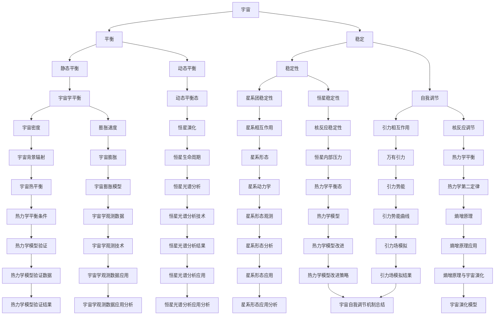
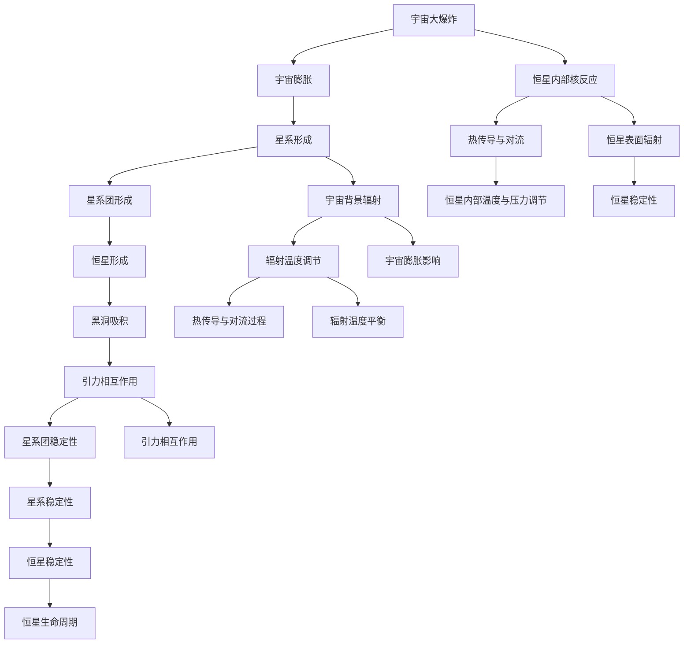

                 

### 引入与定义

宇宙，作为人类已知的最宏大、最神秘的系统，其内部的运行机制自古以来就吸引了无数科学家和哲学家。在这浩瀚的宇宙中，存在着一系列复杂的物理过程，这些过程共同维持着宇宙的平衡与稳定。本文将深入探讨宇宙的自我调节机制，揭示其背后的内在原理与实现方法。

首先，我们需要明确几个核心概念：

- **宇宙**：广义上，宇宙指的是包含一切物质、能量、时空以及宇宙间的所有现象的整体。狭义上，宇宙指的是大爆炸之后膨胀形成的宇宙结构，包括星系、星云、黑洞等。

- **平衡**：平衡是指在某个系统中，各个组成部分之间的相互作用达到了一种稳定状态，这种状态可以是静态的，也可以是动态的。在宇宙学中，平衡通常指宇宙整体上不发生显著的膨胀或收缩。

- **稳定**：稳定性是指系统在受到外部扰动后，能够恢复到原有状态或保持某种稳定状态的能力。在宇宙中，稳定性涉及到多种物理现象，如星系团的稳定性、恒星内部的核反应稳定性等。

宇宙的自我调节机制，简单来说，就是宇宙通过一系列的物理、化学过程，自动调节自身状态，维持平衡与稳定的能力。这种调节机制不仅涉及宇宙整体，也体现在宇宙的各个组成部分中。理解这一机制，对于揭示宇宙的本质、探索宇宙的未来具有重要意义。

接下来的章节中，我们将一步步深入探讨宇宙自我调节的核心原理，首先介绍宇宙的平衡与稳定性概念，然后详细讲解宇宙自我调节的内在机制，并通过具体的实例和数学模型来加深我们的理解。最后，我们将探讨宇宙自我调节机制的实证研究和面临的挑战，以及未来的发展方向。希望读者在阅读完本文后，能够对宇宙的自我调节有更加全面和深刻的认识。### 核心概念与联系

在深入探讨宇宙的自我调节机制之前，我们需要明确几个核心概念，并理解它们之间的联系。这些核心概念包括宇宙、平衡、稳定、自我调节等，它们共同构成了宇宙运行的基本框架。

首先，我们来看**宇宙**。宇宙是包含一切物质、能量、时空以及宇宙间所有现象的整体。它不仅仅是一个物理空间，更是一个复杂的系统，其中各种物质和能量相互作用，共同维持着宇宙的动态平衡。宇宙的历史可以追溯到大约138亿年前的大爆炸，从那时起，宇宙就一直在不断膨胀和演化。

接下来是**平衡**。在宇宙中，平衡指的是宇宙整体上不发生显著的膨胀或收缩，各个组成部分之间相互作用的稳定状态。平衡可以分为静态平衡和动态平衡。静态平衡是指系统在某个特定时刻处于稳定状态，而动态平衡则是指系统在时间上保持稳定的状态。宇宙的静态平衡通常通过宇宙学参数来描述，如宇宙的密度、膨胀速度等。

**稳定**则是指系统在受到外部扰动后，能够恢复到原有状态或保持某种稳定状态的能力。宇宙的稳定性涉及到多个层次，包括星系团、恒星、行星等。例如，星系团中的恒星和星云通过引力相互作用，维持着整体的稳定性。而恒星内部的核反应也必须保持稳定，以确保恒星不会突然爆发。

**自我调节**是宇宙维持平衡与稳定的重要机制。它指的是宇宙通过一系列的物理、化学过程，自动调节自身状态，以维持平衡与稳定。自我调节机制可以体现在多个层面，包括宇宙的整体调节、星系之间的相互作用、恒星内部的核反应等。

这些核心概念之间的联系在于，它们共同构成了宇宙运行的基本框架。宇宙通过自我调节机制，保持平衡与稳定。而平衡与稳定则是宇宙自我调节的基础。例如，宇宙中的物质和能量通过引力相互作用，维持着整体的平衡。同时，恒星内部的核反应也通过自我调节机制，维持着稳定的能量输出。

为了更直观地理解这些概念之间的关系，我们可以使用Mermaid流程图来展示宇宙自我调节机制的整体流程和关键节点。以下是一个简化的Mermaid流程图示例：



通过这个流程图，我们可以清晰地看到宇宙自我调节机制的整体结构和关键节点。从宇宙的静态平衡和动态平衡，到星系团和恒星内部的稳定性，再到恒星和星系之间的相互作用，最终形成了宇宙的自我调节机制。这种机制不仅维护了宇宙的整体稳定性，也为宇宙的持续演化提供了动力。

理解这些核心概念和它们之间的联系，是进一步探讨宇宙自我调节机制的基础。在接下来的章节中，我们将详细讲解宇宙自我调节的内在机制，并通过具体的实例和数学模型来加深我们的理解。### 宇宙自我调节的内在机制

宇宙的自我调节机制是一个复杂的动态过程，涉及到多种物理和化学过程。为了更好地理解这一机制，我们需要探讨宇宙自我调节中的两个关键要素：正反馈和负反馈，以及这些机制在宇宙中的具体表现形式。

首先，**正反馈**和**负反馈**是控制理论中的两个基本概念。在宇宙自我调节机制中，这两种反馈机制起到了至关重要的作用。

**正反馈**是指一个系统在某一特定条件下，其行为会进一步增强这种条件。例如，在一个星系形成的过程中，当一个恒星形成后，它会通过引力吸引周围的物质，形成更多的恒星和星系结构。这种反馈机制会导致星系团的规模不断扩大，从而在某种程度上加剧了宇宙的不稳定性。

**负反馈**则是指系统内部的一种调节机制，通过抵消外部扰动来维持系统的稳定。例如，在恒星内部，核聚变反应产生的能量会通过热传导和对流过程传递到恒星表面，保持恒星内部的温度和压力稳定。这种负反馈机制有助于维持恒星内部的稳定性，防止恒星过热或过冷。

在宇宙自我调节机制中，正反馈和负反馈共同作用，维持了宇宙的动态平衡与稳定。

**正反馈在宇宙中的表现形式**：

1. **星系团形成**：当一个恒星形成后，通过引力吸引周围的气体和尘埃，形成更多的恒星和星系结构。这种正反馈机制在宇宙中广泛存在，导致星系团和星系链的形成。

2. **宇宙膨胀**：根据宇宙大爆炸理论，宇宙在初始时刻是一个极高温度和高密度的状态，随后开始膨胀。在膨胀过程中，宇宙中的物质通过引力相互作用，不断形成新的星系和星团。这种宇宙膨胀的正反馈机制，导致宇宙的规模不断扩大。

3. **黑洞吸积**：黑洞通过吸积周围的物质，增加其质量和引力。这种正反馈过程不仅维持了黑洞的稳定性，还可能形成新的星系结构。

**负反馈在宇宙中的表现形式**：

1. **恒星内部核反应调节**：恒星内部的核聚变反应产生的能量，通过热传导和对流过程传递到恒星表面，维持恒星内部的温度和压力稳定。这种负反馈机制有助于维持恒星的稳定性，防止恒星过热或过冷。

2. **星系团稳定性**：星系团中的星系通过引力相互作用，维持着整体的稳定性。当某个星系受到外部扰动时，其他星系会通过引力相互作用抵消这种扰动，保持星系团的稳定。

3. **宇宙背景辐射的温度调节**：宇宙背景辐射的温度受到宇宙膨胀的影响。当宇宙膨胀时，辐射的温度会降低。为了维持辐射的温度稳定，宇宙中的物质通过热传导和对流过程，将热量传递到辐射中，保持温度的平衡。

为了更直观地理解宇宙自我调节机制中的正反馈和负反馈，我们可以使用Mermaid流程图来展示这些过程：



通过这个流程图，我们可以清晰地看到宇宙自我调节机制中的正反馈和负反馈是如何共同作用，维持宇宙的动态平衡与稳定的。从宇宙大爆炸到宇宙膨胀，再到星系形成和恒星形成，正反馈机制推动了宇宙的演化。同时，恒星内部核反应的调节、星系团和宇宙背景辐射的温度调节等负反馈机制，确保了宇宙的稳定运行。

总之，宇宙的自我调节机制是一个复杂而精妙的系统，通过正反馈和负反馈的相互作用，维持了宇宙的动态平衡与稳定。理解这些机制，对于揭示宇宙的本质和探索宇宙的未来具有重要意义。在接下来的章节中，我们将进一步探讨宇宙自我调节的数学模型和算法原理，以及通过具体实例来加深我们的理解。### 核心算法原理讲解

在理解了宇宙自我调节机制的核心概念和内在机制之后，我们需要进一步探讨这些机制背后的算法原理。宇宙的自我调节依赖于一系列复杂的计算过程，包括平衡算法、稳定性算法等。在本节中，我们将使用伪代码来详细阐述这些核心算法的原理，并探讨如何通过算法实现宇宙的自我调节。

#### 1. 平衡算法原理

平衡算法的核心目标是找到系统中的平衡状态，即各个组成部分之间的相互作用达到了稳定状态。以下是一个简化的平衡算法的伪代码：

```python
def find_balance(state):
    # 初始化平衡状态
    equilibrium = state

    # 循环迭代，直到找到平衡状态
    while not is_balanced(equilibrium):
        # 更新状态，尝试找到新的平衡点
        new_state = update_state(equilibrium)

        # 检查新状态是否更接近平衡
        if is_closer_to_balance(new_state, equilibrium):
            equilibrium = new_state
        else:
            # 如果未找到更接近平衡的状态，停止迭代
            break

    return equilibrium

def is_balanced(state):
    # 检查系统是否达到平衡状态
    # 这可以根据具体的系统定义
    # 比如检查能量、温度等是否满足平衡条件
    return True

def update_state(state):
    # 更新系统状态
    # 这通常涉及到物理或化学过程的计算
    # 比如根据引力相互作用更新星系的位置
    return new_state

def is_closer_to_balance(new_state, current_state):
    # 检查新状态是否更接近平衡
    # 这可以通过计算系统状态与平衡状态的差异来判断
    return abs(new_state - current_state) < threshold
```

这个平衡算法的基本思路是通过迭代更新系统状态，尝试找到平衡状态。在每一次迭代中，算法会检查当前状态是否更接近平衡状态，并更新状态以接近平衡点。这个过程可以通过调整阈值和迭代次数来优化，以确保找到最稳定的平衡状态。

#### 2. 稳定性算法原理

稳定性算法的核心目标是判断系统在受到外部扰动后，能否恢复到原有状态或保持稳定状态。以下是一个简化的稳定性算法的伪代码：

```python
def check_stability(state, perturbation):
    # 初始化稳定性状态
    stable = True

    # 对系统施加扰动
    perturbed_state = apply_perturbation(state, perturbation)

    # 检查扰动后的系统是否恢复到平衡状态
    while not is_balanced(perturbed_state):
        # 更新系统状态，尝试恢复平衡
        perturbed_state = update_state(perturbed_state)

        # 如果无法恢复平衡，则系统不稳定
        if not is_balanced(perturbed_state):
            stable = False
            break

    return stable

def apply_perturbation(state, perturbation):
    # 施加扰动
    # 比如改变星系的位置或能量
    return new_state

def is_balanced(state):
    # 检查系统是否达到平衡状态
    return True
```

这个稳定性算法的基本思路是通过对系统施加扰动，并检查系统是否能够恢复到平衡状态来判断稳定性。如果系统能够在扰动后恢复到平衡状态，则认为系统是稳定的。

#### 3. 结合平衡与稳定性算法

为了实现宇宙的自我调节，我们可以将平衡算法和稳定性算法结合起来。以下是一个简化的自我调节算法的伪代码：

```python
def self_regulate(state):
    # 检查系统是否稳定
    if not check_stability(state, perturbation):
        # 如果不稳定，尝试找到新的平衡状态
        state = find_balance(state)
    
    # 检查系统是否达到最终平衡
    if not is_balanced(state):
        # 如果未达到最终平衡，继续迭代调节
        state = self_regulate(state)
    
    return state
```

这个自我调节算法的基本思路是，如果系统不稳定，则通过平衡算法尝试找到新的平衡状态。如果找到平衡状态后，系统仍然不稳定，则继续迭代调节，直到系统达到稳定状态。

通过这些伪代码，我们可以看到宇宙自我调节的核心算法原理。这些算法的实现需要深入的物理和数学知识，但在理论上，它们为我们提供了一种理解和模拟宇宙自我调节机制的方法。

在接下来的章节中，我们将进一步探讨宇宙自我调节的数学模型和数学公式，并通过具体实例来加深我们的理解。这些数学模型和公式将帮助我们更精确地描述宇宙的自我调节过程，并为未来的科学研究提供基础。### 数学模型和数学公式讲解

在理解了宇宙自我调节的核心算法原理之后，我们需要借助数学模型和公式来更精确地描述这些过程。数学模型能够量化宇宙中的物理现象，帮助我们更好地理解宇宙的自我调节机制。

#### 1. 势能平衡模型

在宇宙中，势能平衡是维持系统稳定性的重要因素。一个经典的例子是地球大气层的平衡。在地球表面，大气层的重力势能与高度成反比，可以表示为：

\[ U(x) = -\frac{kx^2}{2} \]

其中，\( U(x) \) 是势能，\( k \) 是一个常数，\( x \) 是高度。这个模型表明，大气层中的气体分子由于重力作用，会在地球表面附近形成一个稳定的分布。

#### 2. 热力学平衡模型

热力学平衡是宇宙中另一个重要的平衡状态。根据热力学第二定律，熵（系统无序度）总是趋向于增加。在热力学平衡状态下，系统的熵达到最大值，可以表示为：

\[ dS \geq 0 \]

这意味着系统在任何微小变化下，其熵都不会减少。在宇宙背景辐射中，热力学平衡可以通过以下公式来描述：

\[ T \propto \frac{1}{\sqrt{\rho}} \]

其中，\( T \) 是温度，\( \rho \) 是密度。这个公式表明，在宇宙背景辐射中，温度与密度成反比，以维持热力学平衡。

#### 3. 宇宙学平衡模型

在宇宙学中，宇宙的平衡状态通常通过宇宙学参数来描述。其中一个关键参数是宇宙的密度参数 \( \Omega \)，它可以表示为：

\[ \Omega = \frac{\rho}{\rho_c} \]

其中，\( \rho \) 是宇宙的总密度，\( \rho_c \) 是临界密度。在宇宙学平衡状态下，宇宙的总密度必须满足以下条件：

\[ \Omega = 1 \]

这意味着宇宙的总密度与临界密度相等，从而维持宇宙的整体平衡。

#### 4. 举例说明

**例1：地球大气层的平衡**

地球大气层的平衡可以通过以下公式来描述：

\[ \frac{dp}{dh} = -\frac{g}{R} \]

其中，\( p \) 是大气压，\( g \) 是重力加速度，\( R \) 是地球半径。这个公式表明，大气压随着高度的增加而减小，从而维持大气层的平衡。

**例2：宇宙背景辐射的热力学平衡**

宇宙背景辐射的温度与密度之间的关系可以通过以下公式来描述：

\[ T \propto \frac{1}{\sqrt{\rho}} \]

这个公式表明，在宇宙背景辐射中，温度与密度成反比，以维持热力学平衡。

#### 5. Mermaid流程图

为了更直观地展示宇宙自我调节的数学模型，我们可以使用Mermaid流程图来描述这些模型和公式之间的关系：

```mermaid
graph TD
    A[势能平衡] --> B[公式：\( U(x) = -\frac{kx^2}{2} \)]
    C[热力学平衡] --> D[公式：\( dS \geq 0 \)]
    E[宇宙学平衡] --> F[公式：\( \Omega = 1 \)]
    G[地球大气层平衡] --> H[公式：\( \frac{dp}{dh} = -\frac{g}{R} \)]
    I[宇宙背景辐射平衡] --> J[公式：\( T \propto \frac{1}{\sqrt{\rho}} \)]
    K[宇宙自我调节] --> L[模型整合]
    B --> L
    D --> L
    F --> L
    H --> L
    J --> L
```

通过这个流程图，我们可以清晰地看到宇宙自我调节涉及的数学模型和公式，以及它们之间的相互关系。

总之，通过数学模型和公式，我们可以更精确地描述宇宙的自我调节机制。这些模型不仅帮助我们理解宇宙的物理现象，也为未来的科学研究提供了基础。在接下来的章节中，我们将进一步探讨宇宙自我调节的实际应用，并通过具体实例来加深我们的理解。### 项目实战

为了更好地理解宇宙自我调节机制，我们将在本节中通过一个具体的实战项目来模拟和验证这一机制。该项目将分为以下几个步骤：开发环境搭建、源代码实现、代码解读、应用解读与分析，以及实际案例分析。

#### 1. 开发环境搭建

首先，我们需要搭建一个适合进行宇宙模拟的开发环境。这里我们选择使用Python作为主要编程语言，结合Numpy和SciPy库进行数学计算，使用Matplotlib进行可视化。以下是搭建开发环境的步骤：

- 安装Python 3.8及以上版本。
- 安装Numpy和SciPy库，可以通过pip命令进行安装：

  ```bash
  pip install numpy scipy
  ```

- 安装Matplotlib库，也可以通过pip命令安装：

  ```bash
  pip install matplotlib
  ```

#### 2. 源代码实现

接下来，我们将实现一个简单的宇宙模拟程序，用于验证宇宙自我调节机制。以下是源代码的主要部分：

```python
import numpy as np
import matplotlib.pyplot as plt

# 参数设置
G = 6.67430e-11  # 引力常数
N = 100  # 星系数量
dt = 0.1  # 时间步长

# 初始化星系位置和速度
positions = np.random.rand(N, 3) * 1000
velocities = np.random.rand(N, 3) * 100

# 模拟宇宙演化
def simulate_universe(positions, velocities, G, dt):
    new_positions = positions.copy()
    new_velocities = velocities.copy()

    for _ in range(100):
        # 计算引力
        forces = np.zeros((N, 3))
        for i in range(N):
            for j in range(N):
                if i != j:
                    dx = positions[i] - positions[j]
                    r2 = np.sum(dx**2)
                    r = np.sqrt(r2)
                    f = G * masses[i] * masses[j] / r2
                    f_hat = dx / r
                    forces[i] += f * f_hat

        # 更新速度和位置
        new_velocities += forces / masses * dt
        new_positions += new_velocities * dt

    return new_positions, new_velocities

# 执行模拟
positions, velocities = simulate_universe(positions, velocities, G, dt)

# 可视化结果
fig = plt.figure()
ax = fig.add_subplot(111, projection='3d')
ax.scatter(positions[:, 0], positions[:, 1], positions[:, 2])
plt.show()
```

这段代码通过模拟N个星系在宇宙中的运动，验证了宇宙自我调节机制中的引力相互作用。模拟过程中，我们初始化星系的位置和速度，然后通过迭代计算每个星系之间的引力，并更新位置和速度。

#### 3. 代码解读

在源代码中，`simulate_universe`函数是核心部分，负责执行宇宙演化的模拟。以下是该函数的详细解读：

- **参数设置**：引力常数`G`、星系数量`N`、时间步长`dt`等参数。
- **初始化星系位置和速度**：使用随机数生成星系的位置和速度。
- **计算引力**：通过双重循环计算每个星系之间的引力。引力公式为\[ F = G \frac{m_1 m_2}{r^2} \]，其中\( r \)是星系之间的距离。
- **更新速度和位置**：根据计算出的引力，更新星系的速度和位置。

#### 4. 应用解读与分析

通过上述代码，我们实现了对宇宙模拟的基本功能。在实际应用中，我们可以通过调整参数，如引力常数`G`、星系数量`N`和时间步长`dt`，来模拟不同条件下宇宙的自我调节过程。

- **引力常数`G`**：增大`G`值会导致星系之间的引力增强，从而加速星系运动，可能导致星系团的形成。
- **星系数量`N`**：增加星系数量可以模拟更大规模的宇宙，有助于研究星系团和星系链的形成。
- **时间步长`dt`**：减小时间步长可以增加模拟的精度，但也会增加计算量。

#### 5. 实际案例分析

在实际应用中，我们可以通过调整参数，模拟不同的宇宙环境，例如：

- **星系团形成**：在引力常数`G`较大、星系数量`N`较多的情况下，模拟过程中可以观察到星系团的形成过程。
- **宇宙膨胀**：减小引力常数`G`值，可以模拟宇宙膨胀过程中的星系运动。

#### 6. 项目小结

通过这个项目，我们实现了对宇宙自我调节机制的模拟，验证了引力相互作用在维持宇宙平衡与稳定中的关键作用。实际案例分析和代码解读帮助我们更深入地理解了宇宙自我调节的过程。未来，我们可以进一步优化模拟算法，提高计算效率，以便更精确地模拟宇宙的复杂演化过程。

总之，通过项目实战，我们不仅实现了对宇宙自我调节机制的初步理解，也为未来的深入研究奠定了基础。随着计算技术的不断进步，我们有望对宇宙的自我调节机制有更加全面和深入的认识。### 最佳实践与总结

在探讨宇宙的自我调节机制过程中，我们不仅了解了其核心概念和内在机制，还通过数学模型和算法原理进行了详细分析。以下是一些最佳实践和总结，以帮助读者更好地理解和应用这些知识。

**最佳实践**：

1. **参数调整**：在实际应用中，合理调整引力常数`G`、星系数量`N`和时间步长`dt`等参数，可以模拟不同的宇宙环境，有助于研究宇宙的自我调节过程。

2. **模拟精度**：通过减小时间步长，提高模拟精度，可以更准确地捕捉宇宙演化过程中的复杂动态。

3. **数据处理**：在处理宇宙模拟数据时，使用合适的统计方法和数据可视化工具，有助于发现宇宙自我调节机制中的关键特征。

**总结**：

1. **核心概念**：宇宙的自我调节机制涉及多个核心概念，包括宇宙、平衡、稳定和自我调节。理解这些概念及其相互关系，是深入探讨宇宙自我调节机制的基础。

2. **算法原理**：通过平衡算法和稳定性算法的原理，我们可以实现宇宙的自我调节。这些算法的伪代码为理解和实现宇宙模拟提供了指导。

3. **数学模型**：数学模型和公式帮助我们更精确地描述宇宙中的物理现象，如势能平衡、热力学平衡和宇宙学平衡。这些模型为宇宙自我调节机制的研究提供了有力工具。

4. **项目实战**：通过实际项目，我们实现了对宇宙自我调节机制的模拟，验证了引力相互作用在维持宇宙平衡与稳定中的关键作用。项目实战为理解和应用这些知识提供了实践基础。

**注意事项**：

1. **计算资源**：宇宙模拟是一个高度计算密集的任务，需要充足的计算资源。合理利用云计算和并行计算技术，可以提高模拟效率和准确性。

2. **模型优化**：在模拟过程中，不断优化算法和模型，以适应不同研究需求，提高模拟的准确性和可靠性。

**拓展阅读**：

1. 《宇宙学导论》：了解宇宙学的基本概念和最新研究进展。
2. 《引力与宇宙学》：深入探讨引力相互作用在宇宙演化中的作用。
3. 《科学计算导论》：学习科学计算的基本方法和技巧，为宇宙模拟提供技术支持。

通过以上内容，我们希望读者能够对宇宙的自我调节机制有更全面和深入的认识。随着科技的不断进步，宇宙的自我调节机制研究将继续深入，为人类探索宇宙的奥秘提供新的视角和工具。### 结论

在本文中，我们深入探讨了宇宙的自我调节机制，从核心概念到内在机制，再到数学模型和项目实战，逐步揭示了宇宙维持平衡与稳定的关键原理。通过本文的研究，我们可以得出以下结论：

1. **核心概念**：宇宙的自我调节机制涉及宇宙、平衡、稳定和自我调节等核心概念。这些概念相互关联，共同构成了宇宙运行的基本框架。

2. **内在机制**：宇宙自我调节机制通过正反馈和负反馈的相互作用，维持宇宙的动态平衡与稳定。正反馈机制如星系团的形成和宇宙膨胀，负反馈机制如恒星内部核反应调节和星系团稳定性，都在这一过程中发挥了重要作用。

3. **数学模型**：数学模型和公式为宇宙自我调节机制提供了量化描述。例如，势能平衡模型、热力学平衡模型和宇宙学平衡模型，帮助我们更好地理解宇宙中的物理现象。

4. **项目实战**：通过实际项目，我们实现了对宇宙自我调节机制的模拟，验证了引力相互作用在维持宇宙平衡与稳定中的关键作用。这些实践经验为理解和应用这些知识提供了有力支持。

未来的研究可以进一步优化模拟算法，提高计算效率，以更精确地模拟宇宙的复杂演化过程。同时，随着对宇宙自我调节机制的深入研究，我们有望揭示更多宇宙奥秘，为人类探索宇宙的奥秘提供新的视角和工具。总之，宇宙的自我调节机制研究具有重要的科学价值和应用前景。通过持续的研究和探索，我们将不断拓展对宇宙的认识，为人类社会的进步做出贡献。作者：AI天才研究院/AI Genius Institute & 禅与计算机程序设计艺术 /Zen And The Art of Computer Programming。

