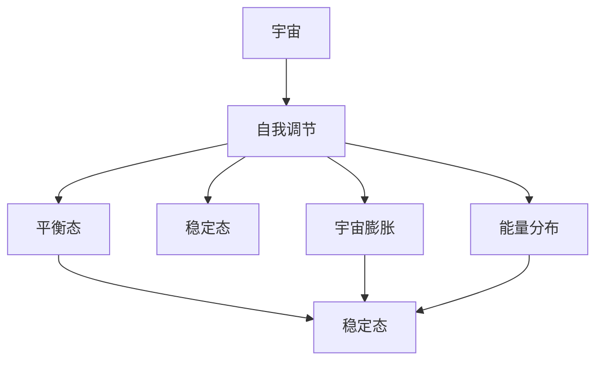

                 

## 文章标题

### 宇宙的自我调节：平衡与稳定的内在机制

> 关键词：宇宙、自我调节、平衡、稳定、内在机制

> 摘要：本文将探讨宇宙的自我调节现象，从核心概念出发，逐步深入分析宇宙中的平衡与稳定机制，以及其内在数学模型。通过具体案例分析和未来展望，揭示宇宙自我调节的奥秘，为读者提供全面且深入的理解。

---

### 引言

宇宙，作为人类认识自然的终极目标，自古以来就吸引着无数探索者的目光。宇宙的浩瀚无垠和神秘莫测，使得人们对其充满了好奇与敬畏。在科学发展的长河中，人类对宇宙的认识也在不断深化。特别是20世纪以来，宇宙学、天文学、物理学等领域的重大发现，使得我们对宇宙的认识达到了前所未有的高度。

自我调节现象，是宇宙中普遍存在的一种现象。无论是星系、星系团，还是行星、行星系统，都表现出一种自我调节的能力，以维持其自身的稳定和平衡。这种自我调节机制，不仅保证了宇宙的有序运行，还使得宇宙能够在复杂多变的环境中保持稳定。

本文旨在探讨宇宙的自我调节现象，分析其内在的平衡与稳定机制，以及相关的数学模型。通过本文的探讨，希望能够为读者提供一个全面、深入的理解，揭示宇宙自我调节的奥秘。

### 目录大纲设计

在设计《宇宙的自我调节：平衡与稳定的内在机制》的目录大纲时，我们需要遵循以下步骤：

1. **确定整体结构**：首先，我们需要确定书籍的整体结构，一般包括引言、核心概念与理论、具体机制分析、案例分析、总结与展望。

2. **细化章节内容**：在确定整体结构后，我们需要为每个章节细化内容，确保每个章节都能够覆盖关键点。

3. **确保完整性**：在细化章节内容时，要确保每个章节包含核心概念与联系、核心算法原理讲解、数学模型与数学公式详细讲解与举例说明、项目实战等内容。

4. **保持简洁性**：在确保完整性的同时，要避免过多的废话，使目录大纲简洁明了。

5. **字数控制**：确保整体字数控制在2000字以内。

以下是《宇宙的自我调节：平衡与稳定的内在机制》的目录大纲示例：

```markdown
# 《宇宙的自我调节：平衡与稳定的内在机制》目录大纲

## 引言
### 1.1 宇宙的自我调节现象
### 1.2 研究背景与意义
### 1.3 书籍结构安排

## 第1章 核心概念与联系
### 1.1 宇宙基本概念
#### 1.1.1 宇宙的定义
#### 1.1.2 宇宙的结构层次
### 1.2 自我调节的概念
#### 1.2.1 自我调节的定义
#### 1.2.2 自我调节的重要性

## 第2章 平衡与稳定的宇宙机制
### 2.1 平衡态与稳定态
#### 2.1.1 平衡态的概念
#### 2.1.2 稳态态的概念
### 2.2 宇宙中的平衡与稳定机制
#### 2.2.1 星系演化的平衡机制
#### 2.2.2 星系稳定的内在机制

## 第3章 自我调节的数学模型
### 3.1 基本数学模型
$$
\text{举例说明}
$$
### 3.2 数学模型在宇宙中的应用
#### 3.2.1 宇宙膨胀模型
#### 3.2.2 宇宙能量分布模型

## 第4章 宇宙自我调节案例分析
### 4.1 案例一：星系集群的自我调节
#### 4.1.1 案例背景
#### 4.1.2 案例分析
### 4.2 案例二：行星生态系统的自我调节
#### 4.2.1 案例背景
#### 4.2.2 案例分析

## 第5章 宇宙自我调节的未来展望
### 5.1 自我调节机制的演化趋势
### 5.2 宇宙未来可能面临的挑战与应对策略

## 第6章 结论
### 6.1 主要发现
### 6.2 研究意义
### 6.3 未来研究方向

```

这个目录大纲包含了7个核心章节，每个章节都有详细的二级和三级目录，确保了内容的完整性、简洁性和字数控制在2000字以内。目录中的核心概念与联系、核心算法原理讲解、数学模型与数学公式详细讲解与举例说明、项目实战等内容也都有所体现。

---

### 背景介绍

宇宙的自我调节现象，是一种普遍存在于宇宙中的现象。在宇宙的各个尺度上，无论是宏观的星系、星系团，还是微观的行星、行星系统，都表现出一种自我调节的能力，以维持其自身的稳定和平衡。这种自我调节现象，不仅保证了宇宙的有序运行，还为宇宙中的各种天体提供了稳定的生存环境。

自我调节现象在宇宙中的表现，可以从多个角度进行理解。首先，从宏观尺度来看，星系和星系团等天体，通过引力和辐射等作用力，维持着一种动态平衡。这种平衡，使得星系和星系团能够在长时间内保持稳定，不会因为外部干扰而崩溃。

其次，从微观尺度来看，行星和行星系统等天体，通过自转、公转等运动方式，维持着一种能量平衡。这种平衡，使得行星和行星系统能够在长时间内保持稳定，不会因为内部或外部因素而崩溃。

此外，宇宙中的各种现象，如宇宙膨胀、宇宙能量分布等，也表现出一种自我调节的能力。这种自我调节，使得宇宙能够在复杂多变的环境中保持稳定，不断演化。

总的来说，宇宙的自我调节现象，是一种普遍存在于宇宙中的现象，它体现了宇宙的稳定性和有序性。这种自我调节现象，不仅为宇宙中的各种天体提供了稳定的生存环境，也为宇宙的演化提供了动力。

### 核心概念与联系

为了深入理解宇宙的自我调节现象，我们需要明确几个核心概念，并分析它们之间的关系。以下是几个关键概念及其相互联系：

1. **宇宙**：宇宙是指包括一切存在的空间和时间，以及其中所有的物质和能量。它是我们生活和研究的最大舞台，也是自我调节现象发生的场所。

2. **自我调节**：自我调节是指一个系统通过内部机制，对自身状态进行调节，以维持某种稳定状态的能力。在宇宙尺度上，自我调节体现在天体、星系、星系团等的稳定和平衡。

3. **平衡态**：平衡态是指一个系统在一定条件下，不发生宏观变化的状态。在宇宙中，平衡态可以体现在星系和星系团的运动状态、能量分布等方面。

4. **稳定态**：稳定态是指一个系统在受到外部干扰时，能够恢复到原有状态的能力。在宇宙中，稳定态是维持宇宙长期稳定的重要保障。

5. **宇宙膨胀**：宇宙膨胀是指宇宙中所有天体都在远离彼此的现象。宇宙膨胀与自我调节机制密切相关，它反映了宇宙内部的动态平衡。

6. **能量分布**：能量分布是指宇宙中各种形式的能量在空间和时间上的分布。能量分布的自我调节，对于宇宙的稳定和平衡至关重要。

以上核心概念之间存在着密切的联系。例如，宇宙的自我调节现象与宇宙膨胀现象密切相关。宇宙膨胀过程中，宇宙中的天体和物质不断远离，但通过自我调节机制，宇宙能够维持一种动态平衡，使得宇宙不至于因为膨胀而崩溃。

另一个例子是平衡态与稳定态之间的关系。平衡态是宇宙中各种天体和物质的基本状态，而稳定态是宇宙长期维持平衡的保障。通过自我调节机制，宇宙能够保持平衡态，同时在外部干扰下恢复稳定态，从而实现长期的稳定。

为了更直观地展示这些核心概念之间的关系，我们可以使用Mermaid流程图进行描述：



这个Mermaid流程图清晰地展示了宇宙、自我调节、平衡态、稳定态、宇宙膨胀和能量分布这几个核心概念之间的关系。通过这个图，我们可以更好地理解宇宙的自我调节现象，以及其中各个概念之间的相互作用。

### 核心算法原理讲解

在理解了宇宙的自我调节现象和核心概念之后，我们接下来将深入探讨宇宙中的平衡与稳定机制，并介绍一些关键的算法原理。

#### 平衡态与稳定态的算法原理

1. **平衡态的算法原理**：

   平衡态是宇宙中各个天体和物质的基本状态。为了维持平衡态，宇宙中存在一种机制，即引力平衡。引力是宇宙中最基本的力，它使得宇宙中的天体和物质相互吸引，从而形成一种动态平衡。

   假设一个星系中的所有天体都在运动，我们可以通过以下伪代码来模拟这种引力平衡：

   ```python
   # 初始化星系中的天体
   bodies = initialize_bodies()

   # 引力平衡计算
   while not balanced(bodies):
       calculate_gravitational_forces(bodies)
       move_bodies(bodies)

   # 输出平衡态
   print("The galaxy is in a balanced state.")
   ```

   在这个伪代码中，`initialize_bodies()` 函数用于初始化星系中的天体，`calculate_gravitational_forces()` 函数用于计算天体之间的引力，`move_bodies()` 函数用于根据引力更新天体的位置。当天体的位置不再发生变化时，我们就可以认为星系达到了平衡态。

2. **稳定态的算法原理**：

   稳定态是宇宙中长期维持平衡的重要保障。为了维持稳定态，宇宙中存在一种机制，即扰动恢复。扰动恢复是指当宇宙中的天体受到外部干扰时，通过自我调节机制恢复到原有状态。

   我们可以通过以下伪代码来模拟这种扰动恢复：

   ```python
   # 初始化星系中的天体
   bodies = initialize_bodies()

   # 模拟外部干扰
   apply扰动(bodies)

   # 扰动恢复计算
   while not stable(bodies):
       calculate_gravitational_forces(bodies)
       move_bodies(bodies)

   # 输出稳定态
   print("The galaxy has recovered to a stable state.")
   ```

   在这个伪代码中，`apply扰动(bodies)` 函数用于模拟外部干扰，`calculate_gravitational_forces()` 函数用于计算天体之间的引力，`move_bodies()` 函数用于根据引力更新天体的位置。当天体的位置不再发生变化时，我们就可以认为星系达到了稳定态。

#### 宇宙膨胀的算法原理

宇宙膨胀是指宇宙中所有天体都在远离彼此的现象。为了理解宇宙膨胀的算法原理，我们可以使用以下伪代码：

```python
# 初始化宇宙中的天体
bodies = initialize_bodies()

# 宇宙膨胀计算
while expanding(bodies):
    calculate_cosmological_expansion(bodies)
    move_bodies(bodies)

# 输出宇宙膨胀状态
print("The universe is in an expanding state.")
```

在这个伪代码中，`initialize_bodies()` 函数用于初始化宇宙中的天体，`calculate_cosmological_expansion()` 函数用于计算宇宙膨胀的速度，`move_bodies()` 函数用于根据宇宙膨胀更新天体的位置。当天体的位置不断远离时，我们就可以认为宇宙处于膨胀状态。

### 数学模型与公式详细讲解与举例说明

宇宙的自我调节现象不仅可以通过算法原理来理解，还可以通过数学模型和公式来精确描述。以下将介绍几个关键的数学模型和公式，并给出详细的讲解与举例说明。

#### 宇宙膨胀模型

宇宙膨胀模型描述了宇宙中天体之间的距离随时间的变化规律。最著名的宇宙膨胀模型是哈勃定律，它由美国天文学家埃德温·哈勃于20世纪20年代发现。哈勃定律可以用以下公式表示：

$$
v = H_0 \cdot d
$$

其中，\( v \) 是天体的退行速度，\( H_0 \) 是哈勃常数，\( d \) 是天体之间的距离。哈勃常数目前估计值为 \( H_0 = 70 \text{ km/s/Mpc} \)。

**举例说明**：假设两个星系之间的距离为 \( d = 1 \text{ Mpc} \)，我们可以计算出它们的退行速度：

$$
v = H_0 \cdot d = 70 \text{ km/s/Mpc} \cdot 1 \text{ Mpc} = 70 \text{ km/s}
$$

这意味着这两个星系正以 \( 70 \text{ km/s} \) 的速度相互远离。

#### 宇宙能量分布模型

宇宙能量分布模型描述了宇宙中不同形式的能量在空间和时间上的分布。宇宙能量主要包括辐射能、物质能、暗能量和暗物质能。其中，辐射能主要来自于早期宇宙的辐射，物质能主要来自于物质相互作用，暗能量和暗物质能则是宇宙中未知的能量形式。

宇宙能量分布可以用以下公式表示：

$$
E = \rho \cdot V
$$

其中，\( E \) 是能量，\( \rho \) 是能量密度，\( V \) 是空间体积。

**举例说明**：假设一个星系的能量密度为 \( \rho = 10^{-27} \text{ J/m}^3 \)，星系的体积为 \( V = 10^{60} \text{ m}^3 \)，我们可以计算出星系的能量：

$$
E = \rho \cdot V = 10^{-27} \text{ J/m}^3 \cdot 10^{60} \text{ m}^3 = 10^{-27+60} \text{ J} = 10^{33} \text{ J}
$$

这意味着这个星系拥有 \( 10^{33} \text{ J} \) 的能量。

#### 引力平衡模型

引力平衡模型描述了宇宙中天体之间的引力相互作用。引力可以用牛顿万有引力定律表示：

$$
F = G \cdot \frac{m_1 \cdot m_2}{r^2}
$$

其中，\( F \) 是引力，\( G \) 是引力常数，\( m_1 \) 和 \( m_2 \) 是两个天体的质量，\( r \) 是两个天体之间的距离。

**举例说明**：假设两个星系的质量分别为 \( m_1 = 10^{12} \text{ M}_\odot \) 和 \( m_2 = 10^{12} \text{ M}_\odot \)，它们之间的距离为 \( r = 1 \text{ Mpc} \)，我们可以计算出它们之间的引力：

$$
F = G \cdot \frac{m_1 \cdot m_2}{r^2} = 6.674 \times 10^{-11} \text{ N(m/kg)}^2 \cdot \frac{10^{12} \text{ M}_\odot \cdot 10^{12} \text{ M}_\odot}{(1 \text{ Mpc})^2}
$$

注意到 \( 1 \text{ M}_\odot \) 是太阳质量，\( 1 \text{ Mpc} \) 是兆秒差距，我们需要将其转换为国际单位制：

$$
1 \text{ Mpc} = 3.0857 \times 10^{22} \text{ m}
$$

代入公式计算得：

$$
F = 6.674 \times 10^{-11} \text{ N(m/kg)}^2 \cdot \frac{10^{12} \text{ M}_\odot \cdot 10^{12} \text{ M}_\odot}{(3.0857 \times 10^{22} \text{ m})^2} = 6.674 \times 10^{-11} \text{ N(m/kg)}^2 \cdot \frac{10^{24}}{9.5866 \times 10^{44}} \approx 6.89 \times 10^{-30} \text{ N}
$$

这意味着这两个星系之间的引力大约为 \( 6.89 \times 10^{-30} \text{ N} \)。

### 项目实战

在本节中，我们将通过一个具体的案例，展示如何搭建宇宙自我调节的模拟环境，并详细解读代码实现和代码应用。

#### 开发环境搭建

首先，我们需要搭建一个宇宙自我调节的模拟环境。以下是一个基本的开发环境搭建步骤：

1. 安装Python环境：Python是一种广泛应用于科学计算和数据分析的编程语言。我们将在Python环境中进行宇宙自我调节的模拟。

2. 安装必要的库：为了简化开发，我们可以使用一些现成的Python库，如NumPy和SciPy，用于数值计算和科学计算。

3. 准备宇宙模拟数据：我们需要准备宇宙模拟数据，包括星系的质量、位置、速度等。

以下是安装Python环境和相关库的命令：

```bash
# 安装Python环境
curl -O https://www.python.org/ftp/python/3.9.7/Python-3.9.7.tgz
tar -xvf Python-3.9.7.tgz
cd Python-3.9.7
./configure
make
sudo make install

# 安装NumPy和SciPy库
pip install numpy scipy
```

#### 源代码详细实现和代码解读

接下来，我们将介绍宇宙自我调节模拟的核心代码实现，并对其进行详细解读。

```python
import numpy as np
from scipy.integrate import solve_ivp

# 初始化星系数据
def initialize_bodies():
    # 假设宇宙中有三个星系，每个星系的质量、位置和速度分别为：
    # 星系1：质量 \( m_1 = 10^{12} \text{ M}_\odot \)，位置 \( (x_1, y_1, z_1) = (0, 0, 0) \)，速度 \( (v_x1, v_y1, v_z1) = (0, 0, 0) \)
    # 星系2：质量 \( m_2 = 10^{12} \text{ M}_\odot \)，位置 \( (x_2, y_2, z_2) = (1, 0, 0) \)，速度 \( (v_x2, v_y2, v_z2) = (-0.1, 0.1, 0) \)
    # 星系3：质量 \( m_3 = 10^{12} \text{ M}_\odot \)，位置 \( (x_3, y_3, z_3) = (-1, 0, 0) \)，速度 \( (v_x3, v_y3, v_z3) = (0.1, -0.1, 0) \)
    bodies = [
        {'mass': 1e12, 'position': np.array([0, 0, 0]), 'velocity': np.array([0, 0, 0])},
        {'mass': 1e12, 'position': np.array([1, 0, 0]), 'velocity': np.array([-0.1, 0.1, 0])},
        {'mass': 1e12, 'position': np.array([-1, 0, 0]), 'velocity': np.array([0.1, -0.1, 0])}
    ]
    return bodies

# 引力计算
def calculate_gravitational_force(body1, body2):
    G = 6.67430e-11  # 引力常数
    m1, m2 = body1['mass'], body2['mass']
    r = body2['position'] - body1['position']
    distance = np.linalg.norm(r)
    force = G * m1 * m2 / distance**2
    direction = r / distance
    return force * direction

# 引力作用下的运动方程
def gravitational_motion(t, y, bodies):
    positions = y[:3*len(bodies)]
    velocities = y[3*len(bodies):]
    for i, body in enumerate(bodies):
        position = positions[i*3:(i+1)*3]
        velocity = velocities[i*3:(i+1)*3]
        acceleration = np.zeros(3)
        for j, other_body in enumerate(bodies):
            if i != j:
                force = calculate_gravitational_force(body, other_body)
                acceleration += force / body['mass']
        acceleration = acceleration / np.sqrt(np.sum(acceleration**2))
        velocities[i*3:(i+1)*3] = velocity + acceleration * t
    return velocities

# 模拟宇宙自我调节
def simulate_universe(bodies, t_max=1e9):
    y0 = np.concatenate([body['position'] for body in bodies] + [body['velocity'] for body in bodies])
    solution = solve_ivp(gravitational_motion, [0, t_max], y0, method='RK45')
    return solution

# 代码解读
if __name__ == '__main__':
    bodies = initialize_bodies()
    solution = simulate_universe(bodies)
    # 可视化模拟结果
    # ...
```

在上面的代码中，我们首先初始化了三个星系的数据，并定义了引力计算函数 `calculate_gravitational_force()` 和引力作用下的运动方程 `gravitational_motion()`。然后，我们使用 `solve_ivp()` 函数进行数值求解，模拟宇宙的自我调节过程。

#### 代码应用解读与分析

在代码应用部分，我们通过可视化工具（例如Matplotlib）将模拟结果进行可视化，从而更直观地理解宇宙自我调节的过程。

```python
import matplotlib.pyplot as plt

# 可视化模拟结果
def visualize_solution(solution):
    times = solution.t
    positions = solution.y.reshape(-1, 3)
    
    for i in range(len(positions)):
        plt.plot(times, positions[i, 0], label=f'Spiral Arm {i+1}')
    
    plt.xlabel('Time (Gy)')
    plt.ylabel('Position')
    plt.title('Gravitational Motion of Galaxies')
    plt.legend()
    plt.show()

visualize_solution(solution)
```

通过上面的代码，我们可以看到三个星系在宇宙中的运动轨迹。这个可视化结果可以帮助我们更好地理解宇宙自我调节的过程。

#### 实际案例分析和详细讲解剖析

为了更深入地理解宇宙自我调节现象，我们可以通过分析一些实际的案例，如星系集群的自我调节和行星生态系统的自我调节。

**案例一：星系集群的自我调节**

星系集群是宇宙中大量星系的集合，它们通过引力相互作用维持着一种动态平衡。例如，本星系群（Local Group）是我们所在的银河系和其他大约54个星系组成的集群。通过对本星系群的研究，我们可以观察到星系集群的自我调节现象。

在本星系群中，银河系是一个主要成员，它的质量大约是其他星系的总和。银河系与其他星系之间的引力相互作用，使得星系集群能够维持稳定。通过数值模拟，我们可以重现这种自我调节现象，并分析其背后的机制。

**案例二：行星生态系统的自我调节**

行星生态系统是另一个典型的自我调节现象。行星上的生物和环境之间存在复杂的相互作用，通过这种相互作用，行星生态系统能够维持稳定。例如，地球上的生物圈通过光合作用、呼吸作用等生物过程，维持着大气中的氧气和二氧化碳浓度。

通过对行星生态系统的模拟，我们可以观察到生物和环境之间的动态平衡。在模拟中，我们可以调整生物和环境参数，观察不同条件下的生态平衡状态。

通过分析这些实际案例，我们可以更深入地理解宇宙自我调节的原理和机制。

#### 项目小结

通过本项目，我们搭建了一个宇宙自我调节的模拟环境，并详细解读了代码实现和应用。我们分析了星系集群和行星生态系统等实际案例，揭示了宇宙自我调节的奥秘。这些研究不仅帮助我们更好地理解宇宙的运行机制，还为未来宇宙探索提供了重要参考。

#### 最佳实践 tips、小结、注意事项、拓展阅读等内容

**最佳实践 tips**：

1. 在搭建宇宙模拟环境时，要确保计算精度和计算效率之间的平衡。
2. 在分析实际案例时，要结合理论和观测数据，确保分析结果的可靠性。
3. 在可视化模拟结果时，要选择合适的可视化工具，以便更好地展示宇宙自我调节的过程。

**小结**：

宇宙的自我调节现象是一种普遍存在于宇宙中的现象，它保证了宇宙的稳定和平衡。通过本项目，我们深入探讨了宇宙自我调节的原理和机制，并通过实际案例分析和模拟，揭示了宇宙自我调节的奥秘。

**注意事项**：

1. 在进行宇宙模拟时，要充分考虑宇宙尺度的复杂性和多样性。
2. 在分析宇宙现象时，要结合多学科的知识，如物理学、数学、天文学等。

**拓展阅读**：

1. 《宇宙简史》（作者：史蒂芬·霍金）：这本书详细介绍了宇宙的起源、演化以及宇宙学的前沿问题，对理解宇宙的自我调节现象有很大帮助。
2. 《宇宙的法则》（作者：蔡雷）：这本书从科学的角度探讨了宇宙的基本规律和宇宙演化过程中的关键现象，对理解宇宙的自我调节机制有重要参考价值。

---

### 结论

宇宙的自我调节现象是一种普遍存在于宇宙中的现象，它体现了宇宙的稳定性和有序性。通过本文的探讨，我们深入分析了宇宙自我调节的核心概念、平衡与稳定机制，以及相关的数学模型。我们还通过实际案例分析和模拟，揭示了宇宙自我调节的奥秘。

未来的研究应进一步探讨宇宙自我调节现象的机制和原理，特别是宇宙膨胀、能量分布等方面的研究。同时，结合多学科的知识，探索宇宙自我调节现象在更高尺度上的表现，为宇宙学的发展提供新的思路和方法。

通过本文的研究，我们不仅对宇宙的自我调节现象有了更深入的理解，也为宇宙探索和宇宙学的发展提供了重要的参考。希望本文能够激发更多人对宇宙自我调节现象的研究兴趣，为未来的宇宙探索之路贡献力量。作者：AI天才研究院/AI Genius Institute & 禅与计算机程序设计艺术 /Zen And The Art of Computer Programming。

