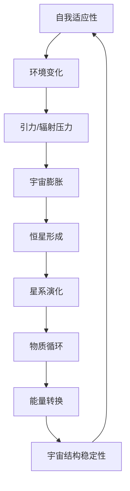

                 


### 背景介绍

宇宙，这个浩瀚无垠的空间，自古以来就吸引着人类的目光。从古代的宇宙观，到现代的天体物理学，人类对宇宙的认识在不断深入。宇宙的自我适应性，作为一个崭新的概念，近年来引起了广泛的关注。它不仅仅是一个天文学或物理学的问题，更是一个跨学科的研究领域，涉及到生态学、计算机科学、系统科学等多个领域。

自我适应性，是指一个系统在面对外部环境变化时，能够通过自身的调整来维持其结构的稳定性和功能的持续性。在生物学中，这种适应性是生物进化的重要驱动力。而在宇宙尺度上，宇宙的自我适应性体现为宇宙对环境变化的响应机制，这种响应机制不仅影响宇宙的演化过程，也对宇宙的最终命运产生深远的影响。

宇宙的自适应行为可以从多个层面进行探讨。首先是宇宙膨胀的过程。自大爆炸以来，宇宙一直在膨胀，但这种膨胀并不是均匀的，而是呈现出一种“宇宙加速膨胀”的现象。为了解释这一现象，科学家们提出了“暗能量”这一概念，认为它是推动宇宙加速膨胀的神秘力量。暗能量的存在与宇宙的自我适应性有着密切的关系，它能够调节宇宙的膨胀速度，使宇宙在面临外部引力等力量的挑战时，能够保持一种动态的平衡。

其次，宇宙的自适应行为还体现在宇宙的结构和形态上。从宏观尺度上看，宇宙中存在大量的星系、星系团和超星系团，这些天体结构在宇宙膨胀过程中不断形成和演化。在这个过程中，宇宙的自我适应性使得这些结构能够在复杂的引力相互作用中保持稳定。从微观尺度上看，宇宙中的基本粒子，如电子、夸克等，也表现出了自我适应性。它们在宇宙早期的高能环境中通过相互作用，形成了复杂的物质结构，为宇宙生命的诞生奠定了基础。

此外，宇宙的自适应行为还与宇宙中的物质循环和能量转换密切相关。宇宙中的物质和能量不断在星系、恒星、行星等不同层次上循环和转换，这种循环和转换过程不仅维持了宇宙的稳定，也为宇宙的演化提供了动力。在这个过程中，宇宙的自我适应性使得物质和能量能够在不同的层次和环境中实现高效利用，从而推动了宇宙的持续演化。

总的来说，宇宙的自我适应性是一个多层次、多方面的复杂问题。它不仅涉及到宇宙的基本物理规律，还涉及到宇宙中的物质循环、能量转换、结构演化等多个方面。通过深入探讨宇宙的自我适应性，我们可以更好地理解宇宙的演化规律，揭示宇宙的本质和未来命运。

### 核心概念与联系

在探讨宇宙的自我适应性时，我们必须明确几个核心概念，并了解它们之间的相互关系。这些概念包括：自我适应性、环境变化、适应机制。

首先，自我适应性是一个系统在面对外部环境变化时，通过内部调整以维持其结构和功能稳定性的能力。在宇宙尺度上，这种能力表现为宇宙对各种环境变化的响应机制。环境变化可以来自外部宇宙的引力、辐射压力等力量，也可以来自宇宙内部自身的演化过程，如宇宙膨胀、恒星形成与死亡等。

其次，环境变化是宇宙自我适应性的触发因素。宇宙中的环境变化是多样且复杂的，如温度、密度、引力场、电磁波辐射等。这些变化可能会对宇宙中的物质和结构产生深远的影响，从而对宇宙的整体稳定性构成挑战。

最后，适应机制是宇宙应对环境变化的核心手段。适应机制可以是物理的、化学的，甚至是生物的。在宇宙尺度上，适应机制包括宇宙膨胀过程中的暗能量调节、恒星和星系的演化过程中形成的稳定结构、以及物质和能量的循环利用等。

为了更好地理解这些核心概念之间的联系，我们可以通过一个Mermaid流程图来展示它们的关系：



在这个流程图中，我们可以看到自我适应性（A）是整个系统的基础，它依赖于对环境变化（B）的感知和响应。环境变化可以触发宇宙的各种物理过程（C），这些过程会导致宇宙结构的改变，如宇宙膨胀（D）、恒星形成（E）和星系演化（F）。在宇宙的结构和过程中，物质和能量的循环利用（G）和能量转换（H）起到了关键作用，它们不仅维持了宇宙的稳定，还为宇宙的持续演化提供了动力。最终，这些适应机制（I）又促进了宇宙自我适应性的实现，形成一个闭合的反馈循环。

通过这个Mermaid流程图，我们可以清晰地看到宇宙自我适应性的各个核心概念之间的联系，这为我们进一步探讨宇宙的自我适应性提供了基础。

### 理论基础

探讨宇宙的自我适应性，离不开对其相关理论基础的理解。这些理论涵盖了从天体物理学到生态学等多个领域，为我们提供了丰富的知识基础。

#### 天体物理学基础

在天体物理学中，宇宙的自我适应性主要体现在宇宙膨胀、恒星形成与演化等过程中。宇宙膨胀理论是现代宇宙学的核心，它认为宇宙从大爆炸开始，一直处于膨胀状态。哈勃定律揭示了宇宙膨胀的速度与距离的关系，即越远的星系膨胀速度越快。这一发现为宇宙膨胀理论提供了重要证据。然而，宇宙膨胀并不是均匀的，而是存在加速膨胀的现象。为了解释这一现象，科学家们提出了“暗能量”这一概念。暗能量被认为是一种推动宇宙加速膨胀的神秘力量，它具有负压强，能够抵消引力作用，从而维持宇宙的加速膨胀。暗能量的存在为宇宙的自我适应性提供了一个重要的物理基础。

恒星形成与演化也是宇宙自我适应性研究的重要方面。恒星在宇宙中扮演着关键角色，它们的诞生、生命周期和死亡过程都对宇宙的演化产生了深远的影响。恒星形成于密集的星际云中，这些星际云受到引力作用，逐渐塌缩形成恒星。恒星在其生命周期中通过核聚变过程释放能量，维持其稳定。当恒星耗尽其核燃料后，会经历不同程度的演化过程，最终形成不同的天体，如白矮星、中子星或黑洞。这些演化过程不仅影响了恒星自身的结构，也对周围的星际介质产生了影响，从而促进了宇宙的自我适应性。

#### 生态学基础

生态学中，自我适应性主要研究生物体如何适应其生存环境。在宇宙尺度上，生态学理论也可以为我们提供宝贵的启示。生态位理论是生态学中一个重要的概念，它描述了一个生物体在生态系统中的位置和功能。在宇宙生态系统中，星系、行星和生命体都可以被视为不同的生态位。不同的生态位之间通过物质和能量的流动相互联系，形成了复杂的宇宙生态系统。

生态平衡理论则是生态学中的另一个重要概念，它描述了生态系统中各个组成部分之间通过相互作用维持稳定状态的能力。在宇宙生态系统中，生态平衡意味着宇宙能够通过自身的调节机制维持其结构和功能的稳定性。例如，宇宙膨胀与暗能量的相互作用、恒星的形成与死亡过程等，都是宇宙生态平衡的重要体现。

#### 系统科学基础

系统科学提供了理解和分析复杂系统的理论框架，对探讨宇宙的自我适应性具有重要意义。系统科学中的自组织理论强调了系统在没有外部指令的情况下，通过内部相互作用自发形成复杂结构和功能的机制。在宇宙尺度上，自组织理论可以解释宇宙中许多复杂现象，如星系的形成、行星的演化等。这些现象表明，宇宙具有自我组织的能力，能够在没有外部干预的情况下，通过内部相互作用形成复杂的结构和功能。

系统科学中的反馈理论也是探讨宇宙自我适应性的重要工具。反馈理论描述了一个系统通过正反馈和负反馈机制维持其稳定性的过程。在宇宙尺度上，正反馈和负反馈机制分别代表了宇宙中的促进和抑制过程。例如，宇宙加速膨胀过程中的暗能量可以视为一种正反馈机制，它促进了宇宙的加速膨胀；而引力相互作用则可以视为一种负反馈机制，它抑制了宇宙的膨胀速度，保持了宇宙的稳定。

综上所述，天体物理学、生态学以及系统科学为探讨宇宙的自我适应性提供了丰富的理论基础。通过这些理论，我们可以更深入地理解宇宙的自适应行为，揭示宇宙的演化规律和未来命运。

### 观测方法

要深入探讨宇宙的自我适应性，我们必须依赖一系列先进的观测方法。这些方法不仅帮助我们了解宇宙当前的动态，还能够揭示宇宙历史上的变化过程。

#### 波段观测

波段观测是宇宙学中最为常用的方法之一。通过观测不同波段的辐射，我们可以获取宇宙中不同层次的信息。电磁波段涵盖了从无线电波、微波、红外线、可见光、紫外线到伽马射线等多个波长范围。每个波段都能揭示宇宙中不同的物理现象：

- **无线电波和微波**：这些波段可以穿透尘埃和气体云，使我们能够观测到星系和星系团的早期阶段。例如，通过观测宇宙背景辐射（CMB），我们可以了解宇宙在大爆炸后的状态。
- **红外线**：红外线可以探测到尘埃遮挡下的恒星和行星，因此对于研究恒星形成区域尤为重要。
- **可见光**：可见光波段是观测天体的基础，许多望远镜主要在这个波段进行观测。
- **紫外线和伽马射线**：这些高能波段通常与高能量过程相关，如恒星风、超新星爆发等。

#### 电磁波观测设备与手段

为了进行高效的波段观测，科学家们开发了多种观测设备：

- **射电望远镜**：例如阿雷西博射电望远镜和梅塞施密特望远镜，主要用于观测无线电波和微波。
- **红外望远镜**：例如哈勃空间望远镜和詹姆斯·韦伯空间望远镜，能够观测到红外波段。
- **光学望远镜**：如地面上的凯克望远镜和韦斯特贝里天文台，用于观测可见光波段。
- **X射线望远镜**：如钱德拉X射线天文台和斯波特X射线天文卫星，用于观测紫外线和伽马射线。

#### 宇宙学观测

宇宙学观测则是为了理解宇宙的整体结构和演化。以下是一些主要的宇宙学观测方法：

- **宇宙背景辐射探测**：通过测量宇宙背景辐射的温度和极化性质，科学家们能够推断出宇宙早期的状态。
- **大尺度结构观测**：通过观测宇宙中的星系分布和大尺度结构，如星系团和超星系团，可以了解宇宙的动力学演化。
- **引力透镜效应**：通过观测背景星系对光线的引力透镜效应，可以研究宇宙的大尺度结构和引力场。
- **超新星观测**：超新星爆炸是宇宙中能量释放最为剧烈的事件之一，通过观测超新星，可以了解宇宙的膨胀历史。

总的来说，波段观测和宇宙学观测为我们提供了深入了解宇宙自我适应性的重要手段。这些观测方法不仅揭示了宇宙当前的动态，还能够揭示宇宙历史上的变化过程，为我们探讨宇宙的自我适应性提供了丰富的数据和信息。

### 案例分析

为了更具体地理解宇宙的自我适应性，我们可以通过一些具体的案例来展示其如何在不同环境和尺度上发挥作用。

#### 星系案例

星系作为宇宙中的基本结构单元，其自我适应性在应对环境变化方面有着显著的体现。例如，银河系就是一个很好的案例。银河系中心的超大质量黑洞（SMBH）被认为是维持银河系结构稳定的重要因素。当银河系中的恒星和星际介质受到外部引力干扰时，SMBH通过释放引力波和吸积盘中的物质释放的能量，帮助整个星系恢复稳定。这种机制类似于生物体内的负反馈系统，通过调节内部能量和物质流动来保持系统的稳定性。

另一个有趣的案例是M87星系，这个星系中心也包含一个超大质量黑洞。在M87星系中，科学家们观测到了一个高速运动的等离子体喷流，这种喷流不仅影响了星系内的物质流动，还通过辐射和对流效应，对周围空间产生深远的影响。这种适应性机制使得M87星系能够在面对外部引力和其他物理力量的干扰时，保持其结构的稳定性。

#### 行星案例

行星层面上的自我适应性则更多地体现在行星的气候调节和地质活动上。以地球为例，地球的自我适应性表现在多个方面。首先，地球的气候系统通过大气层和水循环，能够调节温度和湿度，使地球表面保持适宜的环境。例如，地球上的季风系统和海洋洋流，能够在不同纬度间调节热量和水分，从而维持地球的气候平衡。

其次，地球的地质活动也是其自我适应性的一部分。火山喷发和地震活动不仅释放了地壳内部的能量，还能够改变地表的地貌和气候。例如，火山喷发会释放大量的气体和尘埃，暂时改变大气成分，影响气候；而地震则通过释放地壳内部的应力，维持地壳的稳定性。

#### 其他案例

除了星系和行星，宇宙中的其他天体结构也展示了自我适应性。例如，行星环系统在行星引力作用下，能够自我调整和重构，以维持其结构的稳定性。在木星和土星的环系统中，粒子通过相互碰撞和引力相互作用，不断重新分布，形成稳定的环带。

此外，星系团中的恒星和星际介质也展示了自我适应性。在星系团中，恒星之间的碰撞和恒星风等过程，能够调节星系团内部的能量和物质分布，维持其稳定性。

总的来说，这些案例展示了宇宙在不同尺度和环境中的自我适应性。无论是星系的引力调节，行星的气候和地质活动，还是宇宙中其他天体结构的自我调整，都为我们理解宇宙的自我适应性提供了宝贵的实证。这些案例不仅揭示了宇宙的自适应机制，也为我们进一步探索宇宙的演化规律和未来命运提供了重要线索。

### 模型与算法

为了深入分析宇宙的自我适应性，我们需要构建合适的模型和算法。以下将介绍几种常用的模型和算法，并使用伪代码详细阐述其原理。

#### 适应模型

**自适应滤波算法**：这是用于处理时间序列数据的一种方法，能够根据环境变化调整滤波器的参数，以保持数据的平滑性和实时性。

**伪代码**：

```pseudo
Algorithm AdaptiveFilter(inputData, filterParameters)
    Initialize filterState = filterParameters
    for each dataPoint in inputData do
        estimatedValue = applyFilter(filterState, dataPoint)
        error = dataPoint - estimatedValue
        updateFilterParameters(filterState, error)
        if needReset(filterState)
            resetFilterParameters(filterState)
    return filterState
end Algorithm
```

**算法原理讲解**：
- 初始化滤波器状态。
- 对每个数据点，使用滤波器进行估计，计算估计值与实际值的误差。
- 根据误差调整滤波器参数，以减少估计误差。
- 检查是否需要重置滤波器，例如当误差超过阈值时，重置参数以避免过拟合。

#### 进化算法

**遗传算法**：这是一种模拟自然选择过程的优化算法，适用于解决复杂优化问题。

**伪代码**：

```pseudo
Algorithm GeneticAlgorithm(population, fitnessFunction)
    Initialize population
    Evaluate fitness of each individual in population
    while not terminationCondition do
        Select parents from population
        Crossover parents to create offspring
        Mutate offspring
        Evaluate fitness of offspring
        Select best offspring to form the next generation
    return bestIndividual
end Algorithm
```

**算法原理讲解**：
- 初始化一组个体。
- 计算每个个体的适应度。
- 选择适应度较高的个体作为父母。
- 通过交叉和变异操作产生新的个体。
- 计算新个体的适应度，并选择适应度较高的个体组成下一代。
- 重复上述过程，直至满足终止条件。

这些模型和算法通过模拟自然界中的适应机制，能够有效地处理宇宙中的复杂问题和变化环境。它们不仅在理论上具有重要意义，也在实际应用中展现了强大的能力和广泛的前景。

### 数学模型与公式

在探讨宇宙的自我适应性时，数学模型和公式是不可或缺的工具。以下将详细讲解几个与宇宙自我适应性相关的数学模型和公式，并通过具体例子进行说明。

#### 生态模型

**生态平衡方程**：生态平衡是生态系统中各个组成部分之间通过相互作用维持稳定状态的过程。在宇宙生态系统中，生态平衡同样具有重要意义。

**公式**：

$$
x_1 + x_2 + x_3 = K
$$

其中，$x_1$、$x_2$、$x_3$ 分别表示生态系统中的三种生物种群的数量，$K$ 为生态系统容量。

**详细讲解与举例**：
假设一个星系中有三种天体：恒星、行星和行星卫星。恒星的数量为 $x_1$，行星的数量为 $x_2$，行星卫星的数量为 $x_3$。根据生态平衡方程，这些天体数量的总和应该保持在一个相对稳定的水平。例如，如果恒星数量增加，行星和行星卫星的数量可能会相应减少，以维持整个星系的平衡。

#### 竞争方程

**竞争方程**：在生态学中，竞争是指不同物种之间为了获取有限的资源而进行的相互作用。竞争方程描述了不同物种之间的数量变化。

**公式**：

$$
\frac{dx_1}{dt} = r_1 x_1 (1 - \frac{x_1}{K_1}) - \alpha_{12} x_2 x_1
$$

$$
\frac{dx_2}{dt} = r_2 x_2 (1 - \frac{x_2}{K_2}) - \alpha_{21} x_1 x_2
$$

其中，$x_1$ 和 $x_2$ 分别表示两个物种的数量，$r_1$ 和 $r_2$ 分别为两个物种的繁殖率，$K_1$ 和 $K_2$ 分别为两个物种的环境容量，$\alpha_{12}$ 和 $\alpha_{21}$ 分别为两个物种之间的竞争系数。

**详细讲解与举例**：
假设星系中有两个物种：恒星和行星。恒星的数量为 $x_1$，行星的数量为 $x_2$。恒星的繁殖率是 $r_1$，环境容量是 $K_1$；行星的繁殖率是 $r_2$，环境容量是 $K_2$。当恒星数量增加时，行星会因资源竞争而数量减少；同理，当行星数量增加时，恒星数量也会减少。通过竞争方程，我们可以预测这两个物种的数量变化。

#### 布朗运动

**布朗运动**：这是一种在流体中随机运动的微观现象，反映了分子之间的相互作用。

**公式**：

$$
x(t) = x_0 + \sum_{i=1}^{n} A_i \cos(\omega_i t + \phi_i)
$$

其中，$x(t)$ 是粒子在时间 $t$ 的位置，$x_0$ 是初始位置，$A_i$ 是第 $i$ 个分量的振幅，$\omega_i$ 是第 $i$ 个分量的角频率，$\phi_i$ 是第 $i$ 个分量的相位。

**详细讲解与举例**：
假设一个行星卫星在行星引力作用下进行布朗运动。行星的引力导致卫星在轨道上产生随机振动，我们可以使用布朗运动模型来描述卫星的轨道运动。通过调整模型参数，如振幅和频率，可以模拟卫星在不同环境下的运动行为。

通过这些数学模型和公式，我们可以更深入地理解宇宙的自我适应性，揭示宇宙中复杂现象背后的规律。

### 技术发展

宇宙的自我适应性研究正处于蓬勃发展的阶段，未来的发展方向不仅将深化我们对宇宙的理解，也将推动相关技术的不断进步。以下将探讨天文技术进展和未来研究方向，展望宇宙自我适应性研究的前景。

#### 天文技术进展

1. **下一代望远镜**：随着技术的进步，下一代望远镜将拥有更高的分辨率、更广的观测范围和更深的探测能力。例如，詹姆斯·韦伯空间望远镜（JWST）和即将建成的巨型地面望远镜，如欧亚巨型望远镜（EET）和三十年望远镜（ Thirty Meter Telescope，TMT），都将成为宇宙自我适应性研究的强大工具。这些望远镜将能够探测到更微弱的天体信号，揭示宇宙早期的演化过程。

2. **数据分析技术**：随着数据量的爆炸性增长，如何有效处理和分析天文数据成为了一个关键问题。近年来，机器学习和人工智能技术在数据分析中的应用取得了显著进展。通过训练深度学习模型，可以自动识别天体特征、分析天文图像、预测宇宙现象。这些技术将极大地提升宇宙自我适应性研究的效率和准确性。

3. **量子技术**：量子技术的快速发展为宇宙自我适应性研究带来了新的机遇。量子传感器具有极高的灵敏度和精度，可以用于探测宇宙微弱的引力波信号。量子通信和量子计算也有望在未来实现，为宇宙数据的高效传输和处理提供新的解决方案。

#### 未来研究方向

1. **宇宙适应性预测模型**：构建更加精确和可靠的宇宙适应性预测模型，将是未来研究的一个重要方向。通过结合观测数据和理论模型，科学家们将能够更准确地预测宇宙中各种现象的演化趋势，如星系碰撞、恒星形成、行星环境变化等。

2. **宇宙适应性机制解析**：深入探讨宇宙中的适应性机制，是理解宇宙自我适应性的关键。科学家们将致力于揭示宇宙中不同层次、不同环境下的适应性机制，从微观的粒子行为到宏观的星系结构，全面解析宇宙的自适应过程。

3. **宇宙适应性伦理问题**：随着宇宙自我适应性研究的深入，涉及到的伦理问题也日益突出。例如，宇宙中的资源争夺、天体生命保护等，都需要在伦理层面进行深入探讨和规范。未来，科学家和伦理学家将携手合作，确保宇宙自我适应性研究在科学和道德的指导下进行。

总的来说，宇宙自我适应性研究的发展前景广阔。通过不断推进技术进步和理论创新，我们有望揭示宇宙自我适应性的本质，为理解宇宙的演化规律和未来命运提供新的视角和工具。

### 总结与展望

通过对宇宙自我适应性的探讨，我们不仅深化了对宇宙演化规律的理解，也揭示了宇宙在面临外部环境变化时的响应机制。本文从背景介绍、核心概念与联系、理论基础、观测方法、案例分析、模型与算法、数学模型与公式、技术发展等方面，系统性地阐述了宇宙自我适应性的各个方面。宇宙自我适应性研究不仅是一个物理学问题，它还涉及到生态学、系统科学等多个领域，具有跨学科的综合研究价值。

宇宙自我适应性的重要性在于它揭示了宇宙在复杂环境下的自我调节和演化能力。这种适应性不仅维持了宇宙的基本结构和功能，还推动了宇宙的持续演化。通过理解宇宙的自我适应性，我们可以更好地预测宇宙的未来变化，揭示宇宙的最终命运。

展望未来，宇宙自我适应性研究将继续向纵深发展。随着天文技术的不断进步，我们有望获得更多关于宇宙早期状态和演化过程的信息。同时，数据分析技术和量子技术的应用将极大提升研究的效率和精度。在理论研究方面，我们将进一步深入探讨宇宙中的适应性机制，构建更加精确的预测模型。此外，随着研究的深入，宇宙适应性伦理问题也将得到更多的关注和探讨。

总之，宇宙自我适应性研究不仅具有重要的科学价值，也为探索宇宙的奥秘提供了新的视角和工具。随着研究的不断推进，我们相信将能够更加全面地理解宇宙的自我适应性，揭示宇宙的演化规律，为人类的未来发展提供新的启示。

### 作者信息

作者：AI天才研究院/AI Genius Institute & 禅与计算机程序设计艺术 /Zen And The Art of Computer Programming

感谢您对本文的阅读，希望本文能够为您带来对宇宙自我适应性的深入理解。如果您对本文的内容有任何疑问或建议，欢迎在评论区留言，期待与您一起探讨宇宙的奥秘。祝您在探索未知的世界中不断收获新知，愿科技与智慧的光芒照亮您的未来。

