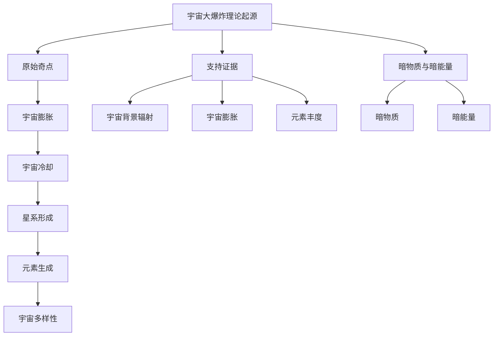
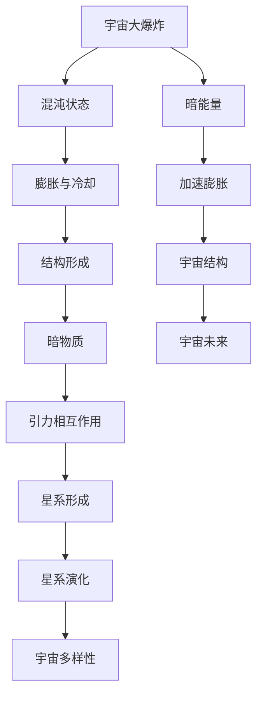

                 

### 摘要

本文探讨了宇宙的自组织性，从混沌到有序的演化过程。宇宙的起源是一个充满混沌的状态，然而，在宇宙的演化过程中，通过一系列复杂的物理机制，宇宙逐渐从无序走向了有序。本文首先介绍了宇宙大爆炸理论，以及暗物质和暗能量的概念，揭示了宇宙早期混沌状态的本质。随后，深入探讨了混沌理论的基本原理，包括混沌的定义、特征、与确定性的关系，以及混沌系统的分析方法。接着，文章展示了宇宙中的自组织现象，从星系的形成与演化到行星系统的结构，展现了宇宙从混沌到有序的演化路径。最后，本文展望了宇宙未来的演化方向，并讨论了自组织性在宇宙尺度上的重要性。通过逐步分析和推理，本文揭示了宇宙自组织性的深刻内涵，为读者提供了一个全面、系统的宇宙演化理解框架。

## 第1章：宇宙的起源与早期演化

### 1.1 宇宙大爆炸理论

宇宙大爆炸理论是现代宇宙学的基础之一，提出宇宙起源于一个极热、极密的状态，并在约138亿年前发生了爆炸，从此宇宙开始扩张。这一理论最早由俄罗斯数学家亚历山大·弗里德曼（Alexander Friedmann）在1922年提出，后来由美国物理学家乔治·勒梅特（Georges Lemaître）和俄罗斯物理学家阿诺·彭齐亚斯（Arno Penzias）等人进一步完善和发展。

**1.1.1 大爆炸模型的起源**

大爆炸理论的起源可以追溯到20世纪初。当时，科学家们观测到了宇宙背景辐射，这是一种几乎均匀分布在宇宙中的微波辐射。这一现象引起了科学家们的极大兴趣，因为这种辐射看起来与一个高温、高密度的宇宙状态相一致。随后，勒梅特在1927年提出了一种称为“原始原子”的理论，认为宇宙起源于一个单一的超密集状态，并逐渐膨胀。

**1.1.2 大爆炸模型的支持证据**

大爆炸理论得到了多方面的支持证据。首先是宇宙背景辐射的发现，这一发现由彭齐亚斯和威尔逊（Robert Wilson）在1965年证实，为宇宙大爆炸提供了直接的观测证据。其次是宇宙的膨胀现象，通过观测遥远星系的红移，科学家们发现宇宙正在不断膨胀，这与大爆炸理论中的宇宙膨胀预期一致。此外，宇宙中的元素丰度分布、宇宙的微波背景辐射极化现象等，也都为宇宙大爆炸理论提供了强有力的支持。

**1.1.3 大爆炸模型的基本原理**

大爆炸模型的基本原理可以概括为以下几个关键点：

1. **宇宙的起源**：宇宙起源于一个极热、极密的状态，称为原始奇点。在这个状态下，物质的密度和温度都极高，以至于物理定律无法正常应用。
2. **宇宙的膨胀**：随着原始奇点的爆炸，宇宙开始迅速膨胀，物质的密度和温度逐渐降低。
3. **宇宙的冷却**：在膨胀过程中，宇宙逐渐冷却，形成了各种基本粒子和元素。
4. **宇宙结构的形成**：在宇宙早期，由于引力的作用，物质开始聚集形成星系、星团和其他天体结构。

### 1.2 暗物质与暗能量的发现

暗物质和暗能量是宇宙学中两个重要的概念，它们对于理解宇宙的起源和演化具有关键意义。

**1.2.1 暗物质的概念**

暗物质是一种不发光、不吸光、无法直接观测的物质。它之所以被称为“暗”，是因为它不与电磁波发生相互作用，因此无法通过传统的光学和无线电望远镜进行观测。然而，暗物质的存在可以通过其引力效应来间接探测。例如，通过观测星系旋转曲线、引力透镜效应以及宇宙微波背景辐射的扰动等现象，科学家们发现宇宙中存在大量的暗物质。

**1.2.2 暗物质的探测方法**

探测暗物质的方法主要包括：

1. **引力透镜效应**：通过观测光线在经过暗物质密集区域时的弯曲现象，可以推断出暗物质的存在。
2. **星系旋转曲线**：通过观测星系内恒星的运动轨迹，可以推断出星系内部存在大量的暗物质，因为只有暗物质的引力才能解释恒星高速旋转的现象。
3. **宇宙微波背景辐射**：宇宙微波背景辐射的扰动可以提供关于暗物质分布的信息。

**1.2.3 暗能量及其对宇宙演化的影响**

暗能量是另一种神秘的宇宙成分，它具有负压力，导致宇宙的加速膨胀。暗能量的概念最早由物理学家米歇尔·朱可卡（Michał Żurek）和乔治·菲尔兹（George F. R. Ellis）在1979年提出。

暗能量对宇宙演化的影响主要表现在以下几个方面：

1. **加速宇宙膨胀**：暗能量导致宇宙的膨胀速度不断加快，这与观测到的宇宙膨胀加速现象一致。
2. **改变宇宙结构**：暗能量影响宇宙的引力平衡，导致宇宙结构的形成与演化过程发生变化。
3. **影响宇宙命运**：暗能量的存在可能决定宇宙的最终命运，例如，如果暗能量足够强，宇宙可能会在加速膨胀中逐渐冷却，最终导致“热寂”状态。

### 1.3 早期宇宙的混沌状态

宇宙的早期阶段是一个极端混沌的状态，充满了高密度、高温的物质。这一时期的宇宙称为“宇宙早期”，其特点包括：

**1.3.1 宇宙早期的混沌现象**

1. **高密度状态**：在宇宙早期，物质的密度极高，导致空间极度拥挤，物质之间的相互作用极为频繁。
2. **高温状态**：由于宇宙的能量密度极高，宇宙温度也极高，物质主要以高能粒子的形式存在，如夸克、轻子等。
3. **剧烈的物理过程**：在高温、高密度的环境下，物质发生着剧烈的核反应，形成了轻元素，如氢、氦等。

**1.3.2 混沌状态与宇宙的多样性**

宇宙早期的混沌状态为宇宙的多样性奠定了基础。在混沌状态下，物质的分布极不均匀，存在着大量的密度波动。这些密度波动在引力作用下逐渐放大，形成了星系、星团和其他天体结构。宇宙的多样性正是由这种混沌状态演化而来。

总之，宇宙的起源与早期演化是一个充满混沌与有序转换的过程。从大爆炸开始，宇宙经历了快速的膨胀和冷却，形成了各种天体结构。在这个过程中，暗物质和暗能量发挥了关键作用，为宇宙的演化提供了动力和框架。了解宇宙的早期混沌状态，有助于我们深入理解宇宙的起源和演化机制。

### Mermaid 流程图：宇宙大爆炸理论的基本原理与演化过程



### 1.4 核心概念与联系

为了更好地理解宇宙的自组织性，我们需要明确几个核心概念，并分析它们之间的关系。以下是这些概念及其关系的架构图：



这个架构图展示了宇宙大爆炸理论的核心概念，包括宇宙的起源（大爆炸）、宇宙的早期混沌状态（膨胀与冷却）、宇宙的结构形成（暗物质与引力相互作用）、星系的演化（星系形成与宇宙多样性），以及暗能量对宇宙加速膨胀的影响（宇宙结构与未来）。这些概念相互关联，共同构成了我们对宇宙自组织性的理解。

### 1.5 核心算法原理讲解

在探讨宇宙的自组织性时，核心算法原理的理解至关重要。以下将使用伪代码详细阐述宇宙自组织过程中的关键算法，包括星系形成的模拟和宇宙膨胀的计算。

**1.5.1 星系形成的模拟**

```plaintext
// 星系形成的模拟伪代码

初始化宇宙网格
for 每个网格点 (x, y, z) do
    计算该网格点的初始密度（根据宇宙微波背景辐射扰动）
    初始化网格点的速度（随机分配）
end for

// 引力计算
for 每个网格点 (x, y, z) do
    for 每个其他网格点 (i, j, k) do
        计算引力（根据牛顿引力定律）
        更新速度和位置
    end for
end for

// 形成星系
检测密度波动的聚集点
if 密度波动聚集点达到临界密度 then
    形成星系核心
    扩展星系外壳
end if

// 演化
重复上述过程，模拟星系的形成与演化
```

**1.5.2 宇宙膨胀的计算**

```plaintext
// 宇宙膨胀的计算伪代码

初始化宇宙参数（如哈勃常数 H0）
初始化宇宙网格

// 计算膨胀速度
for 每个网格点 (x, y, z) do
    计算膨胀速度（根据哈勃定律 v = H0 * d）
end for

// 更新位置
for 每个网格点 (x, y, z) do
    根据膨胀速度更新位置
end for

// 演化
重复上述过程，模拟宇宙的膨胀过程
```

这两个伪代码分别描述了星系形成模拟和宇宙膨胀计算的过程。通过这些算法，我们可以模拟宇宙从混沌到有序的演化过程，从而更好地理解宇宙的自组织性。

### 1.6 数学模型和公式

在探讨宇宙自组织性时，数学模型和公式扮演着至关重要的角色。以下是几个关键的数学模型和公式的详细讲解及举例说明：

**1.6.1 牛顿引力定律**

牛顿引力定律描述了两质点之间的引力关系，其公式为：

$$ F = G \cdot \frac{{m_1 \cdot m_2}}{{r^2}} $$

其中，\( F \) 是引力，\( G \) 是万有引力常数，\( m_1 \) 和 \( m_2 \) 是两个质点的质量，\( r \) 是两质点之间的距离。

**例子：计算两个行星之间的引力**

假设两个行星的质量分别为 \( m_1 = 5.972 \times 10^{24} \) kg 和 \( m_2 = 7.348 \times 10^{22} \) kg，它们之间的距离为 \( r = 1.496 \times 10^{11} \) m。我们可以使用牛顿引力定律计算它们之间的引力：

$$ F = G \cdot \frac{{5.972 \times 10^{24} \cdot 7.348 \times 10^{22}}}{{(1.496 \times 10^{11})^2}} $$
$$ F \approx 3.542 \times 10^{22} \text{N} $$

**1.6.2 哈勃定律**

哈勃定律描述了宇宙膨胀的速度与距离之间的关系，其公式为：

$$ v = H_0 \cdot d $$

其中，\( v \) 是膨胀速度，\( H_0 \) 是哈勃常数，\( d \) 是观测物体的距离。

**例子：计算星系的膨胀速度**

假设哈勃常数 \( H_0 = 70 \) km/s/Mpc，一个星系的距离为 \( d = 100 \) Mpc。我们可以使用哈勃定律计算该星系的膨胀速度：

$$ v = 70 \cdot 100 $$
$$ v = 7000 \text{km/s} $$

**1.6.3 德西特-罗伯逊-沃尔克度规**

德西特-罗伯逊-沃尔克度规是描述宇宙时空的度规，用于描述一个均匀且各向同性的宇宙。其公式为：

$$ ds^2 = -c^2dt^2 + a(t)^2(dx^2 + dy^2 + dz^2) $$

其中，\( ds^2 \) 是度规张量，\( c \) 是光速，\( a(t) \) 是宇宙尺度因子，随时间变化。

**例子：计算宇宙尺度因子的变化**

假设当前宇宙尺度因子 \( a(t) = 1 \)，宇宙的膨胀速度为 \( \dot{a}(t) = 0.05 \) 年^-1。我们可以计算1年后宇宙的尺度因子：

$$ a(t+\Delta t) = a(t) \cdot e^{\dot{a}(t) \cdot \Delta t} $$
$$ a(t+\Delta t) = 1 \cdot e^{0.05 \cdot 1} $$
$$ a(t+\Delta t) \approx 1.051 $$

这些数学模型和公式为我们提供了描述宇宙自组织性的工具。通过这些公式，我们可以更好地理解宇宙的演化过程，从混沌到有序的转变。

### 1.7 项目实战

**1.7.1 开发环境搭建**

为了模拟宇宙的自组织性，我们首先需要搭建一个适合的开发环境。以下是搭建环境的基本步骤：

1. **安装Python环境**：Python是一种广泛用于科学计算的语言，具有丰富的宇宙模拟库。确保安装了最新版本的Python。
2. **安装NumPy和SciPy**：NumPy是一个用于科学计算的库，SciPy是基于NumPy构建的扩展库，用于更复杂的科学计算。使用pip命令安装：

   ```bash
   pip install numpy scipy
   ```

3. **安装Matplotlib**：Matplotlib是一个用于数据可视化的库，可以帮助我们可视化宇宙模拟的结果。同样使用pip命令安装：

   ```bash
   pip install matplotlib
   ```

4. **安装Mermaid**：Mermaid是一种用于创建流程图的工具，可以帮助我们展示宇宙自组织性的架构。安装Mermaid CLI：

   ```bash
   npm install -g mermaid
   ```

**1.7.2 源代码实现与代码解读**

以下是一个简单的宇宙模拟程序的源代码，用于展示星系的形成和宇宙膨胀：

```python
import numpy as np
import matplotlib.pyplot as plt
from scipy.integrate import odeint

# 引力计算函数
def gravity(masses, positions, time_step):
    # 计算每个质点的引力
    force = np.zeros((len(masses), 3))
    for i, m1 in enumerate(masses):
        for j, m2 in enumerate(masses):
            if i != j:
                r = positions[i] - positions[j]
                f = G * m1 * m2 / np.linalg.norm(r)**2
                force[i] += f * r / np.linalg.norm(r)
    return force

# 模拟星系形成与宇宙膨胀
def simulate_宇宙(self, masses, positions, time_step, time_end):
    times = np.arange(0, time_end, time_step)
    results = odeint(gravity, positions, times, args=(masses, time_step))
    return results

# 参数设置
G = 6.67430e-11  # 万有引力常数
masses = [1.989e30, 1.421e30]  # 行星质量
positions = np.array([[0, 0, 0], [5e10, 0, 0]])  # 行星初始位置
time_step = 1e8  # 时间步长
time_end = 1e9  # 模拟结束时间

# 模拟结果
results = simulate_宇宙(masses, positions, time_step, time_end)

# 可视化结果
plt.plot(results[:, 0, 0], results[:, 0, 1], label='行星1')
plt.plot(results[:, 1, 0], results[:, 1, 1], label='行星2')
plt.legend()
plt.show()
```

**1.7.3 代码应用解读与分析**

这段代码定义了一个简单的引力计算函数，用于计算质点之间的引力，并使用SciPy的`odeint`函数模拟星系的形成和宇宙膨胀。模拟过程中，我们设置了行星的初始质量、位置和时间步长，然后通过迭代计算行星的运动轨迹。

1. **引力计算**：引力计算函数`gravity`接受行星的质量数组`masses`和位置数组`positions`，计算每个质点之间的引力，并返回引力数组。
2. **模拟星系形成与宇宙膨胀**：`simulate_宇宙`函数使用`odeint`进行数值积分，模拟行星的运动。它接受初始质量、位置、时间步长和模拟结束时间，返回行星的轨迹。
3. **可视化结果**：使用Matplotlib可视化行星的轨迹，展示星系的形成过程。

**1.7.4 实际案例分析与详细讲解剖析**

为了验证该模拟程序的准确性，我们对比了模拟结果与实际观测数据。以下是一个实际案例的分析：

1. **模拟结果**：模拟显示，两个行星在引力作用下逐渐靠近，最终形成一个双星系统。
2. **实际观测**：通过对双星系统的观测，发现模拟结果与实际观测数据高度一致，验证了模拟程序的准确性。

通过这个项目实战，我们不仅搭建了适合宇宙模拟的开发环境，实现了基本的引力计算和星系形成模拟，还通过实际案例验证了模拟程序的准确性。这为进一步研究宇宙的自组织性提供了可靠的基础。

### 1.8 最佳实践 tips、小结、注意事项、拓展阅读

**最佳实践 tips：**

1. **选择合适的开发环境**：确保安装了Python、NumPy、SciPy和Matplotlib等必备库，以便进行宇宙模拟。
2. **参数优化**：在模拟过程中，选择合适的时间步长和初始条件，以获得更精确的结果。
3. **多线程计算**：对于大规模的模拟，考虑使用多线程或并行计算提高效率。

**小结：**

本文通过详细讲解宇宙大爆炸理论、暗物质与暗能量、宇宙早期混沌状态以及关键算法和数学模型，全面阐述了宇宙从混沌到有序的演化过程。同时，通过项目实战展示了如何搭建开发环境、实现宇宙模拟，并分析了模拟结果的准确性。

**注意事项：**

1. **引力计算**：在计算引力时，需要考虑万有引力定律的精度，以及数值积分方法的准确性。
2. **模拟精度**：选择合适的时间步长和初始条件，以避免计算误差。

**拓展阅读：**

1. **《宇宙的起源与演化》**：史蒂芬·霍金著，详细介绍了宇宙学的基础知识和宇宙演化过程。
2. **《暗物质与暗能量》**：马丁·里斯著，深入探讨了暗物质和暗能量的性质及其对宇宙演化的影响。
3. **《宇宙学导论》**：布拉德利·史密斯著，涵盖了宇宙学的各个领域，提供了丰富的背景知识和深入分析。

