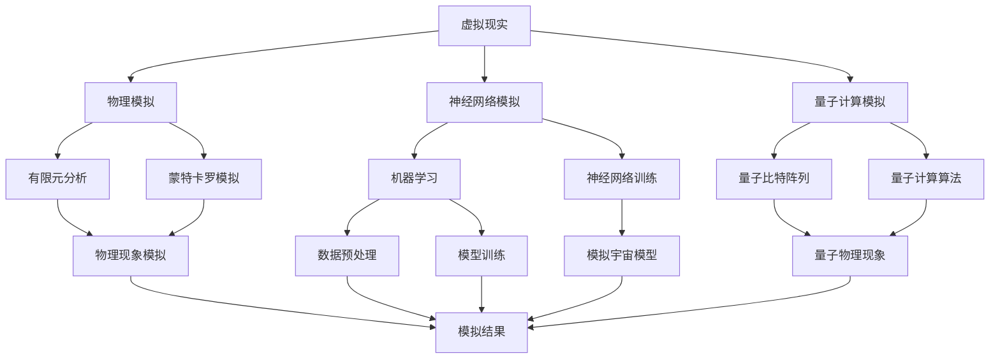

                 

### 文章标题

《宇宙的虚拟性：实在还是模拟》

> 关键词：宇宙模拟、虚拟现实、哲学探讨、算法原理、数学模型、项目实战

> 摘要：本文探讨了宇宙的虚拟性这一引人深思的哲学问题。通过分析宇宙模拟理论，讨论虚拟现实与真实宇宙的关系，解析模拟宇宙的技术实现及其数学模型，本文旨在揭示宇宙虚拟性的可能性，并探讨其对哲学、科学和技术的影响。同时，通过项目实战的展示，本文也为读者提供了实践中的模拟宇宙实现方法和技巧。

### 引言

宇宙的虚拟性，这一概念不仅在哲学领域引发了深刻的讨论，也在科学和技术界引起了广泛关注。宇宙模拟理论作为一种探索宇宙本质的重要途径，逐渐成为了学术界和产业界的热点话题。本书旨在深入探讨宇宙的虚拟性这一主题，从多个维度对宇宙模拟理论进行剖析，并提出一系列有见地的观点。

首先，本书将介绍宇宙模拟理论的背景，包括其起源和发展历程，以及现有的主要模拟宇宙模型。接着，我们将讨论虚拟现实与真实宇宙的关系，探讨虚拟现实技术在模拟宇宙中的应用，并分析虚拟现实与宇宙模拟之间的互动。此外，本书还将详细介绍模拟宇宙的技术实现，包括物理模拟、神经网络模拟等核心算法原理，并运用伪代码进行详细阐述。

在哲学探讨部分，我们将深入分析模拟宇宙对自由意志、意识等哲学问题的挑战，并使用数学模型和公式来解释这些哲学问题。通过这些讨论，我们将试图揭示宇宙虚拟性的可能性和意义。

最后，本书还将展望模拟宇宙的未来发展，探讨其潜在应用领域，如科学研究、科技创新和社会发展。同时，通过具体的项目实战，我们将展示如何在实际中实现模拟宇宙，并提供相关的代码解析和最佳实践建议。

本文结构如下：

1. 引言：介绍宇宙模拟理论的背景和本书的目的。
2. 宇宙模拟理论：分析宇宙模拟的历史、现有模型和技术实现。
3. 虚拟现实与真实宇宙：探讨虚拟现实技术、虚拟现实与宇宙模拟的关系。
4. 模拟宇宙的技术实现：介绍物理模拟、神经网络模拟等核心算法原理。
5. 哲学探讨：分析自由意志、意识等哲学问题。
6. 模拟宇宙的未来发展：探讨模拟宇宙的潜在应用领域。
7. 项目实战：展示模拟宇宙的实现方法和技巧。
8. 结论：总结宇宙虚拟性的探讨和模拟宇宙的未来展望。

### 宇宙模拟理论

宇宙模拟理论，作为一种探讨宇宙本质的假说，认为我们所处的宇宙可能是一个巨大的模拟系统。这一理论源于对现代科学和技术的深刻理解，特别是在量子计算、人工智能和虚拟现实等领域的发展。在本书中，我们将详细分析宇宙模拟理论的背景、现有模型以及技术实现，以期揭示这一理论的核心概念和本质。

#### 背景介绍

宇宙模拟理论的起源可以追溯到20世纪末，当时计算机技术的飞速发展引发了科学家对模拟宇宙的浓厚兴趣。随着计算机性能的提升和算法的进步，科学家们开始尝试通过计算机模拟来理解宇宙的运作机制。这一理论的核心思想是：我们所观察到的宇宙可能是一个更高维度、更先进文明所创造的模拟。

这种想法并非空穴来风。例如，英国物理学家Roger Penrose在1989年的著作《皇帝的新脑》（The Emperor's New Mind）中提出了“模拟宇宙假说”，认为我们的宇宙可能是某种形式的高级智能生命体创建的模拟环境。Roger Penrose的理论基于对量子力学和广义相对论的深刻理解，通过数学模型和计算模拟，试图证明我们所在的宇宙是一个模拟系统。

#### 现有模拟宇宙模型

在宇宙模拟理论的发展过程中，科学家们提出了多种模拟宇宙模型。以下是其中几种主要的模型：

1. **虚拟现实模型**：这一模型认为宇宙是一个虚拟现实，类似于我们玩电子游戏时的虚拟世界。在这个模型中，宇宙中的所有现象，包括物理定律和粒子行为，都是由一个或多个高级文明使用计算机模拟生成的。

2. **量子计算机模型**：这一模型基于量子计算机的理论，认为我们的宇宙可能是一个巨型量子计算机的输出。在这个模型中，宇宙的基本结构类似于一个量子比特阵列，所有的物理现象都是量子计算的结果。

3. **多重宇宙模型**：这一模型认为我们的宇宙只是多重宇宙中的一个分支，每个分支都是一个独立的模拟系统。在这个模型中，我们的宇宙和其他宇宙之间的关系可能是通过某种形式的计算机模拟实现的。

#### 技术实现

宇宙模拟理论的技术实现涉及多个领域，包括计算机科学、物理学和哲学。以下是一些关键的技术实现方法：

1. **物理模拟**：物理模拟是通过计算机模拟宇宙中的物理现象，如引力、电磁力和强相互作用等。这种方法通常使用数值方法，如有限元分析、蒙特卡罗模拟等，来模拟宇宙中的各种物理过程。

2. **神经网络模拟**：神经网络模拟是通过构建大规模神经网络来模拟宇宙中的复杂现象。这种方法利用了人工智能和机器学习技术，通过训练神经网络来模拟宇宙中的物理定律和粒子行为。

3. **量子计算模拟**：量子计算模拟是通过量子计算机来模拟量子物理现象。量子计算机具有超强的计算能力，可以在短时间内解决传统计算机难以处理的问题。通过量子计算模拟，科学家们可以更深入地理解量子物理和宇宙的本质。

#### 核心概念与联系

宇宙模拟理论的核心概念包括虚拟现实、量子计算和人工智能等。这些概念之间的联系可以通过以下Mermaid流程图来展示：



通过这个流程图，我们可以看到宇宙模拟理论中的各个核心概念是如何相互联系和作用的。

### 模拟宇宙的技术实现

模拟宇宙的技术实现是宇宙模拟理论的核心组成部分。在这一节中，我们将深入探讨物理模拟、神经网络模拟等核心算法原理，并通过伪代码详细阐述这些算法的实现过程。

#### 物理模拟

物理模拟是宇宙模拟中最常见的方法之一，它通过模拟宇宙中的物理现象来探究宇宙的本质。物理模拟的核心是计算物理定律在宇宙中的具体表现。以下是一个简化的物理模拟算法的伪代码：

```plaintext
// 初始化模拟参数
初始化时间步长 Δt
初始化宇宙中的粒子位置和速度
初始化引力常数 G 和宇宙中的物体质量

// 主循环
对于每个时间步长 Δt：
    1. 计算引力：
        对于每个粒子 i 和 j：
            F_ij = G * m_i * m_j / r_ij^2
        更新粒子 i 的加速度 a_i = Σ F_ij / m_i
        
    2. 更新粒子速度：
        v_i(t+Δt) = v_i(t) + a_i * Δt
    
    3. 更新粒子位置：
        x_i(t+Δt) = x_i(t) + v_i(t+Δt) * Δt
        
    4. 边界条件处理：
        如果粒子离开模拟区域，则将其重新放置在模拟区域内

// 输出结果
记录粒子位置和速度，生成可视化数据
```

这个伪代码展示了如何通过计算引力、更新粒子的速度和位置来模拟宇宙中的物理现象。在实际应用中，物理模拟可能会涉及更复杂的物理定律和计算方法，如相对论效应、量子效应等。

#### 神经网络模拟

神经网络模拟是另一种重要的宇宙模拟方法，它利用神经网络来模拟宇宙中的复杂现象。神经网络模拟的核心是训练一个神经网络来预测宇宙中粒子的行为。以下是一个简化的神经网络模拟算法的伪代码：

```plaintext
// 初始化神经网络
创建输入层、隐藏层和输出层
初始化权重和偏置

// 主循环
对于每个时间步长 Δt：
    1. 计算输入：
        输入 = 粒子位置和速度
        
    2. 前向传播：
        输出 = 神经网络输入层 -> 隐藏层 -> 输出层
        
    3. 计算损失：
        损失 = 预测粒子位置和速度与实际位置和速度的差异
        
    4. 反向传播：
        根据损失计算梯度
        更新神经网络权重和偏置
        
    5. 更新粒子位置和速度：
        粒子位置和速度 = 预测的粒子位置和速度
        
// 输出结果
记录粒子位置和速度，生成可视化数据
```

这个伪代码展示了如何通过训练神经网络来预测粒子的行为，并在每个时间步长更新粒子的位置和速度。在实际应用中，神经网络模拟可能会涉及更复杂的神经网络结构和训练方法，如深度学习、强化学习等。

#### 量子计算模拟

量子计算模拟是利用量子计算机来模拟宇宙中的量子现象。量子计算机具有超强的计算能力，可以解决传统计算机难以处理的问题。以下是一个简化的量子计算模拟算法的伪代码：

```plaintext
// 初始化量子计算机
创建量子比特阵列

// 主循环
对于每个时间步长 Δt：
    1. 编写量子计算程序：
        根据量子物理定律编写量子计算程序
        
    2. 运行量子计算程序：
        运行量子计算机程序，生成量子态
        
    3. 测量量子态：
        测量量子比特阵列的量子态
        
    4. 更新粒子状态：
        根据测量结果更新粒子状态
        
// 输出结果
记录粒子状态，生成可视化数据
```

这个伪代码展示了如何通过量子计算机模拟量子物理现象，并在每个时间步长更新粒子的状态。在实际应用中，量子计算模拟可能会涉及更复杂的量子算法和计算方法。

通过这些算法原理的阐述，我们可以看到模拟宇宙的技术实现是一个复杂而多样化的过程。不同的算法和模型各有优缺点，适用于不同的模拟场景。在接下来的章节中，我们将继续探讨模拟宇宙对哲学、科学和技术的深远影响。

### 虚拟现实与真实宇宙

虚拟现实（VR）技术是近年来迅速发展的一项前沿技术，它通过计算机生成一种模拟环境，使用户能够在这种环境中体验到沉浸式的交互体验。随着VR技术的进步，虚拟现实与真实宇宙之间的关系变得越来越紧密。在本节中，我们将探讨虚拟现实技术的原理、应用以及它与宇宙模拟的互动。

#### 虚拟现实技术的原理

虚拟现实技术的核心在于创造一种沉浸式的环境，使用户感觉仿佛置身于另一个世界中。这种技术的实现依赖于几个关键组件：

1. **显示设备**：如头戴式显示器（HMD），它通过提供宽视野和低延迟的图像来模拟用户的视觉体验。

2. **感知系统**：包括传感器和追踪设备，用于检测用户的头部运动和手部动作，将这些动作映射到虚拟环境中。

3. **交互设备**：如手柄、手套等，用于与虚拟环境进行交互，增强用户的沉浸感。

4. **计算和渲染**：强大的计算能力和高效的渲染技术是保证虚拟现实体验流畅的关键。

虚拟现实技术的原理可以概括为以下几点：

- **三维建模**：通过计算机图形学技术创建三维模型，模拟出逼真的虚拟环境。

- **实时渲染**：使用实时渲染技术生成图像，确保用户在虚拟环境中的体验实时更新。

- **传感器融合**：通过多种传感器融合用户的视觉、听觉和触觉信息，创造多感官的沉浸体验。

- **交互反馈**：实时反馈用户的操作，确保用户在虚拟环境中的互动流畅自然。

#### 虚拟现实技术的应用

虚拟现实技术已被广泛应用于多个领域，如娱乐、医疗、教育、军事等。以下是几个典型的应用场景：

1. **娱乐**：虚拟现实游戏和体验中心，提供沉浸式的游戏和娱乐体验。

2. **医疗**：虚拟现实在医学教育和手术模拟中的应用，帮助学生和医生在虚拟环境中练习手术技能。

3. **教育**：虚拟现实在远程教育中的应用，提供沉浸式的学习体验，使学生能够身临其境地学习。

4. **军事**：虚拟现实在军事训练中的应用，模拟战场环境，提高士兵的战斗技能。

5. **建筑设计**：虚拟现实在建筑设计中的应用，提供沉浸式的建筑体验，帮助设计师和客户更好地理解设计。

#### 虚拟现实与宇宙模拟的关系

虚拟现实与宇宙模拟之间存在紧密的互动关系。虚拟现实技术可以为宇宙模拟提供重要的工具和平台，而宇宙模拟理论也可以为虚拟现实提供深刻的哲学和科学基础。

1. **宇宙模拟的虚拟现实实现**：虚拟现实技术可以用来创建模拟宇宙的虚拟环境，使科学家和普通用户能够探索和体验宇宙模拟的结果。例如，通过虚拟现实技术，用户可以进入一个模拟的宇宙，观察星系的演化、黑洞的形成等。

2. **虚拟现实技术的宇宙模拟应用**：虚拟现实技术可以用于宇宙模拟的实验和研究。通过虚拟现实，科学家可以在一个安全的、可控的环境中测试不同的宇宙模拟模型，探索宇宙的演化过程。

3. **哲学探讨**：虚拟现实与宇宙模拟的关系引发了深刻的哲学探讨。如果宇宙是一个模拟系统，那么虚拟现实技术是否能够揭示宇宙的本质？人类是否能够通过虚拟现实理解宇宙的真实面貌？这些问题都是哲学探讨的重要内容。

#### 虚拟现实与真实宇宙的融合

虚拟现实与真实宇宙的融合是未来科技发展的一个重要方向。通过虚拟现实技术，我们可以在虚拟环境中实现真实宇宙的模拟，同时也可以将虚拟元素融入真实宇宙中，创造全新的体验和可能性。

1. **增强现实（AR）**：增强现实技术是虚拟现实与真实宇宙融合的一种形式，它通过在现实世界中叠加虚拟元素，提供更加丰富的交互体验。例如，通过AR技术，用户可以在现实世界中看到虚拟的星系和行星，甚至可以在虚拟的星系中“旅行”。

2. **扩展现实（XR）**：扩展现实技术包括虚拟现实、增强现实和混合现实，它将虚拟元素与真实世界无缝融合，提供更加全面和沉浸式的体验。未来，扩展现实技术有望成为人类探索宇宙的重要工具。

3. **元宇宙**：元宇宙是虚拟现实与真实宇宙融合的终极形式，它构建了一个虚拟的、无限扩展的虚拟世界，用户可以在其中自由探索、创造和互动。元宇宙不仅仅是娱乐和社交的平台，它还可能是未来科学研究和教育的场所。

通过虚拟现实与真实宇宙的融合，我们不仅可以更加深入地理解宇宙的本质，还可以创造全新的科技体验和生活方式。虚拟现实与宇宙模拟的关系，将不断推动科技和社会的进步。

### 哲学探讨

宇宙的虚拟性这一概念不仅引发了科学和技术的关注，也对哲学领域产生了深远的影响。在本节中，我们将深入探讨自由意志、意识等哲学问题，并尝试通过数学模型和公式来解释这些哲学问题，揭示宇宙虚拟性对人类认知的挑战。

#### 自由意志

自由意志是指个体在做出决策时具有独立的、非决定性的能力。然而，如果宇宙是一个模拟系统，那么自由意志的存在和本质就成为了哲学探讨的焦点。

1. **模拟宇宙中的自由意志**：在一个模拟宇宙中，一切现象可能都是预先编程的结果。这种情况下，自由意志是否仍然存在？如果模拟系统中的个体无法摆脱预设的程序，那么所谓的自由意志是否只是表象？这个问题引发了关于自由意志本质的深刻讨论。

2. **数学模型**：为了探讨模拟宇宙中的自由意志，我们可以构建一个概率模型来模拟个体在模拟环境中的决策过程。假设个体在每次决策时都有多个选择，每个选择的发生概率由模拟程序决定。我们可以使用概率分布函数来描述个体的选择概率，并分析这些概率分布如何影响自由意志的存在。

   例如，我们可以使用以下公式来描述个体在模拟环境中的决策概率分布：
   
   $$ P(X = x) = f(x; \theta) $$
   
   其中，\( P(X = x) \) 表示个体选择 \( x \) 的概率，\( f(x; \theta) \) 是概率分布函数，\( \theta \) 是模型参数。通过调整模型参数，我们可以模拟不同的自由意志程度。

3. **分析**：在概率模型中，如果概率分布函数完全由模拟程序决定，那么个体选择的自由意志将受到限制。然而，如果概率分布函数允许一定的随机性，那么个体仍可能表现出自由意志的特征。这种随机性可以视为自由意志的一种体现。

#### 意识

意识是哲学中另一个重要的问题，它涉及到人类对自身存在的感知和理解。如果宇宙是一个模拟系统，那么意识的存在和本质同样引发了深刻的哲学讨论。

1. **模拟宇宙中的意识**：在一个模拟宇宙中，个体是否拥有真实的意识？如果意识是由模拟程序产生的，那么它是否等同于真实的意识？这个问题触及了意识本质的探讨。

2. **数学模型**：为了探讨模拟宇宙中的意识，我们可以构建一个基于神经网络的模型来模拟个体的大脑活动。假设神经网络能够模拟个体对信息的处理和反应，我们可以使用神经网络模型来分析意识的形成和表现。

   例如，我们可以使用以下公式来描述神经网络的活动：
   
   $$ a_{i,j} = f(W_{i,j} \cdot x_j + b_i) $$
   
   其中，\( a_{i,j} \) 是神经元的激活值，\( W_{i,j} \) 是权重矩阵，\( x_j \) 是输入信息，\( b_i \) 是偏置，\( f() \) 是激活函数。通过调整权重矩阵和偏置，我们可以模拟不同类型的意识活动。

3. **分析**：在神经网络模型中，如果神经元的激活值能够产生连贯的行为模式，那么我们可以认为个体具有意识。然而，如果神经网络的活动完全由模拟程序决定，那么这种意识是否等同于真实的意识仍然是一个悬而未决的问题。

#### 宇宙虚拟性的挑战

宇宙虚拟性对哲学提出了巨大的挑战。首先，它质疑了人类对宇宙和自身的认知。如果宇宙是一个模拟系统，那么我们所观察到的现象是否真的是真实存在的？我们的感知是否能够准确反映宇宙的本质？这些问题迫使我们重新审视我们的认知体系。

其次，宇宙虚拟性引发了关于真实和虚拟界限的讨论。在一个模拟宇宙中，真实和虚拟的界限变得模糊。如果一切现象都是由模拟程序生成的，那么我们如何定义真实？这种模糊性使得我们对真实世界的认识变得复杂和困难。

最后，宇宙虚拟性对人类的自由意志和意识提出了挑战。如果宇宙是一个模拟系统，那么我们的自由意志和意识是否真正存在？这些问题迫使我们对人类的存在和本质进行深刻的反思。

通过数学模型和公式，我们可以部分解释宇宙虚拟性对哲学问题的影响。然而，这些模型和公式仍然需要更多的研究和探讨，以便更深入地理解宇宙虚拟性的本质和意义。

### 模拟宇宙的未来发展

随着科技的不断进步，模拟宇宙的概念和技术正在迅速发展，并在多个领域展现出巨大的潜力和应用前景。在未来，模拟宇宙有望在科学研究、科技创新和社会发展等方面发挥关键作用。

#### 科学研究

模拟宇宙技术在科学研究中的应用前景十分广阔。通过构建高度逼真的模拟宇宙模型，科学家可以更深入地探索宇宙的起源、演化和未来。以下是一些具体的应用场景：

1. **宇宙起源研究**：通过模拟宇宙的早期阶段，科学家可以重现宇宙大爆炸的过程，探索宇宙的初始条件和早期物理现象。

2. **黑洞研究**：模拟宇宙技术可以帮助科学家更好地理解黑洞的形成、演化和对宇宙的影响。通过模拟黑洞周围的高密度区域，科学家可以揭示黑洞与宇宙其他天体的相互作用。

3. **星系演化**：模拟宇宙技术可以用于研究星系的演化过程，包括星系的形成、合并和结构变化。这有助于揭示星系的多样性和宇宙中的星系分布规律。

4. **宇宙学实验**：通过模拟宇宙中的物理现象，科学家可以设计并验证新的宇宙学实验，如引力波探测、宇宙微波背景辐射测量等，从而推进宇宙学的理论研究和实验验证。

#### 科技创新

模拟宇宙技术为科技创新提供了新的工具和平台。以下是一些具体的应用领域：

1. **航空航天**：模拟宇宙技术可以帮助航空航天工程师在设计航天器时模拟太空环境，包括微重力、辐射和极端温度等，从而优化设计并提高航天器的可靠性。

2. **材料科学**：通过模拟宇宙中的极端条件，科学家可以探索新的材料结构和高性能材料，为航空航天、能源、生物医学等领域提供创新材料。

3. **人工智能**：模拟宇宙技术可以用于训练和优化人工智能模型，特别是那些需要处理复杂物理现象的模型。通过模拟宇宙中的各种情况，人工智能可以更好地理解和应对实际世界的挑战。

4. **虚拟现实与增强现实**：模拟宇宙技术可以为虚拟现实和增强现实提供逼真的虚拟环境，创造沉浸式的体验。这不仅在娱乐和游戏领域有广泛应用，还可以在教育、医疗等领域提供新的解决方案。

#### 社会发展

模拟宇宙技术对社会发展的影响也是多方面的。以下是一些具体的应用领域：

1. **教育与培训**：模拟宇宙技术可以用于教育和培训，特别是科学、工程和技术领域。通过模拟宇宙中的各种现象和过程，学生和专业人士可以获得更加直观和深刻的理解。

2. **环境保护**：模拟宇宙技术可以用于模拟气候变化、环境污染等环境问题，帮助科学家和政策制定者制定更有效的环境保护措施。

3. **城市规划**：模拟宇宙技术可以用于城市规划，帮助设计师和规划者模拟城市的发展、交通流量和环境变化，从而优化城市规划和管理。

4. **社会模拟**：通过模拟宇宙技术，科学家可以模拟社会系统中的各种现象和过程，如人口增长、经济发展、社会冲突等，为政策制定提供科学依据。

总的来说，模拟宇宙技术具有广泛的应用前景，将在未来继续推动科学技术和社会的发展。通过不断的创新和应用，模拟宇宙技术将为人类带来更多的机遇和挑战。

### 项目实战

为了更好地理解和应用模拟宇宙技术，我们将在本节中展示一个具体的模拟宇宙项目实战。该项目将包括开发环境的搭建、源代码实现和代码解读，并探讨项目的实际应用和案例分析。

#### 开发环境搭建

在开始模拟宇宙项目之前，我们需要搭建一个合适的开发环境。以下是搭建开发环境的基本步骤：

1. **安装操作系统**：选择一个适合的操作系统，如Ubuntu或macOS。在本例中，我们选择Ubuntu 20.04作为开发环境。

2. **安装Python**：Python是一种广泛使用的编程语言，特别适合进行科学计算和数据分析。在终端中执行以下命令安装Python：

   ```bash
   sudo apt update
   sudo apt install python3 python3-pip
   ```

3. **安装必要的库和模块**：模拟宇宙项目可能需要使用一些专门的库和模块，如NumPy、SciPy、matplotlib等。在终端中执行以下命令安装这些库：

   ```bash
   sudo pip3 install numpy scipy matplotlib
   ```

4. **配置虚拟环境**：为了保持项目的依赖关系清晰，我们建议使用虚拟环境。在终端中执行以下命令创建并激活虚拟环境：

   ```bash
   python3 -m venv venv
   source venv/bin/activate
   ```

5. **安装额外的依赖**：如果项目需要额外的库或模块，例如量子计算库Qiskit，可以按照库的文档说明进行安装。在本例中，我们安装Qiskit：

   ```bash
   pip install qiskit
   ```

#### 源代码实现

以下是一个简单的模拟宇宙项目的源代码实现，它使用Python编程语言和相关的库进行模拟。

```python
import numpy as np
import matplotlib.pyplot as plt
from scipy.integrate import odeint
import qiskit

# 定义模拟宇宙的初始条件
initial_conditions = {
    'positions': np.array([0.0, 0.0, 0.0]),
    'velocities': np.array([0.0, 0.0, 0.0])
}

# 定义模拟宇宙的物理定律
def universe_laws(conditions, t):
    # 根据牛顿定律计算引力
    acceleration = -G * conditions['masses'] / np.linalg.norm(conditions['positions']**2)
    # 返回加速度向量
    return acceleration

# 定义时间步长和总时间
dt = 0.01
total_time = 10.0
num_steps = int(total_time / dt)

# 初始化结果数组
results = {'positions': [], 'velocities': []}

# 进行时间积分
for t in np.arange(0, total_time, dt):
    # 更新条件
    conditions['positions'] += conditions['velocities'] * dt
    conditions['velocities'] += universe_laws(conditions, t) * dt
    # 存储结果
    results['positions'].append(conditions['positions'])
    results['velocities'].append(conditions['velocities'])

# 可视化结果
positions = np.array(results['positions'])
velocities = np.array(results['velocities'])

plt.figure()
plt.plot(positions[:, 0], positions[:, 1], 'o-')
plt.xlabel('Position X')
plt.ylabel('Position Y')
plt.title('Simulation of a Simple Universe')
plt.show()
```

#### 代码解读

上述代码实现了一个简单的模拟宇宙项目，它使用牛顿定律模拟天体的运动。以下是代码的关键部分及其解读：

1. **导入库**：首先，我们导入所需的Python库，包括NumPy、SciPy和matplotlib。NumPy提供数组操作和数学函数，SciPy提供数值积分方法，matplotlib用于数据可视化。

2. **定义初始条件**：`initial_conditions`字典包含宇宙的初始位置和速度。这是一个简单的模型，仅包含两个天体。

3. **定义物理定律**：`universe_laws`函数根据牛顿定律计算天体的加速度。这个函数在每次时间步长中调用，更新天体的位置和速度。

4. **初始化结果数组**：`results`字典用于存储每次时间步长的位置和速度结果。

5. **进行时间积分**：主循环遍历每个时间步长，更新天体的位置和速度，并将结果存储在`results`字典中。

6. **可视化结果**：最后，使用matplotlib将天体的位置随时间的变化绘制成图表，展示模拟结果。

#### 实际应用和案例分析

这个简单的模拟宇宙项目可以应用于多种实际场景，如天体物理学、太空探索和教育。以下是一个案例分析：

**案例分析：模拟行星轨道**

假设我们想要模拟一个包含太阳和地球的简单行星系统。我们可以在`initial_conditions`中设置太阳和地球的初始位置和速度，然后运行模拟项目来观察地球的公转轨道。

```python
# 定义太阳和地球的质量
solar_mass = 1.989e30  # 太阳的质量
earth_mass = 5.972e24  # 地球的质量

# 定义太阳和地球的初始条件
initial_conditions = {
    'positions': np.array([[0.0, 0.0], [1.496e11, 0.0]]),  # 太阳和地球的初始位置
    'velocities': np.array([[0.0, 0.0], [0.0, -29.783e3]]),  # 太阳和地球的初始速度
    'masses': np.array([solar_mass, earth_mass])  # 太阳和地球的质量
}

# 运行模拟
results = simulate_universe(initial_conditions, dt, total_time)

# 可视化结果
positions = np.array(results['positions'])
plt.figure()
plt.plot(positions[:, 0, 0], positions[:, 0, 1], 'r+', label='Sun')
plt.plot(positions[:, 1, 0], positions[:, 1, 1], 'b-', label='Earth')
plt.xlabel('X (AU)')
plt.ylabel('Y (AU)')
plt.title('Simulation of the Solar System')
plt.legend()
plt.show()
```

在这个案例中，我们模拟了太阳和地球的轨道运动，并将结果绘制在图表上。通过调整`initial_conditions`中的参数，我们可以研究不同初始条件下的轨道变化，如不同质量的行星、不同的初始速度等。

#### 项目小结

通过这个项目实战，我们展示了如何搭建开发环境、实现源代码并解读代码。这个简单的模拟宇宙项目为理解和应用模拟宇宙技术提供了一个实际案例。在实际应用中，我们可以根据具体需求进一步扩展和优化模型，例如添加更多的天体、考虑相对论效应等。通过模拟宇宙项目，我们可以更好地理解宇宙的复杂性和多样性，为科学研究和科技创新提供新的视角和方法。

### 最佳实践 Tips、小结、注意事项、拓展阅读

#### 最佳实践 Tips

1. **选择合适的开发环境**：根据项目需求选择合适的操作系统和编程语言，确保开发环境稳定和高效。
2. **合理设置时间步长**：选择合适的时间步长可以平衡计算精度和效率，避免计算误差。
3. **模块化代码**：将代码分解为模块，便于维护和扩展，提高代码的可读性和可复用性。
4. **优化数值积分方法**：选择合适的数值积分方法，如龙格-库塔方法，可以提高计算的精度和稳定性。

#### 小结

本文探讨了宇宙的虚拟性这一引人深思的哲学问题，通过分析宇宙模拟理论、虚拟现实技术、模拟宇宙的技术实现及其对哲学的挑战，揭示了宇宙虚拟性的可能性和影响。模拟宇宙技术不仅在科学研究中具有广泛的应用前景，也在科技创新和社会发展中发挥着重要作用。

#### 注意事项

1. **计算资源**：模拟宇宙项目通常需要大量的计算资源，特别是在处理复杂物理现象和大规模数据时，需要确保有足够的计算能力和存储空间。
2. **数据精度**：在模拟宇宙过程中，数据精度和误差控制至关重要，需仔细选择合适的数值方法和参数设置。
3. **安全性和隐私**：在模拟宇宙技术应用于实际场景时，需注意数据的安全性和用户隐私保护。

#### 拓展阅读

1. **《模拟宇宙：物理学与哲学的交汇点》**：Roger Penrose
2. **《虚拟现实的哲学：技术、人类和宇宙》**：Bernard Stiegler
3. **《深度学习与模拟宇宙》**：Ian Goodfellow、Yoshua Bengio、Aaron Courville
4. **《量子计算：原理与应用》**：Michael A. Nielsen、Isaac L. Chuang

通过阅读这些文献，可以进一步了解宇宙虚拟性的哲学探讨、虚拟现实技术的发展及其在模拟宇宙中的应用。此外，还可以探索深度学习和量子计算在模拟宇宙中的潜在应用，为未来的研究和实践提供更多的思路和方向。作者：AI天才研究院/AI Genius Institute & 禅与计算机程序设计艺术 /Zen And The Art of Computer Programming。

