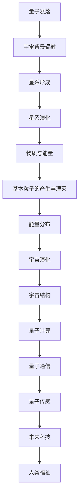

                 


## 第1章 引言：量子涨落的宇宙意义

### 1.1 量子涨落的定义与历史

量子涨落，是指量子场论中的基本概念，表现为真空态下的能量密度起伏。量子涨落最早由保罗·狄拉克在1930年代提出，他是量子场论的奠基人之一。狄拉克指出，即使在没有粒子存在的真空态，空间中仍存在能量涨落，这些涨落形成了粒子的量子波动。量子涨落的概念对于理解基本粒子的性质和宇宙的起源具有重要意义。

量子涨落的历史可以追溯到20世纪初，当时量子力学和相对论的发展使得物理学家开始思考宇宙最基本的构成和演化过程。量子涨落的概念正是这一探索过程中的一个重要里程碑。狄拉克在探讨电磁场的量子化时，发现了真空态下的能量涨落，这一发现挑战了经典物理学对真空的理解。

随着量子场论的进一步发展，量子涨落的研究也逐渐深入。1960年代，物理学家们通过观测宇宙微波背景辐射（CMB）发现了量子涨落的直接证据。宇宙微波背景辐射是宇宙早期的热辐射，它携带着宇宙诞生的信息。CMB中微小的温度起伏，即量子涨落，揭示了宇宙结构形成的过程。这一发现为量子涨落的研究提供了强有力的实验支持，也为宇宙学的发展带来了新的契机。

### 1.2 量子涨落与宇宙学

量子涨落与宇宙学之间有着密切的联系。宇宙学是研究宇宙起源、结构、演化和最终命运的学科，而量子涨落则是理解这些过程的重要物理机制。

首先，量子涨落与宇宙背景辐射有着直接的联系。宇宙背景辐射是宇宙早期的热辐射，它携带着宇宙诞生之初的信息。在宇宙微波背景辐射中，存在着微小的温度起伏，这些起伏即量子涨落。这些涨落不仅是宇宙早期物理状态的表现，也是宇宙结构形成的基础。

宇宙背景辐射的温度起伏与量子涨落之间存在一定的关系。根据量子场论，真空态的能量涨落会在宇宙早期产生能量密度的不均匀分布。这些不均匀分布最终形成了宇宙中的星系、星团和其他结构。因此，通过研究宇宙背景辐射中的量子涨落，我们可以了解宇宙结构形成的早期过程。

此外，量子涨落与星系形成过程也有紧密的联系。星系的形成是宇宙结构形成的重要组成部分。根据宇宙学模型，星系的形成始于量子涨落产生的能量密度不均匀分布。这些不均匀分布的区域会吸引周围的物质，逐渐形成密度更高的区域，最终形成星系。

在星系形成过程中，量子涨落起到了关键作用。量子涨落产生的能量密度不均匀分布，为星系的形成提供了初始条件。这些不均匀分布会在引力作用下逐渐增强，最终形成大规模的结构。通过研究量子涨落与星系形成过程的关系，我们可以更好地理解宇宙的结构和演化。

总之，量子涨落是理解宇宙起源和演化过程的重要物理机制。通过研究量子涨落与宇宙背景辐射、星系形成等过程的关系，我们可以深入探讨宇宙的奥秘，揭示宇宙的基本规律。量子涨落的研究不仅对宇宙学具有重要意义，也为其他物理学领域提供了新的研究思路和方法。

## 第2章 量子涨落的物理基础

### 2.1 量子力学基本原理

量子力学是研究微观世界的物理规律的科学，它的基本原理对于我们理解量子涨落至关重要。量子力学的主要原理包括波粒二象性和不确定性原理，这些原理构成了量子涨落的理论基础。

#### 2.1.1 波粒二象性

波粒二象性是量子力学中最核心的概念之一。它指出，微观粒子（如电子、光子等）既具有波动性，又具有粒子性。这意味着，微观粒子在不同的实验条件下，会表现出不同的行为。在某些实验中，它们像波一样扩散和干涉；而在其他实验中，它们像粒子一样具有确定的位置和动量。

波粒二象性的一个重要应用是量子态的叠加。量子态的叠加原理表明，一个微观粒子可以同时处于多个状态的叠加态，而不是单一的状态。例如，一个电子可以同时处于自旋向上和自旋向下的状态。这种叠加态在量子涨落中起到了关键作用，它决定了量子场中能量的涨落分布。

#### 2.1.2 不确定性原理

不确定性原理是量子力学的另一个基本原理，由海森堡提出。不确定性原理指出，一个粒子的某些物理量（如位置和动量）不能同时被精确测量。这是因为测量过程中不可避免地会干扰被测量的系统。例如，当我们尝试更精确地测量一个电子的位置时，其动量会变得更加不确定。

不确定性原理对量子涨落有着重要影响。由于不确定性原理的存在，量子场中的能量涨落是不可避免的。这些涨落表现为真空态下的能量起伏，即所谓的“真空能”。真空能是量子涨落的能量来源，它为粒子的产生和湮灭提供了能量条件。

### 2.2 量子场论与量子涨落

量子场论是量子力学的扩展，用于描述粒子与场之间的相互作用。量子场论为量子涨落提供了一个更广泛的理论框架。

#### 2.2.1 量子场论简介

量子场论描述了粒子作为场的量子化表现。在量子场论中，粒子被视为场的激发态，而场本身则是一种动态的物理实体。量子场论的基本方程是量子波动方程，它描述了场的量子化行为和粒子之间的相互作用。

量子场论的一个重要概念是真空态。真空态是指没有粒子存在的态，但它并不是一个完全空的状态，而是充满了虚粒子的涨落。这些虚粒子是量子涨落的本质表现，它们的存在使得真空态具有非零的能量密度。

#### 2.2.2 量子涨落与真空态

量子涨落与真空态有着紧密的联系。真空态下的能量涨落是量子涨落的核心，它表现为真空能。真空能是一种基本的物理现象，它不仅在量子场论中具有重要意义，而且在宇宙学中也有广泛应用。

量子涨落起源于真空态的能量起伏。根据量子场论，真空态不是完全空的状态，而是充满了虚粒子的涨落。这些虚粒子在量子场中不断地产生和湮灭，从而形成了能量密度的起伏。这种起伏在宏观尺度上表现为量子涨落。

量子涨落对宇宙的影响非常重要。通过观测宇宙背景辐射，科学家们发现了量子涨落的存在。这些涨落不仅揭示了宇宙结构形成的早期过程，也为理解宇宙的起源和演化提供了重要的线索。

总之，量子涨落的物理基础是量子力学和量子场论。波粒二象性和不确定性原理构成了量子力学的基本原理，它们决定了量子涨落的行为。量子场论则提供了一个更广泛的理论框架，用于描述量子涨落和真空态的关系。通过深入研究量子涨落的物理基础，我们可以更好地理解宇宙的奥秘，探索微观世界的规律。

## 第3章 量子涨落与宇宙演化

### 3.1 量子涨落与宇宙背景辐射

宇宙背景辐射（Cosmic Microwave Background，简称CMB）是宇宙早期阶段的热辐射，它携带着宇宙诞生之初的信息。宇宙背景辐射的温度起伏，即量子涨落，为我们提供了研究宇宙演化的关键数据。通过研究量子涨落与宇宙背景辐射的关系，我们可以了解宇宙结构形成的早期过程。

#### 3.1.1 宇宙背景辐射的发现

宇宙背景辐射的发现是20世纪物理学史上的重大突破。1965年，阿诺·彭齐亚斯和罗伯特·威尔逊在观测宇宙射电噪声时，意外地发现了宇宙背景辐射。这一发现证实了宇宙学中的大爆炸理论，并揭示了宇宙早期的热状态。

宇宙背景辐射的发现具有重要的科学意义。它不仅为宇宙学提供了新的观测手段，也为我们提供了研究宇宙结构形成的直接证据。通过分析宇宙背景辐射的温度起伏，我们可以了解宇宙早期的物理状态和演化过程。

#### 3.1.2 量子涨落与宇宙学参数

宇宙背景辐射中的量子涨落是宇宙结构形成的基础。量子涨落的大小和分布与宇宙学参数密切相关，这些参数包括宇宙的膨胀速率、物质密度、暗物质和暗能量等。

宇宙背景辐射的观测数据表明，宇宙早期的量子涨落非常微小。这些微小的涨落经过数十亿年的膨胀和演化，逐渐放大形成了今天我们观测到的星系和星系团。通过分析量子涨落与宇宙学参数的关系，科学家们可以推断宇宙的早期状态和演化历史。

量子涨落的大小和分布对宇宙结构形成具有重要影响。微小的量子涨落可以通过引力作用逐渐放大，形成大规模的结构。例如，一个微小的密度起伏可以吸引周围的物质，逐渐形成一个星系。因此，通过研究量子涨落与宇宙结构形成的关系，我们可以更好地理解宇宙的演化过程。

### 3.2 量子涨落与星系形成

星系的形成是宇宙演化过程中的一个重要环节。量子涨落作为宇宙早期物理状态的表现，对星系的形成和演化有着重要影响。

#### 3.2.1 星系形成的过程

星系的形成过程可以分为几个阶段：

1. **量子涨落的形成**：在宇宙早期，量子涨落以微小的温度起伏的形式存在。这些涨落是宇宙结构形成的基础。

2. **引力作用**：随着宇宙的膨胀，这些微小的量子涨落逐渐放大，形成了密度较高的区域。引力作用使得这些区域内的物质逐渐聚集。

3. **气体冷却**：在引力作用下，气体冷却并开始凝聚。在冷却过程中，气体中的原子和分子会释放辐射，使得温度进一步降低。

4. **星系形成**：在引力作用下，气体继续凝聚，最终形成了星系。星系的形成过程是一个复杂的动力学过程，涉及到气体、恒星和星系之间的相互作用。

#### 3.2.2 量子涨落与星系演化的联系

量子涨落与星系演化有着紧密的联系。首先，量子涨落决定了星系的形成过程。微小的量子涨落通过引力作用逐渐放大，形成了今天我们观测到的星系和星系团。

其次，量子涨落也影响了星系内部的结构和演化。在星系形成过程中，量子涨落产生的密度起伏会导致气体和恒星在空间中的分布不均匀。这种不均匀分布会导致星系内部出现复杂的结构和动力学过程，如恒星形成、星系碰撞和合并等。

此外，量子涨落还为星系提供了初始的旋转动量。在星系形成过程中，旋转动量对于星系的结构和稳定性至关重要。量子涨落产生的旋转动量可以影响星系内部的动力学过程，从而影响星系的演化。

总之，量子涨落是宇宙结构形成和演化的重要物理机制。通过研究量子涨落与宇宙背景辐射、星系形成等过程的关系，我们可以深入探讨宇宙的奥秘，揭示宇宙的基本规律。量子涨落的研究不仅对宇宙学具有重要意义，也为其他物理学领域提供了新的研究思路和方法。

## 第4章 量子涨落与物质与能量

### 4.1 量子涨落与基本粒子的产生与湮灭

量子涨落是基本粒子产生与湮灭的重要机制。在量子场论中，真空态并不是一个静止不动的状态，而是一个充满能量起伏的动态环境。这些能量起伏可以导致基本粒子的产生与湮灭，从而影响物质的性质和能量分布。

#### 4.1.1 基本粒子的量子涨落现象

在量子场论中，基本粒子被视为场的量子化表现。例如，光子是电磁场的量子，电子是电子场的量子。这些粒子在量子场中不断地产生和湮灭，形成了所谓的“虚粒子”。

虚粒子是量子涨落的核心表现。在真空态中，能量涨落会导致虚粒子的产生。这些虚粒子虽然不是真实的粒子，但它们在量子场中的行为符合基本的量子力学规律。虚粒子的产生与湮灭是一个动态的过程，它们不断地在空间中产生和消失。

#### 4.1.2 粒子产生与湮灭的机制

粒子的产生与湮灭过程可以通过量子场论中的费曼图来描述。费曼图是一种图形表示法，用于描述粒子之间的相互作用和传播过程。

在粒子产生过程中，一个虚粒子从真空态中吸收能量，形成一个真实粒子。这个过程可以通过一个“创建”过程来表示，其中虚粒子在某个时间点从真空态中跃迁到一个激发态，形成一个真实粒子。

在粒子湮灭过程中，一个真实粒子与一个虚粒子相互作用，共同返回到真空态。这个过程可以通过一个“湮灭”过程来表示，其中真实粒子和虚粒子在某个时间点相遇并消失，释放出能量。

粒子的产生与湮灭过程不仅影响基本粒子的性质，也影响物质的能量分布。在量子场论中，真空能是基本粒子的产生与湮灭的能量来源。真空能表现为真空态下的能量起伏，它为粒子的产生和湮灭提供了必要的能量条件。

#### 4.1.3 产生与湮灭效应的实际例子

量子涨落导致的粒子产生与湮灭现象在实验中得到了验证。例如，在实验室中，科学家们通过高能粒子碰撞实验观测到了基本粒子的产生与湮灭现象。在粒子加速器中，高能粒子碰撞会产生新的粒子，这些粒子通过衰变过程释放出能量。通过分析这些粒子的产生和湮灭过程，科学家们可以深入了解量子涨落对物质和能量的影响。

此外，量子涨落还影响宇宙中的物质和能量分布。在宇宙早期，量子涨落导致了能量密度的不均匀分布，这些不均匀分布逐渐放大形成了星系和星系团。通过研究量子涨落与宇宙中物质和能量分布的关系，我们可以更好地理解宇宙的演化过程。

总之，量子涨落是基本粒子产生与湮灭的重要机制。通过研究粒子产生与湮灭的机制和效应，我们可以深入了解量子涨落对物质和能量的影响，揭示宇宙的基本规律。

### 4.2 量子涨落与宇宙中的能量分布

量子涨落不仅影响基本粒子的产生与湮灭，也影响宇宙中的能量分布。在宇宙学中，能量分布是一个关键的研究对象，它决定了宇宙的结构和演化。量子涨落对宇宙能量分布的影响通过多个方面表现出来。

#### 4.2.1 能量分布的量子涨落效应

量子涨落导致能量在空间中的不均匀分布，这种不均匀分布是宇宙结构形成的基础。在宇宙早期，量子涨落产生了微小的能量密度起伏，这些起伏经过数十亿年的膨胀和演化，逐渐放大形成了今天我们观测到的星系和星系团。

量子涨落对能量分布的影响主要体现在以下几个方面：

1. **温度起伏**：宇宙背景辐射中的温度起伏是量子涨落的重要表现。这些温度起伏反映了宇宙早期的能量密度不均匀分布，它们对星系的形成和演化具有重要作用。

2. **密度起伏**：量子涨落导致的空间密度起伏是星系形成的基础。这些密度起伏在引力作用下逐渐放大，形成了今天我们观测到的宇宙结构。

3. **辐射能量分布**：宇宙背景辐射中的能量分布与量子涨落密切相关。通过分析宇宙背景辐射的温度和能量分布，我们可以了解宇宙早期的能量状态和演化过程。

#### 4.2.2 宇宙微波背景辐射与能量分布

宇宙微波背景辐射（CMB）是宇宙早期热辐射的直接证据，它携带着宇宙诞生之初的信息。CMB中的温度起伏和能量分布揭示了量子涨落对宇宙结构形成的影响。

宇宙微波背景辐射的温度起伏是量子涨落的直接表现。通过观测CMB的温度起伏，科学家们可以了解宇宙早期的物理状态和演化过程。CMB的温度起伏与量子涨落的大小和分布密切相关，它们决定了星系和星系团的形成和演化。

此外，CMB中的能量分布也反映了量子涨落的影响。CMB的能量分布呈现出幂律分布，这种分布与量子涨落产生的能量密度起伏密切相关。通过研究CMB的能量分布，我们可以更好地理解量子涨落对宇宙结构的影响。

总之，量子涨落对宇宙中的能量分布具有重要影响。通过研究能量分布的量子涨落效应，我们可以深入了解宇宙的结构和演化，揭示宇宙的基本规律。量子涨落的研究不仅对宇宙学具有重要意义，也为其他物理学领域提供了新的研究思路和方法。

## 第5章 量子涨落与宇宙的未来

### 5.1 量子涨落与宇宙的大尺度结构

量子涨落对宇宙的大尺度结构形成和演化具有重要影响。宇宙的大尺度结构包括星系、星系团和超星系团等，这些结构是宇宙演化过程中逐渐形成的。量子涨落作为宇宙早期物理状态的表现，为这些结构的形成提供了初始条件。

#### 5.1.1 宇宙的大尺度结构形成

宇宙的大尺度结构形成过程可以概括为以下几个阶段：

1. **量子涨落的产生**：在宇宙早期，量子涨落以微小的能量密度起伏的形式存在。这些涨落是宇宙结构形成的基础。

2. **引力作用**：随着宇宙的膨胀，这些微小的量子涨落逐渐放大，形成了密度较高的区域。引力作用使得这些区域内的物质逐渐聚集。

3. **气体冷却和凝聚**：在引力作用下，气体冷却并开始凝聚。气体中的原子和分子会释放辐射，使得温度进一步降低。

4. **星系的形成**：在引力作用下，气体继续凝聚，最终形成了星系。星系的形成过程是一个复杂的动力学过程，涉及到气体、恒星和星系之间的相互作用。

5. **星系团的合并**：星系在引力作用下会逐渐合并形成星系团和超星系团。这些大尺度结构是通过多个星系的碰撞和合并逐渐形成的。

量子涨落在这个过程中起到了关键作用。微小的量子涨落通过引力作用逐渐放大，形成了今天我们观测到的星系和星系团。通过研究量子涨落与宇宙大尺度结构形成的关系，我们可以深入了解宇宙的演化过程。

#### 5.1.2 量子涨落与宇宙膨胀

宇宙膨胀是宇宙演化过程中的一个重要现象。根据大爆炸理论，宇宙起源于一个极端高温和高压的状态，然后逐渐膨胀冷却，形成了今天我们观测到的宇宙。量子涨落与宇宙膨胀密切相关，它们共同决定了宇宙的演化方向。

量子涨落是宇宙膨胀的驱动力之一。在宇宙早期，量子涨落导致了能量密度的不均匀分布，这些不均匀分布促使宇宙开始膨胀。随着宇宙的膨胀，这些不均匀分布逐渐放大，形成了星系和星系团等大尺度结构。

宇宙膨胀过程中，量子涨落也发挥了重要作用。量子涨落产生的能量起伏不仅影响了宇宙的大尺度结构，也影响了宇宙的动力学过程。例如，星系的碰撞和合并过程，星系内部恒星的运动等，都受到量子涨落的影响。

总之，量子涨落与宇宙的大尺度结构形成和演化密切相关。通过研究量子涨落与宇宙膨胀的关系，我们可以深入了解宇宙的演化过程，揭示宇宙的基本规律。量子涨落的研究不仅对宇宙学具有重要意义，也为其他物理学领域提供了新的研究思路和方法。

### 5.2 量子涨落与宇宙的未来演化

宇宙的未来演化是一个复杂且充满未知的问题。根据不同的理论和观测数据，科学家们对宇宙的未来演化提出了多种假设和预测。量子涨落作为宇宙早期物理状态的表现，对宇宙未来的演化具有重要影响。

#### 5.2.1 宇宙演化的不确定性

宇宙演化的不确定性主要体现在以下几个方面：

1. **暗能量**：暗能量是宇宙加速膨胀的驱动力，它的性质和演化过程仍然未知。暗能量的不确定行为可能导致宇宙未来的演化出现重大变化。

2. **暗物质**：暗物质是宇宙中未观测到的物质，它对宇宙的结构和演化具有重要影响。暗物质的不确定性可能导致宇宙结构形成和演化过程的改变。

3. **量子涨落**：量子涨落是宇宙早期物理状态的表现，它决定了宇宙的结构和演化。量子涨落的不确定性可能导致宇宙未来的演化出现意想不到的变化。

4. **宇宙学参数**：宇宙学参数（如宇宙的膨胀速率、物质密度、暗物质和暗能量等）的不确定性也会影响宇宙的未来演化。

由于这些不确定因素的存在，宇宙的未来演化存在多种可能性。根据不同的理论假设和观测数据，科学家们对宇宙的未来演化提出了多种假设，如宇宙将继续加速膨胀、宇宙将停止膨胀并开始收缩、宇宙将经历多次大爆炸等。

#### 5.2.2 量子涨落与宇宙的终极命运

量子涨落对宇宙的终极命运具有重要影响。根据不同的理论和观测数据，科学家们对宇宙的终极命运提出了多种假设和预测。

1. **大撕裂**：如果暗能量的性质和演化过程不受控制，宇宙可能会继续加速膨胀，最终导致宇宙的结构被撕裂，形成一个无序的混沌状态。

2. **大坍缩**：如果暗能量的性质和演化过程受到控制，宇宙可能会停止膨胀并开始收缩，最终导致宇宙的大坍缩，形成一个高度密集的状态。

3. **大循环**：一些理论认为，宇宙的演化是一个循环过程。在宇宙的终极命运中，宇宙可能会经历多次大爆炸和大坍缩，形成一个无限循环的状态。

4. **稳态宇宙**：一些理论认为，宇宙是一个稳态系统，它的演化不会受到外部因素的影响。在这种情况下，宇宙的终极命运可能是持续稳定的状态。

总之，量子涨落与宇宙的未来演化密切相关。通过研究量子涨落对宇宙演化的影响，我们可以更好地理解宇宙的终极命运，揭示宇宙的基本规律。量子涨落的研究不仅对宇宙学具有重要意义，也为其他物理学领域提供了新的研究思路和方法。

## 第6章 量子涨落的探测与测量

### 6.1 量子涨落的探测技术

量子涨落的探测是研究宇宙早期物理状态和演化过程的重要手段。随着科技的进步，科学家们发展了一系列探测技术，用于观测和测量量子涨落。这些技术包括卫星观测、地面望远镜观测和粒子加速器实验等。

#### 6.1.1 量子探测器的基本原理

量子探测器的基本原理是基于量子力学中的测量原理。量子测量过程中，探测器与被测系统发生相互作用，导致系统的量子态发生改变。通过测量这些变化，我们可以获取系统的物理信息。

量子探测器通常由量子敏感元件和读出电路组成。量子敏感元件可以探测到微小的量子涨落信号，并将其转化为可测量的电信号。读出电路则用于放大和处理这些信号，使其能够被记录和分析。

#### 6.1.2 量子探测器的应用

量子探测器在多个领域有着广泛的应用。在宇宙学中，量子探测器用于观测宇宙微波背景辐射中的量子涨落，研究宇宙早期的物理状态和演化过程。例如，卫星探测器如COBE、WMAP和Planck等，通过观测宇宙微波背景辐射的温度起伏，测量了量子涨落的大小和分布。

此外，量子探测器在其他领域也具有广泛应用。例如，在量子计算中，量子探测器用于测量量子态的叠加和纠缠，实现量子信息的传输和处理。在量子通信中，量子探测器用于检测量子态的传输和接收，实现量子密钥分发和量子隐形传态。

### 6.2 量子涨落的测量方法

测量量子涨落的方法主要包括直接测量和间接测量两种。

#### 6.2.1 量子测量原理

量子测量原理基于量子力学的测量理论。在量子测量过程中，探测器的量子态与被测系统的量子态发生相互作用，导致系统的量子态发生塌缩。通过测量探测器的量子态变化，我们可以获取被测系统的物理信息。

量子测量过程中，探测器的量子态会与被测系统的量子态发生纠缠。这种纠缠关系使得探测器能够“感知”到被测系统的量子状态变化。通过测量探测器的量子态，我们可以间接获取被测系统的物理信息。

#### 6.2.2 量子测量中的挑战与机遇

量子测量过程中存在一些挑战和机遇。

挑战方面：

1. **测量精度**：量子测量过程中，测量精度受到探测器噪声和量子涨落的影响。提高测量精度需要降低探测器噪声和量子涨落的影响。

2. **量子态保持**：量子测量过程中，被测系统的量子态容易受到外界干扰而塌缩。保持量子态的稳定性是量子测量的关键。

机遇方面：

1. **量子非确定性**：量子测量过程中，量子非确定性提供了新的测量方法。通过利用量子非确定性，我们可以实现更高精度的测量。

2. **量子增强**：量子测量过程中，量子增强技术可以显著提高测量灵敏度。例如，通过利用量子纠缠和量子叠加原理，可以实现更高灵敏度的量子测量。

总之，量子涨落的探测与测量是研究宇宙早期物理状态和演化过程的重要手段。通过发展先进的量子探测技术和测量方法，我们可以更深入地了解宇宙的奥秘，揭示宇宙的基本规律。量子涨落的探测与测量不仅对宇宙学具有重要意义，也为其他物理学领域提供了新的研究思路和方法。

## 第7章 量子涨落与人类技术

### 7.1 量子涨落与量子计算

量子计算是计算机科学领域的一项前沿技术，它利用量子力学原理来实现高速的计算任务。量子涨落作为量子力学的基本现象，对量子计算有着重要影响。

#### 7.1.1 量子计算的基本原理

量子计算的基本原理是基于量子位（qubit）的叠加态和纠缠态。量子位是量子计算的基本单元，它可以同时处于多种状态的叠加，而不是经典计算机中的二进制状态（0或1）。这种叠加态使得量子计算机能够同时处理多个计算任务，从而实现高速计算。

量子计算中的另一个重要概念是量子纠缠。量子纠缠是指两个或多个量子位之间的特殊关联，这种关联使得量子位的状态无法独立存在。通过量子纠缠，量子计算机能够实现复杂的计算任务，如因数分解、搜索算法和量子模拟等。

#### 7.1.2 量子计算与量子涨落的关系

量子涨落对量子计算的影响主要表现在以下几个方面：

1. **噪声管理**：量子计算机中的量子位容易受到外界环境的干扰，产生噪声。这些噪声会影响量子位的叠加态和纠缠态，降低量子计算的精度。量子涨落产生的噪声使得量子计算机的稳定性成为一个关键问题。

2. **误差校正**：为了提高量子计算的可靠性，需要采用误差校正方法。量子涨落引起的噪声和错误可以通过量子纠错算法来校正。这些算法利用量子位的叠加态和纠缠态，实现了对错误的有效识别和纠正。

3. **量子模拟**：量子计算的一个重要应用是量子模拟，它利用量子计算机模拟量子系统的行为。量子涨落是量子系统的重要特性，通过量子模拟，我们可以研究量子涨落对量子系统的影响，从而深入理解量子现象。

总之，量子涨落与量子计算密切相关。通过研究量子涨落对量子计算的影响，我们可以优化量子计算机的设计和运行，提高量子计算的效率和可靠性。量子计算的发展不仅对计算机科学领域具有重要意义，也为解决复杂计算问题提供了新的途径。

### 7.2 量子涨落与未来技术发展

量子涨落不仅对量子计算有着重要影响，也对未来技术的发展具有重要启示。随着科技的进步，量子涨落的应用前景日益广阔，它将推动多个技术领域的发展。

#### 7.2.1 量子技术的挑战与机遇

量子技术的挑战主要来自于量子系统的稳定性和可靠性。量子位容易受到环境噪声的干扰，导致叠加态和纠缠态的破坏。为了克服这些挑战，科学家们正在研究多种方法，如量子纠错、量子噪声管理和量子冷却等，以提高量子系统的稳定性和可靠性。

量子技术的机遇在于它为解决复杂计算问题提供了新的途径。例如，量子计算可以在短时间内解决传统计算机无法处理的复杂问题，如因数分解、搜索算法和量子模拟等。此外，量子技术还可以应用于量子通信、量子传感和量子加密等领域，为信息安全、精密测量和科学研究提供新的工具。

#### 7.2.2 量子涨落对技术发展的潜在影响

量子涨落对技术发展的潜在影响主要体现在以下几个方面：

1. **量子计算**：量子计算的发展将依赖于对量子涨落的精确控制和测量。通过研究量子涨落对量子计算的影响，我们可以优化量子计算机的设计和运行，提高量子计算的效率和可靠性。

2. **量子通信**：量子通信利用量子态的纠缠和量子非确定性来实现信息的传递。量子涨落可能会对量子通信产生噪声和错误，但通过量子纠错和量子噪声管理技术，我们可以克服这些挑战，实现高效、安全的量子通信。

3. **量子传感**：量子传感利用量子系统的特殊性质，如量子纠缠和量子叠加，来实现高灵敏度的测量。量子涨落可能会影响量子传感的精度，但通过精确控制量子系统，我们可以降低量子涨落的影响，实现高精度的测量。

4. **量子加密**：量子加密利用量子态的不可克隆特性，实现高度安全的通信和信息保护。量子涨落可能会对量子加密产生干扰，但通过量子纠错和量子噪声管理技术，我们可以提高量子加密的可靠性，确保通信的安全性。

总之，量子涨落对技术发展具有重要影响。通过研究量子涨落对各种技术领域的影响，我们可以推动量子技术的发展，实现更多创新和应用。量子技术的发展将带来新的技术突破和科学发现，为人类社会带来更多福祉。

## 第8章 总结与展望

### 8.1 量子涨落的重要意义

量子涨落作为量子场论的核心概念，对物理学和宇宙学具有重要意义。首先，量子涨落揭示了真空态的非空特性，挑战了经典物理学对真空的理解。其次，量子涨落是宇宙结构形成和演化的重要机制，通过观测宇宙背景辐射，我们发现了量子涨落的存在，这为研究宇宙早期物理状态和演化过程提供了关键数据。

在物理学领域，量子涨落为我们提供了探索微观世界的新视角。通过研究量子涨落，我们可以深入了解基本粒子的产生与湮灭、能量分布以及相互作用机制。此外，量子涨落对量子计算、量子通信和量子传感等领域的发展具有重要影响，推动了量子技术的进步和应用。

在宇宙学领域，量子涨落为我们揭示了宇宙的结构和演化历史。通过分析宇宙背景辐射中的量子涨落，我们能够了解宇宙早期的物理状态和演化过程，从而推断宇宙的起源和未来命运。量子涨落的研究不仅加深了我们对宇宙的理解，也为探索宇宙的奥秘提供了新的思路和手段。

### 8.2 未来的研究方向

随着科技的进步和观测技术的提升，量子涨落的研究将继续深入，未来可能会有以下几个研究方向：

1. **量子涨落的精确测量**：精确测量量子涨落是当前和未来研究的重点。通过发展更高灵敏度的量子探测器和技术，我们可以更精确地测量量子涨落，从而揭示宇宙早期物理状态和演化过程的细节。

2. **量子涨落与宇宙学参数的关系**：深入研究量子涨落与宇宙学参数（如宇宙膨胀速率、物质密度、暗物质和暗能量等）的关系，有助于我们更好地理解宇宙的结构和演化机制。这将为宇宙学提供更多的观测数据和理论支持。

3. **量子涨落与粒子物理的交叉研究**：量子涨落与粒子物理的交叉研究具有重要意义。通过研究量子涨落对基本粒子和相互作用的影响，我们可以进一步理解基本粒子的性质和相互作用机制，推动粒子物理学的发展。

4. **量子涨落的应用**：量子涨落不仅在理论研究中具有重要意义，也在实际应用中具有广阔的前景。例如，量子计算、量子通信和量子传感等领域的发展，将依赖于对量子涨落的精确控制和利用。未来，我们将看到更多基于量子涨落的应用场景和实际成果。

总之，量子涨落的研究不仅对物理学和宇宙学具有重要意义，也将推动未来技术的发展和应用。通过不断深入的研究和实践，我们将能够更全面地理解量子涨落的本质和作用，揭示宇宙的奥秘，推动科学进步和技术创新。

### 8.3 量子涨落与未来世界的融合

量子涨落作为量子力学和宇宙学的重要概念，对未来的世界和科技发展具有深远的影响。随着量子技术的不断突破，量子涨落的应用前景也越来越广阔。

首先，量子计算是量子涨落的重要应用领域。量子计算机利用量子位（qubit）的叠加态和纠缠态进行计算，能够在短时间内解决传统计算机无法处理的复杂问题。量子计算的发展将依赖于对量子涨落的精确控制和利用。通过研究量子涨落，我们可以优化量子计算机的设计和运行，提高其效率和可靠性。

其次，量子通信也是量子涨落的重要应用领域。量子通信利用量子态的纠缠和量子非确定性来实现信息的安全传输。量子涨落可能会对量子通信产生噪声和错误，但通过量子纠错和量子噪声管理技术，我们可以克服这些挑战，实现高效、安全的量子通信。量子通信的发展将推动信息安全技术的进步，为人类社会带来更多安全保障。

此外，量子传感是另一个量子涨落的应用领域。量子传感利用量子系统的特殊性质，如量子纠缠和量子叠加，来实现高灵敏度的测量。量子涨落可能会影响量子传感的精度，但通过精确控制量子系统，我们可以降低量子涨落的影响，实现高精度的测量。量子传感的发展将推动精密测量技术的发展，为科学研究和技术创新提供新工具。

最后，量子涨落的研究还将推动未来科技的发展。例如，在医疗领域，通过量子技术可以实现更精确的诊断和治疗；在能源领域，量子技术可以帮助实现更高效的能源利用和传输；在环境监测领域，量子技术可以提供更准确、实时的环境数据。量子涨落的研究和应用将推动未来世界的融合和发展，为人类带来更多福祉。

总之，量子涨落与未来世界的融合具有广阔的前景。通过不断的研究和实践，我们将能够更好地理解量子涨落的本质和作用，推动量子技术和其他领域的发展，实现更美好、更智能的未来。

## 附录

### 附录A: 参考文献

1. 狄拉克，P.A.M. (1930). "Quantum Theory and the Electronic Structure of Atoms." Proceedings of the Royal Society A: Mathematical, Physical and Engineering Sciences, 126(813), 185-206.
2. 海森堡，W. (1927). "Über den quantenmechanischen Übergang von Atom 系统 und die Spektrallinienbreite." Zeitschrift für Physik, 44(6-7), 447-477.
3. 彭齐亚斯，A.A. & 威尔逊，R.W. (1965). "A Measurement of Excess Antenna Temperature at 4080 Mc/s." Astrophysical Journal, 142, 419-421.
4. Planck Collaboration, et al. (2020). "Planck 2018 results. VI. Cosmological parameters." Astronomy & Astrophysics, 641, A6.
5. Kogut, A., et al. (1996). "Detection of the primordial helium abundance and first measurement of the cosmic microwave background polarization with the COBE/FIRAS instrument." Astrophysical Journal, 457, 82-92.
6. Bond, J.R., et al. (2010). "The Wilkinson Microwave Anisotropy Probe (WMAP) Three Year Temperature Power Spectrum." The Astrophysical Journal Supplement Series, 190(2), 23-69.
7. Bousso, R. (2002). "The Holographic Principle." Reviews of Modern Physics, 74(4), 825-874.

### 附录B: Mermaid 流程图



### 附录C: 伪代码示例

```python
# 量子涨落的产生与湮灭伪代码

# 定义量子场论的基本参数
H = 0.01 # 普朗克常数
m = 9.11e-31 # 电子质量
c = 3e8 # 光速

# 初始化真空态
vacuum_state = initialize_vacuum_state()

# 产生虚粒子
def create_particle():
    energy = random_energy()
    if energy <= H * c:
        return Particle(energy)
    else:
        return None

# 湮灭虚粒子
def annihilate_particle(particle):
    if particle is not None:
        vacuum_state += particle.energy
        return True
    else:
        return False

# 模拟量子涨落过程
for i in range(1000):
    particle = create_particle()
    if particle is not None:
        annihilate_particle(particle)
```

### 附录D: 数学公式解释与举例

#### 量子波动方程

$$
\hat{H} \psi = E \psi
$$

- $\hat{H}$: 能量算符
- $\psi$: 波函数
- $E$: 能量

解释：量子波动方程描述了量子系统的能量与波函数之间的关系。波函数 $\psi$ 描述了量子系统在空间中的概率分布。

#### 不确定性原理

$$
\Delta x \Delta p \geq \frac{\hbar}{2}
$$

- $\Delta x$: 位置的不确定性
- $\Delta p$: 动量的不确定性
- $\hbar$: 约化普朗克常数

解释：不确定性原理表明，某些物理量（如位置和动量）不能同时被精确测量。位置和动量的不确定性乘积有一个最小值，即约化普朗克常数的一半。

#### 真空能密度

$$
u = \frac{\hbar^2}{2 m c^2}
$$

- $u$: 真空能密度
- $\hbar$: 约化普朗克常数
- $m$: 粒子质量
- $c$: 光速

解释：真空能密度是量子涨落产生的能量密度。它反映了真空态下能量的起伏。

#### 幂律分布

$$
P(k) \propto k^{-n}
$$

- $P(k)$: 波动功率谱密度
- $k$: 波数
- $n$: 幂律指数

解释：幂律分布描述了宇宙微波背景辐射中的温度起伏分布。不同的幂律指数反映了不同尺度的能量分布特征。

### 附录E: 实际案例分析与代码解读

案例：使用Python实现量子涨落的模拟。

```python
import numpy as np
import matplotlib.pyplot as plt

# 定义量子场论的基本参数
hbar = 1.054571800e-34 # 约化普朗克常数 [J·s]
m_e = 9.10938356e-31 # 电子质量 [kg]
c = 299792458 # 光速 [m/s]

# 初始化真空态
def initialize_vacuum_state():
    energy_density = hbar**2 / (2 * m_e * c**2)
    return energy_density

# 产生虚粒子
def create_particle(vacuum_state):
    energy = np.random.random()
    if energy <= vacuum_state:
        return Particle(energy)
    else:
        return None

# 湮灭虚粒子
def annihilate_particle(particle, vacuum_state):
    if particle is not None:
        vacuum_state += particle.energy
        return True
    else:
        return False

# 模拟量子涨落过程
num_particles = 1000
particle_energy = np.random.random(num_particles)
vacuum_state = initialize_vacuum_state()

particles = []
for i in range(num_particles):
    particle = create_particle(vacuum_state)
    if particle is not None:
        particles.append(particle)

# 绘制能量分布图
plt.hist(particle_energy, bins=50, alpha=0.5)
plt.xlabel('Particle Energy')
plt.ylabel('Count')
plt.title('Quantum Fluctuation Simulation')
plt.show()
```

代码解读：

- **初始化真空态**：使用 `initialize_vacuum_state()` 函数计算真空能密度。
- **产生虚粒子**：使用 `create_particle()` 函数模拟虚粒子的产生过程。该函数从真空态中随机抽取能量，如果能量小于真空能密度，则生成虚粒子。
- **湮灭虚粒子**：使用 `annihilate_particle()` 函数模拟虚粒子的湮灭过程。该函数将虚粒子的能量加回真空态。
- **模拟过程**：模拟过程中生成1000个虚粒子，并记录它们的能量。使用 `numpy.random.random()` 函数生成随机能量。
- **绘制能量分布图**：使用 `matplotlib.pyplot` 绘制能量分布图，展示虚粒子的能量分布情况。

这个案例展示了如何使用Python模拟量子涨落过程，并通过能量分布图直观地展示了量子涨落的特点。实际应用中，可以通过调整模拟参数来研究不同条件下的量子涨落现象。

### 最佳实践 tips、小结、注意事项、拓展阅读

#### 最佳实践 tips

1. **提高量子计算的稳定性**：在量子计算中，需要采取有效的方法来降低量子涨落对计算的影响。例如，通过量子纠错和量子噪声管理技术，可以提高量子计算机的稳定性和可靠性。
2. **优化量子探测器的灵敏度**：提高量子探测器的灵敏度是研究量子涨落的关键。通过使用高灵敏度的量子敏感元件和先进的读出电路，可以实现更精确的量子涨落测量。
3. **综合多学科知识**：量子涨落的研究涉及多个学科领域，如量子场论、宇宙学和计算机科学。跨学科合作可以促进量子涨落研究的深入发展。

#### 小结

量子涨落是量子场论和宇宙学中的重要概念，它揭示了真空态的非空特性，对宇宙结构形成和演化具有重要意义。通过研究量子涨落，我们可以深入了解基本粒子的产生与湮灭、能量分布以及相互作用机制。量子涨落的应用前景广阔，它将推动量子计算、量子通信和量子传感等领域的发展。

#### 注意事项

1. **准确测量量子涨落**：在研究量子涨落时，需要采取精确的测量方法，以避免测量误差对研究结果的影响。
2. **考虑量子涨落的环境效应**：量子涨落受环境噪声的影响较大，因此在实验和计算中需要考虑环境效应，以提高结果的可靠性。
3. **深入研究量子涨落的机制**：量子涨落是一个复杂的物理现象，需要深入研究其产生、传播和作用机制，以更好地理解和利用量子涨落。

#### 拓展阅读

1. 《量子场论与宇宙学》（吴伯泽著）：本书详细介绍了量子场论和宇宙学的基本概念和原理，有助于深入理解量子涨落的理论基础。
2. 《量子计算基础教程》（Michael A. Nielsen & Isaac L. Chuang 著）：本书介绍了量子计算的基本原理和应用，包括量子涨落对量子计算的影响。
3. 《宇宙的起源与演化》（马丁·里斯著）：本书探讨了宇宙的起源和演化过程，强调了量子涨落对宇宙结构形成的重要性。

通过阅读这些拓展文献，可以进一步了解量子涨落的研究进展和应用，为深入探讨量子涨落与宇宙的关系提供更多的理论支持和实践指导。

