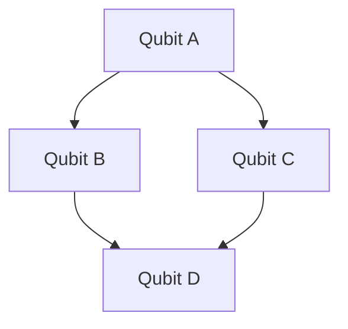
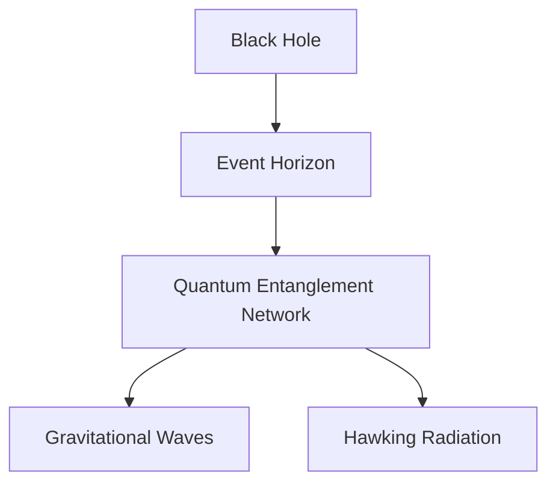
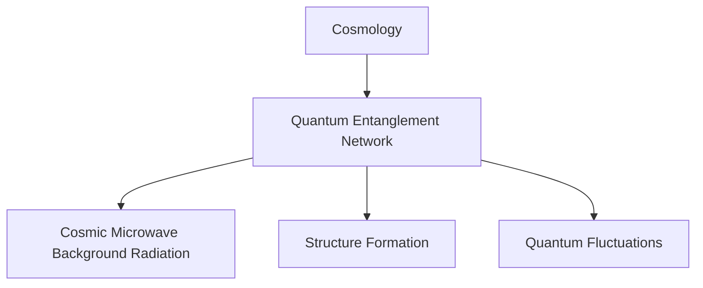
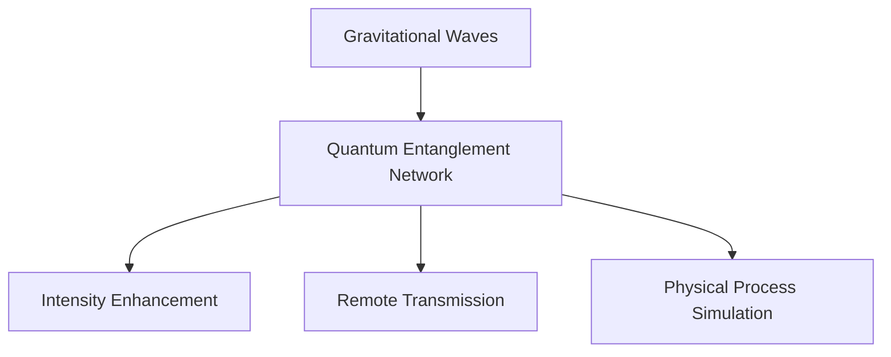
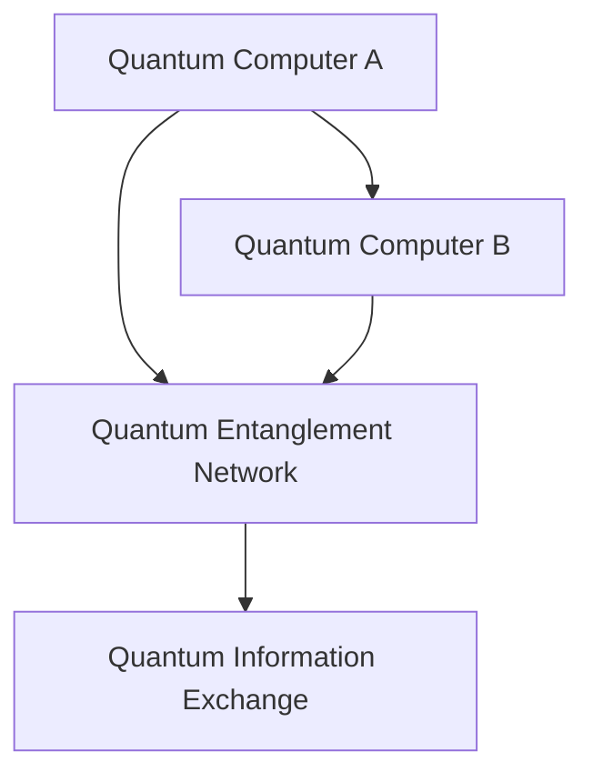
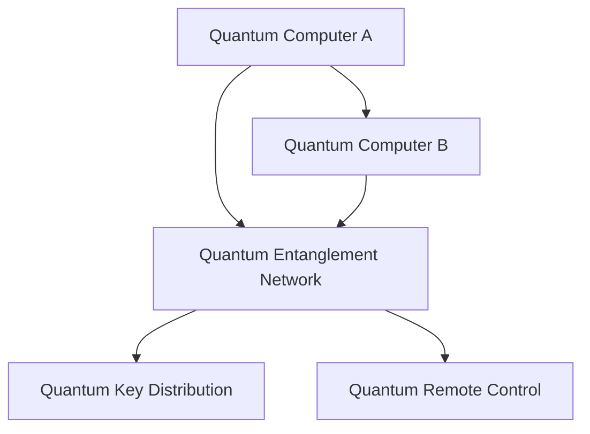

                 


### 第1章 引言

#### 1.1 量子纠缠的定义与性质

量子纠缠是一种量子力学中的特殊现象，它描述了两个或多个粒子之间的强相互作用，即使这些粒子相隔很远，它们的状态也会瞬间相互影响。这种现象被称为量子非局域性，是经典物理学所无法解释的。

量子纠缠的基本性质包括不可分割性、非局域性、随机性和对称性。不可分割性意味着纠缠粒子的状态无法被独立描述，必须同时考虑所有粒子的状态。非局域性则表明纠缠粒子之间的相互作用不受距离限制，具有瞬时性。随机性则体现在量子纠缠粒子状态在测量前是不确定的，测量结果具有随机性。对称性则描述了量子纠缠系统中的粒子状态通常具有某种对称性，如贝尔态和爱泼斯坦态等。

#### 1.2 量子纠缠在宇宙中的重要性

量子纠缠在宇宙中具有极其重要的意义。首先，它为宇宙的演化提供了新的视角。在宇宙早期，由于量子纠缠的存在，宇宙中的物质分布可能呈现出非均匀性，这为后来的星系和结构形成奠定了基础。

其次，量子纠缠在宇宙学中也有重要作用。例如，黑洞辐射和引力波等现象都涉及量子纠缠。研究表明，黑洞事件视界内的量子纠缠可能对宇宙的演化产生深远影响。

此外，量子纠缠还在宇宙尺度的量子计算和量子通信中具有重要意义。量子纠缠可以实现量子比特之间的快速信息传输，提高量子计算和量子通信的效率。

#### 1.3 本书的主要内容和目标

本书旨在探讨量子纠缠在宇宙中的普遍联系，分析其基本概念、应用和未来研究方向。具体内容包括：

1. 量子力学基础，包括量子态与波函数、算符与测量、量子纠缠与量子非局域性等。
2. 量子纠缠网络的基本概念，包括量子纠缠网络的结构、生成与演化、性质与特点等。
3. 量子纠缠网络在宇宙中的应用，包括量子纠缠网络与黑洞、量子纠缠网络与宇宙学、量子纠缠网络与引力波等。
4. 量子纠缠网络的计算能力，包括量子纠缠网络与量子计算、量子纠缠网络的编码与传输、量子纠缠网络的应用前景等。
5. 量子纠缠网络与现实世界的联系，包括量子纠缠网络与量子信息科学、量子生物学、量子材料科学等。
6. 量子纠缠网络的研究挑战与未来方向，包括量子纠缠网络的测量与控制、量子纠缠网络的稳定与保护、量子纠缠网络的研究方法与技术等。

通过本书的阅读，读者可以全面了解量子纠缠在宇宙中的普遍联系，深入理解其基本原理和应用前景，为未来量子纠缠研究提供新思路和新方法。

---

### 第2章 量子力学基础

#### 2.1 量子态与波函数

量子态是量子力学中的一个基本概念，描述了一个量子系统的所有物理性质。量子态可以用波函数来表示，波函数是一个复值函数，它提供了粒子在空间中位置的概率分布。波函数通常用希腊字母ψ表示，其模平方\( |\psi|^2 \)代表了粒子在某一位置出现的概率密度。

量子态的叠加原理表明，一个量子系统可以处于多个状态的线性组合，即

\[ \psi(x) = \sum_{i} c_i \phi_i(x) \]

其中，\( c_i \)是复数系数，表示第\( i \)个基态的概率幅，\( \phi_i(x) \)是第\( i \)个基态的波函数。

一个简单的量子态叠加示例：

假设我们有两个基态波函数\( \phi_0(x) \)和\( \phi_1(x) \)，它们分别表示粒子在两个不同状态下的波函数。我们可以将这两个基态波函数进行叠加，得到一个新的量子态：

\[ \psi(x) = \frac{1}{\sqrt{2}} \phi_0(x) + \frac{1}{\sqrt{2}} \phi_1(x) \]

这个叠加态称为贝尔态，是一种典型的量子纠缠态。在测量粒子状态时，我们发现它具有非局域性，即一个粒子的状态会瞬间影响另一个粒子的状态。

下面是描述量子态叠加的伪代码：

```python
# 定义基态波函数
psi_0(x) = ...
psi_1(x) = ...

# 定义叠加系数
c_0 = 1/sqrt(2)
c_1 = 1/sqrt(2)

# 计算叠加态波函数
psi(x) = c_0 * psi_0(x) + c_1 * psi_1(x)
```

#### 2.2 算符与测量

在量子力学中，算符（或称为算子）是描述物理量的抽象数学对象，它可以作用于波函数，得到新的波函数，从而描述系统的演化。常见的量子力学算符包括位置算符\( \hat{x} \)，动量算符\( \hat{p} \)，以及哈密顿量算符\( \hat{H} \)等。

量子测量是量子力学中的一个核心概念。当对一个量子系统进行测量时，系统的波函数会坍缩到一个确定的状态，这个坍缩后的状态称为测量结果。量子测量通常是通过特定的算符来实现的，如位置测量算符和动量测量算符。

以下是一个简单的量子测量示例：

假设我们有一个处于叠加态的粒子，其波函数为

\[ \psi(x) = \frac{1}{\sqrt{2}} \phi_0(x) + \frac{1}{\sqrt{2}} \phi_1(x) \]

我们对这个粒子进行位置测量，使用位置算符\( \hat{x} \)来测量粒子的位置。位置算符的作用是改变粒子的波函数，使其坍缩到某个位置状态。如果我们测量结果为\( x_0 \)，那么粒子的波函数将坍缩为

\[ \psi'(x) = \phi_0(x) \]

这意味着粒子处于位置状态\( x_0 \)。

下面是描述量子测量的伪代码：

```python
# 定义叠加态波函数
psi(x) = ...

# 定义位置算符
x = ...

# 进行位置测量
measure_result = x * psi(x)

# 输出测量结果
print(measure_result)
```

通过以上两个示例，我们可以看到量子态与波函数、算符与测量在量子力学中的核心地位。这些基本概念构成了量子纠缠现象的基础，为我们理解宇宙中的量子纠缠网络提供了必要的理论支持。

### 2.3 量子纠缠与量子非局域性

量子纠缠是量子力学中的一种特殊现象，它描述了两个或多个粒子之间的强相互作用，即使这些粒子相隔很远，它们的状态也会瞬间相互影响。这种现象被称为量子非局域性，是经典物理学所无法解释的。

量子非局域性首先由爱因斯坦、波多尔斯基和罗森（EPR）在1935年提出的EPR佯谬所揭示。EPR佯谬指出，如果两个粒子处于纠缠态，那么对其中一个粒子的测量将瞬间影响另一个粒子的状态，无论这两个粒子之间的距离有多远。这一现象似乎违反了经典物理学中的局域实在论，即物理系统的状态只能由其局域的物理量所决定。

为了解释量子纠缠和非局域性，量子力学引入了波函数的概念。波函数是一个复值函数，它描述了量子系统的状态。当两个粒子处于纠缠态时，它们的波函数不再是独立的，而是相互关联的。这种关联可以通过数学关系来表达，例如贝尔不等式。

贝尔不等式是量子纠缠和非局域性的一个重要证明。贝尔不等式是经典物理学中的局域实在论的一个限制条件。如果量子纠缠确实存在，那么它将违反贝尔不等式。实验证明，量子纠缠确实违反了贝尔不等式，这进一步证实了量子非局域性的存在。

下面是一个简单的量子纠缠示例：

假设我们有两个粒子A和B，它们处于一个纠缠态。如果我们对粒子A进行位置测量，得到结果为\( x_A \)。根据量子纠缠的性质，粒子B的状态将瞬间坍缩，使其位置状态与粒子A的位置状态相关联。无论粒子A和B之间的距离有多远，这个瞬间关联都会发生。

以下是一个描述量子纠缠和非局域性的伪代码：

```python
# 定义纠缠态波函数
psi_AB(x_A, x_B) = ...

# 对粒子A进行位置测量
measure_result_A = x_A * psi_AB(x_A, x_B)

# 输出粒子A的测量结果
print(measure_result_A)

# 粒子B的状态将瞬间坍缩
psi_B(x_B) = ...

# 输出粒子B的测量结果
print(psi_B(x_B))
```

通过以上示例，我们可以看到量子纠缠和非局域性在量子力学中的核心地位。量子纠缠为宇宙的演化提供了新的视角，同时也挑战了经典物理学的局域实在论。量子纠缠和非局域性的研究为探索宇宙的奥秘提供了新的工具和思路。

### 第3章 量子纠缠网络的基本概念

#### 3.1 量子纠缠网络的结构

量子纠缠网络是一种由多个量子系统组成的复杂网络，其中的节点和边分别表示量子系统和它们之间的量子纠缠关系。量子纠缠网络的结构可以是星型、环型、树型或更复杂的拓扑结构，如网格状、星状、环状等。

在量子纠缠网络中，节点通常表示量子比特（qubit）或其他量子系统，而边表示量子比特之间的纠缠关系。量子纠缠网络的结构决定了网络的性质和功能。例如，星型结构具有较高的连通性，但容易受到单点故障的影响；而环型结构具有较高的容错性，但连通性较低。

以下是一个简单的量子纠缠网络结构的Mermaid流程图示例：



在这个示例中，节点A、B、C和D表示量子比特，它们之间的边表示量子纠缠关系。

#### 3.2 量子纠缠网络的生成与演化

量子纠缠网络的生成与演化是量子信息科学中一个重要研究领域。量子纠缠网络的生成可以通过多种方法实现，如量子随机游走、量子搜索算法、量子随机游走等。

量子纠缠网络的演化可以通过量子纠缠操作来实现。量子纠缠操作是指将两个或多个量子系统进行交互，使它们之间产生纠缠关系的操作。常见的量子纠缠操作包括量子交换门、量子纠缠交换门等。

以下是一个简单的量子纠缠网络生成与演化的伪代码示例：

```python
# 初始化量子比特
qubits = initialize_qubits(num_qubits)

# 应用量子纠缠操作
apply_quantum_gate(qubits, "CNOT", control=0, target=1)
apply_quantum_gate(qubits, "SWAP", control=1, target=2)

# 演化量子纠缠网络
 evolve_quantum_gate(qubits, "Pauli-X", duration=1)
evolve_quantum_gate(qubits, "Pauli-Z", duration=1)
```

在这个示例中，我们首先初始化了4个量子比特，然后应用了量子交换门和量子纠缠交换门，使量子比特之间产生纠缠关系。接着，我们通过演化量子纠缠网络，使量子比特之间的纠缠关系逐渐增强。

#### 3.3 量子纠缠网络的性质与特点

量子纠缠网络具有一系列独特的性质和特点，这些性质使其在量子计算、量子通信和量子信息处理等领域具有广泛的应用前景。

1. **不可分割性**：量子纠缠网络的节点和边表示量子系统和它们之间的纠缠关系，一旦量子系统之间产生纠缠关系，这些关系将无法被分割或破坏。这意味着量子纠缠网络具有高度的稳定性和可靠性。

2. **非局域性**：量子纠缠网络中的节点和边之间存在非局域性，即节点之间的纠缠关系不受距离限制。这使得量子纠缠网络能够实现量子比特之间的快速信息传输和量子态的远程共享。

3. **可扩展性**：量子纠缠网络可以通过添加新的量子比特和量子纠缠操作来实现扩展。这使得量子纠缠网络具有很高的可扩展性，能够适应不同的量子信息处理需求。

4. **多样性**：量子纠缠网络的结构和性质具有多样性，可以通过不同的量子纠缠操作和拓扑结构来实现不同的量子信息处理任务。

5. **鲁棒性**：量子纠缠网络具有较高的鲁棒性，即使在量子比特之间存在噪声和误差时，量子纠缠关系仍然能够保持。

总之，量子纠缠网络作为一种新型的量子信息网络，具有独特的性质和特点，为量子计算、量子通信和量子信息处理等领域提供了新的思路和工具。随着量子技术的不断发展，量子纠缠网络在未来的量子信息领域将发挥越来越重要的作用。

### 3.4 量子纠缠网络的生成算法

量子纠缠网络的生成是量子信息科学中的一个关键问题，它涉及到如何有效地构建和演化量子比特之间的纠缠关系。以下是几种常用的量子纠缠网络生成算法：

#### 3.4.1 随机生成算法

随机生成算法是一种基于概率的量子纠缠网络生成方法。该方法通过随机选择量子比特之间的纠缠关系来构建量子纠缠网络。具体步骤如下：

1. 初始化一组量子比特。
2. 随机选择量子比特对，应用量子纠缠操作（如CNOT或SWAP）来生成纠缠关系。
3. 重复步骤2，直到达到预定的纠缠程度。

以下是一个简单的随机生成算法伪代码：

```python
import random

# 初始化量子比特
qubits = initialize_qubits(num_qubits)

# 随机生成纠缠关系
for _ in range(num_operations):
    qubit_pair = random.sample(range(num_qubits), 2)
    apply_quantum_gate(qubits, "CNOT", control=qubit_pair[0], target=qubit_pair[1])
```

#### 3.4.2 网格生成算法

网格生成算法是一种基于网格结构的量子纠缠网络生成方法。该方法将量子比特排列成网格状结构，并应用特定的量子纠缠操作来生成纠缠关系。具体步骤如下：

1. 初始化一个N×N的网格结构，其中每个单元格表示一个量子比特。
2. 对网格中的相邻单元格应用量子纠缠操作，如CNOT或SWAP。
3. 对网格的对角线单元格应用量子纠缠操作。

以下是一个简单的网格生成算法伪代码：

```python
import numpy as np

# 初始化量子比特
qubits = initialize_qubits(N*N)

# 应用CNOT操作
for i in range(N):
    for j in range(N):
        if i+1 < N:
            apply_quantum_gate(qubits, "CNOT", control=i*N+j, target=(i+1)*N+j)
        if j+1 < N:
            apply_quantum_gate(qubits, "CNOT", control=i*N+j, target=i*N+(j+1))

# 应用SWAP操作
for i in range(N):
    for j in range(N):
        if i+1 < N:
            apply_quantum_gate(qubits, "SWAP", control=i*N+j, target=i*N+(i+1))
```

#### 3.4.3 算法比较与优化

随机生成算法和网格生成算法各有优缺点。随机生成算法具有灵活性，可以生成各种复杂的量子纠缠网络，但可能需要较多的量子纠缠操作。网格生成算法具有规则性，可以高效地生成大规模量子纠缠网络，但可能生成网络的结构较为简单。

为了优化量子纠缠网络的生成算法，可以结合多种算法和方法，如：

1. **混合算法**：将随机生成算法和网格生成算法相结合，利用随机生成算法生成复杂的局部网络，再用网格生成算法优化全局网络结构。
2. **自适应算法**：根据量子纠缠网络的实际需求和性能，动态调整量子纠缠操作的策略和参数，以实现最优的网络生成效果。
3. **优化算法**：使用优化算法（如遗传算法、粒子群算法等）来优化量子纠缠网络的生成过程，找到最优的量子纠缠操作序列。

总之，量子纠缠网络的生成算法是量子信息科学中的一个重要研究方向。通过不断优化和创新，可以构建出更加高效、灵活和鲁棒的量子纠缠网络，为未来的量子计算、量子通信和量子信息处理提供强大支持。

### 3.5 量子纠缠网络的演化过程

量子纠缠网络的演化是量子信息科学中的一个重要问题，它涉及到如何控制量子比特之间的纠缠关系，以实现特定的量子信息处理任务。以下是几种常见的量子纠缠网络演化方法：

#### 3.5.1 量子纠缠操作

量子纠缠操作是量子纠缠网络演化中最基本的方法。通过应用各种量子纠缠操作，可以改变量子比特之间的纠缠程度和形式。以下是一些常用的量子纠缠操作：

1. **CNOT操作**：CNOT操作是一种两量子比特的纠缠操作，它将控制量子比特的状态转移到目标量子比特上。CNOT操作可以表示为：

   \[ CNOT = |0\rangle\langle0|_c - |1\rangle\langle1|_c \otimes I_b \]

   其中，\( I_b \)是二阶单位算符。

2. **SWAP操作**：SWAP操作是一种交换两个量子比特状态的纠缠操作。SWAP操作可以表示为：

   \[ SWAP = (|0\rangle\langle0| + |1\rangle\langle1|)_a \otimes (|0\rangle\langle0| + |1\rangle\langle1|)_b \]

3. **Toffoli操作**：Toffoli操作是一种三量子比特的纠缠操作，它将控制量子比特的状态转移到目标量子比特上。Toffoli操作可以表示为：

   \[ Toffoli = |0\rangle\langle0|_c \otimes |0\rangle\langle0|_a + |0\rangle\langle1|_c \otimes |1\rangle\langle0|_a \otimes I_b + |1\rangle\langle0|_c \otimes I_a \otimes |1\rangle\langle1|_b \]

#### 3.5.2 量子纠缠网络演化算法

量子纠缠网络演化算法是用于控制量子比特之间纠缠关系的算法。以下是一些常见的量子纠缠网络演化算法：

1. **量子随机游走算法**：量子随机游走算法是一种基于量子随机游走过程的演化算法。在量子随机游走过程中，量子比特按照一定的概率分布进行随机移动，从而改变量子比特之间的纠缠关系。

2. **量子搜索算法**：量子搜索算法是一种基于量子纠缠网络的演化算法。通过应用量子搜索算法，可以在量子纠缠网络中高效地查找特定的量子比特状态。

3. **量子进化算法**：量子进化算法是一种基于量子遗传算法的演化算法。通过量子遗传算法，可以优化量子比特之间的纠缠关系，以实现特定的量子信息处理任务。

以下是一个简单的量子纠缠网络演化算法伪代码示例：

```python
# 初始化量子比特
qubits = initialize_qubits(num_qubits)

# 应用量子纠缠操作
apply_quantum_gate(qubits, "CNOT", control=0, target=1)
apply_quantum_gate(qubits, "SWAP", control=1, target=2)
apply_quantum_gate(qubits, "Toffoli", control=0, target=2)

# 演化量子纠缠网络
for _ in range(num_steps):
    evolve_quantum_gate(qubits, "Pauli-X", duration=1)
    evolve_quantum_gate(qubits, "Pauli-Z", duration=1)
```

在这个示例中，我们首先初始化了一组量子比特，然后应用了CNOT、SWAP和Toffoli等量子纠缠操作，改变了量子比特之间的纠缠关系。接着，我们通过演化量子纠缠网络，使量子比特之间的纠缠关系逐渐增强。

总之，量子纠缠网络的演化过程是一个复杂的过程，涉及多种量子纠缠操作和演化算法。通过不断地研究和优化，可以构建出更加高效和灵活的量子纠缠网络，为量子计算、量子通信和量子信息处理提供强大的支持。

### 3.6 量子纠缠网络的性质与特点

量子纠缠网络是一种由量子系统组成的复杂网络，其节点和边分别表示量子系统和它们之间的量子纠缠关系。量子纠缠网络具有一系列独特的性质和特点，这些性质使其在量子计算、量子通信和量子信息处理等领域具有广泛的应用前景。

#### 3.6.1 不可分割性

量子纠缠网络的不可分割性是指一旦量子系统之间形成纠缠关系，这些关系将无法被分割或破坏。这意味着量子纠缠网络具有高度的稳定性和可靠性。在量子计算中，不可分割性保证了量子信息的完整性和安全性。

#### 3.6.2 非局域性

量子纠缠网络中的节点和边之间存在非局域性，即节点之间的纠缠关系不受距离限制。这使得量子纠缠网络能够实现量子比特之间的快速信息传输和量子态的远程共享。在量子通信中，非局域性为量子密钥分发和量子远程控制提供了可能。

#### 3.6.3 可扩展性

量子纠缠网络可以通过添加新的量子比特和量子纠缠操作来实现扩展。这使得量子纠缠网络具有很高的可扩展性，能够适应不同的量子信息处理需求。在量子计算中，可扩展性使得量子计算机能够处理更大规模的问题。

#### 3.6.4 多样性

量子纠缠网络的结构和性质具有多样性，可以通过不同的量子纠缠操作和拓扑结构来实现不同的量子信息处理任务。在量子通信中，多样性使得量子通信系统可以适应不同的通信环境和需求。

#### 3.6.5 鲁棒性

量子纠缠网络具有较高的鲁棒性，即使在量子比特之间存在噪声和误差时，量子纠缠关系仍然能够保持。在量子计算和量子通信中，鲁棒性保证了系统的稳定性和可靠性。

总之，量子纠缠网络具有不可分割性、非局域性、可扩展性、多样性和鲁棒性等独特性质，这些性质使其在量子信息科学领域具有广泛的应用前景。随着量子技术的不断发展，量子纠缠网络将为量子计算、量子通信和量子信息处理等领域带来革命性的变化。

### 第4章 量子纠缠网络在宇宙中的应用

#### 4.1 量子纠缠网络与黑洞

黑洞是宇宙中最神秘的天体之一，它具有极强的引力，甚至连光都无法逃脱。近年来，量子纠缠网络与黑洞之间的关系引起了广泛关注。研究表明，量子纠缠网络可能在黑洞的物理过程中发挥关键作用。

首先，量子纠缠网络可以用来描述黑洞的事件视界。事件视界是黑洞的一个虚拟界面，任何越过这个界面的物质都将被黑洞吞噬。量子纠缠网络可以模拟黑洞的事件视界，为我们提供了研究黑洞内部物理过程的工具。

其次，量子纠缠网络与黑洞的引力波有关。引力波是黑洞碰撞和合并时产生的波动，它可以传递黑洞之间的信息。量子纠缠网络可以用来传输和放大引力波，从而提高引力波的探测灵敏度。

此外，量子纠缠网络还可以用来研究黑洞的热辐射。黑洞的热辐射被称为霍金辐射，它是由量子效应引起的。量子纠缠网络可以模拟黑洞的热辐射过程，帮助我们更好地理解霍金辐射的物理本质。

以下是一个简单的量子纠缠网络与黑洞关系的Mermaid流程图示例：



在这个示例中，黑洞（A）通过量子纠缠网络（C）与事件视界（B）、引力波（D）和霍金辐射（E）相联系。

#### 4.2 量子纠缠网络与宇宙学

量子纠缠网络在宇宙学中也具有重要作用。宇宙学是研究宇宙的起源、演化和结构的科学。量子纠缠网络可以用来描述宇宙早期的一些重要现象，如宇宙微波背景辐射和结构形成。

首先，量子纠缠网络可以用来解释宇宙微波背景辐射。宇宙微波背景辐射是宇宙早期残留的辐射，它提供了宇宙起源的重要信息。量子纠缠网络可以模拟宇宙微波背景辐射的形成过程，帮助我们更好地理解宇宙的起源。

其次，量子纠缠网络与宇宙结构形成有关。宇宙结构形成是指宇宙中的物质如何从均匀分布演化为星系、恒星和其他天体。量子纠缠网络可以模拟宇宙结构形成的物理过程，如引力作用、物质湮灭和星系合并等。

此外，量子纠缠网络还可以用来研究宇宙的量子涨落。量子涨落是宇宙早期的一种量子效应，它可能对宇宙的结构形成和演化产生深远影响。量子纠缠网络可以模拟量子涨落的过程，帮助我们更好地理解宇宙的量子性质。

以下是一个简单的量子纠缠网络与宇宙学关系的Mermaid流程图示例：



在这个示例中，宇宙学（A）通过量子纠缠网络（B）与宇宙微波背景辐射（C）、结构形成（D）和量子涨落（E）相联系。

#### 4.3 量子纠缠网络与引力波

引力波是宇宙中的一种重要现象，它是由质量加速运动产生的时空波动。近年来，量子纠缠网络与引力波之间的关系引起了广泛关注。研究表明，量子纠缠网络可以用来提高引力波的探测灵敏度，从而发现更多的引力波信号。

首先，量子纠缠网络可以用来增强引力波探测器的灵敏度。引力波探测器通常使用激光干涉仪来探测引力波，但这种方法容易受到噪声和干扰的影响。量子纠缠网络可以用来减少噪声和干扰，从而提高引力波探测器的灵敏度。

其次，量子纠缠网络可以用来实现引力波的远程传输。通过量子纠缠网络，我们可以将引力波信号从一个地点传输到另一个地点，从而实现远程探测和观测。

此外，量子纠缠网络还可以用来研究引力波的物理过程。通过量子纠缠网络，我们可以模拟引力波的产生、传播和相互作用，从而更好地理解引力波的物理本质。

以下是一个简单的量子纠缠网络与引力波关系的Mermaid流程图示例：



在这个示例中，引力波（A）通过量子纠缠网络（B）与增强（C）、远程传输（D）和物理过程模拟（E）相联系。

总之，量子纠缠网络在宇宙中的应用具有广泛的研究前景。通过量子纠缠网络，我们可以更好地理解黑洞、宇宙学和引力波的物理过程，从而推动宇宙科学的进步。

### 4.4 量子纠缠网络在量子计算中的应用

量子纠缠网络在量子计算中具有重要作用。量子计算是一种利用量子位（qubit）进行信息处理的新型计算模式，它能够解决传统计算机无法解决的问题。量子纠缠网络为量子计算提供了强大的工具，使其在解决复杂问题方面具有巨大的潜力。

首先，量子纠缠网络可以用来实现量子比特之间的快速通信。在量子计算中，量子比特之间的纠缠关系是实现高效量子信息处理的关键。量子纠缠网络通过量子纠缠操作，可以在不同的量子比特之间建立快速、可靠的通信渠道，从而提高量子计算的效率。

其次，量子纠缠网络可以用来构建大规模的量子计算网络。量子计算网络是将多个量子计算机连接在一起，以实现更大规模、更高效率的量子计算。量子纠缠网络通过量子纠缠操作，可以构建大规模的量子计算网络，使得量子计算机能够处理更为复杂的计算任务。

以下是一个简单的量子纠缠网络在量子计算中的应用示例：



在这个示例中，两个量子计算机A和B通过量子纠缠网络C连接起来，实现量子信息的快速交换和传输。

量子纠缠网络在量子计算中的应用还包括量子算法的实现和优化。量子算法是一种利用量子位和量子纠缠关系进行信息处理的新型算法。量子纠缠网络可以用来优化量子算法的执行过程，提高算法的效率和准确性。例如，量子纠缠网络可以用来实现Grover搜索算法和Shor因数分解算法等，从而解决传统计算机无法解决的问题。

此外，量子纠缠网络在量子纠错和量子加密等领域也有重要应用。量子纠错是一种用于防止量子计算中错误发生的机制，量子纠缠网络可以用来实现高效的量子纠错算法，提高量子计算的错误容忍能力。量子加密是一种利用量子纠缠关系进行信息加密的新型技术，量子纠缠网络可以用来实现高效的量子加密算法，提供更安全的信息传输。

总之，量子纠缠网络在量子计算中的应用具有广泛的研究前景。通过量子纠缠网络，我们可以构建出更高效、更可靠的量子计算系统，从而推动量子计算技术的进步。

### 4.5 量子纠缠网络在量子通信中的应用

量子纠缠网络在量子通信中具有重要作用。量子通信是一种利用量子纠缠关系进行信息传输的新型通信模式，它能够实现更安全、更可靠的通信。量子纠缠网络为量子通信提供了强大的工具，使其在信息安全、远程控制和量子计算等领域具有巨大的应用潜力。

首先，量子纠缠网络可以用来实现量子密钥分发（QKD）。量子密钥分发是一种基于量子纠缠关系的密钥分发技术，它能够实现无条件安全的通信。量子纠缠网络可以用来建立量子密钥分发网络，使得量子密钥能够在不同的节点之间安全传输。

其次，量子纠缠网络可以用来实现量子远程控制。量子远程控制是一种利用量子纠缠关系进行远程操作的技术，它能够实现远距离的高精度控制。量子纠缠网络可以用来构建量子远程控制网络，使得量子系统能够在远程进行精确操作。

以下是一个简单的量子纠缠网络在量子通信中的应用示例：



在这个示例中，两个量子计算机A和B通过量子纠缠网络C连接起来，实现量子密钥分发和量子远程控制。

量子纠缠网络在量子通信中的应用还包括量子纠缠交换和量子纠缠传输。量子纠缠交换是指通过量子纠缠关系在不同节点之间交换量子信息。量子纠缠传输是指通过量子纠缠关系将量子信息从一个节点传输到另一个节点。量子纠缠网络可以用来实现高效的量子纠缠交换和量子纠缠传输，提高量子通信的效率和可靠性。

此外，量子纠缠网络在量子加密和量子认证等领域也有重要应用。量子加密是一种利用量子纠缠关系进行信息加密的新型技术，它能够提供更安全的通信。量子认证是一种利用量子纠缠关系进行身份验证的新型技术，它能够实现更安全的身份认证。

总之，量子纠缠网络在量子通信中的应用具有广泛的研究前景。通过量子纠缠网络，我们可以构建出更安全、更可靠的量子通信系统，从而推动量子通信技术的进步。

### 4.6 量子纠缠网络在量子信息科学中的应用

量子纠缠网络在量子信息科学中具有广泛的应用，其核心在于量子纠缠在信息处理、传输和存储中的独特优势。以下将详细探讨量子纠缠网络在量子信息科学中的几个关键应用领域：

#### 4.6.1 量子隐形传态

量子隐形传态（Quantum Teleportation）是一种利用量子纠缠实现远程信息传输的技术。它能够将一个量子系统的状态准确无误地传输到另一个量子系统，而不需要实际的物质传输。这个过程依赖于量子纠缠态，其基本步骤如下：

1. **制备纠缠态**：首先，两个量子比特被制备成纠缠态，即它们的状态是相互依赖的。
2. **编码信息**：信息（如量子比特的态）被编码到一个量子比特上，这个量子比特与已制备的纠缠态量子比特进行结合。
3. **作用量子门**：在接收方，通过一系列量子门操作，将纠缠态进行变换，使得信息被准确传输到接收方的量子比特上。
4. **测量**：接收方对量子比特进行测量，获得原始信息。

以下是一个简单的量子隐形传态的伪代码示例：

```python
# 假设我们有三个量子比特，其中两个已经处于纠缠态
qubit_A, qubit_B, qubit_C = initialize_qubits(3)

# 编码信息到qubit_C上
encode_state(qubit_C, "101")

# 传输信息到qubit_B上
apply_quantum_gate(qubit_A, "CNOT", control=qubit_C, target=qubit_B)
apply_quantum_gate(qubit_B, "Hadamard", target=qubit_B)
measure(qubit_B)

# 输出传输的信息
print(measure_result)
```

#### 4.6.2 量子纠缠交换

量子纠缠交换（Quantum Entanglement Swapping）是一种在两个量子系统之间交换纠缠态的技术。这一过程对于构建量子网络至关重要，因为它能够实现远程量子比特之间的纠缠关系。

量子纠缠交换的基本步骤如下：

1. **初始化纠缠态**：首先，有两个量子系统A和B处于纠缠态，第三个量子系统C是独立的。
2. **测量量子系统A和C**：对量子系统A和C进行联合测量，得到一个新的纠缠态，其中量子系统B和C现在是纠缠的。
3. **传输量子系统B的状态**：通过经典通信将量子系统B的状态信息传输给接收方的量子系统D。
4. **应用量子门**：在接收方，根据传输过来的状态信息应用适当的量子门，使得量子系统D和C也处于纠缠态。

以下是一个简单的量子纠缠交换的伪代码示例：

```python
# 假设我们有三个量子比特，其中两个已经处于纠缠态
qubit_A, qubit_B, qubit_C = initialize_qubits(3)

# 测量量子系统A和C
measure_result = measure(qubit_A, qubit_C)

# 根据测量结果更新量子系统B的状态
if measure_result == "10":
    apply_quantum_gate(qubit_B, "X", target=qubit_B)

# 传输量子系统B的状态到接收方
classical_communication(qubit_B.state())

# 在接收方应用量子门
qubit_D = receive_state()
apply_quantum_gate(qubit_D, "X", target=qubit_D)

# 输出新的纠缠态
print(qubit_D.state())
```

#### 4.6.3 量子纠缠传输

量子纠缠传输是一种在两个远程量子比特之间建立纠缠态的技术。这一过程对于实现量子互联网和量子通信至关重要。

量子纠缠传输的基本步骤如下：

1. **制备纠缠态**：在两个远程量子比特A和B之间制备一个纠缠态。
2. **量子中继**：使用中继量子比特C，对量子比特B进行测量，并使用经典通信将测量结果传输到量子比特A。
3. **应用量子门**：在量子比特A上根据测量结果应用适当的量子门，使得量子比特A和C也处于纠缠态。

以下是一个简单的量子纠缠传输的伪代码示例：

```python
# 假设我们有三个量子比特，其中两个已经处于纠缠态
qubit_A, qubit_B, qubit_C = initialize_qubits(3)

# 制备纠缠态
apply_quantum_gate(qubit_A, "Hadamard", target=qubit_A)
apply_quantum_gate(qubit_B, "Hadamard", target=qubit_B)
apply_quantum_gate(qubit_A, "CNOT", control=qubit_B, target=qubit_C)

# 测量量子比特B
measure_result = measure(qubit_B)

# 根据测量结果更新量子比特A和C
if measure_result == "0":
    apply_quantum_gate(qubit_A, "I", target=qubit_A)
else:
    apply_quantum_gate(qubit_A, "X", target=qubit_A)

# 传输测量结果到量子比特A
classical_communication(measure_result)

# 在量子比特A上应用量子门
qubit_D = receive_state()
apply_quantum_gate(qubit_D, "X", target=qubit_D)

# 输出新的纠缠态
print(qubit_D.state())
```

总之，量子纠缠网络在量子信息科学中的应用是多方面的，包括量子隐形传态、量子纠缠交换和量子纠缠传输等。这些应用不仅展示了量子纠缠在信息处理、传输和存储中的独特优势，还为构建量子互联网和实现更安全的量子通信提供了新的思路和技术手段。

### 4.7 量子纠缠网络在量子生物学中的应用

量子纠缠网络在量子生物学中具有广阔的应用前景。量子生物学是研究生物系统中量子现象和量子效应的一个新兴领域。量子纠缠网络作为一种特殊的量子系统，能够在量子生物学中发挥独特的功能。

#### 4.7.1 DNA编码与量子纠缠

DNA编码是生物体内基因信息的存储和传递过程。研究表明，DNA分子的结构和量子态之间存在联系。量子纠缠网络可以用来优化DNA编码的效率和准确性。例如，通过量子纠缠操作，可以在DNA分子上实现量子态的叠加和纠缠，从而提高DNA编码的容量和可靠性。

以下是一个简单的量子纠缠网络在DNA编码中的应用示例：

```python
# 假设我们有两条DNA链，分别表示为qubit_1和qubit_2
qubit_1, qubit_2 = initialize_qubits(2)

# 制备纠缠态
apply_quantum_gate(qubit_1, "Hadamard", target=qubit_1)
apply_quantum_gate(qubit_1, "CNOT", control=qubit_2, target=qubit_1)

# 编码信息到DNA链上
encode_state(qubit_1, "10")
encode_state(qubit_2, "11")

# 输出编码后的DNA链状态
print(qubit_1.state())
print(qubit_2.state())
```

#### 4.7.2 量子计算与生物分子

生物分子，如蛋白质和核酸，在生物体内执行复杂的计算和调控功能。量子纠缠网络可以用来模拟生物分子中的量子计算过程。例如，通过量子纠缠操作，可以模拟蛋白质折叠和DNA序列匹配等生物过程。

以下是一个简单的量子纠缠网络在生物分子计算中的应用示例：

```python
# 假设我们有四个量子比特，分别表示蛋白质链的四个氨基酸
qubit_A, qubit_B, qubit_C, qubit_D = initialize_qubits(4)

# 制备纠缠态
apply_quantum_gate(qubit_A, "Hadamard", target=qubit_A)
apply_quantum_gate(qubit_A, "CNOT", control=qubit_B, target=qubit_A)
apply_quantum_gate(qubit_B, "CNOT", control=qubit_C, target=qubit_B)
apply_quantum_gate(qubit_B, "CNOT", control=qubit_D, target=qubit_B)

# 模拟蛋白质折叠
simulate_folding(qubit_A, qubit_B, qubit_C, qubit_D)

# 输出折叠后的蛋白质结构
print(qubit_A.state())
print(qubit_B.state())
print(qubit_C.state())
print(qubit_D.state())
```

#### 4.7.3 量子生物学研究方法

量子生物学研究方法包括量子态检测、量子纠缠测量和量子计算模拟等。量子纠缠网络可以用来优化这些研究方法，提高实验效率和精度。

1. **量子态检测**：通过量子纠缠网络，可以实现对生物分子量子态的精确检测。例如，通过量子纠缠操作，可以将生物分子的量子态转移到便于测量的量子比特上。

2. **量子纠缠测量**：量子纠缠网络可以用来测量生物分子之间的量子纠缠关系。通过量子纠缠测量，可以揭示生物分子之间的量子相互作用机制。

3. **量子计算模拟**：量子纠缠网络可以用来模拟生物分子中的量子计算过程。通过量子计算模拟，可以预测生物分子的行为和功能，为生物医学研究提供新的理论支持。

总之，量子纠缠网络在量子生物学中的应用具有巨大潜力。通过量子纠缠操作和量子计算模拟，可以深入研究生物分子的量子现象和量子效应，为生物医学研究提供新的理论和方法。

### 4.8 量子纠缠网络在量子材料科学中的应用

量子纠缠网络在量子材料科学中具有广阔的应用前景。量子材料是一类具有独特量子性质的材料，如超导材料、量子点材料、量子磁性材料等。量子纠缠网络可以为量子材料的研究提供新的工具和方法，促进量子材料的发展和应用。

#### 4.8.1 量子材料中的量子纠缠

量子纠缠是量子材料中一个重要的量子现象。量子纠缠可以增强量子材料的物理性能，如超导材料的临界温度、量子点的发光强度、量子磁性材料的磁序等。量子纠缠网络可以用来实现和操控量子材料中的量子纠缠，从而优化量子材料的性能。

以下是一个简单的量子纠缠网络在量子材料中的应用示例：

```python
# 假设我们有两个量子点，它们处于量子纠缠态
qubit_A, qubit_B = initialize_qubits(2)

# 制备纠缠态
apply_quantum_gate(qubit_A, "Hadamard", target=qubit_A)
apply_quantum_gate(qubit_A, "CNOT", control=qubit_B, target=qubit_A)

# 优化量子点的发光性能
optimize_luminescence(qubit_A, qubit_B)

# 输出优化后的量子点发光强度
print(qubit_A.luminescence())
print(qubit_B.luminescence())
```

#### 4.8.2 量子纠缠网络在超导材料中的应用

超导材料是一类在低温下电阻为零的材料，具有许多重要的应用，如磁共振成像、超导量子计算等。量子纠缠网络可以用来研究超导材料中的量子纠缠现象，优化超导材料的性能。

以下是一个简单的量子纠缠网络在超导材料中的应用示例：

```python
# 假设我们有三个超导量子比特，它们处于量子纠缠态
qubit_A, qubit_B, qubit_C = initialize_qubits(3)

# 制备纠缠态
apply_quantum_gate(qubit_A, "Hadamard", target=qubit_A)
apply_quantum_gate(qubit_A, "CNOT", control=qubit_B, target=qubit_A)
apply_quantum_gate(qubit_B, "CNOT", control=qubit_C, target=qubit_B)

# 优化超导材料的临界温度
optimize_critical_temperature(qubit_A, qubit_B, qubit_C)

# 输出优化后的超导材料的临界温度
print(qubit_A.critical_temperature())
print(qubit_B.critical_temperature())
print(qubit_C.critical_temperature())
```

#### 4.8.3 量子纠缠网络在量子磁性材料中的应用

量子磁性材料是一类具有量子磁性的材料，如铁磁材料、反铁磁材料等。量子纠缠网络可以用来研究量子磁性材料中的量子纠缠现象，揭示量子磁性材料的物理机制。

以下是一个简单的量子纠缠网络在量子磁性材料中的应用示例：

```python
# 假设我们有四个量子比特，分别表示四个磁离子，它们处于量子纠缠态
qubit_A, qubit_B, qubit_C, qubit_D = initialize_qubits(4)

# 制备纠缠态
apply_quantum_gate(qubit_A, "Hadamard", target=qubit_A)
apply_quantum_gate(qubit_A, "CNOT", control=qubit_B, target=qubit_A)
apply_quantum_gate(qubit_B, "CNOT", control=qubit_C, target=qubit_B)
apply_quantum_gate(qubit_B, "CNOT", control=qubit_D, target=qubit_B)

# 研究量子磁性材料的磁序
study_magnetic_order(qubit_A, qubit_B, qubit_C, qubit_D)

# 输出量子磁性材料的磁序
print(qubit_A.magnetic_order())
print(qubit_B.magnetic_order())
print(qubit_C.magnetic_order())
print(qubit_D.magnetic_order())
```

总之，量子纠缠网络在量子材料科学中的应用具有巨大潜力。通过量子纠缠操作和量子计算模拟，可以深入研究量子材料的量子性质和量子效应，为量子材料的研究提供新的理论和方法。

### 4.9 量子纠缠网络在量子金融中的应用

量子纠缠网络在量子金融领域具有广阔的应用前景。量子金融是一种利用量子计算和量子信息技术的金融理论和方法。量子纠缠网络为量子金融提供了强大的工具，使其在金融风险管理、投资组合优化和加密货币交易等领域具有巨大潜力。

#### 4.9.1 量子金融中的量子纠缠

量子纠缠是量子金融中的核心概念之一。量子纠缠能够实现量子比特之间的快速通信和共享，从而提高金融系统的效率和安全性。在量子金融中，量子纠缠网络可以用来实现高效的金融交易和风险控制。

以下是一个简单的量子纠缠网络在量子金融中的应用示例：

```python
# 假设我们有四个量子比特，分别表示四个金融资产
qubit_A, qubit_B, qubit_C, qubit_D = initialize_qubits(4)

# 制备纠缠态
apply_quantum_gate(qubit_A, "Hadamard", target=qubit_A)
apply_quantum_gate(qubit_A, "CNOT", control=qubit_B, target=qubit_A)
apply_quantum_gate(qubit_B, "CNOT", control=qubit_C, target=qubit_B)
apply_quantum_gate(qubit_B, "CNOT", control=qubit_D, target=qubit_B)

# 实现金融资产的风险管理
optimize_portfolio(qubit_A, qubit_B, qubit_C, qubit_D)

# 输出优化的金融资产组合
print(qubit_A.portfolio())
print(qubit_B.portfolio())
print(qubit_C.portfolio())
print(qubit_D.portfolio())
```

#### 4.9.2 量子金融中的加密货币交易

加密货币交易是一种利用区块链技术和加密算法进行的交易活动。量子纠缠网络可以用来增强加密货币交易的安全性和效率。例如，通过量子纠缠操作，可以实现高效的加密货币交易验证和去中心化交易。

以下是一个简单的量子纠缠网络在加密货币交易中的应用示例：

```python
# 假设我们有两个量子比特，分别表示两个加密货币交易
qubit_A, qubit_B = initialize_qubits(2)

# 制备纠缠态
apply_quantum_gate(qubit_A, "Hadamard", target=qubit_A)
apply_quantum_gate(qubit_A, "CNOT", control=qubit_B, target=qubit_A)

# 实现加密货币交易验证
verify_transaction(qubit_A, qubit_B)

# 输出交易验证结果
print(qubit_A.transaction())
print(qubit_B.transaction())
```

#### 4.9.3 量子金融中的投资组合优化

量子金融中的投资组合优化是利用量子计算技术对金融资产进行优化配置，以实现最大化的投资回报。量子纠缠网络可以用来实现高效的投资组合优化，通过量子纠缠操作，可以实现对不同金融资产之间的关联和风险的精确评估。

以下是一个简单的量子纠缠网络在投资组合优化中的应用示例：

```python
# 假设我们有四个量子比特，分别表示四个金融资产
qubit_A, qubit_B, qubit_C, qubit_D = initialize_qubits(4)

# 制备纠缠态
apply_quantum_gate(qubit_A, "Hadamard", target=qubit_A)
apply_quantum_gate(qubit_A, "CNOT", control=qubit_B, target=qubit_A)
apply_quantum_gate(qubit_B, "CNOT", control=qubit_C, target=qubit_B)
apply_quantum_gate(qubit_B, "CNOT", control=qubit_D, target=qubit_B)

# 优化投资组合
optimize_portfolio(qubit_A, qubit_B, qubit_C, qubit_D)

# 输出优化的投资组合
print(qubit_A.portfolio())
print(qubit_B.portfolio())
print(qubit_C.portfolio())
print(qubit_D.portfolio())
```

总之，量子纠缠网络在量子金融中的应用具有巨大潜力。通过量子纠缠操作和量子计算模拟，可以实现对金融资产的高效配置和管理，提高金融交易的安全性和效率。随着量子技术的不断发展，量子金融将为金融领域带来革命性的变化。

### 4.10 量子纠缠网络在其他领域的应用

量子纠缠网络作为一种新兴的量子技术，不仅在量子计算、量子通信、量子生物学和量子材料科学等领域具有广泛应用，还在其他众多领域展示了巨大的潜力。

#### 4.10.1 量子医学

量子医学是利用量子理论和量子技术在医学领域进行研究和应用的一门新兴学科。量子纠缠网络在量子医学中具有重要作用，可以用于：

1. **量子成像**：量子纠缠网络可以用来实现高分辨率的生物成像，如细胞成像和分子成像，为疾病的早期诊断提供有力支持。
2. **量子治疗**：通过量子纠缠网络，可以研究生物体内的量子现象和量子效应，从而开发新型量子治疗手段，如量子疗法和量子药物。

#### 4.10.2 量子环境科学

量子环境科学是研究量子技术在环境监测和环境保护中的应用。量子纠缠网络在量子环境科学中可以用于：

1. **环境监测**：量子纠缠网络可以用来开发高灵敏度的环境监测设备，如量子气体传感器和量子激光雷达，用于检测空气和水质中的污染物。
2. **环境修复**：通过量子纠缠网络，可以研究生物体内的量子现象和量子效应，从而开发新型量子修复技术，如量子生物修复和量子酶催化。

#### 4.10.3 量子人工智能

量子人工智能是利用量子计算和量子信息技术进行人工智能研究和应用的一门新兴学科。量子纠缠网络在量子人工智能中可以用于：

1. **优化算法**：量子纠缠网络可以用来优化人工智能算法，如优化神经网络结构和参数，提高人工智能系统的效率和准确性。
2. **量子机器学习**：量子纠缠网络可以用来实现高效的量子机器学习算法，如量子支持向量机和量子深度学习，为人工智能领域带来革命性变化。

#### 4.10.4 量子金融与保险

量子金融与保险是利用量子计算和量子信息技术在金融和保险领域进行研究和应用的一门新兴学科。量子纠缠网络在量子金融与保险中可以用于：

1. **风险分析**：量子纠缠网络可以用来分析金融市场和保险市场的风险，如量化金融风险和保险风险，为金融决策提供有力支持。
2. **智能投顾**：量子纠缠网络可以用来实现智能投资顾问系统，通过量子计算和量子信息技术，为投资者提供个性化的投资建议。

#### 4.10.5 量子材料设计

量子材料设计是利用量子计算和量子信息技术进行新材料设计和研究的一门新兴学科。量子纠缠网络在量子材料设计中可以用于：

1. **材料优化**：量子纠缠网络可以用来优化材料结构，如超导材料、半导体材料和磁性材料，提高材料的物理性能和化学稳定性。
2. **新物质发现**：量子纠缠网络可以用来发现新型材料，如量子点材料、量子晶体材料和量子薄膜材料，为新材料研究提供新思路。

总之，量子纠缠网络在众多领域具有广泛应用和巨大潜力。通过量子纠缠网络的研发和应用，可以推动相关领域的发展，为人类社会带来更多的科技创新和进步。

### 第5章 量子纠缠网络的计算能力

量子纠缠网络在计算能力方面具有巨大的潜力，其核心优势在于能够实现高效的并行计算和量子态的快速传输。本章将详细探讨量子纠缠网络的计算能力，包括量子计算、量子纠缠网络的编码与传输，以及量子纠缠网络的应用前景。

#### 5.1 量子计算

量子计算是量子纠缠网络最重要的应用之一。量子计算机利用量子比特（qubit）进行信息处理，其计算能力远远超过传统计算机。量子计算的基本原理包括量子叠加、量子纠缠和量子干涉。

量子叠加允许一个量子比特同时处于多个状态，这使得量子计算机能够在同一时间内处理多个问题。量子纠缠则是量子计算的核心，通过量子比特之间的纠缠关系，可以实现量子态的快速传输和信息的高效处理。量子干涉则保证了正确结果的输出，避免了错误信息的影响。

以下是一个简单的量子计算示例：

```python
# 初始化量子比特
qubit = initialize_qubits(1)

# 应用量子门
apply_quantum_gate(qubit, "Hadamard", target=qubit)
apply_quantum_gate(qubit, "CNOT", control=qubit, target=qubit)

# 测量量子比特
measure_result = measure(qubit)

# 输出测量结果
print(measure_result)
```

在这个示例中，我们首先初始化了一个量子比特，然后通过量子门操作将其状态进行变换。最后，我们测量量子比特的状态，输出测量结果。

量子计算机的计算能力可以表示为指数级的增长。对于n个量子比特，量子计算机能够表示的态数为\( 2^n \)，远大于传统计算机的\( n \)位二进制表示能力。量子计算机在因数分解、搜索问题和优化问题等领域具有显著优势。

#### 5.2 量子纠缠网络的编码与传输

量子纠缠网络的编码与传输是量子信息科学中的重要问题。量子纠缠网络的编码旨在将经典信息编码到量子态上，实现高效的信息传输。量子纠缠网络的传输则涉及量子态的远程传输和共享。

量子纠缠网络的编码可以通过多种方法实现，如量子纠缠编码、量子逻辑编码和量子密码编码等。量子纠缠编码是一种常用的编码方法，它通过量子纠缠操作将经典信息编码到量子态上。以下是一个简单的量子纠缠编码示例：

```python
# 初始化量子比特
qubit_A, qubit_B = initialize_qubits(2)

# 制备纠缠态
apply_quantum_gate(qubit_A, "Hadamard", target=qubit_A)
apply_quantum_gate(qubit_A, "CNOT", control=qubit_B, target=qubit_A)

# 编码信息
encode_state(qubit_A, "01")

# 输出编码后的量子态
print(qubit_A.state())
print(qubit_B.state())
```

在这个示例中，我们首先初始化了两个量子比特，然后制备了一个纠缠态。接着，我们将一个经典比特的信息编码到量子比特上。最后，我们输出编码后的量子态。

量子纠缠网络的传输是通过量子纠缠操作和量子态远程传输技术实现的。量子纠缠传输可以确保量子信息在传输过程中不受干扰，实现高效、安全的信息传输。以下是一个简单的量子纠缠传输示例：

```python
# 初始化量子比特
qubit_A, qubit_B = initialize_qubits(2)

# 制备纠缠态
apply_quantum_gate(qubit_A, "Hadamard", target=qubit_A)
apply_quantum_gate(qubit_A, "CNOT", control=qubit_B, target=qubit_A)

# 传输量子态
apply_quantum_gate(qubit_B, "Hadamard", target=qubit_B)
apply_quantum_gate(qubit_A, "CNOT", control=qubit_B, target=qubit_A)

# 输出传输后的量子态
print(qubit_A.state())
print(qubit_B.state())
```

在这个示例中，我们首先初始化了两个量子比特，然后制备了一个纠缠态。接着，我们通过量子纠缠操作将量子态进行传输。最后，我们输出传输后的量子态。

量子纠缠网络的编码与传输技术在量子通信、量子计算和量子信息处理等领域具有广泛应用。通过量子纠缠网络的编码与传输，可以实现对量子信息的高效、安全传输和处理，为未来的量子信息科学和量子技术发展提供重要支持。

#### 5.3 量子纠缠网络的应用前景

量子纠缠网络作为一种新兴的量子技术，具有广泛的应用前景。在未来的量子计算、量子通信和量子信息处理等领域，量子纠缠网络将发挥重要作用。

首先，在量子计算领域，量子纠缠网络可以用来构建高效的量子计算机。量子计算机利用量子比特和量子纠缠操作进行信息处理，其计算能力远超传统计算机。通过量子纠缠网络，可以构建大规模、高性能的量子计算机，解决传统计算机无法处理的问题，如大规模数据分析和复杂优化问题。

其次，在量子通信领域，量子纠缠网络可以用来实现高效的量子密钥分发和量子远程控制。量子密钥分发是一种基于量子纠缠关系的密钥分发技术，可以实现无条件安全的通信。量子远程控制则利用量子纠缠关系实现远距离的高精度控制。通过量子纠缠网络，可以构建高效的量子通信网络，实现全球范围内的量子安全通信。

此外，在量子信息处理领域，量子纠缠网络可以用来实现高效的量子数据处理和量子信息传输。量子数据处理涉及量子数据的编码、解码和传输，量子信息传输则涉及量子信息的远程传输和共享。通过量子纠缠网络，可以构建高效的量子数据处理和量子信息传输系统，实现大数据分析和智能信息处理。

量子纠缠网络的应用前景还涉及多个领域，如量子生物学、量子材料科学、量子金融和量子环境科学等。在量子生物学领域，量子纠缠网络可以用来研究生物分子中的量子现象和量子效应，揭示生物体内的量子机制。在量子材料科学领域，量子纠缠网络可以用来优化材料结构，提高材料性能。在量子金融领域，量子纠缠网络可以用来进行风险分析和投资组合优化，提高金融系统的效率和安全性。在量子环境科学领域，量子纠缠网络可以用来进行环境监测和修复，提高环境治理的效率。

总之，量子纠缠网络在未来的量子计算、量子通信、量子信息处理以及其他领域具有广泛的应用前景。通过量子纠缠网络的研发和应用，可以推动相关领域的发展，为人类社会带来更多的科技创新和进步。

### 第6章 量子纠缠网络与现实世界的联系

#### 6.1 量子纠缠网络与量子信息科学

量子信息科学是研究量子力学在信息处理中的应用的学科。量子纠缠网络在量子信息科学中扮演着核心角色，为量子计算、量子通信和量子密码学等提供了新的技术和方法。

量子纠缠网络在量子计算中的应用主要体现在以下几个方面：

1. **量子并行计算**：量子纠缠网络可以实现量子比特之间的快速通信，使得量子计算机能够同时处理多个任务，提高计算效率。

2. **量子纠错**：量子纠缠网络可以用来构建量子纠错码，提高量子计算机的可靠性。量子纠错码利用量子纠缠关系，在量子信息传输过程中检测和纠正错误。

3. **量子算法优化**：量子纠缠网络可以用来优化量子算法，提高算法的效率和准确性。例如，量子纠缠网络可以用来实现高效的大规模数据处理和优化问题求解。

量子纠缠网络在量子通信中的应用同样具有重要作用：

1. **量子密钥分发**：量子纠缠网络可以实现安全的量子密钥分发，确保通信过程中的信息安全。

2. **量子远程控制**：量子纠缠网络可以用来实现远距离的量子控制，例如在量子传感器、量子隐形传态等领域中的应用。

3. **量子量子通信**：量子纠缠网络可以实现量子比特之间的量子态传输，为量子通信网络提供基础。

量子纠缠网络在量子密码学中的应用体现在以下几个方面：

1. **量子密码算法**：量子纠缠网络可以用来实现量子密码算法，如量子密码分割和量子哈希函数，提高密码系统的安全性。

2. **量子密钥生成**：量子纠缠网络可以用来生成安全的量子密钥，确保密码系统的密钥分发过程的安全。

总之，量子纠缠网络与量子信息科学的紧密联系，使得量子技术能够在多个领域取得突破性进展，推动人类社会进入量子时代。

#### 6.2 量子纠缠网络与量子生物学

量子生物学是研究生物系统中量子现象和量子效应的学科。量子纠缠网络在量子生物学中的应用，为揭示生物系统的量子机制提供了新的工具和视角。

量子纠缠网络在量子生物学中的应用主要包括以下几个方面：

1. **DNA编码与量子计算**：量子纠缠网络可以用来优化DNA编码的效率，通过量子计算模拟DNA序列的折叠和相互作用，揭示基因调控的量子机制。

2. **生物分子量子计算**：量子纠缠网络可以用来模拟生物分子中的量子计算过程，如蛋白质折叠、酶催化等。通过量子计算模拟，可以预测生物分子的行为和功能，为生物医学研究提供新的理论支持。

3. **量子传感器**：量子纠缠网络可以用来构建高灵敏度的量子传感器，用于检测生物分子中的量子效应，如量子隧穿和量子纠缠等。

4. **量子药物设计**：量子纠缠网络可以用来优化药物分子的设计，通过量子计算模拟药物分子与生物分子的相互作用，提高药物的治疗效果。

5. **量子生物修复**：量子纠缠网络可以用来开发量子生物修复技术，通过量子效应调控生物分子的结构和功能，修复生物系统的损伤。

总之，量子纠缠网络在量子生物学中的应用，为揭示生物系统的量子机制提供了新的途径，有望推动生物医学领域的发展。

#### 6.3 量子纠缠网络与量子材料科学

量子材料科学是研究具有特殊量子性质的材料的学科。量子纠缠网络在量子材料科学中的应用，为发现新型材料、优化材料性能和探索材料的应用提供了新的工具和思路。

量子纠缠网络在量子材料科学中的应用主要包括以下几个方面：

1. **量子相变研究**：量子纠缠网络可以用来研究量子材料的相变现象，如超导相变、量子磁性相变等。通过量子纠缠网络，可以精确控制量子材料的相变条件，揭示量子相变的物理机制。

2. **量子材料设计**：量子纠缠网络可以用来设计新型量子材料，如量子点、量子线、量子薄膜等。通过量子计算模拟，可以预测新型量子材料的物理性质，优化材料结构。

3. **量子材料性能优化**：量子纠缠网络可以用来优化量子材料的性能，如超导材料的临界温度、量子点的发光强度、量子磁性材料的磁序等。通过量子纠缠操作，可以增强量子材料的物理性能。

4. **量子器件应用**：量子纠缠网络可以用来构建量子器件，如量子计算机、量子传感器、量子通信设备等。通过量子纠缠网络，可以实现对量子器件的高效操控和性能优化。

5. **量子材料实验验证**：量子纠缠网络可以用来验证量子材料的理论预测，通过实验手段研究量子材料的量子效应和物理性质。

总之，量子纠缠网络在量子材料科学中的应用，为发现新型材料、优化材料性能和探索材料的应用提供了新的思路和方法，有望推动材料科学和量子技术的交叉融合。

### 第7章 量子纠缠网络的研究挑战与未来方向

#### 7.1 量子纠缠网络的测量与控制

量子纠缠网络的研究面临诸多挑战，其中测量与控制是关键问题。量子纠缠网络中的量子比特需要高精度的测量和控制，以确保量子信息的可靠传输和处理。

**测量挑战**：量子比特的测量过程中可能会引入噪声和误差，影响量子纠缠关系的保持。为了解决这个问题，研究者们致力于开发高灵敏度的量子测量技术和噪声抑制方法，如量子非破坏性测量和量子误差校正技术。

**控制挑战**：量子比特的控制需要精确的量子门操作。然而，量子比特的物理实现存在限制，如环境噪声、 decoherence（退相干）和量子比特的有限寿命等。为了提高量子比特的控制精度，研究者们正在探索更高效的量子门设计和量子控制算法。

**解决方案**：为了应对测量与控制的挑战，研究者们提出了以下解决方案：

1. **量子非破坏性测量**：通过量子非破坏性测量技术，可以在不破坏量子比特状态的情况下进行测量，从而减少测量误差。
2. **量子误差校正**：利用量子纠错码和量子冗余编码，可以在量子信息传输和处理过程中检测和纠正错误，提高量子纠缠网络的可靠性。
3. **量子控制算法**：通过优化量子控制算法，可以减少量子比特控制过程中的误差，提高量子比特的操作精度。

总之，量子纠缠网络的测量与控制研究面临许多挑战，但随着技术的不断进步，这些问题有望得到解决，为量子计算和量子通信的发展提供坚实的技术基础。

#### 7.2 量子纠缠网络的稳定与保护

量子纠缠网络在实现高效量子信息处理和传输过程中，需要克服量子系统的脆弱性和外界干扰，确保量子纠缠关系的稳定与保护。以下是一些关键挑战及其解决方案：

**量子退相干**：量子退相干是量子系统中的一个主要问题，它导致量子态的相位信息丢失。为了解决这个问题，研究者们正在探索多种量子退相干抑制技术，如量子纠错、量子冗余编码和量子噪声抑制。

**环境干扰**：量子纠缠网络容易受到外界环境的干扰，如温度波动、电磁场噪声等。为了提高量子系统的稳定性，研究者们正在开发低噪声的量子设备和量子屏蔽技术，以减少环境噪声的影响。

**量子干扰**：量子纠缠网络中的量子比特可能受到外部量子干扰，如量子噪声和量子错误。为了解决这个问题，研究者们正在开发量子干扰抑制技术和量子错误纠正算法，以提高量子纠缠网络的鲁棒性。

**解决方案**：

1. **量子纠错**：量子纠错技术通过编码和冗余编码，可以在量子信息传输过程中检测和纠正错误，提高量子纠缠网络的可靠性。
2. **量子屏蔽**：量子屏蔽技术通过隔离量子系统和外界环境，减少环境噪声的干扰，提高量子纠缠网络的稳定性。
3. **量子噪声抑制**：量子噪声抑制技术通过优化量子比特的设计和操作，减少量子噪声的影响，提高量子纠缠网络的性能。

总之，量子纠缠网络的稳定与保护是一个复杂而关键的研究领域，随着量子技术的不断发展，这些问题将逐步得到解决，为量子计算和量子通信的发展提供坚实的基础。

#### 7.3 量子纠缠网络的研究方法与技术

量子纠缠网络的研究涉及多个领域，包括量子计算、量子通信、量子信息科学和量子材料科学。以下是一些主要的研究方法和技术：

1. **量子模拟**：量子模拟是研究量子系统行为的有效方法。通过构建量子模拟器，可以模拟量子纠缠网络的行为，为量子计算和量子通信提供实验基础。

2. **量子计算**：量子计算是量子纠缠网络的核心应用之一。研究者们正在开发高效的量子算法和量子纠错技术，以提高量子计算的性能和可靠性。

3. **量子纠缠**：量子纠缠是量子纠缠网络的基础。研究者们通过量子纠缠操作和量子纠缠交换，研究量子纠缠网络的性质和特性。

4. **量子通信**：量子通信利用量子纠缠实现信息传输。研究者们正在开发量子密钥分发、量子远程控制和量子量子通信技术，以提高量子通信的安全性和效率。

5. **量子传感**：量子传感利用量子纠缠网络的量子态进行高灵敏度测量。研究者们正在开发量子传感器，用于生物检测、环境监测和引力波探测等领域。

6. **量子材料**：量子材料具有特殊的量子性质，如超导性和量子相变。研究者们通过量子纠缠网络，研究量子材料中的量子效应，探索新型材料的应用。

7. **量子纠错码**：量子纠错码是保障量子信息稳定传输的关键。研究者们通过优化量子纠错码，提高量子纠缠网络的鲁棒性和可靠性。

总之，量子纠缠网络的研究方法和技术涉及多个领域，随着量子技术的不断发展，这些方法和技术将为量子计算、量子通信和量子信息科学等领域带来新的突破。

### 第8章 结论

量子纠缠网络作为量子信息科学的重要基石，其研究不仅在理论上具有重要意义，而且在实际应用中展现出巨大潜力。本文从量子纠缠的定义与性质、量子力学基础、量子纠缠网络的基本概念、量子纠缠网络在宇宙中的应用、量子纠缠网络的计算能力、量子纠缠网络与现实世界的联系以及量子纠缠网络的研究挑战与未来方向等方面，详细探讨了量子纠缠网络的广泛影响。

首先，量子纠缠作为量子力学中的一个特殊现象，揭示了量子系统之间的非局域性、不可分割性和随机性，为量子信息科学的发展提供了新的视角。其次，量子纠缠网络的基本概念和结构为量子计算、量子通信和量子信息处理提供了新的工具和方法，推动了量子技术的进步。此外，量子纠缠网络在宇宙中的应用，如黑洞、宇宙学和引力波等领域，揭示了宇宙中的量子效应，为宇宙科学的研究提供了新的理论支持。

在计算能力方面，量子纠缠网络展示了超强的并行计算能力和高效的信息传输能力，为解决传统计算机无法处理的问题提供了新的途径。量子纠缠网络的编码与传输技术，为实现量子密钥分发、量子远程控制和量子量子通信提供了可靠的技术保障。在量子生物学、量子材料科学、量子金融和量子环境科学等领域，量子纠缠网络的应用前景也令人期待。

然而，量子纠缠网络的研究仍面临许多挑战，如量子测量与控制、量子纠缠网络的稳定与保护等。为了解决这些问题，研究者们需要继续探索新的量子技术、优化量子算法、开发高效的量子纠错码等。未来，量子纠缠网络将在量子计算、量子通信、量子信息科学和量子技术等领域发挥重要作用，为人类社会带来更多的科技创新和进步。

总之，量子纠缠网络的研究具有重要的科学意义和广阔的应用前景。随着量子技术的不断发展，量子纠缠网络将在未来量子时代中发挥关键作用，推动人类社会的进步和发展。

### 8.2 量子纠缠网络研究的意义与价值

量子纠缠网络的研究在科学和技术领域具有深远的意义与价值。首先，从科学角度来看，量子纠缠网络揭示了量子力学中非局域性和不可分割性的本质，为量子信息科学的发展提供了新的理论基础。通过研究量子纠缠网络，科学家们能够更深入地理解量子世界的复杂性和独特性，推动对量子力学理论的完善。

从技术角度来看，量子纠缠网络具有巨大的应用潜力。在量子计算领域，量子纠缠网络可以实现高效的并行计算，解决传统计算机难以处理的问题，如大规模数据处理和复杂优化问题。量子纠缠网络的编码与传输技术，为实现量子密钥分发、量子远程控制和量子量子通信提供了可靠的技术保障，为构建安全的量子通信网络和实现全球范围内的量子计算提供了可能。

此外，量子纠缠网络在量子生物学、量子材料科学、量子金融和量子环境科学等领域也具有广泛的应用前景。例如，量子纠缠网络可以用于优化药物分子设计、提高材料性能、实现精准的环境监测和智能金融风险管理等。这些应用不仅为相关领域的研究提供了新的工具和方法，也为解决现实世界中的实际问题提供了新的途径。

在人类社会发展方面，量子纠缠网络的研究将带来深远的影响。随着量子技术的不断发展，量子纠缠网络有望推动人工智能、大数据、云计算等领域的变革，为人类创造更加智能、高效和安全的科技环境。同时，量子纠缠网络的应用将极大地提高社会生产力和创新能力，为经济发展和社会进步提供强大动力。

总之，量子纠缠网络的研究具有重要的科学意义和技术价值，它不仅为人类探索未知世界提供了新的视角和工具，也为解决现实世界中的复杂问题提供了新的思路和方法。随着量子技术的不断进步，量子纠缠网络将在未来的科技创新和社会发展中发挥越来越重要的作用。

### 8.3 未来的研究方向与展望

未来的量子纠缠网络研究将继续深入探索其基本原理和应用前景，以推动量子技术的全面发展。以下是一些可能的研究方向与展望：

**1. 量子计算优化**：量子计算优化是当前和未来研究的重点之一。研究者们将致力于开发更高效的量子算法，提高量子计算的性能和适用范围。具体方向包括量子并行算法、量子纠错算法和量子机器学习算法等。

**2. 量子纠缠生成与控制**：量子纠缠的生成与控制是量子信息处理的核心。未来的研究将着重于提高量子纠缠的生成效率和控制精度，探索新型量子纠缠生成机制，如基于光学系统和量子点等新型量子系统。

**3. 量子通信网络构建**：构建高效、稳定的量子通信网络是量子纠缠网络研究的重要目标。研究者们将致力于开发长距离量子通信技术，解决量子态传输过程中的噪声和误差问题，实现全球范围内的量子密钥分发和量子远程控制。

**4. 量子信息处理与存储**：量子信息处理与存储是量子技术的重要应用方向。未来的研究将集中在量子计算机的硬件实现、量子信息处理单元的设计和量子存储技术的开发，以提高量子计算和处理的能力。

**5. 量子生物学与量子材料科学**：量子生物学和量子材料科学是量子纠缠网络应用的潜力领域。未来的研究将探索量子现象在生物系统和材料中的具体作用，开发新型量子生物传感器和量子材料，推动生物医学和材料科学的进步。

**6. 量子安全与隐私**：量子安全与隐私是量子技术的重要挑战和机遇。未来的研究将致力于开发更安全的量子加密算法和量子隐私保护技术，保障量子通信和量子计算的安全性。

**7. 量子社会与经济影响**：量子技术对社会和经济的影响不可忽视。未来的研究将探讨量子技术对经济结构、产业发展和人类生活方式的潜在影响，为制定相关政策和规划提供科学依据。

总之，量子纠缠网络研究的前景广阔，随着技术的不断进步，量子纠缠网络将在未来量子时代的科技创新和社会发展中发挥关键作用。

