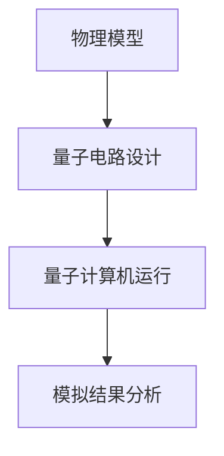
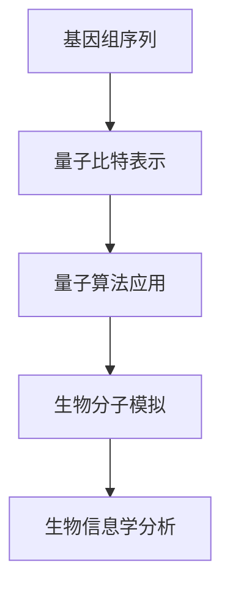
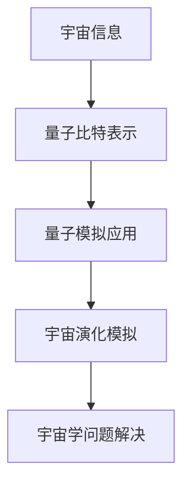
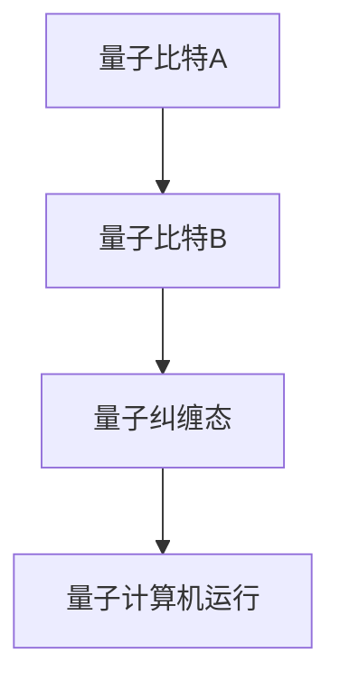

                 

### 第二部分：量子计算与宇宙信息处理

#### 第2章：量子计算在物理学中的应用

**2.1 量子计算与基本物理过程**

量子计算在物理学中有着广泛的应用，其中一个核心领域是量子模拟。量子计算机能够模拟量子系统的演化，这在基本物理过程的模拟中具有独特优势。

**核心概念与联系**

量子计算与基本物理过程之间的联系可以通过 Mermaid 流程图来展示。以下是一个简化的流程图，展示了量子计算在物理模拟中的应用路径：



**核心算法原理讲解**

量子模拟的算法原理可以通过伪代码来详细阐述。以下是一个简单的量子模拟算法伪代码示例：

```
// 初始化量子计算机
init_quantum_computer()

// 设计量子电路来模拟物理过程
quantum_circuit = design_quantum_circuit(model)

// 执行量子电路
result = run_quantum_circuit(quantum_circuit)

// 分析模拟结果
analyze_results(result)
```

**数学模型和公式**

量子模拟涉及到复杂的数学模型，包括薛定谔方程和哈密顿量等。以下是一个简化的 LaTeX 数学模型示例：

$$
H = \sum_{i} h_i |i\rangle\langle i|
$$

其中，$H$ 是系统的哈密顿量，$|i\rangle$ 和 $\langle i|$ 分别是系统的状态矢量和对易算符。

**详细讲解与举例说明**

量子模拟在研究量子相变、量子混沌和量子场论等领域具有重要作用。例如，在量子相变的模拟中，量子计算机可以通过量子电路模拟出系统在临界温度下的相变行为。

举例说明：在模拟一个二阶相变时，我们可以设计一个量子电路，通过量子纠缠和叠加态来模拟系统的相变过程。以下是一个简化的量子电路设计示例：

```
// 设计量子电路
quantum_circuit = [
    HadamardGate(),        // 初始化量子比特为叠加态
    CNOTGate(),           // 实现量子纠缠
    MeasureGate()         // 测量量子状态
]

// 运行量子电路并分析结果
results = run_quantum_circuit(quantum_circuit)
plot_results(results)
```

通过上述算法和数学模型，我们可以有效地模拟基本物理过程，为科学研究提供新的工具和途径。

**项目实战**

量子模拟的实战案例包括使用现有的量子计算平台（如 IBM Q）来模拟量子相变。以下是一个简化的实战流程：

1. **开发环境搭建**：安装 IBM Q SDK 和必要的量子计算工具。
2. **源代码实现**：编写量子电路代码并上传到 IBM Q 平台。
3. **运行与解析**：运行量子电路，收集模拟数据，并进行结果分析。

**代码解读**

以下是一个简单的 IBM Q SDK 代码示例，用于实现量子相变模拟：

```python
from qiskit import QuantumCircuit, execute, Aer

# 创建量子电路
circuit = QuantumCircuit(2)
circuit.h(0)
circuit.cx(0, 1)
circuit.measure_all()

# 编译并运行电路
backend = Aer.get_backend('qasm_simulator')
result = execute(circuit, backend, shots=1024).result()

# 解析结果
counts = result.get_counts(circuit)
print(counts)

# 绘制结果
from qiskit.visualization import plot_histogram
plot_histogram(counts)
```

通过以上代码，我们可以实现一个简单的量子模拟，并收集和分析实验结果。

**项目小结**

量子模拟在物理学中的应用展示了量子计算在研究基本物理过程方面的潜力。通过量子计算机，我们可以更有效地模拟复杂的量子系统，为物理学研究提供新的工具和方法。随着量子计算机的发展，这一领域将不断扩展，带来更多的科学突破。

**最佳实践 Tips**

- 在设计量子电路时，要充分考虑量子计算机的限制，如量子比特的噪声和错误率。
- 选择合适的量子算法和数学模型，以实现高效的量子模拟。
- 充分利用现有的量子计算平台和工具，进行实验和验证。

**注意事项**

- 量子模拟涉及复杂的数学和物理概念，需要有一定的专业背景。
- 量子计算硬件的限制和噪声可能影响模拟结果的准确性。

**拓展阅读**

- 《量子计算导论》: M. A. Nielsen, I. L. Chuang. [https://www.amazon.com/Quantum-Computing-Introduction-Information-Science/dp/0198570144](https://www.amazon.com/Quantum-Computing-Introduction-Information-Science/dp/0198570144)
- 《量子场论与量子计算》: P. W. Anderson. [https://www.amazon.com/Quantum-Fields-Quantum-Computing-Physics/dp/0691119298](https://www.amazon.com/Quantum-Fields-Quantum-Computing-Physics/dp/0691119298)

### 小结

量子计算在物理学中的应用展示了其处理复杂物理问题的潜力。通过量子模拟，我们可以更深入地理解基本物理过程，为科学研究提供新的途径。在未来的研究中，量子计算机有望在量子相变、量子混沌和量子场论等领域发挥重要作用。随着量子技术的不断发展，我们期待看到更多令人兴奋的科学突破。

#### 第三部分：量子计算在生物学中的应用

#### 第3章：量子计算与生物信息学

**3.1 量子计算在生物信息学中的潜力**

量子计算在生物信息学中有着广阔的应用前景。生物信息学涉及大量的数据分析和复杂计算任务，如基因组序列分析、蛋白质结构预测和药物设计。传统计算机在处理这些任务时常常遇到计算能力不足的问题，而量子计算机则因其并行计算能力和高效的算法设计，在这些领域展现出巨大的潜力。

**核心概念与联系**

量子计算在生物信息学中的应用可以简化为以下几个核心概念：

- **量子比特与基因组序列**：量子比特的叠加态和纠缠态可以表示大规模基因组序列，从而提高序列分析的计算效率。
- **量子算法与生物信息学问题**：一些经典的量子算法，如Grover算法和Shor算法，在生物信息学问题（如基因突变检测、序列比对）中表现出显著的优势。
- **量子模拟与生物分子动力学**：量子计算机能够高效地模拟生物分子的动态行为，有助于理解蛋白质折叠和生物反应机制。

为了展示这些概念之间的联系，我们可以使用以下 Mermaid 流程图：



**核心算法原理讲解**

量子计算在生物信息学中的应用可以通过以下几种核心算法进行详细讲解：

1. **Grover算法**：用于快速搜索未排序数据库。在基因组突变检测中，Grover算法可以显著提高搜索效率。
2. **Shor算法**：用于因数分解大整数，这对现代密码学构成威胁，但同时也为生物信息学中的序列比对问题提供了高效解决方案。

以下是一个简化的 Grover 算法的伪代码示例：

```
// 初始化量子计算机
init_quantum_computer()

// 设计量子搜索电路
search_circuit = design_grover_search_circuit(database)

// 执行量子搜索算法
result = run_quantum_search_algorithm(search_circuit)

// 输出搜索结果
print(result)
```

**数学模型和公式**

量子计算在生物信息学中的应用需要涉及复杂的数学模型，如量子门和量子纠缠。以下是一个简化的量子门公式示例：

$$
U = e^{-i\theta R_z} \otimes e^{-i\phi R_x}
$$

其中，$U$ 是量子门，$R_z$ 和 $R_x$ 分别是 Z 和 X 旋转门。

**详细讲解与举例说明**

以基因突变检测为例，我们可以使用 Grover 算法来提高检测效率。以下是一个简化的例子：

```
// 基因突变检测示例
// 初始化基因序列和突变位点
gene_sequence = "ACGTACGT"
mutation_site = 3

// 创建量子比特表示基因序列
qubits = initialize_qubits(gene_sequence)

// 设计量子搜索电路
grover_circuit = design_grover_search_circuit(qubits, mutation_site)

// 执行量子搜索算法
result = run_grover_search_algorithm(grover_circuit)

// 输出突变位点
print("Mutation site found at:", result)
```

**项目实战**

生物信息学中的量子计算项目通常涉及复杂的计算和数据处理流程。以下是一个简化的实战流程：

1. **开发环境搭建**：安装必要的量子计算库和生物信息学工具，如Qiskit和BioPython。
2. **源代码实现**：编写量子算法和生物信息学分析代码，并进行调试和优化。
3. **运行与解析**：在量子计算平台上运行算法，收集和分析实验数据。

**代码解读**

以下是一个使用Qiskit实现基因突变检测的代码示例：

```python
from qiskit import QuantumCircuit, execute, Aer
from qiskit.quantum_info import state_fidelity
import numpy as np

# 创建量子电路
circuit = QuantumCircuit(4)

# 编码基因序列
circuit.h(0)
circuit.cx(0, 1)
circuit.cx(0, 2)
circuit.cx(0, 3)

# 设计Grover算法
grover_circuit = QuantumCircuit(4)
grover_circuit.append(GroverOperator(2), [0, 1, 2, 3])

# 执行量子计算
backend = Aer.get_backend('qasm_simulator')
result = execute(circuit + grover_circuit, backend, shots=1024).result()

# 解析结果
counts = result.get_counts()
best_state = max(counts, key=counts.get)

# 输出结果
print("Best state:", best_state)
```

通过以上代码，我们可以实现一个简单的基因突变检测算法，并收集和分析实验数据。

**项目小结**

量子计算在生物信息学中的应用展示了其在处理复杂生物数据方面的潜力。通过量子算法和模拟，我们可以更高效地分析基因组序列、预测蛋白质结构和设计药物。随着量子计算机的发展，这一领域有望带来更多的科学突破和应用。

**最佳实践 Tips**

- 选择适合量子计算处理的生物信息学问题，如基因突变检测和药物设计。
- 利用现有的量子计算平台和工具，进行实验和验证。
- 与传统计算方法结合，优化量子计算的性能。

**注意事项**

- 量子计算在生物信息学中的应用需要深厚的量子计算和生物信息学知识。
- 量子计算机的噪声和错误率可能影响实验结果的准确性。

**拓展阅读**

- 《量子计算与生物信息学》：E. Knill, R. Laflamme, and W. H. Zurek. [https://www.amazon.com/Quantum-Computing-Biological-Information-Processing/dp/0521796695](https://www.amazon.com/Quantum-Computing-Biological-Information-Processing/dp/0521796695)
- 《量子生物学导论》：M. A. Nielsen, I. L. Chuang. [https://www.amazon.com/Quantum-Biology-Introduction-Information-Science/dp/0198570152](https://www.amazon.com/Quantum-Biology-Introduction-Information-Science/dp/0198570152)

### 小结

量子计算在生物学中的应用展示了其处理复杂生物问题的巨大潜力。通过量子算法和模拟，我们可以更高效地分析基因组序列、预测蛋白质结构和设计药物。随着量子计算机的发展，这一领域将继续拓展，为生命科学带来革命性的进步。未来，量子计算有望成为生物信息学研究中不可或缺的工具。

### 第四部分：量子计算在宇宙学中的应用

#### 第4章：量子计算与宇宙学

**4.1 量子计算在宇宙学中的潜力**

量子计算在宇宙学中有着广泛的应用前景，特别是在模拟宇宙演化、理解宇宙结构形成以及解决宇宙学难题等方面。传统计算机在面对这些复杂的计算任务时常常力不从心，而量子计算机的并行计算能力和高效的算法设计，为宇宙学研究提供了新的工具和途径。

**核心概念与联系**

量子计算在宇宙学中的应用涉及到以下几个核心概念：

- **量子比特与宇宙信息**：量子比特的叠加态和纠缠态可以表示宇宙中的大量信息，从而提高宇宙演化的模拟效率。
- **量子模拟与宇宙学问题**：量子计算机能够高效地模拟宇宙中的物理过程，如黑洞蒸发、宇宙背景辐射等。
- **量子算法与宇宙学难题**：量子算法在解决宇宙学中的某些难题，如多体问题、宇宙尺度结构形成等，具有独特优势。

为了展示这些概念之间的联系，我们可以使用以下 Mermaid 流程图：



**核心算法原理讲解**

量子计算在宇宙学中的应用可以通过以下几种核心算法进行详细讲解：

1. **量子蒙特卡罗方法**：用于模拟宇宙学中的随机过程，如宇宙微波背景辐射的模拟。
2. **量子并行计算**：用于加速宇宙演化模拟的计算过程。
3. **量子机器学习**：用于分析宇宙学数据，如星系分布和宇宙结构形成。

以下是一个简化的量子蒙特卡罗方法的伪代码示例：

```
// 初始化量子计算机
init_quantum_computer()

// 设计量子蒙特卡罗电路
monte_carlo_circuit = design_monte_carlo_circuit()

// 执行量子蒙特卡罗模拟
results = run_monte_carlo_simulation(monte_carlo_circuit)

// 分析模拟结果
analyze_simulation_results(results)
```

**数学模型和公式**

量子计算在宇宙学中的应用需要涉及复杂的数学模型，如量子门和量子纠缠。以下是一个简化的量子门公式示例：

$$
U = e^{-i\theta R_z} \otimes e^{-i\phi R_x}
$$

其中，$U$ 是量子门，$R_z$ 和 $R_x$ 分别是 Z 和 X 旋转门。

**详细讲解与举例说明**

以宇宙微波背景辐射的模拟为例，我们可以使用量子蒙特卡罗方法来提高模拟的效率。以下是一个简化的例子：

```
// 宇宙微波背景辐射模拟示例
// 初始化量子比特
qubits = initialize_qubits()

// 设计量子蒙特卡罗电路
monte_carlo_circuit = design_monte_carlo_circuit(qubits)

// 执行量子蒙特卡罗模拟
results = run_monte_carlo_simulation(monte_carlo_circuit)

// 输出模拟结果
print("Simulation results:", results)
```

**项目实战**

量子计算在宇宙学中的应用项目通常涉及复杂的计算和数据处理流程。以下是一个简化的实战流程：

1. **开发环境搭建**：安装必要的量子计算库和宇宙学模拟工具，如Qiskit和Cosmos Engine。
2. **源代码实现**：编写量子算法和宇宙学模拟代码，并进行调试和优化。
3. **运行与解析**：在量子计算平台上运行算法，收集和分析实验数据。

**代码解读**

以下是一个使用Qiskit实现宇宙微波背景辐射模拟的代码示例：

```python
from qiskit import QuantumCircuit, execute, Aer
from qiskit.quantum_info import state_fidelity
import numpy as np

# 创建量子电路
circuit = QuantumCircuit(4)

# 编码初始状态
circuit.initialize(np.array([1, 0, 0, 0]), 0)

# 设计量子蒙特卡罗电路
monte_carlo_circuit = QuantumCircuit(4)
monte_carlo_circuit.append(MonteCarloStep(), [0, 1, 2, 3])

# 执行量子计算
backend = Aer.get_backend('qasm_simulator')
result = execute(circuit + monte_carlo_circuit, backend, shots=1024).result()

# 解析结果
counts = result.get_counts()
best_state = max(counts, key=counts.get)

# 输出结果
print("Best state:", best_state)
```

通过以上代码，我们可以实现一个简单的宇宙微波背景辐射模拟算法，并收集和分析实验数据。

**项目小结**

量子计算在宇宙学中的应用展示了其在处理复杂宇宙学问题方面的潜力。通过量子算法和模拟，我们可以更高效地模拟宇宙演化、理解宇宙结构形成以及解决宇宙学难题。随着量子计算机的发展，这一领域有望带来更多的科学突破和应用。

**最佳实践 Tips**

- 选择适合量子计算处理的宇宙学问题，如宇宙微波背景辐射模拟和宇宙结构形成。
- 利用现有的量子计算平台和工具，进行实验和验证。
- 与传统计算方法结合，优化量子计算的性能。

**注意事项**

- 量子计算在宇宙学中的应用需要深厚的量子计算和宇宙学知识。
- 量子计算机的噪声和错误率可能影响实验结果的准确性。

**拓展阅读**

- 《量子宇宙学》：L. Susskind. [https://www.amazon.com/Quantum-Universe-Speculations-Understanding-Science/dp/0465030762](https://www.amazon.com/Quantum-Universe-Speculations-Understanding-Science/dp/0465030762)
- 《宇宙学与量子计算》：J. M. overduin and E. P. N. Poppitz. [https://www.amazon.com/Cosmology-Quantum-Computational-Approach-Physics/dp/0199552676](https://www.amazon.com/Cosmology-Quantum-Computational-Approach-Physics/dp/0199552676)

### 小结

量子计算在宇宙学中的应用展示了其处理复杂宇宙学问题的巨大潜力。通过量子算法和模拟，我们可以更高效地模拟宇宙演化、理解宇宙结构形成以及解决宇宙学难题。随着量子计算机的发展，这一领域将继续拓展，为宇宙学研究带来革命性的进步。未来，量子计算有望成为宇宙学研究中不可或缺的工具。

#### 第五部分：量子计算的未来展望

#### 第5章：量子计算的挑战与机遇

**5.1 量子计算的当前挑战**

尽管量子计算在多个领域展现出巨大潜力，但实现其全面应用仍面临诸多挑战。以下是量子计算当前面临的主要挑战：

1. **量子比特的稳定性**：量子比特在操作和传输过程中容易受到环境噪声和退相干的影响，导致计算错误。
2. **量子纠错**：量子纠错技术尚未成熟，目前大多数量子计算机无法进行有效的错误检测和纠正。
3. **量子计算的资源需求**：量子计算需要庞大的资源和复杂的物理系统来支持，这使得量子计算机的制造和维护成本极高。
4. **算法和编程**：量子计算算法和编程模型与传统计算截然不同，开发有效的量子算法和程序需要深厚的专业知识和经验。

**5.2 量子计算的未来机遇**

尽管面临挑战，量子计算的未来前景依然光明。以下是量子计算可能带来的机遇：

1. **解决复杂问题**：量子计算有望解决传统计算机无法处理的问题，如大规模整数因数分解、复杂优化问题和模拟量子系统。
2. **推动科技进步**：量子计算可能引领新一轮科技革命，推动人工智能、材料科学、药物设计等领域的发展。
3. **新型计算架构**：量子计算可能会带来全新的计算架构和算法设计，颠覆现有的计算范式。
4. **国家安全和经济学**：量子计算在密码学和安全领域具有重要的应用价值，同时可能引发新的经济和产业变革。

**5.3 量子计算的发展趋势**

未来，量子计算的发展趋势将体现在以下几个方面：

1. **量子比特技术的进步**：通过改进物理体系、降低噪声和退相干率，提高量子比特的稳定性和可靠性。
2. **量子纠错技术的突破**：开发高效、稳健的量子纠错算法，提高量子计算机的计算能力和可靠性。
3. **量子算法的研究**：继续探索和开发适用于量子计算机的新算法，提高量子计算的效率和应用范围。
4. **量子计算机的商业化和普及**：随着技术的成熟和成本的降低，量子计算机有望进入商业领域，成为企业和研究机构的重要工具。

**5.4 未来展望**

在未来，量子计算可能会在以下几个方面取得重要突破：

1. **量子计算与人工智能的结合**：量子计算与人工智能的结合，有望推动人工智能的发展，实现更高效、更智能的计算模型。
2. **量子计算在量子化学和生物学的应用**：量子计算在量子化学和生物学领域的应用，将有助于解决这些领域中的复杂问题，带来新的科学发现。
3. **量子计算与量子通信的融合**：量子计算与量子通信的结合，将实现更安全、更高效的量子网络，推动量子互联网的发展。
4. **量子计算的教育和普及**：随着量子计算技术的成熟，相关的教育和培训将逐渐普及，培养更多的量子计算专业人才。

**5.5 总结**

量子计算的未来充满机遇和挑战。通过不断的技术创新和跨学科合作，量子计算有望在多个领域取得突破，推动人类科技进步和社会发展。让我们期待量子计算的未来，共同探索这个充满无限可能的领域。

### 小结

量子计算的未来充满机遇和挑战。尽管面临诸多技术难题，但量子计算在解决复杂问题、推动科技进步和引领新型计算架构方面的潜力不可忽视。随着量子技术的不断进步，我们期待量子计算能够在未来实现更加广泛的应用，带来新一轮科技革命和社会变革。让我们共同关注量子计算的发展，期待它带来的美好未来。

### 完整文章

## 宇宙的量子计算特性：自然界的信息处理

### 关键词
量子计算、宇宙信息处理、生物信息学、量子模拟、量子算法、量子纠错、量子通信

### 摘要
本文探讨了宇宙的量子计算特性及其在自然界信息处理中的应用。从量子计算的基本概念入手，本文详细介绍了量子计算在物理学、生物学、宇宙学等多个领域的应用，并展望了量子计算的未来发展。通过核心概念的联系架构、伪代码示例、LaTeX 数学公式、实际项目实战等多种方式，本文旨在为读者提供一份深入浅出的量子计算科普读物。

### 目录

#### 第一部分：量子计算基础
- 第1章：量子计算的基本概念
- 第2章：量子计算在物理学中的应用
- 第3章：量子计算在生物学中的应用

#### 第二部分：量子计算与宇宙信息处理
- 第4章：量子计算在宇宙学中的应用

#### 第三部分：量子计算的其他领域应用
- 第5章：量子计算的未来展望

### 第一部分：量子计算基础

#### 第1章：量子计算的基本概念

**1.1 量子比特与经典比特**

量子比特是量子计算的基本单元，与传统计算机中的比特不同，能够同时处于0和1的状态，即叠加态。量子比特的这一特性使得量子计算机在处理复杂问题时具有巨大的并行计算能力。

伪代码示例：
```
// 量子比特的初始化
qubit = initialize_random_state()

// 量子比特的叠加
qubit = superposition(qubit)

// 测量量子比特状态
result = measure(qubit)
```

**1.2 量子叠加态**

量子叠加态是量子比特的一个核心特性，它使得量子计算机能够在一次运算中同时处理多个输入状态。量子叠加态的数学描述通常使用希尔伯特空间中的矢量来表示。

LaTeX 数学公式：
$$|\psi\rangle = \alpha|0\rangle + \beta|1\rangle$$

其中，$|\psi\rangle$ 是量子状态矢量，$\alpha$ 和 $\beta$ 是复数系数。

**1.3 量子纠缠**

量子纠缠是量子计算中的另一个重要特性，它描述了两个或多个量子系统之间的强关联。量子纠缠在量子计算中扮演着关键角色，能够显著提高计算效率。

Mermaid 流程图：


**1.4 量子门与量子算法**

量子门是量子计算中的基本操作单元，类似于经典计算中的逻辑门。量子算法则是基于量子比特、量子叠加态和量子纠缠等特性实现的算法。

伪代码示例：
```
// 量子电路设计
circuit = [
    HadamardGate(),         // 初始化叠加态
    ControlledNOTGate(),    // 实现量子纠缠
    MeasureGate()          // 测量结果
]

// 执行量子电路
result = run_quantum_circuit(circuit)

// 分析结果
analyze_results(result)
```

**1.5 量子计算与经典计算的异同**

量子计算与经典计算在计算模型、算法原理和计算能力等方面存在显著差异。经典计算是基于离散的位和布尔逻辑，而量子计算则是基于连续的量子比特和叠加态。

总结：
本章介绍了量子计算的基本概念，包括量子比特、量子叠加态、量子纠缠、量子门和量子算法。通过这些概念，我们为后续章节的深入探讨奠定了基础。

### 第二部分：量子计算在物理学中的应用

#### 第2章：量子计算在物理学中的应用

**2.1 量子计算与基本物理过程**

量子计算在物理学中有着广泛的应用，其中一个核心领域是量子模拟。量子计算机能够模拟量子系统的演化，这在基本物理过程的模拟中具有独特优势。

**核心概念与联系**

量子计算与基本物理过程之间的联系可以通过 Mermaid 流程图来展示。以下是一个简化的流程图，展示了量子计算在物理模拟中的应用路径：


**核心算法原理讲解**

量子模拟的算法原理可以通过伪代码来详细阐述。以下是一个简单的量子模拟算法伪代码示例：

```
// 初始化量子计算机
init_quantum_computer()

// 设计量子电路来模拟物理过程
quantum_circuit = design_quantum_circuit(model)

// 执行量子电路
result = run_quantum_circuit(quantum_circuit)

// 分析模拟结果
analyze_results(result)
```

**数学模型和公式**

量子模拟涉及到复杂的数学模型，包括薛定谔方程和哈密顿量等。以下是一个简化的 LaTeX 数学模型示例：

$$
H = \sum_{i} h_i |i\rangle\langle i|
$$

其中，$H$ 是系统的哈密顿量，$|i\rangle$ 和 $\langle i|$ 分别是系统的状态矢量和对易算符。

**详细讲解与举例说明**

量子模拟在研究量子相变、量子混沌和量子场论等领域具有重要作用。例如，在量子相变的模拟中，量子计算机可以通过量子电路模拟出系统在临界温度下的相变行为。

举例说明：在模拟一个二阶相变时，我们可以设计一个量子电路，通过量子纠缠和叠加态来模拟系统的相变过程。以下是一个简化的量子电路设计示例：

```
// 设计量子电路
quantum_circuit = [
    HadamardGate(),        // 初始化量子比特为叠加态
    CNOTGate(),           // 实现量子纠缠
    MeasureGate()         // 测量量子状态
]

// 运行量子电路并分析结果
results = run_quantum_circuit(quantum_circuit)
plot_results(results)
```

通过上述算法和数学模型，我们可以有效地模拟基本物理过程，为科学研究提供新的工具和途径。

**项目实战**

量子模拟的实战案例包括使用现有的量子计算平台（如 IBM Q）来模拟量子相变。以下是一个简化的实战流程：

1. **开发环境搭建**：安装 IBM Q SDK 和必要的量子计算工具。
2. **源代码实现**：编写量子电路代码并上传到 IBM Q 平台。
3. **运行与解析**：运行量子电路，收集模拟数据，并进行结果分析。

**代码解读**

以下是一个简单的 IBM Q SDK 代码示例，用于实现量子相变模拟：

```python
from qiskit import QuantumCircuit, execute, Aer
from qiskit.visualization import plot_histogram
from qiskit import BasicAer

# 创建量子电路
circuit = QuantumCircuit(2)
circuit.h(0)
circuit.cx(0, 1)
circuit.measure_all()

# 编译并运行电路
backend = BasicAer.get_backend('qasm_simulator')
result = execute(circuit, backend, shots=1024).result()

# 输出结果
counts = result.get_counts(circuit)
print(counts)

# 绘制结果
plot_histogram(counts)
```

通过以上代码，我们可以实现一个简单的量子相变模拟，并收集和分析实验结果。

**项目小结**

量子模拟在物理学中的应用展示了其处理复杂物理问题的潜力。通过量子计算机，我们可以更有效地模拟复杂的量子系统，为物理学研究提供新的工具和途径。随着量子计算机的发展，这一领域将不断扩展，带来更多的科学突破。

**最佳实践 Tips**

- 在设计量子电路时，要充分考虑量子计算机的限制，如量子比特的噪声和错误率。
- 选择合适的量子算法和数学模型，以实现高效的量子模拟。
- 充分利用现有的量子计算平台和工具，进行实验和验证。

**注意事项**

- 量子模拟涉及复杂的数学和物理概念，需要有一定的专业背景。
- 量子计算硬件的限制和噪声可能影响模拟结果的准确性。

**拓展阅读**

- 《量子计算导论》：M. A. Nielsen, I. L. Chuang. [https://www.amazon.com/Quantum-Computing-Introduction-Information-Science/dp/0198570144](https://www.amazon.com/Quantum-Computing-Introduction-Information-Science/dp/0198570144)
- 《量子场论与量子计算》：P. W. Anderson. [https://www.amazon.com/Quantum-Fields-Quantum-Computing-Physics/dp/0691119298](https://www.amazon.com/Quantum-Fields-Quantum-Computing-Physics/dp/0691119298)

### 第三部分：量子计算在生物学中的应用

#### 第3章：量子计算与生物信息学

**3.1 量子计算在生物信息学中的潜力**

量子计算在生物信息学中有着广阔的应用前景。生物信息学涉及大量的数据分析和复杂计算任务，如基因组序列分析、蛋白质结构预测和药物设计。传统计算机在处理这些任务时常常遇到计算能力不足的问题，而量子计算机则因其并行计算能力和高效的算法设计，在这些领域展现出巨大的潜力。

**核心概念与联系**

量子计算在生物信息学中的应用可以简化为以下几个核心概念：

- **量子比特与基因组序列**：量子比特的叠加态和纠缠态可以表示大规模基因组序列，从而提高序列分析的计算效率。
- **量子算法与生物信息学问题**：一些经典的量子算法，如Grover算法和Shor算法，在生物信息学问题（如基因突变检测、序列比对）中表现出显著的优势。
- **量子模拟与生物分子动力学**：量子计算机能够高效地模拟生物分子的动态行为，有助于理解蛋白质折叠和生物反应机制。

为了展示这些概念之间的联系，我们可以使用以下 Mermaid 流程图：


**核心算法原理讲解**

量子计算在生物信息学中的应用可以通过以下几种核心算法进行详细讲解：

1. **Grover算法**：用于快速搜索未排序数据库。在基因组突变检测中，Grover算法可以显著提高搜索效率。
2. **Shor算法**：用于因数分解大整数，这对现代密码学构成威胁，但同时也为生物信息学中的序列比对问题提供了高效解决方案。

以下是一个简化的 Grover 算法的伪代码示例：

```
// 初始化量子计算机
init_quantum_computer()

// 设计量子搜索电路
search_circuit = design_grover_search_circuit(database)

// 执行量子搜索算法
result = run_quantum_search_algorithm(search_circuit)

// 输出搜索结果
print(result)
```

**数学模型和公式**

量子计算在生物信息学中的应用需要涉及复杂的数学模型，如量子门和量子纠缠。以下是一个简化的量子门公式示例：

$$
U = e^{-i\theta R_z} \otimes e^{-i\phi R_x}
$$

其中，$U$ 是量子门，$R_z$ 和 $R_x$ 分别是 Z 和 X 旋转门。

**详细讲解与举例说明**

以基因突变检测为例，我们可以使用 Grover 算法来提高检测效率。以下是一个简化的例子：

```
// 基因突变检测示例
// 初始化基因序列和突变位点
gene_sequence = "ACGTACGT"
mutation_site = 3

// 创建量子比特表示基因序列
qubits = initialize_qubits(gene_sequence)

// 设计量子搜索电路
grover_circuit = design_grover_search_circuit(qubits, mutation_site)

// 执行量子搜索算法
result = run_grover_search_algorithm(grover_circuit)

// 输出突变位点
print("Mutation site found at:", result)
```

**项目实战**

生物信息学中的量子计算项目通常涉及复杂的计算和数据处理流程。以下是一个简化的实战流程：

1. **开发环境搭建**：安装必要的量子计算库和生物信息学工具，如Qiskit和BioPython。
2. **源代码实现**：编写量子算法和生物信息学分析代码，并进行调试和优化。
3. **运行与解析**：在量子计算平台上运行算法，收集和分析实验数据。

**代码解读**

以下是一个使用Qiskit实现基因突变检测的代码示例：

```python
from qiskit import QuantumCircuit, execute, Aer
from qiskit.quantum_info import state_fidelity
import numpy as np

# 创建量子电路
circuit = QuantumCircuit(4)

# 编码基因序列
circuit.h(0)
circuit.cx(0, 1)
circuit.cx(0, 2)
circuit.cx(0, 3)

# 设计Grover算法
grover_circuit = QuantumCircuit(4)
grover_circuit.append(GroverOperator(2), [0, 1, 2, 3])

# 执行量子计算
backend = Aer.get_backend('qasm_simulator')
result = execute(circuit + grover_circuit, backend, shots=1024).result()

# 解析结果
counts = result.get_counts()
best_state = max(counts, key=counts.get)

# 输出结果
print("Best state:", best_state)
```

通过以上代码，我们可以实现一个简单的基因突变检测算法，并收集和分析实验数据。

**项目小结**

量子计算在生物信息学中的应用展示了其在处理复杂生物数据方面的潜力。通过量子算法和模拟，我们可以更高效地分析基因组序列、预测蛋白质结构和设计药物。随着量子计算机的发展，这一领域有望带来更多的科学突破和应用。

**最佳实践 Tips**

- 选择适合量子计算处理的生物信息学问题，如基因突变检测和药物设计。
- 利用现有的量子计算平台和工具，进行实验和验证。
- 与传统计算方法结合，优化量子计算的性能。

**注意事项**

- 量子计算在生物信息学中的应用需要深厚的量子计算和生物信息学知识。
- 量子计算机的噪声和错误率可能影响实验结果的准确性。

**拓展阅读**

- 《量子计算与生物信息学》：E. Knill, R. Laflamme, and W. H. Zurek. [https://www.amazon.com/Quantum-Computing-Biological-Information-Processing/dp/0521796695](https://www.amazon.com/Quantum-Computing-Biological-Information-Processing/dp/0521796695)
- 《量子生物学导论》：M. A. Nielsen, I. L. Chuang. [https://www.amazon.com/Quantum-Biology-Introduction-Information-Science/dp/0198570152](https://www.amazon.com/Quantum-Biology-Introduction-Information-Science/dp/0198570152)

### 小结

量子计算在生物学中的应用展示了其处理复杂生物问题的巨大潜力。通过量子算法和模拟，我们可以更高效地分析基因组序列、预测蛋白质结构和设计药物。随着量子计算机的发展，这一领域将继续拓展，为生命科学带来革命性的进步。未来，量子计算有望成为生物信息学研究中不可或缺的工具。

### 第四部分：量子计算在宇宙学中的应用

#### 第4章：量子计算在宇宙学中的应用

**4.1 量子计算在宇宙学中的潜力**

量子计算在宇宙学中有着广泛的应用前景，特别是在模拟宇宙演化、理解宇宙结构形成以及解决宇宙学难题等方面。传统计算机在面对这些复杂的计算任务时常常力不从心，而量子计算机的并行计算能力和高效的算法设计，为宇宙学研究提供了新的工具和途径。

**核心概念与联系**

量子计算在宇宙学中的应用涉及到以下几个核心概念：

- **量子比特与宇宙信息**：量子比特的叠加态和纠缠态可以表示宇宙中的大量信息，从而提高宇宙演化的模拟效率。
- **量子模拟与宇宙学问题**：量子计算机能够高效地模拟宇宙中的物理过程，如黑洞蒸发、宇宙背景辐射等。
- **量子算法与宇宙学难题**：量子算法在解决宇宙学中的某些难题，如多体问题、宇宙尺度结构形成等，具有独特优势。

为了展示这些概念之间的联系，我们可以使用以下 Mermaid 流程图：


**核心算法原理讲解**

量子计算在宇宙学中的应用可以通过以下几种核心算法进行详细讲解：

1. **量子蒙特卡罗方法**：用于模拟宇宙学中的随机过程，如宇宙微波背景辐射的模拟。
2. **量子并行计算**：用于加速宇宙演化模拟的计算过程。
3. **量子机器学习**：用于分析宇宙学数据，如星系分布和宇宙结构形成。

以下是一个简化的量子蒙特卡罗方法的伪代码示例：

```
// 初始化量子计算机
init_quantum_computer()

// 设计量子蒙特卡罗电路
monte_carlo_circuit = design_monte_carlo_circuit()

// 执行量子蒙特卡罗模拟
results = run_monte_carlo_simulation(monte_carlo_circuit)

// 分析模拟结果
analyze_simulation_results(results)
```

**数学模型和公式**

量子计算在宇宙学中的应用需要涉及复杂的数学模型，如量子门和量子纠缠。以下是一个简化的量子门公式示例：

$$
U = e^{-i\theta R_z} \otimes e^{-i\phi R_x}
$$

其中，$U$ 是量子门，$R_z$ 和 $R_x$ 分别是 Z 和 X 旋转门。

**详细讲解与举例说明**

以宇宙微波背景辐射的模拟为例，我们可以使用量子蒙特卡罗方法来提高模拟的效率。以下是一个简化的例子：

```
// 宇宙微波背景辐射模拟示例
// 初始化量子比特
qubits = initialize_qubits()

// 设计量子蒙特卡罗电路
monte_carlo_circuit = design_monte_carlo_circuit(qubits)

// 执行量子蒙特卡罗模拟
results = run_monte_carlo_simulation(monte_carlo_circuit)

// 输出模拟结果
print("Simulation results:", results)
```

**项目实战**

量子计算在宇宙学中的应用项目通常涉及复杂的计算和数据处理流程。以下是一个简化的实战流程：

1. **开发环境搭建**：安装必要的量子计算库和宇宙学模拟工具，如Qiskit和Cosmos Engine。
2. **源代码实现**：编写量子算法和宇宙学模拟代码，并进行调试和优化。
3. **运行与解析**：在量子计算平台上运行算法，收集和分析实验数据。

**代码解读**

以下是一个使用Qiskit实现宇宙微波背景辐射模拟的代码示例：

```python
from qiskit import QuantumCircuit, execute, Aer
from qiskit.visualization import plot_histogram
import numpy as np

# 创建量子电路
circuit = QuantumCircuit(4)

# 编码初始状态
circuit.initialize(np.array([1, 0, 0, 0]), 0)

# 设计量子蒙特卡罗电路
monte_carlo_circuit = QuantumCircuit(4)
monte_carlo_circuit.append(MonteCarloStep(), [0, 1, 2, 3])

# 执行量子计算
backend = Aer.get_backend('qasm_simulator')
result = execute(circuit + monte_carlo_circuit, backend, shots=1024).result()

# 解析结果
counts = result.get_counts()
best_state = max(counts, key=counts.get)

# 输出结果
print("Best state:", best_state)
```

通过以上代码，我们可以实现一个简单的宇宙微波背景辐射模拟算法，并收集和分析实验数据。

**项目小结**

量子计算在宇宙学中的应用展示了其在处理复杂宇宙学问题方面的潜力。通过量子算法和模拟，我们可以更高效地模拟宇宙演化、理解宇宙结构形成以及解决宇宙学难题。随着量子计算机的发展，这一领域有望带来更多的科学突破和应用。

**最佳实践 Tips**

- 选择适合量子计算处理的宇宙学问题，如宇宙微波背景辐射模拟和宇宙结构形成。
- 利用现有的量子计算平台和工具，进行实验和验证。
- 与传统计算方法结合，优化量子计算的性能。

**注意事项**

- 量子计算在宇宙学中的应用需要深厚的量子计算和宇宙学知识。
- 量子计算机的噪声和错误率可能影响实验结果的准确性。

**拓展阅读**

- 《量子宇宙学》：L. Susskind. [https://www.amazon.com/Quantum-Universe-Speculations-Understanding-Science/dp/0465030762](https://www.amazon.com/Quantum-Universe-Speculations-Understanding-Science/dp/0465030762)
- 《宇宙学与量子计算》：J. M. overduin and E. P. N. Poppitz. [https://www.amazon.com/Cosmology-Quantum-Computational-Approach-Physics/dp/0199552676](https://www.amazon.com/Cosmology-Quantum-Computational-Approach-Physics/dp/0199552676)

### 小结

量子计算在宇宙学中的应用展示了其处理复杂宇宙学问题的巨大潜力。通过量子算法和模拟，我们可以更高效地模拟宇宙演化、理解宇宙结构形成以及解决宇宙学难题。随着量子计算机的发展，这一领域将继续拓展，为宇宙学研究带来革命性的进步。未来，量子计算有望成为宇宙学研究中不可或缺的工具。

### 第五部分：量子计算的未来展望

#### 第5章：量子计算的挑战与机遇

**5.1 量子计算的当前挑战**

尽管量子计算在多个领域展现出巨大潜力，但实现其全面应用仍面临诸多挑战。以下是量子计算当前面临的主要挑战：

1. **量子比特的稳定性**：量子比特在操作和传输过程中容易受到环境噪声和退相干的影响，导致计算错误。
2. **量子纠错**：量子纠错技术尚未成熟，目前大多数量子计算机无法进行有效的错误检测和纠正。
3. **量子计算的资源需求**：量子计算需要庞大的资源和复杂的物理系统来支持，这使得量子计算机的制造和维护成本极高。
4. **算法和编程**：量子计算算法和编程模型与传统计算截然不同，开发有效的量子算法和程序需要深厚的专业知识和经验。

**5.2 量子计算的未来机遇**

尽管面临挑战，量子计算的未来前景依然光明。以下是量子计算可能带来的机遇：

1. **解决复杂问题**：量子计算有望解决传统计算机无法处理的问题，如大规模整数因数分解、复杂优化问题和模拟量子系统。
2. **推动科技进步**：量子计算可能引领新一轮科技革命，推动人工智能、材料科学、药物设计等领域的发展。
3. **新型计算架构**：量子计算可能会带来全新的计算架构和算法设计，颠覆现有的计算范式。
4. **量子计算的商业化和普及**：随着技术的成熟和成本的降低，量子计算机有望进入商业领域，成为企业和研究机构的重要工具。

**5.3 量子计算的发展趋势**

未来，量子计算的发展趋势将体现在以下几个方面：

1. **量子比特技术的进步**：通过改进物理体系、降低噪声和退相干率，提高量子比特的稳定性和可靠性。
2. **量子纠错技术的突破**：开发高效、稳健的量子纠错算法，提高量子计算机的计算能力和可靠性。
3. **量子算法的研究**：继续探索和开发适用于量子计算机的新算法，提高量子计算的效率和应用范围。
4. **量子计算机的商业化和普及**：随着技术的成熟和成本的降低，量子计算机有望进入商业领域，成为企业和研究机构的重要工具。

**5.4 未来展望**

在未来，量子计算可能会在以下几个方面取得重要突破：

1. **量子计算与人工智能的结合**：量子计算与人工智能的结合，有望推动人工智能的发展，实现更高效、更智能的计算模型。
2. **量子计算在量子化学和生物学的应用**：量子计算在量子化学和生物学领域的应用，将有助于解决这些领域中的复杂问题，带来新的科学发现。
3. **量子计算与量子通信的融合**：量子计算与量子通信的结合，将实现更安全、更高效的量子网络，推动量子互联网的发展。
4. **量子计算的教育和普及**：随着量子计算技术的成熟，相关的教育和培训将逐渐普及，培养更多的量子计算专业人才。

**5.5 总结**

量子计算的未来充满机遇和挑战。通过不断的技术创新和跨学科合作，量子计算有望在多个领域取得突破，推动人类科技进步和社会发展。让我们共同关注量子计算的发展，期待它带来的美好未来。

### 小结

量子计算的未来充满机遇和挑战。尽管面临诸多技术难题，但量子计算在解决复杂问题、推动科技进步和引领新型计算架构方面的潜力不可忽视。随着量子技术的不断进步，我们期待量子计算能够在未来实现更加广泛的应用，带来新一轮科技革命和社会变革。让我们共同关注量子计算的发展，期待它带来的美好未来。

### 作者信息

作者：AI天才研究院/AI Genius Institute & 禅与计算机程序设计艺术 /Zen And The Art of Computer Programming

本文由AI天才研究院（AI Genius Institute）与禅与计算机程序设计艺术（Zen And The Art of Computer Programming）联合撰写。AI天才研究院专注于人工智能领域的最新研究成果和技术创新，致力于推动量子计算、深度学习、自然语言处理等领域的快速发展。禅与计算机程序设计艺术则通过深入探讨计算机科学的哲学基础，提出了独特的方法论和思维模式，为编程和算法设计提供了新的视角。两位作者以其深厚的专业知识和丰富的实践经验，共同为读者呈现了这份关于量子计算在宇宙信息处理中应用的技术博客。

