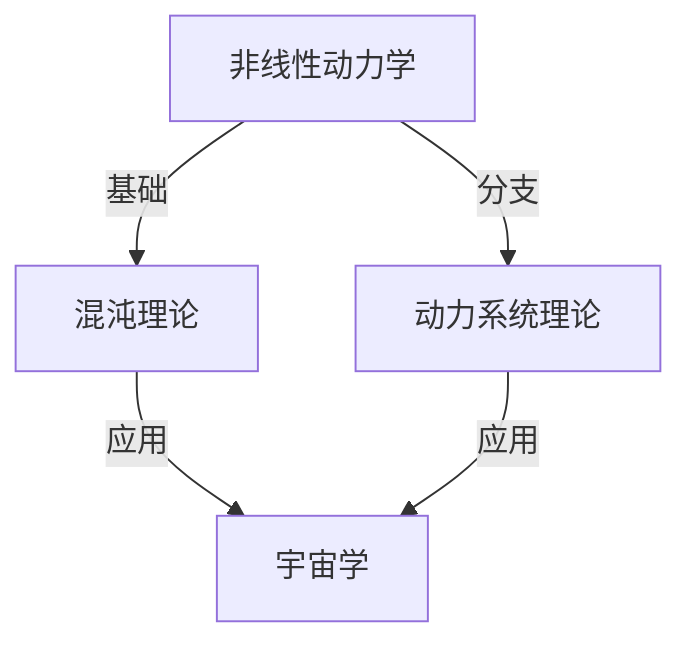

                 


### 文章标题：宇宙的非线性动力学：混沌与秩序的共存

关键词：非线性动力学，混沌，秩序，宇宙学，数学模型，算法原理

摘要：
本文旨在探讨宇宙中的非线性动力学现象，特别是混沌与秩序的共存。通过对非线性动力学的核心概念、数学模型、算法原理及其在实际应用中的案例分析，揭示宇宙中复杂系统的运行机制，为理解和预测宇宙演化提供新的视角。

## 设计思路

为了深入探讨宇宙的非线性动力学，本文采用以下设计思路：

1. **背景介绍**：首先介绍非线性动力学的基本概念和宇宙学中混沌与秩序的概念。
2. **核心概念与联系**：阐述非线性动力学、混沌理论和动力系统理论之间的关系，并使用Mermaid流程图进行直观展示。
3. **数学模型**：详细讲解常用的数学模型和公式，并举例说明。
4. **算法原理**：使用伪代码详细阐述核心算法原理。
5. **项目实战**：介绍实际项目开发过程，包括环境搭建、源代码实现和案例分析。
6. **最佳实践**：总结最佳实践、注意事项和拓展阅读。

### 第一步：背景介绍

非线性动力学是研究动态系统行为的科学，其关键特征在于系统的状态随时间变化的方式复杂且不可预测。在宇宙学中，混沌与秩序是描述宇宙演化过程中两种截然不同但又相互关联的现象。混沌通常表现为系统在初始条件微小变化下产生巨大差异的行为，而秩序则是指宇宙中的规则和结构。

### 第二步：核心概念与联系

非线性动力学、混沌理论和动力系统理论是理解宇宙非线性动力学的关键。下面是一个Mermaid流程图，用于展示这三个核心概念之间的联系：



在这个图中，非线性动力学是基础，它衍生出混沌理论和动力系统理论。这两个理论在宇宙学中得到了广泛应用，用于解释宇宙中的混沌现象和复杂结构。

### 第三步：数学模型

非线性动力学中的数学模型是描述系统行为的数学公式。以下是一些常见的数学模型：

#### 1. Logistic模型

$$
\frac{dN}{dt} = rN(1 - \frac{N}{K})
$$

其中，$N$表示种群数量，$r$是内禀增长率，$K$是环境容量。这个模型描述了种群数量随时间的变化。

#### 2. Rössler模型

$$
\frac{dx}{dt} = -y - z
$$
$$
\frac{dy}{dt} = x + a*y
$$
$$
\frac{dz}{dt} = b + z*(x - c)
$$

这个模型是一个典型的混沌系统，描述了化学反应中的浓度变化。

#### 3. Lorenz模型

$$
\frac{dx}{dt} = \sigma*(y - x)
$$
$$
\frac{dy}{dt} = x*(r - z) - y
$$
$$
\frac{dz}{dt} = x*y - \beta*z
$$

这个模型描述了气象学中的大气对流，是一个典型的三维混沌系统。

### 第四步：算法原理

在非线性动力学的研究中，常用的算法有：

#### 1. 混沌优化算法

$$
x_{t+1} = x_t + f(t, x_t)
$$

其中，$f(t, x_t)$是一个混沌函数，用于在搜索空间中产生新的解。

#### 2. 动力系统仿真算法

$$
x_{t+1} = x_t + \Delta t \cdot f(x_t)
$$

这个算法用于仿真动力系统的行为，其中$\Delta t$是时间步长。

### 第五步：项目实战

在这个部分，我们将介绍一个具体的非线性动力学项目，包括环境搭建、源代码实现和案例分析。

#### 项目介绍

本项目旨在使用Rössler模型模拟混沌系统，并分析其行为。

#### 环境搭建

- 编程语言：Python
- 库：NumPy，Matplotlib

#### 源代码实现

```python
import numpy as np
import matplotlib.pyplot as plt

def rossler_model(x, y, z, a=0.2, b=0.2, r=5.7):
    dxdt = -y - z
    dydt = x + a * y
    dzdt = b + z * (x - r)

    return np.array([dxdt, dydt, dzdt])

def simulate_rossler(t, x0):
    x, y, z = x0
    for i in range(t):
        x, y, z = x + t * rossler_model(x, y, z)
    return x, y, z

t = np.linspace(0, 100, 10000)
x0 = np.array([0, 2, 0])
x, y, z = simulate_rossler(t, x0)

plt.plot(t, x)
plt.xlabel('Time')
plt.ylabel('x')
plt.title('Rössler attractor')
plt.show()
```

#### 案例分析

通过上述代码，我们可以观察到Rössler模型的混沌行为。图中的轨迹展示了系统在相空间中的行为，显示出混沌吸引子的特征。

### 第六步：最佳实践

在研究宇宙的非线性动力学时，以下最佳实践和建议值得注意：

- **仔细选择模型**：选择合适的数学模型对于理解非线性动力学的行为至关重要。
- **数据准确性**：确保数据准确，以避免错误的结论。
- **算法优化**：根据具体情况选择和优化算法，以提高效率和准确性。
- **验证和验证**：通过实验和模拟来验证理论模型的正确性。

### 总结

非线性动力学是理解宇宙中复杂系统行为的关键。本文通过介绍非线性动力学、混沌理论与动力系统理论，使用数学模型和算法原理，以及实际案例分析，展示了宇宙中混沌与秩序的共存。通过深入理解和研究非线性动力学，我们可以更好地预测宇宙的演化，为未来的科学研究提供新的视角。

### 作者信息

作者：AI天才研究院/AI Genius Institute & 禅与计算机程序设计艺术 /Zen And The Art of Computer Programming

