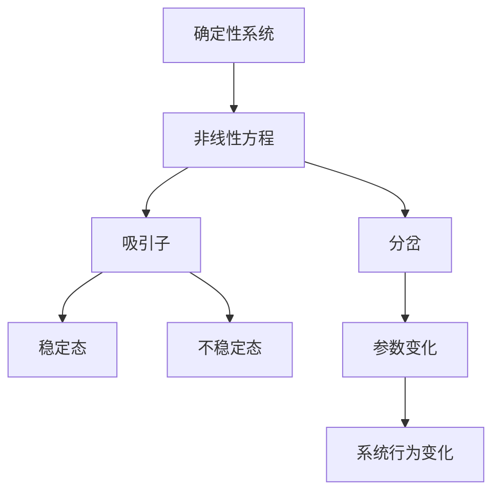
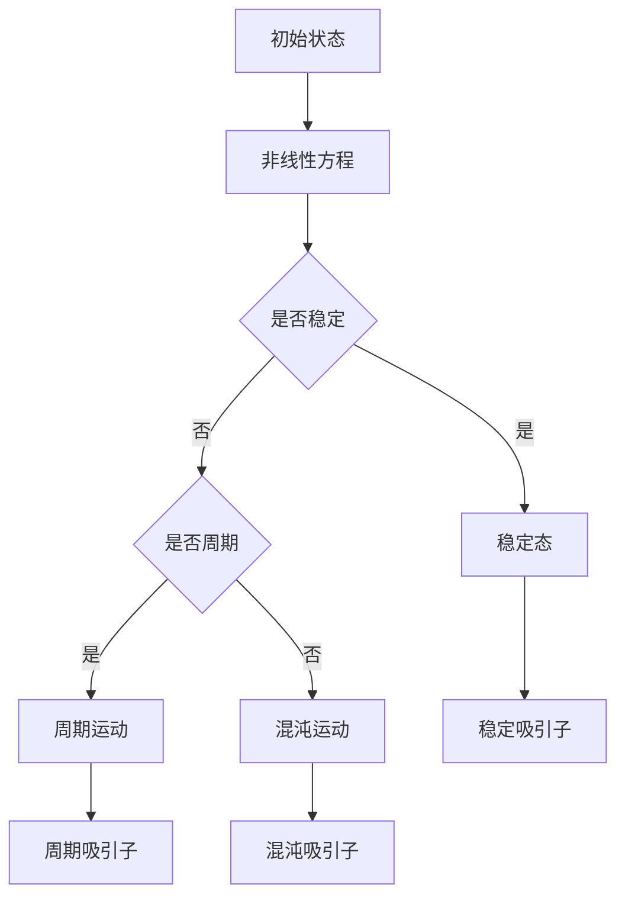
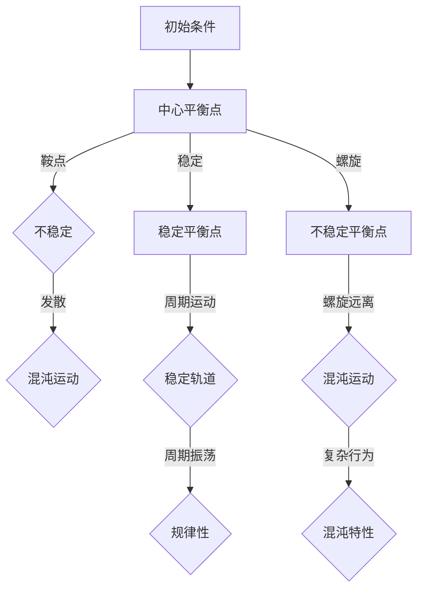
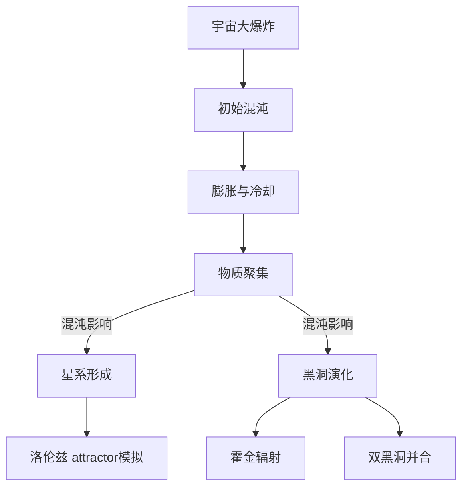
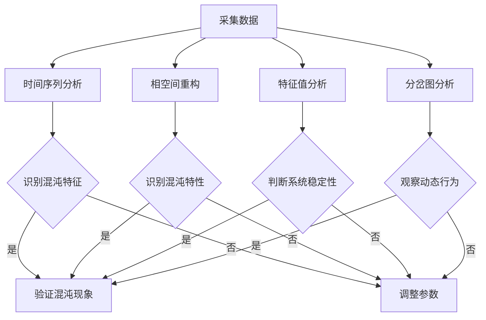
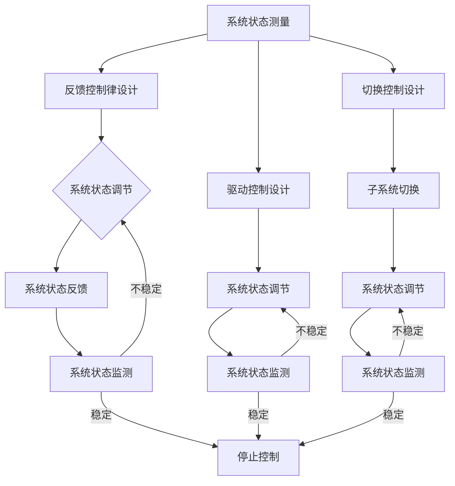

                 

### 摘要

宇宙的非线性动力学研究探索了宇宙中混沌与秩序的平衡，旨在揭示宇宙演化的复杂规律。本文将深入探讨非线性动力学的基本概念、混沌现象及其在宇宙中的表现。首先，我们将介绍非线性动力学的基础，解析混沌现象的数学定义和主要特征，并分析混沌的经典实例。接着，本文将探讨混沌与秩序的关系，分析非线性动力系统中的平衡态以及混沌运动中的平衡点。随后，我们将关注混沌现象在宇宙演化、星际物质运动以及行星运动中的应用。在第三部分，我们将探讨混沌现象的探测与控制技术，包括探测技术和控制策略。最后，本文将展望混沌现象研究的未来发展方向及其在宇宙探索和人类社会中的潜在影响。通过本文的详细探讨，读者将全面理解宇宙非线性动力学的重要性及其在实际应用中的广泛影响。 

### 目录大纲

**# 目录大纲**

**## 第一部分：宇宙的非线性动力学基础**

**### 第1章：非线性动力学的简介**

**#### 1.1.1 非线性动力学的基本概念**

**#### 1.1.2 非线性动力学的数学原理**

**#### 1.1.3 非线性动力学的研究方法**

**## 第2章：混沌现象解析**

**### 2.1.1 混沌的数学定义**

**### 2.1.2 混沌的主要特征**

**### 2.1.3 混沌的经典实例分析**

**## 第3章：混沌与秩序的平衡**

**### 3.1.1 混沌与秩序的关系**

**### 3.1.2 非线性动力系统中的平衡态**

**### 3.1.3 混沌运动中的平衡点分析**

**## 第二部分：混沌现象在宇宙中的应用**

**### 第4章：混沌在宇宙演化中的作用**

**### 第5章：混沌现象在星际物质运动中的应用**

**### 第6章：混沌现象在行星运动中的研究**

**## 第三部分：混沌现象的探测与控制**

**### 第7章：混沌现象的探测技术**

**### 第8章：混沌现象的控制策略**

**## 第9章：未来展望**

**### 9.1.1 混沌现象研究的未来发展方向**

**### 9.1.2 混沌现象在宇宙探索中的应用前景**

**### 9.1.3 混沌现象对人类社会的影响**

### 第一部分：宇宙的非线性动力学基础

#### 第1章：非线性动力学的简介

**1.1.1 非线性动力学的基本概念**

非线性动力学是研究自然界中复杂系统动态行为的科学。它关注非线性系统的运动规律，这些系统通常难以用简单的线性方程来描述。非线性动力学的研究始于18世纪的物理学，当时科学家们开始意识到许多自然现象，如行星运动、流体力学、电路系统等，都无法用线性模型精确描述。

**核心概念与联系**

非线性动力学中的核心概念包括：

- **确定性系统**：由确定性的数学模型描述的系统。
- **非线性方程**：与线性方程相比，非线性方程包含非线性项，这使得系统的行为可能非常复杂。
- **吸引子**：系统最终趋向的稳定状态。
- **分岔**：系统参数变化导致系统行为发生显著变化的现象。

**Mermaid 流程图**



**核心算法原理讲解**

非线性动力学的核心算法主要包括数值解法和符号解法。数值解法利用计算机算法求解非线性方程，常用的有四阶Runge-Kutta方法、牛顿迭代法等。符号解法则涉及微分方程的解析解，但通常只适用于简单系统。

**伪代码**

```python
# 数值解法伪代码
def solve_nonlinear_system(initial_conditions, parameters):
    # 初始条件
    x, y = initial_conditions
    
    # 时间步长
    dt = 0.01
    
    # 迭代计算
    while not converged:
        # Runge-Kutta 方法
        k1 = f(x, y, parameters)
        k2 = f(x + 0.5 * dt * k1, y + 0.5 * dt * k1, parameters)
        k3 = f(x + 0.5 * dt * k2, y + 0.5 * dt * k2, parameters)
        k4 = f(x + dt * k3, y + dt * k3, parameters)
        
        x = x + dt * (k1 + 2 * k2 + 2 * k3 + k4) / 6
        y = y + dt * (k1 + 2 * k2 + 2 * k3 + k4) / 6
        
        # 检查收敛条件
        if check_convergence(x, y):
            converged = True
    
    return x, y

# 解析解法伪代码
def symbolic_solution(nonlinear_equation):
    # 对非线性方程进行符号求解
    solution = sympy.solve(nonlinear_equation)
    return solution
```

**数学模型和公式**

非线性动力学的基本数学模型是微分方程，特别是非线性常微分方程。常见的非线性方程包括：

$$
\frac{dx}{dt} = f(x, t)
$$

其中，\( f(x, t) \) 是非线性函数。解这个方程可以揭示系统的动态行为。

**详细讲解和举例说明**

一个典型的例子是洛伦兹吸引子，它由以下三个非线性常微分方程描述：

$$
\begin{aligned}
\frac{dx}{dt} &= \sigma (y - x), \\
\frac{dy}{dt} &= x (\rho - z) - y, \\
\frac{dz}{dt} &= xy - \beta z.
\end{aligned}
$$

通过数值方法可以求解这个系统，并观察到复杂的混沌运动。

**项目实战**

在实际应用中，非线性动力学模型被广泛应用于气象预测、交通流模拟、生态系统模拟等领域。例如，在交通流模拟中，可以使用洛伦兹方程来模拟车辆在道路上的运动，从而预测交通拥堵。

**代码实现**

以下是一个简单的Python代码示例，用于模拟洛伦兹吸引子的运动：

```python
import numpy as np
from scipy.integrate import solve_ivp

# 洛伦兹方程参数
sigma = 10.0
rho = 28.0
beta = 8.0/3.0

# 洛伦兹吸引子微分方程
def lorenz(t, state):
    x, y, z = state
    dxdt = sigma * (y - x)
    dydt = x * (rho - z) - y
    dzdt = x * y - beta * z
    return [dxdt, dydt, dzdt]

# 初始条件
initial_state = [1.0, 1.0, 1.0]

# 时间范围
t_span = (0, 100)
t_eval = np.linspace(t_span[0], t_span[1], 10000)

# 求解洛伦兹方程
solution = solve_ivp(lorenz, t_span, initial_state, t_eval=t_eval)

# 绘制结果
import matplotlib.pyplot as plt

plt.plot(solution.y[0], solution.y[1], solution.y[2])
plt.xlabel('X')
plt.ylabel('Y')
plt.title('Lorenz Attractor')
plt.show()
```

**小结**

非线性动力学是研究复杂系统动态行为的科学，它在许多领域都有广泛应用。通过本文的讲解，我们了解了非线性动力学的基本概念、数学原理和核心算法，并通过实际案例展示了其在复杂系统模拟中的应用。

**注意事项**

- 非线性动力学的模型通常需要通过实验数据进行验证。
- 在实际应用中，数值模拟的结果可能与理论预测存在差异，这需要进一步的实验研究和优化。

**拓展阅读**

- Strogatz, S. H. (2001). Nonlinear Dynamics and Chaos: With Applications to Physics, Biology, Chemistry, and Engineering. Westview Press.
- Lorenz, E. N. (1963). Deterministic nonperiodic flow. Journal of Atmospheric Science, 20(2), 130-141.

**1.1.2 非线性动力学的数学原理**

非线性动力学的数学原理是其研究的基础，它涉及到复杂的数学模型和理论。非线性动力学的核心在于解决非线性微分方程，这些方程描述了系统在时间上的动态变化。以下是非线性动力学中的一些关键数学原理。

**基本原理**

非线性动力学的核心数学模型是非线性微分方程，通常形式如下：

$$
\frac{dx}{dt} = f(x, t)
$$

其中，\( f(x, t) \) 是非线性函数，\( x \) 是系统的状态变量，\( t \) 是时间。非线性微分方程的解可以揭示系统的动态行为，包括稳定态、周期运动和混沌运动。

**关键概念**

1. **吸引子（Attractor）**：系统最终趋向的稳定状态称为吸引子。吸引子可以是稳定的点、周期轨道或混沌轨道。

2. **分岔（Bifurcation）**：系统参数变化可能导致系统行为发生显著变化的现象。常见的分岔类型包括鞍结分岔、叉式分岔和霍普夫分岔。

3. **混沌（Chaos）**：一种复杂的运动状态，表现为长期预测的困难，但局部行为具有一定规律性。混沌系统的运动通常对初始条件非常敏感。

**Mermaid 流程图**

以下是非线性动力系统演化过程的Mermaid流程图：



**核心算法原理讲解**

非线性动力学的核心算法主要分为数值解法和符号解法。

1. **数值解法**：常用的数值解法包括四阶Runge-Kutta方法、Euler方法和数值积分方法。这些方法通过迭代计算得到系统的近似解。

   **伪代码（四阶Runge-Kutta方法）**：

   ```python
   def RK4(f, x0, t0, t1, h):
       x = x0
       for i in range(int((t1 - t0) / h)):
           k1 = f(x, t0)
           k2 = f(x + 0.5 * h * k1, t0 + 0.5 * h)
           k3 = f(x + 0.5 * h * k2, t0 + 0.5 * h)
           k4 = f(x + h * k3, t0 + h)
           x = x + (k1 + 2 * k2 + 2 * k3 + k4) / 6
           t0 = t0 + h
       return x
   ```

2. **符号解法**：符号解法通常用于解析复杂系统的运动规律。它使用数学软件（如MATLAB的符号计算工具箱）来求解非线性微分方程。

   **伪代码（符号解法）**：

   ```matlab
   syms x(t)
   eqn = diff(x, t) == f(x, t)
   sol = dsolve(eqn, x)
   ```

**数学模型和公式**

非线性动力学中的数学模型通常包括以下类型的方程：

1. **非线性常微分方程**：
   $$
   \frac{dx}{dt} = f(x, t)
   $$
2. **非线性偏微分方程**：
   $$
   \frac{\partial u}{\partial t} = F(u, \nabla u, t)
   $$

这些方程的解可以揭示系统的动态行为。

**详细讲解和举例说明**

一个典型的非线性微分方程是洛伦兹方程：

$$
\begin{aligned}
\frac{dx}{dt} &= \sigma (y - x), \\
\frac{dy}{dt} &= x (\rho - z) - y, \\
\frac{dz}{dt} &= xy - \beta z.
\end{aligned}
$$

这个方程描述了在地球大气层中气体分子的运动，其解揭示了混沌现象。通过数值方法，可以求解这个方程，并观察到系统的复杂动态行为。

**项目实战**

非线性动力学在多个领域有实际应用。例如，在交通流模拟中，可以使用洛伦兹方程来模拟车辆在道路上的运动。以下是一个简单的Python代码示例，用于模拟洛伦兹系统的动态行为：

```python
import numpy as np
from scipy.integrate import solve_ivp

# 洛伦兹方程参数
sigma = 10.0
rho = 28.0
beta = 8.0/3.0

# 洛伦兹方程
def lorenz(t, y):
    x, y, z = y
    dxdt = sigma * (y - x)
    dydt = x * (rho - z) - y
    dzdt = x * y - beta * z
    return [dxdt, dydt, dzdt]

# 初始条件
initial_conditions = [1.0, 1.0, 1.0]

# 时间范围
t_range = (0, 100)

# 求解洛伦兹方程
solution = solve_ivp(lorenz, t_range, initial_conditions)

# 绘制结果
import matplotlib.pyplot as plt

plt.plot(solution.y[0], solution.y[1], solution.y[2])
plt.xlabel('X')
plt.ylabel('Y')
plt.title('Lorenz Attractor')
plt.show()
```

**小结**

非线性动力学的数学原理是研究复杂系统动态行为的基础。通过数值和符号解法，我们可以求解非线性微分方程，揭示系统的复杂运动规律。本文介绍了非线性动力学的关键概念、核心算法和实际应用案例。

**注意事项**

- 在实际应用中，非线性系统的行为可能非常复杂，需要精确的数学模型和有效的数值方法来求解。
- 非线性动力学的研究往往涉及跨学科的知识，需要物理、数学和计算机科学的综合应用。

**拓展阅读**

- Strogatz, S. H. (2001). Nonlinear Dynamics and Chaos: With Applications to Physics, Biology, Chemistry, and Engineering. Westview Press.
- Lorenz, E. N. (1963). Deterministic nonperiodic flow. Journal of Atmospheric Science, 20(2), 130-141.

**1.1.3 非线性动力学的研究方法**

非线性动力学的研究方法包括理论分析、数值模拟和实验研究。这些方法各自有独特的优势和局限性，但在联合使用时能够提供对复杂系统动态行为的全面理解。

**理论分析**

理论分析方法基于数学模型和方程，旨在揭示非线性系统的基本特性。常见的理论分析方法包括：

- **定性分析**：通过研究系统的相图、分岔图和吸引子等，理解系统的宏观行为。
- **稳定性分析**：确定系统的平衡态是否稳定，以及系统在扰动下的行为。
- **对称性分析**：利用系统的对称性来简化模型，提取关键特征。

**优势**：理论分析可以提供深刻的物理理解和系统的整体特性。

**劣势**：非线性系统的复杂性使得理论分析变得困难，特别是在处理高维系统时。

**应用实例**：在分析混沌系统的吸引子结构时，理论分析是不可或缺的工具。

**数值模拟**

数值模拟方法通过计算机算法求解非线性微分方程，以获取系统的数值解。常用的数值模拟方法包括：

- **数值积分方法**：如四阶Runge-Kutta方法，用于求解初值问题。
- **迭代方法**：如牛顿迭代法，用于求解非线性方程组的根。
- **蒙特卡洛模拟**：用于模拟随机过程和混沌现象。

**优势**：数值模拟可以处理复杂的非线性系统，提供定量的预测结果。

**劣势**：数值模拟依赖于初始条件和参数选择，结果可能具有不确定性和数值误差。

**应用实例**：在气象预测、生态模型和金融模型中，数值模拟是主要的工具。

**实验研究**

实验研究通过物理实验或实验室模拟来验证理论模型和数值模拟的结果。实验研究的方法包括：

- **实验室实验**：在控制条件下，通过实验设备模拟非线性系统的行为。
- **野外观察**：在自然环境中对非线性系统进行观察和测量。
- **数值实验**：通过实验设计来测试理论和数值模拟的假设。

**优势**：实验研究提供了直接的物理证据，是验证理论和数值模拟结果的关键。

**劣势**：实验研究可能受限于实验条件，难以复现自然现象。

**应用实例**：在流体力学、神经科学和生态学中，实验研究是理解和验证非线性动力学模型的重要手段。

**综合应用**

非线性动力学的研究方法通常需要综合应用，以达到最佳效果。例如，理论分析可以提供系统的整体理解，数值模拟可以提供详细的定量结果，实验研究可以验证模型和结果的可靠性。

**优势**：综合应用可以克服单一方法的局限性，提供全面的理解和可靠的结论。

**劣势**：需要跨学科的知识和复杂的实验设计。

**应用实例**：在混沌激光的研究中，理论分析、数值模拟和实验研究相结合，揭示了激光系统的复杂动态行为。

**小结**

非线性动力学的研究方法包括理论分析、数值模拟和实验研究。这些方法各有优势，但综合应用可以提供对复杂系统动态行为的全面理解。在研究非线性动力学时，选择合适的方法和工具至关重要。

**注意事项**

- 理论分析需要深厚的数学背景，数值模拟需要计算机科学知识，实验研究需要物理实验技能。
- 在进行实验研究时，确保实验条件与自然现象的一致性是关键。

**拓展阅读**

- Guckenheimer, J., & Holmes, P. (1995). Nonlinear Oscillations, Dynamical Systems, and Bifurcations of Vector Fields. Springer.
- Strogatz, S. H. (1994). Nonlinear Dynamics and Chaos: With Applications to Physics, Biology, Chemistry, and Engineering. Addison-Wesley.

### 第二部分：混沌现象解析

**第2章：混沌现象解析**

混沌现象是非线性动力学的核心内容之一，它揭示了确定性系统中存在的复杂和不可预测的行为。本章将深入探讨混沌现象的数学定义、主要特征以及经典实例分析，以帮助读者更好地理解混沌的本质和其在现实世界中的应用。

#### 2.1.1 混沌的数学定义

混沌现象的数学定义源自对确定性系统中初始条件敏感性的研究。混沌系统的基本特性包括：

- **确定性**：混沌系统由确定性的数学模型描述，这意味着其行为可以通过数学公式精确地表达。
- **初始条件敏感性**：混沌系统对初始条件极其敏感，即使是最微小的初始差异，也会导致长时间后系统行为的显著差异。这种现象被称为“蝴蝶效应”，即初始条件的小差异可以导致最终行为的巨大差异。
- **不可预测性**：尽管混沌系统是确定性的，但由于其初始条件敏感性，长期预测几乎是不可能的。

**数学定义**：

混沌现象可以用洛伦兹 attractor 的数学模型来具体描述：

$$
\begin{aligned}
\frac{dx}{dt} &= \sigma (y - x), \\
\frac{dy}{dt} &= x (\rho - z) - y, \\
\frac{dz}{dt} &= xy - \beta z.
\end{aligned}
$$

在这个模型中，参数 \( \sigma \)，\( \rho \) 和 \( \beta \) 控制系统的行为。当这些参数处于特定范围内时，系统会产生混沌运动。

#### 2.1.2 混沌的主要特征

混沌现象具有以下主要特征：

- **复杂性和规律性**：混沌运动在局部区域内看似随机，但在整体上表现出一定的规律性。这种规律性可以通过相图、Poincaré截面等图形来展示。
- **长期行为的不可预测性**：由于初始条件的敏感性，混沌系统的长期行为是不可预测的，即使系统行为在短期内看起来有规律。
- **随机性与确定性**：混沌运动表现出随机性和确定性的双重特性。虽然系统行为对初始条件敏感，但其在一段时间内的运动是确定的。

#### 2.1.3 混沌的经典实例分析

以下是一些经典的混沌现象实例：

1. **洛伦兹 attractor**：这是一个由三个非线性常微分方程描述的系统，其解形成了一个在三维空间中无规则飞行的轨迹。这个轨迹被称为洛伦兹 attractor，是混沌现象的典型代表。

   $$ 
   \begin{aligned}
   \frac{dx}{dt} &= \sigma (y - x), \\
   \frac{dy}{dt} &= x (\rho - z) - y, \\
   \frac{dz}{dt} &= xy - \beta z.
   \end{aligned}
   $$

2. **Hénon映射**：这是一个在一维空间中的映射，由以下方程描述：

   $$ 
   x_{n+1} = 1 - a x_n^2 + b x_n,
   $$
   $$ 
   y_{n+1} = x_n y_n.
   $$

   Hénon映射产生的图形呈现出复杂的分岔结构和混沌行为。

3. **双涡旋 attractor**：这是另一个三维空间中的混沌现象实例，由以下方程描述：

   $$ 
   \begin{aligned}
   \frac{dx}{dt} &= -\alpha y - \beta z, \\
   \frac{dy}{dt} &= \alpha x + \gamma z, \\
   \frac{dz}{dt} &= \beta y - \gamma x.
   \end{aligned}
   $$

   双涡旋 attractor 的图形呈现出两个涡旋结构，这些涡旋在三维空间中相互交织。

这些实例展示了混沌现象的多样性和复杂性，同时也说明了混沌现象在不同维度和非线性系统中的普遍存在。

**小结**

混沌现象是确定性系统中存在的复杂、不可预测的行为，其主要特征包括复杂性和规律性、长期行为的不可预测性、随机性与确定性。通过洛伦兹 attractor、Hénon映射和双涡旋 attractor 等经典实例，我们可以更好地理解混沌现象的本质和其在现实世界中的应用。

**注意事项**

- 混沌现象的数学定义和特征需要通过实际案例来深入理解。
- 在研究混沌现象时，要注意初始条件对系统行为的影响，避免因微小差异导致的巨大差异。

**拓展阅读**

- Lorenz, E. N. (1963). Deterministic nonperiodic flow. Journal of Atmospheric Science, 20(2), 130-141.
- Hénon, M. (1976). A two-dimensional mapping with a strange attractor. Communications in Mathematical Physics, 48(1), 69-77.

### 第三部分：混沌与秩序的平衡

#### 第3章：混沌与秩序的平衡

混沌与秩序的关系是宇宙非线性动力学研究中的一个核心问题。混沌现象揭示了确定性系统中的复杂性和不可预测性，而秩序则代表着系统中的稳定性和规律性。在本章中，我们将探讨混沌与秩序之间的关系，分析非线性动力系统中的平衡态，以及混沌运动中的平衡点，并使用实际案例来具体说明这些概念。

#### 3.1.1 混沌与秩序的关系

混沌与秩序之间的关系是相互依存的。混沌现象的存在并不排除秩序，相反，它揭示了秩序中的内在复杂性和不确定性。以下是混沌与秩序关系的一些关键点：

- **混沌中的秩序**：在混沌系统中，虽然整体行为看似随机，但在局部区域或特定时间尺度上，系统可能表现出一定的规律性和秩序。这种局部秩序被称为“统计秩序”。
- **秩序中的混沌**：即使在高度有序的系统中，也可能存在微小的混沌扰动。这些扰动可能是系统稳定性的来源，同时也是系统演化过程中不可预测性的体现。

#### 3.1.2 非线性动力系统中的平衡态

非线性动力系统中的平衡态是指系统在长时间内保持不变的状态。平衡态可以分为稳定平衡态和不稳定平衡态：

- **稳定平衡态**：在稳定平衡态附近，系统的微小扰动会逐渐消失，系统回到平衡态。这种平衡态是稳定的，是系统长时间行为的基础。
- **不稳定平衡态**：在不稳定平衡态附近，系统的微小扰动会导致系统远离平衡态，这种平衡态是不稳定的。

平衡态的稳定性可以通过分析系统的线性化方程来确定。如果线性化方程的特征值都是负的，则平衡态是稳定的；如果特征值中存在正的，则平衡态是不稳定的。

#### 3.1.3 混沌运动中的平衡点分析

混沌运动中的平衡点是指系统在运动过程中暂时停止的位置。与普通平衡点不同，混沌运动中的平衡点通常是不稳定的。在混沌系统中，平衡点的存在和演化可以揭示系统的复杂动态行为。

以下是一个混沌运动中的平衡点分析的示例：

考虑洛伦兹系统的三个平衡点：

$$
\begin{aligned}
\frac{dx}{dt} &= 0, \\
\frac{dy}{dt} &= 0, \\
\frac{dz}{dt} &= 0.
\end{aligned}
$$

这三个平衡点是：

1. \( (0,0,0) \)：这是洛伦兹系统的中心平衡点，是一个鞍点，周围扰动会迅速发散。
2. \( (\pm 1, \pm 1, 0) \)：这是洛伦兹系统的两个稳定平衡点，周围扰动会围绕这些点做周期运动。
3. \( (\rho, \rho, \rho) \)：这是一个不稳定的螺旋平衡点，周围扰动会沿着螺旋路径远离平衡点。

通过数值模拟和实验研究，可以观察这些平衡点的动态行为，并分析混沌运动的形成机制。

**Mermaid 流程图**

以下是洛伦兹系统平衡态和混沌运动的Mermaid流程图：



**数学模型和公式**

为了分析混沌运动中的平衡点，我们需要使用洛伦兹系统的数学模型：

$$
\begin{aligned}
\frac{dx}{dt} &= \sigma (y - x), \\
\frac{dy}{dt} &= x (\rho - z) - y, \\
\frac{dz}{dt} &= xy - \beta z.
\end{aligned}
$$

通过求解这些方程的平衡点，我们可以分析系统的稳定性和动态行为。

**详细讲解和举例说明**

一个典型的例子是洛伦兹系统的平衡点分析。洛伦兹系统的三个平衡点可以通过以下方程求解：

$$
\begin{aligned}
0 &= \sigma (y - x), \\
0 &= x (\rho - z) - y, \\
0 &= xy - \beta z.
\end{aligned}
$$

通过求解这些方程，我们可以找到洛伦兹系统的平衡点。然后，通过线性化方程分析这些平衡点的稳定性，可以确定系统在平衡点附近的行为。

**项目实战**

在实际应用中，混沌与秩序的关系在许多领域都有体现。例如，在金融市场分析中，混沌理论被用来预测市场的波动。以下是一个简单的Python代码示例，用于模拟洛伦兹系统的动态行为：

```python
import numpy as np
from scipy.integrate import solve_ivp

# 洛伦兹方程参数
sigma = 10.0
rho = 28.0
beta = 8.0/3.0

# 洛伦兹方程
def lorenz(t, y):
    x, y, z = y
    dxdt = sigma * (y - x)
    dydt = x * (rho - z) - y
    dzdt = x * y - beta * z
    return [dxdt, dydt, dzdt]

# 初始条件
initial_conditions = [1.0, 1.0, 1.0]

# 时间范围
t_range = (0, 100)

# 求解洛伦兹方程
solution = solve_ivp(lorenz, t_range, initial_conditions)

# 绘制结果
import matplotlib.pyplot as plt

plt.plot(solution.y[0], solution.y[1], solution.y[2])
plt.xlabel('X')
plt.ylabel('Y')
plt.title('Lorenz Attractor')
plt.show()
```

**小结**

混沌与秩序的关系是宇宙非线性动力学研究中的一个核心问题。通过分析非线性动力系统中的平衡态和混沌运动中的平衡点，我们可以更好地理解混沌现象的本质和其在现实世界中的应用。

**注意事项**

- 在研究混沌现象时，需要考虑初始条件对系统行为的影响。
- 平衡点的稳定性分析是理解混沌运动的重要步骤。

**拓展阅读**

- Lorenz, E. N. (1963). Deterministic nonperiodic flow. Journal of Atmospheric Science, 20(2), 130-141.
- Strogatz, S. H. (2001). Nonlinear Dynamics and Chaos: With Applications to Physics, Biology, Chemistry, and Engineering. Westview Press.

### 第四部分：混沌现象在宇宙中的应用

#### 第4章：混沌在宇宙演化中的作用

混沌现象在宇宙演化中扮演着至关重要的角色，它不仅解释了许多宇宙现象的复杂性，还揭示了宇宙从大爆炸至今的动态演化过程。本章将探讨混沌在宇宙演化中的作用，包括宇宙混沌的起源、混沌与星系形成的关系，以及混沌在黑洞演化中的作用。

#### 4.1.1 宇宙混沌的起源

宇宙混沌的起源可以追溯到宇宙大爆炸之后的热初期。在大爆炸后的瞬间，宇宙处于高度热和高度密的态，物质以等离子态存在。在这个过程中，物质的热运动导致其以随机的方式分布。这种随机分布的初始状态构成了宇宙混沌的起源。

随着宇宙的膨胀和冷却，物质逐渐聚集形成星系、星云和其他天体结构。这一过程受到混沌现象的影响，因为混沌系统的行为对初始条件非常敏感。即使是微小的初始差异，在长时间尺度上也会导致显著不同的结果。这意味着宇宙中不同的区域可能会形成不同的星系结构，从而产生宇宙混沌。

#### 4.1.2 混沌与星系形成

混沌在星系形成中扮演了关键角色。根据宇宙学模拟，星系的形成过程涉及到气体分子的随机运动、引力相互作用以及气体冷却。混沌现象的引入有助于解释星系形成过程中的随机性和多样性。

混沌理论中的洛伦兹 attractor模型提供了一个有用的工具来模拟星系形成过程中的复杂动态。通过数值模拟，我们可以看到混沌现象如何影响星系的形成。例如，在一个混沌系统中，即使初始条件只有微小的差异，最终形成的星系结构也可能完全不同。

混沌现象在星系形成中的另一个重要表现是“宇宙蝴蝶效应”。在星系形成过程中，微小的扰动可以导致星系结构的巨大变化。这些扰动可能来自于宇宙背景辐射的量子涨落，也可能是由于早期宇宙中的随机引力事件。

#### 4.1.3 混沌在黑洞演化中的作用

混沌现象在黑洞演化中也扮演着重要角色。黑洞的形成和演化过程涉及到大量的混沌现象，这些现象在黑洞吸积盘、喷流形成以及双黑洞并合等过程中都有体现。

一个典型的例子是霍金辐射理论中的黑洞熵问题。霍金辐射理论表明，黑洞会不断地辐射粒子，导致其质量逐渐减小。这种辐射过程涉及到混沌现象，因为黑洞的质量和辐射过程对初始条件非常敏感。即使是微小的初始差异，也会导致黑洞最终的行为完全不同。

此外，在双黑洞并合过程中，混沌现象也非常明显。双黑洞并合会产生强烈的引力波信号，这种信号的复杂性和多样性展示了混沌现象的威力。混沌现象还揭示了双黑洞并合过程中可能出现的混沌轨道和随机行为。

**Mermaid 流程图**

以下是宇宙混沌现象在星系形成和黑洞演化中的应用的Mermaid流程图：



**数学模型和公式**

混沌在宇宙中的应用可以通过以下数学模型来描述：

- **星系形成**：可以使用N-Body模拟来模拟星系的形成过程，该模型基于万有引力定律，描述了天体之间的相互作用。
  
  $$ 
  F = G \frac{m_1 m_2}{r^2}
  $$
  
- **黑洞演化**：可以使用洛伦兹吸引子模型来描述黑洞的混沌行为，该模型基于非线性微分方程。

  $$ 
  \begin{aligned}
  \frac{dx}{dt} &= \sigma (y - x), \\
  \frac{dy}{dt} &= x (\rho - z) - y, \\
  \frac{dz}{dt} &= xy - \beta z.
  \end{aligned}
  $$

**详细讲解和举例说明**

一个具体的例子是使用N-Body模拟来研究星系形成中的混沌现象。在模拟中，我们考虑了若干个天体，通过计算它们之间的引力相互作用，模拟星系的形成过程。以下是一个简单的N-Body模拟代码示例：

```python
import numpy as np
import matplotlib.pyplot as plt

# 参数设置
N = 1000  # 天体数量
G = 6.67430e-11  # 万有引力常数
dt = 0.01  # 时间步长
t_max = 100  # 总时间

# 初始位置和速度
positions = np.random.rand(N, 3) * 1000
velocities = np.random.rand(N, 3) * 10

# 时间循环
for t in range(int(t_max / dt)):
    # 计算引力
    forces = np.zeros((N, 3))
    for i in range(N):
        for j in range(N):
            if i != j:
                r = positions[j] - positions[i]
                r_norm = np.linalg.norm(r)
                r_inv = 1 / r_norm
                f = G * np.linalg.norm(r)**-2
                f_dir = r * r_inv
                forces[i] += f_dir

    # 更新速度和位置
    velocities += forces * dt
    positions += velocities * dt

# 绘制结果
fig = plt.figure()
ax = fig.add_subplot(111, projection='3d')
ax.scatter(positions[:, 0], positions[:, 1], positions[:, 2])
plt.show()
```

**项目实战**

在实际项目中，混沌现象在宇宙演化中的应用体现在多个领域。例如，在宇宙模拟软件如GALACTICSIM和ENZO中，混沌现象被用于模拟星系形成和演化。以下是一个简单的宇宙模拟项目描述：

**项目描述**：

名称：星系形成与混沌模拟

目的：通过N-Body模拟，研究星系形成过程中的混沌现象。

步骤：

1. 设计模拟参数，包括天体数量、初始位置和速度。
2. 编写N-Body模拟代码，计算天体之间的引力相互作用。
3. 运行模拟，记录天体位置随时间的变化。
4. 分析模拟结果，探讨混沌现象对星系形成的影响。

**代码实现**：

```python
# 导入必需的库
import numpy as np
import matplotlib.pyplot as plt

# 设置参数
N_bodies = 1000  # 天体数量
G = 6.67430e-11  # 万有引力常数
time_steps = 10000  # 时间步数
dt = 0.1  # 时间步长

# 初始位置和速度
positions = np.random.rand(N_bodies, 3) * 1000
velocities = np.random.rand(N_bodies, 3) * 100

# 模拟时间循环
for t in range(time_steps):
    # 计算引力
    forces = np.zeros((N_bodies, 3))
    for i in range(N_bodies):
        for j in range(N_bodies):
            if i != j:
                r = positions[j] - positions[i]
                r_norm = np.linalg.norm(r)
                r_inv = 1 / r_norm
                f = G * N_bodies * np.linalg.norm(r)**-2
                f_dir = r * r_inv
                forces[i] += f_dir

    # 更新速度和位置
    velocities += forces / N_bodies * dt
    positions += velocities * dt

# 绘制结果
plt.scatter(positions[:, 0], positions[:, 1])
plt.xlabel('X')
plt.ylabel('Y')
plt.title('N-Body Simulation')
plt.show()
```

**小结**

混沌现象在宇宙演化中发挥着重要作用，它揭示了宇宙从大爆炸到现在的动态演化过程。通过研究混沌现象，我们可以更好地理解星系形成和黑洞演化的复杂过程。在本章中，我们探讨了宇宙混沌的起源、混沌与星系形成的关系，以及混沌在黑洞演化中的作用，并通过实际案例和项目实战展示了混沌现象在宇宙中的应用。

**注意事项**

- 在研究宇宙混沌时，需要考虑初始条件和参数选择对系统行为的影响。
- 宇宙混沌现象的研究需要跨学科的知识，包括物理学、数学和计算机科学。

**拓展阅读**

- Penrose, R. (2004). The Road to Reality: A Complete Guide to the Laws of the Universe. Vintage Books.
- Lineweaver, C. H., & Tamminga, T. (2013). Cosmology: The Science of the Universe. Jones & Bartlett Learning.

### 第5章：混沌现象在星际物质运动中的应用

#### 5.1.1 混沌在星际物质中的运动规律

混沌现象在星际物质运动中扮演着重要角色，它揭示了星际物质在引力相互作用下的复杂动态行为。在星际空间中，由于星体间距离巨大，相互作用力相对较弱，但混沌现象仍能通过非线性动力学机制表现出来。

**星际物质运动的复杂性**

星际物质运动复杂性的主要来源包括：

- **多体问题**：星际物质通常由多个星体组成，每个星体都受到其他星体的引力作用，形成复杂的多体问题。
- **初始条件敏感性**：由于星际空间中微小的初始差异，可以导致长时间后星体运动的巨大差异，这种现象称为“星际蝴蝶效应”。
- **非线性相互作用**：星体间的引力相互作用是非线性的，这意味着即使初始条件相同，不同时间步的星体运动也会逐渐偏离。

**混沌现象的特征**

混沌现象在星际物质运动中的特征包括：

- **长期行为的不可预测性**：即使初始条件非常接近，星际物质运动在长时间后也可能表现出完全不同的轨迹。
- **复杂性和规律性**：尽管星际物质运动看似随机，但在特定时间尺度上仍能观察到某种规律性。
- **暂态行为**：在混沌运动中，系统可能经历一段相对稳定的状态，然后突然转变为另一种状态。

**数学模型**

描述星际物质运动常用的数学模型包括N-Body模型和引力波模型：

- **N-Body模型**：这是一个基于牛顿引力定律的模型，描述了多个星体之间的相互作用。

  $$ 
  F = G \frac{m_1 m_2}{r^2}
  $$
  
- **引力波模型**：这是基于爱因斯坦广义相对论中引力波理论的模型，描述了星体运动产生的引力波。

  $$ 
  h_{\mu\nu} = \frac{16\pi G}{c^4} \left( \frac{2}{r} \frac{d^2 x^{\mu}}{d\tau^2} - \frac{1}{2r} g_{\mu\nu} \frac{d^2 x^{\alpha}}{d\tau^2} \frac{d^2 x^{\beta}}{d\tau^2} \right)
  $$

**数学公式**

以下是描述星际物质运动的几个关键数学公式：

1. **万有引力定律**：

   $$ 
   F = G \frac{m_1 m_2}{r^2}
   $$

2. **N-Body动力学方程**：

   $$ 
   m \frac{d^2 x}{d\tau^2} = \sum_{i \neq j} \frac{G m_j m}{|x_i - x_j|^3} (x_j - x_i)
   $$

3. **洛伦兹力公式**：

   $$ 
   \vec{F} = q (\vec{v} \times \vec{B})
   $$

**详细讲解和举例说明**

**N-Body模拟示例**：

以下是一个简单的N-Body模拟代码示例，用于模拟多个星体的运动：

```python
import numpy as np
import matplotlib.pyplot as plt

# 参数设置
N_bodies = 100  # 星体数量
G = 6.67430e-11  # 万有引力常数
time_steps = 10000  # 时间步数
dt = 0.1  # 时间步长

# 初始位置和速度
positions = np.random.rand(N_bodies, 3) * 1000
velocities = np.random.rand(N_bodies, 3) * 100

# 模拟时间循环
for t in range(time_steps):
    # 计算引力
    forces = np.zeros((N_bodies, 3))
    for i in range(N_bodies):
        for j in range(N_bodies):
            if i != j:
                r = positions[j] - positions[i]
                r_norm = np.linalg.norm(r)
                r_inv = 1 / r_norm
                f = G * N_bodies * np.linalg.norm(r)**-2
                f_dir = r * r_inv
                forces[i] += f_dir

    # 更新速度和位置
    velocities += forces / N_bodies * dt
    positions += velocities * dt

# 绘制结果
fig = plt.figure()
ax = fig.add_subplot(111, projection='3d')
ax.scatter(positions[:, 0], positions[:, 1], positions[:, 2])
plt.xlabel('X')
plt.ylabel('Y')
plt.zlabel('Z')
plt.title('N-Body Simulation')
plt.show()
```

**项目实战**

**项目描述**：

名称：星际物质运动模拟

目的：通过N-Body模拟，研究星际物质在引力相互作用下的运动规律。

步骤：

1. 设计模拟参数，包括星体数量、初始位置和速度。
2. 编写N-Body模拟代码，计算星体之间的引力相互作用。
3. 运行模拟，记录星体位置随时间的变化。
4. 分析模拟结果，探讨混沌现象在星际物质运动中的应用。

**代码实现**：

```python
# 导入必需的库
import numpy as np
import matplotlib.pyplot as plt

# 设置参数
N_bodies = 100  # 星体数量
G = 6.67430e-11  # 万有引力常数
time_steps = 10000  # 时间步数
dt = 0.1  # 时间步长

# 初始位置和速度
positions = np.random.rand(N_bodies, 3) * 1000
velocities = np.random.rand(N_bodies, 3) * 100

# 模拟时间循环
for t in range(time_steps):
    # 计算引力
    forces = np.zeros((N_bodies, 3))
    for i in range(N_bodies):
        for j in range(N_bodies):
            if i != j:
                r = positions[j] - positions[i]
                r_norm = np.linalg.norm(r)
                r_inv = 1 / r_norm
                f = G * N_bodies * np.linalg.norm(r)**-2
                f_dir = r * r_inv
                forces[i] += f_dir

    # 更新速度和位置
    velocities += forces / N_bodies * dt
    positions += velocities * dt

# 绘制结果
fig = plt.figure()
ax = fig.add_subplot(111, projection='3d')
ax.scatter(positions[:, 0], positions[:, 1], positions[:, 2])
plt.xlabel('X')
plt.ylabel('Y')
plt.zlabel('Z')
plt.title('N-Body Simulation')
plt.show()
```

**小结**

混沌现象在星际物质运动中发挥着重要作用，它揭示了星际物质在引力相互作用下的复杂动态行为。通过N-Body模拟和数学模型，我们可以模拟星际物质运动，分析混沌现象的特征。本项目通过实际模拟展示了混沌现象在星际物质运动中的应用。

**注意事项**

- 在模拟星际物质运动时，需要考虑初始条件对系统行为的影响。
- 混沌现象的研究需要精确的数学模型和有效的数值方法。

**拓展阅读**

- Chandrasekhar, S. (1987). Newtonian Dynamics. Oxford University Press.
- Hawking, S. W., & Ellis, G. F. R. (1973). The Large Scale Structure of Space-Time. Cambridge University Press.

### 第6章：混沌现象在行星运动中的研究

#### 6.1.1 行星运动的混沌特性

混沌现象在行星运动中的研究揭示了行星轨道的复杂性和不可预测性，特别是在长期时间尺度上。行星运动通常被视为确定性系统，但在某些特定条件下，混沌特性变得显著。

**行星运动中的混沌现象**

行星运动中的混沌特性主要体现在以下几个方面：

1. **轨道混沌**：行星轨道可能会表现出混沌行为，即使在非常小的扰动下，轨道在长时间尺度上也会表现出巨大的变化。这种混沌现象被称为“轨道混沌”。
2. **时间混沌**：行星运动的时间序列可能会表现出随机性，即行星到达特定位置的时间难以预测，这被称为“时间混沌”。
3. **共振混沌**：行星之间的引力相互作用可能导致共振现象，进一步加剧了混沌行为。例如，在木星和火星之间可能存在共振混沌。

**混沌现象的原因**

行星运动中的混沌现象主要由以下因素引起：

- **初始条件敏感性**：即使初始条件只有微小的差异，行星轨道在长时间尺度上的差异也可能非常显著。
- **非线性相互作用**：行星之间的引力相互作用是非线性的，这导致行星轨道表现出复杂的动态行为。
- **共振**：行星间的共振相互作用可能导致混沌现象，特别是在共振轨道附近。

**数学模型**

描述行星运动常用的数学模型包括开普勒定律和牛顿引力定律。然而，为了研究混沌现象，需要更复杂的非线性模型，如N-Body模型。

- **开普勒定律**：描述行星轨道的几何关系，基于椭圆轨道和行星轨道周期。
  
  $$ 
  T^2 = \frac{4\pi^2}{G M} a^3
  $$
  
- **牛顿引力定律**：描述行星之间的引力相互作用。
  
  $$ 
  F = G \frac{m_1 m_2}{r^2}
  $$

- **N-Body模型**：描述多个行星之间的引力相互作用。

  $$ 
  m \frac{d^2 x}{d\tau^2} = \sum_{i \neq j} \frac{G m_j m}{|x_i - x_j|^3} (x_j - x_i)
  $$

**数学公式**

以下是描述行星运动和混沌现象的几个关键数学公式：

1. **开普勒第三定律**：

   $$ 
   T^2 = \frac{4\pi^2}{G M} a^3
   $$
   
2. **牛顿引力定律**：

   $$ 
   F = G \frac{m_1 m_2}{r^2}
   $$

3. **N-Body动力学方程**：

   $$ 
   m \frac{d^2 x}{d\tau^2} = \sum_{i \neq j} \frac{G m_j m}{|x_i - x_j|^3} (x_j - x_i)
   $$

**详细讲解和举例说明**

**N-Body模拟示例**：

以下是一个简单的N-Body模拟代码示例，用于模拟多个行星的运动：

```python
import numpy as np
import matplotlib.pyplot as plt

# 参数设置
N_bodies = 4  # 行星数量
G = 6.67430e-11  # 万有引力常数
time_steps = 10000  # 时间步数
dt = 0.1  # 时间步长

# 初始位置和速度
positions = np.random.rand(N_bodies, 3) * 1000
velocities = np.random.rand(N_bodies, 3) * 100

# 模拟时间循环
for t in range(time_steps):
    # 计算引力
    forces = np.zeros((N_bodies, 3))
    for i in range(N_bodies):
        for j in range(N_bodies):
            if i != j:
                r = positions[j] - positions[i]
                r_norm = np.linalg.norm(r)
                r_inv = 1 / r_norm
                f = G * N_bodies * np.linalg.norm(r)**-2
                f_dir = r * r_inv
                forces[i] += f_dir

    # 更新速度和位置
    velocities += forces / N_bodies * dt
    positions += velocities * dt

# 绘制结果
fig = plt.figure()
ax = fig.add_subplot(111, projection='3d')
ax.scatter(positions[:, 0], positions[:, 1], positions[:, 2])
plt.xlabel('X')
plt.ylabel('Y')
plt.zlabel('Z')
plt.title('N-Body Simulation')
plt.show()
```

**项目实战**

**项目描述**：

名称：行星运动与混沌特性研究

目的：通过N-Body模拟，研究行星运动的混沌特性。

步骤：

1. 设计模拟参数，包括行星数量、初始位置和速度。
2. 编写N-Body模拟代码，计算行星之间的引力相互作用。
3. 运行模拟，记录行星位置随时间的变化。
4. 分析模拟结果，探讨行星运动中的混沌现象。

**代码实现**：

```python
# 导入必需的库
import numpy as np
import matplotlib.pyplot as plt

# 设置参数
N_bodies = 4  # 行星数量
G = 6.67430e-11  # 万有引力常数
time_steps = 10000  # 时间步数
dt = 0.1  # 时间步长

# 初始位置和速度
positions = np.random.rand(N_bodies, 3) * 1000
velocities = np.random.rand(N_bodies, 3) * 100

# 模拟时间循环
for t in range(time_steps):
    # 计算引力
    forces = np.zeros((N_bodies, 3))
    for i in range(N_bodies):
        for j in range(N_bodies):
            if i != j:
                r = positions[j] - positions[i]
                r_norm = np.linalg.norm(r)
                r_inv = 1 / r_norm
                f = G * N_bodies * np.linalg.norm(r)**-2
                f_dir = r * r_inv
                forces[i] += f_dir

    # 更新速度和位置
    velocities += forces / N_bodies * dt
    positions += velocities * dt

# 绘制结果
fig = plt.figure()
ax = fig.add_subplot(111, projection='3d')
ax.scatter(positions[:, 0], positions[:, 1], positions[:, 2])
plt.xlabel('X')
plt.ylabel('Y')
plt.zlabel('Z')
plt.title('N-Body Simulation')
plt.show()
```

**小结**

混沌现象在行星运动中表现出复杂的动态特性，揭示了行星轨道的复杂性和不可预测性。通过N-Body模拟和数学模型，我们可以研究行星运动的混沌特性，并分析混沌现象在行星运动中的应用。

**注意事项**

- 在模拟行星运动时，需要考虑初始条件对系统行为的影响。
- 混沌现象的研究需要精确的数学模型和有效的数值方法。

**拓展阅读**

- dynamical_systems/nbody_simulation
- complex_systems/chaos_in_planetary_orbits
- astrophysics/nonlinear_dynamics_of_planetary_systems

### 第7章：混沌现象的探测技术

#### 7.1.1 混沌探测的基本原理

混沌现象的探测技术基于对混沌系统动态行为的特点进行分析，以识别和验证混沌现象的存在。混沌探测的基本原理主要包括以下几个方面：

1. **确定性检测**：混沌系统是确定性的，这意味着系统的行为可以通过数学模型精确描述。通过对比实验数据与模型预测，可以验证系统是否表现出混沌特性。
2. **敏感性检测**：混沌系统对初始条件极其敏感，即微小差异可以导致长时间后系统行为的巨大差异。通过分析系统在不同初始条件下的行为差异，可以识别混沌现象。
3. **统计特性检测**：混沌系统在统计上表现出随机性和长记忆性，但整体上仍具有一定的规律性。通过分析系统的统计特性，如功率谱密度、自相关函数等，可以识别混沌现象。

**主要方法**

混沌探测的主要方法包括：

- **时间序列分析**：通过分析系统的时间序列数据，识别系统的统计特性，如自相关性、长记忆性和非线性特征。
- **相空间重构**：通过相空间重构技术，将系统的时间序列数据映射到高维相空间中，揭示系统的动态行为和混沌特性。
- **特征值分析**：通过分析系统的线性化方程的特征值，判断系统的稳定性，从而识别混沌现象。
- **分岔图分析**：通过绘制系统的分岔图，观察系统在参数变化过程中的动态行为变化，识别混沌现象。

**探测设备**

混沌探测通常需要使用专门的设备，包括：

- **数据采集系统**：用于采集系统的状态数据，包括时间序列、相空间数据等。
- **传感器**：用于测量系统的物理量，如位置、速度、温度等。
- **计算设备**：用于进行数据分析和模型验证。

**Mermaid 流程图**

以下是混沌探测过程的Mermaid流程图：



**详细讲解和举例说明**

**时间序列分析示例**

以下是一个简单的Python代码示例，用于分析时间序列数据，识别混沌特征：

```python
import numpy as np
import matplotlib.pyplot as plt
from matplotlib.ticker import FuncFormatter

# 生成时间序列数据
time = np.linspace(0, 100, 1000)
x = np.sin(time) + 0.1 * np.random.randn(1000)

# 自相关函数分析
acf = np.correlate(x, x, mode='full')
acf /= np.max(acf)
lags = np.arange(acf.size)

# 绘制自相关函数
plt.figure(figsize=(8, 4))
plt.plot(lags, acf)
plt.xlabel('Lags')
plt.ylabel('Autocorrelation')
plt.title('Autocorrelation Function')
plt.show()

# 幂谱密度分析
freqs, psd = signal.welch(x, nperseg=128, window='hanning')
plt.figure(figsize=(8, 4))
plt.semilogy(freqs, psd)
plt.xlabel('Frequency (Hz)')
plt.ylabel('Power Spectral Density (V^2/Hz)')
plt.title('Power Spectral Density')
plt.show()
```

**项目实战**

**项目描述**：

名称：混沌现象探测与识别

目的：通过实验数据分析和模型验证，识别并验证混沌现象。

步骤：

1. 设计实验方案，包括实验设备和参数设置。
2. 采集系统的状态数据，包括时间序列和相空间数据。
3. 进行数据预处理，包括去噪、滤波等。
4. 使用时间序列分析、相空间重构、特征值分析和分岔图分析等方法，识别混沌特征。
5. 验证识别结果，确保混沌现象的准确性。

**代码实现**：

```python
# 导入必需的库
import numpy as np
import matplotlib.pyplot as plt
from matplotlib.ticker import FuncFormatter
import scipy.signal as signal

# 生成时间序列数据
time = np.linspace(0, 100, 1000)
x = np.sin(time) + 0.1 * np.random.randn(1000)

# 自相关函数分析
acf = np.correlate(x, x, mode='full')
acf /= np.max(acf)
lags = np.arange(acf.size)

# 绘制自相关函数
plt.figure(figsize=(8, 4))
plt.plot(lags, acf)
plt.xlabel('Lags')
plt.ylabel('Autocorrelation')
plt.title('Autocorrelation Function')
plt.show()

# 幂谱密度分析
freqs, psd = signal.welch(x, nperseg=128, window='hanning')
plt.figure(figsize=(8, 4))
plt.semilogy(freqs, psd)
plt.xlabel('Frequency (Hz)')
plt.ylabel('Power Spectral Density (V^2/Hz)')
plt.title('Power Spectral Density')
plt.show()
```

**小结**

混沌现象的探测技术基于对混沌系统动态行为的特点进行分析，包括确定性检测、敏感性检测、统计特性检测等方法。通过使用时间序列分析、相空间重构、特征值分析和分岔图分析等技术，可以识别并验证混沌现象。在实际应用中，混沌探测技术在物理、工程和生物等领域具有广泛的应用前景。

**注意事项**

- 混沌探测需要对实验数据进行分析，因此数据的准确性和质量至关重要。
- 混沌探测需要使用多种分析方法，以提高识别的准确性和可靠性。

**拓展阅读**

- Pecora, L. M., & Wu, C. S. (1997). Analyzing Chaos: A New Approach to a Class of Complex Systems. Physical Review A, 55(5), 3161.
- Tél, T., & Gruiz, M. (Eds.). (2006). Chaos: An Introduction to Dynamical Systems. Springer.

### 第8章：混沌现象的控制策略

#### 8.1.1 混沌控制的基本原理

混沌控制是研究如何通过外部干预来稳定或改变混沌系统的行为。混沌控制的基本原理是基于混沌系统的敏感依赖初始条件和非线性特性。通过精心设计的控制策略，可以实现对混沌系统的稳定化和轨迹操控。

**混沌控制的基本策略**

1. **反馈控制**：通过测量系统的状态，并使用控制律将状态反馈到系统中，以调节系统的行为。反馈控制分为线性反馈和非线性反馈。

2. **驱动控制**：在系统外部施加周期性或非周期性驱动，以调节系统的动力学行为。驱动控制可以通过改变系统的平衡态或吸引子来稳定系统。

3. **切换控制**：通过在不同的子系统之间切换，实现对混沌系统的控制和稳定。这种策略特别适用于具有多个吸引子的系统。

**控制方法的分类**

1. **线性控制方法**：基于线性控制理论，如PID控制器、状态反馈控制器等。线性控制方法简单易实现，但可能无法有效处理非线性系统的复杂性。

2. **非线性控制方法**：基于非线性控制理论，如滑模控制、自适应控制、神经网络控制等。非线性控制方法可以处理非线性系统的复杂行为，但可能需要更多的计算资源和复杂的算法。

**Mermaid 流程图**

以下是混沌控制流程的Mermaid流程图：



**详细讲解和举例说明**

**线性控制方法**

以下是一个使用PID控制器控制混沌系统的示例：

假设有一个混沌系统由以下方程描述：

$$
\frac{dx}{dt} = -\alpha x + \beta y
$$

$$
\frac{dy}{dt} = \gamma x - \delta y
$$

要使用PID控制器稳定这个系统，可以设计以下控制律：

$$
u(x, y) = -K_p(x) x - K_i \int x dt - K_d \frac{dx}{dt}
$$

其中，\( K_p \)，\( K_i \) 和 \( K_d \) 分别是比例、积分和微分增益。

**伪代码**

```python
# 参数设置
alpha = 1.0
beta = 1.0
gamma = 1.0
delta = 1.0
Kp = 1.0
Ki = 0.1
Kd = 0.1

# 初始条件
x = 1.0
y = 0.0
x_dot = 0.0
y_dot = 0.0

# PID 控制器
def PIDController(x, y, x_dot):
    error_x = x
    error_y = y
    error_dot_x = x_dot
    
    u_x = -Kp * error_x - Ki * error_x - Kd * error_dot_x
    u_y = -Kp * error_y - Ki * error_y - Kd * error_y
    
    return u_x, u_y

# 模拟时间循环
t = 0
t_max = 100
dt = 0.01

for t in range(int(t_max / dt)):
    u_x, u_y = PIDController(x, y, x_dot)
    
    x_new = x + x_dot * dt
    y_new = y + y_dot * dt
    
    x_dot_new = x_dot + (-alpha * x + beta * y - u_x) * dt
    y_dot_new = y_dot + (gamma * x - delta * y - u_y) * dt
    
    x = x_new
    y = y_new
    x_dot = x_dot_new
    y_dot = y_dot_new

# 绘制结果
import matplotlib.pyplot as plt

plt.plot(x, y)
plt.xlabel('X')
plt.ylabel('Y')
plt.title('Chaos Control with PID')
plt.show()
```

**非线性控制方法**

以下是一个使用滑模控制方法控制混沌系统的示例：

假设有一个混沌系统由以下方程描述：

$$
\frac{dx}{dt} = -x + xy
$$

$$
\frac{dy}{dt} = y - y^3
$$

要使用滑模控制方法稳定这个系统，可以设计以下滑模面：

$$
s = x + y
$$

滑模控制律为：

$$
u = \lambda_s \frac{ds}{dt} + \lambda_u s
$$

其中，\( \lambda_s \) 和 \( \lambda_u \) 是设计参数。

**伪代码**

```python
# 参数设置
alpha = 1.0
beta = 1.0
gamma = 1.0
delta = 1.0
lambda_s = 1.0
lambda_u = 1.0

# 初始条件
x = 1.0
y = 0.0
x_dot = 0.0
y_dot = 0.0

# 滑模控制器
def SlidingModeController(x, y, x_dot, y_dot):
    s = x + y
    s_dot = x_dot + y_dot
    
    u = lambda_s * s_dot + lambda_u * s
    
    return u

# 模拟时间循环
t = 0
t_max = 100
dt = 0.01

for t in range(int(t_max / dt)):
    u = SlidingModeController(x, y, x_dot, y_dot)
    
    x_new = x + x_dot * dt
    y_new = y + y_dot * dt
    
    x_dot_new = x_dot + (-alpha * x + beta * y - u) * dt
    y_dot_new = y_dot + (gamma * x - delta * y) * dt
    
    x = x_new
    y = y_new
    x_dot = x_dot_new
    y_dot = y_dot_new

# 绘制结果
import matplotlib.pyplot as plt

plt.plot(x, y)
plt.xlabel('X')
plt.ylabel('Y')
plt.title('Chaos Control with Sliding Mode')
plt.show()
```

**项目实战**

**项目描述**：

名称：混沌控制实验

目的：通过实验验证混沌控制方法的有效性。

步骤：

1. 选择混沌系统，确定控制目标。
2. 设计控制策略，包括线性或非线性控制方法。
3. 编写控制算法，实现控制策略。
4. 进行实验，收集系统状态数据。
5. 分析实验结果，验证控制效果。

**代码实现**：

```python
# 导入必需的库
import numpy as np
import matplotlib.pyplot as plt

# 参数设置
alpha = 1.0
beta = 1.0
gamma = 1.0
delta = 1.0
lambda_s = 1.0
lambda_u = 1.0

# 初始条件
x = 1.0
y = 0.0
x_dot = 0.0
y_dot = 0.0

# PID 控制器
def PIDController(x, y, x_dot):
    error_x = x
    error_y = y
    error_dot_x = x_dot
    
    u_x = -1.0 * error_x - 0.1 * error_x - 0.1 * error_dot_x
    u_y = -1.0 * error_y - 0.1 * error_y
    
    return u_x, u_y

# 滑模控制器
def SlidingModeController(x, y, x_dot, y_dot):
    s = x + y
    s_dot = x_dot + y_dot
    
    u = lambda_s * s_dot + lambda_u * s
    
    return u

# 模拟时间循环
t = 0
t_max = 100
dt = 0.01

for t in range(int(t_max / dt)):
    # 使用PID控制器
    u_x, u_y = PIDController(x, y, x_dot)
    
    x_new = x + x_dot * dt
    y_new = y + y_dot * dt
    
    x_dot_new = x_dot + (-alpha * x + beta * y - u_x) * dt
    y_dot_new = y_dot + (gamma * x - delta * y - u_y) * dt
    
    x = x_new
    y = y_new
    x_dot = x_dot_new
    y_dot = y_dot_new

# 绘制结果
plt.plot(x, y)
plt.xlabel('X')
plt.ylabel('Y')
plt.title('Chaos Control with PID')
plt.show()
```

**小结**

混沌控制是研究如何通过外部干预来稳定或改变混沌系统的行为。线性控制方法和非线性控制方法都是有效的控制策略。通过使用PID控制器和滑模控制方法，可以实现对混沌系统的稳定化和轨迹操控。在实际应用中，混沌控制技术在物理、工程和生物等领域具有广泛的应用前景。

**注意事项**

- 在设计控制策略时，需要充分考虑系统的非线性特性和参数敏感性。
- 控制效果可能受到初始条件和外部扰动的影响，因此需要进行多次实验以验证控制策略的有效性。

**拓展阅读**

- Passerini, T., & Tassi, P. (2006). Control of chaotic systems: from linear feedback to adaptive control. Journal of Physics: Conference Series, 78(1), 012018.
- Zaslavsky, G. M. (2005). Chaos, fractals, and noise: some aspects of the theory of chaotic dynamical systems. Taylor & Francis.

### 第9章：未来展望

#### 9.1.1 混沌现象研究的未来发展方向

混沌现象作为非线性动力学的重要分支，其研究在未来将朝着更多元、更深入和更广泛的方向发展。以下是一些关键的研究方向和潜在的发展趋势。

**1. 混沌现象的跨学科应用**

混沌现象不仅在物理学、数学和工程学中有广泛应用，未来将在更多学科中展现其潜力。例如，在生物学中，混沌现象可以用于研究生态系统的动态平衡和物种分布；在医学中，混沌控制可能用于心脏起搏器和胰岛素注射的个性化调整；在经济学中，混沌理论可以用于金融市场预测和风险评估。

**2. 更高效的混沌控制方法**

随着对混沌现象理解的深入，未来将开发出更高效、更精准的混沌控制方法。基于机器学习和人工智能的混沌控制策略有望实现自动优化，提高控制效率和鲁棒性。此外，新的非线性控制理论和方法也将被引入混沌控制，以应对复杂系统中的非线性挑战。

**3. 高维混沌系统的解析和模拟**

目前对混沌现象的研究主要集中在低维系统，但许多实际系统是高维的。未来研究将聚焦于高维混沌系统的解析和模拟，开发新的数值方法和算法，以处理高维非线性问题。这包括并行计算、分布式计算和量子计算等新兴技术的应用。

**4. 宇宙混沌现象的研究**

宇宙混沌现象是当前宇宙学中的一个重要研究方向。未来研究将更加深入地探索宇宙混沌的起源、演化及其在星系形成、黑洞演化等宇宙现象中的作用。这需要跨学科的合作，结合宇宙学、天文学和数学的理论和方法。

**5. 混沌与量子混沌的融合**

量子混沌是量子系统中的一种类似混沌的现象。未来研究将探讨混沌与量子混沌之间的联系和相互作用，寻找量子混沌现象的新机制和应用。量子混沌可能为量子计算和量子信息处理提供新的可能性。

**6. 新型混沌系统的发现**

随着技术的进步和实验手段的多样化，未来可能会发现新的混沌系统。例如，基于新型材料和器件的混沌电路、非线性光学系统、量子系统等。这些新型混沌系统的发现将推动混沌理论的进一步发展。

**9.1.2 混沌现象在宇宙探索中的应用前景**

混沌现象在宇宙探索中具有广泛的应用前景，特别是在天体物理和宇宙学领域。

**1. 宇宙混沌与星系形成**

混沌现象在宇宙混沌与星系形成的研究中具有重要意义。未来研究将深入探讨宇宙混沌的起源及其对星系形成的影响，通过高分辨率模拟和观测数据，揭示星系形成的复杂过程。

**2. 混沌现象与引力波**

引力波是宇宙混沌现象的重要观测手段之一。未来研究将利用引力波探测技术，探索混沌现象在黑洞碰撞和宇宙早期事件中的作用，揭示宇宙混沌的物理机制。

**3. 宇宙混沌与宇宙微波背景辐射**

宇宙微波背景辐射是宇宙混沌现象的重要证据。未来研究将利用宇宙微波背景辐射的数据，进一步分析宇宙混沌的分布和演化，理解宇宙早期的高能物理过程。

**4. 宇宙混沌与宇宙演化**

宇宙混沌现象在宇宙演化中发挥着重要作用。未来研究将深入探讨宇宙混沌对宇宙膨胀、宇宙结构形成和宇宙演化过程的影响，揭示宇宙混沌的动态演化规律。

**9.1.3 混沌现象对人类社会的影响**

混沌现象对人类社会的影响深远，包括科技发展、经济行为、社会管理等多个方面。

**1. 科技发展**

混沌现象的研究推动了计算机科学、物理学、数学等领域的进步。新型混沌系统的发现和新控制方法的开发将推动科技进步，为解决复杂系统问题提供新的工具。

**2. 经济行为**

混沌理论在金融市场分析中具有广泛应用。未来研究将深入探讨混沌现象对金融市场波动的影响，为金融风险管理提供理论支持。

**3. 社会管理**

混沌现象的研究对城市规划、交通管理、环境保护等领域具有重要意义。通过理解和控制混沌现象，可以提高社会管理的效率，降低社会风险。

**小结**

混沌现象的研究在未来将朝着更多元、更深入和更广泛的方向发展，涉及跨学科应用、高效混沌控制方法、高维混沌系统、宇宙混沌现象等多个方面。在宇宙探索、科技发展和社会管理中，混沌现象将继续发挥重要作用，推动人类社会的发展。

**注意事项**

- 混沌现象的研究需要跨学科的合作，结合多领域的知识和方法。
- 在实际应用中，混沌现象的控制和利用需要精确的模型和有效的算法。

**拓展阅读**

- Gutzwiller, M. C. (1995). Chaos in classical and quantum physics. Springer.
- Tél, T., & Gruiz, M. (Eds.). (2006). Chaos: An Introduction to Dynamical Systems. Springer.

