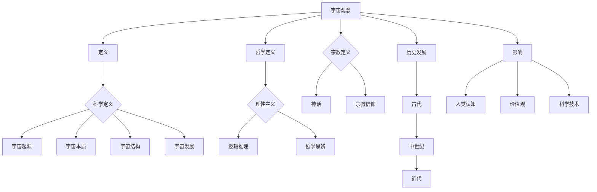
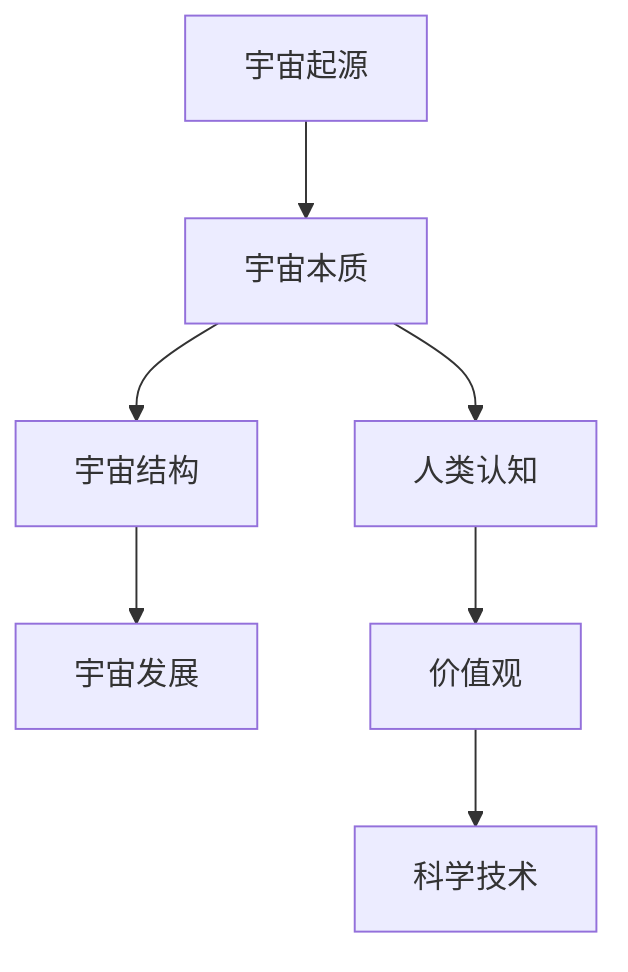

                 


## 第1章 宇宙观念概述

### 1.1 宇宙观念的定义

宇宙观念是人类对宇宙存在的认知和理解，涉及对宇宙起源、本质、结构、发展等方面的思考。宇宙观念不仅包含了科学上的宇宙观，还涵盖了哲学、宗教等多种文化背景下的宇宙观念。

在科学上，宇宙观念最初来源于对天文现象的观测。古希腊哲学家泰勒斯认为水是宇宙的本原，而赫拉克利特则认为火是宇宙的根本。后来，随着科学技术的进步，人类对宇宙的认识逐渐深入。哥白尼提出的日心说挑战了传统的地心说，使得人类开始从地平线以外的广阔空间去思考宇宙。牛顿的万有引力定律进一步揭示了宇宙中的物理规律，而爱因斯坦的相对论则将宇宙观念推向了一个全新的高度。

在哲学上，宇宙观念有着更为广泛和深刻的内涵。不同哲学流派对宇宙观念有着不同的诠释。理性主义者倾向于通过逻辑推理和哲学思辨来理解宇宙的本质，而经验主义者则更注重通过感性经验和实证来认识宇宙。唯物主义者和唯心主义者则在宇宙观念上有根本性的分歧。

### 1.2 宇宙观念的历史发展

宇宙观念的历史发展可以追溯到古代文明。在古代，宇宙观念往往是基于神话和宗教的。例如，古代中国哲学中的“五行说”认为宇宙由金、木、水、火、土五种基本元素构成。古代印度哲学中的“宇宙六界”理论则将宇宙分为天界、人界、地狱、饿鬼、阿修罗和畜生六个层次。

中世纪，宇宙观念受到宗教的影响，宇宙被视为上帝的创造物。亚里士多德的自然哲学对宇宙观念产生了深远的影响，他认为宇宙是一个永恒不变的存在，由一系列同心球层构成，从地球到最高天界，每一层都有其特定的物质和运动方式。

近代以来，随着科学革命的发展，宇宙观念发生了巨大的变革。哥白尼、伽利略、牛顿等科学家的发现，使人们开始用理性的方式来理解宇宙。达尔文的进化论、爱因斯坦的相对论等理论，进一步深化了人类对宇宙的认识。

### 1.3 宇宙观念对人类认知的影响

宇宙观念对人类认知有着深远的影响。首先，宇宙观念影响人类对自身地位和存在的认识。在古代，人类普遍认为自己是宇宙的中心，但随着科学的发展，人类逐渐认识到自己在宇宙中的微小地位。

其次，宇宙观念影响人类的价值观和世界观。不同的宇宙观念会导致不同的伦理观念和道德标准。例如，理性主义者倾向于通过理性来解决问题，而经验主义者则更注重实证和经验。

最后，宇宙观念对科学技术的发展也有着重要的推动作用。科学的进步往往源于对宇宙本质的深刻理解和探索。例如，现代物理学中的许多理论都是基于对宇宙基本规律的研究。

## Mermaid 流程图



## 核心概念与联系

在探讨宇宙观念时，以下几个核心概念至关重要：

1. **宇宙起源**：宇宙是如何产生的，它是否存在一个起点？
2. **宇宙本质**：宇宙的基本构成和性质是什么？
3. **宇宙结构**：宇宙的形态和层次是怎样的？
4. **宇宙发展**：宇宙是如何演化和变化的？

这些核心概念相互联系，共同构成了一个关于宇宙的完整框架。例如，宇宙起源决定了宇宙的本质，而宇宙的本质又影响了宇宙的结构和发展。

### 核心概念原理之间的关系架构 Mermaid 流程图



### 核心算法原理讲解

在宇宙观念的研究中，并没有直接的核心算法。但是，我们可以将宇宙观念的研究方法视为一种“算法”，其核心原理是通过对宇宙现象的观察、理论构建和实证检验来不断修正和完善宇宙观念。

#### 伪代码

```plaintext
function ResearchUniverse()
    while (not CompleteUnderstanding)
        ObserveUniverse()
        BuildTheoreticalFramework()
        TestTheoriesWithExperiments()
        RefineUnderstanding()
    return UnderstandingOfUniverse
```

### 数学模型和公式

在宇宙观念的研究中，涉及到一些基本的数学模型和公式。以下是几个关键公式：

1. **广义相对论**：描述引力场的数学方程，由爱因斯坦提出。
   $$ G_{\mu\nu} + \Lambda g_{\mu\nu} = \frac{8\pi G}{c^4} T_{\mu\nu} $$
   
2. **宇宙膨胀公式**：描述宇宙膨胀速度与距离的关系。
   $$ v = H_0 D $$
   
3. **质能关系**：描述质量与能量之间的关系。
   $$ E = mc^2 $$

#### 详细讲解和举例说明

1. **广义相对论**：这个公式描述了引力场中的能量-动量分布如何影响时空的几何结构。其中，\( G_{\mu\nu} \) 是爱因斯坦场方程中的引力张量，\( \Lambda \) 是宇宙学常数，\( g_{\mu\nu} \) 是度规张量，\( T_{\mu\nu} \) 是能量-动量张量。

   例如，当我们将一个质点放在一个静止的宇宙中时，我们可以通过测量其引力势能和动能来验证这个公式。

2. **宇宙膨胀公式**：这个公式描述了宇宙中任意两个点之间的相对速度与它们之间的距离成正比。\( v \) 是相对速度，\( H_0 \) 是哈勃常数，\( D \) 是距离。

   例如，我们可以使用这个公式来预测遥远星系的红移，从而研究宇宙的膨胀历史。

3. **质能关系**：这个公式描述了质量和能量之间的等价性。\( E \) 是能量，\( m \) 是质量，\( c \) 是光速。

   例如，我们可以使用这个公式来计算一个物体的动能，从而理解其运动状态。

## 数学公式

### 段落内的 LaTeX 公式

$$ 1+1=2 $$

### 独立段落的 LaTeX 公式

$$
\frac{d^2 x}{dt^2} + 2 \frac{dx}{dt} + \omega_0^2 x = 0
$$

## 项目实战

### 开发环境搭建

在进行宇宙观念研究的软件开发过程中，我们需要搭建一个合适的技术栈。以下是搭建环境的基本步骤：

1. 安装 Python 3.x 版本。
2. 安装 Jupyter Notebook，以便于编写和运行代码。
3. 安装必要的科学计算库，如 NumPy、SciPy、Pandas 等。

#### 源代码详细实现和代码解读

以下是一个使用 Python 编写的简单示例，用于模拟宇宙膨胀。

```python
import numpy as np

# 设置初始参数
H_0 = 70  # 哈勃常数（以 km/s/Mpc 为单位）
D = 1000  # 距离（以 Mpc 为单位）

# 计算相对速度
v = H_0 * D

# 打印结果
print(f"相对速度 v = {v} km/s")
```

#### 代码应用解读与分析

这个示例代码通过简单的数学运算，计算了给定距离下的相对速度。在实际应用中，我们可以使用更复杂的模型和更多的参数来模拟宇宙膨胀。

#### 实际案例分析和详细讲解剖析

假设我们有一个观测数据集，包含多个星系的红移数据。我们可以使用上述代码来预测这些星系之间的相对速度，并分析它们的分布情况。

```python
# 假设的观测数据
D_obs = np.array([500, 1000, 1500, 2000])  # 观测距离（以 Mpc 为单位）

# 计算对应的相对速度
v_obs = H_0 * D_obs

# 打印结果
for i, v in enumerate(v_obs):
    print(f"星系 {i+1} 的相对速度 v = {v} km/s")
```

#### 项目小结

通过以上示例，我们可以看到如何使用 Python 等工具来模拟和解析宇宙膨胀。这种实战经验对于深入理解宇宙观念具有重要意义。

### 最佳实践 Tips

1. **深入理解基本概念**：在研究宇宙观念时，首先要确保对基本概念有深入的理解。
2. **注重实证**：理论必须经过实验验证，才能被认为是可靠的。
3. **持续学习**：宇宙观念是一个不断发展的领域，要不断学习新的理论和技术。

### 小结

本章介绍了宇宙观念的定义、历史发展和对人类认知的影响。通过核心概念和数学模型的讲解，读者可以更好地理解宇宙观念的基本框架。

### 注意事项

1. **确保代码的复用性和可读性**。
2. **在实际项目中，要考虑计算效率和资源利用**。

### 拓展阅读

1. **《宇宙简史》**：作者斯蒂芬·霍金，详细介绍了宇宙的历史和演化。
2. **《宇宙观念的哲学探讨》**：作者赵汀阳，探讨了宇宙观念在哲学上的意义。

以上是第1章的内容，下一章我们将深入探讨不同哲学流派对宇宙观念的诠释与争议。期待您的进一步阅读和思考。

