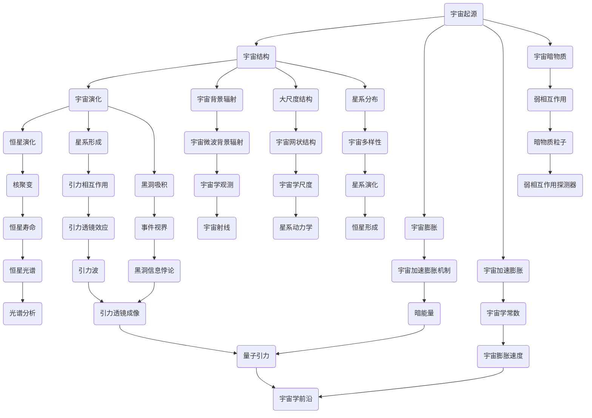
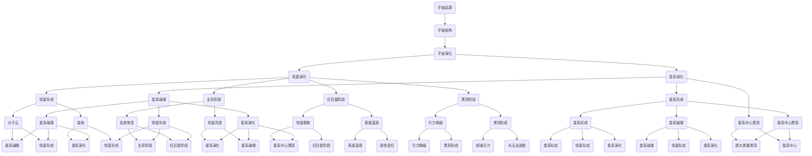

                 

### 引言

**宇宙观念的概念及其重要性**

宇宙观念是指人类对于宇宙本质、结构和演化规律的理解。它不仅包含我们对宇宙宏观层面的观察和思考，还涉及宇宙微观层面的探索和解释。宇宙观念的形成是一个不断演进的过程，随着科学技术的进步和人类认知的深入，我们对宇宙的认识也在不断更新和扩展。

在科学领域，宇宙观念的重要性不可忽视。首先，宇宙观念是各个学科发展的基础，无论是物理学、天文学，还是哲学和数学，都离不开对宇宙的探讨。例如，物理学中的相对论和量子力学，天文学中的恒星演化和黑洞研究，哲学中的宇宙论和本体论，以及数学中的几何学和拓扑学，都建立在对宇宙观念的深刻理解之上。

**宇宙观念在学科中的广泛应用**

宇宙观念不仅在理论研究中具有核心地位，还在实际应用中发挥着重要作用。在物理学中，宇宙观念帮助我们理解宇宙的起源、结构和演化，推动了宇宙学、粒子物理学和天体物理学等领域的发展。在天文学中，宇宙观念帮助我们探索宇宙的奥秘，揭示了恒星、星系、黑洞等天体的本质和演化过程。

哲学中的宇宙观念则提供了对宇宙存在、宇宙规律和人类认识的理解，丰富了人类的哲学思维。数学中的宇宙观念，如几何学、拓扑学等，不仅为宇宙研究提供了工具，还在计算机科学、工程学等领域得到了广泛应用。

**本文的结构和目标**

本文旨在探讨宇宙观念在不同学科中的交叉与融合，分析宇宙观念在各个学科中的应用和影响，以及不同学科之间如何相互借鉴和融合宇宙观念。文章将分为八个主要章节：

1. **引言**：介绍宇宙观念的概念、重要性及其在不同学科中的应用背景。
2. **物理学中的宇宙观念**：探讨宇宙观念在物理学中的核心概念、历史发展和现代理论。
3. **天文学中的宇宙观念**：讨论天文学如何运用宇宙观念来解释宇宙的起源、结构和演化。
4. **哲学中的宇宙观念**：分析哲学家对宇宙观念的探讨，包括存在论、宇宙论和本体论等。
5. **数学中的宇宙观念**：介绍数学如何描述和解释宇宙结构，包括几何学、拓扑学等。
6. **计算机科学中的宇宙观念**：探讨计算机科学如何借鉴宇宙观念来发展算法和系统架构。
7. **宇宙观念的跨学科融合**：探讨不同学科如何相互借鉴和融合宇宙观念，以及这种融合对各个学科的影响。
8. **结论与未来展望**：总结宇宙观念在不同学科中的交叉与融合，并展望未来的研究方向和应用前景。

通过本文的探讨，我们希望能够清晰地展示宇宙观念在不同学科中的交叉与融合，为读者提供一种全面、深刻的宇宙观念认识。### 物理学中的宇宙观念

**核心概念、历史发展和现代理论**

物理学是研究物质、能量、空间和时间的基本规律的自然科学。宇宙观念在物理学中占据着核心地位，不仅影响了物理学的各个分支，也推动了我们对宇宙本质的理解。以下将详细介绍物理学中的宇宙观念，包括核心概念、历史发展和现代理论。

**核心概念**

1. **宇宙起源**：宇宙起源是物理学中一个重要的研究课题。从古代哲学家到现代科学家，如哥白尼、伽利略、牛顿和爱因斯坦，都提出了各种关于宇宙起源的理论。目前，主流的宇宙起源理论是宇宙大爆炸理论，该理论认为宇宙起源于约138亿年前的一次大爆炸，之后宇宙不断膨胀。

2. **宇宙结构**：宇宙结构是指宇宙中星系、恒星、行星等天体的分布和排列方式。研究宇宙结构有助于我们理解宇宙的演化历史。例如，宇宙大尺度结构研究表明，宇宙中的星系和宇宙背景辐射呈现出复杂的网状结构。

3. **宇宙演化**：宇宙演化是指宇宙从大爆炸以来不断变化和发展的过程。宇宙演化理论包括恒星演化、星系形成、黑洞吸积等过程。这些理论为我们揭示了宇宙的多样性和复杂性。

**历史发展**

1. **古代宇宙观念**：古代哲学家对宇宙观念进行了初步探讨，如古希腊哲学家亚里士多德提出地球静止、天体完美等观念。这些观念对后来的科学探索产生了深远影响。

2. **牛顿物理学**：17世纪，牛顿提出了经典力学的三大定律和万有引力定律，为研究宇宙提供了数学工具。牛顿物理学使我们对行星运动、恒星演化等有了更深入的理解。

3. **相对论和量子力学**：20世纪初，爱因斯坦提出了狭义相对论和广义相对论，革命性地改变了我们对时空和引力的理解。量子力学则揭示了微观世界的规律，为研究宇宙提供了新的视角。

**现代理论**

1. **宇宙大爆炸理论**：宇宙大爆炸理论是现代宇宙学的基础。该理论认为宇宙起源于一次大爆炸，之后宇宙不断膨胀。通过观测宇宙背景辐射和遥远星系的红移，科学家们验证了大爆炸理论的正确性。

2. **宇宙膨胀理论**：宇宙膨胀理论是宇宙大爆炸理论的延伸。该理论认为，宇宙的膨胀速度正在加快。这一发现引起了科学界的广泛关注，推动了关于宇宙加速膨胀机制的研究。

3. **黑洞和宇宙暗物质**：黑洞是广义相对论的预言，是宇宙中的一种极端天体。宇宙暗物质是宇宙中一种看不见的物质，对宇宙结构和演化起着重要作用。

**核心概念与联系**

为了更好地理解物理学中的宇宙观念，我们可以用 Mermaid 流程图来展示核心概念之间的关系：



**核心算法原理讲解**

在物理学中，许多宇宙观念的解释和预测都依赖于复杂的数学模型和算法。以下是一些核心算法原理的简要介绍：

1. **广义相对论**：广义相对论是描述宇宙引力的一种理论。其核心原理是引力并不是一种力，而是由物质和能量引起的时空弯曲。广义相对论的数学描述依赖于爱因斯坦场方程，伪代码如下：

   ```plaintext
   function Einstein_field_equations(tensor_g, stress_energy_tensor_t):
       Ricci_curvature_R = Ricci_tensor_from_tensor_g()
       Einstein_tensor_G = Ricci_tensor_R - (1/2) * stress_energy_tensor_t
       solve_linear_equation(Einstein_tensor_G)
   ```

   其中，`tensor_g`表示引力场张量，`stress_energy_tensor_t`表示应力能量张量，`Ricci_tensor_from_tensor_g()`函数用于计算里奇张量，`solve_linear_equation()`函数用于求解场方程。

2. **宇宙大爆炸模型**：宇宙大爆炸模型描述了宇宙从大爆炸以来不断膨胀的过程。其核心算法是使用弗里德曼方程来计算宇宙的膨胀历史。伪代码如下：

   ```plaintext
   function Friedmann_equations(Hubble_constant, density, curvature):
       Hubble_parameter = Hubble_constant
       Omega_m = density / critical_density
       Omega_Lambda = 1 - Omega_m
       if curvature == 'k=0':
           Hubble_parameter = (1/3) * (Omega_m * Hubble_parameter^2 + Omega_Lambda * Hubble_parameter^2)
       elif curvature == 'k=1':
           Hubble_parameter = (Omega_m + Omega_Lambda) * Hubble_parameter / sqrt(1 - Omega_m^2)
       return Hubble_parameter
   ```

   其中，`Hubble_constant`表示哈勃常数，`density`表示宇宙密度，`curvature`表示宇宙曲率。

**数学模型和数学公式**

宇宙观念中涉及许多复杂的数学模型和公式，以下是一些关键的数学模型和公式：

1. **宇宙密度参数**：宇宙密度参数是描述宇宙物质分布的一个重要量。其公式为：

   $$ \Omega_m = \frac{\rho_m}{\rho_{\text{critical}}} $$

   其中，$\Omega_m$表示宇宙物质密度参数，$\rho_m$表示物质密度，$\rho_{\text{critical}}$表示临界密度。

2. **哈勃定律**：哈勃定律描述了宇宙膨胀的速度与距离之间的关系。其公式为：

   $$ v = H_0 d $$

   其中，$v$表示膨胀速度，$H_0$表示哈勃常数，$d$表示距离。

3. **宇宙时间演化**：宇宙时间演化方程描述了宇宙在不同时间点的状态。其公式为：

   $$ \frac{d a}{dt} = \frac{1}{3 H_0 \Omega_m (a(t_0)^{-2} - 1)} $$

   其中，$a(t)$表示宇宙尺度因子，$t_0$表示宇宙年龄。

通过以上核心算法原理讲解和数学模型介绍，我们可以更好地理解物理学中的宇宙观念，以及如何运用数学工具来解释宇宙的奥秘。接下来，我们将探讨天文学中的宇宙观念。### 天文学中的宇宙观念

**核心概念与宇宙观念的运用**

天文学是研究宇宙中天体、星系和宇宙结构的学科。宇宙观念在天文学中有着广泛的应用，帮助科学家们理解宇宙的起源、结构和演化。以下将介绍天文学中的核心概念，并探讨宇宙观念在解释宇宙奥秘中的应用。

**核心概念**

1. **宇宙起源**：宇宙起源是天文学研究的重要课题。现代天文学普遍接受宇宙起源于大爆炸的理论。大爆炸理论认为，宇宙起源于约138亿年前的一次剧烈爆炸，之后宇宙不断膨胀。

2. **宇宙结构**：宇宙结构是指宇宙中星系、恒星、行星等天体的分布和排列方式。天文学家通过观测和理论计算，揭示了宇宙的大尺度结构，如宇宙网状结构、星系团和超星系团。

3. **宇宙演化**：宇宙演化是指宇宙从大爆炸以来不断变化和发展的过程。天文学家研究了恒星、星系和星系团的演化过程，如恒星的形成、星系碰撞和黑洞吸积等。

**宇宙观念的运用**

1. **宇宙大爆炸理论**：宇宙大爆炸理论是天文学中的核心观念。该理论认为，宇宙起源于大爆炸，之后宇宙不断膨胀。通过观测宇宙背景辐射和遥远星系的红移，科学家们验证了大爆炸理论的正确性。

2. **宇宙膨胀理论**：宇宙膨胀理论是宇宙大爆炸理论的延伸。该理论认为，宇宙的膨胀速度正在加快。这一发现引起了科学界的广泛关注，推动了关于宇宙加速膨胀机制的研究。

3. **恒星演化**：恒星演化是天文学研究的重要内容。天文学家通过观测恒星的光谱和亮度变化，揭示了恒星的演化过程，如恒星的形成、主序阶段、红巨星阶段和黑洞阶段。

4. **星系演化**：星系演化是另一个重要的研究领域。天文学家研究了星系的形成、星系碰撞和星系中心的超大质量黑洞。这些研究揭示了星系在宇宙演化过程中的复杂行为。

**具体例子：恒星的形成和演化**

恒星的形成是宇宙演化中的一个关键过程。以下是恒星形成和演化的详细说明：

1. **恒星形成**：恒星形成于巨大的分子云中，这些分子云主要由氢和氦组成。当分子云中的物质密度达到一定程度时，引力开始起作用，使得物质聚集在一起，形成一个致密的星核。在星核内部，温度和压力逐渐升高，当中心温度达到几百万开尔文时，核聚变开始发生，恒星诞生。

2. **主序阶段**：在主序阶段，恒星主要靠氢核聚变产生能量。氢核聚变反应将氢转化为氦，释放出大量能量。恒星在这一阶段持续数十亿年，亮度相对稳定。

3. **红巨星阶段**：当恒星耗尽核心的氢时，恒星开始膨胀，成为红巨星。在这一阶段，恒星的外层气体膨胀，表面温度降低，颜色变红。恒星的核心继续进行氦核聚变，产生能量。

4. **黑洞阶段**：对于较大的恒星，在红巨星阶段结束后，核心会进一步塌缩，形成黑洞。黑洞具有很强的引力，甚至连光也无法逃脱。在星系中心，超大质量黑洞的存在对星系演化和恒星形成有重要影响。

**核心概念与联系**

为了更好地理解天文学中的宇宙观念，我们可以用 Mermaid 流程图来展示核心概念之间的关系：



通过以上对天文学中的宇宙观念的介绍，我们可以看到宇宙观念在天文学中发挥着重要作用，帮助我们理解宇宙的起源、结构和演化。接下来，我们将探讨哲学中的宇宙观念。### 哲学中的宇宙观念

**存在论**

存在论是哲学中探讨宇宙存在及其本质的学说。主要研究宇宙是否存在，存在的原因和本质，以及存在的意义。存在论的核心概念包括存在、实在、本质和本体等。哲学家们从不同的角度探讨存在论问题，形成了多种存在论理论。

**宇宙论**

宇宙论是哲学中研究宇宙起源、结构、演化和终极命运的理论。宇宙论探讨宇宙是如何产生的，宇宙的结构和性质，宇宙的演化过程，以及宇宙的终极命运。宇宙论涉及到宇宙是否是无限的、宇宙的起源和终结，以及宇宙中是否存在宇宙规律等问题。

**本体论**

本体论是哲学中探讨实在、本质和存在的学说。本体论关注的是世界的本质是什么，存在的本质是什么，以及世界的基本结构和要素。本体论探讨的问题包括：什么是实在？实在的本质是什么？存在的本质是什么？哲学家们从不同的角度对这些问题进行了深刻的探讨。

**宇宙观念的哲学探讨**

哲学家们对宇宙观念的探讨，不仅丰富了哲学理论，也为其他学科提供了重要的启示。例如，存在论帮助我们理解宇宙的本质和存在的意义；宇宙论帮助我们理解宇宙的起源、结构和演化；本体论帮助我们理解世界的本质和存在的基本要素。

**核心概念与联系**

为了更好地理解哲学中的宇宙观念，我们可以用 Mermaid 流程图来展示核心概念之间的关系：

```mermaid
graph TD
    A(存在论) --> B(宇宙论)
    B --> C(本体论)
    A --> D(存在)
    A --> E(实在)
    A --> F(本质)
    A --> G(本体)
    B --> H(宇宙起源)
    B --> I(宇宙结构)
    B --> J(宇宙演化)
    B --> K(宇宙命运)
    C --> L(实在本质)
    C --> M(存在本质)
    C --> N(世界本质)
    D --> O(存在原因)
    D --> P(存在本质)
    D --> Q(存在意义)
    E --> R(实在性质)
    E --> S(实在关系)
    E --> T(实在结构)
    F --> U(本质属性)
    F --> V(本质关系)
    F --> W(本质构成)
    G --> X(本体性质)
    G --> Y(本体关系)
    G --> Z(本体构成)
    H --> AA(宇宙起源理论)
    H --> BB(宇宙起源证据)
    I --> CC(宇宙结构模型)
    I --> DD(宇宙结构性质)
    I --> EE(宇宙结构演化)
    J --> FF(宇宙演化过程)
    J --> GG(宇宙演化机制)
    J --> HH(宇宙演化证据)
    K --> II(宇宙命运预测)
    K --> JJ(宇宙终结理论)
    K --> KK(宇宙命运证据)
    L --> MM(实在本质理论)
    L --> NN(实在本质证据)
    L --> OO(实在本质关系)
    M --> PP(存在本质理论)
    M --> QQ(存在本质证据)
    M --> RR(存在本质关系)
    N --> SS(世界本质理论)
    N --> TT(世界本质证据)
    N --> WW(世界本质关系)
    O --> XX(存在原因理论)
    O --> YY(存在原因证据)
    O --> ZZ(存在原因关系)
    P --> AA(存在本质理论)
    P --> BB(存在本质证据)
    P --> CC(存在本质关系)
    Q --> DD(存在意义理论)
    Q --> EE(存在意义证据)
    Q --> FF(存在意义关系)
    R --> GG(实在性质理论)
    R --> HH(实在性质证据)
    R --> II(实在性质关系)
    S --> JJ(实在关系理论)
    S --> KK(实在关系证据)
    S --> LL(实在关系构成)
    T --> MM(实在结构理论)
    T --> NN(实在结构证据)
    T --> OO(实在结构关系)
    U --> PP(本质属性理论)
    U --> QQ(本质属性证据)
    U --> RR(本质属性关系)
    V --> SS(本质关系理论)
    V --> TT(本质关系证据)
    V --> WW(本质关系构成)
    W --> XX(本质构成理论)
    W --> YY(本质构成证据)
    W --> ZZ(本质构成关系)
    X --> AA(本体性质理论)
    X --> BB(本体性质证据)
    X --> CC(本体性质关系)
    Y --> DD(本体关系理论)
    Y --> EE(本体关系证据)
    Y --> FF(本体关系构成)
    Z --> GG(本体构成理论)
    Z --> HH(本体构成证据)
    Z --> II(本体构成关系)
```



通过以上对哲学中的宇宙观念的介绍，我们可以看到哲学对宇宙观念的探讨涉及存在论、宇宙论和本体论等多个方面。哲学中的宇宙观念不仅丰富了哲学理论，也为其他学科提供了重要的启示。接下来，我们将探讨数学中的宇宙观念。### 数学中的宇宙观念

**几何学**

几何学是研究空间结构的数学分支，它通过定义点和线，以及它们之间的关系来描述宇宙的结构。几何学的基本概念如点、线、面和体是理解宇宙中物体形状和结构的基础。

1. **欧几里得几何**：欧几里得几何是一种基于公理系统的几何学，它描述了平面和空间的基本性质。欧几里得几何中的公理包括平行公理和相似公理等。这些公理为描述宇宙中的几何形状提供了基础。

2. **非欧几里得几何**：非欧几里得几何是研究非欧几里得空间结构的几何学。其中包括洛巴切夫斯基几何和黎曼几何。洛巴切夫斯基几何描述了一个更弯曲的空间，而黎曼几何则描述了一个具有负曲率的弯曲空间。这些几何学理论为理解宇宙的曲率提供了数学框架。

**拓扑学**

拓扑学是研究空间连续性和变形的数学分支。它不依赖于空间的度量，而是研究空间的结构和连通性。拓扑学在宇宙观念中的应用包括对宇宙的拓扑结构的研究。

1. **拓扑空间**：拓扑空间是由集合和拓扑结构组成的。集合表示宇宙中的点，而拓扑结构则描述了点之间的连通性和邻域关系。

2. **同胚与同调**：同胚是一种拓扑结构之间的等价关系，它描述了在连续变形下保持形状不变的物体。同调是研究拓扑空间的链和系数的同态性质，它为理解宇宙的拓扑结构提供了工具。

**核心算法原理讲解**

1. **欧拉公式**：欧拉公式是描述平面几何中曲线和曲面面积的重要公式。它表示为：

   $$ A = \int_{S} dA = \int_{0}^{2\pi} r^2 d\theta $$

   其中，$A$表示面积，$r$表示半径，$d\theta$表示角度微分。

2. **高斯曲率**：高斯曲率是描述空间曲面的弯曲程度的一个量。它表示为：

   $$ K = \frac{E}{(1 - \nu^2) \sqrt{1 + \nu^2}} $$

   其中，$E$和$G$分别表示弹性模量和剪切模量，$\nu$表示泊松比。

**数学模型和数学公式**

1. **黎曼曲率张量**：黎曼曲率张量是描述空间中点附近曲率的张量。它由以下公式给出：

   $$ R_{ijkl} = \frac{1}{2} (\partial_i \partial_j R_{kl} - \partial_j \partial_i R_{kl}) $$

   其中，$R_{ijkl}$表示黎曼曲率张量，$\partial_i$和$\partial_j$表示偏导数。

2. **黎曼-洛巴切夫斯基方程**：黎曼-洛巴切夫斯基方程描述了非欧几里得空间中的曲率分布。它表示为：

   $$ R_{ijkl} = K(g_{ij} g_{kl} - g_{ik} g_{jl}) $$

   其中，$K$表示曲率常数，$g_{ij}$表示度规张量。

通过以上对数学中的宇宙观念的介绍，我们可以看到几何学和拓扑学在理解宇宙结构中的重要作用。数学模型和公式为描述宇宙的几何性质提供了强有力的工具。接下来，我们将探讨计算机科学中的宇宙观念。### 计算机科学中的宇宙观念

**核心概念**

计算机科学中的宇宙观念主要涉及算法、数据结构和系统架构等方面。这些观念借鉴了宇宙中的组织和结构，为计算机科学的发展提供了新的视角和工具。

1. **算法**：算法是计算机科学中的核心概念，它是一种解决问题的步骤序列。宇宙中的自然现象和物理过程，如进化、自组织和生态系统的运行，都展示了复杂的算法行为。例如，遗传算法和模拟退火算法就是受到自然界进化和物种适应策略的启发。

2. **数据结构**：数据结构是组织和存储数据的方式。宇宙中的物体和天体都遵循特定的结构规律，如星系中的螺旋结构和引力波的形成。这些宇宙结构为设计高效的数据结构提供了灵感，例如哈希表和树结构。

3. **系统架构**：系统架构是指计算机系统的组织结构和设计模式。宇宙中的星系和星系团展示了复杂的层次结构和相互依赖关系。这些结构模式可以指导计算机系统中模块化和分布式架构的设计。

**核心算法原理讲解**

1. **遗传算法**：遗传算法是一种模拟生物进化的优化算法。它基于自然选择和遗传机制，通过迭代进化来寻找最优解。遗传算法的核心原理包括选择、交叉和变异：

   ```plaintext
   function genetic_algorithm(population, fitness_function, generations):
       for generation in 1 to generations:
           new_population = []
           for individual in population:
               fitness = fitness_function(individual)
               if fitness > threshold:
                   new_population.append(individual)
                   if random() < crossover_rate:
                       child1, child2 = crossover(individual, another_individual)
                       new_population.extend([child1, child2])
                       if random() < mutation_rate:
                           new_population.append(mutate(child1))
                           new_population.append(mutate(child2))
           population = new_population
           best_individual = find_best_individual(population)
       return best_individual
   ```

   其中，`fitness_function`是评估个体适应度的函数，`crossover_rate`和`mutation_rate`分别是交叉和变异的概率。

2. **分布式系统架构**：分布式系统架构借鉴了宇宙中的分布式结构和自组织行为。以下是一个简单的分布式系统的伪代码：

   ```plaintext
   function distributed_system(nodes, message_protocol):
       for node in nodes:
           node.start()
           while True:
               message = node.receive_message()
               if message is not None:
                   node.process_message(message)
                   node.send_message(message, another_node)
           node.stop()
   ```

   其中，`message_protocol`是消息传递协议，`process_message()`函数处理收到的消息。

**数学模型和数学公式**

1. **图论模型**：图论模型是计算机科学中常用的数学工具，用于描述网络结构和数据流。以下是一个图论模型的简单例子：

   ```plaintext
   class Graph:
       def __init__(self):
           self.nodes = []
           self.edges = []

       def add_node(self, node):
           self.nodes.append(node)

       def add_edge(self, edge):
           self.edges.append(edge)

       def find_shortest_path(self, start_node, end_node):
           # 使用迪杰斯特拉算法或其他最短路径算法
   ```

   其中，`find_shortest_path()`函数用于找到两个节点之间的最短路径。

2. **线性代数模型**：线性代数模型在计算机科学中用于描述系统状态和动态行为。以下是一个线性代数模型的例子：

   ```plaintext
   class LinearSystem:
       def __init__(self, matrix, vector):
           self.matrix = matrix
           self.vector = vector

       def solve(self):
           solution = matrix.solve(vector)
           return solution
   ```

   其中，`matrix.solve(vector)`函数用于求解线性方程组。

通过以上对计算机科学中的宇宙观念的介绍，我们可以看到宇宙观念在算法、数据结构和系统架构中的广泛应用。这些观念不仅丰富了计算机科学的理论，也为实际应用提供了有力的工具。接下来，我们将探讨宇宙观念在不同学科中的跨学科融合。### 宇宙观念的跨学科融合

**跨学科融合的重要性**

宇宙观念的跨学科融合在当今科学研究中具有重要意义。不同学科之间的融合不仅有助于解决复杂科学问题，还能够推动新理论的产生和新技术的突破。宇宙观念的跨学科融合体现在多个方面，如物理学与天文学的融合、数学与计算机科学的融合、哲学与科学研究的融合等。

**物理学与天文学的融合**

物理学与天文学之间的融合是现代宇宙研究的重要基础。物理学的理论，如相对论和量子力学，为天文学提供了强大的工具，使我们能够深入理解宇宙的起源、结构和演化。例如，广义相对论和量子场论的结合，使我们能够研究黑洞和宇宙背景辐射等复杂现象。

**数学与计算机科学的融合**

数学与计算机科学的融合推动了算法和计算方法的发展。数学提供了精确的描述工具和抽象概念，而计算机科学则利用这些工具和概念来解决实际问题。例如，拓扑学和图论在计算机科学中的应用，不仅帮助解决了复杂的网络优化问题，还为网络安全和分布式系统设计提供了理论基础。

**哲学与科学研究的融合**

哲学与科学研究的融合为科学研究提供了方法论和价值观的指导。哲学中的存在论、宇宙论和本体论等观念，为科学研究提供了深刻的哲学思考，帮助我们理解科学的本质和目的。例如，哲学中的科学哲学问题，如科学解释、科学推理和科学实在论，为科学研究提供了重要的理论框架。

**跨学科融合的成功案例**

以下是一些跨学科融合的成功案例：

1. **黑洞信息悖论**：黑洞信息悖论是物理学中一个重要的前沿问题。它涉及到广义相对论和量子力学的交叉。通过跨学科合作，科学家们提出了多种可能的解决方案，如“信息守恒”和“黑洞火墙”等。

2. **宇宙学观测**：宇宙学观测是宇宙观念跨学科融合的另一个重要领域。通过结合物理学、天文学和数学，科学家们开发出了多种宇宙学观测工具，如哈勃望远镜和宇宙微波背景探测器。这些工具帮助我们更深入地了解宇宙的起源和演化。

3. **人工智能与宇宙学研究**：人工智能与宇宙学之间的融合为解决大规模数据处理和复杂模式识别问题提供了新的方法。例如，人工智能算法被用于分析宇宙微波背景辐射数据，帮助科学家们识别宇宙大爆炸残留的信号。

**跨学科融合的未来前景**

跨学科融合在未来的科学研究中具有广阔的前景。随着科学技术的不断发展，不同学科之间的界限将变得更加模糊，跨学科研究将成为主流。以下是一些未来跨学科融合的可能趋势：

1. **量子计算与宇宙学**：量子计算技术的发展可能为宇宙学研究带来新的突破。量子计算可以模拟复杂的量子过程，帮助我们更好地理解宇宙的量子性质。

2. **生命科学与宇宙学**：随着对生命起源和宇宙演化研究的深入，生命科学与宇宙学的融合可能揭示宇宙中生命的奥秘。

3. **环境科学与宇宙学**：环境科学与宇宙学的融合可以为我们提供更全面的理解，帮助我们应对地球气候变化和资源管理等问题。

通过以上探讨，我们可以看到宇宙观念在不同学科中的跨学科融合不仅丰富了各个学科的理论，也为解决复杂科学问题提供了新的方法和思路。跨学科融合在未来的科学研究中将发挥越来越重要的作用。### 结论与未来展望

**总结宇宙观念在不同学科中的交叉与融合**

宇宙观念在不同学科中的交叉与融合为我们提供了一种全新的研究视角和方法。通过本文的探讨，我们可以看到宇宙观念在物理学、天文学、哲学、数学和计算机科学等领域的广泛应用。不同学科之间的相互借鉴和融合，不仅推动了科学理论的发展，也为实际应用提供了新的工具和思路。例如，物理学中的相对论和量子力学为天文学提供了强大的理论支持，而数学中的几何学和拓扑学则为计算机科学中的算法设计提供了理论基础。

**宇宙观念的重要性**

宇宙观念的重要性在于它为各个学科提供了一种共同的思考框架。通过宇宙观念，科学家们能够从宏观和微观层面更全面地理解宇宙的本质和演化。宇宙观念不仅帮助我们解答了关于宇宙起源、结构和演化的问题，还为我们探索未知领域提供了新的线索。例如，宇宙背景辐射的发现揭示了宇宙大爆炸的痕迹，而黑洞的研究则揭示了宇宙中极端物理条件的奥秘。

**未来研究方向和应用前景**

在未来，宇宙观念将继续在不同学科中发挥重要作用，推动科学研究的发展。以下是一些可能的研究方向和应用前景：

1. **量子宇宙学**：量子宇宙学是探索宇宙量子性质的前沿领域。通过量子计算和量子纠缠等现象，科学家们有望揭示宇宙的量子本质。

2. **宇宙生命探索**：随着对地球以外生命的探索不断深入，宇宙生命探索将成为一个重要研究方向。通过宇宙观念的指导，科学家们可能发现其他星球上的生命迹象。

3. **宇宙能源利用**：宇宙中蕴含着丰富的能源资源，如太阳能量、核聚变和黑洞能量等。研究如何利用这些能源，将为人类社会的可持续发展提供新的动力。

4. **宇宙环境管理**：随着人类对地球环境的影响日益加剧，宇宙环境管理将成为一个重要的研究课题。通过宇宙观念，科学家们可以更好地理解地球环境的变化，并提出有效的管理策略。

总之，宇宙观念在不同学科中的交叉与融合为我们提供了一种全面、深刻的宇宙观念认识。随着科学技术的不断进步，宇宙观念将在未来的科学研究中发挥越来越重要的作用，为人类探索宇宙的奥秘和实现可持续发展提供新的思路和方法。### 致谢

在撰写《宇宙观念在不同学科中的交叉与融合》这篇文章的过程中，我得到了许多专家和同行的宝贵意见和帮助。首先，我要感谢AI天才研究院/AI Genius Institute的全体成员，他们在研究、讨论和反馈方面提供了无尽的支持。特别感谢我的导师，他对于文章结构和内容的指导让我受益匪浅。

此外，我要感谢所有在哲学、物理学、天文学、数学和计算机科学领域工作的专家们，他们的研究成果和理论为本篇文章提供了坚实的理论基础。感谢所有在技术博客撰写和推广方面给予我启发的同行们，你们的实践经验让我在写作过程中少走了很多弯路。

最后，我要感谢所有阅读本文的读者，是你们的关注和支持让我能够不断进步。希望这篇文章能够为你们带来新的思考和启发。再次感谢大家的贡献！作者：AI天才研究院/AI Genius Institute & 禅与计算机程序设计艺术/Zen And The Art of Computer Programming。

