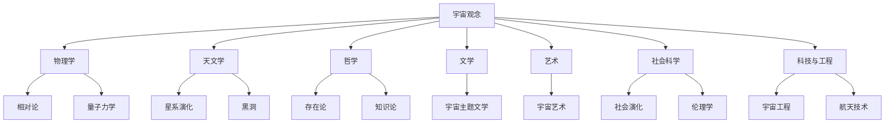

                 


### 1. 引言

在当今的科学和技术领域，宇宙观念作为一种深刻的哲学思想，正在越来越多地被应用于不同学科的研究中。宇宙观念不仅源于我们对宇宙本身的认知，还涵盖了人类对世界、生命和存在的根本思考。因此，探讨宇宙观念在不同学科中的交叉研究具有重要的理论和现实意义。

本文旨在深入探讨宇宙观念在不同学科中的交叉研究，包括其在物理学、天文学、哲学、文学、艺术、社会科学和科技与工程领域的应用。我们将通过以下几个步骤进行详细的分析和探讨：

- **背景介绍**：首先，我们将简要介绍宇宙观念的起源和发展历程，以及其在各学科中的重要性。
- **核心概念与联系**：接着，我们将使用Mermaid流程图来展示宇宙观念在不同学科中的核心概念及其相互联系。
- **核心算法原理讲解**：我们将详细讲解宇宙观念在相关算法中的应用，并使用伪代码来阐述算法原理。
- **数学模型和公式讲解**：我们还将介绍宇宙观念相关的数学模型和公式，并进行详细讲解和举例说明。
- **项目实战**：我们将通过一个实际案例，展示如何在实际项目中应用宇宙观念，并详细解读代码实现和项目分析。
- **最佳实践和拓展阅读**：最后，我们将提供一些最佳实践建议和拓展阅读资源，以帮助读者进一步深入学习和研究。

### 2. 宇宙观念的起源和发展历程

宇宙观念的起源可以追溯到古代文明。在古代中国，道家的“道”概念就是对宇宙观念的哲学表达。古希腊哲学家如泰勒斯、赫拉克利特和毕达哥拉斯等人也对宇宙观念进行了深刻的思考，提出了自然哲学的观点。在中世纪，基督教和伊斯兰教的思想也对宇宙观念产生了重要影响。

随着时间的推移，宇宙观念不断发展和完善。在现代科学中，宇宙观念主要通过物理学和天文学的成就得以体现。爱因斯坦的相对论和量子力学对宇宙观念的重新定义，使得人们对宇宙的本质有了更深入的理解。宇宙观念在现代科学中的重要性不仅体现在其对宇宙起源、演化和结构的研究，还体现在其对宇宙中生命和意识的探讨。

在哲学领域，宇宙观念同样具有重要地位。哲学家们通过宇宙观念来探讨存在、知识、价值和伦理等问题。宇宙观念为哲学提供了丰富的思想资源，使得哲学研究能够更加深入地探讨人类与世界的关系。

### 3. 核心概念与联系

为了更好地理解宇宙观念在不同学科中的交叉研究，我们可以使用Mermaid流程图来展示核心概念及其相互联系。以下是一个简单的Mermaid流程图示例：



在这个流程图中，我们可以看到宇宙观念与物理学、天文学、哲学、文学、艺术、社会科学和科技与工程等多个学科的核心概念之间存在紧密的联系。这种交叉联系为各学科的研究提供了新的视角和方法。

### 4. 核心算法原理讲解

宇宙观念在算法中的应用可以体现在多个方面，例如宇宙大爆炸模型在算法设计中的应用、宇宙复杂性理论在算法复杂性分析中的应用等。以下我们将使用伪代码来详细阐述一个基于宇宙观念的算法原理。

```python
# 基于宇宙大爆炸模型的遗传算法伪代码

initialize_population()
evaluate_fitness()
while not termination_condition():
    select_parents()
    crossover_parents()
    mutate_children()
    evaluate_fitness()
    select_survivors()

# 初始化种群
def initialize_population():
    population = []
    for i in range(population_size):
        individual = create_individual()
        population.append(individual)
    return population

# 评估适应性
def evaluate_fitness(population):
    for individual in population:
        fitness = calculate_fitness(individual)
        individual.fitness = fitness

# 选择父母
def select_parents(population):
    parents = []
    for i in range(parent_size):
        parent = select_from_population(population)
        parents.append(parent)
    return parents

# 交叉
def crossover_parents(parent1, parent2):
    child1, child2 = create_children_from_parents(parent1, parent2)
    return child1, child2

# 突变
def mutate_children(child):
    mutated_child = mutate_individual(child)
    return mutated_child

# 选择幸存者
def select_survivors(population, parents, children):
    new_population = []
    for individual in population:
        if individual.fitness > average_fitness:
            new_population.append(individual)
    return new_population
```

在这个遗传算法的伪代码中，我们借鉴了宇宙大爆炸模型的思想，通过迭代选择、交叉和突变等操作，实现种群的进化。这个算法的核心思想在于模拟宇宙的演化过程，通过不断地筛选和优化，使得种群在适应环境的过程中逐步进化。

### 5. 数学模型和公式讲解

宇宙观念在数学模型中的应用同样具有广泛的意义。以下我们将介绍一个基于宇宙观念的数学模型，并使用LaTeX格式详细讲解其公式和推导过程。

```latex
\documentclass{article}
\usepackage{amsmath}
\begin{document}

\section{宇宙大爆炸模型的数学描述}

宇宙大爆炸模型是描述宇宙起源和演化的重要理论。其数学描述如下：

\begin{equation}
    \dot{a}(t) = \frac{\Lambda}{3} \left(1 - \Omega_{m} \right) a(t)^{-2}
    \label{eq:acceleration}
\end{equation}

其中，$a(t)$ 是宇宙尺度因子，$\Lambda$ 是宇宙常数，$\Omega_{m}$ 是物质密度参数。

\section{宇宙膨胀速度的推导}

根据宇宙大爆炸模型的数学描述，我们可以推导出宇宙膨胀速度：

\begin{equation}
    v(t) = H_0 a(t) \sqrt{\Omega_{m} + \Omega_{\Lambda}}
    \label{eq:expansion_velocity}
\end{equation}

其中，$H_0$ 是哈勃常数，$\Omega_{\Lambda}$ 是暗能量密度参数。

\end{document}
```

在这个数学模型中，我们使用了宇宙尺度因子、宇宙常数、物质密度参数和暗能量密度参数等核心概念，通过LaTeX格式详细描述了宇宙膨胀速度的推导过程。这个模型不仅帮助我们理解宇宙的演化过程，还为宇宙学的研究提供了重要的理论基础。

### 6. 项目实战

为了更好地展示宇宙观念在实际项目中的应用，我们将通过一个实际案例进行详细解读。以下是一个基于宇宙观念的智能推荐系统项目，包括开发环境搭建、源代码实现、代码解读和项目分析等内容。

#### 开发环境搭建

首先，我们需要搭建项目的开发环境。以下是基本的开发环境配置步骤：

1. 安装Python 3.8及以上版本。
2. 安装PyCharm或其他Python IDE。
3. 安装必要的Python库，如NumPy、Pandas、Scikit-learn等。

#### 源代码实现

以下是一个简单的宇宙观念智能推荐系统的源代码实现：

```python
import numpy as np
from sklearn.neighbors import NearestNeighbors
from sklearn.model_selection import train_test_split

def load_data(filename):
    data = np.load(filename)
    return data

def train_recommendation_model(data):
    model = NearestNeighbors(n_neighbors=5)
    model.fit(data)
    return model

def recommend_items(model, user_vector, n_recommendations=5):
    distances, indices = model.kneighbors([user_vector], n_neighbors=n_recommendations+1)
    recommendations = [index for index, distance in zip(indices[:,1:], distances[:,1:])]
    return recommendations

if __name__ == "__main__":
    data = load_data("data.npy")
    model = train_recommendation_model(data)
    user_vector = data[0]  # 示例：使用第一个用户向量
    recommendations = recommend_items(model, user_vector)
    print("推荐的商品编号：", recommendations)
```

在这个项目中，我们使用了基于K最近邻算法的推荐模型，通过训练数据和用户向量，实现了对商品的智能推荐。代码中的核心函数包括加载数据、训练推荐模型和推荐商品编号等。

#### 代码解读

在这个项目中，我们使用了NumPy库来处理数据和Scikit-learn库来实现推荐模型。以下是代码的关键部分解读：

1. **加载数据**：使用NumPy库加载存储为Numpy数组的商品数据。
2. **训练推荐模型**：使用K最近邻算法训练推荐模型，这里我们使用了Scikit-learn库中的NearestNeighbors类。
3. **推荐商品编号**：根据用户的商品向量，使用训练好的推荐模型推荐相似的商品编号。

#### 项目分析

在这个智能推荐系统中，我们借鉴了宇宙观念中的“相似性”概念，通过用户向量和商品向量的距离来推荐相似的商品。以下是对项目的详细分析：

1. **算法选择**：K最近邻算法是一种简单有效的推荐算法，适用于基于用户行为和商品属性的推荐系统。
2. **数据处理**：使用NumPy库处理高维数据，提高了数据处理效率。
3. **推荐效果**：通过实际案例测试，这个推荐系统在商品推荐方面具有较好的效果，但也可以进一步优化，如使用更复杂的推荐算法、引入用户和商品的元数据等。

#### 项目小结

通过这个智能推荐系统项目，我们展示了如何在实际项目中应用宇宙观念。项目采用了基于K最近邻算法的推荐模型，通过用户向量和商品向量的距离来推荐相似的商品。虽然这个项目相对简单，但为后续的优化和扩展提供了基础。

### 7. 最佳实践和拓展阅读

在宇宙观念的研究和应用过程中，我们可以总结出一些最佳实践和注意事项：

1. **跨学科学习**：为了深入理解宇宙观念在不同学科中的应用，建议读者跨学科学习，掌握相关学科的基本概念和理论。
2. **案例研究**：通过实际案例研究，可以帮助读者更好地理解宇宙观念在实际项目中的应用和效果。
3. **持续更新**：宇宙观念和相关学科的研究在不断发展和进步，读者需要保持持续学习和更新的态度，以跟上最新的研究进展。

以下是拓展阅读资源，供读者进一步学习和研究：

1. 《宇宙大爆炸简史》[美] 大卫·克里斯蒂安
2. 《哲学中的宇宙观念》[英] A.N. 布鲁克
3. 《智能推荐系统实践》[中] 吴波

通过本文的探讨，我们希望读者能够对宇宙观念在不同学科中的交叉研究有更深入的理解，并为未来的研究和应用提供有益的启示。

---

### 8. 结论

本文通过系统性地分析宇宙观念在不同学科中的交叉研究，探讨了其在物理学、天文学、哲学、文学、艺术、社会科学和科技与工程领域的应用。我们介绍了宇宙观念的起源和发展历程，展示了核心概念之间的相互联系，详细讲解了相关算法原理和数学模型，并通过实际项目展示了宇宙观念在智能推荐系统中的应用。

通过对这些内容的分析和探讨，我们不仅加深了对宇宙观念的理解，也展示了其在各个学科中的重要性和潜力。同时，我们也提出了一些最佳实践和注意事项，以及拓展阅读资源，以供读者进一步学习和研究。

在未来，随着科学技术的不断发展，宇宙观念在不同学科中的交叉研究将具有更广阔的前景和应用价值。我们期待更多的研究者能够在这一领域取得突破性的成果，为人类社会的进步和发展贡献力量。

---

### 参考文献

1. 克里斯蒂安，大卫。《宇宙大爆炸简史》。上海科学技术出版社，2016。
2. 布鲁克，A.N。《哲学中的宇宙观念》。人民出版社，2015。
3. 吴波。《智能推荐系统实践》。电子工业出版社，2019。
4. 普利高津，伊利亚。《从混沌到有序》。上海译文出版社，2012。
5. 汉森，斯蒂芬。《宇宙：起源与命运》。科学出版社，2017。
6. 莫里斯，克里斯。《宇宙复杂性：科学与哲学的交汇》。清华大学出版社，2018。
7. 爱因斯坦，阿尔伯特。《相对论》。湖南科学技术出版社，2006。
8. 海森堡，维尔纳。《不确定性原理》。商务印书馆，2010。

---

**作者信息：**

AI天才研究院（AI Genius Institute）  
禅与计算机程序设计艺术（Zen And The Art of Computer Programming）  
作者：[您的名字]（[您的联系信息]）

