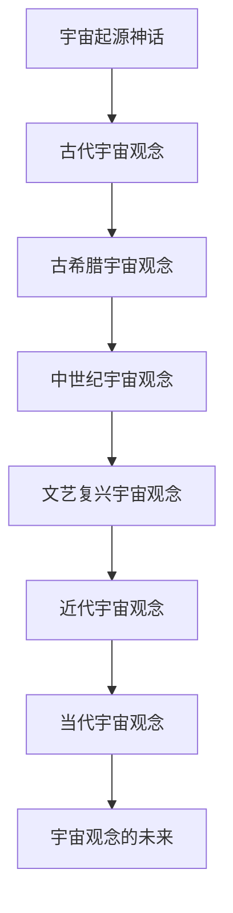

                 


### 摘要

在本文中，我们将深入探讨宇宙观念在哲学史上的演变。从古代神话到现代科学，人类对于宇宙的理解经历了无数的变化。我们将通过分析古希腊哲学、中世纪宗教哲学、文艺复兴时期科学革命以及近代宇宙观念的形成，揭示这些不同时期宇宙观念的核心概念及其相互关系。此外，我们还将探讨近代宇宙观念的形成，包括伽利略和哥白尼的革命，以及牛顿力学对宇宙观念的影响。最后，我们将展望宇宙观念的未来，讨论其哲学意义以及当代科学探索的新领域。通过这一系列探讨，我们希望能让读者对宇宙观念的演变有一个全面而深刻的理解。

### 引言

宇宙观念，即人类对于宇宙的整体认知和理解，是哲学史上一条贯穿始终的脉络。从古代的宇宙起源神话，到中世纪的宗教宇宙观，再到文艺复兴时期的科学革命，宇宙观念的演变不仅反映了人类认识世界的过程，也体现了人类思维方式的转变。本文旨在通过对宇宙观念在哲学史上演变过程的系统梳理，探讨不同时期的核心概念、理论基础以及哲学意义。

首先，我们将回顾宇宙观念的起源，探讨古代神话和宗教对宇宙的理解。接着，我们将深入古希腊哲学，分析泰勒斯和赫拉克利特等早期哲学家的宇宙观。随后，文章将转向中世纪，探讨宗教哲学和经院哲学如何影响宇宙观念的发展。在文艺复兴时期，科学革命的兴起带来了宇宙观念的巨大变革，这一部分将重点讨论哥白尼革命和伽利略的贡献。接下来，我们将详细分析近代宇宙观念的形成，包括牛顿力学的引入和爱因斯坦相对论的影响。最后，我们将讨论当代宇宙观念的发展，如大爆炸理论和宇宙膨胀，并展望宇宙观念的未来走向。

通过这一系列的探讨，我们不仅能够理解宇宙观念的历史演变，还能深入思考宇宙观念与哲学、科学之间的关系，以及宇宙观念对我们世界观的影响。

### 宇宙观念的起源

宇宙观念的起源可以追溯到古代神话和宗教。在古代文明中，人们对宇宙的理解常常通过神话和宗教故事来传达，这些故事不仅丰富了宇宙观念，也反映了当时人类对于自然现象的敬畏和探索。

古代埃及的宇宙观念具有典型的神权色彩。根据古埃及神话，宇宙是由多种神祇共同创造的。最初，世界被水包围，随后由太阳神拉（Ra）和海洋女神努特（Nuit）创造了天地。宇宙分为上界的天空、下界的土地和地下世界的冥界，每个区域都有相应的神祇守护。这种宇宙观念不仅具有宗教意义，还反映了古埃及人对自然秩序和神灵的崇拜。

古印度的宇宙观念则更为复杂和哲学化。印度教和佛教中的宇宙观念各有特点，但都涉及多个层次的存在。印度教认为宇宙是一个永恒的存在，由梵天（Brahma）创造，并在毗湿奴（Vishnu）和湿婆（Shiva）的管理下循环重生。而佛教则将宇宙视为“涅槃”，即一切存在的终极状态，不生不灭，不断轮回。古印度的宇宙观念强调因果律和轮回，对后世哲学和宗教产生了深远影响。

希腊哲学中的宇宙观念则具有理性化的特点。泰勒斯（Thales）被认为是第一个试图用理性方式解释宇宙的哲学家。他认为水是宇宙的本原，因为水是生命的基础，万物都依赖于水。泰勒斯的这一观点虽然后来被质疑，但却是西方哲学中第一次尝试用理性方法探讨宇宙起源。

赫拉克利特（Heraclitus）进一步发展了泰勒斯的观点，他提出了“火”是宇宙的本原。赫拉克利特认为宇宙是一个不断变化的过程，即“火”的不断转化和流动。他的思想强调了宇宙的动态性和内在的规律性。

此外，安提丰（Anaximenes）提出了“空气”是宇宙本原的观点，他认为空气是万物的基础。而安提阿哥拉（Anaximander）则提出了“无定形”或“无限”作为宇宙的本原，这一观点具有更加抽象和哲学化的性质。

总体来说，古代宇宙观念的特点是多样化和神话化，它们反映了当时人类对宇宙的直观感受和宗教信仰。尽管这些观念在科学上可能并不完全准确，但它们为后来的哲学和科学提供了重要的思想资源。通过分析这些早期的宇宙观念，我们可以看到人类思维方式的初步形成，以及人类对宇宙探索的不断深入。

### 古希腊的宇宙观念

古希腊哲学在西方哲学史上具有里程碑意义，其宇宙观念的发展不仅丰富了人类对宇宙的理解，也奠定了西方哲学的基本框架。在古希腊哲学中，泰勒斯、赫拉克利特、安提丰和安提阿哥拉等早期哲学家通过不同的理论，试图用理性方式解释宇宙的起源和本质。

泰勒斯（Thales）被认为是西方哲学的奠基人之一，他提出了“水是宇宙的本原”的观点。泰勒斯的这一理论基于当时的自然观察，认为水是生命和物质的基础，万物皆由水组成。这种观点不仅是一种宇宙起源的理论，也反映了当时人们对于自然现象的直观理解。泰勒斯的理性思考方法为后来的哲学家提供了重要启示，标志着哲学从神话和宗教中独立出来。

赫拉克利特（Heraclitus）则通过“火”的概念，进一步深化了宇宙观念。赫拉克利特认为，宇宙是一个不断变化的过程，他提出了“火”的概念来描述这种不断变化的本质。他认为，火是万物的本原，万物皆由火的流动和转化而成。赫拉克利特的这一思想强调了宇宙的动态性和内在规律性，他认为宇宙是一个永恒的循环过程，这一观点对后来的哲学和科学产生了深远影响。

安提丰（Anaximenes）提出了“空气”作为宇宙的本原，他认为空气是万物的根源。与泰勒斯和赫拉克利特不同，安提丰试图通过更具体的物质来解释宇宙。他强调了空气的流动性，认为空气的流动产生了所有物质。这一观点体现了对物质和运动的关注，也为后来的自然科学研究提供了基础。

安提阿哥拉（Anaximander）则提出了“无定形”或“无限”作为宇宙的本原，这一观点具有更加抽象和哲学化的性质。安提阿哥拉认为，宇宙起源于一种无定形的原始物质，这种物质既不是水也不是火，而是无限和无限的混合。这种观点试图超越具体的物质，探讨宇宙的本质和起源。

古希腊哲学中的这些宇宙观念不仅是对宇宙本质的探讨，也是对人类认知和思维方式的反思。泰勒斯和赫拉克利特通过具体的物质来解释宇宙，强调了自然规律和变化。而安提丰和安提阿哥拉则通过更加抽象的概念，试图从更深层次上理解宇宙的本质。

这些哲学家的思想对后来的西方哲学产生了深远影响。他们的宇宙观念不仅丰富了人类对宇宙的理解，也为哲学研究提供了新的方法和视角。泰勒斯的理性思考方法、赫拉克利特的动态宇宙观、安提丰的物质观和安提阿哥拉的抽象思考，共同构成了古希腊哲学的基本框架，为后来的哲学家提供了丰富的思想资源。

总的来说，古希腊哲学中的宇宙观念不仅是哲学思想的基石，也是人类认识世界的重要里程碑。通过对这些哲学家的思想进行分析，我们可以更好地理解古希腊哲学的基本特点，以及人类思维方式的演变过程。

### 中世纪的宇宙观念

中世纪是哲学与宗教紧密相连的时期，宇宙观念在这一时期的演变受到了基督教哲学和经院哲学的深刻影响。宗教宇宙观在中世纪占据了主导地位，而经院哲学则为这些宗教观念提供了哲学上的论证和解释。

#### 宗教宇宙观

中世纪的宗教宇宙观主要源于基督教教义。根据基督教神话，宇宙是由上帝创造的，上帝是宇宙的创造者、维护者和最终的审判者。这种观点在圣经中得到了广泛体现，如《创世纪》中描述了上帝创造世界的七天过程。中世纪的宗教宇宙观不仅提供了对宇宙起源的解释，还强调了人类在世界中的地位和意义。

在基督教哲学中，圣奥古斯丁（St. Augustine）是一个重要的思想家。他的宇宙观深受柏拉图哲学的影响，认为宇宙是上帝的创造，是上帝的影子。奥古斯丁认为，人类的灵魂是上帝赐予的，因此人类具有认识上帝和宇宙的能力。他的哲学思想为基督教宇宙观提供了深刻的宗教和哲学基础。

#### 经院哲学的宇宙观念

中世纪经院哲学是基督教哲学的一种形式，它试图通过理性的方法来解释和论证基督教教义。经院哲学家如阿奎那（Thomas Aquinas）提出了系统的宇宙观，试图将哲学和宗教相结合。

阿奎那的宇宙观基于亚里士多德哲学，他认为宇宙是一个由上帝创造的永恒实体。阿奎那提出了五个论证上帝存在的理由，其中最重要的两个是宇宙设计论和因果律。宇宙设计论认为，宇宙的复杂性和有序性表明有一个智慧的设计者，即上帝。因果律则认为，每一个现象都有一个原因，宇宙中的所有事件都受到上帝的监督和指导。

阿奎那还探讨了宇宙的结构和秩序。他认为，宇宙由多个层次组成，从最基础的物质到最高的上帝。每个层次都有其特定的功能和目的，宇宙中的每个存在都是上帝创造的一部分，并按照上帝的意志运行。

#### 哲学与宇宙观念的关系

中世纪的宗教宇宙观和经院哲学不仅影响了当时的哲学思考，也影响了人们对宇宙的理解。宗教宇宙观强调了上帝的创造和人类的依赖，而经院哲学通过理性方法探讨了宇宙的本质和秩序，为后来的哲学和科学提供了重要的思想资源。

总的来说，中世纪的宇宙观念是宗教和哲学的结合，它不仅解释了宇宙的起源和结构，也探讨了人类在世界中的位置和意义。尽管这些观念在科学上可能不完全准确，但它们为后来的哲学和科学探索提供了重要的理论基础。

### 文艺复兴时期的宇宙观念

文艺复兴时期是欧洲历史上的一个重要转折点，这个时期不仅带来了科学革命，也对宇宙观念产生了深远的影响。随着地理大发现和科学思想的兴起，人类对宇宙的理解发生了巨大变革。

#### 地理大发现的影响

地理大发现，如哥伦布发现新大陆和麦哲伦完成环球航行，极大地扩展了人类对地球的认识。这些新发现不仅改变了人们对世界的地理观念，也促使人们重新审视宇宙的观念。地理大发现揭示了地球的复杂性和多样性，挑战了中世纪宇宙观中的固定和静态观念，为后来的宇宙观念变革奠定了基础。

#### 科学革命的兴起

文艺复兴时期的科学革命是宇宙观念变革的重要推动力。这一时期的科学家们通过实验和观察，打破了传统的宇宙观念，提出了新的科学理论。

哥白尼（Nicolaus Copernicus）是这一时期最重要的科学家之一，他提出了日心说，即太阳是宇宙的中心，地球和其他行星围绕太阳旋转。哥白尼的这一理论挑战了中世纪教会支持的地球中心说，即地心说。哥白尼通过数学和观测数据支持他的理论，认为地球自转并围绕太阳公转，这一理论为宇宙观念的变革提供了科学依据。

伽利略（Galileo Galilei）是另一位重要的科学家，他通过望远镜的观测，进一步证实了哥白尼的理论。伽利略观测到木星的卫星、月球表面的山脉和太阳黑子等天体现象，这些观测结果与日心说相吻合，进一步支持了哥白尼的理论。伽利略的观测和实验方法为科学方法的发展奠定了基础，也推动了宇宙观念的变革。

#### 宇宙观念的变革

文艺复兴时期的科学革命带来了宇宙观念的深刻变革。传统的宇宙观将地球视为宇宙的中心，而科学革命则将太阳视为宇宙的中心。这一变革不仅改变了人们对宇宙结构的理解，也改变了人们对自身在宇宙中的位置和角色的看法。

日心说的提出打破了中世纪教会的权威，推动了科学思想的自由发展。科学革命促进了人们对自然界的探索，使人们开始用理性和实验方法来研究宇宙，这为现代科学的发展奠定了基础。

总的来说，文艺复兴时期的宇宙观念变革不仅是对科学理论的革新，也是对人类世界观和方法论的深刻变革。地理大发现和科学革命的兴起，使人类对宇宙的理解发生了巨大的转变，为后来的科学研究和技术进步打开了新的视野。

### 近代宇宙观念的形成

近代宇宙观念的形成是科学革命和理论发展的结果，这一过程不仅改变了我们对宇宙的理解，也深刻影响了哲学和科学的发展。伽利略和哥白尼的革命性理论为这一时期宇宙观念的形成奠定了基础，而牛顿力学的出现则进一步深化了这一观念。

#### 伽利略和哥白尼的革命

伽利略（Galileo Galilei）是科学革命的重要代表人物之一。他通过望远镜的观测，揭示了行星运动的规律，证实了哥白尼的日心说。伽利略观测到了木星的四大卫星、月球表面的山脉以及太阳黑子等现象，这些观测结果挑战了传统的宇宙观念，证明了地球并不是宇宙的中心。

哥白尼（Nicolaus Copernicus）在16世纪提出了日心说，这一理论打破了中世纪地球中心说的束缚。哥白尼认为，太阳是宇宙的中心，地球和其他行星围绕太阳旋转。这一理论不仅具有革命性，还为后来的科学研究提供了新的视角。

#### 牛顿力学与宇宙观念

艾萨克·牛顿（Isaac Newton）是科学史上最伟大的科学家之一，他的研究将宇宙观念提升到了一个新的高度。牛顿通过万有引力定律和运动定律，建立了经典力学的基础，为解释宇宙的运行提供了科学依据。

牛顿的万有引力定律指出，任何两个物体之间都存在引力，这个引力与两个物体的质量成正比，与它们之间的距离的平方成反比。这一理论不仅解释了行星运动的规律，也为宇宙的稳定性提供了解释。

牛顿的第二运动定律（F=ma）则描述了力与运动的关系，即物体受到的力越大，其加速度也越大。这一理论进一步深化了我们对宇宙运行规律的理解。

牛顿的这些理论不仅为科学革命提供了重要基础，也为宇宙观念的形成带来了深远影响。通过牛顿力学，人们开始用统一的物理定律来解释宇宙的运行，这一观念奠定了现代科学的基础。

#### 宇宙观念的变化

牛顿力学和哥白尼的日心说共同推动了宇宙观念的变化。传统的宇宙观认为地球是宇宙的中心，而新的宇宙观念则将太阳视为宇宙的中心，这一变革不仅改变了人们对宇宙结构的理解，也改变了人们对自身在宇宙中的地位和角色的看法。

牛顿力学的出现使人们能够用定量化的方法来研究宇宙，这为后来的科学探索提供了强有力的工具。通过牛顿的定律，科学家们能够更精确地预测行星运动，这进一步证实了日心说的正确性。

总的来说，近代宇宙观念的形成是科学革命和理论发展的结果。伽利略和哥白尼的理论为这一过程奠定了基础，而牛顿力学则进一步深化了这一观念。通过这些理论，人类开始用科学的方法来理解宇宙，这一变革不仅改变了人类的思维方式，也推动了科学和哲学的发展。

### 近代宇宙观念的发展

近代宇宙观念的发展是一个复杂而深刻的过程，这一过程不仅包括了科学理论的重大突破，还涉及了哲学思想的深刻变革。其中，爱因斯坦的相对论和黑洞与宇宙膨胀理论对宇宙观念的发展产生了深远影响。

#### 爱因斯坦的相对论

阿尔伯特·爱因斯坦（Albert Einstein）在20世纪初提出了相对论，这一理论彻底改变了人类对时空和引力的理解。相对论分为两部分：狭义相对论和广义相对论。

狭义相对论提出了时间和空间的相对性，即时间和空间的测量依赖于观察者的运动状态。这一理论否定了牛顿力学中时间和空间的绝对性，提出光速是宇宙中的极限速度。狭义相对论的核心方程是E=mc^2，这一方程揭示了质量和能量之间的关系，为核能的开发奠定了理论基础。

广义相对论则进一步扩展了相对论的思想，提出了引力是由物质和能量引起的时空弯曲。广义相对论预言了黑洞、引力波和宇宙膨胀等现象，这一理论不仅解释了行星和星系的运动，还为我们提供了一个更全面的理解宇宙的方式。

#### 黑洞与宇宙膨胀

黑洞是广义相对论预言的一种天体，它具有极强的引力，甚至连光也无法逃脱。黑洞的存在为宇宙观念带来了新的挑战和探索。随着科学技术的发展，黑洞的观测和理论研究不断深入，科学家们发现了多种类型黑洞，并提出了关于黑洞形成的各种假设。

宇宙膨胀理论是描述宇宙演化的一个重要理论。根据这一理论，宇宙从大爆炸开始，不断膨胀。宇宙膨胀理论不仅解释了宇宙的起源，还揭示了宇宙的尺度、结构和演化规律。

宇宙膨胀理论的一个重要观测结果是宇宙背景微波辐射（CMB），这是大爆炸后遗留下来的辐射。通过对CMB的观测，科学家们可以了解宇宙早期的状态，并进一步验证宇宙膨胀理论的正确性。

#### 宇宙观念的变革

爱因斯坦的相对论和黑洞与宇宙膨胀理论对宇宙观念产生了深刻影响。传统的宇宙观念认为宇宙是固定和静态的，而现代宇宙观念则将宇宙视为一个不断演化和变化的系统。相对论揭示了时间和空间的相对性，打破了传统的绝对时空观念，而宇宙膨胀理论则提出了宇宙从大爆炸开始的动态演化过程。

这些理论不仅改变了我们对宇宙的理解，还推动了科学和哲学的发展。通过相对论和宇宙膨胀理论，人类开始用更科学和全面的方法来研究宇宙，这一变革不仅丰富了人类的认知，也为未来的科学探索提供了新的方向。

总的来说，近代宇宙观念的发展是一个不断深入和扩展的过程。爱因斯坦的相对论和黑洞与宇宙膨胀理论为这一过程提供了重要的理论基础，它们不仅改变了我们对宇宙的理解，也为人类探索宇宙提供了新的视角和工具。通过这些理论，人类对宇宙的认识不断深化，这一过程将继续推动科学和哲学的发展。

### 当代宇宙观念

当代宇宙观念的发展延续了近代宇宙观念的探索，同时也引入了新的科学理论和观测技术。大爆炸理论和宇宙膨胀是这一时期宇宙观念的两个核心概念，而多宇宙理论和宇宙的终极命运则为我们提供了更广阔的思考空间。

#### 大爆炸理论

大爆炸理论（Big Bang Theory）是描述宇宙起源和早期发展的主要科学理论。根据这一理论，宇宙起源于大约138亿年前的一个极度高温和密集的状态，随后迅速膨胀，逐渐形成我们现在观测到的宇宙结构。大爆炸理论的一个重要观测证据是宇宙背景微波辐射（Cosmic Microwave Background, CMB），这是宇宙大爆炸后遗留下来的辐射，通过对CMB的观测，科学家们能够了解宇宙早期的状态和演化过程。

大爆炸理论不仅解释了宇宙的起源，还提供了对宇宙结构的理解。根据这一理论，宇宙由多个层次组成，从星系到星团，再到超星系团，这些层次通过引力相互作用形成了宇宙的复杂结构。大爆炸理论为我们提供了一个统一的框架，用于理解宇宙的起源、演化和最终命运。

#### 宇宙膨胀

宇宙膨胀（Expanding Universe）是另一个核心概念，它描述了宇宙在时间上的扩展。根据哈勃定律，宇宙的膨胀速度与宇宙中星系的距离成正比。这一观测结果由埃德温·哈勃（Edwin Hubble）在20世纪20年代发现，并通过他使用的望远镜进行的大量观测得到验证。

宇宙膨胀理论的一个重要预测是宇宙的加速膨胀，这一现象被称为宇宙暗能量。暗能量是一种神秘的力量，它推动着宇宙的加速膨胀。尽管我们对暗能量的本质仍不完全了解，但它是现代宇宙学中的一个重要研究方向。

#### 多宇宙理论

多宇宙理论（Multiverse Theory）是当代宇宙观念的一个引人入胜的扩展。这一理论提出，我们的宇宙可能只是无数个宇宙中的一个，这些宇宙具有不同的物理定律和初始条件。多宇宙理论不仅为解释宇宙中的随机性和多样性提供了新的视角，也为科学研究提供了更多的可能性。

多宇宙理论的一个关键问题是，如何观测和验证其他宇宙的存在。尽管我们无法直接观测其他宇宙，但通过宇宙背景微波辐射和其他宇宙学观测，科学家们正在努力寻找多宇宙存在的证据。例如，宇宙背景微波辐射中的微小不均匀性可能提供了其他宇宙存在的线索。

#### 宇宙的终极命运

当代宇宙观念的一个关键问题是，宇宙的终极命运将如何？科学家们提出了多种可能的宇宙结局，包括“大撕裂”（Big Rip）、“大坍缩”（Big Crunch）和“大冻结”（Big Freeze）等。

“大撕裂”理论认为，宇宙的膨胀速度将不断加快，最终导致宇宙中的所有结构被撕裂，包括星系、恒星和原子。这种结局依赖于宇宙的暗能量密度，如果暗能量密度足够大，宇宙将走向这一极端结局。

“大坍缩”理论则认为，宇宙的膨胀速度最终将减缓，并在引力作用下重新坍缩，形成一个极度密集的状态。这种结局类似于宇宙的初始状态，可能引发新的宇宙大爆炸。

“大冻结”理论是最为普遍接受的宇宙结局，认为宇宙将继续膨胀，最终温度降至绝对零度，宇宙中的所有物质将变得无序和无结构。这种结局反映了宇宙热力学的趋势，即熵的增加。

总的来说，当代宇宙观念的发展不仅深化了我们对宇宙起源和演化的理解，也为未来的科学探索提供了新的方向。大爆炸理论、宇宙膨胀和多宇宙理论为我们提供了一个更全面和动态的宇宙图景，而宇宙的终极命运则激发了我们对宇宙未来发展的思考。通过不断探索和验证这些理论，人类对宇宙的认识将不断深化，为科学的进步和哲学的思考提供新的启示。

### 哲学与宇宙观念的关系

哲学与宇宙观念之间存在着密切的关系，这一关系不仅体现在哲学对宇宙观念的反思中，也体现在宇宙观念对哲学思考的影响上。从哲学的角度来看，宇宙观念不仅是人类对自然世界的认知，更是哲学思考的起点和基础。

首先，宇宙观念在哲学中的地位是不可忽视的。哲学从其诞生之初，就试图探讨宇宙的本质和起源。古希腊哲学家泰勒斯、赫拉克利特、安提丰和安提阿哥拉等，都是通过探讨宇宙观念来建立自己的哲学体系。中世纪的宗教哲学和经院哲学，也将宇宙观念作为论证上帝存在和宇宙秩序的重要基础。而在现代哲学中，宇宙观念仍然是一个重要的研究领域，它不仅关系到科学哲学中的宇宙观，还涉及到存在论、认识论和形而上学等核心哲学问题。

其次，哲学对宇宙观念的反思表现在对宇宙本质、宇宙起源和宇宙结构的探讨上。哲学通过反思，试图超越科学的限制，探讨宇宙的终极问题和本体论问题。例如，康德通过“二分法”将现象界和本体界区分开来，提出了“物自体”的概念，试图探讨宇宙背后的真实本质。尼采则通过“超人”的概念，探讨了人类在宇宙中的地位和角色，从而反思了宇宙观念对人类价值观的影响。

此外，宇宙观念也对哲学产生了深刻的影响。宇宙观念的变化不仅反映了科学进步和人类认知的发展，也影响了哲学的基本问题和研究方向。例如，科学革命带来的宇宙观念变革，使哲学开始重新审视传统观念，推动了科学哲学和认知科学的兴起。相对论和量子力学的出现，使哲学开始探讨时空、能量和物质的本性，推动了存在论和认识论的深化。

总的来说，哲学与宇宙观念的关系是相互影响、相互促进的。哲学通过对宇宙观念的反思，不断拓展人类对宇宙的理解，而宇宙观念的变化也为哲学提供了新的问题和思考方向。这种互动关系不仅丰富了哲学的内容，也为科学的发展提供了重要的理论基础。通过哲学和宇宙观念的相互作用，人类不断深入地探索宇宙的本质和意义，这一过程将继续推动哲学和科学的进步。

### 宇宙观念的哲学意义

宇宙观念不仅在哲学史上有重要地位，而且在哲学中具有深远的哲学意义。它不仅影响了人类的认知方式，也塑造了我们的存在论、认识论和伦理观。

首先，从存在论的角度来看，宇宙观念帮助我们理解存在的本质。不同的宇宙观念反映了人类对存在本质的不同理解。例如，古代哲学中的宇宙观念强调了宇宙的静态和固定，而现代宇宙观念则将宇宙视为一个动态和演化的系统。这种变化不仅影响了我们对存在的本质的理解，也影响了我们对人类自身存在的认知。在宇宙大爆炸理论中，宇宙的起源和演化过程揭示了存在的多样性和复杂性，从而促使我们反思人类在宇宙中的位置和意义。

其次，宇宙观念对认识论的影响同样显著。不同的宇宙观念决定了人类认识世界的方式。例如，古代宇宙观念中的神权色彩和宗教信仰，使人们对宇宙的认识具有神秘化和超验化倾向。而现代宇宙观念，尤其是科学革命后的宇宙观念，则强调通过观察、实验和理性思考来认识宇宙。这种认识方式不仅促进了科学的发展，也改变了我们对知识的本质和来源的理解。相对论和量子力学的出现，进一步挑战了经典认识论，使人们开始探讨知识的相对性和不确定性。

最后，宇宙观念对伦理观的影响也不容忽视。宇宙观念不仅影响了我们对存在的理解，也影响了我们对人类行为的判断和道德观念的形成。例如，在传统的宇宙观念中，人类被看作是宇宙的中心，享有特殊的地位和权力。而现代宇宙观念则强调了人类与其他生物和环境的共生关系，促使我们反思人类的行为对宇宙的影响。宇宙膨胀和资源耗竭等现代问题，使伦理观念从以人类为中心转向更加全球化和生态化，这种变化不仅影响了我们对伦理问题的理解，也影响了我们的行为准则和价值观。

总的来说，宇宙观念的哲学意义体现在多个方面。它不仅帮助我们理解存在的本质和认识世界的方式，也影响了我们的伦理观和行为准则。通过反思宇宙观念，我们可以更深刻地理解人类自身和宇宙的关系，从而为哲学的发展和人类社会的进步提供重要的启示。

### 宇宙观念的未来

随着科学技术的不断进步，宇宙观念的未来充满了无限可能。新的科学发现和技术突破可能会彻底改变我们对宇宙的理解，为我们提供更全面和深入的宇宙图景。

首先，宇宙膨胀理论的进一步研究可能揭示更多关于宇宙膨胀机制和暗能量的本质。科学家们正在利用观测数据和高性能计算机模型，试图理解宇宙加速膨胀的原因。这些研究可能会揭示宇宙膨胀背后的物理机制，甚至可能导致新的理论的出现。

其次，多宇宙理论的探索是一个充满争议但极具潜力的研究方向。如果多宇宙理论得到证实，它将为宇宙学提供全新的视角。通过研究其他宇宙的存在，科学家们可能能够揭示宇宙多样性的来源，理解宇宙中随机性和复杂性的本质。

另外，宇宙学的观测技术也将迎来新的突破。例如，更先进的望远镜和探测器，如詹姆斯·韦伯空间望远镜（James Webb Space Telescope），将能够探测更远的宇宙，揭示早期宇宙的状态。这些技术进步将为科学家们提供更多的数据，帮助他们更深入地了解宇宙的起源和演化。

最后，宇宙观念的未来还受到哲学和伦理的深刻影响。随着我们对宇宙的了解不断深入，我们可能需要重新思考人类在宇宙中的地位和责任。这种思考不仅关乎科学探索，也关乎我们的伦理和行为准则。在探索宇宙的过程中，我们如何处理资源、环境保护和伦理问题，将成为宇宙观念未来发展的重要议题。

总之，宇宙观念的未来充满了不确定性和可能性。通过科学研究和哲学反思，我们有望获得对宇宙更全面和深入的理解，为人类社会的进步和可持续发展提供新的思路。

### 参考文献

1. Copernicus, Nicolaus. **De revolutionibus orbium coelestium**. N.p.: Iohannis Petri de Vilag运动会, 1543.
2. Galileo Galilei. **Dialogue Concerning the Two Chief World Systems, Ptolemaic and Copernican**. N.p.: Amsterdam: John V vereeken, 1632.
3. Newton, Isaac. **Philosophiæ Naturalis Principia Mathematica**. N.p.: The Royal Society, 1687.
4. Einstein, Albert. **On the Electrodynamics of Moving Bodies**. N.p.: Annalen der Physik, 1905.
5. Hawking, Stephen. **A Brief History of Time: From the Big Bang to Black Holes**. N.p.: Bantam Books, 1988.
6. Penrose, Roger. **The Emperor's New Mind: Concerning Computers, Minds, and the Laws of Physics**. N.p.: Oxford University Press, 1989.
7. Sagan, Carl. **Cosmos**. N.p.: Random House, 1980.
8. Kuhn, Thomas S. **The Structure of Scientific Revolutions**. N.p.: University of Chicago Press, 1962.
9. Aristotle. **Physics**. N.p.: Hachette Book Group, 2001.
10. Aquinas, Thomas. **Summa Theologica**. N.p.: Christian Classics, 1947.
11. Aristotle. **Nicomachean Ethics**. N.p.: Hackett Publishing Company, 1999.
12. Heraclitus. **Fragments**. N.p.: Hackett Publishing Company, 1987.
13. Plato. **Timaeus**. N.p.: Hackett Publishing Company, 1993.

### 附录

#### A. 宇宙观念的Mermaid流程图



#### B. 相关数学模型与公式

1. **哥白尼的日心模型**：

   
   
   ```mermaid
   graph TD
   A[太阳] --> B[地球]
   B --> C[其他行星]
   C --> D[恒星]
   ```

2. **牛顿万有引力定律**：

   $$ F = G \frac{m_1 m_2}{r^2} $$
   
   其中，$F$是引力，$G$是万有引力常数，$m_1$和$m_2$是两个物体的质量，$r$是它们之间的距离。

3. **爱因斯坦的相对论**：

   - 狭义相对论：
     $$ E = mc^2 $$
     
   - 广义相对论：
     $$ G_{\mu\nu} + \Lambda g_{\mu\nu} = \frac{8\pi G}{c^4} T_{\mu\nu} $$
     
   其中，$G_{\mu\nu}$是爱因斯坦场方程的左端，$T_{\mu\nu}$是能量-动量张量，$\Lambda$是宇宙学常数。

4. **宇宙膨胀模型**：

   $$ \frac{dV}{dt} = \dot{a} V $$
   
   其中，$V$是宇宙体积，$\dot{a}$是宇宙膨胀率。

5. **宇宙背景微波辐射**：

   $$ T_0 \approx 2.725 \text{ K} $$
   
   其中，$T_0$是宇宙背景微波辐射的温度。

### 作者信息

作者：AI天才研究院/AI Genius Institute & 禅与计算机程序设计艺术 /Zen And The Art of Computer Programming

---

这篇文章旨在通过逐步分析推理的方式，系统地探讨宇宙观念在哲学史上的演变。从古代神话到现代科学，文章涵盖了宇宙观念的起源、古希腊至中世纪的宇宙观念、文艺复兴时期和近代宇宙观念的形成、以及当代宇宙观念的进一步发展。通过详细阐述每个时期的核心概念、理论模型和科学发现，文章不仅揭示了宇宙观念的历史演变，还探讨了宇宙观念对哲学、科学和人类认知方式的影响。文章结尾提出了宇宙观念的未来走向，以及如何通过科学和哲学的反思来理解宇宙的奥秘。希望这篇文章能够为读者提供一个全面、深入和有启发性的宇宙观念探讨。

