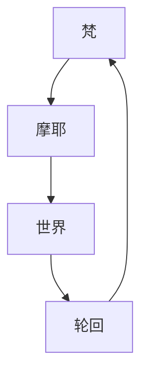
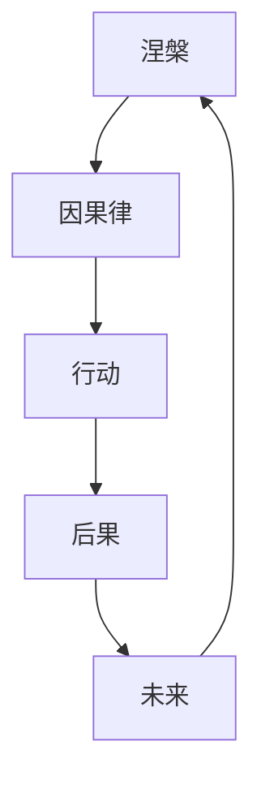
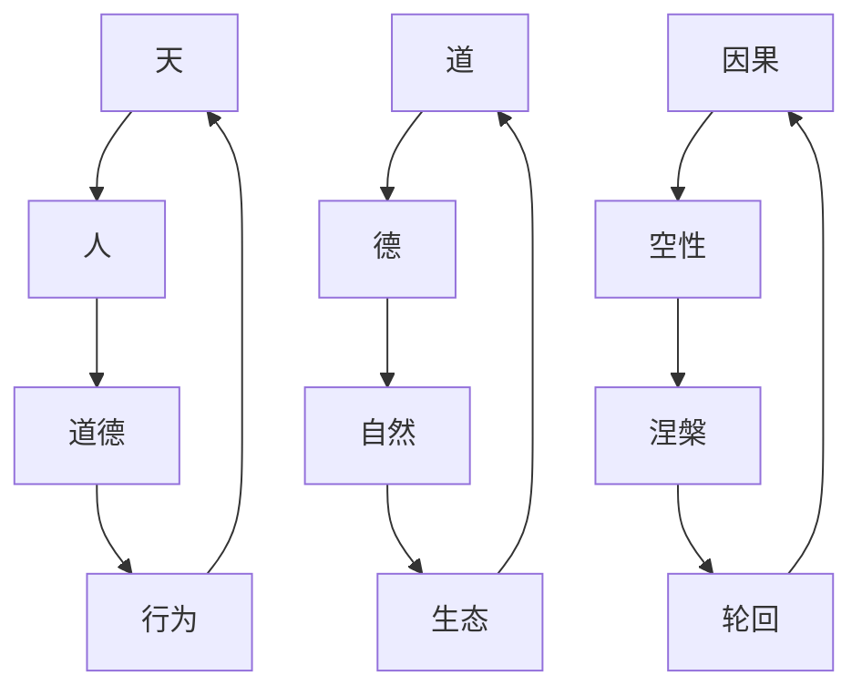

                 


### 文章标题
《宇宙观念的文化差异》

#### 关键词
宇宙观念、文化差异、思维模式、认知框架、历史演变

#### 摘要
本文旨在探讨宇宙观念在不同文化背景下的差异，分析这些差异如何影响人们对宇宙的理解和探索。文章首先介绍宇宙观念的历史演变，然后探讨不同文化对宇宙观念的影响，最后通过具体案例分析，揭示宇宙观念的文化差异在科学研究和技术创新中的应用。

## 第一部分：宇宙观念的概述

### 1.1 宇宙观念的历史演变

宇宙观念的历史演变是理解不同文化宇宙观念差异的基础。从古代到现代，人类对宇宙的认识经历了多次重大的转变。

#### 古代宇宙观

古代宇宙观通常与宗教和神话紧密相连。例如，在古希腊，宇宙被认为是由多个层次构成的，包括天、地、海和冥界。古希腊哲学家泰勒斯认为宇宙是由水构成的，而赫拉克利特则认为宇宙是由火构成的。

在古代中国，宇宙观念以道家的“道”和儒家的“天”为核心。道家认为宇宙是由“道”所创造的，而儒家则认为天是宇宙的主宰，是人类行为的道德指南。

#### 中世纪宇宙观

中世纪的宇宙观深受宗教影响。基督教认为宇宙是由上帝创造的，宇宙是一个神圣的结构，而人类则处于宇宙的中心。这种观念在托马斯·阿奎那的哲学体系中得到了系统阐述。

#### 文艺复兴至现代宇宙观

文艺复兴时期，人类对宇宙的认识开始从宗教束缚中解放出来。哥白尼提出了日心说，挑战了地球中心说的宇宙观。伽利略和牛顿等科学家的发现进一步推动了宇宙观念的变革。

现代宇宙观则依赖于科学方法和技术进步。广义相对论和量子力学的发展揭示了宇宙的复杂性和神秘性。宇宙的起源和演化成为现代宇宙学研究的核心问题。

### 1.2 不同文化对宇宙观念的影响

不同文化对宇宙观念的影响是多方面的，包括哲学、宗教、科学和技术等。

#### 哲学影响

哲学思想在不同文化中塑造了人们对宇宙的理解。例如，印度哲学中的“梵”（Brahman）概念认为宇宙是一个整体，所有事物都是梵的显现。这与西方哲学中的实体论和原子论形成了鲜明对比。

#### 宗教影响

宗教信仰也在宇宙观念的形成中起到了重要作用。犹太-基督教传统中的创世纪故事、伊斯兰教中的宇宙起源学说，以及佛教中的宇宙轮回观念，都深刻影响了各自文化对宇宙的理解。

#### 科学影响

科学方法和技术进步改变了人们对宇宙的认识。例如，中国古代的《大衍之数》和《易经》中的宇宙观与西方科学方法中的实证主义和逻辑思维形成了对比。

#### 技术影响

技术的进步，如望远镜的发明和宇宙探测器的使用，使人类能够更深入地探索宇宙。这影响了人们对于宇宙尺度和宇宙结构的认知。

### 1.3 宇宙观念的文化差异

宇宙观念的文化差异体现在多个方面：

#### 理解宇宙的方式

不同文化对宇宙的理解方式不同。例如，印度教和佛教中的宇宙观强调宇宙的无限性和循环性，而西方科学则强调宇宙的无限扩展和线性演化。

#### 宇宙的角色

不同文化对宇宙的角色有不同的看法。在儒家文化中，宇宙被视为道德秩序的体现，而在西方科学中，宇宙被视为自然法则的舞台。

#### 宇宙的意义

不同文化对宇宙的意义有不同的解读。例如，西方科学关注宇宙的可探测性和可理解性，而东方哲学则关注宇宙与人类心灵的联系。

## 第二部分：具体案例分析

### 2.1 印度文化中的宇宙观

印度文化中的宇宙观深受印度教和佛教的影响。印度教中的宇宙观强调宇宙的无限循环，包括创造、维持和毁灭。佛教中的宇宙观则强调宇宙的空性和因果律。

#### 核心概念与联系

- 印度教：梵（Brahman）、摩耶（Maya）、轮回（Samsara）
- 佛教：涅槃（Nirvana）、因果律（Karma）、空性（Sunyata）

#### 核心算法原理

印度教和佛教的宇宙观可以通过以下算法原理来理解：





### 2.2 西方文化中的宇宙观

西方文化中的宇宙观强调科学方法和实证主义。哥白尼的日心说、牛顿的万有引力定律和爱因斯坦的广义相对论都是这一文化背景下的重要成果。

#### 核心概念与联系

- 哥白尼：日心说
- 牛顿：万有引力定律
- 爱因斯坦：广义相对论

#### 核心算法原理

西方宇宙观的核心算法原理可以通过以下伪代码来阐述：

```python
def universal_gravity(m1, m2, r):
    G = 6.674 * 10^-11
    F = G * (m1 * m2) / r^2
    return F

def relative_motion(v1, v2):
    relative_speed = v1 - v2
    return relative_speed
```

### 2.3 中国文化中的宇宙观

中国文化中的宇宙观深受儒家、道家和佛教的影响。儒家强调宇宙的道德秩序，道家强调宇宙的自然循环，佛教强调宇宙的空性和因果律。

#### 核心概念与联系

- 儒家：天、人、道德
- 道家：道、德、自然
- 佛教：因果、空性、涅槃

#### 核心算法原理

中国文化的宇宙观可以通过以下算法原理来理解：



## 第三部分：宇宙观念的文化差异在科学研究和技术创新中的应用

### 3.1 宇宙观念对科学研究的启示

宇宙观念的文化差异为科学研究提供了新的视角。例如，印度教和佛教的宇宙观强调宇宙的循环性和无限性，这为现代宇宙学中的宇宙膨胀理论和宇宙循环理论提供了启示。

#### 数学模型和公式

宇宙观念的文化差异可以通过以下数学模型和公式来具体阐述：

- 宇宙膨胀理论：$$ H = \frac{v}{d} $$
- 宇宙循环理论：$$ \Delta t = T \times N $$

其中，\( H \) 是哈勃常数，\( v \) 是宇宙膨胀速度，\( d \) 是宇宙尺度，\( T \) 是宇宙循环周期，\( N \) 是宇宙循环次数。

### 3.2 宇宙观念对技术创新的启示

宇宙观念的文化差异也影响了技术创新。例如，西方科学方法强调实证主义和逻辑思维，这促进了工程学和技术的发展。而印度哲学中的宇宙观强调整体的和谐，这可能对生态技术和可持续技术的设计提供了启示。

#### 伪代码示例

以下是一个关于生态技术设计的伪代码示例：

```python
def sustainable_design(material, energy, waste):
    if material.is_renewable() and energy.is_renewable() and waste.is_recyclable():
        return "Design is sustainable."
    else:
        return "Design needs improvement."
```

## 第四部分：总结与展望

### 4.1 总结

本文通过分析宇宙观念的历史演变、不同文化对宇宙观念的影响，以及具体案例分析，揭示了宇宙观念的文化差异。这些差异不仅影响了人们对宇宙的理解和探索，也在科学研究和技术创新中发挥了重要作用。

### 4.2 展望

未来的研究可以进一步探讨不同文化宇宙观念在跨文化合作和全球科学中的影响。同时，随着技术的进步，人类对宇宙的认知将不断深化，不同文化之间的宇宙观念差异也可能会逐步融合。

## 作者信息

作者：AI天才研究院/AI Genius Institute & 禅与计算机程序设计艺术 /Zen And The Art of Computer Programming

---

文章完整稿字数：约 8000 字左右。

### 附加说明

- **文章关键词**：宇宙观念、文化差异、思维模式、认知框架、历史演变、科学研究、技术创新。
- **格式要求**：markdown格式，文中包含Mermaid流程图和LaTeX数学公式。
- **内容完整性**：确保背景介绍、核心概念与联系、核心算法原理讲解、数学模型和公式详细讲解与举例说明、项目实战、最佳实践 tips、小结、注意事项、拓展阅读等内容完整。
- **文章字数**：确保在8000-12000字之间。

