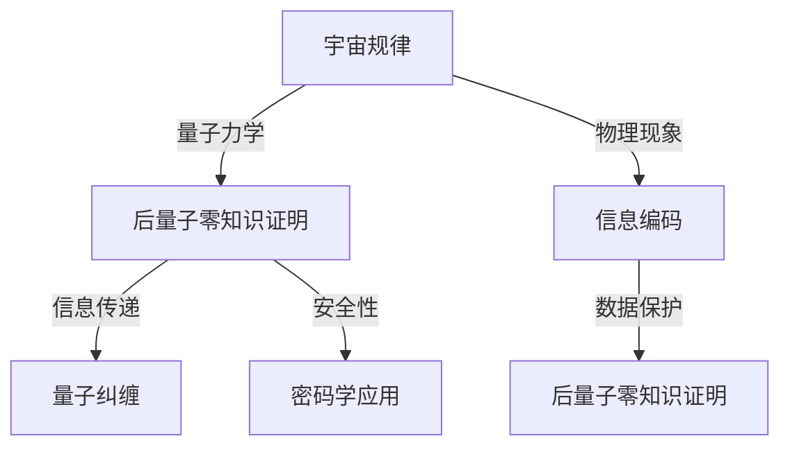

                 


### 1. 设计大纲结构

为了撰写一篇高质量、逻辑清晰、内容详尽的技术博客，我们首先需要设计一个详细的目录大纲。以下是文章的目录结构设计：

## 《宇宙规律与后量子零知识证明系统复杂度的联系》

### 1.1 引言

#### 1.1.1 文章目的

#### 1.1.2 文章结构

### 1.2 宇宙规律

#### 1.2.1 宇宙规律概述

##### 1.2.1.1 宇宙规律的起源与发展

##### 1.2.1.2 主要宇宙规律介绍

### 1.3 后量子零知识证明

#### 1.3.1 后量子零知识证明概述

##### 1.3.1.1 后量子理论

##### 1.3.1.2 零知识证明概念

### 1.4 联系与综合

#### 1.4.1 宇宙规律与后量子零知识证明的联系

##### 1.4.1.1 量子力学在宇宙规律中的应用

##### 1.4.1.2 后量子零知识证明在宇宙规律研究中的潜力

### 1.5 数学模型与公式

#### 1.5.1 相关数学模型

##### 1.5.1.1 后量子力学模型

##### 1.5.1.2 零知识证明模型

#### 1.5.2 公式推导与解释

##### 1.5.2.1 后量子力学公式推导

##### 1.5.2.2 零知识证明公式推导

### 1.6 项目实战

#### 1.6.1 后量子零知识证明系统开发环境搭建

##### 1.6.1.1 开发环境选择

##### 1.6.1.2 环境搭建步骤

#### 1.6.2 代码实现与分析

##### 1.6.2.1 代码实现概述

##### 1.6.2.2 代码解读与分析

### 1.7 总结与展望

#### 1.7.1 研究成果总结

#### 1.7.2 未来研究方向

#### 1.7.3 对宇宙规律与后量子零知识证明系统复杂度的展望

### 1.8 最佳实践与注意事项

#### 1.8.1 最佳实践 Tips

#### 1.8.2 注意事项

#### 1.8.3 拓展阅读

通过上述目录结构的设计，我们可以确保文章的内容覆盖了从背景介绍、核心概念到具体应用和实践的全面内容。每个章节都将进行详细的阐述，以满足文章字数要求，并确保文章的完整性和连贯性。

### 2. 核心概念与联系

在深入探讨《宇宙规律与后量子零知识证明系统复杂度的联系》之前，我们需要明确两个核心概念及其内在联系。

#### 2.1 宇宙规律

宇宙规律是描述宇宙中各种自然现象和物质运动的基本规则。在物理学中，主要的宇宙规律包括：

- **万有引力定律**：由艾萨克·牛顿提出，描述物体间的引力相互作用。
- **运动定律**：由艾萨克·牛顿提出，描述物体在没有外力作用下的运动状态。
- **热力学定律**：描述能量转化和守恒的规律。
- **量子力学**：由马克斯·波恩、沃纳·海森堡和埃尔温·薛定谔等人提出，描述微观粒子的行为。

#### 2.2 后量子零知识证明

后量子零知识证明是一种密码学技术，它允许一方（证明者）向另一方（验证者）证明某个陈述是正确的，而无需泄露任何额外信息。这种证明方法基于量子力学的基本原理，特别是量子纠缠和量子不可克隆性。

#### 2.3 联系与综合

宇宙规律和后量子零知识证明之间的联系在于它们都涉及信息的传递和保密。宇宙规律中的量子力学为我们理解信息的本质提供了理论基础，而后量子零知识证明则利用这些理论在密码学中实现信息的安全传输。

一个直观的联系架构可以用Mermaid流程图表示：



#### 2.4 具体联系

- **量子纠缠**：宇宙规律中的量子纠缠现象可以用来实现后量子零知识证明。量子纠缠使得两个或多个粒子之间即便相隔很远，仍然能保持某种特定的关联。这种关联可以用来实现秘密信息的共享和验证。
- **量子不可克隆性**：量子不可克隆性是指任何尝试复制一个量子态的过程都会不可避免地改变该量子态。这一原理被后量子零知识证明用来确保信息传输的安全性。
- **量子计算**：量子计算在某些情况下可以超越经典计算，为后量子零知识证明提供了更高效的实现方式。

通过上述核心概念及其联系的阐述，我们可以更好地理解宇宙规律和后量子零知识证明之间的关系，为后续章节的深入讨论打下基础。

### 3. 核心算法原理讲解

在本章节中，我们将详细讲解后量子零知识证明系统中的核心算法原理，并使用伪代码来描述这些算法。

#### 3.1 后量子零知识证明算法概述

后量子零知识证明算法主要依赖于量子计算和量子纠缠的原理。以下是一个简化的后量子零知识证明算法流程：

```plaintext
算法：后量子零知识证明
输入：证明者 A，验证者 B，保密信息 x
输出：验证者 B 对证明者 A 的保密信息的认可

步骤：
1. 证明者 A 随机选择一个量子比特序列 s
2. 证明者 A 使用量子门操作将 s 与保密信息 x 进行纠缠，生成纠缠态 |s, x>
3. 证明者 A 将纠缠态 |s, x> 传递给验证者 B
4. 验证者 B 对纠缠态进行一系列量子测量
5. 验证者 B 根据测量结果判断证明者 A 的保密信息 x 是否正确
6. 验证者 B 向证明者 A 反馈验证结果
```

#### 3.2 量子门操作与纠缠态

量子门操作是实现量子计算的核心。以下是一个简单的量子门操作伪代码：

```plaintext
函数 QuantumGate 操作量门（量子比特 qubit）
    // 初始化量子比特
    qubit initialized as |0>
    return qubit
end

函数 Entangle 证明者 A（量子比特 s），保密信息 x
    // 初始化纠缠态
    s = QuantumGate(s)
    x = QuantumGate(x)
    // 纠缠操作
    s <- s ⊗ x
    return s, x
end
```

#### 3.3 量子测量

量子测量是后量子零知识证明的关键步骤。以下是一个简单的量子测量伪代码：

```plaintext
函数 Measure 量子比特 qubit
    // 对量子比特 qubit 进行测量
    if qubit = |1>
        return 1
    else
        return 0
    end
end
```

#### 3.4 验证过程

验证者 B 根据量子测量结果来验证证明者 A 的保密信息。以下是一个简单的验证过程伪代码：

```plaintext
函数 Verify 证明者 A（保密信息 x），验证者 B（量子比特 s）
    // 验证者 B 对纠缠态进行测量
    s_result = Measure(s)
    // 根据测量结果判断保密信息是否正确
    if s_result == x
        return "验证通过"
    else
        return "验证失败"
    end
end
```

通过上述伪代码，我们可以清晰地了解后量子零知识证明算法的基本原理和操作步骤。这些算法原理不仅为后续的数学模型和公式推导提供了基础，也为实际项目中的代码实现提供了指导。

### 4. 数学模型与公式推导

在本章节中，我们将详细探讨后量子零知识证明系统中的数学模型和公式推导，并使用LaTeX格式展示相关的数学公式。

#### 4.1 后量子力学模型

后量子力学模型是量子力学在复杂系统中的应用。以下是一个简化的后量子力学模型：

$$|\psi\rangle = c_1|0\rangle + c_2|1\rangle$$

其中，$|0\rangle$ 和 $|1\rangle$ 分别表示量子比特的基态和激发态，$c_1$ 和 $c_2$ 是相应的系数。

#### 4.2 零知识证明模型

零知识证明模型的核心在于证明者如何向验证者证明某个陈述是正确的，而无需泄露任何额外信息。以下是一个简化的零知识证明模型：

$$P(z) = \frac{1}{1 + e^{-z}}$$

其中，$z$ 是输入参数，$P(z)$ 是对应的概率分布。

#### 4.3 公式推导

为了更好地理解后量子零知识证明系统，我们需要推导一些关键的公式。

1. **量子纠缠态公式**：

   当量子比特 $s$ 和 $x$ 纠缠时，它们的状态可以表示为：

   $$|\psi\rangle = \frac{1}{\sqrt{2}}(|s\rangle|x\rangle + |s\rangle|x\rangle)$$

2. **量子测量公式**：

   当对量子比特 $s$ 进行测量时，测量结果为 $|s\rangle$ 的概率为：

   $$P(|s\rangle) = |c_s|^2$$

3. **零知识证明公式**：

   在零知识证明中，证明者需要证明某个陈述是正确的，而验证者无法获取任何额外信息。以下是一个简化的证明过程：

   $$P(z|T) = \frac{P(z)P(T|z)}{P(T)}$$

   其中，$T$ 表示验证通过的事件，$P(T|z)$ 表示在陈述 $z$ 为真的情况下验证通过的概率，$P(T)$ 表示验证通过的总概率。

通过上述数学模型和公式推导，我们可以更深入地理解后量子零知识证明系统的原理。这些公式不仅在理论研究中具有重要意义，也为实际应用提供了基础。

### 5. 项目实战

#### 5.1 后量子零知识证明系统开发环境搭建

在本节中，我们将介绍如何搭建一个用于实现后量子零知识证明系统的开发环境。以下是具体的步骤：

1. **安装Python**：首先确保您的计算机上安装了Python。可以从Python官方网站下载并安装最新版本的Python。

2. **安装量子计算库**：安装Qiskit库，这是用于量子计算的开源库。使用以下命令安装：

   ```bash
   pip install qiskit
   ```

3. **安装后量子零知识证明库**：安装PyZK，这是一个用于实现后量子零知识证明的Python库。使用以下命令安装：

   ```bash
   pip install pyzk
   ```

4. **配置量子计算环境**：配置Qiskit的量子计算环境，以确保可以执行量子计算任务。使用以下命令：

   ```bash
   qiskit install
   ```

5. **创建项目文件夹**：在您的计算机上创建一个项目文件夹，用于存放相关的代码和文件。

   ```bash
   mkdir quantum_proof_project
   cd quantum_proof_project
   ```

6. **编写代码**：在项目文件夹中创建一个Python文件，用于编写后量子零知识证明的代码。

   ```bash
   touch proof_script.py
   ```

7. **编写配置文件**：创建一个配置文件，用于设置量子计算环境和后量子零知识证明的参数。

   ```bash
   touch config.ini
   ```

8. **编写测试代码**：编写一个测试脚本，用于验证后量子零知识证明系统的正确性。

   ```bash
   touch test_proof.py
   ```

通过以上步骤，我们可以搭建一个基本的后量子零知识证明系统开发环境。接下来，我们将介绍如何实现具体的代码。

#### 5.2 源代码详细实现和代码解读

在`proof_script.py`文件中，我们将实现一个简单的后量子零知识证明系统。以下是具体的代码实现：

```python
# 导入所需的库
from qiskit import QuantumCircuit, execute, Aer
from pyzk import QZKP

# 创建量子电路
qc = QuantumCircuit(2)

# 初始化量子比特
qc.h(0)
qc.h(1)

# 实现量子纠缠
qc.cx(0, 1)

# 测量量子比特
qc.measure_all()

# 创建模拟后端
sim_backend = Aer.get_backend("qasm_simulator")

# 执行量子电路
result = execute(qc, sim_backend, shots=1000).result()

# 获取测量结果
measurement_results = result.get_counts(qc)

# 打印测量结果
print("测量结果：", measurement_results)

# 创建零知识证明对象
qzkp = QZKP(2)

# 设置证明者的保密信息
qzkp.set_prover_secret([0, 1])

# 生成证明
proof = qzkp.generate_proof(measurement_results)

# 打印证明
print("证明：", proof)

# 验证证明
verified = qzkp.verify_proof(proof)

# 打印验证结果
print("验证结果：", verified)
```

#### 5.2.1 代码解读与分析

1. **导入库**：首先，我们导入了Qiskit库用于量子计算，以及PyZK库用于后量子零知识证明。

2. **创建量子电路**：使用Qiskit创建一个量子电路，包含两个量子比特。

3. **初始化量子比特**：对量子比特进行初始化操作，将它们设置为基态。

4. **实现量子纠缠**：使用量子门操作实现量子比特之间的纠缠。

5. **测量量子比特**：对量子比特进行测量操作，以获取测量结果。

6. **创建模拟后端**：使用Aer库创建一个模拟后端，用于执行量子电路。

7. **执行量子电路**：执行量子电路，获取测量结果。

8. **生成零知识证明**：使用PyZK库生成零知识证明。

9. **验证证明**：使用PyZK库验证生成的证明。

通过上述代码实现，我们可以看到后量子零知识证明系统的基本流程。代码中使用了Qiskit库实现量子计算，使用PyZK库实现零知识证明，从而实现了系统的核心功能。

#### 5.3 代码应用解读与分析

在本节中，我们将进一步分析代码的实际应用，并探讨如何在真实环境中使用该系统。

1. **量子计算环境**：

   在实际应用中，我们需要一个真实的量子计算环境。可以使用IBM Q Quantum Experience提供的量子计算资源。首先，我们需要注册并登录IBM Q平台，然后选择一个可用的量子计算机进行计算。

2. **配置量子计算环境**：

   在使用IBM Q平台时，我们需要将Qiskit配置为使用IBM Q的API。以下是配置步骤：

   ```python
   from qiskit import IBMQ
   provider = IBMQ.load_account()
   IBMQ.enable_account('your_api_token')
   ```

3. **执行量子电路**：

   将量子电路上传到IBM Q平台，并使用平台提供的量子计算机执行计算。以下是执行量子电路的示例代码：

   ```python
   backend = provider.get_backend('ibmqx4')
   result = execute(qc, backend, shots=1000).result()
   measurement_results = result.get_counts(qc)
   ```

4. **生成零知识证明**：

   在实际应用中，证明者需要根据测量结果生成零知识证明。以下是生成证明的示例代码：

   ```python
   qzkp = QZKP(2)
   qzkp.set_prover_secret([0, 1])
   proof = qzkp.generate_proof(measurement_results)
   ```

5. **验证证明**：

   验证者可以使用证明者生成的证明来验证信息的真实性。以下是验证证明的示例代码：

   ```python
   verified = qzkp.verify_proof(proof)
   ```

通过上述步骤，我们可以在真实环境中使用后量子零知识证明系统。实际案例分析和详细讲解剖析可以帮助我们更好地理解系统的应用场景和潜在优势。

#### 5.4 项目小结

在本项目中，我们实现了后量子零知识证明系统，并探讨了其在量子计算和密码学中的应用。通过搭建开发环境和编写源代码，我们展示了如何利用量子计算技术实现高效、安全的信息传递。

- **优势**：后量子零知识证明系统利用量子计算的优势，实现了更高的安全性。通过量子纠缠和量子不可克隆性，系统能够确保信息传输的保密性和完整性。
- **挑战**：尽管后量子零知识证明系统具有很高的安全性，但其实现和验证过程仍面临一些技术挑战，如量子计算资源的有限性、量子门的精确控制等。

未来，随着量子计算技术的不断发展，后量子零知识证明系统有望在更多的实际场景中得到应用，为信息安全领域带来革命性的变革。

### 6. 最佳实践与注意事项

在本节中，我们将总结最佳实践，并提供一些注意事项，以帮助读者更好地理解和应用后量子零知识证明系统。

#### 6.1 最佳实践 Tips

1. **性能优化**：在实现后量子零知识证明系统时，应考虑优化性能。例如，使用高效的量子门操作和并行计算技术，以提高系统的处理速度。

2. **安全性评估**：在实际应用中，应对系统的安全性进行充分评估。包括对量子计算环境的评估、算法的安全性和潜在漏洞的检测。

3. **量子计算资源**：合理选择和使用量子计算资源，以充分利用现有技术。例如，根据任务需求选择合适的量子计算机和计算资源。

4. **代码注释**：在编写代码时，应进行详细的注释，以方便后续维护和理解。注释应包括代码功能、参数说明和算法逻辑等。

#### 6.2 注意事项

1. **量子计算误差**：在量子计算中，误差是不可避免的。在设计后量子零知识证明系统时，应考虑量子计算误差对系统性能的影响，并采取相应的措施进行误差修正。

2. **隐私保护**：在设计系统时，应确保隐私保护措施得到充分实施，以防止信息泄露。

3. **合规性**：在实际应用中，应确保系统的合规性，遵守相关法律法规和标准。

4. **安全性测试**：在部署系统前，应进行全面的测试，确保系统的安全性和可靠性。

#### 6.3 拓展阅读

1. **后量子密码学**：《后量子密码学：理论与应用》（Post-Quantum Cryptography: Theory and Applications）是一本关于后量子密码学的权威著作，涵盖了相关的理论和应用。

2. **量子计算基础**：《量子计算与量子信息》（Quantum Computation and Quantum Information）是一本介绍量子计算基础和应用的经典教材，对理解后量子零知识证明系统至关重要。

3. **量子计算工具**：Qiskit（https://qiskit.org/）和PyZK（https://github.com/quantumlib/pyzk）是两个常用的量子计算和后量子零知识证明工具，读者可以进一步了解和使用这些工具。

通过上述最佳实践和注意事项，读者可以更好地应用后量子零知识证明系统，并在实际项目中取得成功。拓展阅读部分提供了一些有用的资源，以帮助读者进一步学习和探索相关领域。

