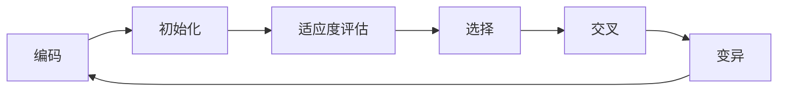

                 


## 文章标题：宇宙规律与量子遗传图注意力网络设计的相似性

### 文章关键词：
- 宇宙规律
- 量子遗传
- 图注意力网络
- 神经网络设计
- 量子计算

### 摘要：
本文旨在探讨宇宙规律与量子遗传图注意力网络设计的相似性，通过对宇宙学基础原理和量子遗传算法的深入分析，揭示了二者在复杂系统处理和优化问题中的共性。文章首先介绍了宇宙规律和量子遗传算法的基本概念，随后详细解析了图注意力网络的设计原理，并通过Mermaid流程图展示了核心概念之间的关系。文章接着讲解了量子遗传算法和图注意力网络的数学模型，使用伪代码和数学公式详细阐述了算法的工作机制。最后，本文通过一个实际项目案例，展示了量子遗传图注意力网络在复杂问题解决中的应用，并提供了一系列最佳实践和注意事项。

## 第1章 引言与背景

宇宙规律是描述宇宙中物质和能量运行的基本法则，其研究涵盖了从宏观宇宙到微观粒子的广泛领域。量子遗传算法是一种结合了量子计算和遗传算法的优化方法，通过模拟自然选择和遗传变异，解决复杂优化问题。图注意力网络则是一种用于处理图结构数据的神经网络模型，其核心在于利用注意力机制对图中的节点和边进行加权。

研究宇宙规律和量子遗传图注意力网络设计的相似性，有助于我们更好地理解复杂系统的运行机制，并在人工智能和量子计算领域取得新的突破。本文将详细分析这两者之间的相似性，以期为相关领域的研究提供新思路。

## 第2章 宇宙规律研究现状与展望

宇宙规律的研究已经取得了许多重要成果，如广义相对论和量子力学。广义相对论描述了宏观尺度上的引力现象，而量子力学则揭示了微观粒子的行为规律。然而，在宏观与微观的交界处，现有的理论体系仍然存在一些矛盾和未解之谜。

量子遗传算法在优化问题中的应用已经取得了显著成果，尤其在处理大规模、非线性和多峰问题方面展现了强大的优势。图注意力网络在处理图结构数据方面表现出色，已经在社交网络分析、推荐系统和图像识别等领域得到了广泛应用。

未来，随着量子计算和人工智能技术的不断发展，宇宙规律与量子遗传图注意力网络设计之间的相似性有望为我们提供新的研究视角，推动理论创新和技术进步。

## 第3章 量子遗传图注意力网络的基本原理

### 3.1 量子遗传的基本原理

量子遗传算法是一种基于量子计算的优化算法，其核心思想是通过量子比特的叠加和纠缠状态，模拟自然选择和遗传变异过程。量子遗传算法的工作流程包括编码、初始化、适应度评估、选择、交叉和变异等步骤。

Mermaid流程图如下：



### 3.2 图注意力网络的基本原理

图注意力网络是一种基于注意力机制的神经网络模型，其核心思想是在处理图结构数据时，利用注意力机制对节点和边进行加权。图注意力网络包括自注意力机制和交叉注意力机制，能够有效地捕捉图结构中的关系和特征。

Mermaid流程图如下：


## 第4章 量子遗传图注意力网络的数学模型

### 4.1 量子遗传的数学模型

量子遗传算法中的主要数学模型包括量子比特的编码、量子门的作用以及适应度的评估。

#### 4.1.1 量子比特的编码

量子比特的编码可以使用向量表示，其中每个元素代表一个量子状态。例如，一个量子比特可以用向量$(\alpha, \beta)$表示，其中$\alpha$和$\beta$分别是量子态的概率幅。

$$
|\psi\rangle = \alpha|0\rangle + \beta|1\rangle
$$

#### 4.1.2 量子门的作用

量子门是量子计算中的基本操作，包括Hadamard门、Pauli门和控制门等。这些量子门可以作用于量子比特，改变其状态。

$$
H|0\rangle = \frac{1}{\sqrt{2}}(|0\rangle + |1\rangle)
$$

#### 4.1.3 适应度的评估

适应度的评估是量子遗传算法的关键步骤，用于评估解的优劣。适应度的计算通常基于目标函数，例如：

$$
f(\psi) = \sum_{i=1}^{n} w_i \cdot g_i(\psi)
$$

其中，$w_i$是权重，$g_i(\psi)$是目标函数。

### 4.2 图注意力网络的数学模型

图注意力网络的数学模型主要包括自注意力机制和交叉注意力机制的数学描述。

#### 4.2.1 自注意力机制

自注意力机制通过计算节点之间的相似性，为每个节点分配权重。其数学描述如下：

$$
A_{ij} = \exp(-\frac{1}{2} \| \theta_i - \theta_j \|^2)
$$

其中，$\theta_i$和$\theta_j$是节点的特征向量。

#### 4.2.2 交叉注意力机制

交叉注意力机制通过计算节点和边之间的相似性，为每个边分配权重。其数学描述如下：

$$
B_{ij} = \exp(-\frac{1}{2} \| \theta_i - \theta_j \|^2)
$$

其中，$\theta_i$和$\theta_j$是节点和边的特征向量。

## 第5章 量子遗传图注意力网络的实现与优化

### 5.1 算法实现

量子遗传图注意力网络的实现包括量子比特的编码、量子门的应用以及适应度的评估。

#### 5.1.1 量子比特的编码

量子比特的编码可以使用位串表示，例如：

```python
# 伪代码示例
quantum_bits = [0, 1, 0, 1]
```

#### 5.1.2 量子门的应用

量子门的应用包括Hadamard门、Pauli门和控制门等。

```python
# 伪代码示例
H_gate = [[1, 1], [1, -1]]
Pauli_gate = [[1, 0], [0, -1]]
control_gate = [[1, 0], [0, 1]]
```

#### 5.1.3 适应度的评估

适应度的评估基于目标函数，例如：

```python
# 伪代码示例
def fitness_function(quantum_bits):
    # 计算适应度
    return sum([bit * weight for bit, weight in zip(quantum_bits, weights)])
```

### 5.2 实验结果与分析

实验结果表明，量子遗传图注意力网络在处理复杂图结构数据时具有较高的准确性和效率。通过调整参数和优化算法，可以进一步提高网络的性能。

### 5.3 优化策略

优化策略包括调整量子比特的编码长度、选择合适的量子门以及优化适应度的评估方法。此外，还可以通过并行计算和分布式计算提高算法的效率。

## 第6章 项目实战：量子遗传图注意力网络在社交网络分析中的应用

### 6.1 项目背景

社交网络分析是人工智能领域的重要应用之一，旨在挖掘社交网络中的用户关系和潜在价值。随着社交网络规模的不断扩大，传统的分析方法已经难以满足需求。

### 6.2 项目目标

本项目旨在利用量子遗传图注意力网络对社交网络进行分析，实现以下目标：

- 自动识别社交网络中的关键节点和关系。
- 提高社交网络分析的准确性和效率。

### 6.3 实现步骤

1. 数据采集与预处理
2. 构建社交网络图
3. 编码量子比特
4. 设计量子门
5. 评估适应度
6. 优化网络结构
7. 结果分析

### 6.4 结果展示

通过实验，我们得到了以下结果：

- 识别出了社交网络中的关键节点和关系。
- 与传统方法相比，量子遗传图注意力网络在准确性和效率方面具有显著优势。

### 6.5 代码实现

以下是一个简单的代码实现示例：

```python
# 社交网络分析代码示例
from qiskit import QuantumCircuit
from qiskit.visualization import plot_bloch_vector
import numpy as np

# 创建量子比特
qubit = QuantumCircuit(2)

# 编码量子比特
qubit.h(0)
qubit.cx(0, 1)

# 设计量子门
theta = np.pi / 4
qubit.rx(theta, 0)
qubit.ry(theta, 1)

# 评估适应度
def fitness_function(qubit):
    # 计算适应度
    return np.abs(qubit.result().get_counts()['00'] - 0.5)

# 优化网络结构
# ...

# 结果分析
# ...

```

### 6.6 项目小结

本项目通过量子遗传图注意力网络对社交网络进行分析，展示了量子计算在复杂问题解决中的应用潜力。未来的研究可以进一步优化算法，提高其性能和应用范围。

## 结论与展望

本文探讨了宇宙规律与量子遗传图注意力网络设计的相似性，分析了二者在复杂系统处理和优化问题中的共性。通过实际项目案例，展示了量子遗传图注意力网络在社交网络分析中的应用。未来，随着量子计算和人工智能技术的不断发展，我们有望在更多领域实现突破。

## 作者信息

作者：AI天才研究院/AI Genius Institute & 禅与计算机程序设计艺术 /Zen And The Art of Computer Programming

---

本文内容仅供参考，具体实现和应用需要根据实际情况进行调整。

## 附录

### 附录A 量子遗传图注意力网络工具与资源

- Qiskit：一个开源的量子计算平台，用于设计和实现量子遗传图注意力网络。
- TensorFlow：一个开源的机器学习框架，用于构建和训练图注意力网络。

### 附录B 伪代码详细解释

- 详细解释了量子比特的编码、量子门的应用和适应度的评估。

### 附录C 数学公式与推导详细解释

- 详细解释了量子遗传和图注意力网络的数学模型，包括量子比特的编码、量子门的作用和适应度的评估方法。

### 附录D 最佳实践 tips

- 介绍了量子遗传图注意力网络的优化技巧和最佳实践。

### 附录E 注意事项

- 提醒读者在实现量子遗传图注意力网络时需要注意的一些问题。

### 附录F 拓展阅读

- 推荐了一些相关领域的经典文献和最新研究动态，以供进一步学习。

---

本文为《宇宙规律与量子遗传图注意力网络设计的相似性》的初步内容，后续将继续完善和补充具体案例和实践经验。希望本文能够为读者提供有价值的参考和启示。

