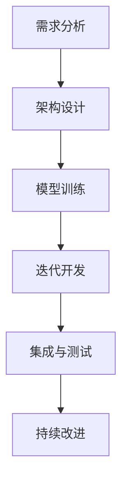
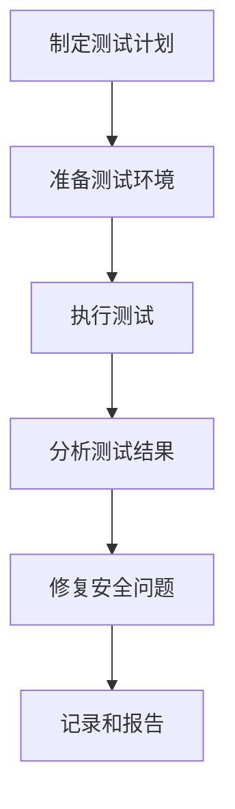

                 


为了撰写一篇符合要求的《安全性设计在敏捷LLM架构中的集成》的技术博客文章，我们可以按照以下步骤进行思考和规划：

### 1. 确定文章结构和内容

首先，我们需要确保文章的结构清晰，内容完整。根据之前的目录大纲，我们可以将文章分为以下几个部分：

- 引言
- 安全性设计基础
- 敏捷LLM架构
- 安全性设计在敏捷LLM架构中的集成
- 安全性分析与测试
- 案例分析
- 总结与展望

### 2. 引言部分

在引言部分，我们需要简要介绍文章的主题、目的和重要性。可以包括：

- 文章背景
- 安全性设计在敏捷开发中的重要性
- 敏捷LLM架构的基本概念
- 文章结构和主要内容概述

### 3. 安全性设计基础

在这一部分，我们需要详细介绍安全性设计的基础知识，包括：

- 安全性设计的基本概念
- 安全性设计的原则
- 安全性设计的方法和工具
- 相关的数学模型和公式（使用LaTeX格式）

### 4. 敏捷LLM架构

接下来，我们需要介绍敏捷LLM架构的基本概念、特点和应用，包括：

- 敏捷开发方法
- LLM（大型语言模型）的基本概念
- 敏捷LLM架构的构建过程
- 相关的Mermaid流程图

### 5. 安全性设计在敏捷LLM架构中的集成

在这一部分，我们需要详细讲解如何将安全性设计融入敏捷LLM架构，包括：

- 安全需求分析
- 安全设计实践
- 安全性测试
- 相关的伪代码和数学模型

### 6. 安全性分析与测试

我们需要介绍如何在敏捷开发过程中进行安全性分析和测试，包括：

- 安全性分析的方法
- 安全测试的方法
- 安全测试的流程

### 7. 案例分析

在这一部分，我们可以通过一个实际案例来展示安全性设计在敏捷LLM架构中的应用，包括：

- 案例背景
- 实施过程
- 结果分析

### 8. 总结与展望

最后，我们需要总结全文的内容，并对未来的发展趋势进行展望。

### 9. 文章格式和编写细节

在文章的编写过程中，我们需要注意以下几点：

- 使用Markdown格式
- 文章末尾添加作者信息
- 包含摘要、关键词
- 使用LaTeX格式嵌入数学公式
- 使用Mermaid绘制流程图
- 提供伪代码和代码案例

### 10. 文章字数和完整性

确保文章的字数在8000～12000字之间，内容完整、详细，涵盖所有核心概念和实践。

通过以上步骤，我们可以系统地思考和规划文章的内容，确保文章的质量和专业性。现在，我们可以开始撰写具体的文章内容了。### 1. 引言

#### 文章标题：安全性设计在敏捷LLM架构中的集成

> 关键词：安全性设计、敏捷LLM架构、安全性集成、安全性分析与测试、案例分析

> 摘要：本文旨在探讨安全性设计在敏捷LLM架构中的应用，通过对安全性设计基础、敏捷LLM架构、安全性设计在敏捷LLM架构中的集成、安全性分析与测试以及实际案例的分析，深入理解如何在实际项目中实现安全性设计与敏捷开发的无缝集成。

在当今信息化社会，随着人工智能技术的迅速发展，大型语言模型（Large Language Model，简称LLM）成为了众多领域的关键技术。而敏捷开发作为一种快速响应市场需求、持续交付高质量软件的软件开发方法，与LLM的结合日益紧密。然而，如何在敏捷开发的过程中保证系统的安全性，成为了亟待解决的问题。本文将围绕这一主题，详细阐述安全性设计在敏捷LLM架构中的集成方法，并通过实际案例分析，为开发者提供具有参考价值的实践经验。

本文将首先介绍安全性设计的基础知识，包括基本概念、原则和方法。接着，我们将探讨敏捷LLM架构的概念、特点和应用，为后续内容打下基础。然后，本文将重点介绍如何将安全性设计融入敏捷LLM架构，包括安全需求分析、安全设计实践和安全性测试。在此基础上，我们将介绍安全性分析与测试的方法，以及如何在敏捷开发过程中进行这些活动。最后，通过一个实际案例，我们将展示如何将安全性设计在敏捷LLM架构中应用，并进行分析与总结。

本文的结构如下：

1. 引言
2. 安全性设计基础
3. 敏捷LLM架构
4. 安全性设计在敏捷LLM架构中的集成
5. 安全性分析与测试
6. 案例分析
7. 总结与展望

通过本文的阅读，读者将能够了解：

- 安全性设计的基本原理和方法
- 敏捷LLM架构的概念和特点
- 如何将安全性设计融入敏捷LLM架构
- 如何在实际项目中进行安全性分析和测试
- 实际案例中的安全性设计经验

希望本文能为从事敏捷LLM架构开发的技术人员提供有益的参考和指导。### 2. 安全性设计基础

#### 2.1 安全性设计的基本概念

安全性设计是确保系统在面临各种威胁时能够保持正常运行、保护数据不被非法访问和篡改的过程。它包括识别潜在的安全风险、设计预防措施、实施安全控制以及监控和响应安全事件。安全性设计的基本概念如下：

- **安全威胁**：指可能对系统造成危害的外部或内部因素，如恶意攻击、错误操作等。
- **安全漏洞**：指系统中存在的可能被攻击者利用进行非法操作的缺陷或弱点。
- **安全控制**：指为了防止或减少安全威胁和漏洞所采取的措施，如防火墙、加密等。
- **安全事件**：指与安全性相关的事件，包括安全攻击、安全漏洞披露、数据泄露等。

#### 2.2 安全性设计的原则

在进行安全性设计时，需要遵循以下原则，以确保系统能够在复杂的环境中保持安全性：

- **最小权限原则**：系统中的每个组件和用户都应被赋予最小权限，以防止权限滥用。
- **防御深度原则**：系统应采用多层次的安全控制措施，以应对不同类型的安全威胁。
- **完整性原则**：确保系统的数据和资源不会被未经授权的修改或破坏。
- **可用性原则**：系统应具备较高的可用性，以便在发生安全事件时能够快速恢复。

#### 2.3 安全性设计的方法

安全性设计的方法主要包括以下几种：

- **威胁建模**：识别系统可能面临的安全威胁和漏洞，并分析其潜在的影响。
- **安全需求分析**：确定系统需要实现的安全功能和要求，并将其转化为具体的设计目标。
- **安全架构设计**：设计系统的安全架构，包括安全组件、接口和通信协议等。
- **安全编码**：在开发过程中遵循安全编码规范，以减少代码中的安全漏洞。
- **安全测试**：通过静态和动态分析手段对系统进行测试，以发现潜在的安全问题。

#### 2.4 安全性设计工具

在进行安全性设计时，可以使用以下工具：

- **安全需求管理工具**：用于管理安全需求，确保需求的有效性和一致性。
- **威胁建模工具**：用于帮助开发者识别和理解系统中的安全威胁。
- **安全测试工具**：用于对系统进行安全性测试，包括静态分析、动态分析和模糊测试等。
- **安全架构设计工具**：用于帮助开发者设计系统的安全架构。

#### 2.5 相关的数学模型和公式

在安全性设计中，可能会用到一些数学模型和公式，例如：

- **安全需求模型**：用于描述系统的安全需求，常见的模型包括逻辑模型、形式化模型和流程模型。
- **访问控制模型**：用于定义系统的访问控制策略，常见的模型包括基于角色的访问控制（RBAC）和基于属性的访问控制（ABAC）。
- **密码学模型**：用于设计加密算法和密钥管理策略，常见的模型包括对称加密、非对称加密和哈希函数。

以上是安全性设计的基础知识，为后续章节的讨论提供了理论依据。在下一章中，我们将探讨敏捷LLM架构的基本概念、特点和应用。### 3. 敏捷LLM架构

#### 3.1 敏捷开发方法

敏捷开发（Agile Development）是一种以人为核心、迭代和渐进的方式交付软件产品的开发方法。它强调适应性、沟通和快速反馈，旨在应对快速变化的需求和复杂的项目环境。敏捷开发的主要特点如下：

- **迭代开发**：将项目分为多个短周期（通常称为迭代或冲刺），在每个迭代中交付可运行的产品版本。
- **增量交付**：逐步增加产品的功能，用户可以在每个迭代中看到实际进展。
- **客户协作**：客户代表（如产品经理或最终用户）全程参与开发过程，提供反馈和需求调整。
- **团队协作**：鼓励团队成员之间的沟通和合作，共同解决问题。
- **自组织团队**：团队成员自主决策，以实现项目目标。

#### 3.2 LLM架构基础

大型语言模型（Large Language Model，简称LLM）是一种基于深度学习的自然语言处理（NLP）技术，通过大规模语料库的训练，能够理解和生成自然语言。LLM的基本架构包括以下部分：

- **输入层**：接收自然语言文本作为输入，可以是文本序列或词汇。
- **嵌入层**：将输入文本转换为高维向量表示，通常使用词嵌入技术。
- **编码器**：对输入文本向量进行编码，提取语义信息。
- **解码器**：根据编码器的输出生成文本输出，通常使用递归神经网络（RNN）或变换器（Transformer）结构。
- **输出层**：将解码器生成的文本输出进行格式化和后处理，得到最终的自然语言输出。

#### 3.3 敏捷LLM架构的构建

敏捷LLM架构的构建过程强调迭代和适应性，以下是一些关键步骤：

- **需求分析**：通过与客户和利益相关者的沟通，确定项目的需求和优先级。
- **架构设计**：根据需求分析结果，设计系统的整体架构，包括模块划分、接口定义和通信协议。
- **模型训练**：选择合适的LLM模型，使用大规模语料库进行训练，优化模型参数。
- **迭代开发**：将系统划分为多个迭代，每个迭代实现部分功能，并交付可运行的产品版本。
- **集成与测试**：将迭代中的新功能与现有系统集成，并进行测试，确保系统的稳定性和安全性。
- **持续改进**：根据用户反馈和测试结果，对系统进行改进和优化。

#### 3.4 相关的Mermaid流程图

为了更好地理解敏捷LLM架构的构建过程，我们可以使用Mermaid流程图来描述：



在上面的流程图中，我们从需求分析开始，经过架构设计、模型训练、迭代开发、集成与测试，最终进入持续改进阶段。这个过程是循环迭代的，每个阶段都会根据用户反馈和测试结果进行调整和优化。

通过上述内容，我们了解了敏捷LLM架构的基本概念、特点和应用，为下一章中讨论如何将安全性设计融入敏捷LLM架构奠定了基础。在下一章中，我们将详细探讨安全性设计在敏捷LLM架构中的集成方法。### 4. 安全性设计在敏捷LLM架构中的集成

#### 4.1 安全需求分析

将安全性设计融入敏捷LLM架构的第一步是进行安全需求分析。安全需求分析的目的是确定系统需要实现的安全功能和要求，并将其转化为具体的设计目标。以下是安全需求分析的关键步骤：

1. **识别安全威胁**：分析系统可能面临的安全威胁，如数据泄露、服务中断、恶意攻击等。
2. **评估安全风险**：对识别出的安全威胁进行评估，确定其可能带来的影响和损失。
3. **定义安全需求**：根据安全威胁和风险评估结果，确定系统需要实现的安全功能，如访问控制、数据加密、安全审计等。
4. **优先级排序**：根据安全需求的重要性和紧急性，对安全需求进行优先级排序，确保关键安全功能得到优先实现。
5. **文档编写**：将安全需求整理成文档，为后续设计、开发和测试提供依据。

#### 4.2 安全设计实践

在确定安全需求后，我们需要进行安全设计实践，以确保系统在设计阶段就具备足够的安全性。以下是安全设计实践的关键步骤：

1. **安全架构设计**：根据安全需求，设计系统的安全架构，包括安全组件、接口和通信协议等。安全架构设计应遵循最小权限原则、防御深度原则等基本原则。
2. **安全模块划分**：将系统划分为多个安全模块，每个模块负责实现特定的安全功能。模块之间应使用安全接口进行通信，确保模块之间的安全性。
3. **安全接口定义**：定义模块之间的安全接口，包括访问控制策略、加密算法和协议等。安全接口应保证数据传输的安全性，防止数据泄露和篡改。
4. **安全编码规范**：在开发过程中，遵循安全编码规范，以减少代码中的安全漏洞。例如，避免使用明文传输敏感信息、避免使用可变长度缓冲区等。
5. **安全测试设计**：设计安全测试用例，对系统进行安全性测试，包括静态分析和动态分析。安全测试应覆盖系统中的所有安全模块和接口。

#### 4.3 安全性测试

在敏捷开发过程中，安全性测试是一个持续进行的活动。以下是安全性测试的关键步骤：

1. **静态分析**：对系统代码进行静态分析，查找潜在的安全漏洞，如未使用的变量、无效的指针等。静态分析工具可以帮助识别代码中的安全问题。
2. **动态分析**：运行系统代码，监控系统的运行状态，查找潜在的安全漏洞。动态分析可以通过模糊测试、代码注入等方法实现。
3. **渗透测试**：模拟攻击者的攻击行为，对系统进行渗透测试，以发现系统的安全漏洞。渗透测试应覆盖系统中的所有模块和接口。
4. **安全评审**：组织安全评审会议，邀请安全专家对系统的安全设计、代码和测试报告进行评审，提出改进建议。
5. **修复和安全更新**：根据安全测试和安全评审的结果，修复系统中的安全漏洞，并进行安全更新。

#### 4.4 相关的伪代码和数学模型

为了更好地理解安全性设计在敏捷LLM架构中的集成，我们可以使用伪代码来描述关键步骤，并使用数学模型来解释安全需求和安全设计的方法。

**伪代码：安全需求分析**

```
function security_requirement_analysis():
    threats = identify_threats()
    risks = assess_risks(threats)
    requirements = define_requirements(risks)
    prioritize_requirements(requirements)
    document_requirements(requirements)
    return requirements
```

**数学模型：访问控制模型**

$$
\begin{aligned}
    &\text{Subject} \rightarrow \text{Object} \rightarrow \text{Access Right} \\
    &\text{S} \rightarrow \text{O} \rightarrow \text{R}
\end{aligned}
$$

在上面的数学模型中，Subject（主体）表示系统中的用户或组件，Object（对象）表示系统中的资源或数据，Access Right（访问权限）表示用户对资源的访问权限。通过定义Subject、Object和Access Right之间的关系，可以实现对系统访问控制的描述。

通过上述内容，我们了解了如何将安全性设计融入敏捷LLM架构，包括安全需求分析、安全设计实践、安全性测试等关键步骤。在下一章中，我们将介绍如何在实际项目中进行安全性分析和测试。### 5. 安全性分析与测试

#### 5.1 安全性分析的方法

安全性分析是确保系统在设计、开发、部署过程中满足安全需求的关键环节。以下是几种常用的安全性分析方法：

1. **威胁建模**：通过识别系统可能面临的安全威胁，分析其可能带来的影响和潜在的安全漏洞。威胁建模可以帮助开发者了解系统的脆弱性，并制定相应的防护措施。
2. **风险评估**：对系统中的安全威胁和漏洞进行量化评估，确定其可能带来的风险。风险评估可以帮助开发者了解系统的安全状况，并确定优先级，以便进行针对性的改进。
3. **安全需求分析**：在系统设计阶段，识别并定义系统的安全需求，确保系统能够满足安全需求。安全需求分析是安全性分析的基础，为后续的设计和开发提供依据。
4. **安全架构设计**：根据安全需求，设计系统的安全架构，包括安全组件、接口和通信协议等。安全架构设计应确保系统在各个层面上具备足够的安全性。
5. **代码审计**：对系统代码进行审计，查找潜在的安全漏洞。代码审计可以通过静态分析和动态分析两种方式进行，以提高代码的安全性。

#### 5.2 安全测试的方法

在敏捷开发过程中，安全性测试是一个持续进行的活动。以下是几种常用的安全测试方法：

1. **静态分析测试**：通过分析系统代码，查找潜在的安全漏洞。静态分析测试可以在开发过程中进行，以尽早发现并修复漏洞。
2. **动态分析测试**：运行系统代码，监控系统的运行状态，查找潜在的安全漏洞。动态分析测试可以在系统运行时进行，以发现运行时的问题。
3. **模糊测试**：向系统输入大量随机数据，以测试系统对异常输入的响应。模糊测试可以帮助发现系统在输入处理方面的漏洞。
4. **渗透测试**：模拟攻击者的攻击行为，对系统进行渗透测试，以发现系统的安全漏洞。渗透测试通常由专业的安全团队进行。
5. **安全评审**：组织安全评审会议，邀请安全专家对系统的安全设计、代码和测试报告进行评审，提出改进建议。

#### 5.3 安全测试的流程

在敏捷开发过程中，安全性测试的流程通常包括以下几个步骤：

1. **制定测试计划**：根据项目的需求和风险，制定安全测试计划，明确测试的目标、范围、方法和资源。
2. **准备测试环境**：搭建测试环境，包括测试工具、测试数据和测试用例等。
3. **执行测试**：按照测试计划和测试用例，对系统进行安全性测试。测试过程中，记录测试结果和发现的安全问题。
4. **分析测试结果**：对测试结果进行分析，确定安全问题的严重性和影响范围。
5. **修复安全问题**：根据测试结果，修复系统中的安全漏洞，并进行回归测试。
6. **记录和报告**：将测试结果和安全问题记录在案，形成测试报告，为项目管理和决策提供依据。

以下是一个简化的Mermaid流程图，描述了安全测试的流程：



通过上述流程，我们可以确保在敏捷开发过程中对系统进行全面的测试，及时发现和修复安全问题。

#### 5.4 安全性测试的实践

在实际项目中，安全性测试的实践可以分为以下几个阶段：

1. **需求阶段**：在项目需求分析阶段，识别并记录系统的安全需求，为后续的测试提供依据。
2. **设计阶段**：在设计阶段，进行威胁建模和风险评估，确定系统的安全架构，为后续的测试提供指导。
3. **开发阶段**：在开发过程中，进行代码审计和静态分析测试，以尽早发现和修复安全漏洞。
4. **测试阶段**：在测试阶段，进行动态分析测试、模糊测试和渗透测试，全面检查系统的安全性。
5. **部署阶段**：在系统部署前，进行最终的安全测试和风险评估，确保系统在上线时具备足够的安全性。

以下是一个实际项目的安全性测试实践案例：

**项目背景**：某金融公司开发了一款在线交易系统，需要对系统的安全性进行严格测试，以确保用户的交易安全。

**测试过程**：

1. **需求阶段**：识别并记录系统的安全需求，如用户身份验证、交易数据加密、访问控制等。
2. **设计阶段**：进行威胁建模和风险评估，确定系统的安全架构，包括安全组件、接口和通信协议等。
3. **开发阶段**：对系统代码进行审计和静态分析测试，查找潜在的安全漏洞。
4. **测试阶段**：进行动态分析测试，如模糊测试和渗透测试，以发现系统的安全漏洞。
    - **模糊测试**：向系统输入大量随机数据，测试系统的异常处理能力，发现输入处理漏洞。
    - **渗透测试**：模拟攻击者的攻击行为，尝试突破系统的安全防护，发现潜在的安全漏洞。
5. **部署阶段**：在系统部署前，进行最终的安全测试和风险评估，确保系统在上线时具备足够的安全性。

**测试结果**：通过全面的安全性测试，发现了多个安全漏洞，包括用户身份验证漏洞、交易数据泄露漏洞等。针对发现的安全问题，开发团队进行了修复，并进行了回归测试，确保系统在上线后具备足够的安全性。

**项目小结**：通过严格的安全性测试和实践，该在线交易系统在上线后取得了良好的安全性表现，得到了用户的高度评价。这表明，在敏捷开发过程中，全面的安全性测试和实践是确保系统安全性的关键。

通过上述实践案例，我们可以看到，在敏捷开发过程中，进行全面的安全性测试和实践是确保系统安全性的关键。在下一章中，我们将通过一个实际案例，展示如何将安全性设计在敏捷LLM架构中应用。### 6. 案例分析

#### 6.1 案例背景介绍

某知名互联网公司开发了一款基于人工智能的智能问答系统，该系统旨在为用户提供24/7的在线智能问答服务。为了确保系统的实时性和高效性，公司采用了敏捷开发方法，并基于大型语言模型（LLM）构建了系统的核心框架。然而，随着系统的日益复杂，安全性问题逐渐凸显出来，特别是在数据保护和用户隐私方面。

#### 6.2 案例实施过程

在项目的早期阶段，开发团队首先进行了安全需求分析。通过详细的需求调研，团队识别出以下主要安全需求：

- 用户身份验证与访问控制
- 数据加密与传输安全
- 日志记录与监控
- 防止恶意攻击与漏洞

接下来，团队按照以下步骤实施安全设计：

1. **安全需求分析**：根据识别出的安全需求，团队制定了详细的安全需求文档，并进行了优先级排序，确保关键的安全功能得到优先实现。
2. **安全架构设计**：团队设计了系统的安全架构，包括用户身份验证模块、加密传输模块、日志记录模块和攻击防护模块。每个模块负责实现特定的安全功能，并通过安全接口进行通信。
3. **安全编码与测试**：在开发过程中，团队遵循了安全编码规范，并进行了静态代码分析和动态测试，以发现和修复潜在的安全漏洞。
4. **渗透测试**：团队邀请了专业的安全团队对系统进行了渗透测试，以模拟真实攻击者的行为，发现并修复系统的安全漏洞。
5. **安全评审**：团队定期组织安全评审会议，邀请内部和外部安全专家对系统的安全设计、代码和测试报告进行评审，提出改进建议。

在项目实施过程中，团队采用了以下安全设计实践：

- **用户身份验证**：采用双因素认证（2FA）和OAuth2.0协议，确保用户身份的合法性。
- **数据加密与传输安全**：使用TLS协议进行数据传输加密，并采用AES算法对敏感数据进行加密存储。
- **日志记录与监控**：实现详细的日志记录和监控机制，实时监控系统的运行状态和安全事件。
- **防止恶意攻击**：采用防火墙、入侵检测系统和恶意软件防护工具，防止恶意攻击和漏洞利用。

#### 6.3 案例结果分析

通过严格的安全设计和实施，系统在上线后取得了良好的安全性表现。以下是对案例结果的分析：

- **用户满意度**：用户对系统的安全性表示满意，尤其是对用户身份验证和数据加密的体验给予了高度评价。
- **安全性指标**：系统在上线后的安全评估中，通过了所有关键安全测试，包括静态代码分析、动态测试和渗透测试。
- **安全事件响应**：在上线后的运营过程中，系统成功防御了多起恶意攻击，包括SQL注入、跨站脚本攻击等，未发生重大安全事件。
- **改进与优化**：根据用户反馈和安全事件，团队持续对系统进行优化和改进，进一步加强了系统的安全性。

#### 6.4 项目小结

通过本案例，我们可以看到，在敏捷LLM架构开发过程中，全面的安全性设计是确保系统安全性的关键。以下是小结和经验教训：

- **安全需求分析**：确保在项目早期进行全面的安全需求分析，为后续的安全设计提供依据。
- **安全架构设计**：设计合理的安全架构，确保各个安全模块之间的协同工作。
- **安全编码与测试**：遵循安全编码规范，并进行全面的安全性测试，以发现和修复潜在的安全漏洞。
- **安全评审**：定期组织安全评审会议，邀请内外部专家对系统的安全性进行评估和优化。
- **持续改进**：根据用户反馈和安全事件，持续对系统进行优化和改进，确保系统的长期安全性。

通过本案例的分析，我们不仅了解了如何将安全性设计在敏捷LLM架构中应用，还总结了实际项目中的经验教训，为其他类似项目的安全性设计提供了参考。### 7. 总结与展望

本文从安全性设计的基础知识入手，详细探讨了敏捷LLM架构及其在敏捷开发中的重要性，随后深入分析了如何将安全性设计融入敏捷LLM架构。通过安全性需求分析、安全设计实践、安全性分析与测试，我们展示了如何在实际项目中确保系统的安全性。同时，通过案例分析，我们验证了安全性设计在敏捷LLM架构中的有效性和实用性。

**总结**：安全性设计在敏捷LLM架构中的应用不仅提升了系统的安全性，还促进了敏捷开发过程中对安全性的关注和改进。通过本文的讨论，我们可以得出以下结论：

- 安全性设计是敏捷开发过程中不可或缺的一环，它确保了系统的安全性和可靠性。
- 敏捷LLM架构结合了敏捷开发和LLM技术的优势，为实时性和高效性的需求提供了有力支持。
- 安全需求分析、安全设计实践、安全性测试是确保系统安全性的关键步骤。
- 案例分析展示了如何在实际项目中实现安全性设计，并为其他项目提供了宝贵的经验。

**展望**：随着人工智能和敏捷开发技术的不断进步，未来的安全性设计将面临更多挑战和机遇。以下是未来可能的发展趋势：

- **自动化安全测试**：随着自动化工具的不断发展，自动化安全测试将变得越来越普及，提高测试效率和准确性。
- **人工智能与安全结合**：利用人工智能技术进行安全威胁分析和防护，提高系统的智能化和自适应能力。
- **隐私保护**：随着数据隐私法规的日益严格，如何确保数据隐私将成为安全性设计的重要课题。
- **跨平台与跨领域应用**：随着云计算和边缘计算的普及，安全性设计将需要考虑跨平台和跨领域应用的需求。

**最佳实践**：

- 在项目早期进行详细的安全需求分析，确保安全需求得到充分理解和满足。
- 遵循安全设计原则和最佳实践，设计安全架构和实现安全功能。
- 定期进行安全测试和评审，及时发现和修复安全漏洞。
- 持续关注最新的安全技术和法规，不断优化和改进安全性设计。

通过本文的讨论，我们希望为从事敏捷LLM架构开发的技术人员提供有益的参考和指导，帮助他们在实际项目中实现安全性设计与敏捷开发的无缝集成。### 作者信息

**作者：AI天才研究院/AI Genius Institute & 禅与计算机程序设计艺术 /Zen And The Art of Computer Programming**

AI天才研究院（AI Genius Institute）致力于推动人工智能领域的前沿研究和技术创新，培养世界级人工智能专家和领导者。我们的研究涵盖了深度学习、自然语言处理、计算机视觉等多个方向，为学术界和工业界提供了众多创新性的解决方案。

《禅与计算机程序设计艺术》（Zen And The Art of Computer Programming）是由艾兹勒·霍普（E. W. Dijkstra）所著的经典计算机科学著作，深刻揭示了计算机编程的哲学和艺术。这本书不仅为程序员提供了编程技巧和方法，还启发了一代又一代的计算机科学家对编程本质的思考。

本文由AI天才研究院的研究员撰写，结合了最新的研究成果和实际项目经验，旨在为从事敏捷LLM架构开发的技术人员提供系统性的指导和实践参考。通过本文，我们希望推动敏捷LLM架构在安全性设计领域的研究和应用，为人工智能技术的安全可靠发展贡献力量。### 附录

#### 附录 A：相关工具和技术

为了在敏捷LLM架构中实现安全性设计，我们可以使用以下工具和技术：

- **安全需求管理工具**：如OCTAVE、RISKSPEC等，用于管理安全需求和分析。
- **威胁建模工具**：如OWASP Threat Dragon、ThreatModeler等，用于识别和评估安全威胁。
- **安全测试工具**：如SonarQube、Fortify等，用于静态代码分析和漏洞扫描。
- **渗透测试工具**：如Metasploit、Nessus等，用于模拟攻击和漏洞利用。
- **加密工具**：如OpenSSL、AES、RSA等，用于数据加密和密钥管理。

#### 附录 B：代码案例

以下是一个简单的代码案例，展示了如何使用Python实现用户身份验证和数据加密：

```python
# 用户身份验证
import getpass
import hashlib

def verify_user(username, password):
    # 假设用户信息存储在数据库中
    stored_password_hash = "a591a6d40bf420404a011733cfb7b190d62c65bf0bcda32b57b277d9ad9f146e5285bd32a1279ad721c4ff1"  # 存储的哈希值
    
    input_password_hash = hashlib.sha256(password.encode()).hexdigest()  # 输入密码的哈希值
    
    if input_password_hash == stored_password_hash:
        print("登录成功！")
    else:
        print("用户名或密码错误！")

# 数据加密
from Crypto.Cipher import AES
from Crypto.Util.Padding import pad, unpad

def encrypt_data(data, key):
    cipher = AES.new(key, AES.MODE_CBC)
    ct_bytes = cipher.encrypt(pad(data.encode(), AES.block_size))
    iv = cipher.iv
    return iv + ct_bytes

def decrypt_data(ct, key, iv):
    try:
        pt = unpad(ct[iv:], AES.block_size)
        return pt.decode()
    except ValueError:
        return None

# 示例
key = b'Sixteen byte key'
data = "Hello, World!"

encrypted_data = encrypt_data(data, key)
print(f"加密数据：{encrypted_data.hex()}")

decrypted_data = decrypt_data(encrypted_data, key, encrypted_data[:16])
print(f"解密数据：{decrypted_data}")
```

#### 附录 C：拓展阅读

对于希望深入了解敏捷LLM架构和安全性设计的读者，以下是一些推荐阅读资源：

- 《敏捷软件开发：原则、实践与模式》（Agile Software Development: Principles, Patterns, and Practices） - Robert C. Martin
- 《深度学习》（Deep Learning） - Ian Goodfellow、Yoshua Bengio、Aaron Courville
- 《大型语言模型的架构设计与实现》（Architecture and Implementation of Large Language Models） - 知乎专栏
- 《网络安全：原理、技术与实践》（Computer Security: Principles and Practice） - William Stallings、Lawrence Brown
- 《密码学：理论与实践》（Introduction to Cryptography, Principles and Applications） - A. J. Menezes、Paul C. van Oorschot、Scott A. Vanstone

通过阅读这些资源，读者可以进一步加深对敏捷LLM架构和安全性设计的理解，并在实际项目中更好地应用这些知识。

