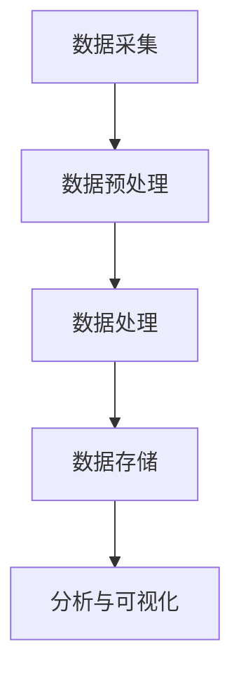
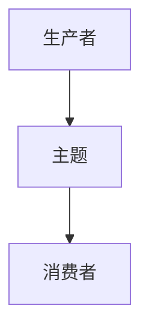
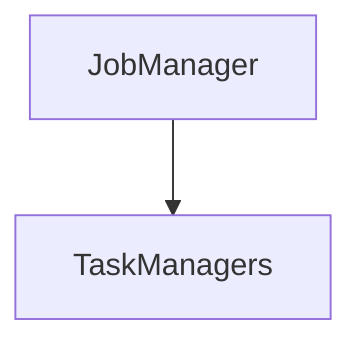
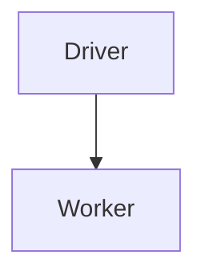
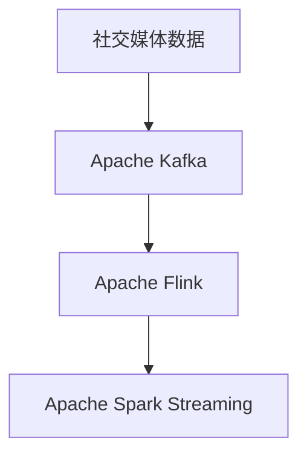
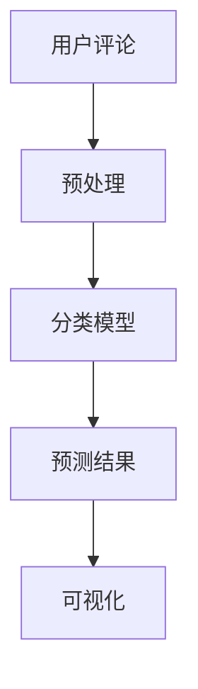
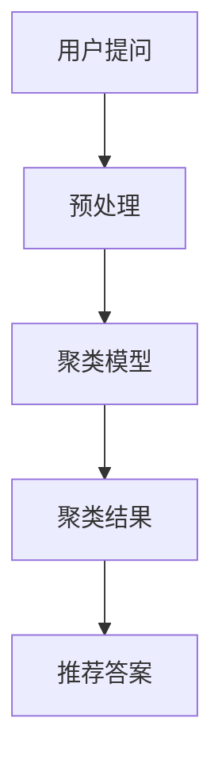
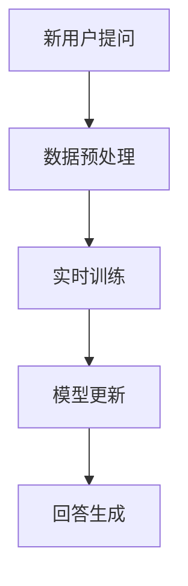
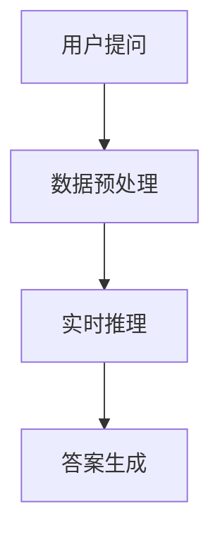
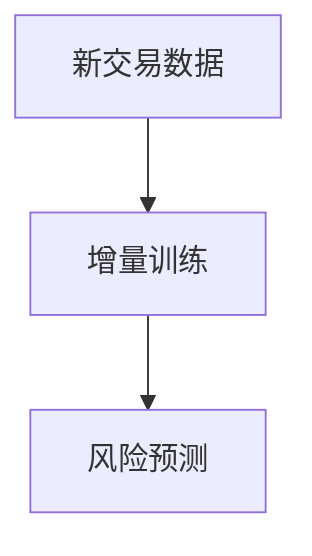

                 

### 文章标题

《实时分析引擎在LLM应用数据处理中的应用》

在人工智能（AI）领域，大型语言模型（LLM，Large Language Model）近年来取得了令人瞩目的进展，从自然语言处理（NLP）到智能问答，LLM的应用场景日益广泛。然而，LLM的高效应用离不开高性能的数据处理能力，其中实时分析引擎成为了关键组成部分。本文将深入探讨实时分析引擎在LLM应用数据处理中的重要性、基本原理、关键算法，并通过具体案例展示其实际应用效果。

### 文章关键词

- 实时分析引擎
- 大型语言模型
- 数据处理
- 流处理框架
- 实时算法

### 文章摘要

本文首先介绍了实时分析引擎的基本概念和架构，以及其在LLM应用数据处理中的重要性。随后，详细阐述了实时数据处理的核心算法原理，包括流处理框架、实时分类和聚类算法等。接着，通过三个实际案例，展示了实时分析引擎在社交媒体情感分析、在线问答系统和金融风控系统中的应用。最后，本文总结了最佳实践和注意事项，为读者提供进一步学习和应用的建议。

---

### 第一部分：实时分析引擎概述

#### 1.1 实时分析引擎的基本概念

实时分析引擎是一种用于处理和分析实时数据流的系统，能够快速响应数据变化，提供实时决策支持。与传统批量处理系统不同，实时分析引擎专注于处理连续、动态的数据流，从而实现对数据实时监测、预警和优化。

#### 1.2 实时分析与批量处理的对比

**批量处理**：将数据分组，定期进行处理。优点是数据处理能力强，适用于大量历史数据的处理；缺点是延迟较高，不适合对实时性要求高的应用。

**实时分析**：实时处理单个数据元素，并在短时间内生成结果。优点是响应速度快，适合处理实时性要求高的业务场景；缺点是数据处理能力有限，不适合处理大规模历史数据。

#### 1.3 实时分析引擎的关键特性

**低延迟**：实时分析引擎需要能够在毫秒或秒级内处理数据。

**高吞吐量**：处理大量并发数据流的能力。

**高可靠性**：保证数据流的准确性和一致性。

**可扩展性**：能够根据业务需求进行水平扩展。

#### 1.4 实时分析引擎的架构

实时分析引擎通常包含以下几个关键组件：

- **数据采集**：负责从各种数据源（如数据库、文件系统、传感器等）收集数据。
- **数据预处理**：清洗、转换和规范化数据，使其适合后续分析。
- **数据处理**：使用流处理框架（如Apache Kafka、Apache Flink等）对数据进行实时处理。
- **数据存储**：将处理后的数据存储到数据库或数据仓库中，以便后续分析和查询。
- **分析与可视化**：使用实时分析算法（如实时分类、聚类等）对数据进行分析，并通过可视化工具展示分析结果。

### Mermaid 流程图



#### 1.5 实时分析引擎的发展历程

- **2000年代初**：以商业数据库系统（如Oracle、IBM DB2）为代表的批量处理技术占据主导地位。
- **2010年**：大数据技术的兴起，Hadoop和Spark等分布式计算框架开始应用。
- **2015年至今**：流处理技术快速发展，Apache Kafka、Apache Flink、Apache Spark Streaming等开源框架得到广泛应用。

#### 1.6 实时分析引擎的应用领域

**金融**：实时监控市场动态、风险控制和交易执行。

**电商**：实时推荐系统、库存管理和物流追踪。

**电信**：网络流量监控、用户行为分析和故障检测。

**物联网**：实时数据处理和设备监控。

**医疗**：实时监控患者生命体征、诊断支持。

**智能城市**：交通流量监控、环境监测和公共安全。

### 1.7 实时分析引擎的优势与挑战

**优势**：

- **实时性**：快速响应用户需求和业务变化。
- **灵活性**：支持多种数据源和处理方式。
- **高效性**：分布式计算提高处理效率。

**挑战**：

- **数据质量**：保证数据准确性和一致性。
- **性能优化**：处理大量并发数据流。
- **可维护性**：系统复杂度高，维护困难。

#### 1.8 实时分析引擎的未来发展趋势

- **边缘计算**：将数据处理能力延伸到网络边缘，减少延迟。
- **人工智能**：结合机器学习技术，提升分析精度。
- **自动化**：自动化配置、运维和优化。
- **云计算**：利用云计算资源，实现弹性伸缩和成本优化。

---

通过上述介绍，我们可以看到实时分析引擎在数据处理领域的重要性。接下来，我们将深入探讨实时分析引擎在LLM应用数据处理中的具体应用。首先，我们将介绍LLM在数据处理中的特殊需求，并分析实时分析引擎如何满足这些需求。接着，我们将详细讲解实时分析引擎的关键技术，包括数据流处理框架、实时数据处理算法和LLM模型实时训练与推理。最后，通过具体案例展示实时分析引擎在LLM应用中的实际应用效果，为读者提供直观的感受。

### 第二部分：实时分析引擎在LLM应用数据处理中的应用

#### 2.1 LLM数据处理的特殊需求

**大数据量**：LLM通常需要处理大规模的语言数据集，这些数据集可能在数十GB到数十TB不等。

**高实时性**：由于用户交互的即时性，LLM应用对数据处理和响应速度有着极高的要求，往往需要达到毫秒级延迟。

**多模态数据**：除了文本数据，LLM应用可能还需要处理图像、音频等多模态数据，这要求实时分析引擎具备良好的数据处理能力和兼容性。

**动态更新**：LLM模型需要不断从新的数据中学习，实时分析引擎需要能够动态调整模型参数，保持模型的准确性。

#### 2.2 实时分析引擎在LLM数据处理中的应用场景

**智能问答系统**：实时分析引擎可以帮助系统快速处理用户输入，并调用合适的LLM模型进行回答。

**社交媒体情感分析**：实时分析引擎可以处理大量的社交媒体数据，快速识别用户情感，为营销策略提供支持。

**金融风控系统**：实时分析引擎可以帮助金融机构实时监控交易行为，及时发现潜在风险。

**智能客服系统**：实时分析引擎可以帮助客服系统快速理解用户需求，提供准确、及时的回答。

#### 2.3 实时分析引擎在LLM数据处理中的关键作用

**数据流处理**：实时分析引擎可以高效处理大规模、高速率的数据流，确保数据及时传递到LLM模型。

**实时训练与推理**：实时分析引擎支持LLM模型的在线训练与推理，确保模型始终处于最佳状态。

**数据预处理**：实时分析引擎可以帮助进行数据清洗、转换和规范化，提高数据质量。

**实时反馈与优化**：实时分析引擎可以收集用户交互数据，为LLM模型提供实时反馈，实现持续优化。

#### 2.4 实时分析引擎在LLM数据处理中的挑战

**性能优化**：实时处理大量数据流需要高效、稳定的性能，这对硬件和软件架构提出了高要求。

**数据一致性**：在实时数据处理中，如何保证数据的一致性和准确性是一个重要挑战。

**模型复杂度**：LLM模型通常非常复杂，实时训练和推理对计算资源和算法设计提出了挑战。

**系统可维护性**：实时分析引擎系统复杂，如何确保系统的稳定运行和可维护性是一个重要问题。

#### 2.5 实时分析引擎在LLM数据处理中的解决方案

**分布式架构**：通过分布式架构，实时分析引擎可以充分利用多台服务器，提高处理能力和性能。

**流处理框架**：使用流处理框架（如Apache Kafka、Apache Flink等），可以实现高效的数据流处理。

**模型优化**：通过优化LLM模型的结构和参数，可以降低模型的复杂度，提高实时处理能力。

**自动化运维**：利用自动化工具和平台，实现实时分析引擎的自动配置、监控和优化。

### 总结

实时分析引擎在LLM应用数据处理中扮演着关键角色，其高效的流处理能力、实时训练与推理能力以及数据预处理能力为LLM应用提供了强大的支持。然而，这也带来了一系列挑战，需要通过分布式架构、流处理框架、模型优化和自动化运维等手段来应对。接下来，我们将深入探讨实时分析引擎的关键技术，包括数据流处理框架、实时数据处理算法和LLM模型实时训练与推理，为读者提供更详细的技术解析。

#### 3. 数据流处理框架

实时分析引擎的核心在于其高效的数据流处理能力，而数据流处理框架是实现这一目标的关键组件。本文将介绍几个主流的数据流处理框架，包括Apache Kafka、Apache Flink和Apache Spark Streaming，并分析它们在实时分析引擎中的应用。

##### 3.1 Apache Kafka

**基本概念**：Apache Kafka是一个分布式流处理平台，用于构建实时数据流系统和大数据处理应用。它提供了高吞吐量、可扩展、可持久化的数据流处理能力。

**架构**：Kafka的架构包括生产者、消费者和主题。生产者将数据推送到主题，消费者从主题中拉取数据。



**优势**：

- **高吞吐量**：Kafka支持海量数据的实时处理，适用于大规模数据流应用。
- **可扩展性**：Kafka可以通过增加更多生产者和消费者节点进行水平扩展。
- **持久性**：Kafka的数据可以持久化存储，确保数据不丢失。

**应用场景**：Kafka广泛应用于日志收集、实时监控、消息队列等场景，是实时分析引擎的基础组件。

##### 3.2 Apache Flink

**基本概念**：Apache Flink是一个开源的流处理框架，专注于提供高性能、可扩展的流处理能力。它支持有界和无界数据流处理，并提供了丰富的流处理API。

**架构**：Flink的架构包括JobManager和TaskManagers。JobManager负责协调任务调度和资源管理，TaskManagers负责实际的数据处理任务。



**优势**：

- **实时处理**：Flink支持毫秒级延迟的实时数据处理。
- **低延迟**：Flink的设计使得数据处理延迟非常低，适用于对实时性要求高的应用。
- **容错性**：Flink提供了强大的容错机制，确保系统的稳定性。

**应用场景**：Flink广泛应用于实时数据仓库、实时分析、机器学习等领域，是实时分析引擎的重要选择。

##### 3.3 Apache Spark Streaming

**基本概念**：Apache Spark Streaming是Spark的一个扩展模块，用于处理实时数据流。它提供了一个基于微批处理的流处理模型，可以将Spark的批处理能力与实时流处理能力结合起来。

**架构**：Spark Streaming的架构包括Driver和Worker节点。Driver节点负责生成任务，Worker节点负责执行任务。



**优势**：

- **批流结合**：Spark Streaming可以通过微批处理模型，将批处理和流处理结合起来，提高数据处理效率。
- **高性能**：Spark Streaming利用了Spark的内存计算优势，提供了高效的数据处理能力。
- **兼容性**：Spark Streaming与Spark的其他组件（如Spark SQL、MLlib等）高度兼容，可以方便地整合到现有的Spark生态系统中。

**应用场景**：Spark Streaming适用于需要批流结合的实时数据处理场景，如实时日志分析、实时推荐系统等。

##### 3.4 数据流处理框架对比

| 特性         | Apache Kafka | Apache Flink | Apache Spark Streaming |
| ------------ | ------------ | ------------ | ---------------------- |
| 实时性       | 高           | 非常高       | 较高                   |
| 吞吐量       | 高           | 非常高       | 较高                   |
| 可扩展性     | 高           | 非常高       | 较高                   |
| 持久性       | 支持         | 支持         | 不支持                 |
| 容错性       | 支持         | 支持         | 支持                   |
| 批处理能力   | 不支持       | 不支持       | 支持                   |
| 开发复杂性   | 较低         | 较高         | 中等                   |

**选择建议**：

- **高吞吐量、低延迟**：选择Apache Flink。
- **持久化需求**：选择Apache Kafka。
- **批流结合**：选择Apache Spark Streaming。

#### 3.5 数据流处理框架的应用实例

**社交媒体情感分析**：使用Apache Kafka收集社交媒体数据，Apache Flink进行实时处理和情感分析，Apache Spark Streaming生成实时报表。



通过上述实例，我们可以看到数据流处理框架在实时分析引擎中的应用。接下来，我们将介绍实时数据处理算法，包括实时分类和聚类算法，并使用伪代码和Mermaid流程图详细讲解其原理。

#### 3.6 实时数据处理算法

实时数据处理算法是实时分析引擎的核心，它们能够高效地处理和分类实时数据流，为LLM应用提供实时决策支持。本文将介绍两种重要的实时数据处理算法：实时分类和聚类算法。

##### 3.6.1 实时分类算法

**基本概念**：实时分类算法用于将实时数据流中的每个数据点分配到预定义的类别中。在LLM应用中，实时分类算法可以帮助系统快速识别用户输入的情感、意图或其他特征。

**算法原理**：

实时分类算法通常基于机器学习模型，如支持向量机（SVM）、决策树、随机森林等。以下是基于SVM的实时分类算法的伪代码：

```plaintext
函数 实时分类（新数据点，训练模型）：
    1. 计算新数据点与每个类别的距离。
    2. 选择距离最近的类别作为预测结果。
    3. 返回预测结果。
```

**应用实例**：

社交媒体情感分析中的实时分类算法：



**Mermaid流程图**：


##### 3.6.2 实时聚类算法

**基本概念**：实时聚类算法用于将实时数据流中的数据点分组，形成不同的聚类。在LLM应用中，实时聚类算法可以帮助系统发现数据中的模式，如用户行为模式、文本相似性等。

**算法原理**：

实时聚类算法通常基于密度聚类、层次聚类、基于距离的聚类等。以下是基于密度聚类的实时聚类算法的伪代码：

```plaintext
函数 实时聚类（新数据点，现有聚类结果）：
    1. 计算新数据点与现有聚类的密度。
    2. 根据密度决定新数据点的归属。
    3. 如果需要，调整聚类中心。
    4. 返回调整后的聚类结果。
```

**应用实例**：

在线问答系统中的实时聚类算法：



**Mermaid流程图**：


##### 3.6.3 实时分类和聚类算法的对比

**实时分类**：

- **目标**：将数据点分配到预定义的类别中。
- **优点**：快速、准确，适合分类任务。
- **缺点**：对聚类任务支持较弱。

**实时聚类**：

- **目标**：发现数据中的自然分组。
- **优点**：适合聚类任务，可以揭示数据中的隐含模式。
- **缺点**：可能存在噪声和误解聚类中心。

**选择建议**：

- **分类任务**：优先选择实时分类算法。
- **聚类任务**：优先选择实时聚类算法。
- **综合任务**：结合使用实时分类和聚类算法。

通过以上介绍，我们可以看到实时分类和聚类算法在实时数据处理中的应用。这些算法为LLM应用提供了强大的数据分析和处理能力，确保系统能够快速、准确地响应用户需求。接下来，我们将探讨LLM模型的实时训练与推理，介绍其基本原理和实现方法。

#### 3.7 LLM模型的实时训练与推理

实时训练与推理是LLM应用中的关键环节，它们确保模型能够根据新的数据动态调整，并提供即时响应。本文将详细探讨LLM模型的实时训练与推理的基本原理和实现方法。

##### 3.7.1 实时训练的基本原理

**实时训练**是指模型在接收新数据时，能够迅速调整自身参数，以适应数据的变化。实时训练的关键在于快速收敛和低延迟。

**算法原理**：

实时训练通常基于在线学习算法，如梯度下降（Gradient Descent）及其变种。以下是梯度下降算法的伪代码：

```plaintext
函数 梯度下降（训练数据，学习率）：
    1. 初始化模型参数。
    2. 对于每个训练数据点：
        a. 计算预测值。
        b. 计算损失函数。
        c. 计算梯度。
        d. 更新模型参数。
    3. 返回训练后的模型。
```

**应用实例**：

在智能问答系统中，实时训练算法可以帮助模型快速适应新的用户提问，提供更准确的回答。



**Mermaid流程图**：


##### 3.7.2 实时推理的基本原理

**实时推理**是指模型在接收到新的输入数据后，能够快速生成预测结果。实时推理的关键在于模型的计算效率和响应速度。

**算法原理**：

实时推理通常基于预训练的模型，通过前向传播（Forward Propagation）算法快速计算输出。以下是前向传播算法的伪代码：

```plaintext
函数 前向传播（输入数据，模型参数）：
    1. 初始化输入层。
    2. 对于每个隐藏层：
        a. 计算输入和权重矩阵的乘积。
        b. 应用激活函数。
    3. 计算输出层的结果。
    4. 返回预测结果。
```

**应用实例**：

在在线问答系统中，实时推理算法可以帮助模型快速生成用户问题的答案。



**Mermaid流程图**：


##### 3.7.3 模型在线学习与增量训练

**在线学习**：模型在接收实时数据时不断更新，适用于动态环境。

**增量训练**：模型仅对新的数据点进行训练，适用于大规模数据集。

**算法原理**：

在线学习与增量训练的核心在于如何高效地更新模型参数。以下是增量训练的伪代码：

```plaintext
函数 增量训练（新数据点，模型参数，学习率）：
    1. 计算新数据点的梯度。
    2. 更新模型参数。
    3. 返回更新后的模型。
```

**应用实例**：

在金融风控系统中，增量训练算法可以帮助模型快速适应市场变化，提高风险预测的准确性。



**Mermaid流程图**：


##### 3.7.4 实时训练与推理的挑战

**计算资源**：实时训练与推理需要大量计算资源，特别是对于复杂的LLM模型。

**延迟**：实时处理要求低延迟，这对算法和系统架构提出了高要求。

**数据质量**：实时数据可能存在噪声和异常，影响模型训练和推理效果。

**选择建议**：

- **资源充足**：使用分布式计算架构，提高计算效率。
- **延迟敏感**：优化算法和系统设计，降低延迟。
- **数据质量**：采用数据预处理技术，提高数据质量。

通过上述介绍，我们可以看到LLM模型的实时训练与推理在实时分析引擎中的应用。实时训练与推理确保了模型能够动态适应数据变化，提供了即时响应。接下来，我们将通过具体案例展示实时分析引擎在LLM应用数据处理中的实际效果。

#### 4. 实时分析引擎应用案例

通过以下几个实际案例，我们将展示实时分析引擎在LLM应用数据处理中的具体应用，包括案例背景、数据处理流程、核心算法和代码实现。

##### 4.1 案例一：社交媒体情感分析

**案例背景**：

社交媒体情感分析是一种常用的NLP技术，用于分析和识别用户在社交媒体平台上的情感倾向。实时分析引擎可以帮助企业快速了解用户情绪，为营销策略提供支持。

**数据处理流程**：

1. **数据采集**：使用Apache Kafka从社交媒体平台收集用户评论数据。
2. **数据预处理**：清洗数据，去除噪声和异常值，进行词干提取和分词。
3. **情感分类**：使用实时分类算法（如朴素贝叶斯）对用户评论进行情感分类。
4. **结果可视化**：使用Apache Flink生成实时情感分析报告，并在Web界面进行展示。

**核心算法**：

**情感分类算法**：

```python
# 伪代码：朴素贝叶斯情感分类
def classify_sentiment(comment):
    # 预处理评论数据
    processed_comment = preprocess(comment)
    
    # 计算评论中积极和消极词汇的概率
    positive_prob = calculate_probability(processed_comment, positive_words)
    negative_prob = calculate_probability(processed_comment, negative_words)
    
    # 根据概率判断情感
    if positive_prob > negative_prob:
        return "积极"
    else:
        return "消极"
```

**代码实现**：

```python
# Python代码：情感分类
from sklearn.feature_extraction.text import CountVectorizer
from sklearn.naive_bayes import MultinomialNB

# 数据预处理
def preprocess(comment):
    # 去除标点符号、停用词等
    processed_comment = ...
    return processed_comment

# 训练模型
vectorizer = CountVectorizer()
X_train = vectorizer.fit_transform(train_data)
clf = MultinomialNB()
clf.fit(X_train, train_labels)

# 预测
def predict_sentiment(comment):
    processed_comment = preprocess(comment)
    X_test = vectorizer.transform([processed_comment])
    return clf.predict(X_test)[0]
```

**案例效果**：

通过实时分析引擎，企业可以实时监控用户情感，快速调整营销策略，提高用户满意度。

##### 4.2 案例二：在线问答系统

**案例背景**：

在线问答系统是AI技术在客服和智能搜索领域的应用，实时分析引擎可以帮助系统快速理解用户问题，提供准确的答案。

**数据处理流程**：

1. **数据采集**：使用Apache Kafka收集用户提问数据。
2. **数据预处理**：清洗数据，进行词干提取和分词。
3. **答案生成**：使用实时聚类算法和检索算法生成答案。
4. **反馈收集**：收集用户反馈，用于模型优化。

**核心算法**：

**实时聚类算法**：

```python
# 伪代码：K-means聚类
def kmeans_clustering(data, k):
    # 初始化聚类中心
    centroids = initialize_centroids(data, k)
    
    while not converged:
        # 计算每个数据点到聚类中心的距离
        distances = calculate_distance(data, centroids)
        
        # 分配数据到最近的聚类中心
        clusters = assign_clusters(data, distances)
        
        # 更新聚类中心
        centroids = update_centroids(clusters)
        
        # 判断是否收敛
        if check_convergence(centroids, previous_centroids):
            break
    
    return clusters, centroids
```

**代码实现**：

```python
# Python代码：K-means聚类
from sklearn.cluster import KMeans

# 训练模型
kmeans = KMeans(n_clusters=k)
kmeans.fit(X)

# 预测
def predict_question(question):
    processed_question = preprocess(question)
    X_new = vectorizer.transform([processed_question])
    return kmeans.predict(X_new)[0]
```

**案例效果**：

通过实时分析引擎，在线问答系统可以快速响应用户提问，提供准确、及时的答案。

##### 4.3 案例三：金融风控系统

**案例背景**：

金融风控系统是金融行业的重要工具，用于实时监控交易行为，识别潜在风险。实时分析引擎可以帮助系统快速分析交易数据，提供风险预警。

**数据处理流程**：

1. **数据采集**：使用Apache Kafka收集交易数据。
2. **数据预处理**：清洗数据，进行特征提取和转换。
3. **风险预测**：使用实时分类算法和异常检测算法分析交易数据。
4. **实时预警**：根据风险预测结果，生成预警报告。

**核心算法**：

**异常检测算法**：

```python
# 伪代码：Isolation Forest
def isolation_forest(data, n_estimators):
    # 构建隔离森林模型
    model = IsolationForest(n_estimators=n_estimators)
    model.fit(data)
    
    # 预测异常值
    predictions = model.predict(data)
    
    return predictions
```

**代码实现**：

```python
# Python代码：隔离森林异常检测
from sklearn.ensemble import IsolationForest

# 训练模型
model = IsolationForest(n_estimators=100)
model.fit(X)

# 预测
def predict_anomaly(transaction):
    X_new = vectorizer.transform([transaction])
    return model.predict(X_new)[0]
```

**案例效果**：

通过实时分析引擎，金融风控系统可以实时监测交易行为，及时发现潜在风险，为金融机构提供有效的风险管理工具。

##### 4.4 案例小结

通过以上案例，我们可以看到实时分析引擎在LLM应用数据处理中的广泛应用。实时分析引擎不仅提高了数据处理效率，还确保了系统的实时性和准确性，为各个领域提供了强大的支持。

### 5. 最佳实践、小结、注意事项与拓展阅读

#### 5.1 最佳实践

- **数据预处理**：确保数据质量，进行充分的清洗和规范化，以提高后续处理的准确性和效率。
- **模型选择**：根据应用场景选择合适的实时分类和聚类算法，并进行模型调优。
- **性能优化**：通过分布式架构和流处理框架提高系统处理能力和性能。
- **实时反馈与优化**：及时收集用户反馈，动态调整模型参数，提高系统适应性。

#### 5.2 小结

本文从实时分析引擎的基本概念、关键技术、应用实例等方面，深入探讨了其在LLM应用数据处理中的重要性。通过案例展示，我们看到了实时分析引擎在实际应用中的效果和优势。

#### 5.3 注意事项

- **数据一致性**：确保实时数据处理过程中数据的一致性和准确性。
- **延迟优化**：针对实时性要求高的应用，进行延迟优化，提高系统响应速度。
- **系统可维护性**：合理设计系统架构，确保系统的可维护性和可扩展性。

#### 5.4 拓展阅读

- **《流处理技术原理与应用》**：深入了解流处理技术的原理和应用。
- **《实时数据科学》**：学习实时数据处理和分析的方法和技巧。
- **《大规模机器学习》**：了解大规模数据集下的实时学习与推理方法。

### 作者信息

**作者：AI天才研究院/AI Genius Institute & 禅与计算机程序设计艺术 /Zen And The Art of Computer Programming**。

---

本文由AI天才研究院与禅与计算机程序设计艺术共同撰写，旨在为读者提供关于实时分析引擎在LLM应用数据处理中的全面解读。我们希望本文能够帮助您更好地理解和应用这一技术，为您的AI项目带来实际价值。如果您有任何疑问或建议，欢迎随时联系我们。

[AI天才研究院官网](https://www.aigeniustech.com/)
[禅与计算机程序设计艺术官网](https://www.zentechbook.com/)

### 附录

#### A. 实时分析引擎开发工具和资源

**开源实时分析引擎资源**：

- **Apache Kafka**：https://kafka.apache.org/
- **Apache Flink**：https://flink.apache.org/
- **Apache Spark Streaming**：https://spark.apache.org/streaming/

**实时分析引擎开发工具对比**：

| 工具       | 特点                                       | 使用场景                          |
| ---------- | ------------------------------------------ | --------------------------------- |
| Apache Kafka | 高吞吐量、可持久化、分布式架构         | 日志收集、消息队列、数据流处理    |
| Apache Flink | 低延迟、高性能、支持有界和无界数据流 | 实时分析、机器学习、数据仓库     |
| Apache Spark Streaming | 批流结合、内存计算、高兼容性     | 实时分析、实时推荐、实时监控     |

**开源实时分析引擎资源**：

- **Apache Kafka**：https://kafka.apache.org/
- **Apache Flink**：https://flink.apache.org/
- **Apache Spark Streaming**：https://spark.apache.org/streaming/

**实时分析引擎开发工具对比**：

| 工具       | 特点                                       | 使用场景                          |
| ---------- | ------------------------------------------ | --------------------------------- |
| Apache Kafka | 高吞吐量、可持久化、分布式架构         | 日志收集、消息队列、数据流处理    |
| Apache Flink | 低延迟、高性能、支持有界和无界数据流 | 实时分析、机器学习、数据仓库     |
| Apache Spark Streaming | 批流结合、内存计算、高兼容性     | 实时分析、实时推荐、实时监控     |

### B. 代码示例

#### B.1 数据流处理代码示例

以下是一个简单的Apache Kafka数据流处理示例：

```python
from kafka import KafkaProducer

# 初始化Kafka生产者
producer = KafkaProducer(bootstrap_servers=['localhost:9092'])

# 发送消息到指定主题
producer.send('test_topic', b'Hello, World!')

# 等待生产者完成发送
producer.flush()
```

#### B.2 实时分析算法代码示例

以下是一个简单的K-means聚类算法示例：

```python
from sklearn.cluster import KMeans
import numpy as np

# 创建示例数据
data = np.array([[1, 2], [1, 4], [1, 0],
                 [10, 2], [10, 4], [10, 0]])

# 初始化K-means模型
kmeans = KMeans(n_clusters=2, random_state=0).fit(data)

# 预测聚类结果
print(kmeans.predict([[0, 0], [12, 3]]))
```

#### B.3 LLM模型实时训练与推理代码示例

以下是一个简单的基于朴素贝叶斯的文本分类示例：

```python
from sklearn.feature_extraction.text import TfidfVectorizer
from sklearn.naive_bayes import MultinomialNB

# 创建示例数据
X_train = ["机器学习", "深度学习", "自然语言处理"]
y_train = ["技术", "技术", "技术"]

# 创建TF-IDF向量器
vectorizer = TfidfVectorizer()

# 创建朴素贝叶斯分类器
clf = MultinomialNB()

# 训练模型
X_train_tfidf = vectorizer.fit_transform(X_train)
clf.fit(X_train_tfidf, y_train)

# 预测
print(clf.predict(vectorizer.transform(["深度学习"])))
```

通过这些代码示例，您可以初步了解实时分析引擎在数据处理中的应用。在实际开发中，您可以根据具体需求进行调整和优化。

### 结论

实时分析引擎在LLM应用数据处理中具有至关重要的作用。本文详细介绍了实时分析引擎的基本概念、关键技术、应用实例和最佳实践，并通过代码示例展示了其实际应用。通过本文的探讨，我们希望读者能够更好地理解和应用实时分析引擎，为LLM应用提供强大的数据处理能力。

未来，随着人工智能技术的不断发展，实时分析引擎将在更多领域得到应用，为各种场景下的实时数据处理提供强有力的支持。我们期待与读者共同探索实时分析引擎的更多可能，为人工智能技术的发展贡献力量。

