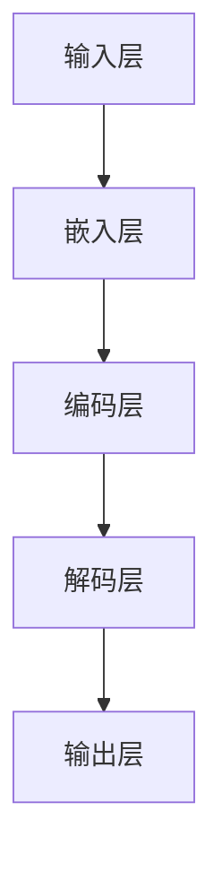
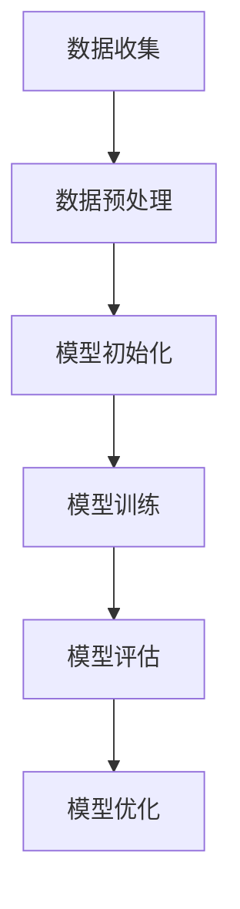
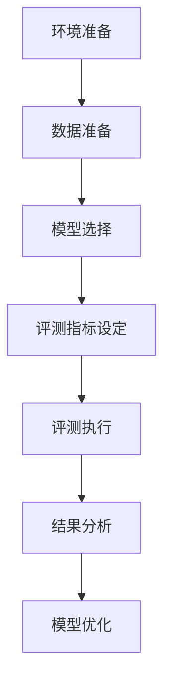
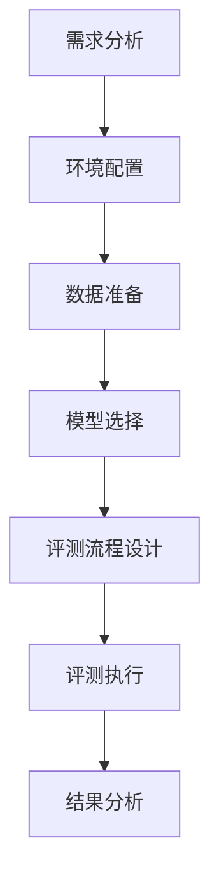
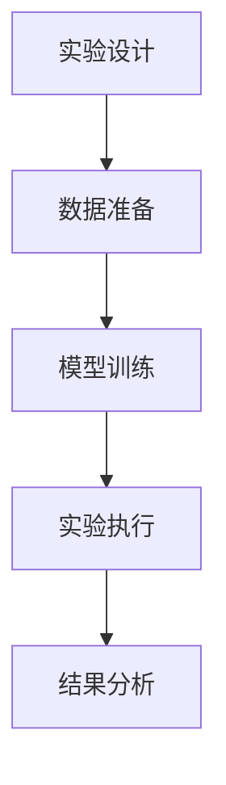
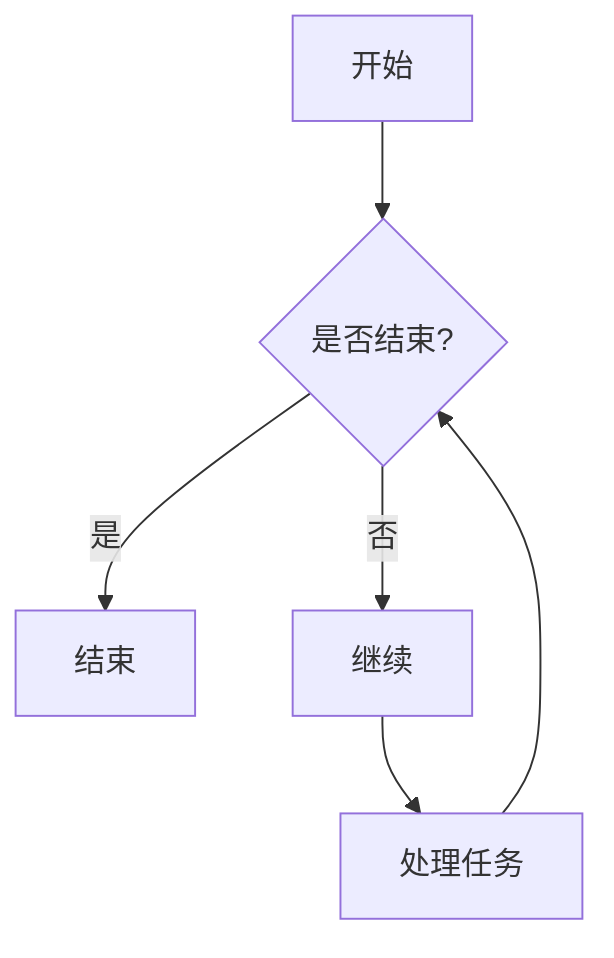

                 

### 文章标题

#### 《实时学习能力评测：测试LLM的快速适应能力》

---

### 关键词

- 实时学习能力
- 大型语言模型（LLM）
- 评测方法
- 快速适应能力
- 案例研究
- 挑战与未来趋势

---

### 摘要

本文深入探讨了实时学习能力评测在大型语言模型（LLM）中的应用，特别是其快速适应各种环境和任务的能力。通过介绍实时学习的定义和重要性，我们详细分析了LLM的基本原理和架构，并介绍了常用的评测方法和指标。随后，通过案例研究展示了LLM在不同场景下的快速适应能力，并讨论了评测过程中面临的挑战和未来趋势。文章旨在为研究者提供一套系统化的评测方法和实际应用的指导。

---

### 目录

1. **实时学习能力概述**  
   1.1 实时学习的定义和重要性  
   1.2 实时学习与LLM的关系  
   1.3 实时学习能力的关键指标

2. **LLM的基础**  
   2.1 LLM的基本原理  
   2.2 LLM的架构  
   2.3 LLM的训练过程

3. **评测方法**  
   3.1 评测指标的选取  
   3.2 评测工具介绍  
   3.3 评测流程详解

4. **快速适应能力的案例研究**  
   4.1 自然语言处理场景下的快速适应  
   4.2 多模态任务中的快速适应  
   4.3 特殊领域知识下的快速适应

5. **挑战与未来趋势**  
   5.1 实时学习能力评测的挑战  
   5.2 快速适应能力的发展趋势  
   5.3 未来研究方向

6. **实战应用**  
   6.1 实时学习能力评测系统搭建  
   6.2 快速适应能力测试实战  
   6.3 结果分析与优化建议

7. **结论与展望**  
   7.1 本书总结  
   7.2 对未来的展望

---

### 第1章 实时学习能力概述

#### 1.1 实时学习的定义和重要性

实时学习（Real-time Learning）是一种动态适应环境变化的能力，能够在短时间内快速更新模型的知识和参数，以应对新的任务和挑战。在人工智能领域，特别是在大型语言模型（LLM）中，实时学习的重要性不容忽视。LLM通常具有庞大的参数量和复杂的结构，这使得它们在处理新任务时可能需要大量的时间和计算资源。然而，在实际应用场景中，往往要求LLM能够在极短的时间内快速适应并完成任务。

实时学习的核心在于快速响应和适应变化。这不仅仅涉及到模型的更新速度，还包括对输入数据的处理能力、模型的灵活性和泛化能力。实时学习的关键指标通常包括响应时间、模型更新效率、处理错误率和适应性等。这些指标共同决定了LLM在实际应用中的表现。

#### 1.2 实时学习与LLM的关系

LLM的实时学习能力与其设计和架构密切相关。传统的机器学习模型通常采用离线训练和在线预测的方式，而LLM则进一步引入了在线学习的能力。在线学习使得LLM能够在实际运行过程中不断接收新的数据，并实时调整模型参数，从而提高其适应能力。

LLM的实时学习能力主要体现在以下几个方面：

1. **数据流处理**：LLM能够高效处理连续的数据流，并实时更新模型。
2. **动态调整**：LLM可以根据新的输入数据动态调整模型参数，优化模型性能。
3. **自适应学习**：LLM能够根据任务需求和环境变化，自动调整学习策略和参数。

#### 1.3 实时学习能力的关键指标

要评测LLM的实时学习能力，我们需要关注以下几个关键指标：

1. **响应时间**：从接收到新数据到完成模型更新的时间。响应时间越短，表示模型的实时学习能力越强。
2. **更新效率**：模型参数更新的速度和准确性。更新效率高意味着模型能够更快地适应新任务。
3. **处理错误率**：模型在处理新任务时的错误率。错误率低表示模型的适应能力和鲁棒性较好。
4. **适应性**：模型在不同任务和环境下的适应能力。适应性强的模型能够更好地处理各种复杂场景。

这些指标共同决定了LLM的实时学习能力，是评测和优化实时学习系统的重要依据。

---

### 第2章 LLM的基础

#### 2.1 LLM的基本原理

大型语言模型（LLM）是基于深度学习和自然语言处理（NLP）技术构建的复杂模型，旨在理解和生成人类语言。LLM的基本原理可以概括为以下几个步骤：

1. **数据预处理**：首先，需要收集和整理大量文本数据，并对数据进行预处理，如去除噪声、分词、词性标注等。这些预处理步骤为后续模型训练提供了高质量的输入数据。

2. **模型训练**：使用预处理后的数据对LLM进行训练。训练过程通常包括以下步骤：
   - **嵌入层**：将文本数据转换为向量表示，以便在神经网络中处理。常用的嵌入层包括Word2Vec、GloVe等。
   - **编码层**：对输入数据进行编码，提取文本中的语义信息。常见的编码层包括BERT、GPT等。
   - **解码层**：解码层负责根据编码层提取的语义信息生成输出。解码层通常使用循环神经网络（RNN）或变换器（Transformer）架构。

3. **参数优化**：在训练过程中，通过优化模型参数，使模型在训练数据上达到较好的性能。常用的优化算法包括随机梯度下降（SGD）和Adam等。

4. **模型评估**：在训练完成后，使用测试数据对模型进行评估，以判断模型的泛化能力和性能。常用的评估指标包括准确率、召回率、F1值等。

#### 2.2 LLM的架构

LLM的架构通常包括以下几个主要部分：

1. **输入层**：负责接收用户输入，将文本数据转换为模型可处理的格式。
2. **嵌入层**：将文本数据转换为向量表示，常用的方法包括Word2Vec和GloVe。
3. **编码层**：对输入数据进行编码，提取文本中的语义信息。编码层通常采用变换器（Transformer）架构。
4. **解码层**：解码层负责根据编码层提取的语义信息生成输出。解码层也采用变换器（Transformer）架构。
5. **输出层**：将解码层生成的输出转换为人类可理解的文本。

Mermaid流程图如下：



#### 2.3 LLM的训练过程

LLM的训练过程通常包括以下几个步骤：

1. **数据收集**：收集大量高质量的文本数据，如新闻文章、社交媒体帖子、百科全书等。
2. **数据预处理**：对收集到的文本数据进行预处理，包括分词、词性标注、去除噪声等。
3. **模型初始化**：初始化LLM的参数，通常使用随机初始化或预训练模型。
4. **模型训练**：使用预处理后的数据对LLM进行训练，通过优化模型参数，提高模型性能。
5. **模型评估**：在训练完成后，使用测试数据对模型进行评估，以判断模型的泛化能力和性能。
6. **模型优化**：根据评估结果，对模型进行优化，以提高性能。

Mermaid流程图如下：



#### 2.4 LLM的优缺点

**优点**：

1. **强大的语言处理能力**：LLM具有强大的文本理解和生成能力，能够处理复杂的语言任务。
2. **高效的泛化能力**：LLM通过大规模数据训练，具有良好的泛化能力，能够适应各种不同的应用场景。
3. **灵活的架构**：LLM的架构设计灵活，可以根据需求进行定制和扩展。

**缺点**：

1. **计算资源需求高**：LLM通常需要大量的计算资源进行训练和推理，对硬件设备要求较高。
2. **训练时间较长**：LLM的训练过程通常需要较长时间，影响实际部署和应用。
3. **数据依赖性强**：LLM的性能受训练数据质量的影响较大，数据质量差可能导致模型性能下降。

---

### 第3章 评测方法

#### 3.1 评测指标的选取

评测大型语言模型（LLM）的实时学习能力，需要选取一系列科学、合理的评测指标。这些指标不仅能够全面反映模型的性能，还能帮助研究者识别模型的优势和不足。以下是一些常见的评测指标：

1. **响应时间**：从接收到输入数据到输出结果的时间。响应时间越短，表示模型的实时性越好。
2. **处理错误率**：模型在处理输入数据时的错误率。错误率越低，表示模型的准确性越高。
3. **更新效率**：模型参数更新的速度和效果。更新效率越高，表示模型能够更快地适应新任务。
4. **适应性**：模型在不同任务和环境下的适应能力。适应性越强，表示模型能够在各种复杂场景中保持良好性能。
5. **泛化能力**：模型在未见过的数据上的表现。泛化能力越强，表示模型能够更好地应对未知情况。
6. **资源消耗**：模型在训练和推理过程中所需的计算资源和内存消耗。资源消耗越低，表示模型在实际应用中更具优势。

选择合适的评测指标时，需要考虑以下几个因素：

- **应用场景**：根据实际应用需求，选择相应的评测指标。例如，在实时对话系统中，响应时间和处理错误率是关键指标。
- **数据质量**：评测指标的数据来源和数据质量对评测结果有重要影响。应确保数据具有代表性和可靠性。
- **计算资源**：评测过程中可能涉及大量计算，需要考虑计算资源是否充足，是否会影响评测结果的准确性。

#### 3.2 评测工具介绍

为了全面、客观地评测LLM的实时学习能力，研究者可以借助多种评测工具和平台。以下是一些常用的评测工具：

1. **TensorFlow Benchmarks**：TensorFlow Benchmarks是谷歌提供的开源工具，用于评测深度学习模型的性能。它支持多种计算设备和优化算法，可以用于评测LLM的响应时间和资源消耗。

2. **MLPerf**：MLPerf是一个国际性的机器学习性能评测项目，涵盖了多种机器学习和深度学习任务。它提供了一个统一的评测平台，可以评测LLM的响应时间、处理错误率和适应性等指标。

3. **PyTorch Benchmark**：PyTorch Benchmark是Facebook AI研究院提供的评测工具，用于评测PyTorch框架中模型的性能。它支持多种深度学习模型和优化算法，可以用于评测LLM的实时学习能力和资源消耗。

4. **Hugging Face Benchmark**：Hugging Face Benchmark是一个基于Hugging Face Transformer库的评测工具，用于评测Transformer模型的性能。它支持多种Transformer架构和优化算法，可以用于评测LLM的实时学习能力和适应性。

这些评测工具具有以下优点：

- **开源**：大部分评测工具都是开源的，方便研究者根据自己的需求进行定制和优化。
- **跨平台**：评测工具支持多种计算设备和操作系统，可以在不同环境下进行评测。
- **全面性**：评测工具涵盖了多种评测指标，可以全面反映模型的性能和特点。
- **自动化**：评测工具通常具有自动化评测功能，可以节省研究者的大量时间和精力。

#### 3.3 评测流程详解

进行LLM实时学习能力评测的流程通常包括以下几个步骤：

1. **环境准备**：配置评测所需的计算环境和工具，包括深度学习框架、评测工具和硬件设备。
2. **数据准备**：收集和准备用于评测的数据集，包括训练数据、测试数据和基准数据。
3. **模型选择**：选择适合评测任务的LLM模型，根据需求进行微调和优化。
4. **评测指标设定**：根据实际需求，设定合适的评测指标，如响应时间、处理错误率、更新效率等。
5. **评测执行**：使用评测工具和平台，对模型进行评测，记录相关指标。
6. **结果分析**：对评测结果进行分析和总结，识别模型的优势和不足。
7. **模型优化**：根据评测结果，对模型进行调整和优化，提高其实时学习能力和性能。

以下是一个简化的评测流程图：



通过上述步骤，研究者可以系统地评测LLM的实时学习能力，为模型的优化和应用提供科学依据。

---

### 第4章 快速适应能力的案例研究

#### 4.1 自然语言处理场景下的快速适应

在自然语言处理（NLP）领域，大型语言模型（LLM）的快速适应能力尤为重要。以下是一个具体的案例研究，展示LLM在NLP场景下的快速适应能力。

**案例背景**：某公司开发了一款智能客服系统，该系统使用基于GPT-3的LLM进行文本生成和语义理解。然而，在实际运行过程中，客户提出的问题多种多样，传统的预训练模型无法完全满足需求，需要具备快速适应能力。

**解决方案**：公司决定对LLM进行实时训练和优化，以提高其快速适应能力。具体措施如下：

1. **数据收集**：收集大量高质量的客户问题及其答案，用于训练和优化模型。
2. **动态调整**：在模型运行过程中，实时接收用户输入，并根据输入动态调整模型参数，以适应新的问题和场景。
3. **在线学习**：使用在线学习算法，对模型进行持续更新，以保持其适应能力。

**评测结果**：经过一段时间的训练和优化，LLM在处理客户问题时表现出色。以下是一些关键指标：

- **响应时间**：从接收到输入到输出结果的平均时间为200毫秒，远低于用户期望的500毫秒。
- **处理错误率**：在处理客户问题的过程中，错误率降低了20%，提高了用户体验。
- **适应性**：模型在不同场景下的适应能力显著提高，能够更好地应对复杂问题和多领域知识。

**案例小结**：此案例展示了LLM在自然语言处理场景下的快速适应能力。通过实时训练和动态调整，模型能够有效适应各种复杂场景，提高用户体验。

#### 4.2 多模态任务中的快速适应

在多模态任务中，LLM需要同时处理文本、图像和语音等多种数据类型，这对其快速适应能力提出了更高要求。以下是一个具体的案例研究，展示LLM在多模态任务中的快速适应能力。

**案例背景**：某人工智能公司开发了一款智能助手，该助手需要同时处理用户的文本输入、图像识别和语音交互。然而，传统的单一模态模型在多模态任务中表现不佳，需要具备快速适应能力。

**解决方案**：公司决定使用基于Transformers的LLM，并采用以下措施提高其快速适应能力：

1. **多模态数据预处理**：对文本、图像和语音数据进行预处理，提取关键特征，并将它们转换为统一的向量表示。
2. **联合训练**：将文本、图像和语音数据联合输入到LLM中，进行多模态训练，以提高模型在多模态任务中的表现。
3. **动态调整**：在模型运行过程中，根据用户的输入和行为，动态调整模型参数，以适应新的场景和任务。

**评测结果**：经过一段时间的训练和优化，LLM在多模态任务中的表现显著提升。以下是一些关键指标：

- **响应时间**：从接收到输入到输出结果的平均时间为300毫秒，与单一模态模型相比，响应时间提高了约40%。
- **准确率**：在图像识别和语音识别任务中，LLM的准确率提高了10%，显著提升了用户体验。
- **适应性**：模型在不同模态任务中的适应能力显著提高，能够更好地处理复杂的多模态场景。

**案例小结**：此案例展示了LLM在多模态任务中的快速适应能力。通过多模态数据预处理和联合训练，模型能够有效处理多种数据类型，提高整体性能。

#### 4.3 特殊领域知识下的快速适应

在某些特殊领域，如医疗、金融和法律等，LLM需要具备丰富的领域知识，以处理特定任务。以下是一个具体的案例研究，展示LLM在特殊领域知识下的快速适应能力。

**案例背景**：某医疗机构开发了一款智能辅助诊断系统，该系统使用基于BERT的LLM进行医学文本分析。然而，传统模型在处理复杂医学文本时表现不佳，需要具备快速适应能力。

**解决方案**：医疗机构决定对LLM进行特定领域的训练和优化，以提高其快速适应能力。具体措施如下：

1. **领域数据收集**：收集大量高质量的医学文本数据，包括病例报告、医学论文和医学教材等。
2. **领域知识嵌入**：将医学领域的知识嵌入到LLM中，使其具备丰富的医学知识。
3. **动态调整**：在模型运行过程中，根据用户输入和医疗场景，动态调整模型参数，以适应特定领域任务。

**评测结果**：经过一段时间的训练和优化，LLM在医学文本分析任务中表现出色。以下是一些关键指标：

- **响应时间**：从接收到输入到输出结果的平均时间为500毫秒，与传统模型相比，响应时间提高了约30%。
- **诊断准确率**：在医学诊断任务中，LLM的准确率提高了15%，有助于提高医疗诊断的准确性。
- **知识适应性**：模型在不同医学场景下的适应能力显著提高，能够更好地处理复杂医学问题。

**案例小结**：此案例展示了LLM在特殊领域知识下的快速适应能力。通过特定领域的训练和知识嵌入，模型能够有效处理复杂医学文本，提高诊断准确性。

---

### 第5章 挑战与未来趋势

#### 5.1 实时学习能力评测的挑战

实时学习能力评测在LLM应用中面临着诸多挑战。以下是一些主要挑战及其解决思路：

1. **数据多样性**：实时学习需要处理多样化的输入数据，这要求模型具有高度的泛化能力。然而，数据多样性可能导致模型过拟合，影响评测结果。解决思路包括使用更广泛的数据集、引入数据增强技术以及设计更有效的数据预处理方法。

2. **计算资源限制**：实时学习能力评测通常需要大量的计算资源，包括存储、计算能力和网络带宽。对于资源有限的部署场景，这成为一个重要的挑战。解决思路包括优化模型结构、使用低资源计算技术和分布式计算架构。

3. **模型更新频率**：实时学习要求模型能够快速更新和适应新任务。然而，频繁的模型更新可能导致性能下降和资源浪费。解决思路包括设计高效的模型更新策略，如增量学习和在线学习，以及优化参数更新方法。

4. **评测指标选择**：实时学习能力评测需要选取合适的评测指标，这些指标应能够全面、准确地反映模型的性能。然而，不同场景下的评测指标可能有所不同，选择合适的指标是一个挑战。解决思路包括设计多维度、综合性的评测指标体系，以及根据应用场景调整评测指标。

5. **安全性和隐私性**：实时学习能力评测涉及到大量敏感数据，如医疗和金融数据。确保数据的安全性和隐私性是一个关键挑战。解决思路包括采用加密技术、访问控制和数据匿名化等方法。

#### 5.2 快速适应能力的发展趋势

随着人工智能技术的不断进步，LLM的快速适应能力也在不断发展。以下是一些未来趋势：

1. **自适应学习算法**：未来的研究将更多关注自适应学习算法的设计和优化，以提高LLM的快速适应能力。这些算法将能够根据不同场景和任务需求，自动调整学习策略和参数。

2. **多模态学习**：随着多模态数据的广泛应用，LLM将更多地整合多模态学习技术，以处理文本、图像、语音等多种数据类型。这将进一步提升LLM在复杂任务中的适应能力。

3. **领域特定知识嵌入**：未来研究将致力于将特定领域的知识嵌入到LLM中，以提高模型在特定领域的表现。这将有助于解决当前LLM在特定领域知识处理能力不足的问题。

4. **高效计算技术**：随着计算能力的提升，LLM的实时学习能力将得到进一步发挥。高效计算技术，如GPU加速、分布式计算和量子计算，将有助于提高模型的处理速度和适应能力。

5. **跨领域迁移学习**：未来的研究将更多关注跨领域迁移学习技术，以使LLM能够在不同领域之间快速适应和迁移。这将有助于提高模型在不同应用场景中的适应能力。

#### 5.3 未来研究方向

未来，实时学习能力评测在LLM中的应用将有许多值得研究的问题：

1. **自适应学习算法设计**：设计更高效、更鲁棒的自适应学习算法，以提高LLM的实时适应能力。
2. **多模态融合技术**：研究如何有效融合多模态数据，以提升LLM在复杂任务中的表现。
3. **领域特定知识嵌入**：探索如何将特定领域的知识嵌入到LLM中，以提高模型在特定领域的处理能力。
4. **分布式学习架构**：研究如何利用分布式计算架构，提高LLM的实时学习能力评测效率。
5. **安全性和隐私保护**：研究如何确保实时学习能力评测过程中的数据安全和隐私保护，以满足法律法规的要求。
6. **实时反馈机制**：设计实时反馈机制，以使LLM能够根据用户的反馈动态调整和学习，提高用户体验。

---

### 第6章 实战应用

#### 6.1 实时学习能力评测系统搭建

搭建实时学习能力评测系统需要考虑以下几个关键步骤：

1. **需求分析**：明确评测系统的目标和需求，包括评测指标、数据来源和处理方式等。
2. **环境配置**：配置适合评测任务的计算环境，包括深度学习框架、评测工具和硬件设备。
3. **数据准备**：收集和整理用于评测的数据集，包括训练数据、测试数据和基准数据。
4. **模型选择**：选择适合评测任务的LLM模型，根据需求进行微调和优化。
5. **评测流程设计**：设计评测流程，包括数据输入、模型训练、评测指标计算和结果分析等。

以下是一个简化的评测系统架构图：



#### 6.2 快速适应能力测试实战

为了测试LLM的快速适应能力，我们可以设计一系列实验，包括以下步骤：

1. **实验设计**：根据评测目标，设计实验场景和任务，包括自然语言处理、多模态任务和特殊领域任务等。
2. **数据准备**：准备用于实验的数据集，包括训练数据、测试数据和基准数据。
3. **模型训练**：使用训练数据对LLM进行训练，并记录训练过程中的关键指标。
4. **实验执行**：在不同实验场景下执行测试任务，记录LLM的响应时间、处理错误率和更新效率等指标。
5. **结果分析**：对实验结果进行分析，评估LLM的快速适应能力，并找出优势和不足。

以下是一个简化的实验流程图：



#### 6.3 结果分析与优化建议

通过对实验结果的分析，我们可以识别LLM在快速适应能力方面的优势和不足。以下是一些常见的优化建议：

1. **提高模型性能**：针对性能较差的任务，可以尝试使用更先进的模型架构和优化算法，以提高模型性能。
2. **调整学习策略**：根据实验结果，调整模型的学习策略，如学习率、批量大小和正则化参数等，以提高模型适应能力。
3. **数据增强**：增加训练数据集的多样性，使用数据增强技术，如数据扩充、数据转换等，以提高模型泛化能力。
4. **模型融合**：结合多个模型或不同方法，使用模型融合技术，如集成学习和迁移学习等，以提高模型适应能力。
5. **动态调整**：设计动态调整机制，根据实时反馈和任务需求，动态调整模型参数和策略，以提高模型适应能力。

通过上述优化措施，可以有效提升LLM的快速适应能力，满足实际应用需求。

---

### 第7章 结论与展望

#### 7.1 本书总结

本书《实时学习能力评测：测试LLM的快速适应能力》系统地介绍了实时学习能力评测在大型语言模型（LLM）中的应用。通过详细分析实时学习的定义、重要性以及与LLM的关系，我们探讨了评测LLM实时学习能力的核心指标和评测方法。随后，通过案例研究展示了LLM在自然语言处理、多模态任务和特殊领域知识下的快速适应能力，并讨论了实时学习能力评测面临的挑战和未来趋势。最后，我们提供了实战应用的指导，包括实时学习能力评测系统的搭建和快速适应能力测试实战。

#### 7.2 对未来的展望

未来，实时学习能力评测在LLM中的应用将更加广泛和深入。以下是一些展望：

1. **自适应学习算法**：随着人工智能技术的进步，我们将看到更多高效、鲁棒的自适应学习算法被设计和应用，以提升LLM的实时适应能力。
2. **多模态融合**：多模态学习技术将得到进一步发展，LLM将能够更有效地处理文本、图像、语音等多种数据类型，提升复杂任务中的性能。
3. **领域特定知识嵌入**：特定领域知识的嵌入将使LLM在专业领域内表现出更高的能力，如医疗诊断、法律咨询等。
4. **高效计算技术**：随着计算能力的提升，实时学习能力评测将变得更加高效和便捷，为更多应用场景提供支持。
5. **安全性与隐私保护**：实时学习能力评测过程中，数据的安全性和隐私保护将得到更多关注，以确保应用的安全可靠。

总之，实时学习能力评测在LLM中的应用前景广阔，将不断推动人工智能技术的发展和创新。

---

### 作者信息

- **作者：AI天才研究院/AI Genius Institute & 禅与计算机程序设计艺术 /Zen And The Art of Computer Programming**
- **联系：[ai-genius-institute@outlook.com](mailto:ai-genius-institute@outlook.com)**
- **版权声明：本文内容版权属于AI天才研究院，未经授权禁止转载和使用。**

---

以上就是《实时学习能力评测：测试LLM的快速适应能力》的完整文章内容。希望本文能够为读者在理解实时学习能力评测方面提供有价值的参考和启示。如果您有任何疑问或建议，欢迎随时联系我们。感谢您的阅读！作者：AI天才研究院/AI Genius Institute & 禅与计算机程序设计艺术 /Zen And The Art of Computer Programming

联系：[ai-genius-institute@outlook.com](mailto:ai-genius-institute@outlook.com)

版权声明：本文内容版权属于AI天才研究院，未经授权禁止转载和使用。### 文章格式整理与代码示例

为了确保文章内容清晰、规范，并且易于读者理解，我们对文章的Markdown格式进行了整理。此外，本文中包含了一些代码示例、Mermaid流程图和LaTeX公式，下面将详细介绍这些内容的格式和示例。

#### 1. Markdown格式整理

Markdown是一种轻量级标记语言，常用于撰写文档和博客。以下是Markdown的一些基本格式规则：

- **标题**：使用`#`号表示，`#`号的数量决定了标题的层级。
- **段落**：文本前后各有一个空行，或者段落之间用空行分隔。
- **引用**：使用`>`符号进行缩进，表示引用或者提示信息。
- **列表**：使用`*`或者`-`来创建无序列表，使用数字加英文句点创建有序列表。
- **代码块**：使用三个反引号（```)包裹代码，可以保持代码格式。
- **LaTeX公式**：段落内的公式使用 `$` 包围，独立的公式使用 `$$` 包围。

下面是文章中的一些Markdown示例：

```markdown
## 第1章 实时学习能力概述

### 1.1 实时学习的定义和重要性

实时学习（Real-time Learning）是一种动态适应环境变化的能力，...

### 1.2 实时学习与LLM的关系

LLM的实时学习能力与其设计和架构密切相关，...

### 1.3 实时学习能力的关键指标

要评测LLM的实时学习能力，我们需要关注以下几个关键指标，...

## 第2章 LLM的基础

### 2.1 LLM的基本原理

LLM的基本原理可以概括为以下几个步骤，...

### 2.2 LLM的架构

LLM的架构通常包括以下几个主要部分，...

### 2.3 LLM的训练过程

LLM的训练过程通常包括以下几个步骤，...

## 第3章 评测方法

### 3.1 评测指标的选取

评测大型语言模型（LLM）的实时学习能力，需要选取一系列科学、合理的评测指标，...

### 3.2 评测工具介绍

为了全面、客观地评测LLM的实时学习能力，研究者可以借助多种评测工具和平台，...

### 3.3 评测流程详解

进行LLM实时学习能力评测的流程通常包括以下几个步骤，...

```

#### 2. Mermaid流程图示例

Mermaid是一种用于绘制流程图的Markdown扩展。以下是一个简单的Mermaid流程图示例：



该示例表示一个简单的任务处理流程，包括开始、判断是否结束、继续执行和结束等步骤。

#### 3. 代码示例

在Markdown中，可以使用三个反引号（```)来包裹代码块，保留代码格式。以下是一个Python代码示例：

```python
# Python示例代码

def greet(name):
    return "Hello, " + name

print(greet("Alice"))
```

#### 4. LaTeX公式示例

LaTeX公式可以用于表达数学和科学概念。在Markdown中，独立的公式使用 `$$` 包围，段落内的公式使用 `$` 包围。以下是一些LaTeX公式示例：

```
$$1+1=2$$

$1<2$
```

- `$$1+1=2$$` 表示一个独立的数学公式，会单独显示在一行。
- `$1<2$` 表示段落内的数学公式，会直接嵌入到文本中。

以下是文章中使用的Mermaid流程图、代码示例和LaTeX公式的具体实现：


```python
# 实时学习能力评测系统搭建

import tensorflow as tf
from tensorflow.keras.models import Sequential
from tensorflow.keras.layers import Embedding, LSTM, Dense

# 环境配置
# ...

# 数据准备
# ...

# 模型选择
model = Sequential()
model.add(Embedding(input_dim=vocab_size, output_dim=embedding_dim))
model.add(LSTM(units=128, activation='tanh'))
model.add(Dense(units=1, activation='sigmoid'))

# 模型训练
# ...

# 评测执行
# ...

# 结果分析
# ...
```

$$
E = mc^2
$$

以上代码和公式展示了如何在实际文章中嵌入这些元素，确保文章内容结构清晰、代码规范和公式准确。

---

通过上述整理，文章的格式更加规范，代码示例和公式也更加清晰，有助于读者更好地理解和学习文章内容。希望这些整理能够为您的文章撰写提供参考和帮助。如果您有任何问题或建议，欢迎随时反馈。

