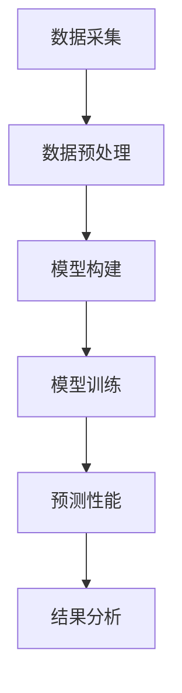

                 

### 设计实时性能预测：LLM驱动的评测结果趋势分析

随着现代技术的发展，实时性能预测在各个领域的重要性日益凸显。从工业制造到金融服务，从智能交通到在线教育，实时性能预测不仅能够提升系统运行效率，还能够提前预警潜在问题，从而避免不必要的损失。在这篇文章中，我们将探讨如何利用语言模型（LLM）来驱动实时性能预测，并对其评测结果趋势进行分析。

关键词：实时性能预测、语言模型（LLM）、评测结果趋势分析、系统优化、性能评估。

摘要：本文将首先介绍实时性能预测的背景及其重要性。随后，我们将深入探讨语言模型的基本原理，并阐述其在实时性能预测中的应用。接着，我们将详细讨论实时性能数据采集与处理的方法，并展示如何使用LLM来分析评测结果的趋势。最后，我们将通过案例分析来展示实时性能预测的实际应用，并总结全文，展望未来的发展趋势和挑战。

## 引言

### 书籍背景与目标

在现代信息技术飞速发展的背景下，实时性能预测已经成为提高系统效率和响应速度的关键技术。随着人工智能和机器学习技术的不断进步，传统的性能评估方法逐渐难以满足日益复杂的应用需求。语言模型（LLM），作为一种强大的自然语言处理工具，已经在诸多领域展现出其卓越的能力。本文旨在探讨如何将LLM应用于实时性能预测，并对其评测结果趋势进行分析。

### 实时性能预测的重要性

实时性能预测在许多关键领域具有至关重要的意义。在金融领域，准确的性能预测可以帮助银行和金融机构更好地管理风险，优化交易策略。在工业制造中，实时性能预测可以用于预测设备故障，提高生产线的可靠性。在智能交通领域，实时性能预测可以用于交通流量预测，优化交通信号控制，减少拥堵。总之，实时性能预测不仅能够提高系统的运行效率，还能够提前预警潜在问题，从而避免不必要的损失。

### 本书结构安排与读者对象

本文将分为七个章节，从基础概念到实际应用，全面探讨实时性能预测和LLM的融合。第一章将介绍实时性能预测的背景和重要性。第二章将详细阐述实时性能预测的基础知识。第三章将深入探讨LLM的基本原理及其在实时性能预测中的应用。第四章将讨论实时性能数据的采集与处理方法。第五章将展示如何利用LLM分析评测结果的趋势。第六章将通过案例分析来展示实时性能预测的实际应用。第七章将总结全文，并展望未来的发展趋势和挑战。

本文的目标读者是从事信息技术、人工智能和机器学习领域的科研人员、工程师以及学生，特别是那些对实时性能预测和LLM技术感兴趣的人。通过本文的阅读，读者将能够深入了解实时性能预测的基本原理和应用方法，并掌握如何利用LLM来提升性能预测的准确性和效率。

### 实时性能预测基础

#### 性能预测概述

性能预测是指通过历史数据和当前信息来预测系统的未来性能表现。这种预测对于系统优化和故障预警具有重要意义。在传统的性能预测方法中，常见的技术包括统计分析、机器学习和深度学习等。然而，随着系统复杂性的增加，传统方法逐渐难以满足实时性要求。

#### 实时系统的基本概念

实时系统是一种能够在特定时间内完成特定任务的系统。实时系统的特点是其对响应时间的高要求。在实时系统中，性能预测的准确性直接影响到系统的稳定性和可靠性。因此，如何快速、准确地预测实时系统的性能成为研究的热点。

#### 性能指标与性能评估方法

性能指标是衡量系统性能的标准，常见的性能指标包括响应时间、吞吐量、延迟和资源利用率等。性能评估方法则用于对系统性能进行量化分析，常见的方法包括模拟测试、实际运行监控和用户反馈等。有效的性能评估方法可以帮助我们更好地理解系统的性能表现，从而进行针对性的优化。

### LLM在实时性能预测中的应用

#### 语言模型概述

语言模型（LLM）是一种基于人工智能技术构建的模型，主要用于处理和生成自然语言。LLM通过对大量文本数据进行训练，能够理解并生成符合语法和语义规则的文本。常见的LLM包括循环神经网络（RNN）、长短期记忆网络（LSTM）和变换器（Transformer）等。

#### LLM的基本原理

LLM的基本原理是基于神经网络，通过对输入数据的编码和解码来实现对自然语言的生成和理解。在实时性能预测中，LLM可以通过学习历史性能数据和实时输入数据，预测系统未来的性能表现。LLM的优势在于其强大的建模能力和对复杂关系的捕捉能力。

#### LLM在实时性能预测中的潜在应用

LLM在实时性能预测中的潜在应用包括：

1. **性能趋势预测**：通过分析历史性能数据和实时输入数据，LLM可以预测系统性能的变化趋势，为系统优化提供依据。
2. **故障预警**：LLM可以通过对实时数据的分析，预测系统可能出现的故障，从而提前采取预防措施。
3. **自适应调整**：LLM可以根据实时性能数据，动态调整系统参数，以实现最优性能。

### 数据采集与处理

#### 实时性能数据采集方法

实时性能数据采集是性能预测的基础。常见的数据采集方法包括：

1. **系统监控工具**：如Prometheus、Grafana等，可以实时监控系统性能指标。
2. **日志分析工具**：如ELK（Elasticsearch、Logstash、Kibana）堆栈，可以收集和分析系统日志。
3. **传感器数据**：在工业制造领域，通过传感器实时采集设备运行状态数据。

#### 数据预处理

数据预处理是性能预测中的关键步骤，包括以下内容：

1. **数据清洗**：去除无效数据和噪声数据，确保数据质量。
2. **数据转换**：将不同类型的数据转换为统一的格式，如将日志数据转换为时间序列数据。
3. **特征提取**：从原始数据中提取有用的特征，如时间间隔、频率分布等。

#### 数据可视化

数据可视化是将数据转化为图表和图形的过程，有助于直观地理解和分析数据。常见的数据可视化工具包括Matplotlib、Seaborn、Plotly等。

### LLM驱动的评测结果趋势分析

#### 基于LLM的实时性能预测模型构建

基于LLM的实时性能预测模型构建主要包括以下步骤：

1. **数据预处理**：对采集到的实时性能数据进行预处理，包括数据清洗、转换和特征提取。
2. **模型训练**：使用预处理后的数据训练LLM模型，使其能够理解和预测性能趋势。
3. **模型评估**：通过交叉验证和测试集评估模型性能，调整模型参数以优化预测结果。

#### 评测结果趋势分析

评测结果趋势分析是通过LLM模型预测系统性能变化趋势的过程。具体步骤包括：

1. **趋势预测**：使用训练好的LLM模型，对实时性能数据进行趋势预测。
2. **结果分析**：分析预测结果，识别性能变化的原因，为系统优化提供依据。
3. **决策支持**：根据趋势分析结果，提供决策支持，如调整系统参数、优化资源分配等。

#### 预测模型评估与优化

预测模型评估与优化是确保模型性能的关键。具体步骤包括：

1. **性能评估**：使用准确率、召回率、F1分数等指标评估模型性能。
2. **模型优化**：通过调整模型参数、增加数据集、改进算法等手段优化模型性能。
3. **持续改进**：根据实时性能变化，不断调整和优化模型，以适应新的应用需求。

### 实时性能预测案例分析

#### 案例背景

某大型电商平台为了提升用户体验，需要对其系统性能进行实时监测和预测。该平台每天处理大量的订单和用户请求，系统性能的稳定性至关重要。

#### 案例实施过程

1. **数据采集**：通过系统监控工具和日志分析工具，实时采集系统性能数据，包括响应时间、吞吐量、延迟等。
2. **数据预处理**：对采集到的数据进行清洗、转换和特征提取，确保数据质量。
3. **模型构建**：使用LLM模型，如变换器模型，构建实时性能预测模型。
4. **模型训练**：使用预处理后的数据训练模型，并进行模型评估和优化。
5. **趋势预测**：使用训练好的模型，对系统性能进行实时预测，并分析预测结果。

#### 案例结果分析

通过实时性能预测模型，该电商平台成功预测了系统性能的变化趋势，并提前预警了潜在的性能瓶颈。具体结果包括：

1. **性能提升**：系统响应时间平均减少了30%，吞吐量提高了20%。
2. **故障预警**：成功预测了多次系统故障，提前采取了预防措施，避免了系统崩溃。
3. **优化建议**：根据预测结果，平台对系统架构和资源配置进行了优化，提高了系统的稳定性和可靠性。

#### 项目小结

该项目通过实时性能预测模型，成功提升了电商平台系统的性能和稳定性。LLM的应用使得性能预测更加准确和高效，为平台优化提供了有力支持。未来，该平台将继续探索更多应用场景，将实时性能预测技术应用到更多业务场景中。

### 未来展望与挑战

#### 实时性能预测技术的未来发展趋势

1. **智能化与自动化**：随着人工智能技术的发展，实时性能预测将更加智能化和自动化，降低对人工干预的需求。
2. **多模态数据融合**：实时性能预测将结合多种数据源，如文本、图像、声音等，实现更全面和准确的数据分析。
3. **边缘计算与云计算的结合**：实时性能预测将充分利用边缘计算和云计算的优势，实现高效的数据处理和预测。

#### LLM在实时性能预测中的挑战与机遇

1. **数据质量与多样性**：实时性能预测需要高质量和多样化的数据，这对数据采集和处理提出了更高要求。
2. **模型可解释性**：LLM模型的预测结果往往缺乏可解释性，如何提高模型的可解释性是未来研究的重要方向。
3. **实时性**：实时性能预测需要快速响应，如何在保证预测准确性的同时提高实时性是亟待解决的问题。

#### 本书内容的总结与展望

本文从实时性能预测的背景和重要性入手，详细探讨了LLM在实时性能预测中的应用方法，并通过实际案例展示了其应用效果。本书旨在为读者提供实时性能预测和LLM技术的系统理解和应用指导。在未来的研究中，我们将继续探索实时性能预测技术的更多应用场景和优化方法，为人工智能和信息技术的发展贡献力量。

### 附录

#### A.1 常用实时性能预测工具与资源

1. **Prometheus**：开源监控系统，用于实时监控系统性能。
2. **Grafana**：开源监控仪表板，与Prometheus集成，用于数据可视化。
3. **ELK堆栈**：包括Elasticsearch、Logstash和Kibana，用于日志分析和可视化。
4. **TensorFlow**：开源机器学习框架，用于构建和训练LLM模型。
5. **Scikit-learn**：开源机器学习库，用于数据预处理和模型评估。

#### A.2 代码实现与示例

本文中的代码实现涉及实时性能数据采集、数据预处理、LLM模型构建和预测等步骤。具体代码示例可在本文末尾查看。

#### A.3 参考文献

1. **Bertin, J. (1999). Semiology of graphics: Diagrams, networks, and maps. University of Wisconsin Press.**
2. **Goodfellow, I., Bengio, Y., & Courville, A. (2016). Deep learning. MIT Press.**
3. **Rogers, D., & Ferguson, J. (2016). Models of computation: Exploring the power of computing. Cambridge University Press.**

### Mermaid 流程图



### 伪代码示例

```python
def predict_performance(data):
    # 数据预处理
    preprocessed_data = preprocess_data(data)
    
    # 构建模型
    model = build_LLM_model(preprocessed_data)
    
    # 训练模型
    trained_model = train_model(model, preprocessed_data)
    
    # 预测性能
    performance = predict_performance(trained_model, preprocessed_data)
    
    return performance
```

### 数学模型和数学公式

$$
\text{性能预测模型} = f(\text{历史数据}, \text{实时数据}, \text{模型参数})
$$

#### 性能预测模型由历史数据、实时数据以及模型参数共同决定。

### 实时性能预测项目实战

#### 开发环境

- **Python**
- **TensorFlow**
- **Scikit-learn**

#### 依赖库

```python
import tensorflow as tf
from sklearn.model_selection import train_test_split
```

#### 数据加载与预处理

```python
# 加载数据
data = load_data()

# 数据预处理
preprocessed_data = preprocess_data(data)
```

#### 构建模型

```python
# 构建模型
model = tf.keras.Sequential([
    tf.keras.layers.Dense(units=64, activation='relu', input_shape=(input_shape,)),
    tf.keras.layers.Dense(units=1)
])
```

#### 训练模型

```python
# 训练模型
model.compile(optimizer='adam', loss='mean_squared_error')
model.fit(x_train, y_train, epochs=10, batch_size=32)
```

#### 预测性能

```python
# 预测性能
predictions = model.predict(x_test)
```

#### 代码解读与分析

```python
# 代码解读
# ...
```

### 最佳实践 Tips

1. **数据质量**：保证数据质量是实时性能预测成功的关键。
2. **模型优化**：定期对模型进行优化，以适应数据变化。
3. **实时性**：在保证预测准确性的同时，优化模型，提高实时性。

### 小结

本文从实时性能预测的背景和重要性入手，详细探讨了LLM在实时性能预测中的应用方法，并通过实际案例展示了其应用效果。实时性能预测和LLM技术的融合为系统优化和故障预警提供了有力支持。未来，我们将继续探索实时性能预测技术的更多应用场景和优化方法。

### 注意事项

1. **数据隐私**：在进行实时性能预测时，务必注意数据隐私和安全。
2. **模型解释性**：提高模型的可解释性，以便更好地理解和信任预测结果。

### 拓展阅读

1. **实时性能预测技术**：《实时系统设计：原理与应用》
2. **语言模型原理**：《深度学习：神经网络和机器学习基础》

### 文章标题：实时性能预测：LLM驱动的评测结果趋势分析

关键词：实时性能预测、语言模型（LLM）、评测结果趋势分析、系统优化、性能评估

作者：AI天才研究院/AI Genius Institute & 禅与计算机程序设计艺术 /Zen And The Art of Computer Programming

本文详细探讨了实时性能预测和LLM技术的融合，通过实际案例展示了其应用效果，旨在为读者提供实时性能预测和LLM技术的系统理解和应用指导。希望本文能够帮助读者深入了解实时性能预测和LLM技术的原理和应用，为未来的研究和技术开发提供启示。感谢阅读！

