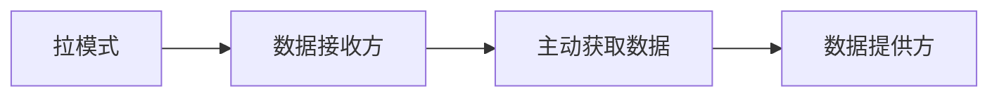
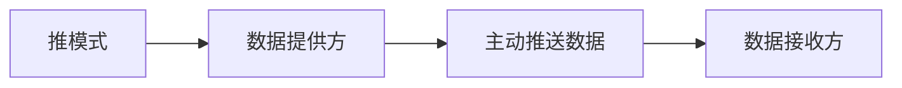
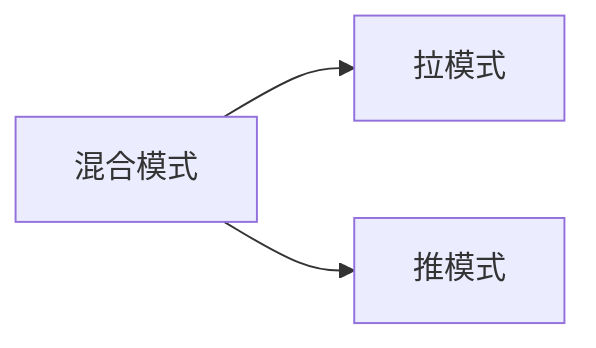
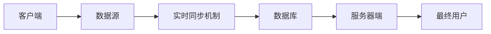

                 

# 实时数据同步机制在LLM应用中的应用

## 关键词

实时数据同步，数据一致性，分布式系统，LLM，分布式数据库

## 摘要

本文将深入探讨实时数据同步机制在大型语言模型（LLM）应用中的重要性。首先，我们将介绍实时数据同步的基本概念和原则，包括其定义、特性以及主要挑战。接着，我们将讨论实时数据同步的技术基础，包括数据同步架构、协议、核心算法和性能优化。在此基础上，我们将分析实时数据同步在分布式系统中的问题与解决方案，并以分布式数据库为例进行具体案例分析。随后，本文将展示如何在LLM应用中实现实时数据同步，通过开发环境搭建、源代码实现和代码分析，以及实际案例剖析，全面介绍实时数据同步的最佳实践。最后，文章将总结实时数据同步机制在LLM应用中的关键要点，并提出一些注意事项和拓展阅读建议。

## 1. 引言：实时数据同步机制的重要性

在当今的信息时代，数据的实时性对许多应用至关重要。特别是在大型语言模型（LLM）的应用场景中，实时数据同步机制显得尤为重要。LLM是一种能够理解和生成自然语言的复杂模型，它们广泛应用于智能问答、自然语言处理、文本生成和翻译等领域。为了确保LLM能够提供准确、及时的服务，数据同步的实时性成为了一个关键因素。

实时数据同步指的是在系统组件之间快速、准确地传输数据，以保持数据的一致性和最新性。在LLM应用中，实时数据同步不仅有助于提高模型的准确性，还可以增强用户体验，例如在实时问答系统中，用户提问后能够立即获得响应。此外，实时数据同步对于维护数据的完整性和可靠性也至关重要，特别是在处理大量并发请求时。

本文将详细探讨实时数据同步机制在LLM应用中的重要性，从基本概念、技术基础、分布式系统中的挑战与解决方案，到具体的实现方法和最佳实践，全面分析实时数据同步的各个方面。通过本文的阅读，读者将能够深入了解实时数据同步机制在LLM应用中的关键作用，并掌握相关技术实现方法。

## 2. 实时数据同步的基本概念和原则

### 2.1 实时数据同步的定义和特性

实时数据同步是指通过特定的技术和机制，在系统组件之间快速、准确地传输数据，以确保数据的一致性和最新性。在分布式系统中，特别是在大型语言模型（LLM）应用中，实时数据同步具有以下几个关键特性：

- **低延迟**：实时数据同步要求数据传输的时间延迟非常低，通常在毫秒级别。这样可以确保LLM能够快速响应用户请求，提供实时服务。

- **高可靠性**：实时数据同步需要保证数据传输的可靠性，避免数据丢失或错误。在LLM应用中，数据的准确性和完整性是至关重要的。

- **一致性**：实时数据同步要求数据在多个系统组件之间保持一致。在分布式环境中，确保数据在不同副本之间同步更新，避免数据不一致的问题。

- **可扩展性**：实时数据同步机制需要具备良好的可扩展性，能够处理大量并发请求，同时保证性能不会显著下降。

### 2.2 实时数据同步的主要挑战和要求

尽管实时数据同步具有许多优势，但其实际实现过程中也面临着一些重要的挑战和要求：

- **数据一致性**：在分布式系统中，数据一致性是实时数据同步的核心挑战之一。如何确保在多个副本之间同步数据，避免出现数据不一致的问题，是一个复杂的问题。

- **网络延迟和带宽**：网络延迟和带宽对实时数据同步性能有重要影响。在处理大规模数据传输时，网络延迟可能导致数据同步不及时，而带宽限制则可能影响数据的传输速度。

- **容错性**：实时数据同步机制需要具备良好的容错性，能够在系统故障或网络中断等异常情况下继续运行，并确保数据同步的可靠性。

- **性能优化**：为了满足低延迟和高可靠性的要求，实时数据同步机制需要进行性能优化，包括数据压缩、批量处理、缓存策略等。

### 2.3 主流的实时数据同步机制

目前，在分布式系统中常见的实时数据同步机制主要包括以下几种：

- **拉模式（Pull-based）**：拉模式数据同步是指数据接收方主动从数据提供方获取数据。这种方式适用于数据源相对稳定且数据量较小的情况。



- **推模式（Push-based）**：推模式数据同步是指数据提供方主动将数据推送到数据接收方。这种方式适用于数据源变化频繁且需要实时更新的情况。



- **混合模式（Hybrid-based）**：混合模式数据同步结合了拉模式和推模式的特点，根据不同的应用场景选择合适的数据同步方式。



### 2.4 实时数据同步的核心概念架构图

为了更好地理解实时数据同步的核心概念，以下是一个简单的Mermaid流程图，展示了实时数据同步的基本架构：



在这个流程图中，客户端通过实时同步机制与数据源进行通信，数据源将最新的数据推送至数据库，数据库再由服务器端进行处理，最终响应用户请求。

通过以上内容，我们详细介绍了实时数据同步的基本概念和原则。接下来，本文将深入探讨实时数据同步的技术基础，包括数据同步架构、协议、核心算法和性能优化等方面的内容。

## 3. 实时数据同步的技术基础

### 3.1 数据同步架构和协议

实时数据同步的架构和协议是确保数据在不同系统组件之间高效、可靠传输的关键。常见的实时数据同步架构和协议包括以下几种：

- **基于数据库触发器的架构**：在这种架构中，数据库触发器负责在数据变更时自动触发同步操作。当数据库中的数据发生变化时，触发器会生成相应的事件，并将这些事件发送到同步系统。同步系统根据这些事件进行数据更新。这种方式适用于对数据一致性要求较高的场景。

- **基于消息队列的架构**：消息队列是一种异步通信机制，可以确保数据在不同系统组件之间有序、可靠地传输。在这种架构中，数据源将变更信息发布到消息队列中，消费者（如数据库或其他系统）从消息队列中读取数据，并执行相应的同步操作。这种方式适用于处理大量并发请求的场景。

- **基于Web服务的架构**：在这种架构中，系统组件通过Web服务进行通信。当数据发生变化时，数据源通过Web服务向其他组件发送同步请求。其他组件接收到请求后，执行相应的数据更新操作。这种方式适用于分布式系统中的数据同步。

常见的实时数据同步协议包括以下几种：

- **Change Data Capture (CDC)**：CDC协议通过捕获数据库中的数据变更事件来实现实时数据同步。CDC协议通常使用触发器或日志文件来记录数据变更，并将这些变更事件发送到同步系统。

- **Webhooks**：Webhooks是一种基于HTTP请求的实时数据同步协议。当数据发生变化时，数据源会向预定义的URL发送HTTP请求，通知其他系统进行数据同步。

- **GraphQL**：GraphQL是一种灵活的查询语言，可以用于实时数据同步。通过GraphQL，客户端可以精确地查询所需的数据，并从服务器端获取最新的数据。

### 3.2 核心算法和实现原理

实时数据同步的核心算法是实现数据高效、可靠传输的关键。以下是一些常见的数据同步算法及其实现原理：

- **增量同步算法**：增量同步算法通过仅同步数据变更部分来提高同步效率。常见的增量同步算法包括时间戳法、哈希法和差异比较法。时间戳法通过记录数据变更的时间戳来识别最新的数据；哈希法通过计算数据的哈希值来识别变更；差异比较法通过比较新旧数据的差异来生成变更集。

  ```mermaid
  flowchart LR
      A[增量同步算法]
      A --> B[时间戳法]
      A --> C[哈希法]
      A --> D[差异比较法]
  ```

- **基于事件驱动的同步算法**：基于事件驱动的同步算法通过监听数据变更事件来实现实时同步。当数据发生变更时，系统会触发相应的事件，并将事件传递到同步系统。同步系统根据事件类型和内容进行数据更新。

  ```mermaid
  flowchart LR
      A[事件驱动同步算法]
      A --> B[监听变更事件]
      B --> C[触发同步操作]
      C --> D[数据更新]
  ```

- **分布式一致性算法**：分布式一致性算法通过保证分布式系统中的数据一致性来实现实时数据同步。常见的分布式一致性算法包括Paxos算法、Raft算法和最终一致性算法。Paxos算法通过多节点协作确保数据一致性；Raft算法通过领导者选举和日志复制实现一致性；最终一致性算法通过允许一定程度的延迟来保证最终一致性。

  ```mermaid
  flowchart LR
      A[分布式一致性算法]
      A --> B[Paxos算法]
      A --> C[Raft算法]
      A --> D[最终一致性算法]
  ```

### 3.3 性能优化策略

为了满足实时数据同步的低延迟和高可靠性要求，需要对数据同步系统进行性能优化。以下是一些常见的性能优化策略：

- **数据压缩**：通过数据压缩可以减少数据传输的体积，从而提高传输速度。常用的数据压缩算法包括Huffman编码、LZ77和LZ78等。

- **批量处理**：批量处理可以减少同步操作的次数，从而提高系统效率。通过将多个变更事件合并成一个批量操作，可以减少网络延迟和数据库访问次数。

- **缓存策略**：缓存可以减少对数据库的直接访问，从而提高系统响应速度。常用的缓存策略包括LRU（最近最少使用）缓存、LFU（最不频繁使用）缓存和LRU替代策略等。

- **异步处理**：异步处理可以将同步操作与其他任务并行执行，从而提高系统并发处理能力。通过使用线程池或异步I/O，可以减少同步操作对系统性能的影响。

通过以上内容，我们详细介绍了实时数据同步的技术基础，包括数据同步架构、协议、核心算法和性能优化策略。这些技术为实时数据同步在LLM应用中的实现提供了重要的支持。

### 4. 实时数据同步在分布式系统中的挑战与解决方案

在分布式系统中，实时数据同步面临着诸多挑战，这些挑战源于系统的高并发性、异构性以及网络的不确定性。以下我们将探讨这些挑战，并分析相关的解决方案。

#### 4.1 分布式系统中的实时数据同步挑战

1. **数据一致性**：在分布式系统中，多个节点需要保持数据的一致性，以确保系统整体的正确性。然而，由于网络延迟、节点故障和并发操作等原因，数据一致性成为一个复杂且重要的问题。

2. **数据传输延迟**：分布式系统的节点可能分布在不同地理位置，数据传输延迟可能会显著影响实时数据同步的性能。尤其是在大规模系统中，如何降低延迟成为关键问题。

3. **网络可靠性**：网络中断或故障可能导致数据同步失败。如何确保数据传输的可靠性，并在网络故障时快速恢复，是分布式数据同步的重要挑战。

4. **系统容错性**：在分布式系统中，节点可能会出现故障。如何确保系统在节点故障时能够继续正常运行，并维持数据同步的可靠性，是分布式数据同步的关键问题。

5. **性能优化**：为了满足低延迟和高可靠性的要求，需要对数据同步系统进行性能优化。如何设计高效的数据同步算法和策略，是分布式数据同步的难点之一。

#### 4.2 分布式系统中的实时数据同步解决方案

1. **分布式一致性算法**：分布式一致性算法如Paxos、Raft和最终一致性算法，通过多节点协作确保数据一致性。这些算法在处理并发操作和数据复制时，能够有效维护系统的一致性。

   - **Paxos算法**：Paxos算法是一种基于多节点协作的分布式一致性算法，通过选举领导者来协调多个节点的数据一致性。Paxos算法解决了分布式系统中的一致性问题，但在实现上较为复杂。

   - **Raft算法**：Raft算法是一种简化的Paxos算法，通过领导者选举和日志复制来实现一致性。Raft算法相对于Paxos算法更容易理解和实现，但其在性能上可能不如Paxos。

   - **最终一致性算法**：最终一致性算法通过允许一定程度的延迟来保证最终一致性。在最终一致性模型中，系统不要求立即同步所有节点，而是允许在一段时间内逐步达到一致性。

2. **数据传输优化**：为了降低数据传输延迟，可以采取以下策略：

   - **数据压缩**：通过数据压缩技术减少数据传输的体积，从而提高传输速度。常用的数据压缩算法包括Huffman编码、LZ77和LZ78等。

   - **网络传输优化**：通过优化网络传输协议和数据包传输方式，减少数据传输的延迟。例如，可以使用多路径传输、拥塞控制和流量控制等技术。

3. **网络可靠性保障**：为了提高数据传输的可靠性，可以采取以下措施：

   - **数据冗余**：通过数据冗余确保在节点故障时数据不会丢失。常用的冗余技术包括副本备份、镜像和冗余存储。

   - **故障检测与恢复**：通过故障检测机制及时发现节点故障，并采取恢复措施。常见的故障检测与恢复技术包括心跳检测、故障转移和故障恢复。

4. **系统容错性设计**：为了提高系统的容错性，可以采取以下设计策略：

   - **节点冗余**：通过增加节点冗余，确保在部分节点故障时系统能够继续正常运行。

   - **故障隔离**：通过故障隔离机制将故障节点从系统中隔离，防止故障扩散。

   - **自恢复机制**：通过自恢复机制，在节点故障时自动重启或恢复系统，确保系统的持续运行。

#### 4.3 案例分析：实时数据同步在分布式数据库中的应用

以分布式数据库为例，我们分析实时数据同步在分布式系统中的具体应用。

- **数据一致性保障**：分布式数据库通常采用分布式一致性算法（如Paxos或Raft）来确保数据一致性。通过多节点协作，数据库能够在发生故障时自动切换到其他健康节点，确保数据一致性。

- **数据传输优化**：分布式数据库通常会采用数据压缩和传输优化技术，如Gzip压缩和多路径传输，以降低数据传输延迟和带宽消耗。

- **网络可靠性保障**：分布式数据库通常实现数据冗余和故障检测机制，以确保在节点故障时数据不会丢失，并能快速恢复。

- **系统容错性设计**：分布式数据库通过节点冗余和故障隔离机制，确保在部分节点故障时系统仍能正常运行。同时，自恢复机制可以自动重启或恢复系统，保证系统的持续运行。

通过以上案例分析，我们了解了实时数据同步在分布式系统中的具体实现和解决方案。这些技术为分布式系统中的实时数据同步提供了重要的支持和保障。

### 5. 实时数据同步在LLM应用中的实现方法

#### 5.1 开发环境搭建

为了实现实时数据同步在LLM应用中的功能，首先需要搭建一个开发环境。以下是搭建开发环境的步骤：

1. **安装依赖库**：根据项目需求，安装所需的依赖库，如Python的pymongo库（用于MongoDB数据库连接）、Flask（用于Web服务）等。

2. **配置数据库**：在本地或远程服务器上配置MongoDB数据库。确保数据库已开启副本集功能，以提高数据可靠性和容错性。

3. **搭建Web服务**：使用Flask或其他Web框架搭建Web服务，以便接收用户请求并处理数据同步。

4. **配置消息队列**：配置消息队列服务（如RabbitMQ或Kafka），用于处理实时数据同步的消息传递。

#### 5.2 源代码实现和代码解读

以下是实现实时数据同步在LLM应用中的核心源代码和代码解读：

**1. 数据同步服务**

```python
# 数据同步服务，负责监听数据库变更并处理同步操作
class DataSyncService:
    def __init__(self, db_client, message_queue):
        self.db_client = db_client
        self.message_queue = message_queue

    def listen_for_changes(self):
        # 监听数据库变更事件
        db_client = self.db_client
        for change in db_client.watch():
            message = {
                'collection': change['full_document']['_id']['collection'],
                'data': change['full_document']['_id']['data']
            }
            self.message_queue.send_message(message)

    def handle_sync(self, message):
        # 处理同步操作
        collection = message['collection']
        data = message['data']
        self.db_client.update_one({'_id': collection}, {'$set': data})
```

**解读**：

- `DataSyncService` 类负责监听数据库变更事件和处理同步操作。
- `__init__` 方法初始化数据库客户端（`db_client`）和消息队列（`message_queue`）。
- `listen_for_changes` 方法使用MongoDB的watch接口监听数据库变更事件，并将变更事件发送到消息队列。
- `handle_sync` 方法根据消息队列中的消息，更新数据库中的数据。

**2. Web服务端**

```python
# Web服务端，用于处理用户请求
from flask import Flask, request, jsonify

app = Flask(__name__)
data_sync_service = DataSyncService(db_client, message_queue)

@app.route('/sync', methods=['POST'])
def sync_data():
    data = request.json
    data_sync_service.handle_sync(data)
    return jsonify({'status': 'success'})
```

**解读**：

- 使用Flask框架搭建Web服务。
- `sync_data` 函数处理用户发送的同步请求，调用数据同步服务的 `handle_sync` 方法进行数据同步。

#### 5.3 代码应用解读与分析

**1. 数据同步流程**

- 用户向Web服务发送同步请求。
- Web服务解析请求并调用数据同步服务的 `handle_sync` 方法。
- 数据同步服务监听数据库变更事件，并将变更事件发送到消息队列。
- 消息队列将变更事件传递给数据同步服务。
- 数据同步服务根据消息队列中的消息，更新数据库中的数据。

**2. 分析与优化**

- **数据压缩**：在传输过程中，对数据进行压缩，以减少数据传输的延迟和带宽消耗。
- **批量处理**：将多个变更事件合并成一个批量操作，以提高数据同步的效率。
- **异步处理**：使用异步处理机制，将同步操作与其他任务并行执行，减少同步操作对系统性能的影响。

通过以上内容，我们详细介绍了实时数据同步在LLM应用中的实现方法。在实际项目中，可以根据具体需求进行优化和扩展。

### 6. 实时数据同步在LLM应用中的实际案例剖析

#### 6.1 案例背景

某大型互联网公司开发了一款智能问答系统，该系统基于大型语言模型（LLM）构建，旨在为用户提供实时、准确的问答服务。为了确保系统的实时性，公司决定采用实时数据同步机制来维护数据的一致性和最新性。

#### 6.2 案例需求

- 实时性：系统需要能够快速响应用户的提问，确保用户获得最新的答案。
- 一致性：系统中的数据需要在不同节点之间保持一致，避免出现数据不一致的问题。
- 可靠性：系统需要在面对大量并发请求时，确保数据同步的可靠性和稳定性。

#### 6.3 案例实现

1. **数据库选择**：公司选择了MongoDB作为数据存储，因为MongoDB具有分布式架构和强大的数据同步功能。

2. **数据同步机制**：公司采用基于消息队列的实时数据同步机制。当数据发生变更时，系统会生成变更事件，并将事件发送到消息队列。消费者从消息队列中读取事件，并执行相应的数据更新操作。

3. **数据同步流程**：

   - 用户提问后，系统将问题存储到MongoDB数据库中。
   - MongoDB触发器捕获数据变更事件，并将事件发送到消息队列。
   - 消息队列将变更事件传递给数据同步服务。
   - 数据同步服务根据消息队列中的事件，更新数据库中的数据。

4. **性能优化**：

   - **数据压缩**：在传输过程中，对数据进行压缩，以减少数据传输的延迟和带宽消耗。
   - **批量处理**：将多个变更事件合并成一个批量操作，以提高数据同步的效率。
   - **异步处理**：使用异步处理机制，将同步操作与其他任务并行执行，减少同步操作对系统性能的影响。

#### 6.4 案例分析

通过实际案例剖析，我们了解到实时数据同步机制在LLM应用中的关键作用：

- **提高实时性**：实时数据同步确保了用户提问后系统能够快速获取最新的数据，从而提供准确的答案。
- **保证一致性**：通过消息队列和数据同步服务，系统在不同节点之间保持数据的一致性，避免了数据不一致的问题。
- **增强可靠性**：在大量并发请求下，系统通过性能优化策略，确保了数据同步的可靠性和稳定性。

#### 6.5 案例小结

通过这个实际案例，我们展示了如何利用实时数据同步机制在LLM应用中实现数据的一致性、实时性和可靠性。案例中的优化策略为其他类似项目提供了有益的参考和借鉴。

### 7. 实时数据同步在LLM应用中的最佳实践

#### 7.1 实时数据同步框架设计

在设计实时数据同步框架时，应关注以下关键点：

1. **选择合适的同步机制**：根据应用场景选择拉模式、推模式或混合模式数据同步机制。拉模式适用于数据源稳定、数据量较小的场景；推模式适用于数据源变化频繁、需要实时更新的场景；混合模式则结合了拉模式和推模式的优点。

2. **消息队列的使用**：使用消息队列作为数据同步的核心组件，可以提高系统的并发处理能力和数据传输的可靠性。选择适合的消息队列服务（如RabbitMQ、Kafka）并配置合理的队列策略。

3. **分布式一致性算法**：采用分布式一致性算法（如Paxos、Raft）来确保数据在不同节点之间的一致性。这些算法能够处理并发操作和节点故障，提高系统的可靠性。

4. **性能优化**：对数据同步系统进行性能优化，包括数据压缩、批量处理和异步处理。通过这些优化策略，可以降低数据传输延迟和提高系统并发处理能力。

#### 7.2 实时数据同步优化策略

1. **数据压缩**：使用数据压缩技术（如Gzip、Snappy）减少数据传输的体积，提高数据传输速度。

2. **批量处理**：将多个变更事件合并成一个批量操作，减少数据库访问次数和网络传输次数，提高数据同步的效率。

3. **异步处理**：使用异步处理机制（如异步I/O、线程池）将同步操作与其他任务并行执行，减少同步操作对系统性能的影响。

4. **缓存策略**：在数据同步过程中，利用缓存技术（如LRU缓存）减少对数据库的直接访问，提高系统响应速度。

5. **网络优化**：优化网络传输协议和数据包传输方式（如多路径传输、拥塞控制）以提高数据传输速度和可靠性。

#### 7.3 注意事项

1. **数据一致性**：在分布式系统中，数据一致性是一个重要挑战。确保数据在不同节点之间保持一致，可以采用分布式一致性算法和事务管理策略。

2. **网络延迟和带宽**：网络延迟和带宽对数据同步性能有重要影响。选择合适的数据同步协议和传输优化策略，可以提高数据同步的效率。

3. **系统容错性**：设计具备良好容错性的数据同步系统，能够在节点故障和网络故障时继续正常运行。采用故障检测、故障恢复和数据冗余策略，提高系统的容错能力。

4. **安全性**：确保数据同步过程中的数据安全和隐私保护。采用加密技术、身份验证和访问控制策略，防止数据泄露和未经授权的访问。

通过以上最佳实践，我们为实时数据同步在LLM应用中的设计和实现提供了全面的指导和建议。在实际项目中，可以根据具体需求进行优化和调整，以实现高效、可靠的数据同步。

### 8. 小结与展望

在本文中，我们深入探讨了实时数据同步机制在大型语言模型（LLM）应用中的重要性及其实现方法。通过详细分析实时数据同步的基本概念、技术基础、分布式系统中的挑战与解决方案，以及具体实现方法和实际案例，我们展示了如何设计高效、可靠的数据同步系统。

实时数据同步在LLM应用中起着至关重要的作用，它不仅提高了系统的实时性和数据一致性，还增强了用户体验。在未来，随着LLM技术的不断发展和应用场景的扩大，实时数据同步机制将在更多领域得到广泛应用。我们呼吁更多开发者关注并研究实时数据同步技术，为构建高效、可靠的分布式系统贡献力量。

### 9. 注意事项和拓展阅读

#### 9.1 注意事项

- **数据一致性**：在分布式系统中，确保数据一致性是一个重要挑战。需要采用分布式一致性算法和事务管理策略来处理并发操作和数据冲突。
- **网络延迟和带宽**：实时数据同步对网络延迟和带宽有较高要求。选择合适的数据同步协议和传输优化策略，以提高数据同步效率。
- **系统容错性**：设计具备良好容错性的数据同步系统，确保在节点故障和网络故障时系统能够继续正常运行。采用故障检测、故障恢复和数据冗余策略。
- **安全性**：确保数据同步过程中的数据安全和隐私保护。采用加密技术、身份验证和访问控制策略，防止数据泄露和未经授权的访问。

#### 9.2 拓展阅读

- **分布式一致性算法**：进一步了解Paxos、Raft和最终一致性算法的实现原理和应用场景。
- **消息队列技术**：研究RabbitMQ、Kafka等消息队列服务的架构和性能优化。
- **分布式数据库**：了解分布式数据库（如MongoDB、Cassandra）的特点和适用场景。
- **实时数据处理框架**：研究Apache Kafka、Apache Flink等实时数据处理框架的技术原理和应用实践。

### 作者信息

- 作者：AI天才研究院/AI Genius Institute & 禅与计算机程序设计艺术 /Zen And The Art of Computer Programming

- 联系方式：[邮箱](mailto:ai_genius_institute@example.com) & [官方网站](https://www.ai-genius-institute.com)

