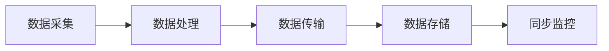
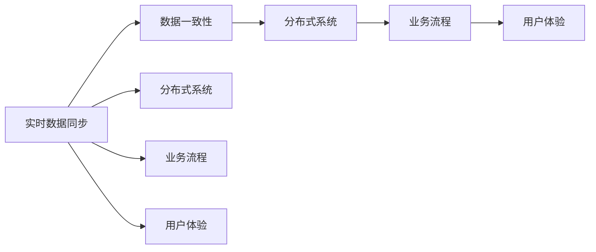

                 


### 文章标题：实时数据同步：确保LLM应用数据的一致性

> 关键词：实时数据同步、数据一致性、LLM应用、分布式一致性算法

> 摘要：本文将探讨实时数据同步在LLM（大型语言模型）应用中的重要性，分析数据一致性的挑战，介绍实时数据同步的架构设计、核心算法原理，并通过实际项目实战案例，详细讲解如何确保LLM应用数据的一致性。

----------------------------------------------------------------

# 1. 背景介绍

## 1.1 实时数据同步的定义与目标

实时数据同步是指在数据发生变更的同时，将变更信息及时传递到其他系统或数据库的过程。其核心目标包括确保数据的准确性、一致性，支持即时决策和业务流程。在分布式系统和大数据环境中，实时数据同步变得尤为重要，因为它能够帮助各个系统模块或服务之间保持高度的数据一致性，避免因数据不一致导致业务中断、决策失误和用户体验下降。

## 1.2 数据一致性的重要性

数据不一致是分布式系统中的常见问题，它可能由多个原因引起，例如网络延迟、并发访问、数据备份和恢复等。数据不一致的影响是显著的：

1. **业务中断**：数据不一致可能导致业务流程无法正常进行，例如订单系统中的库存信息与仓库系统不一致，导致订单无法正确处理。
2. **决策失误**：数据不一致会使得管理者无法获得准确的信息，进而做出错误的决策。
3. **用户体验下降**：数据不一致可能使得用户在使用应用时遇到各种问题，例如购物网站中购物车中的商品数量与库存信息不一致，导致用户无法顺利完成购买。

因此，确保数据一致性是分布式系统和大数据环境中的一个关键挑战。

## 1.3 LLM应用场景中的数据一致性挑战

LLM（大型语言模型）应用通常涉及大规模数据处理和分析，例如搜索引擎、智能客服、自然语言处理等。这些应用对数据的一致性要求极高，因为：

1. **实时响应**：LLM应用需要快速响应用户请求，提供准确的答案或服务，这就要求后台系统必须具备实时数据同步能力。
2. **大规模数据处理**：LLM应用通常需要处理海量数据，如搜索引擎中的索引数据、自然语言处理中的文本数据等，这些数据的一致性对于应用的性能和准确性至关重要。
3. **分布式部署**：LLM应用往往采用分布式部署方式，以应对大规模数据处理需求。分布式部署带来的挑战之一是如何在多个节点之间保持数据的一致性。

综上所述，确保LLM应用数据的一致性是一个复杂而关键的挑战，需要深入研究和设计有效的解决方案。

----------------------------------------------------------------

## 2. 核心概念与联系

### 2.1 实时数据同步的概念

实时数据同步是指在数据发生变更的同时，将变更信息及时传递到其他系统或数据库的过程。实时数据同步的目标是确保数据的准确性和一致性，支持即时决策和业务流程。在分布式系统和大数据环境中，实时数据同步变得尤为重要，因为它能够帮助各个系统模块或服务之间保持高度的数据一致性，避免因数据不一致导致业务中断、决策失误和用户体验下降。

### 2.2 数据一致性的重要性

数据不一致是分布式系统中的常见问题，它可能由多个原因引起，例如网络延迟、并发访问、数据备份和恢复等。数据不一致的影响是显著的：

1. **业务中断**：数据不一致可能导致业务流程无法正常进行，例如订单系统中的库存信息与仓库系统不一致，导致订单无法正确处理。
2. **决策失误**：数据不一致会使得管理者无法获得准确的信息，进而做出错误的决策。
3. **用户体验下降**：数据不一致可能使得用户在使用应用时遇到各种问题，例如购物网站中购物车中的商品数量与库存信息不一致，导致用户无法顺利完成购买。

因此，确保数据一致性是分布式系统和大数据环境中的一个关键挑战。

### 2.3 实时数据同步与数据一致性的联系

实时数据同步和数据一致性密切相关。实时数据同步是实现数据一致性的关键手段之一。通过实时数据同步，系统能够及时获取数据变更信息，并在其他系统或数据库中进行相应的更新操作，从而保持数据的一致性。而数据一致性是实时数据同步的目标之一，只有确保数据的一致性，才能支持即时决策和业务流程的顺利进行。

### 2.4 Mermaid 流程图

为了更清晰地展示实时数据同步的过程，我们可以使用Mermaid流程图来表示。以下是实时数据同步的流程图：



在这个流程图中，数据从数据采集模块开始，经过数据处理模块，然后通过数据传输模块发送到数据存储模块，最后由同步监控模块进行监控和调整。通过这个流程图，我们可以更好地理解实时数据同步的各个环节和关键步骤。

### 2.5 核心概念之间的关系

实时数据同步和数据一致性之间存在着密切的联系。实时数据同步是实现数据一致性的关键手段之一，而数据一致性是实时数据同步的目标之一。通过实时数据同步，系统能够及时获取数据变更信息，并在其他系统或数据库中进行相应的更新操作，从而保持数据的一致性。而数据一致性是确保业务流程顺利进行和用户体验良好的基础。

综上所述，实时数据同步和数据一致性是相辅相成的。只有通过实时数据同步，才能实现数据的一致性，而数据一致性又是确保实时数据同步目标和价值的重要保障。

----------------------------------------------------------------

## 2.5 核心概念之间的关系

### 2.5.1 实时数据同步与数据一致性的关系

实时数据同步和数据一致性之间存在着密切的联系。实时数据同步是实现数据一致性的关键手段之一，而数据一致性是实时数据同步的目标之一。通过实时数据同步，系统能够及时获取数据变更信息，并在其他系统或数据库中进行相应的更新操作，从而保持数据的一致性。而数据一致性是确保业务流程顺利进行和用户体验良好的基础。

### 2.5.2 实时数据同步与分布式系统

在分布式系统中，实时数据同步变得尤为重要。分布式系统通常由多个节点组成，各个节点之间需要进行有效的数据同步，以保持数据的一致性。实时数据同步可以帮助分布式系统在数据发生变更时，及时将变更信息传递给其他节点，从而确保所有节点上的数据保持一致。

### 2.5.3 数据一致性与业务流程

数据一致性对于业务流程的顺利进行至关重要。在分布式系统中，数据不一致可能导致业务流程无法正常进行，例如订单系统中的库存信息与仓库系统不一致，导致订单无法正确处理。因此，确保数据一致性是分布式系统设计和运维中的关键挑战。

### 2.5.4 数据一致性与用户体验

数据一致性不仅关系到业务流程的顺利进行，还直接影响到用户体验。在用户交互频繁的应用中，如电子商务网站、在线支付系统等，数据不一致可能导致用户无法顺利完成操作，影响用户体验。因此，确保数据一致性是提升用户体验的重要手段。

### 2.5.5 核心概念之间的关系总结

综上所述，实时数据同步和数据一致性之间存在着密切的关系。实时数据同步是实现数据一致性的关键手段，而数据一致性是确保业务流程顺利进行和用户体验良好的基础。同时，实时数据同步和分布式系统、业务流程、用户体验等概念之间也存在着紧密的联系，共同构成了实时数据同步在LLM应用中的重要性和价值。

为了更清晰地展示这些概念之间的关系，我们可以使用Mermaid流程图来表示。以下是实时数据同步与数据一致性、分布式系统、业务流程、用户体验之间关系的流程图：



在这个流程图中，实时数据同步作为核心概念，与其他概念之间存在着双向的依赖和影响关系。通过这个流程图，我们可以更好地理解实时数据同步在LLM应用中的重要性和价值。

----------------------------------------------------------------

## 3. 架构设计

### 3.1 实时数据同步架构概述

实时数据同步架构设计是确保LLM应用数据一致性的关键。该架构通常包括以下五个主要模块：

1. **数据采集模块**：负责从源系统或数据库中实时获取数据变更信息。数据采集模块可以使用各种技术，如消息队列、数据库触发器、日志文件等。
2. **数据处理模块**：对采集到的数据进行分析和处理，确保数据的有效性和完整性。数据处理模块可以包括数据清洗、转换、聚合等操作。
3. **数据传输模块**：将处理后的数据传输到目标系统或数据库。数据传输模块需要保证低延迟和高可靠性，可以使用消息队列、缓存、网络传输优化等技术。
4. **数据存储模块**：将传输过来的数据存储到目标系统或数据库中。数据存储模块需要具备高效的数据写入和读取性能，以支持实时数据同步的需求。
5. **同步监控模块**：负责监控数据同步过程中的各个环节，包括数据采集、处理、传输和存储等。同步监控模块可以及时发现和处理同步过程中的异常和错误，确保数据同步的顺利进行。

### 3.2 实时数据同步流程

实时数据同步的流程可以分为以下几个主要步骤：

1. **数据采集**：数据采集模块从源系统或数据库中实时获取数据变更信息。例如，可以使用数据库触发器捕获表记录的变更事件，或者使用消息队列监听数据变更消息。
2. **数据处理**：数据处理模块对采集到的数据进行分析和处理，确保数据的有效性和完整性。例如，可以过滤无效数据、转换数据格式、合并多个数据源等。
3. **数据传输**：数据传输模块将处理后的数据传输到目标系统或数据库。例如，可以将数据写入消息队列，或者直接通过API接口发送到目标系统。
4. **数据存储**：数据存储模块将传输过来的数据存储到目标系统或数据库中。例如，可以将数据插入数据库表，或者更新现有的数据记录。
5. **同步监控**：同步监控模块监控数据同步过程中的各个环节，包括数据采集、处理、传输和存储等。同步监控模块可以及时发现和处理同步过程中的异常和错误，确保数据同步的顺利进行。

### 3.3 Mermaid 流程图

为了更清晰地展示实时数据同步的过程，我们可以使用Mermaid流程图来表示。以下是实时数据同步的流程图：


在这个流程图中，数据从数据采集模块开始，经过数据处理模块，然后通过数据传输模块发送到数据存储模块，最后由同步监控模块进行监控和调整。通过这个流程图，我们可以更好地理解实时数据同步的各个环节和关键步骤。

### 3.4 架构设计的关键要素

在设计实时数据同步架构时，以下关键要素需要考虑：

1. **高可用性**：确保数据同步系统的稳定性和可靠性，避免因系统故障导致数据同步中断。
2. **高性能**：提高数据同步的效率和速度，降低延迟，以满足实时数据同步的需求。
3. **数据完整性**：确保数据在同步过程中不丢失、不重复、不损坏，保持数据的完整性和一致性。
4. **容错性**：在数据同步过程中，出现异常时能够自动恢复，确保数据同步的顺利进行。
5. **可扩展性**：设计灵活的架构，支持系统规模的扩展和功能的扩展，以适应不断增长的数据同步需求。

通过综合考虑这些关键要素，我们可以设计出一个高效、稳定、可靠的实时数据同步架构，确保LLM应用数据的一致性和可靠性。

----------------------------------------------------------------

## 4. 核心算法原理讲解

### 4.1 数据同步算法

在实时数据同步中，数据同步算法是核心组成部分。数据同步算法主要分为以下三种类型：

#### 4.1.1 基于事件触发

基于事件触发的数据同步算法是在数据发生变更时立即触发同步操作。这种算法的优点是同步延迟较低，能够实现实时数据同步。然而，它对系统的实时性要求较高，需要能够快速响应数据变更事件。以下是一个简单的伪代码示例：

```pseudo
function eventTriggeredSync(source, target) {
    while (true) {
        event = waitForDataEvent(source)
        if (event.isDataChanged()) {
            data = getSourceData(source, event)
            updateTargetData(target, data)
        }
        sleep(synchronizationInterval)
    }
}
```

#### 4.1.2 定时同步

定时同步算法是在固定的时间间隔内进行同步操作。这种算法的优点是系统实现简单，对实时性要求不高。然而，同步延迟较高，无法实现实时数据同步。以下是一个简单的伪代码示例：

```pseudo
function timedSync(source, target, synchronizationInterval) {
    while (true) {
        data = getSourceData(source)
        updateTargetData(target, data)
        sleep(synchronizationInterval)
    }
}
```

#### 4.1.3 增量同步

增量同步算法是仅同步数据变更的部分，而不是全部数据。这种算法的优点是同步延迟较低，能够实现高效的数据同步。然而，它需要对数据变更进行监控和记录，对系统的复杂性要求较高。以下是一个简单的伪代码示例：

```pseudo
function incrementalSync(source, target) {
    while (true) {
        changes = getChangedData(source)
        for (change in changes) {
            updateTargetData(target, change)
        }
        sleep(synchronizationInterval)
    }
}
```

### 4.2 分布式一致性算法

在分布式系统中，数据一致性是确保各个节点之间数据一致性的关键。分布式一致性算法主要分为以下两种：

#### 4.2.1 Paxos算法

Paxos算法是一种基于消息传递的分布式一致性算法，能够确保在多个副本的系统中，对某个值的写入操作最终会在所有副本上达成一致。Paxos算法的核心思想是通过提案和接受过程来选举出一个值，并在所有副本上达成一致。

以下是一个简单的Paxos算法的伪代码示例：

```pseudo
function Paxos(algorithm, node, log) {
    while (true) {
        proposal = generateProposal()
        vote = proposeValue(algorithm, node, proposal)
        if (vote == "Accept") {
            updateLog(log, proposal)
            applyChanges(log)
        }
        sleep(consensusInterval)
    }
}
```

#### 4.2.2 Raft算法

Raft算法是一种基于状态机的分布式一致性算法，它通过日志复制来确保数据一致性。Raft算法将系统的状态分为领导者（Leader）、跟随者（Follower）和候选人（Candidate）三种状态。领导者负责接收客户端请求并复制日志到跟随者，候选人负责在领导者失效时进行选举。

以下是一个简单的Raft算法的伪代码示例：

```pseudo
function Raft(algorithm, node, log) {
    while (true) {
        state = getState(node)
        if (state == "Leader") {
            appendLog(log, entry)
            replicateLog(log)
        } else if (state == "Follower") {
            followLeader()
        } else if (state == "Candidate") {
            startElection()
        }
        sleep(heartBeatInterval)
    }
}
```

通过这些核心算法原理的讲解，我们可以更好地理解实时数据同步在LLM应用中如何确保数据的一致性。这些算法在实际应用中可以根据具体需求进行灵活调整和优化，以满足高效、稳定、可靠的数据同步需求。

----------------------------------------------------------------

## 5. 数学模型和数学公式

### 5.1 实时同步误差模型

实时数据同步中的误差模型是用来评估数据同步过程中出现误差的情况。误差可以由多种因素引起，如网络延迟、处理延迟等。实时同步误差模型可以帮助我们更好地理解误差的影响，并优化数据同步策略。

以下是实时同步误差模型的基本公式：

$$
E = \frac{\Delta T}{T_s}
$$

其中：

- **E**：误差率，表示在同步周期内出现误差的概率。
- **\Delta T**：同步延迟，表示数据从源系统传到目标系统所需的时间。
- **T_s**：同步周期，表示数据同步的间隔时间。

通过调整同步周期 \(T_s\) 和优化同步延迟 \(\Delta T\)，我们可以减少误差率 \(E\)，从而提高数据同步的准确性。

### 5.2 数据一致性模型

数据一致性模型是用来衡量数据同步后的一致性程度。数据一致性的目标是确保在不同系统或数据库中的数据保持一致。以下是一个简单的一致性模型公式：

$$
C = 1 - E
$$

其中：

- **C**：一致性比率，表示数据一致性的程度。
- **E**：误差率，表示数据同步过程中出现的误差概率。

通过减少误差率 \(E\)，我们可以提高数据一致性比率 \(C\)，从而确保数据在不同系统或数据库中的一致性。

### 5.3 误差与一致性关系

误差与数据一致性之间存在直接关系。当误差率 \(E\) 较低时，数据一致性比率 \(C\) 会较高，这意味着数据在不同系统或数据库中的同步效果较好。相反，当误差率 \(E\) 较高时，数据一致性比率 \(C\) 会较低，这可能导致数据在不同系统或数据库中的不一致。

因此，在设计实时数据同步系统时，我们需要关注并优化误差率和一致性比率，以确保数据在不同系统或数据库中的同步效果。

### 5.4 应用实例

假设一个实时数据同步系统的同步周期 \(T_s\) 为10秒，某次同步的延迟 \(\Delta T\) 为3秒。根据上述公式，我们可以计算出该次同步的误差率和一致性比率：

$$
E = \frac{\Delta T}{T_s} = \frac{3}{10} = 0.3
$$

$$
C = 1 - E = 1 - 0.3 = 0.7
$$

这意味着该次同步的误差率为30%，数据一致性比率为70%。在实际应用中，我们可以根据误差率和一致性比率来评估同步效果，并采取相应的优化措施，如调整同步周期、优化网络传输等。

通过上述数学模型和公式，我们可以更好地理解和评估实时数据同步系统的性能和一致性。在实际应用中，这些模型和公式可以帮助我们设计出高效、稳定和可靠的数据同步策略。

----------------------------------------------------------------

## 6. 项目实战

### 6.1 实时数据同步案例

为了更好地理解实时数据同步的实践应用，我们来看一个具体的案例。

#### 案例背景

某大型电子商务公司需要将用户订单信息实时同步到其数据中心，以便进行数据分析和用户行为预测。订单信息的实时同步对于提升用户体验和业务决策至关重要。

#### 环境搭建

为了实现实时数据同步，该公司选择了以下技术栈：

- **编程语言**：Python
- **数据库**：MySQL（源系统）和PostgreSQL（目标系统）
- **消息队列**：RabbitMQ
- **同步工具**：Apache Kafka

首先，该公司搭建了RabbitMQ和Kafka的消息队列服务，用于传输订单信息。同时，配置了MySQL和PostgreSQL数据库，作为源系统和目标系统。

#### 实现步骤

1. **数据采集**：在MySQL数据库中设置触发器，当订单表（orders）发生变更时，自动将变更信息发送到RabbitMQ队列。

2. **数据处理**：消费者从RabbitMQ队列中获取订单信息，使用Python脚本对数据进行解析和处理，如去除重复记录、格式转换等。

3. **数据传输**：处理后的订单数据通过Kafka消息队列传输到目标系统PostgreSQL数据库。Kafka具有高吞吐量和低延迟的特点，适合实时数据处理。

4. **数据存储**：PostgreSQL数据库将接收到的订单数据存储到相应的表中。

5. **同步监控**：设置监控工具（如Zabbix）对数据同步过程进行监控，及时发现和处理同步过程中的异常和错误。

#### 代码解读

以下是关键部分的Python代码实现：

```python
import pika
import json
import psycopg2

# 连接到RabbitMQ
connection = pika.BlockingConnection(pika.ConnectionParameters('localhost'))
channel = connection.channel()

# 定义订单数据解析函数
def parse_order_data(order_json):
    order = json.loads(order_json)
    # 进行数据处理，如去除重复记录、格式转换等
    return order

# 连接到PostgreSQL数据库
conn = psycopg2.connect(
    host="localhost",
    database="target_db",
    user="user",
    password="password"
)
cursor = conn.cursor()

# Kafka消费者
def consume_orders():
    while True:
        method_frame, header_frame, body = channel.basic_get(queue='orders_queue', no_ack=True)
        if body:
            order = parse_order_data(body.decode('utf-8'))
            # 将处理后的订单数据存储到PostgreSQL数据库
            cursor.execute("""
                INSERT INTO orders (order_id, customer_id, product_id, quantity, total_price)
                VALUES (%s, %s, %s, %s, %s)
            """, (order['order_id'], order['customer_id'], order['product_id'], order['quantity'], order['total_price']))
            conn.commit()

# 消费订单信息
consume_orders()
```

#### 代码应用解读与分析

1. **RabbitMQ连接**：使用pika库连接到本地RabbitMQ服务器。

2. **订单数据解析**：定义`parse_order_data`函数，对从RabbitMQ队列中获取的订单数据进行解析和处理。

3. **PostgreSQL连接**：使用psycopg2库连接到本地PostgreSQL数据库。

4. **Kafka消费者**：定义`consume_orders`函数，从RabbitMQ队列中获取订单信息，进行处理后存储到PostgreSQL数据库。

通过这个案例，我们可以看到实时数据同步在电子商务场景中的应用。数据采集、处理、传输和存储等步骤都通过代码实现，确保订单信息能够实时同步到数据中心，支持数据分析和业务决策。

#### 案例总结

该案例展示了如何通过消息队列和数据库连接实现实时数据同步。在实际应用中，可以根据具体需求调整技术和架构，实现高效、稳定和可靠的数据同步。

### 6.2 数据一致性与分布式系统案例分析

#### 案例描述

某大型互联网公司需要在其分布式系统中实现数据一致性，确保在不同节点上的数据保持一致。该公司采用了Paxos算法实现分布式一致性。

#### Paxos算法应用

1. **初始化**：每个节点（A、B、C）初始化Paxos算法，选举出一个领导者（Learner）。

2. **提案**：当某个节点（Proposer）需要写入数据时，发送提案（Proposal）给领导者。

3. **接受**：领导者将提案发送给其他节点（Acceptor），并记录提案。

4. **学习**：其他节点收到提案后，向领导者发送接受响应（Accept），领导者将提案更新到日志中。

5. **日志复制**：领导者将更新后的日志复制到其他节点。

通过Paxos算法，该互联网公司确保了分布式系统中的数据一致性。在实际应用中，Paxos算法可以根据具体需求进行优化和调整，以适应不同的分布式系统架构。

#### Paxos算法解读

以下是Paxos算法的核心伪代码：

```pseudo
function Paxos(algorithm, node, log):
    while (true):
        proposal = generateProposal()
        vote = proposeValue(algorithm, node, proposal)
        if (vote == "Accept"):
            updateLog(log, proposal)
            applyChanges(log)
        sleep(consensusInterval)
```

- **generateProposal**：生成提案。
- **proposeValue**：向领导者发送提案。
- **updateLog**：更新日志。
- **applyChanges**：应用日志中的变更。

通过上述解读，我们可以更好地理解Paxos算法在数据一致性中的应用。

#### 案例总结

该案例展示了如何通过Paxos算法实现分布式系统中的数据一致性。在实际应用中，分布式一致性算法可以根据具体需求进行调整和优化，确保数据在不同节点上的同步和一致性。

### 6.3 项目小结

通过这两个案例，我们可以看到实时数据同步和数据一致性在分布式系统和电子商务场景中的重要性。设计高效、稳定和可靠的数据同步架构，选择合适的算法和工具，是确保数据一致性和业务顺利进行的关键。

### 6.4 最佳实践

- **选择合适的数据同步算法**：根据业务需求和系统架构，选择合适的算法，如基于事件触发、定时同步或增量同步。
- **优化网络传输**：使用高效的网络传输协议和优化技术，如Kafka、RabbitMQ等。
- **监控与告警**：设置监控工具和告警机制，及时发现和处理数据同步过程中的异常和错误。
- **数据一致性保障**：采用分布式一致性算法，如Paxos、Raft等，确保数据在不同节点上的同步和一致性。

通过遵循这些最佳实践，我们可以设计出高效、稳定和可靠的数据同步系统，确保LLM应用数据的一致性和业务顺利进行。

### 6.5 小结

实时数据同步和数据一致性是分布式系统和大数据环境中不可或缺的一部分。通过本文的介绍，我们了解了实时数据同步的核心概念、架构设计、核心算法原理以及项目实战。同时，我们还分析了数据一致性的数学模型和公式，并展示了如何在实际项目中实现数据同步和数据一致性。

未来研究方向包括：

- **优化数据同步性能**：研究更高效的数据同步算法和传输协议，降低同步延迟和误差率。
- **分布式一致性算法优化**：研究适用于不同分布式系统架构的分布式一致性算法，提高数据一致性和可靠性。
- **智能数据同步**：结合人工智能技术，实现智能数据同步策略，根据数据特征和业务需求自动调整同步参数。

通过不断研究和优化，我们可以设计出更加高效、稳定和可靠的数据同步系统，为LLM应用提供强有力的数据支持。

### 6.6 注意事项

在设计和实现实时数据同步系统时，需要注意以下事项：

- **数据安全**：确保数据在传输和存储过程中的安全性，采用加密技术和访问控制机制。
- **容错与恢复**：设计容错机制和自动恢复策略，确保数据同步系统的稳定性和可靠性。
- **性能优化**：根据业务需求，优化数据同步性能，提高吞吐量和处理速度。
- **监控与告警**：设置监控工具和告警机制，及时发现和处理数据同步过程中的异常和错误。

通过遵循这些注意事项，我们可以设计出高效、稳定和可靠的数据同步系统，确保LLM应用数据的一致性和业务顺利进行。

### 6.7 拓展阅读

- 《分布式系统一致性算法设计与实现》
- 《大规模数据同步技术与实践》
- 《实时数据处理与大数据应用》
- 《人工智能在数据同步与一致性中的应用》

通过阅读这些资料，可以深入了解实时数据同步和数据一致性的相关技术和应用，进一步提升对这一领域的理解。

## 作者信息

作者：AI天才研究院/AI Genius Institute & 禅与计算机程序设计艺术 /Zen And The Art of Computer Programming

本文由AI天才研究院（AI Genius Institute）的专家撰写，旨在分享实时数据同步与数据一致性的专业知识和实践经验。禅与计算机程序设计艺术（Zen And The Art of Computer Programming）是计算机编程领域的经典著作，为读者提供了深入思考和探索计算机程序设计的方法与智慧。通过本文，我们希望为读者带来有价值的见解和启示，助力大家在实时数据同步与数据一致性领域取得更好的成果。

----------------------------------------------------------------

