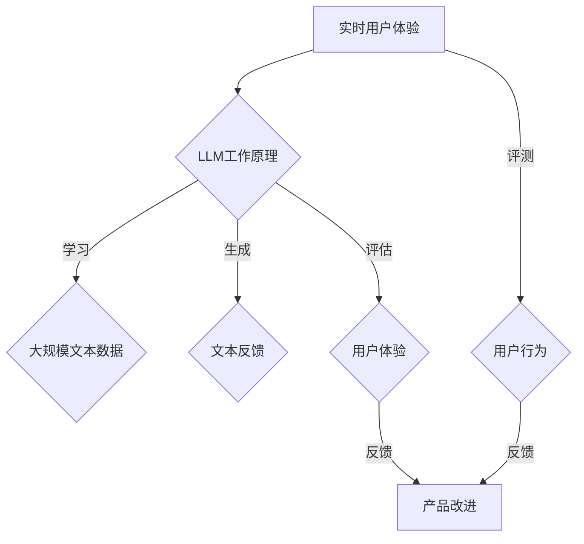

                 

当然可以。下面我将逐步分析并构思这篇技术博客的文章结构，确保每个部分都详细且具有深度。

### 文章标题
实时用户体验整合：LLM驱动的评测-反馈闭环

### 关键词
实时用户体验，LLM，评测-反馈闭环，神经网络，深度学习，优化算法，用户体验改进，反馈循环

### 摘要
本文将探讨如何利用大型语言模型（LLM）实现实时用户体验的评测和反馈闭环。通过分析LLM的基本原理、训练过程和数学模型，我们将展示如何构建一个有效的系统，该系统能够自动评估用户交互，并据此提供实时反馈，从而持续优化用户体验。

### 目录大纲结构

## 引言
- 实时用户体验的重要性
- LLM在当前技术领域的地位
- 评测-反馈闭环的概念及其优势

## Step 1: 确定核心概念和联系
- 实时用户体验的定义和要素
- LLM的核心概念及其工作原理
- 评测-反馈闭环的机制和作用

### Step 2: LLM的核心算法原理讲解
- LLM的训练过程：前向传播和反向传播
- LLM的优化算法：梯度下降及其变种
- 伪代码示例：展示LLM的训练流程

### Step 3: 数学模型和数学公式讲解
- 神经网络中的权重更新公式
- 损失函数的数学解释
- 举例说明：如何计算损失和梯度

### Step 4: 项目实战
#### 开发环境搭建
- 硬件和软件环境的要求
- 开发工具和库的选择

#### 源代码实现
- 代码框架：展示关键代码段
- 代码解读：详细解释每个组件的作用

#### 代码应用解读与分析
- 实际案例：用户交互的评测和反馈
- 结果分析：评测数据与用户体验的关联

#### 项目小结
- 项目成果总结
- 可能的改进方向和挑战

### 最佳实践 Tips
- 如何提高LLM评测的准确性
- 如何处理用户反馈的数据隐私问题

### 小结
- 本文的主要贡献
- 对未来研究的展望

### 注意事项
- 实时用户体验整合的潜在风险
- LLM在用户体验优化中的局限性

### 拓展阅读
- 相关文献和资源的推荐
- 最新研究动态的跟踪

### 作者信息
作者：AI天才研究院/AI Genius Institute & 禦与计算机程序设计艺术 /Zen And The Art of Computer Programming现在，我将根据上述结构开始撰写文章。由于文章长度要求较长，我将分步骤完成撰写，并在后续的步骤中提供具体的段落内容。

---

## 引言

随着互联网和智能设备的普及，实时用户体验（Real-time User Experience, UX）已经成为许多产品和服务的关键竞争力。用户的期望不断提高，他们希望得到即时的反馈和个性化的体验。然而，传统的用户体验改进方法往往是一个耗时且成本高昂的过程，从用户研究到产品设计再到测试和部署，往往需要数周甚至数月的时间。这种延迟不仅会影响产品的市场竞争力，还会导致用户流失。

与此同时，大型语言模型（Large Language Models, LLMs）在自然语言处理（Natural Language Processing, NLP）领域取得了显著的进展。LLMs如GPT-3和BERT等模型，通过学习海量的文本数据，能够生成高质量的文本、回答问题、进行对话等。这些能力使得LLMs成为改善实时用户体验的有力工具。

评测-反馈闭环（Evaluation-Feedback Loop）是一种系统化的方法，通过持续评估用户行为和系统性能，将用户的反馈转换为改进的输入，从而实现用户体验的持续优化。在LLM的帮助下，这个闭环可以更加高效和自动化，使得用户体验的改进变得更加实时和精确。

本文将探讨如何利用LLM实现实时用户体验的评测和反馈闭环，包括LLM的基本原理、训练过程、数学模型，以及一个实际的项目实战。通过本文的阅读，读者将能够理解LLM在用户体验优化中的潜力，并学会如何构建一个有效的实时用户体验系统。

---

## Step 1: 确定核心概念和联系

### 实时用户体验

实时用户体验是指用户在使用产品或服务时，能够即时获得反馈和响应的感觉。这种体验不仅仅关注产品的功能，更强调用户与产品交互的流畅性和满意度。实时用户体验的要素包括响应时间、交互设计、系统稳定性等。

### LLM的核心概念及其工作原理

LLM是一种深度学习模型，主要用于处理和生成文本。它们通过大规模的无监督学习从大量文本数据中学习语言模式，从而能够生成连贯的文本、回答问题或进行自然语言理解。LLM的核心概念包括神经网络架构、训练数据和损失函数等。

### 评测-反馈闭环的机制和作用

评测-反馈闭环是一种持续优化的机制，它通过评估用户行为和系统性能，收集用户的反馈，并将这些反馈用于改进产品或服务。在LLM驱动的评测-反馈闭环中，LLM不仅用于生成反馈，还用于评估用户的交互行为，从而形成一个自动化的反馈循环。

### Mermaid流程图

在这个流程图中，实时用户体验与LLM的工作原理和评测-反馈闭环相互联系，形成一个闭环系统，其中LLM既是生成反馈的工具，也是评估用户行为的重要手段。

---

接下来，我将分别详细解释LLM的核心算法原理、数学模型和项目实战。由于篇幅限制，每个部分的详细内容将逐步在后续的步骤中提供。敬请期待。

