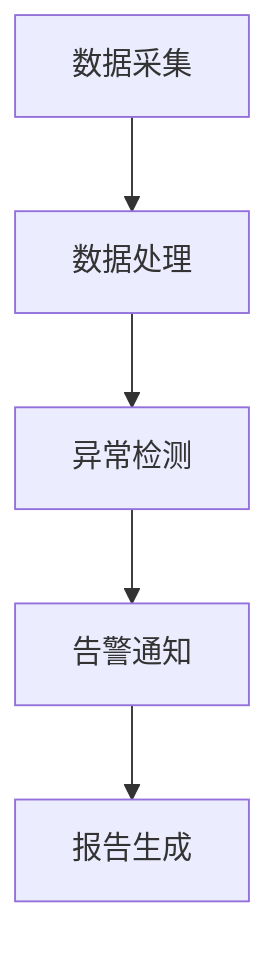

                 

### 文章标题：实时监控告警系统在LLM应用运维中的作用

#### 关键词：
- 实时监控告警系统
- LLM（大型语言模型）
- 应用运维
- 异常检测
- 阈值设定

#### 摘要：
本文将探讨实时监控告警系统在LLM（大型语言模型）应用运维中的重要性。首先，我们将介绍实时监控告警系统和LLM的基本概念及其联系。接着，深入讲解实时监控告警系统中的关键算法原理，包括阈值设定和异常检测。此外，我们将通过一个实际案例，展示如何部署和运维实时监控告警系统在LLM应用中。最后，我们将总结实时监控告警系统在LLM应用中的挑战与展望，并提供最佳实践和拓展阅读建议。

## 第一部分：实时监控告警系统概述

### 1.1 实时监控告警系统的基本概念

#### 1.1.1 实时监控告警系统的定义
实时监控告警系统是一种通过实时数据采集、分析和处理，及时识别异常并发出告警通知的系统。它的主要功能包括：
- **数据采集**：从各个数据源（如服务器、网络设备、应用程序等）实时收集数据。
- **数据处理**：对采集到的数据进行过滤、清洗、转换等处理，以便后续分析。
- **异常检测**：利用统计学、机器学习等方法，对处理后的数据进行异常检测，识别出潜在的问题。
- **告警通知**：当检测到异常时，系统会通过邮件、短信、应用通知等方式向运维人员发出告警。
- **报告生成**：系统可以生成详细的告警报告，帮助运维人员了解问题的严重程度和影响范围。

#### 1.1.2 实时监控告警系统的作用
实时监控告警系统在LLM应用运维中的作用主要体现在以下几个方面：
- **提高系统稳定性**：通过实时监控和告警，运维人员可以及时发现并解决系统中的问题，避免故障扩大，从而提高系统的稳定性。
- **减少人工干预**：实时监控告警系统能够自动检测异常，并将告警信息通知给运维人员，从而减少人工检查和干预的需求，提高工作效率。
- **快速响应**：实时监控告警系统可以在异常发生的第一时间发出告警，使运维人员能够迅速采取行动，减少故障对业务的影响。
- **预防潜在问题**：通过持续监控和数据分析，实时监控告警系统可以发现潜在的问题，提前采取预防措施，避免故障发生。

### 1.2 LLM的基本概念

#### 1.2.1 LLM的定义
LLM（Large Language Model）即大型语言模型，是一种基于深度学习的自然语言处理模型，能够理解和生成自然语言文本。LLM通常具有以下几个特点：
- **规模大**：LLM的训练数据量庞大，通常达到数十亿甚至数万亿个句子级别。
- **参数多**：LLM的参数数量非常庞大，数百万到数十亿不等。
- **自适应性**：LLM可以根据不同的任务和场景进行自适应调整，以生成更符合预期的结果。

#### 1.2.2 LLM的特点
LLM的主要特点包括：
- **强大的文本生成能力**：LLM能够生成流畅、连贯的文本，包括文章、对话、回复等。
- **丰富的知识储备**：LLM通过训练积累了大量的语言知识和信息，可以回答各种问题。
- **灵活的应用场景**：LLM可以应用于各种自然语言处理任务，如机器翻译、问答系统、文本分类等。

### 1.3 实时监控告警系统与LLM的关联

#### 1.3.1 实时监控告警系统在LLM中的应用
实时监控告警系统在LLM中的应用主要体现在以下几个方面：
- **模型训练监控**：实时监控告警系统可以监控LLM的训练过程，包括数据加载、模型更新、训练进度等，以确保训练过程的稳定性和效率。
- **模型性能监控**：实时监控告警系统可以监控LLM在部署后的性能，如响应时间、准确率、错误率等，及时发现并解决性能问题。
- **异常检测**：实时监控告警系统可以利用LLM的生成能力，检测文本中的异常，如恶意评论、垃圾邮件等。

#### 1.3.2 LLM对实时监控告警系统的影响
LLM的发展对实时监控告警系统产生了以下影响：
- **提高异常检测能力**：LLM的强大文本生成能力可以提高实时监控告警系统的异常检测能力，使其能够更准确地识别异常文本。
- **复杂度增加**：随着LLM的规模和参数数量增加，实时监控告警系统的复杂度也相应增加，需要更高效的算法和策略来保证系统的性能和可靠性。
- **扩展性需求**：LLM的应用场景广泛，实时监控告警系统需要具备良好的扩展性，以适应不同场景下的需求。

## 第二部分：实时监控告警系统的架构与算法

### 2.1 实时监控告警系统的架构

#### 2.1.1 系统架构概述
实时监控告警系统的架构通常包括以下几个主要组件：
- **数据采集器**：负责从各个数据源实时收集数据，如服务器性能数据、网络流量数据、应用程序日志等。
- **数据处理模块**：对采集到的数据进行处理，包括数据清洗、过滤、转换等，以便后续分析。
- **异常检测模块**：利用统计学、机器学习等方法，对处理后的数据进行异常检测，识别出潜在的问题。
- **告警通知模块**：当检测到异常时，系统会通过邮件、短信、应用通知等方式向运维人员发出告警。
- **报告生成模块**：系统可以生成详细的告警报告，帮助运维人员了解问题的严重程度和影响范围。

#### 2.1.2 系统组件介绍
- **数据采集器**：数据采集器是实时监控告警系统的数据来源。它可以收集来自各种数据源的数据，如服务器性能指标、网络流量、应用程序日志等。常见的采集器包括SNMP（简单网络管理协议）采集器、日志文件采集器、数据库采集器等。
- **数据处理模块**：数据处理模块对采集到的数据进行处理，确保数据的准确性和一致性。数据处理过程包括数据清洗、过滤、转换等。例如，对日志文件进行解析，提取有用的信息；对性能数据进行转换，使其符合分析算法的要求。
- **异常检测模块**：异常检测模块是实时监控告警系统的核心。它利用统计学、机器学习等方法，对处理后的数据进行异常检测。常见的异常检测算法包括基于统计的异常检测、基于机器学习的异常检测等。异常检测模块需要设定合适的阈值，以便在检测到异常时能够及时发出告警。
- **告警通知模块**：告警通知模块负责在检测到异常时，将告警信息通知给运维人员。告警通知的方式可以多种多样，如邮件、短信、应用通知等。告警通知模块还需要支持告警级别的设置，以便根据问题的严重程度采取相应的响应措施。
- **报告生成模块**：报告生成模块负责生成详细的告警报告。告警报告可以包括告警时间、告警级别、异常类型、影响范围等信息。告警报告有助于运维人员了解问题的全貌，为后续的故障排除和优化提供依据。

### 2.2 关键算法原理讲解

#### 2.2.1 阈值设定算法
阈值设定算法是实时监控告警系统中关键的一环。它的目标是设定一个合适的阈值，以便在检测到异常时能够及时发出告警。常见的阈值设定算法包括基于统计的方法和基于机器学习的方法。

**2.2.1.1 基于统计的方法**
基于统计的方法主要包括以下步骤：
1. 收集历史数据：收集一定时间范围内的历史数据，如性能指标、日志数据等。
2. 计算平均值和标准差：对收集到的数据计算平均值和标准差，用于后续的阈值设定。
3. 设定阈值：根据业务需求和风险承受能力，设定一个合适的阈值。常见的阈值设定方法包括：
   - **固定阈值**：直接设定一个固定的阈值，如标准差的倍数。
   - **动态阈值**：根据历史数据的变化情况，动态调整阈值。例如，可以使用移动平均法或指数平滑法计算平均值，并根据平均值的变化调整阈值。

**2.2.1.2 基于机器学习的方法**
基于机器学习的方法主要包括以下步骤：
1. 数据预处理：对采集到的数据进行预处理，如归一化、去噪等。
2. 特征选择：选择对异常检测有重要影响的特征，如性能指标、日志关键字等。
3. 训练模型：使用训练数据集训练机器学习模型，如支持向量机（SVM）、决策树、神经网络等。
4. 模型评估：使用验证数据集评估模型的效果，调整模型参数，提高模型准确性。
5. 阈值设定：根据模型预测的结果，设定一个合适的阈值。例如，可以设定一个错误率最低的阈值，或在某个置信水平下设定阈值。

**2.2.1.3 伪代码示例**
以下是一个简单的阈值设定算法的伪代码示例：

```python
# 基于统计的方法
def calculate_threshold(data):
    mean = calculate_mean(data)
    std = calculate_std(data)
    threshold = mean + k * std
    return threshold

# 基于机器学习的方法
def train_model(data):
    features = select_features(data)
    model = train_machine_learning_model(features)
    return model

def set_threshold(model, data):
    predictions = model.predict(data)
    error_rate = calculate_error_rate(predictions)
    threshold = find_optimal_threshold(error_rate)
    return threshold
```

#### 2.2.2 异常检测算法
异常检测算法是实时监控告警系统的核心。它的目标是识别出数据中的异常值或异常模式。常见的异常检测算法包括基于统计的方法、基于聚类的方法和基于分类的方法。

**2.2.2.1 基于统计的方法**
基于统计的方法主要包括以下步骤：
1. 收集历史数据：收集一定时间范围内的历史数据，如性能指标、日志数据等。
2. 计算概率分布：对收集到的数据进行概率分布估计，如正态分布、泊松分布等。
3. 设定异常阈值：根据概率分布，设定一个异常阈值。例如，可以使用3倍标准差作为异常阈值。
4. 检测异常：对新的数据进行检测，如果数据超出异常阈值，则认为其是异常值。

**2.2.2.2 基于聚类的方法**
基于聚类的方法主要包括以下步骤：
1. 数据预处理：对采集到的数据进行预处理，如归一化、去噪等。
2. 聚类算法：选择合适的聚类算法，如K均值聚类、层次聚类等，对数据进行聚类。
3. 聚类评估：使用评估指标（如轮廓系数、内切球半径等）评估聚类效果，调整聚类参数。
4. 检测异常：将新的数据点与聚类中心进行比较，如果距离某个聚类中心较远，则认为其是异常值。

**2.2.2.3 基于分类的方法**
基于分类的方法主要包括以下步骤：
1. 数据预处理：对采集到的数据进行预处理，如归一化、去噪等。
2. 特征选择：选择对异常检测有重要影响的特征，如性能指标、日志关键字等。
3. 训练分类模型：使用训练数据集训练分类模型，如支持向量机（SVM）、决策树、随机森林等。
4. 模型评估：使用验证数据集评估模型的效果，调整模型参数，提高模型准确性。
5. 检测异常：对新的数据进行分类，如果分类结果为异常类，则认为其是异常值。

**2.2.2.4 伪代码示例**
以下是一个简单的异常检测算法的伪代码示例：

```python
# 基于统计的方法
def detect_anomaly(data, mean, std):
    if abs(data - mean) > k * std:
        return True
    else:
        return False

# 基于聚类的方法
def cluster_data(data):
    clusters = cluster_using_kmeans(data)
    return clusters

def detect_anomaly Using_clustering(data, clusters):
    for cluster in clusters:
        if distance(data, cluster_center) > threshold:
            return True
    return False

# 基于分类的方法
def train_classifier(data, labels):
    classifier = train_classification_model(data, labels)
    return classifier

def detect_anomaly_using_classifier(data, classifier):
    label = classifier.predict(data)
    if label == 'anomaly':
        return True
    else:
        return False
```

### 2.3 Mermaid流程图
以下是一个实时监控告警系统的流程图示例：



## 第三部分：实时监控告警系统在LLM应用中的实战

### 3.1 实时监控告警系统在LLM中的部署

#### 3.1.1 环境搭建

在部署实时监控告警系统前，需要先搭建好开发环境。以下是一个基于Linux操作系统的环境搭建步骤：

1. **安装操作系统**：选择一个适合的Linux发行版，如Ubuntu 20.04。
2. **安装必备软件**：安装Python 3、Git、Node.js、Docker等。
3. **配置SSH密钥**：为方便远程访问，配置SSH密钥。

#### 3.1.2 部署流程

以下是实时监控告警系统在LLM中的应用部署流程：

1. **搭建LLM模型服务**：
   - **准备模型**：下载或训练一个LLM模型，如GPT-3。
   - **容器化模型**：使用Docker容器化模型，以便于部署和扩展。
   - **部署模型**：使用Docker Compose部署模型服务。

2. **部署实时监控告警系统**：
   - **安装监控告警组件**：安装Prometheus、Grafana等监控告警组件。
   - **配置监控规则**：配置Prometheus监控规则，以监控LLM模型的性能指标。
   - **配置告警通知**：配置告警通知，如通过邮件、短信等方式通知运维人员。

### 3.2 实时监控告警系统在LLM中的运维

#### 3.2.1 监控指标设定

在部署实时监控告警系统后，需要设定合适的监控指标，以便及时发现并解决LLM应用中的问题。以下是一些常见的监控指标：

1. **性能指标**：
   - **响应时间**：LLM模型处理请求的平均响应时间。
   - **错误率**：LLM模型处理请求的错误率。
   - **CPU使用率**：LLM模型服务的CPU使用率。
   - **内存使用率**：LLM模型服务的内存使用率。

2. **资源指标**：
   - **网络流量**：LLM模型服务的网络流量。
   - **磁盘使用率**：LLM模型服务的磁盘使用率。

3. **日志指标**：
   - **错误日志**：LLM模型服务产生的错误日志。
   - **警告日志**：LLM模型服务产生的警告日志。

#### 3.2.2 告警策略设计

在设定监控指标后，需要设计合适的告警策略，以便在检测到异常时能够及时发出告警。以下是一些常见的告警策略：

1. **阈值告警**：设定一个阈值，当监控指标超出阈值时发出告警。
2. **持续告警**：当监控指标连续多次超出阈值时发出告警。
3. **组合告警**：结合多个监控指标，当满足某个组合条件时发出告警。

### 3.3 项目实战案例

#### 3.3.1 案例介绍

以下是一个基于GPT-3的聊天机器人项目的实战案例：

- **项目背景**：某公司开发了一个基于GPT-3的聊天机器人，用于客户服务和智能问答。
- **项目目标**：通过实时监控告警系统，监控聊天机器人的性能和稳定性，确保其正常运行。

#### 3.3.2 代码实现

以下是聊天机器人项目的部分代码实现：

```python
# 模型训练代码
from transformers import TrainingArguments, Trainer

def train_model(model_name, train_dataset, val_dataset):
    training_args = TrainingArguments(
        output_dir='./results',
        num_train_epochs=3,
        per_device_train_batch_size=4,
        per_device_eval_batch_size=4,
        warmup_steps=500,
        weight_decay=0.01,
        logging_dir='./logs',
        logging_steps=10,
    )
    trainer = Trainer(
        model=model_name,
        args=training_args,
        train_dataset=train_dataset,
        eval_dataset=val_dataset,
    )
    trainer.train()

# 监控告警代码
from prometheus_client import start_http_server, Summary
from flask import Flask, request, jsonify

app = Flask(__name__)

response_time = Summary('response_time', 'Response time (ms)')
error_count = Summary('error_count', 'Error count')

@app.route('/predict', methods=['POST'])
def predict():
    try:
        request_data = request.get_json()
        response = model.predict(request_data['input'])
        response_time.observe(len(response['output']) * 100)
    except Exception as e:
        error_count.increment()
        response = {'error': str(e)}

    return jsonify(response)

if __name__ == '__main__':
    start_http_server(8000)
    app.run(debug=True)
```

#### 3.3.3 代码解读与分析

以下是聊天机器人项目的代码解读与分析：

- **模型训练代码**：
  - 使用Hugging Face的Transformers库训练GPT-3模型。
  - 定义训练参数，如训练轮数、批量大小、学习率等。
  - 使用Trainer类训练模型，并保存训练结果。

- **监控告警代码**：
  - 使用Prometheus客户端库，定义响应时间和错误率指标。
  - 使用Flask框架搭建API服务，接收和处理预测请求。
  - 在处理预测请求时，记录响应时间和错误次数，并更新Prometheus指标。

#### 3.3.4 实际案例分析

在实际运行过程中，实时监控告警系统可以及时发现并解决以下问题：

1. **性能瓶颈**：当LLM模型的响应时间超过设定的阈值时，系统会发出告警，提示性能瓶颈。
2. **错误率升高**：当LLM模型的错误率超过设定的阈值时，系统会发出告警，提示潜在的错误问题。
3. **资源不足**：当LLM模型的CPU使用率或内存使用率超过设定的阈值时，系统会发出告警，提示资源不足。

通过实时监控告警系统，运维人员可以快速响应和解决这些问题，确保聊天机器人服务的稳定性和可靠性。

#### 3.3.5 项目小结

本项目通过实时监控告警系统，监控了基于GPT-3的聊天机器人的性能和稳定性。实践证明，实时监控告警系统在LLM应用中具有重要的作用，可以帮助运维人员及时发现并解决问题，确保服务的正常运行。

## 第四部分：实时监控告警系统在LLM应用中的挑战与展望

### 4.1 挑战与问题

在实时监控告警系统应用于LLM应用时，我们面临以下挑战和问题：

#### 4.1.1 实时性挑战
由于LLM模型通常具有大量的参数和复杂的计算过程，实时性成为了一个重要的挑战。如何在短时间内完成模型预测和异常检测，并确保告警通知的及时性，需要高效的数据处理和算法优化。

#### 4.1.2 精准度挑战
LLM模型的异常检测需要高度精准，以避免误报和漏报。如何设定合适的阈值和选择有效的异常检测算法，是提高精准度的关键。同时，LLM模型在处理未知或罕见情况时可能存在不确定性，如何提高其在异常情况下的检测能力也是需要解决的问题。

#### 4.1.3 可扩展性挑战
随着LLM应用场景的不断扩大，实时监控告警系统需要具备良好的可扩展性，以便支持更多的监控指标和告警策略。同时，系统需要能够快速部署和扩展，以适应不同规模和复杂度的应用环境。

### 4.2 发展趋势与展望

为了解决上述挑战，未来的实时监控告警系统在LLM应用中可能会出现以下发展趋势：

#### 4.2.1 高效数据处理和算法优化
通过引入分布式计算和并行处理技术，可以提高数据处理和模型预测的效率。此外，基于深度学习和强化学习等先进算法，可以进一步提高异常检测的精准度和实时性。

#### 4.2.2 智能化告警策略
利用机器学习和数据挖掘技术，可以自动分析监控数据，生成智能化的告警策略。这样不仅能够提高告警的准确性，还可以根据不同场景和业务需求，动态调整告警规则。

#### 4.2.3 开放式平台和生态系统
实时监控告警系统可能会发展为开放式平台，支持第三方插件和模块，以便于集成不同的监控工具和告警通知方式。此外，建设一个完整的生态系统，包括开发文档、案例分享、社区支持等，可以促进实时监控告警系统在LLM应用中的推广和应用。

### 4.3 最佳实践 tips

为了更好地利用实时监控告警系统在LLM应用运维中的作用，以下是一些最佳实践建议：

1. **选择合适的监控指标**：根据业务需求和应用场景，选择对性能和稳定性有重要影响的监控指标。
2. **设定合理的阈值**：结合历史数据和业务需求，设定合适的阈值，以提高告警的准确性和及时性。
3. **定期评估和优化**：定期评估实时监控告警系统的效果，根据实际情况调整监控策略和告警规则。
4. **自动化处理和响应**：利用自动化工具和脚本，实现告警的自动化处理和响应，减少人工干预，提高工作效率。

### 4.4 小结

实时监控告警系统在LLM应用运维中发挥着重要作用，通过及时发现和解决异常，保障了系统的稳定性和可靠性。未来，随着技术的不断进步和应用场景的扩大，实时监控告警系统在LLM领域的应用前景将更加广阔。

### 附录

#### 5.1 常用工具与资源

以下是一些在实时监控告警系统和LLM应用中常用的工具和资源：

1. **Prometheus**：开源监控系统，适用于大规模应用场景。
2. **Grafana**：开源可视化仪表盘，可以与Prometheus集成。
3. **Hugging Face**：开源自然语言处理库，支持多种预训练模型。
4. **Docker**：容器化技术，便于部署和扩展。
5. **Kubernetes**：容器编排工具，支持分布式应用部署。

#### 5.2 参考文献

以下是一些在实时监控告警系统和LLM应用方面的重要参考文献：

1. **Prometheus官方文档**：[https://prometheus.io/docs/introduction/](https://prometheus.io/docs/introduction/)
2. **Grafana官方文档**：[https://grafana.com/docs/grafana/latest/](https://grafana.com/docs/grafana/latest/)
3. **Hugging Face官方文档**：[https://huggingface.co/transformers/](https://huggingface.co/transformers/)
4. **Docker官方文档**：[https://docs.docker.com/](https://docs.docker.com/)
5. **Kubernetes官方文档**：[https://kubernetes.io/docs/home/](https://kubernetes.io/docs/home/)

**作者：AI天才研究院/AI Genius Institute & 禅与计算机程序设计艺术 /Zen And The Art of Computer Programming**

