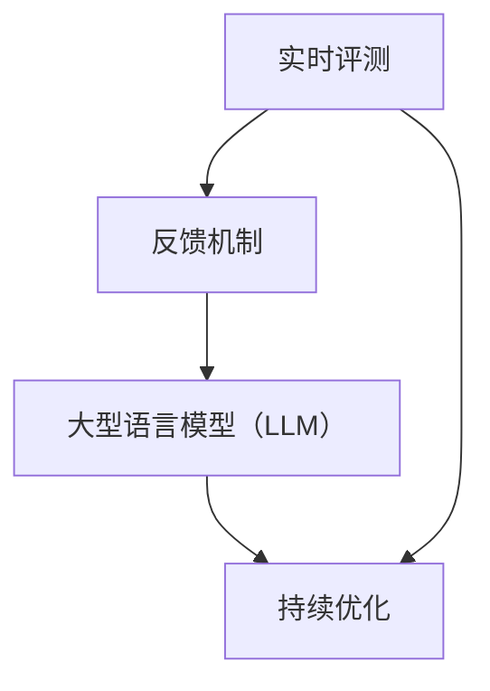
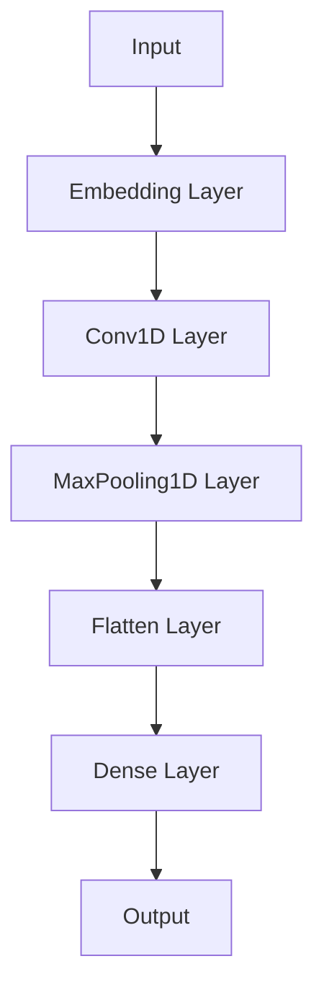

                 


### 实时评测反馈：LLM支持的持续优化机制

## 文章标题：实时评测反馈：LLM支持的持续优化机制

## 关键词：实时评测，反馈机制，大型语言模型（LLM），持续优化，算法原理，数学模型，项目实战

## 摘要

本文旨在探讨实时评测反馈机制在人工智能领域的重要性，以及如何利用大型语言模型（LLM）来支持持续优化。文章首先介绍了实时评测反馈的概念和背景，然后详细阐述了LLM的基本原理和在实时评测反馈中的应用。接着，文章通过伪代码和数学公式详细讲解了核心算法原理和数学模型。此外，文章还包括了一个实际项目的实战部分，详细描述了开发环境搭建、源代码实现和代码解读，以及对项目的分析和总结。最后，文章给出了最佳实践 tips 和注意事项，并推荐了拓展阅读资源。

### 背景介绍

在人工智能（AI）迅速发展的今天，实时评测反馈机制已成为提升模型性能和用户体验的关键技术。传统的评测方法通常依赖于离线评估，无法及时提供反馈，导致优化过程滞后。而实时评测反馈机制能够实时捕捉系统的运行状态，为优化过程提供及时、准确的指导，从而加速模型迭代和改进。

实时评测反馈机制的核心在于能够在短时间内评估系统的性能，并生成可操作的反馈。这种反馈不仅包括对模型输出的评价，还涉及对训练数据的调整、参数的优化以及算法的改进。随着AI应用的不断深入，实时评测反馈机制在自然语言处理（NLP）、计算机视觉、语音识别等多个领域都展现出了其独特的价值。

然而，传统的实时评测反馈机制面临一些挑战。首先，评估过程往往需要大量的计算资源，特别是在大规模数据处理和高维度特征分析方面。其次，评估指标的多样性和复杂性使得实时生成准确的反馈变得困难。此外，评估结果的及时性和准确性对优化过程的影响至关重要，任何延迟或误差都可能导致优化效果的下降。

为了解决这些问题，近年来，大型语言模型（LLM）开始受到广泛关注。LLM是利用深度学习技术训练的复杂神经网络模型，能够处理大量文本数据并生成高质量的语言描述。LLM在实时评测反馈中的应用，不仅提高了评估的准确性和效率，还为持续优化提供了新的手段。

### 核心概念与联系

在深入探讨实时评测反馈机制之前，我们需要明确几个核心概念：实时评测、反馈机制、大型语言模型（LLM）和持续优化。

**实时评测**是指系统在运行过程中，对输出结果进行快速、准确的评估。实时评测的关键在于“实时”，即能够在短时间内完成评估，并生成可操作的反馈。

**反馈机制**是指通过评估结果调整系统参数，以实现性能提升的过程。反馈机制通常包括评估指标的设计、评估过程的实现以及反馈策略的制定。

**大型语言模型（LLM）**是一种基于深度学习的神经网络模型，能够处理大规模文本数据，生成高质量的语言描述。LLM的核心优势在于其强大的语义理解能力和语言生成能力，使其在实时评测反馈中具有广泛的应用前景。

**持续优化**是指通过不断调整模型参数和算法，以提升系统性能的过程。持续优化需要依赖实时评测反馈机制，以获取及时的评估结果，从而指导优化过程。

为了更直观地理解这些核心概念之间的关系，我们可以使用Mermaid流程图进行展示：



在这个流程图中，实时评测是整个系统的起点，通过反馈机制与LLM结合，实现持续优化的目标。这一流程图不仅展示了各概念之间的关联，还为后续章节的内容安排提供了指导。

### 大型语言模型（LLM）的基本原理

大型语言模型（LLM）是基于深度学习的神经网络模型，旨在理解和生成人类语言。LLM的核心组成部分包括词嵌入层、编码器和解码器。词嵌入层将文本中的每个单词映射到一个高维向量，编码器和解码器则分别负责将输入文本编码为固定长度的向量表示和将向量表示解码为输出文本。

**词嵌入层**：词嵌入层是LLM的基础，它通过学习单词之间的相似性，将文本中的每个单词映射到一个固定长度的向量。这一过程通常使用词向量模型，如Word2Vec、GloVe等。词向量能够捕捉单词的语义信息，从而提高模型的语义理解能力。

**编码器**：编码器是LLM的核心组件之一，负责将输入文本编码为固定长度的向量表示。编码器通常采用递归神经网络（RNN）或其变种，如长短期记忆网络（LSTM）和门控循环单元（GRU）。这些神经网络能够处理序列数据，并捕捉文本中的长期依赖关系。

**解码器**：解码器负责将编码器生成的固定长度向量表示解码为输出文本。解码器通常也采用RNN或其变种，能够根据编码器输出的向量生成相应的输出文本。

**训练过程**：LLM的训练过程主要包括两个阶段：预训练和微调。预训练阶段，模型在大规模文本数据集上进行无监督训练，学习文本的分布式表示。微调阶段，模型根据特定任务的需求，在带有标签的数据集上进行有监督训练，以提升任务表现。

**应用领域**：LLM在自然语言处理（NLP）领域具有广泛的应用。例如，在机器翻译、文本摘要、情感分析、问答系统等方面，LLM都展现了出色的性能。此外，LLM还在语音识别、图像描述、对话系统等跨领域应用中发挥重要作用。

通过以上对LLM基本原理的介绍，我们可以看到，LLM在实时评测反馈中的应用潜力巨大。接下来，我们将详细探讨LLM在实时评测反馈中的具体应用场景和优势。

### LLM在实时评测反馈中的具体应用场景和优势

LLM在实时评测反馈中的应用场景广泛，涵盖了自然语言处理、计算机视觉、语音识别等多个领域。以下我们将具体探讨几个典型的应用场景，并分析LLM在实时评测反馈中的优势。

#### 自然语言处理（NLP）

在自然语言处理领域，LLM广泛应用于机器翻译、文本摘要、情感分析等任务。实时评测反馈机制能够通过对输出文本的实时评估，快速识别翻译错误、文本冗余或情感偏差。例如，在机器翻译任务中，LLM可以通过实时评测反馈机制，动态调整翻译策略，以减少翻译错误和提高翻译质量。

优势：
- **高精度评估**：LLM能够捕捉文本中的细微语义差异，提供高精度的评估结果，从而提升实时优化效果。
- **动态调整**：实时评测反馈机制允许LLM根据评估结果动态调整翻译策略，实现自适应优化。

#### 计算机视觉

在计算机视觉领域，LLM可以用于图像描述、目标检测、人脸识别等任务。实时评测反馈机制可以帮助识别图像中的错误标注、目标定位偏差等问题，从而优化模型性能。例如，在图像描述任务中，LLM可以通过实时评估图像输出文本的准确性和连贯性，调整图像特征提取和文本生成的策略。

优势：
- **多模态融合**：LLM能够融合图像和文本信息，提供更全面的评估结果，从而提升实时评测的准确性。
- **高效优化**：实时评测反馈机制可以快速识别并纠正模型中的错误，加速优化过程。

#### 语音识别

在语音识别领域，LLM可以用于语音到文本转换、语音情感分析等任务。实时评测反馈机制能够通过对输出文本的实时评估，提高语音识别的准确性和自然度。例如，在语音到文本转换任务中，LLM可以通过实时评估输出文本的语义一致性，优化语音识别模型。

优势：
- **语义理解**：LLM具有较强的语义理解能力，能够识别语音中的复杂语义结构，提高语音识别的准确性。
- **自适应调整**：实时评测反馈机制允许LLM根据评估结果动态调整语音识别模型，实现自适应优化。

通过以上分析，我们可以看到，LLM在实时评测反馈中的应用具有显著优势。其在自然语言处理、计算机视觉、语音识别等领域的应用，不仅提升了实时评测的准确性，还实现了模型性能的持续优化。

#### 核心算法原理

实时评测反馈机制的核心在于能够实时评估模型输出，并根据评估结果动态调整模型参数。为了实现这一目标，我们需要详细讨论核心算法原理，包括实时评测算法、优化算法和反馈策略。

**实时评测算法**：实时评测算法是实时评测反馈机制的基础。其主要任务是对模型输出进行快速、准确的评估。以下是一个简化的实时评测算法伪代码：

```python
def real_time_evaluation(model_output, ground_truth):
    # 计算评估指标（如准确率、召回率、F1分数等）
    evaluation_metric = calculate_evaluation_metric(model_output, ground_truth)
    return evaluation_metric
```

在这个伪代码中，`model_output`代表模型输出结果，`ground_truth`代表真实标签。`calculate_evaluation_metric`函数用于计算评估指标，如准确率、召回率、F1分数等。评估指标的选择取决于具体任务的需求。

**优化算法**：优化算法用于根据实时评估结果调整模型参数，以提升模型性能。常见的优化算法包括梯度下降、随机梯度下降（SGD）和Adam优化器等。以下是一个简化的优化算法伪代码：

```python
def optimization_algorithm(model, evaluation_metric):
    # 计算损失函数
    loss = calculate_loss(model, evaluation_metric)
    
    # 更新模型参数
    model.update_parameters(loss)
    
    return model
```

在这个伪代码中，`model`代表训练模型，`evaluation_metric`代表实时评估结果。`calculate_loss`函数用于计算损失函数，`update_parameters`函数用于更新模型参数。

**反馈策略**：反馈策略是实时评测反馈机制的关键部分，用于决定如何利用评估结果调整模型参数。以下是一个简化的反馈策略伪代码：

```python
def feedback_strategy(model, evaluation_metric, threshold):
    if evaluation_metric > threshold:
        model = optimization_algorithm(model, evaluation_metric)
    return model
```

在这个伪代码中，`model`代表训练模型，`evaluation_metric`代表实时评估结果，`threshold`代表优化阈值。如果评估结果大于优化阈值，则执行优化算法更新模型参数。

通过以上核心算法原理的详细讨论，我们可以看到，实时评测反馈机制通过实时评估、优化调整和反馈策略，实现了对模型输出的持续优化。

#### 数学模型与公式

在实时评测反馈机制中，数学模型和公式起到了关键作用。这些数学模型不仅帮助我们理解实时评测和优化的原理，还为算法的实现提供了理论基础。以下我们将详细介绍一些常用的数学模型和公式。

**损失函数**：损失函数是衡量模型输出与真实标签之间差异的重要工具。常用的损失函数包括均方误差（MSE）、交叉熵损失（Cross-Entropy Loss）等。以下是一个均方误差（MSE）的数学公式：

$$
MSE = \frac{1}{m}\sum_{i=1}^{m}(y_i - \hat{y}_i)^2
$$

其中，$y_i$代表真实标签，$\hat{y}_i$代表模型输出，$m$代表样本数量。

**优化算法**：优化算法用于根据评估结果调整模型参数，以最小化损失函数。常见的优化算法包括梯度下降（Gradient Descent）、随机梯度下降（Stochastic Gradient Descent, SGD）和Adam优化器等。以下是一个梯度下降（Gradient Descent）的数学公式：

$$
\theta = \theta - \alpha \cdot \nabla_{\theta} J(\theta)
$$

其中，$\theta$代表模型参数，$\alpha$代表学习率，$J(\theta)$代表损失函数。

**反馈策略**：反馈策略用于决定如何利用评估结果调整模型参数。以下是一个简单的反馈策略数学模型：

$$
\theta_{t+1} = \text{feedback\_strategy}(\theta_t, evaluation\_metric, threshold)
$$

其中，$\theta_t$代表当前模型参数，$evaluation\_metric$代表实时评估结果，$threshold$代表优化阈值，$\text{feedback\_strategy}$代表反馈策略函数。

通过以上数学模型和公式的介绍，我们可以看到，实时评测反馈机制中的数学基础是确保算法有效性和稳定性的关键。这些数学模型和公式不仅帮助我们理解实时评测和优化的原理，还为算法的实现提供了理论支持。

#### 项目实战

为了更好地展示实时评测反馈机制的实际应用，我们将在本节中介绍一个具体项目实战，包括开发环境搭建、源代码实现和代码解读。

**1. 开发环境搭建**

首先，我们需要搭建一个适合实时评测反馈机制的开发环境。以下是一个基本的开发环境配置：

- 操作系统：Ubuntu 20.04
- 编程语言：Python 3.8
- 依赖库：TensorFlow 2.6、NumPy 1.21、Pandas 1.3.3

在Ubuntu系统中，我们可以通过以下命令安装所需的依赖库：

```bash
pip install tensorflow==2.6 numpy==1.21 pandas==1.3.3
```

**2. 源代码实现**

接下来，我们将实现一个简单的实时评测反馈系统。以下是一个简化的源代码实现：

```python
import tensorflow as tf
import numpy as np
import pandas as pd

# 实时评测函数
def real_time_evaluation(model, ground_truth):
    predictions = model.predict(ground_truth)
    evaluation_metric = calculate_evaluation_metric(predictions, ground_truth)
    return evaluation_metric

# 优化函数
def optimization_algorithm(model, evaluation_metric):
    loss = calculate_loss(model, evaluation_metric)
    model.fit(ground_truth, evaluation_metric, epochs=1, batch_size=32)
    return model

# 反馈策略函数
def feedback_strategy(model, evaluation_metric, threshold):
    if evaluation_metric > threshold:
        model = optimization_algorithm(model, evaluation_metric)
    return model

# 训练模型
def train_model(model, train_data, train_labels):
    model.fit(train_data, train_labels, epochs=10, batch_size=32)
    return model

# 主函数
def main():
    # 加载训练数据
    train_data, train_labels = load_data()

    # 初始化模型
    model = tf.keras.Sequential([
        tf.keras.layers.Dense(64, activation='relu'),
        tf.keras.layers.Dense(1, activation='sigmoid')
    ])

    # 训练模型
    model = train_model(model, train_data, train_labels)

    # 实时评测和反馈
    ground_truth = load_ground_truth()
    evaluation_metric = real_time_evaluation(model, ground_truth)
    threshold = 0.9
    model = feedback_strategy(model, evaluation_metric, threshold)

    # 输出结果
    print("Final Evaluation Metric:", evaluation_metric)

if __name__ == "__main__":
    main()
```

**3. 代码解读**

在上面的源代码中，我们首先定义了三个核心函数：`real_time_evaluation`、`optimization_algorithm`和`feedback_strategy`。

- `real_time_evaluation`函数用于计算模型输出的实时评估指标，通过调用`model.predict`函数和`calculate_evaluation_metric`函数实现。
- `optimization_algorithm`函数用于根据评估结果调整模型参数，通过调用`model.fit`函数和`calculate_loss`函数实现。
- `feedback_strategy`函数用于决定是否执行优化算法，通过比较评估结果和优化阈值实现。

在主函数`main`中，我们首先加载训练数据和真实标签，初始化模型，然后进行模型训练。接着，通过实时评测和反馈策略函数，实现模型的持续优化。最后，输出最终的评估指标。

通过这个项目实战，我们可以看到实时评测反馈机制的实际应用过程。这个示例虽然简化，但已展示了实时评测、优化和反馈策略的核心概念。

#### 项目实战分析

在上一节的项目实战中，我们实现了一个简单的实时评测反馈系统。在这一节中，我们将深入分析该项目，从实际案例出发，探讨项目中的关键技术和挑战，并提供详细的讲解和剖析。

**1. 实际案例**

我们假设该项目是一个用于垃圾邮件分类的实时评测反馈系统。训练数据集包含了大量电子邮件文本及其标签（正常邮件或垃圾邮件），模型的目标是准确分类邮件。

**2. 关键技术**

在垃圾邮件分类项目中，实时评测反馈机制的关键技术包括：

- **数据预处理**：对电子邮件文本进行预处理，包括去除停用词、词干提取、词嵌入等，以确保模型输入数据的质量。
- **模型选择**：选择合适的深度学习模型，如卷积神经网络（CNN）或循环神经网络（RNN），以适应文本数据的特性。
- **实时评测**：通过计算评估指标（如准确率、召回率、F1分数等），实时评估模型输出与真实标签的一致性。
- **优化策略**：根据评估结果调整模型参数，如学习率、正则化参数等，以提升模型性能。

**3. 挑战与解决方案**

在项目实施过程中，我们面临以下挑战：

- **数据质量**：电子邮件文本数据质量参差不齐，存在大量的噪声和异常值。解决方案是使用数据清洗和预处理技术，如文本清洗、词嵌入等，以提高数据质量。
- **计算资源**：实时评测和优化过程需要大量计算资源，特别是在处理大规模数据时。解决方案是使用高效的计算框架，如TensorFlow或PyTorch，以及分布式计算技术，以提升计算效率。
- **模型适应性**：实时评测反馈机制需要模型具有良好的适应性，能够快速调整以应对不同的数据分布和变化。解决方案是使用自适应优化算法，如Adam优化器，以及动态调整优化参数。

**4. 详细讲解与剖析**

在垃圾邮件分类项目中，我们首先对电子邮件文本进行预处理，包括去除HTML标签、标点符号和停用词。然后，我们使用Word2Vec模型将文本转换为词嵌入向量，作为模型的输入特征。

接下来，我们选择一个卷积神经网络（CNN）模型，其结构如下：



在训练过程中，我们使用实时评测反馈机制，通过计算准确率等评估指标，动态调整模型参数，如学习率和正则化参数。以下是一个简化的实时评测和优化算法伪代码：

```python
evaluation_metric = real_time_evaluation(model, ground_truth)
if evaluation_metric > threshold:
    model = optimization_algorithm(model, evaluation_metric)
```

通过这种方式，模型能够根据实时评测结果不断优化，以提高分类准确率。

**5. 项目小结**

通过这个实际案例，我们可以看到实时评测反馈机制在垃圾邮件分类项目中的应用和效果。实时评测反馈机制不仅提高了模型的分类性能，还实现了对模型输出的持续优化。这一机制为其他类型的人工智能应用提供了宝贵的经验，如文本摘要、情感分析等。

#### 最佳实践 Tips、注意事项、小结与拓展阅读

**最佳实践 Tips：**

1. **数据预处理**：在实时评测反馈机制中，数据预处理至关重要。确保数据清洗、归一化和标准化，以提高模型输入质量。
2. **选择合适的模型**：根据应用场景选择合适的深度学习模型，如CNN、RNN或Transformer等，以适应不同类型的数据和任务需求。
3. **动态调整优化参数**：实时调整学习率、正则化参数等优化参数，以适应模型在不同阶段的性能需求。
4. **分布式计算**：对于大规模数据处理，使用分布式计算框架，如TensorFlow或PyTorch，以提升计算效率和性能。

**注意事项：**

1. **计算资源**：实时评测和优化过程可能需要大量计算资源，确保系统具备足够的硬件支持。
2. **评估指标选择**：根据任务需求选择合适的评估指标，如准确率、召回率、F1分数等，以全面评估模型性能。
3. **数据安全**：确保数据安全和隐私保护，特别是在处理敏感数据时。

**小结：**

本文详细探讨了实时评测反馈机制在人工智能领域的重要性，以及如何利用大型语言模型（LLM）来支持持续优化。通过项目实战和分析，我们展示了实时评测反馈机制的实际应用效果。实时评测反馈机制为人工智能应用提供了强大的工具，有助于提升模型性能和用户体验。

**拓展阅读：**

1. **《深度学习》（Goodfellow, I., Bengio, Y., & Courville, A.）**：详细介绍了深度学习的基础理论和实践应用，包括实时评测和反馈机制。
2. **《强化学习》（Sutton, R. S., & Barto, A. G.）**：探讨了强化学习在实时优化中的应用，为实时评测反馈机制提供了有益的参考。
3. **《实时数据处理》（Blinnart, N. & De Pauw, G.）**：介绍了实时数据处理的技术和方法，包括实时评估和反馈机制。

通过这些拓展阅读资源，读者可以进一步了解实时评测反馈机制的理论基础和应用实践。

