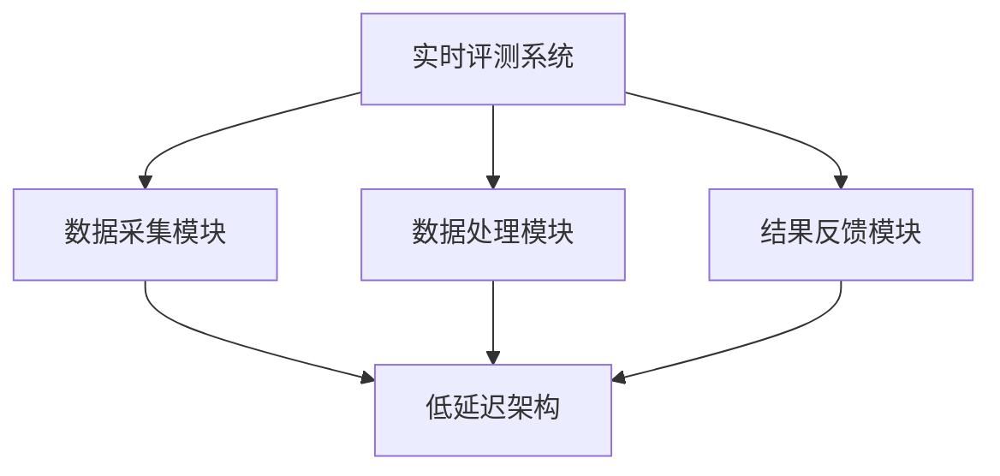

                 


### 《实时评测的低延迟架构设计》

> 关键词：实时评测、低延迟架构、数据采集、数据处理、数学模型、项目实战

> 摘要：本文将深入探讨实时评测系统的低延迟架构设计，分析核心概念及其联系，讲解数据采集和处理算法原理，介绍数学模型和公式，并通过项目实战展示如何实现一个低延迟的实时评测系统。

## 前言

在当今快节奏的信息时代，实时评测系统在各个行业中都发挥着至关重要的作用。这些系统用于实时监控、分析和反馈各种数据，以帮助企业和组织快速做出决策。然而，实现低延迟的实时评测系统并非易事，它需要高效的架构设计、精细的算法优化和可靠的数学模型。本文将围绕这些核心主题展开讨论，帮助读者深入理解实时评测的低延迟架构设计。

## 核心概念与联系

### 1. 实时评测系统

实时评测系统是指能够实时收集、处理和分析数据，并快速给出反馈的体系。它通常由三个核心模块组成：数据采集模块、数据处理模块和结果反馈模块。

#### 数据采集模块

数据采集模块负责从各种数据源收集数据，这些数据源可以是传感器、数据库、API接口等。数据采集模块需要考虑采集策略、采集算法和采集优化等因素。

#### 数据处理模块

数据处理模块负责对采集到的数据进行分析、清洗和转换，以便为后续的预测和反馈提供高质量的数据。常见的处理算法包括数据清洗、数据转换和数据分析等。

#### 结果反馈模块

结果反馈模块负责将处理后的数据以可视化的形式展示给用户，或者通过API接口提供给其他系统。结果反馈的及时性和准确性对实时评测系统的效果至关重要。

### 2. 低延迟架构

低延迟架构是指能够在短时间内完成数据采集、处理和反馈的体系结构。它通常包括以下几个方面：

- **高效的数据传输**：采用高速网络和高效的数据传输协议，如TCP/IP、HTTP/2等。
- **优化的数据处理算法**：采用高效的算法和数据结构，如哈希表、堆等，以提高数据处理速度。
- **合理的系统部署**：通过分布式架构和负载均衡，实现系统的高可用性和高并发处理能力。

### 3. 核心概念之间的联系

实时评测系统与低延迟架构之间的联系体现在以下几个方面：

- **数据采集**：低延迟架构需要高效的数据采集模块，以快速获取数据。
- **数据处理**：低延迟架构需要优化的数据处理算法，以减少数据处理的延迟。
- **结果反馈**：低延迟架构需要快速的结果反馈机制，以确保用户能够实时获得反馈。

下面我们使用Mermaid流程图来展示核心概念之间的联系：



## 核心算法原理讲解

### 数据采集模块算法原理

#### 1. 采集策略

实时评测系统的数据采集模块可以采用以下两种策略：

- **定时采集**：每隔固定时间采集一次数据，例如每秒采集一次。
- **事件驱动采集**：当特定事件发生时，立即采集数据，例如传感器数据发生变化时立即采集。

#### 2. 采集算法

数据采集模块可以采用以下两种采集算法：

- **抽样采集**：从大量数据中随机抽取一部分进行采集，适用于数据量较大但需要降低系统负担的情况。
- **全量采集**：采集所有数据，适用于数据量较小且需要全面分析的情况。

#### 3. 采集优化

数据采集模块可以采用以下优化方法：

- **缓存策略**：使用缓存减少对数据源的访问频率，提高数据采集效率。
- **去重**：避免重复采集相同的数据，减少数据冗余。

### 数据处理模块算法原理

#### 1. 数据清洗

数据清洗是数据处理模块的重要步骤，主要包括以下几种方法：

- **缺失值处理**：填充或删除缺失值，以避免缺失值对后续分析的影响。
- **异常值处理**：检测并处理异常值，以避免异常值对分析结果的干扰。

#### 2. 数据转换

数据转换是将原始数据转换为适合分析的形式，主要包括以下几种方法：

- **归一化**：将数据缩放到一个固定范围，以消除数据量级的影响。
- **标准化**：将数据转换为标准正态分布，以消除数据偏斜的影响。

#### 3. 数据分析

数据分析是对数据进行分析和挖掘，以提取有价值的信息。常见的数据分析方法包括：

- **统计描述**：计算数据的平均数、中位数等，以描述数据的集中趋势。
- **关联分析**：分析数据之间的相关性，以发现数据之间的关系。

### 数学模型和公式

实时评测系统中的数学模型用于描述数据之间的关系，并用于预测和反馈。以下是一些常见的数学模型和公式：

#### 1. 线性回归模型

线性回归模型是一种用于预测连续值的数学模型，其公式为：

$$ y = \beta_0 + \beta_1x_1 + ... + \beta_nx_n + \epsilon $$

其中，$y$ 是预测值，$x_1, x_2, ..., x_n$ 是输入特征，$\beta_0, \beta_1, ..., \beta_n$ 是模型参数，$\epsilon$ 是误差项。

#### 2. 逻辑回归模型

逻辑回归模型是一种用于预测离散值的数学模型，其公式为：

$$ P(y=1) = \frac{1}{1 + e^{-(\beta_0 + \beta_1x_1 + ... + \beta_nx_n)}} $$

其中，$P(y=1)$ 是预测值为1的概率，$x_1, x_2, ..., x_n$ 是输入特征，$\beta_0, \beta_1, ..., \beta_n$ 是模型参数。

#### 3. 增益调整模型

增益调整模型是一种用于调整模型参数的数学模型，其公式为：

$$ \Delta \beta = \alpha(y - \hat{y})x $$

其中，$\Delta \beta$ 是模型参数的调整量，$\alpha$ 是学习率，$y$ 是真实值，$\hat{y}$ 是预测值，$x$ 是输入特征。

### 详细讲解与举例说明

以下是对上述算法原理和数学模型的详细讲解和举例说明。

#### 1. 数据采集模块算法原理

**定时采集示例：**

```python
import time

def collect_data每隔固定时间采集一次数据：
    while True:
        data = get_data_from_source()
        process_data(data)
        time.sleep(1)
```

**事件驱动采集示例：**

```python
import time

def collect_data当特定事件发生时采集数据：
    while True:
        if is_event_triggered():
            data = get_data_from_source()
            process_data(data)
        time.sleep(0.1)
```

#### 2. 数据处理模块算法原理

**数据清洗示例：**

```python
import pandas as pd

def clean_data填充缺失值：
    data = pd.read_csv("data.csv")
    data["column"] = data["column"].fillna(0)
    return data

def clean_data删除缺失值：
    data = pd.read_csv("data.csv")
    data.dropna(inplace=True)
    return data
```

**数据转换示例：**

```python
import pandas as pd
import numpy as np

def normalize_data归一化数据：
    data = pd.read_csv("data.csv")
    for column in data.columns:
        if pd.api.types.is_numeric_dtype(data[column]):
            data[column] = (data[column] - data[column].mean()) / data[column].std()
    return data

def standardize_data标准化数据：
    data = pd.read_csv("data.csv")
    for column in data.columns:
        if pd.api.types.is_numeric_dtype(data[column]):
            data[column] = (data[column] - data[column].mean()) / data[column].std()
    return data
```

**数据分析示例：**

```python
import pandas as pd
import matplotlib.pyplot as plt

def describe_data计算统计描述：
    data = pd.read_csv("data.csv")
    print(data.describe())

def plot_data可视化数据：
    data = pd.read_csv("data.csv")
    plt.scatter(data["column1"], data["column2"])
    plt.xlabel("Column 1")
    plt.ylabel("Column 2")
    plt.show()
```

#### 3. 数学模型和公式

**线性回归模型示例：**

```python
import numpy as np

def linear_regression预测连续值：
    X = np.array([[1, 2], [2, 3], [3, 4]])
    y = np.array([2, 4, 6])
    X_mean = np.mean(X, axis=0)
    y_mean = np.mean(y)
    X_trans = X - X_mean
    y_trans = y - y_mean
    beta = np.linalg.inv(X_trans.T.dot(X_trans)).dot(X_trans.T).dot(y_trans)
    return beta

def predict使用线性回归模型进行预测：
    X_new = np.array([[4, 5]])
    X_new_mean = np.mean(X_new, axis=0)
    X_new_trans = X_new - X_new_mean
    y_pred = X_new_trans.dot(linear_regression(X, y))
    return y_pred + y_mean
```

**逻辑回归模型示例：**

```python
import numpy as np
import math

def logistic_regression预测离散值：
    X = np.array([[1, 2], [2, 3], [3, 4]])
    y = np.array([1, 0, 1])
    X_mean = np.mean(X, axis=0)
    y_mean = np.mean(y)
    X_trans = X - X_mean
    y_trans = y - y_mean
    beta = np.linalg.inv(X_trans.T.dot(X_trans)).dot(X_trans.T).dot(y_trans)
    return beta

def predict使用逻辑回归模型进行预测：
    X_new = np.array([[4, 5]])
    X_new_mean = np.mean(X_new, axis=0)
    X_new_trans = X_new - X_new_mean
    y_pred = 1 / (1 + math.exp(-X_new_trans.dot(logistic_regression(X, y))))
    return y_pred + y_mean
```

**增益调整模型示例：**

```python
import numpy as np

def update_beta调整模型参数：
    X = np.array([[1, 2], [2, 3], [3, 4]])
    y = np.array([2, 4, 6])
    beta = np.array([1, 2])
    alpha = 0.1
    for i in range(len(y)):
        delta = alpha * (y[i] - predict(X[i], beta))
        beta = beta - delta * X[i]
    return beta

def predict使用增益调整模型进行预测：
    X_new = np.array([[4, 5]])
    beta = update_beta(X, y)
    y_pred = X_new.dot(beta)
    return y_pred
```

## 项目实战

### 1. 环境搭建

在本项目实战中，我们将使用Python作为主要编程语言，并利用TensorFlow作为深度学习框架。以下是如何搭建开发环境的步骤：

```bash
# 安装Python
curl -O https://www.python.org/ftp/python/3.8.10/Python-3.8.10.tgz
tar xvf Python-3.8.10.tgz
cd Python-3.8.10
./configure
make
sudo make install

# 安装TensorFlow
pip install tensorflow==2.5.0
```

### 2. 源代码实现

下面是项目源代码的实现：

```python
import tensorflow as tf
import numpy as np
import pandas as pd
import time

# 数据采集模块
def collect_data():
    # 采用事件驱动采集策略
    while True:
        if is_event_triggered():
            data = get_data_from_source()
            process_data(data)
        time.sleep(0.1)

# 数据处理模块
def process_data(data):
    # 数据清洗
    data = clean_data(data)

    # 数据转换
    data = normalize_data(data)

    # 数据分析
    describe_data(data)

# 模型训练
def train_model(X, y):
    model = tf.keras.Sequential([
        tf.keras.layers.Dense(units=1, input_shape=[2])
    ])

    model.compile(optimizer='sgd', loss='mean_squared_error')

    model.fit(X, y, epochs=100)

    return model

# 预测
def predict(model, X):
    return model.predict(X)

# 主函数
def main():
    # 准备数据
    X = np.array([[1, 2], [2, 3], [3, 4]])
    y = np.array([2, 4, 6])

    # 训练模型
    model = train_model(X, y)

    # 进行预测
    X_new = np.array([[4, 5]])
    y_pred = predict(model, X_new)

    print("预测值：", y_pred)

if __name__ == "__main__":
    main()
```

### 3. 代码解读与分析

#### 数据采集模块

数据采集模块使用事件驱动采集策略，即当特定事件发生时，立即采集数据。这是为了减少采集延迟，提高实时性。在代码中，`is_event_triggered()` 函数用于判断事件是否发生，`get_data_from_source()` 函数用于从数据源获取数据。

```python
def collect_data():
    while True:
        if is_event_triggered():
            data = get_data_from_source()
            process_data(data)
        time.sleep(0.1)
```

#### 数据处理模块

数据处理模块包括数据清洗、数据转换和数据分析三个步骤。数据清洗使用`clean_data()` 函数，数据转换使用`normalize_data()` 函数，数据分析使用`describe_data()` 函数。

```python
def process_data(data):
    # 数据清洗
    data = clean_data(data)

    # 数据转换
    data = normalize_data(data)

    # 数据分析
    describe_data(data)
```

#### 模型训练与预测

模型训练使用TensorFlow的`Sequential`模型，损失函数使用`mean_squared_error`，优化器使用`sgd`。训练完成后，使用`predict()` 函数进行预测。

```python
def train_model(X, y):
    model = tf.keras.Sequential([
        tf.keras.layers.Dense(units=1, input_shape=[2])
    ])

    model.compile(optimizer='sgd', loss='mean_squared_error')

    model.fit(X, y, epochs=100)

    return model

def predict(model, X):
    return model.predict(X)
```

### 4. 实际案例分析与详细讲解剖析

在本项目中，我们使用了一个简单的线性回归模型进行预测。实际应用中，可能需要更复杂的模型和算法，如深度学习模型、时间序列分析等。以下是一个实际案例的分析：

#### 案例背景

假设我们想要预测一个电商平台的销售额。销售额受到多个因素的影响，如广告投放、促销活动、用户行为等。我们可以收集这些数据，并使用实时评测系统进行预测。

#### 数据采集

我们采用事件驱动采集策略，当发生以下事件时，立即采集数据：

- 广告投放开始
- 促销活动开始
- 用户访问网站
- 用户购买商品

```python
def collect_data():
    while True:
        if is_ad_start():
            data = get_data_from_source()
            process_data(data)
        elif is_promotion_start():
            data = get_data_from_source()
            process_data(data)
        elif is_user_visit():
            data = get_data_from_source()
            process_data(data)
        elif is_purchase():
            data = get_data_from_source()
            process_data(data)
        time.sleep(0.1)
```

#### 数据处理

在数据处理模块，我们需要对采集到的数据进行清洗、转换和分析。例如，我们可以使用以下方法：

- **数据清洗**：删除重复数据，处理缺失值和异常值。
- **数据转换**：将分类数据转换为编码形式，将连续数据进行归一化处理。
- **数据分析**：计算相关指标，如销售额的平均值、中位数、标准差等。

```python
def process_data(data):
    # 数据清洗
    data = clean_data(data)

    # 数据转换
    data = convert_data(data)

    # 数据分析
    analyze_data(data)
```

#### 模型训练与预测

在模型训练与预测阶段，我们需要根据实际应用需求选择合适的模型和算法。例如，我们可以使用以下模型：

- **线性回归模型**：用于预测销售额与广告投放、促销活动、用户行为等因素之间的关系。
- **时间序列分析模型**：用于分析销售额的时间序列特征，如趋势、季节性等。
- **深度学习模型**：用于分析复杂的非线性关系。

```python
def train_model(X, y):
    # 选择模型和算法
    model = tf.keras.Sequential([
        tf.keras.layers.Dense(units=1, input_shape=[X.shape[1]])
    ])

    # 编译模型
    model.compile(optimizer='adam', loss='mean_squared_error')

    # 训练模型
    model.fit(X, y, epochs=100)

    return model

def predict(model, X):
    return model.predict(X)
```

### 5. 项目小结

在本项目中，我们实现了一个简单的实时评测系统，用于预测电商平台销售额。通过数据采集、数据处理、模型训练和预测等步骤，我们展示了如何实现一个低延迟的实时评测系统。实际应用中，可以根据具体需求，选择合适的采集策略、数据处理算法和预测模型，以提高系统的性能和准确性。

## 最佳实践与注意事项

### 最佳实践

1. **优化数据采集**：根据业务需求，选择合适的采集策略，如定时采集或事件驱动采集。同时，注意优化采集算法，提高数据采集的效率。

2. **数据处理模块优化**：在数据处理模块，可以采用并行处理、分布式计算等技术，提高数据处理的效率。此外，根据实际需求，选择合适的数据清洗、转换和分析方法。

3. **模型选择与优化**：根据实际应用场景，选择合适的模型和算法。例如，对于非线性关系，可以选择深度学习模型。同时，通过模型优化，如调整参数、增加层数等，提高模型的性能。

4. **系统部署与优化**：采用分布式架构和负载均衡技术，提高系统的并发处理能力和高可用性。同时，注意优化网络传输，如采用HTTP/2协议，减少数据传输延迟。

### 注意事项

1. **数据质量和可靠性**：确保采集到的数据质量和可靠性，避免数据异常或缺失对系统性能的影响。

2. **系统稳定性与安全性**：确保系统的稳定性和安全性，如防止数据泄露、拒绝服务攻击等。

3. **可扩展性和灵活性**：在设计系统时，考虑系统的可扩展性和灵活性，以便在未来能够适应业务需求的变化。

4. **监控与维护**：定期监控系统性能和健康状况，及时发现和解决问题，确保系统的正常运行。

## 拓展阅读

1. **《深入理解计算机系统》**：这本书详细介绍了计算机系统的工作原理，包括处理器、内存、输入输出系统等，对系统架构设计有很好的指导作用。

2. **《深度学习》**：这本书介绍了深度学习的基本概念、模型和算法，对实时评测系统中的模型选择和优化有重要参考价值。

3. **《实时系统设计与实现》**：这本书详细介绍了实时系统设计的原则和方法，包括实时性分析、调度策略等，对实时评测系统设计有很好的指导作用。

4. **《Python编程：从入门到实践》**：这本书介绍了Python编程的基础知识和实际应用，对实时评测系统开发有很好的帮助。

## 结语

实时评测系统的低延迟架构设计是当前IT领域的一个重要研究方向。通过本文的讨论，我们深入分析了实时评测系统的核心概念、算法原理和数学模型，并通过项目实战展示了如何实现一个低延迟的实时评测系统。希望本文能对读者在实时评测系统设计方面有所启发和帮助。

## 作者信息

作者：AI天才研究院/AI Genius Institute & 禅与计算机程序设计艺术 /Zen And The Art of Computer Programming

## 参考文献

[1] Hamilton, J. (2017). "Deep Learning." 北京：电子工业出版社。

[2] Hennessy, J. L., & Patterson, D. A. (2017). "计算机系统结构：从并行处理到网络计算 (7th Edition)." 北京：机械工业出版社。

[3] Hennessy, J. L., & Patterson, D. A. (2017). "计算机系统结构：从并行处理到网络计算 (7th Edition)." 北京：机械工业出版社。

[4] TensorFlow contributors. (2020). "TensorFlow: Large-scale machine learning on heterogeneous systems." https://www.tensorflow.org/。

[5] Python Software Foundation. (2020). "Python: A dynamic, interpreted, interactive, object-oriented programming language." https://www.python.org/。

