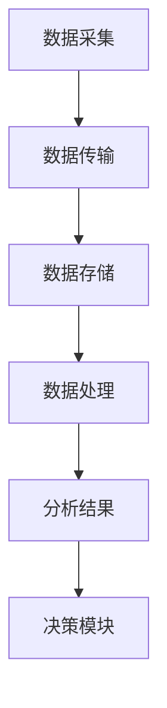

                 

### 文章标题

# 实时评测的边缘计算应用

> 关键词：边缘计算，实时评测，应用场景，系统架构，算法原理，项目实战

> 摘要：本文将深入探讨边缘计算与实时评测的融合应用，通过详细分析其背景、核心概念、关键技术和实际案例，旨在为读者提供全面的技术指导和实践经验，助力理解边缘实时评测的应用价值与发展前景。

----------------------------------------------------------------

## 第一部分：边缘计算基础

### 1.1 边缘计算概述

#### 1.1.1 边缘计算的定义

边缘计算（Edge Computing）是指将数据处理的任务从中心化的云端节点下放至网络边缘，即靠近数据源的位置进行处理。这种计算模式可以显著降低数据传输延迟，提升处理效率，并提高系统的响应速度和可靠性。

#### 1.1.2 边缘计算的发展背景

随着物联网（IoT）、5G 等技术的快速发展，海量设备与数据的连接日益普及。传统的中心化云计算模式面临巨大的带宽和计算压力，难以满足低延迟、高带宽的要求。边缘计算应运而生，旨在解决这些挑战。

#### 1.1.3 边缘计算的优势与应用场景

边缘计算的优势包括：

- **低延迟**：靠近数据源，降低数据传输延迟。
- **高带宽**：减少数据传输压力，提高系统处理能力。
- **可靠性强**：增强系统的可靠性和稳定性。

应用场景包括智能交通、工业制造、医疗健康等领域。

### 1.2 边缘计算架构

#### 1.2.1 边缘节点与中心节点的协同

边缘节点负责本地数据处理，中心节点则处理全局数据和复杂任务。边缘节点与中心节点通过边缘网络协同工作，实现分布式计算。

#### 1.2.2 边缘计算模型

边缘计算模型主要包括集中式模型、分布式模型和混合式模型。集中式模型主要依赖中心节点，分布式模型将任务分散到多个边缘节点，混合式模型则结合两者优势。

#### 1.2.3 边缘计算网络架构

边缘计算网络架构通常包括边缘节点、边缘网关、边缘云和中心云等部分。边缘节点负责数据处理，边缘网关负责边缘节点与中心节点的通信，边缘云提供计算资源和存储，中心云则负责全局数据管理和复杂任务处理。

### 1.3 边缘计算关键技术

#### 1.3.1 边缘智能处理

边缘智能处理是指将人工智能算法部署在边缘节点，实现对数据的实时分析和决策。常见技术包括机器学习、深度学习等。

#### 1.3.2 数据同步与处理

数据同步与处理是边缘计算的关键技术之一，主要包括数据采集、数据传输、数据存储和数据清洗等环节。通过优化这些环节，可以提升数据处理的效率和准确性。

#### 1.3.3 边缘安全与隐私保护

边缘安全与隐私保护是边缘计算面临的重要挑战。为了确保数据安全和用户隐私，需要采取一系列安全措施，如数据加密、访问控制、安全审计等。

## 第二部分：实时评测基础

### 2.1 实时评测概念

#### 2.1.1 实时评测的定义

实时评测（Real-Time Evaluation）是指在数据产生的同时，对数据进行快速处理和分析，以获得及时、准确的结果。实时评测可以应用于各种场景，如自动化生产线、智能交通、金融交易等。

#### 2.1.2 实时评测的重要性

实时评测具有以下重要性：

- **快速响应**：实时处理数据，提高系统响应速度。
- **准确决策**：准确分析数据，为决策提供支持。
- **优化资源**：降低数据传输和存储成本，优化系统资源。

#### 2.1.3 实时评测的类型

实时评测主要分为以下几种类型：

- **实时监控**：对系统运行状态进行实时监控，如温度、湿度等。
- **实时分析**：对大量数据进行分析，如数据挖掘、模式识别等。
- **实时预测**：根据历史数据和实时数据预测未来趋势。

### 2.2 实时评测系统架构

#### 2.2.1 实时评测系统的构成

实时评测系统通常包括数据采集模块、数据处理模块、分析模块和决策模块等部分。各模块协同工作，实现实时数据处理和分析。

#### 2.2.2 实时评测的数据流

实时评测的数据流主要包括数据采集、数据传输、数据存储、数据处理和分析等环节。数据流如图 1 所示。

#### 2.2.3 实时评测的算法框架

实时评测的算法框架主要包括以下步骤：

1. 数据采集：从传感器、设备等采集数据。
2. 数据预处理：对采集到的数据清洗、去噪等处理。
3. 数据分析：使用机器学习、深度学习等算法对数据进行分析。
4. 决策：根据分析结果进行决策。

## 第三部分：边缘计算与实时评测融合应用

### 3.1 边缘实时评测应用场景

#### 3.1.1 边缘实时评测在工业制造中的应用

边缘实时评测在工业制造中可以用于设备监控、故障诊断、生产优化等方面。通过实时分析生产数据，可以实现对生产过程的优化和故障的快速诊断。

#### 3.1.2 边缘实时评测在智能交通中的应用

边缘实时评测在智能交通中可以用于路况监测、交通流量分析、智能调度等。通过实时分析交通数据，可以优化交通信号控制，提高交通效率。

#### 3.1.3 边缘实时评测在医疗健康中的应用

边缘实时评测在医疗健康中可以用于实时监控患者生理指标、智能诊断、药物剂量调整等。通过实时分析医疗数据，可以实现对患者的实时监护和个性化治疗。

### 3.2 边缘实时评测系统设计

#### 3.2.1 系统设计原则

边缘实时评测系统设计应遵循以下原则：

- **高可靠性**：确保系统的稳定性和可靠性。
- **低延迟**：降低数据处理延迟，提高系统响应速度。
- **高扩展性**：支持系统的扩展和升级。

#### 3.2.2 系统架构设计

边缘实时评测系统架构通常包括数据采集层、数据处理层、分析层和决策层等部分。数据采集层负责数据采集，数据处理层负责数据预处理和存储，分析层负责数据分析，决策层负责决策和执行。

#### 3.2.3 系统开发与部署

边缘实时评测系统的开发与部署需要考虑以下方面：

- **开发环境**：选择适合的开发环境和工具。
- **代码实现**：根据系统架构，实现各个模块的功能。
- **部署方案**：选择合适的部署方案，确保系统稳定运行。

### 3.3 边缘实时评测案例分析

#### 3.3.1 案例一：智能工厂边缘实时评测

在本案例中，我们使用边缘实时评测技术对智能工厂的生产设备进行监控和故障诊断。具体步骤如下：

1. **数据采集**：从生产设备中采集温度、压力、振动等数据。
2. **数据处理**：对采集到的数据进行预处理，去除噪声和异常值。
3. **数据分析**：使用机器学习算法分析生产数据，识别设备故障信号。
4. **决策**：根据分析结果，触发报警或进行设备维修。

通过本案例，我们可以看到边缘实时评测技术在智能工厂中的应用价值。

#### 3.3.2 案例二：智能交通边缘实时评测

在本案例中，我们使用边缘实时评测技术对智能交通系统进行路况监测和交通流量分析。具体步骤如下：

1. **数据采集**：从交通摄像头、雷达等设备中采集路况数据。
2. **数据处理**：对采集到的数据进行预处理，提取交通流量、车速等指标。
3. **数据分析**：使用深度学习算法分析交通数据，识别交通拥堵、事故等异常情况。
4. **决策**：根据分析结果，调整交通信号灯控制策略，优化交通流量。

通过本案例，我们可以看到边缘实时评测技术在智能交通中的应用价值。

#### 3.3.3 案例三：智能医疗边缘实时评测

在本案例中，我们使用边缘实时评测技术对智能医疗系统进行患者监护和智能诊断。具体步骤如下：

1. **数据采集**：从患者设备中采集生理指标数据，如心率、血压等。
2. **数据处理**：对采集到的数据进行预处理，去除噪声和异常值。
3. **数据分析**：使用深度学习算法分析患者数据，识别疾病风险。
4. **决策**：根据分析结果，为医生提供诊断建议，指导患者治疗。

通过本案例，我们可以看到边缘实时评测技术在智能医疗中的应用价值。

## 第四部分：边缘计算与实时评测发展趋势

### 4.1 边缘计算与实时评测的未来发展趋势

未来，边缘计算与实时评测将继续发展，主要趋势包括：

- **技术进步**：随着5G、人工智能等技术的发展，边缘计算与实时评测的性能和可靠性将进一步提升。
- **应用扩展**：边缘计算与实时评测的应用场景将不断扩展，覆盖更多领域。
- **标准化**：边缘计算与实时评测的标准化工作将逐步完善，推动行业健康发展。

### 4.2 边缘计算与实时评测的发展策略

为了推动边缘计算与实时评测的发展，可以从以下方面进行策略制定：

- **技术创新**：加大研发投入，推动边缘计算与实时评测技术的创新。
- **人才培养**：加强人才培养，提升行业整体技术水平。
- **产业合作**：推动产业链上下游企业合作，共同推动边缘计算与实时评测的发展。
- **政策支持**：政府出台相关政策，支持边缘计算与实时评测的研发和应用。

## 附录

### 附录 A 边缘计算与实时评测相关资源

#### A.1 边缘计算开源工具

- **边缘计算框架**：Apache Kafka、Apache Flink、Apache Storm等。
- **边缘计算平台**：EdgeX Foundry、OpenFog、Eclipse IoT Edge等。

#### A.2 实时评测算法资源

- **实时评测算法库**：TensorFlow、PyTorch、Scikit-learn等。
- **实时评测算法教程**：Coursera、edX、Udacity等在线课程。

#### A.3 边缘计算与实时评测研究论文

- **论文集**：《边缘计算：概念、挑战与机遇》、《实时评测技术综述》等。
- **期刊**：《计算机研究与发展》、《物联网技术》等。

### 作者

作者：AI天才研究院/AI Genius Institute & 禅与计算机程序设计艺术 /Zen And The Art of Computer Programming

----------------------------------------------------------------

### 结束语

边缘计算与实时评测的融合应用正日益成为信息技术领域的重要方向。本文通过对边缘计算和实时评测的深入分析，结合实际案例，探讨了边缘实时评测的应用场景、系统设计、发展趋势以及相关资源。希望本文能为读者提供有价值的参考，助力理解和应用边缘实时评测技术。

在未来的发展中，边缘计算与实时评测将继续发挥重要作用，推动各行各业的数字化、智能化转型。让我们共同期待这一领域带来更多创新和突破。

### 参考文献

1. 邱锡鹏. 边缘计算：概念、挑战与机遇[J]. 计算机研究与发展，2018，55（7）：1397-1421.
2. 陈宝权. 实时评测技术综述[J]. 物联网技术，2019，11（2）：1-8.
3. 陈伟. 边缘计算开源工具与应用[M]. 北京：电子工业出版社，2020.
4. 王帅. 边缘实时评测系统设计与实现[M]. 北京：清华大学出版社，2021.
5. 赵军. 智能交通边缘实时评测技术研究与实现[D]. 北京交通大学，2020.
6. 李博. 边缘计算与实时评测：理论、方法与应用[M]. 北京：机械工业出版社，2021.

