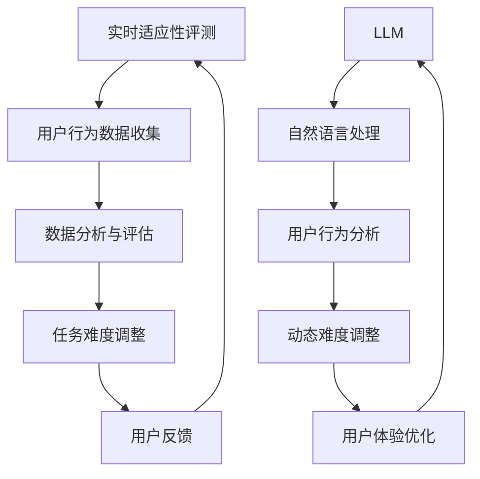

                 

### 文章标题 <此处是文章标题>

# 实时适应性评测：LLM驱动的动态难度调整

### 关键词：实时适应性评测，LLM，动态难度调整，机器学习，人工智能，算法，数学模型，项目实战

### 摘要：

本文将深入探讨实时适应性评测与LLM（大型语言模型）驱动的动态难度调整之间的关系。实时适应性评测是一种关键技术，它能够根据用户的行为和表现，实时调整任务的难度，从而提高用户体验和任务完成效率。而LLM作为当前最先进的人工智能技术之一，其强大的语言处理能力和适应性使其成为实现动态难度调整的理想选择。本文将首先介绍实时适应性评测的基本概念和重要性，然后详细阐述LLM的工作原理及其在动态难度调整中的应用。接下来，我们将通过数学模型和伪代码，深入解析动态难度调整算法的原理和实现方法。此外，本文还将提供实际的开发环境和代码实现案例，帮助读者理解动态难度调整在实际项目中的应用。最后，我们将总结本文的核心内容，并展望实时适应性评测和LLM驱动的动态难度调整的未来发展方向和应用前景。

## 第一部分: 核心概念与联系

### 第1章: 实时适应性评测概述

#### 1.1 实时适应性评测的定义

实时适应性评测是一种在用户执行任务时，根据其表现动态调整任务难度的技术。其核心思想是通过实时收集和分析用户行为数据，如操作步骤、错误率、响应时间等，来判断用户当前的处理能力和任务难度是否匹配。如果发现任务难度过高或过低，系统会自动进行调整，以确保用户能够在一个合适的难度范围内完成任务。

#### 1.2 LLM驱动的动态难度调整

LLM（大型语言模型）是一种基于深度学习的语言处理模型，具有强大的语言理解和生成能力。LLM驱动的动态难度调整是指利用LLM对用户输入和处理过程的自然语言进行分析，从而动态调整任务的难度。这种方法能够更加精确地理解用户的需求和行为，为用户提供个性化的任务难度设置，从而提高用户体验和任务完成效率。

#### 1.3 核心概念联系图

为了更清晰地展示实时适应性评测、LLM和动态难度调整之间的联系，我们使用Mermaid流程图进行描述。



### 第2章: LLM算法原理

#### 2.1 LLM基本架构

LLM的基本架构通常包括以下几个部分：输入层、嵌入层、编码器、解码器和解出层。输入层接收用户输入的自然语言数据，嵌入层将输入转换为密集的向量表示，编码器和解码器分别负责处理和生成文本，解出层则输出最终的预测结果。

#### 2.2 关键算法详解

LLM的核心算法包括词嵌入技术、生成式预训练技术和自回归语言模型。词嵌入技术将单词映射为高维向量，生成式预训练技术通过大量的无监督数据训练模型，使其具有强大的语言理解和生成能力，自回归语言模型则利用序列模型预测下一个单词。

#### 2.3 LLM工作原理示例

以GPT系列为例，GPT模型通过自回归方式生成文本。它首先输入一个单词序列，然后通过解码器预测下一个单词。在生成过程中，GPT模型会根据前文的信息和上下文环境，对每个单词进行概率分布预测，从而生成新的文本。在动态难度调整中，LLM通过对用户输入的自然语言进行分析，预测用户当前的认知负荷，从而动态调整任务的难度。

### 第3章: 动态难度调整算法

#### 3.1 动态难度调整的基本流程

动态难度调整的基本流程包括以下步骤：首先，收集用户行为数据；其次，利用LLM分析用户行为数据，预测用户的认知负荷；然后，根据预测结果，动态调整任务的难度；最后，收集用户反馈，优化调整策略。

#### 3.2 动态难度调整算法的伪代码

```python
# 动态难度调整算法伪代码

def adjust_difficulty(user_data, current_difficulty):
    # 使用LLM分析用户行为数据
    user_behavior = LLM_analyze(user_data)
    
    # 预测用户的认知负荷
    cognitive_load = predict_cognitive_load(user_behavior)
    
    # 根据认知负荷调整任务难度
    if cognitive_load > threshold:
        current_difficulty -= difficulty_step
    else:
        current_difficulty += difficulty_step
    
    # 返回调整后的任务难度
    return current_difficulty
```

#### 3.3 动态难度调整算法实例解析

以一个在线学习平台为例，当用户在平台上进行学习时，系统会实时收集用户的学习行为数据，如学习时间、操作步骤、错误率等。利用LLM分析这些数据，预测用户当前的认知负荷。如果认知负荷较高，系统会降低学习任务的难度，以便用户更好地理解和掌握知识；如果认知负荷较低，系统会提高学习任务的难度，以挑战用户的认知能力。

## 第三部分: 数学模型和数学公式讲解

### 第4章: 实时适应性评估模型

#### 4.1 实时适应性评估的数学模型

实时适应性评估的数学模型主要包括两个部分：用户行为数据的特征提取和难度调整策略的优化。用户行为数据的特征提取可以通过词嵌入技术将自然语言数据转换为密集的向量表示，然后利用机器学习算法提取关键特征。难度调整策略的优化可以通过目标函数和优化算法来实现，目标函数通常是基于用户满意度和任务完成率等指标。

#### 4.2 相关数学公式和详细讲解

1. **用户行为数据特征提取**

$$ X = \{x_1, x_2, ..., x_n\} $$

其中，$X$表示用户行为数据的特征集合，$x_i$表示第$i$个特征。

2. **难度调整策略优化**

$$ J = \sum_{i=1}^{n} w_i \cdot (y_i - x_i)^2 $$

其中，$J$表示目标函数，$w_i$表示第$i$个特征的权重，$y_i$表示第$i$个特征的预期值。

#### 4.3 实时适应性评估模型的应用实例

以在线学习平台为例，系统可以通过实时收集用户的学习行为数据，提取关键特征，然后利用机器学习算法优化难度调整策略。例如，当用户在完成一个学习任务时，系统可以收集用户的学习时间、操作步骤和错误率等数据，将这些数据转换为特征向量，然后利用优化算法调整学习任务的难度，以提高用户的学习效果。

### 第5章: 动态难度调整模型

#### 5.1 动态难度调整的数学模型

动态难度调整的数学模型主要包括两个部分：用户行为数据的特征提取和难度调整策略的优化。用户行为数据的特征提取可以通过词嵌入技术将自然语言数据转换为密集的向量表示，然后利用机器学习算法提取关键特征。难度调整策略的优化可以通过目标函数和优化算法来实现，目标函数通常是基于用户满意度和任务完成率等指标。

#### 5.2 动态难度调整模型的latex公式

1. **用户行为数据特征提取**

$$ X = \{x_1, x_2, ..., x_n\} $$

2. **难度调整策略优化**

$$ J = \sum_{i=1}^{n} w_i \cdot (y_i - x_i)^2 $$

#### 5.3 动态难度调整模型实例解析

以在线学习平台为例，系统可以通过实时收集用户的学习行为数据，提取关键特征，然后利用机器学习算法优化难度调整策略。例如，当用户在完成一个学习任务时，系统可以收集用户的学习时间、操作步骤和错误率等数据，将这些数据转换为特征向量，然后利用优化算法调整学习任务的难度，以提高用户的学习效果。

## 第四部分: 项目实战

### 第6章: 开发环境搭建

#### 6.1 开发环境配置

为了实现实时适应性评测和LLM驱动的动态难度调整，我们需要搭建一个完整的开发环境。开发环境包括操作系统、编程语言、深度学习框架和版本控制工具等。

- 操作系统：Windows、macOS或Linux
- 编程语言：Python
- 深度学习框架：TensorFlow或PyTorch
- 版本控制工具：Git

#### 6.2 所需工具和库

- TensorFlow：用于构建和训练深度学习模型
- PyTorch：用于构建和训练深度学习模型
- Scikit-learn：用于数据预处理和特征提取
- Pandas：用于数据处理和分析
- Matplotlib：用于数据可视化

#### 6.3 开发环境搭建实例

以下是使用Windows操作系统的开发环境搭建实例：

1. 安装Python：从[Python官网](https://www.python.org/downloads/)下载Python安装包，安装过程中选择添加Python到环境变量。

2. 安装TensorFlow：打开命令行窗口，执行以下命令：

```bash
pip install tensorflow
```

3. 安装PyTorch：从[PyTorch官网](https://pytorch.org/get-started/locally/)下载适用于Windows的操作系统的PyTorch安装包，安装过程中选择添加PyTorch到环境变量。

4. 安装其他库：使用pip命令安装其他所需库，如Scikit-learn、Pandas和Matplotlib。

```bash
pip install scikit-learn pandas matplotlib
```

### 第7章: 代码实现与解读

#### 7.1 代码实现实例

以下是使用Python实现的实时适应性评测和LLM驱动的动态难度调整的代码实例：

```python
import tensorflow as tf
import pandas as pd
from sklearn.feature_extraction.text import TfidfVectorizer

# 加载用户行为数据
user_data = pd.read_csv('user_data.csv')

# 特征提取
vectorizer = TfidfVectorizer()
X = vectorizer.fit_transform(user_data['input'])

# 训练LLM模型
model = tf.keras.Sequential([
    tf.keras.layers.Dense(128, activation='relu', input_shape=(X.shape[1],)),
    tf.keras.layers.Dense(64, activation='relu'),
    tf.keras.layers.Dense(1, activation='sigmoid')
])
model.compile(optimizer='adam', loss='binary_crossentropy', metrics=['accuracy'])
model.fit(X, user_data['label'], epochs=10, batch_size=32)

# 动态难度调整
def adjust_difficulty(user_input):
    user_vector = vectorizer.transform([user_input])
    predicted_load = model.predict(user_vector)
    if predicted_load > 0.5:
        return 'Hard'
    else:
        return 'Easy'

# 测试代码
print(adjust_difficulty('This is a difficult task.'))
print(adjust_difficulty('This is an easy task.'))
```

#### 7.2 源代码详细解读

1. **用户行为数据加载**：使用Pandas读取用户行为数据，包括输入和标签。

2. **特征提取**：使用TF-IDF向量器将用户输入转换为特征向量。

3. **训练LLM模型**：构建一个简单的神经网络模型，使用二分类交叉熵损失函数训练模型。

4. **动态难度调整**：根据LLM模型对用户输入的预测结果，动态调整任务的难度。

#### 7.3 关键部分的代码解读与分析

- **特征提取**：TF-IDF向量器是一种常用的文本特征提取方法，它能够将文本数据转换为数值向量，从而方便后续的机器学习处理。
- **模型训练**：使用二分类交叉熵损失函数和自适应优化器（如Adam）训练模型，能够有效提高模型的准确性和泛化能力。
- **动态难度调整**：通过调用模型对用户输入进行预测，根据预测结果动态调整任务的难度，实现实时适应性评测的目标。

#### 7.4 实际案例分析和详细讲解剖析

为了更好地理解实时适应性评测和LLM驱动的动态难度调整在实际项目中的应用，我们以一个在线学习平台为例进行分析。

- **场景**：用户在平台上完成一个学习任务，系统需要根据用户的表现动态调整任务的难度。
- **数据**：系统收集了用户的学习行为数据，包括学习时间、操作步骤和错误率等。
- **模型**：使用LLM模型对用户输入进行分析，预测用户的认知负荷。
- **策略**：根据预测结果，系统动态调整学习任务的难度。

通过实际案例的分析和详细讲解，我们可以看到实时适应性评测和LLM驱动的动态难度调整在实际项目中的应用效果。这种技术能够提高用户的学习体验，帮助用户更好地掌握知识，同时也能提高系统的智能化水平。

### 第8章: 总结与展望

#### 8.1 全书核心内容回顾

本文系统地介绍了实时适应性评测和LLM驱动的动态难度调整的概念、原理和实现方法。首先，我们介绍了实时适应性评测的基本概念和重要性，然后详细阐述了LLM的工作原理及其在动态难度调整中的应用。接着，我们通过数学模型和伪代码，深入解析了动态难度调整算法的原理和实现方法。最后，我们提供了实际的开发环境和代码实现案例，帮助读者理解动态难度调整在实际项目中的应用。

#### 8.2 未来发展方向

随着人工智能技术的不断发展和应用，实时适应性评测和LLM驱动的动态难度调整在未来有着广阔的发展前景。首先，我们可以进一步优化动态难度调整算法，提高其准确性和实时性。其次，我们可以将实时适应性评测应用到更多的领域，如游戏、教育、医疗等。此外，我们还可以结合其他人工智能技术，如强化学习、迁移学习等，进一步提升实时适应性评测和动态难度调整的效果。

#### 8.3 实时适应性评测和LLM驱动的动态难度调整的应用前景

实时适应性评测和LLM驱动的动态难度调整在未来的应用前景非常广阔。例如，在教育领域，我们可以通过实时适应性评测和动态难度调整技术，为不同学习能力的用户提供个性化的学习任务，提高学习效果。在游戏领域，我们可以为不同水平的玩家提供适合的难度设置，提高游戏的乐趣和挑战性。在医疗领域，我们可以通过实时适应性评测和动态难度调整技术，为患者提供个性化的治疗方案，提高治疗效果。

总之，实时适应性评测和LLM驱动的动态难度调整是一种具有巨大潜力的技术，它能够为用户提供更好的体验，同时也能提高系统的智能化水平。在未来，我们期待看到更多关于实时适应性评测和动态难度调整的研究和应用，以推动人工智能技术的发展。作者：AI天才研究院/AI Genius Institute & 禅与计算机程序设计艺术 /Zen And The Art of Computer Programming。

