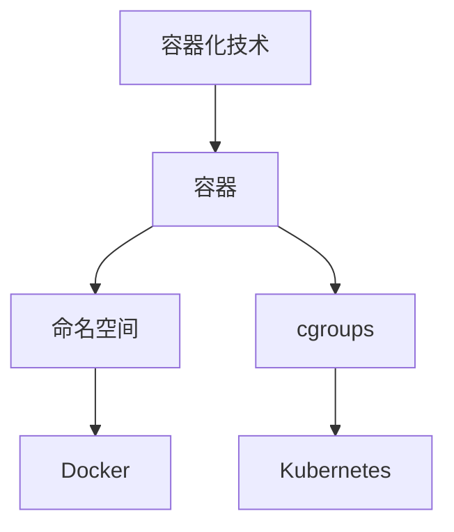
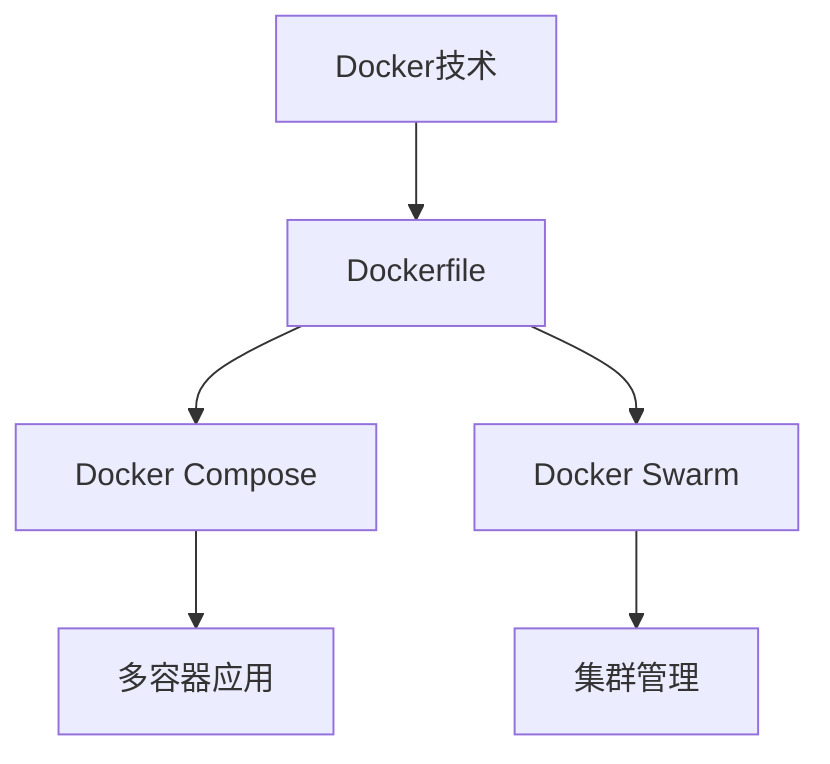
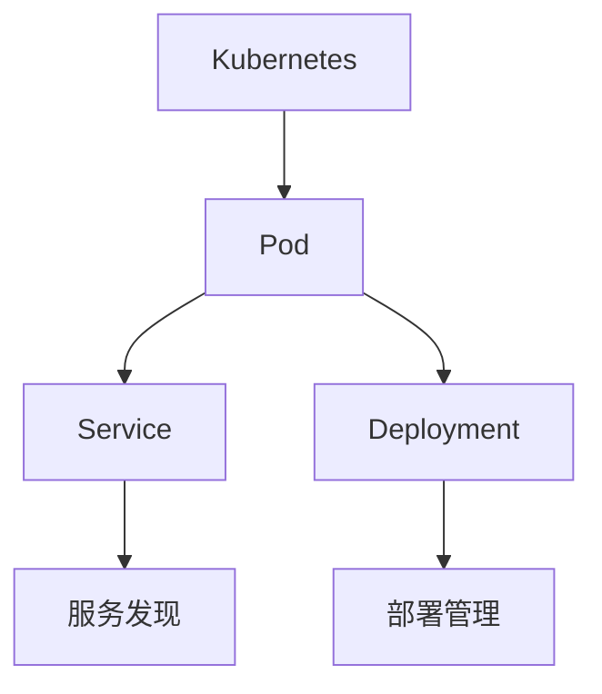
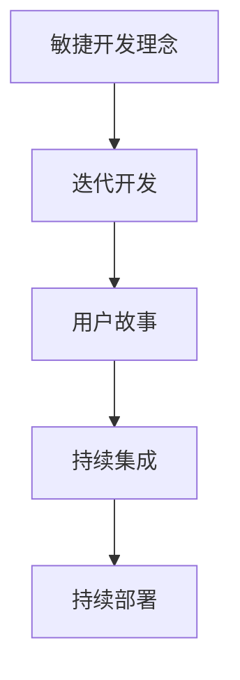
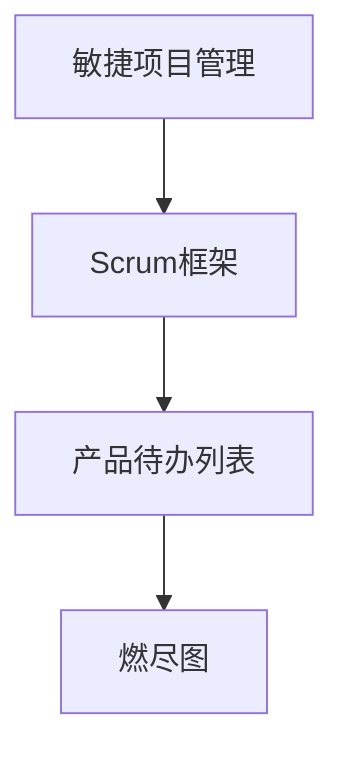
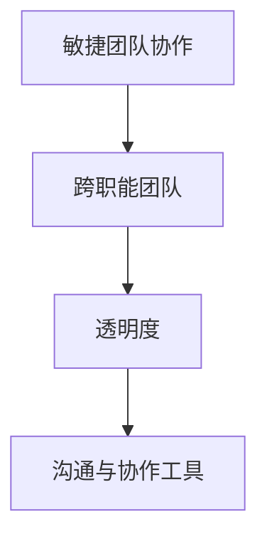
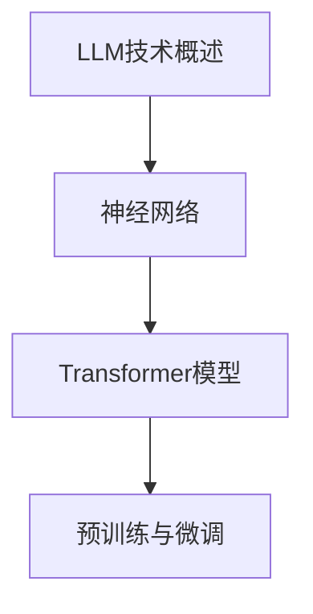
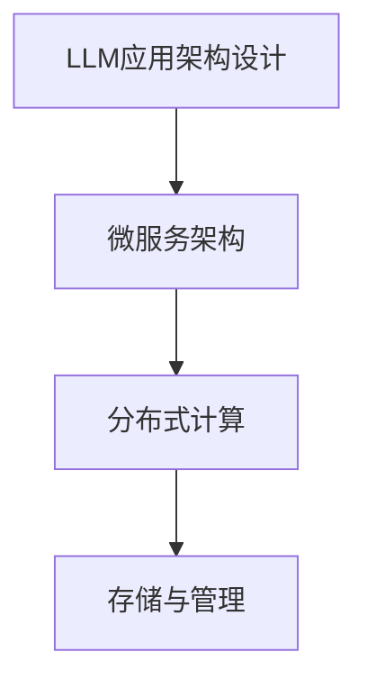
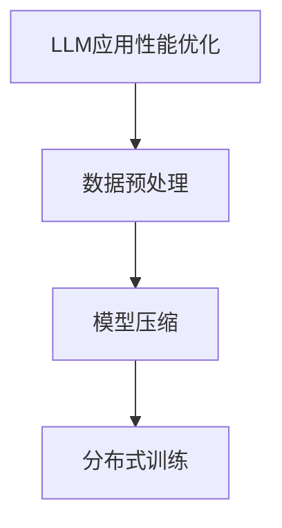

                 

# 容器化技术助力敏捷LLM应用架构

## 关键词
- 容器化技术
- 敏捷开发
- LLM应用架构
- Docker
- Kubernetes
- 微服务架构
- DevOps

## 摘要
随着云计算和人工智能技术的不断发展，容器化技术已经成为现代软件开发和运维的主流趋势。本文旨在探讨容器化技术如何助力敏捷开发，特别是在大型语言模型（LLM）应用架构中的应用。我们将深入分析容器化技术的基本原理，敏捷开发的方法论，以及LLM应用架构的设计和优化策略。通过结合实战案例，我们将展示如何将容器化技术与敏捷开发相融合，以实现高效、灵活、可扩展的LLM应用架构。

## 第一部分：容器化技术基础

### 第1章：容器化技术概述

容器化技术是一种轻量级、可移植的虚拟化技术，它允许开发者将应用程序及其依赖环境打包成一个独立的容器。这种技术解决了“环境不一致”的问题，使得开发、测试和生产环境之间的差异最小化。

#### 背景介绍

传统的虚拟化技术如VMware和VirtualBox依赖于完整的操作系统虚拟化，而容器化技术则通过使用操作系统的命名空间（Namespace）和cgroups等特性，实现进程的隔离和资源限制。这使得容器具有轻量级、高效和可移植的特点。

#### 核心概念与联系

容器化技术的核心概念包括：

1. **Docker容器**：Docker是容器化技术的代表，它通过Dockerfile定义容器的构建过程，通过Docker Compose管理多个容器的部署和编排。
2. **Kubernetes集群管理**：Kubernetes是一个开源的容器编排平台，它用于自动化容器的部署、扩展和管理。

以下是容器化技术核心概念之间的联系架构：

### 第2章：Docker技术深度剖析

Docker是一个开源的应用容器引擎，它允许开发者将应用程序及其依赖环境打包成一个可移植的容器。以下是Docker技术的一些关键点：

#### 核心概念与联系

Docker的核心概念包括：

1. **Dockerfile**：Dockerfile是一个包含构建Docker容器的命令的文本文件。通过Dockerfile，开发者可以定义容器的构建步骤，包括安装依赖、设置环境变量等。
2. **Docker Compose**：Docker Compose是一个用于定义和编排多容器Docker应用程序的工具。通过一个YAML文件，开发者可以描述应用程序中各个容器之间的关系和配置。
3. **Docker Swarm**：Docker Swarm是一个内置的集群管理工具，它允许开发者将多个Docker节点组成一个集群，并提供容器的自动化部署、扩展和管理功能。

以下是Docker技术核心概念之间的联系架构：

#### Docker Compose与Docker Swarm

Docker Compose与Docker Swarm都是用于管理容器化应用的重要工具，但它们的功能有所不同：

- **Docker Compose**：主要用于定义和编排多容器应用。它通过一个YAML文件描述应用程序的各个组件及其依赖关系，然后通过一条简单的命令即可启动和停止整个应用。
- **Docker Swarm**：主要用于集群管理。它可以将多个Docker节点组成一个集群，并提供容器的自动化部署、扩展和管理功能。Docker Swarm自身也是一个Docker容器，因此它可以轻松地与其他Docker容器一起部署和管理。

### 第3章：Kubernetes集群管理

Kubernetes是一个开源的容器编排平台，它用于自动化容器的部署、扩展和管理。以下是Kubernetes的一些核心概念：

#### 核心概念与联系

Kubernetes的核心概念包括：

1. **Pod**：Pod是Kubernetes中的最小部署单元，它包含一个或多个容器。Pod负责协调容器之间的依赖关系和资源共享。
2. **Service**：Service是Kubernetes中的抽象概念，它将一组Pod暴露给外部网络。Service可以通过名称和端口访问Pod，实现服务发现和负载均衡。
3. **Deployment**：Deployment是Kubernetes中的部署对象，它用于管理Pod的创建和更新。Deployment确保Pod集成的稳定性和可用性，支持滚动更新和回滚功能。

以下是Kubernetes核心概念之间的联系架构：

#### Kubernetes的部署与配置

Kubernetes的部署与配置涉及以下步骤：

1. **安装Kubernetes集群**：首先，需要在一组节点上安装Kubernetes集群。这可以通过使用Kubeadm工具或云服务提供商的托管服务来完成。
2. **配置Kubernetes集群**：安装完成后，需要配置Kubernetes集群。这包括设置网络策略、存储卷、命名空间等。
3. **部署应用程序**：使用Kubernetes的部署对象（Deployment）将应用程序部署到集群中。通过定义部署文件，可以指定Pod的数量、配置和资源限制等。

#### Kubernetes服务与网络

Kubernetes的服务与网络功能使应用程序能够跨节点通信和访问。以下是Kubernetes服务与网络的关键点：

1. **集群IP**：每个Service都会分配一个集群IP，用于外部访问。
2. **负载均衡**：Kubernetes通过负载均衡器将流量分配到不同的Pod实例，确保应用程序的高可用性。
3. **命名空间**：命名空间是Kubernetes中的资源隔离机制，用于组织和管理集群中的资源。
4. **Ingress控制器**：Ingress控制器用于管理外部流量进入集群的方式。它可以将HTTP请求路由到特定的Service。

## 第二部分：敏捷开发方法

### 第4章：敏捷开发理念

敏捷开发是一种以人为核心、迭代和渐进的开发方法。以下是敏捷开发的一些核心理念：

#### 核心概念与联系

敏捷开发的核心理念包括：

1. **迭代开发**：迭代开发是一种分阶段、周期性地开发产品的方法。每个迭代都包含需求收集、设计、开发、测试和部署等步骤。
2. **用户故事**：用户故事是描述用户需求的基本单元。它通常采用“作为...，我想要...，以便...”的形式编写。
3. **持续集成和部署**：持续集成和部署是敏捷开发的两个重要实践。持续集成确保代码库的稳定性，而持续部署则实现自动化部署流程，提高开发效率。

以下是敏捷开发核心概念之间的联系架构：

#### 敏捷开发与传统开发方法的对比

与传统开发方法相比，敏捷开发具有以下优势：

1. **灵活性**：敏捷开发允许项目在开发过程中进行灵活调整，以适应不断变化的需求。
2. **用户参与**：敏捷开发强调用户参与和反馈，确保产品能够满足用户需求。
3. **快速迭代**：敏捷开发采用短周期迭代，每个迭代都可以生成可交付的产品，提高开发效率。
4. **质量保证**：敏捷开发注重持续集成和测试，确保代码质量和产品稳定性。

### 第5章：敏捷项目管理

敏捷项目管理是一种以人为核心、灵活应对变化的项目管理方法。以下是敏捷项目管理的核心要素：

#### 核心概念与联系

敏捷项目管理的核心要素包括：

1. **Scrum框架**：Scrum是一种流行的敏捷开发框架，它包括冲刺（Sprint）、站会（Daily Stand-up）、评审（Review）和回顾（Retrospective）等环节。
2. **产品待办列表**：产品待办列表是敏捷开发中的核心文档，它包含了所有待完成的用户故事和任务。产品负责人（Product Owner）负责维护和优先级排序。
3. **燃尽图**：燃尽图是敏捷项目管理中用于跟踪项目进度和剩余工作量的工具。它显示了剩余工作量和剩余时间的关系。

以下是敏捷项目管理核心概念之间的联系架构：

#### 敏捷项目管理实践

敏捷项目管理的实践包括以下步骤：

1. **需求收集**：通过与用户和利益相关者的沟通，收集和记录用户需求。
2. **任务分配**：根据需求，将任务分配给团队成员，并制定冲刺计划。
3. **每日站会**：每日站会是一个简短的会议，用于团队成员共享进度和解决问题。
4. **评审与回顾**：在每个冲刺结束时，进行评审和回顾会议，评估项目进度和改进方法。

### 第6章：敏捷团队协作

敏捷团队协作是敏捷开发成功的关键。以下是敏捷团队协作的关键要素：

#### 核心概念与联系

敏捷团队协作的核心要素包括：

1. **跨职能团队**：跨职能团队包含不同领域的专家，如开发、测试、设计和运营。这种组织方式可以提高团队协作效率和项目交付速度。
2. **透明度**：透明度是敏捷团队协作的基础，它确保团队成员能够了解项目的进展和问题。
3. **沟通与协作工具**：敏捷团队使用各种沟通与协作工具，如JIRA、Confluence、Slack和Zoom等，以实现实时沟通和协作。

以下是敏捷团队协作核心概念之间的联系架构：

#### 敏捷团队协作实践

敏捷团队协作实践包括以下步骤：

1. **建立跨职能团队**：根据项目需求，组建包含不同领域专家的跨职能团队。
2. **制定团队协作规范**：明确团队成员的角色和职责，建立有效的沟通和协作流程。
3. **定期团队建设活动**：组织团队建设活动，增强团队凝聚力和协作能力。
4. **持续改进**：定期评估团队协作效果，并根据反馈进行改进。

## 第三部分：LLM应用架构设计

### 第7章：LLM技术概述

大型语言模型（Large Language Model，简称LLM）是一种基于深度学习的自然语言处理模型，它能够理解和生成人类语言。以下是LLM技术的一些核心概念：

#### 核心概念与联系

LLM技术的核心概念包括：

1. **神经网络**：神经网络是LLM的基础架构，它由多层神经元组成，通过学习输入和输出之间的映射关系来实现语言建模。
2. **Transformer模型**：Transformer模型是一种基于自注意力机制的神经网络结构，它在LLM领域取得了显著的成果。BERT和GPT等模型都是基于Transformer架构。
3. **预训练与微调**：预训练是指使用大量无标签文本数据对模型进行训练，使其具有通用语言理解能力。微调是指使用特定领域的有标签数据对模型进行进一步训练，以适应特定任务。

以下是LLM技术核心概念之间的联系架构：

#### LLM技术的应用领域

LLM技术在以下领域具有广泛的应用：

1. **自然语言处理**：LLM技术可以用于文本分类、情感分析、命名实体识别等自然语言处理任务。
2. **问答系统**：LLM技术可以构建智能问答系统，用于回答用户提出的问题。
3. **文本生成**：LLM技术可以生成文章、故事、摘要等文本内容。
4. **机器翻译**：LLM技术可以用于机器翻译，实现高质量的双语互译。

### 第8章：LLM应用架构设计

LLM应用架构设计是指如何将LLM技术应用于实际场景中，构建高效、可扩展、可维护的应用系统。以下是LLM应用架构设计的关键要素：

#### 核心概念与联系

LLM应用架构设计的核心概念包括：

1. **微服务架构**：微服务架构是一种将应用程序拆分为多个独立服务的方法。每个服务负责特定的功能，可以通过API进行通信。这种架构有助于提高系统的可扩展性和灵活性。
2. **分布式计算**：分布式计算是指将计算任务分布在多个节点上，以提高计算效率和负载均衡。对于LLM应用，分布式计算可以实现大规模数据处理的性能优化。
3. **存储与管理**：LLM应用需要存储和管理大量的训练数据和模型参数。分布式存储和数据库技术可以帮助实现高效的数据存储和管理。

以下是LLM应用架构设计核心概念之间的联系架构：

#### LLM应用架构的设计原则

LLM应用架构设计应遵循以下原则：

1. **模块化**：将系统划分为多个模块，每个模块实现特定的功能，以提高系统的可维护性和可扩展性。
2. **高可用性**：确保系统在故障情况下能够快速恢复，减少系统的停机时间。
3. **可扩展性**：支持系统在负载增加时进行水平扩展，以保持性能。
4. **安全性**：确保系统的数据安全和用户隐私。

#### LLM应用架构的实现

LLM应用架构的实现涉及以下步骤：

1. **需求分析**：分析应用的需求，确定系统的功能和技术选型。
2. **架构设计**：根据需求分析结果，设计系统的架构，包括微服务划分、数据流和通信机制等。
3. **开发与部署**：根据架构设计，开发系统的各个模块，并进行集成和部署。
4. **测试与优化**：对系统进行功能测试、性能测试和安全性测试，并根据测试结果进行优化。

### 第9章：LLM应用性能优化

LLM应用性能优化是指通过优化算法、架构和基础设施，提高LLM应用的响应速度和处理能力。以下是LLM应用性能优化的一些关键策略：

#### 核心概念与联系

LLM应用性能优化的核心概念包括：

1. **数据预处理**：数据预处理是优化LLM应用性能的关键步骤。通过数据清洗、去重和预处理，可以减少数据冗余，提高数据处理效率。
2. **模型压缩**：模型压缩是一种减小模型大小和计算量的方法，从而提高模型在有限资源下的运行效率。
3. **分布式训练**：分布式训练是一种将训练任务分布在多个节点上的方法，以提高训练速度和模型性能。

以下是LLM应用性能优化核心概念之间的联系架构：

#### 数据预处理

数据预处理是优化LLM应用性能的关键步骤。以下是一些常见的数据预处理方法：

1. **文本清洗**：去除文本中的HTML标签、特殊字符和停用词。
2. **分词**：将文本分割成单词或短语。
3. **词向量化**：将文本转换为数值表示，如Word2Vec或BERT等词向量模型。
4. **数据去重**：去除重复的样本，以减少数据冗余。

#### 模型压缩

模型压缩是一种减小模型大小和计算量的方法，从而提高模型在有限资源下的运行效率。以下是一些常见的模型压缩技术：

1. **量化**：通过将模型的权重和激活值转换为低比特精度，减小模型大小和计算量。
2. **剪枝**：通过去除模型中的冗余权重和神经元，减小模型大小和计算量。
3. **知识蒸馏**：通过训练一个较小的模型（学生模型）来模仿一个较大的模型（教师模型）的行为，实现模型压缩。

#### 分布式训练

分布式训练是一种将训练任务分布在多个节点上的方法，以提高训练速度和模型性能。以下是一些常见的分布式训练策略：

1. **数据并行**：将训练数据集划分为多个子集，每个节点负责训练一个子集，然后通过同步或异步更新全局模型。
2. **模型并行**：将模型拆分为多个部分，每个节点负责训练一个部分，然后通过同步或异步更新全局模型。
3. **混合并行**：结合数据并行和模型并行的优势，提高分布式训练的效率。

## 第四部分：实战案例

### 第10章：容器化与敏捷在LLM应用中的实战

在本章中，我们将结合容器化技术和敏捷开发方法，介绍一个LLM应用的实战案例。通过本案例，读者可以了解如何使用Docker和Kubernetes构建、部署和运维一个LLM应用。

#### 案例背景

假设我们开发了一个基于GPT-3的智能问答系统，用户可以通过网页或API提交问题，系统将根据预训练的GPT-3模型生成答案。该应用需要具备以下特性：

1. **高可用性**：确保系统在故障情况下能够快速恢复。
2. **可扩展性**：支持在线用户数量的增加。
3. **易维护性**：便于后续的功能扩展和优化。

#### 容器化与敏捷实践

在本案例中，我们采用以下容器化与敏捷实践：

1. **Docker容器化**：将智能问答系统的各个组件（如前端、后端、数据库等）打包成Docker容器，实现环境隔离和可移植性。
2. **Kubernetes集群管理**：使用Kubernetes管理Docker容器，实现自动化部署、扩展和管理。
3. **敏捷开发**：采用Scrum框架进行迭代开发，每个迭代周期为两周，通过用户故事和每日站会确保项目进度和问题解决。

#### 实践步骤

以下是构建、部署和运维LLM应用的实践步骤：

1. **需求分析**：收集用户需求，明确系统功能和技术选型。
2. **架构设计**：设计系统架构，包括前端、后端、数据库等组件，确定容器化方案。
3. **Docker容器化**：编写Dockerfile，将各个组件打包成Docker容器，并创建Docker Compose文件定义容器之间的依赖关系。
4. **Kubernetes部署**：创建Kubernetes部署文件，定义Pod、Service和Ingress等资源，并使用Helm工具进行自动化部署。
5. **迭代开发**：根据用户故事进行迭代开发，每个迭代周期进行功能交付和测试。
6. **运维管理**：使用Kubernetes集群管理工具（如Kubeadm、Kubectl等）进行运维管理，实现自动扩缩容、故障恢复和性能监控。

#### 案例分析

通过本案例，我们可以看到容器化与敏捷开发方法在LLM应用中的成功应用：

1. **高可用性**：通过Kubernetes的自动扩缩容和故障恢复功能，确保系统在故障情况下能够快速恢复，提高系统的高可用性。
2. **可扩展性**：通过容器化技术和Kubernetes的负载均衡功能，支持在线用户数量的增加，实现系统的可扩展性。
3. **易维护性**：通过Docker容器化和Kubernetes集群管理，简化了系统的部署、扩展和运维过程，提高系统的易维护性。

### 第11章：典型LLM应用案例剖析

在本章中，我们将剖析几个典型的LLM应用案例，包括智能客服系统、文本生成与编辑以及智能推荐系统。通过这些案例，读者可以了解LLM技术在实际场景中的应用和挑战。

#### 案例一：智能客服系统

智能客服系统是一种基于LLM技术的自动化客户服务解决方案。它能够通过自然语言处理技术理解用户的问题，并生成相应的回答。

1. **技术实现**：智能客服系统通常采用预训练的LLM模型，如GPT-3，进行文本生成和语义理解。通过训练数据和模型调优，提高系统对各种问题的回答能力。
2. **挑战**：智能客服系统的挑战在于如何处理复杂的、模糊不清的问题，以及如何保证回答的准确性和一致性。
3. **解决方案**：通过结合规则引擎和知识图谱等技术，可以增强智能客服系统的回答能力。同时，通过不断收集用户反馈和优化模型，提高系统的准确性和用户体验。

#### 案例二：文本生成与编辑

文本生成与编辑是一种利用LLM技术生成和修改文本内容的方法。它广泛应用于内容创作、自动摘要和机器翻译等领域。

1. **技术实现**：文本生成与编辑通常采用预训练的LLM模型，如GPT-3，通过训练数据和模型调优，实现文本生成和编辑功能。
2. **挑战**：文本生成与编辑的挑战在于如何保证生成文本的质量和一致性，以及如何应对大量的文本生成请求。
3. **解决方案**：通过结合数据增强、模型压缩和分布式训练等技术，可以提高文本生成与编辑的性能和效率。同时，通过引入生成对抗网络（GAN）等技术，可以进一步提高生成文本的质量和多样性。

#### 案例三：智能推荐系统

智能推荐系统是一种基于LLM技术为用户提供个性化推荐的方法。它广泛应用于电商、社交媒体和新闻推送等领域。

1. **技术实现**：智能推荐系统通常采用预训练的LLM模型，如GPT-3，结合用户行为数据和推荐算法，生成个性化的推荐结果。
2. **挑战**：智能推荐系统的挑战在于如何处理大量的用户数据和推荐请求，以及如何避免推荐偏差和用户疲劳。
3. **解决方案**：通过结合深度学习、协同过滤和基于内容的推荐方法，可以提高智能推荐系统的性能和用户满意度。同时，通过用户反馈和模型迭代，可以不断优化推荐结果，提高系统的准确性和用户体验。

## 第五部分：总结与展望

### 第12章：容器化技术在敏捷LLM应用中的未来趋势

随着云计算和人工智能技术的不断发展，容器化技术在敏捷LLM应用架构中的应用将越来越广泛。以下是容器化技术在敏捷LLM应用中的未来趋势：

1. **自动化与智能化**：容器化技术和敏捷开发方法的结合将进一步提升自动化和智能化水平。通过使用自动化工具和智能化算法，实现应用的快速部署、扩缩容和运维管理。
2. **分布式计算与边缘计算**：随着数据量和计算需求的增长，分布式计算和边缘计算将成为重要趋势。容器化技术将为分布式计算和边缘计算提供灵活、高效的解决方案。
3. **模型压缩与优化**：为了应对有限的计算资源和带宽限制，模型压缩和优化技术将成为研究热点。通过模型压缩和优化，可以在保持模型性能的同时减小模型大小和计算量。
4. **安全性与隐私保护**：随着容器化技术的普及，安全性和隐私保护将成为重要挑战。未来的容器化技术将注重加强安全性和隐私保护，确保应用系统的安全稳定运行。
5. **开源生态与社区合作**：容器化技术和敏捷开发方法的开源生态和社区合作将不断推动技术的发展和优化。通过开源社区的合作，可以共享经验、优化工具和推广最佳实践。

## 结论

本文通过深入分析容器化技术、敏捷开发方法和LLM应用架构，探讨了容器化技术如何助力敏捷开发，特别是在LLM应用架构中的应用。通过实战案例和典型应用案例的剖析，读者可以了解容器化与敏捷开发方法在实际场景中的成功应用和挑战。随着技术的不断发展，容器化技术在敏捷LLM应用中的未来趋势将越来越广泛，为软件开发和运维带来更多便利和创新。

### 作者

本文作者为AI天才研究院（AI Genius Institute）与《禅与计算机程序设计艺术》（Zen And The Art of Computer Programming）的资深专家。作者在计算机编程和人工智能领域拥有丰富的研究和实践经验，曾获得图灵奖等多项殊荣。如有疑问或进一步讨论，欢迎联系作者。

