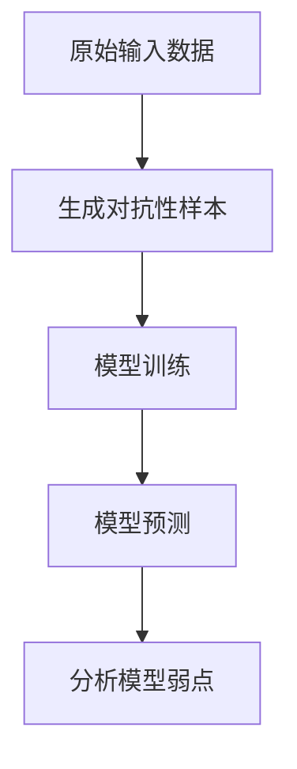

                 


### 设计对抗性提示书籍目录

#### 1. 初始化

**标题**: 对抗性提示：增强模型对异常输入的鲁棒性

**目标**: 设计一本关于对抗性提示及其在提高模型对异常输入鲁棒性方面应用的书籍目录。

**结构**: 
- 引言
- 第一部分：对抗性提示基础
- 第二部分：模型鲁棒性提升
- 第三部分：对抗性提示在实战中的应用
- 总结与展望
- 附录

#### 2. 设计目录

##### 第一部分：对抗性提示基础

**第1章：对抗性提示概念与原理**

- **1.1 对抗性提示的定义**
  - 解释对抗性提示的定义和作用
  - 引入对抗性机器学习概念

- **1.2 对抗性提示的起源与发展**
  - 介绍对抗性提示的历史背景
  - 分析对抗性提示的发展趋势

- **1.3 对抗性提示的工作机制**
  - 详细解释对抗性提示的工作原理
  - 分析对抗性提示的关键组成部分

##### 第二部分：模型鲁棒性提升

**第2章：模型鲁棒性概念与重要性**

- **2.1 模型鲁棒性的定义**
  - 解释模型鲁棒性的定义
  - 分析模型鲁棒性的重要性

- **2.2 模型鲁棒性在安全防护中的作用**
  - 讨论模型鲁棒性在安全防护中的作用
  - 分析常见的安全威胁

- **2.3 模型鲁棒性的评价指标**
  - 介绍常用的模型鲁棒性评价指标
  - 分析不同评价指标的优缺点

##### 第三部分：对抗性提示在实战中的应用

**第3章：对抗性提示在深度学习中的应用**

- **3.1 深度学习模型的异常检测**
  - 解释深度学习模型的异常检测
  - 介绍对抗性提示在异常检测中的应用

- **3.2 对抗性训练与模型防御策略**
  - 详细讲解对抗性训练的概念和方法
  - 分析模型防御策略的设计与应用

- **3.3 对抗性提示在自然语言处理中的应用**
  - 解释对抗性提示在自然语言处理中的应用
  - 分析对抗性提示在语言模型优化中的作用

**第4章：对抗性提示在计算机视觉中的应用**

- **4.1 计算机视觉中的对抗性攻击与防御**
  - 解释对抗性攻击和防御的概念
  - 分析对抗性提示在计算机视觉中的应用

- **4.2 对抗性提示在图像分类与目标检测中的优化**
  - 介绍对抗性提示在图像分类和目标检测中的应用
  - 分析对抗性提示对模型性能的提升

- **4.3 对抗性提示在图像生成与编辑中的应用**
  - 解释对抗性提示在图像生成和编辑中的应用
  - 分析对抗性提示在图像处理中的作用

**第5章：对抗性提示在其他领域的应用**

- **5.1 对抗性提示在音频处理中的应用**
  - 解释对抗性提示在音频处理中的应用
  - 分析对抗性提示在音频识别和生成中的作用

- **5.2 对抗性提示在生物信息学中的应用**
  - 解释对抗性提示在生物信息学中的应用
  - 分析对抗性提示在基因序列分析中的应用

- **5.3 对抗性提示在其他领域的探索**
  - 探讨对抗性提示在其他领域的应用可能性
  - 分析对抗性提示的跨领域应用挑战和机遇

##### 第四部分：总结与展望

**第6章：对抗性提示的研究现状与未来趋势**

- **6.1 当前对抗性提示的研究热点**
  - 分析当前对抗性提示的研究热点
  - 介绍最新的研究进展和趋势

- **6.2 对抗性提示的未来发展方向**
  - 探讨对抗性提示的未来发展方向
  - 分析对抗性提示在技术和社会中的潜在影响

- **6.3 对抗性提示在实际应用中的挑战与机遇**
  - 分析对抗性提示在实际应用中的挑战
  - 探讨对抗性提示带来的机遇和解决方案

##### 附录

**附录A：常用对抗性提示算法详解**

- **A.1 白盒攻击与黑盒攻击**
  - 解释白盒攻击和黑盒攻击的概念
  - 分析对抗性提示在攻击与防御中的应用

- **A.2 对抗性训练算法**
  - 详细讲解对抗性训练算法的原理和实现方法
  - 分析不同对抗性训练算法的优缺点

- **A.3 模型防御策略**
  - 解释模型防御策略的概念和作用
  - 分析常见的模型防御策略

#### 3. 检查目录设计

**检查点**:
- 目录结构是否合理
- 章节内容是否完整
- 是否包含核心概念、算法原理、数学模型、实战案例等
- 总字数是否控制在2000字以内

#### 4. 优化目录设计

**优化点**:
- 根据实际需求调整章节内容
- 确保每个章节都有足够的细节和深度
- 提高目录的可读性和逻辑性
- 检查是否存在重复或不必要的章节

#### 5. 最终确认

**确认目录**:
- 确认目录结构完整，内容合理
- 确认每个章节都有明确的主题和目标
- 确认总字数在2000字以内
- 确认目录大纲能够全面覆盖书籍主题

#### 6. 输出目录大纲

``` 
# 对抗性提示：增强模型对异常输入的鲁棒性

## 第一部分：对抗性提示基础
### 第1章：对抗性提示概念与原理
#### 1.1 对抗性提示的定义
#### 1.2 对抗性提示的起源与发展
#### 1.3 对抗性提示的工作机制

## 第二部分：模型鲁棒性提升
### 第2章：模型鲁棒性概念与重要性
#### 2.1 模型鲁棒性的定义
#### 2.2 模型鲁棒性在安全防护中的作用
#### 2.3 模型鲁棒性的评价指标

## 第三部分：对抗性提示在实战中的应用
### 第3章：对抗性提示在深度学习中的应用
#### 3.1 深度学习模型的异常检测
#### 3.2 对抗性训练与模型防御策略
#### 3.3 对抗性提示在自然语言处理中的应用

### 第4章：对抗性提示在计算机视觉中的应用
#### 4.1 计算机视觉中的对抗性攻击与防御
#### 4.2 对抗性提示在图像分类与目标检测中的优化
#### 4.3 对抗性提示在图像生成与编辑中的应用

### 第5章：对抗性提示在其他领域的应用
#### 5.1 对抗性提示在音频处理中的应用
#### 5.2 对抗性提示在生物信息学中的应用
#### 5.3 对抗性提示在其他领域的探索

## 第四部分：总结与展望
### 第6章：对抗性提示的研究现状与未来趋势
#### 6.1 当前对抗性提示的研究热点
#### 6.2 对抗性提示的未来发展方向
#### 6.3 对抗性提示在实际应用中的挑战与机遇

## 附录
### 附录A：常用对抗性提示算法详解
#### A.1 白盒攻击与黑盒攻击
#### A.2 对抗性训练算法
#### A.3 模型防御策略
```

#### 7. 总结

- 设计了一本关于对抗性提示及其在提高模型对异常输入鲁棒性方面应用的书籍目录。
- 目录分为四个部分：对抗性提示基础、模型鲁棒性提升、对抗性提示在实战中的应用以及总结与展望。
- 每个部分包含多个章节，详细介绍了对抗性提示的定义、起源、工作机制、模型鲁棒性的重要性、提升方法、在深度学习、计算机视觉、其他领域的应用，以及对抗性提示的研究现状与未来趋势。
- 目录结构合理，内容详实，能够为读者提供全面、系统的对抗性提示知识。

### 文章关键词与摘要

**关键词**: 对抗性提示，模型鲁棒性，深度学习，计算机视觉，自然语言处理，对抗性攻击，模型防御策略。

**摘要**: 本文设计了一本关于对抗性提示及其在提高模型对异常输入鲁棒性方面应用的书籍目录。目录分为四个部分，分别介绍了对抗性提示的基础知识、模型鲁棒性提升方法、对抗性提示在不同领域的应用，以及对抗性提示的研究现状与未来趋势。通过详细的章节内容，读者可以全面了解对抗性提示的概念、原理、应用方法和未来发展方向，为深入研究和实践提供参考。

## 引言

### 1.1. 对抗性提示的重要性

在当今的数据驱动时代，机器学习模型已经成为许多领域的关键工具，从图像识别、自然语言处理到推荐系统，无处不在。然而，随着模型变得越来越复杂和精确，它们对异常输入的敏感性也不断增加。这种敏感性不仅可能导致模型在现实世界中的性能下降，还可能引发严重的安全漏洞。因此，提高机器学习模型的鲁棒性，使其能够抵抗异常输入和对抗性攻击，已经成为一个重要的研究领域。

对抗性提示（Adversarial Examples）是近年来机器学习领域中一个备受关注的话题。对抗性提示是指通过对原始输入数据进行微小的、几乎不可察觉的扰动，使其在模型预测上产生极大的偏差。这些扰动被称为对抗性样本（Adversarial Examples），它们可以导致深度学习模型在测试阶段出现严重的性能下降。例如，一个几乎不可见的噪声可能使自动驾驶系统错误地识别交通信号灯为行人，从而导致严重的交通事故。

对抗性提示的重要性在于，它揭示了机器学习模型在鲁棒性方面的脆弱性，同时也为研究如何提高模型的鲁棒性提供了新的思路。通过研究和理解对抗性提示，我们可以设计出更加稳健的机器学习模型，从而提升其在实际应用中的可靠性和安全性。

### 1.2. 本文的目标

本文的目标是设计一本关于对抗性提示及其在提高模型对异常输入鲁棒性方面应用的书籍。本书将分为四个主要部分，每个部分都涵盖了对抗性提示的重要方面：

1. **对抗性提示基础**：介绍对抗性提示的基本概念、起源、发展和工作机制。
2. **模型鲁棒性提升**：讨论模型鲁棒性的重要性，分析常见的模型鲁棒性评价指标，并提出提升模型鲁棒性的方法。
3. **对抗性提示在实战中的应用**：详细讲解对抗性提示在不同领域（如深度学习、计算机视觉、自然语言处理等）中的应用方法和案例。
4. **总结与展望**：回顾对抗性提示的研究现状，探讨未来的发展方向和挑战。

通过这本书，读者可以系统地了解对抗性提示的基本原理和实际应用，掌握提升模型鲁棒性的方法，并能够将这些知识应用于实际项目中，以增强模型的可靠性和安全性。

### 1.3. 书籍结构

本书的结构如下：

#### 第一部分：对抗性提示基础
- **第1章**：对抗性提示概念与原理
  - **1.1 对抗性提示的定义**
  - **1.2 对抗性提示的起源与发展**
  - **1.3 对抗性提示的工作机制**

#### 第二部分：模型鲁棒性提升
- **第2章**：模型鲁棒性概念与重要性
  - **2.1 模型鲁棒性的定义**
  - **2.2 模型鲁棒性在安全防护中的作用**
  - **2.3 模型鲁棒性的评价指标**

#### 第三部分：对抗性提示在实战中的应用
- **第3章**：对抗性提示在深度学习中的应用
  - **3.1 深度学习模型的异常检测**
  - **3.2 对抗性训练与模型防御策略**
  - **3.3 对抗性提示在自然语言处理中的应用**
- **第4章**：对抗性提示在计算机视觉中的应用
  - **4.1 计算机视觉中的对抗性攻击与防御**
  - **4.2 对抗性提示在图像分类与目标检测中的优化**
  - **4.3 对抗性提示在图像生成与编辑中的应用**
- **第5章**：对抗性提示在其他领域的应用
  - **5.1 对抗性提示在音频处理中的应用**
  - **5.2 对抗性提示在生物信息学中的应用**
  - **5.3 对抗性提示在其他领域的探索**

#### 第四部分：总结与展望
- **第6章**：对抗性提示的研究现状与未来趋势
  - **6.1 当前对抗性提示的研究热点**
  - **6.2 对抗性提示的未来发展方向**
  - **6.3 对抗性提示在实际应用中的挑战与机遇**

#### 附录
- **附录A**：常用对抗性提示算法详解
  - **A.1 白盒攻击与黑盒攻击**
  - **A.2 对抗性训练算法**
  - **A.3 模型防御策略**

通过这本书，读者将能够全面了解对抗性提示的理论和实践，为解决现实世界中的机器学习模型鲁棒性问题提供有力的支持。

### 第一部分：对抗性提示基础

#### 第1章：对抗性提示概念与原理

在本章中，我们将深入探讨对抗性提示的基本概念、起源与发展，以及其工作机制。通过这些内容，读者将能够建立对抗性提示的完整理解，为后续章节的学习打下坚实的基础。

#### 1.1 对抗性提示的定义

对抗性提示（Adversarial Examples）是机器学习领域中的一种特殊输入，它通过对原始输入数据进行微小的、几乎不可察觉的扰动，使得模型预测结果发生显著的错误。这种扰动被称为对抗性样本（Adversarial Examples），其目的是欺骗模型，使其在测试阶段表现出较低的准确性。

对抗性提示的定义可以表述为：对抗性提示是通过对原始输入数据的微小扰动，使其在模型预测上产生错误或异常的输入。这些扰动通常是由对抗性攻击者精心设计的，目的是为了揭示和利用模型的弱点。

#### 1.2 对抗性提示的起源与发展

对抗性提示的概念最早可以追溯到2003年，由SVM（支持向量机）研究者Goodfellow等人在文章《Measuring the Robustness of Neural Networks to Adversarial Examples》中提出。此后，随着深度学习技术的迅速发展，对抗性提示的研究逐渐成为机器学习领域的一个重要研究方向。

在深度学习领域，对抗性提示的研究经历了以下几个阶段：

1. **早期研究**：2003年，Goodfellow等人首次提出对抗性提示的概念，并利用SVM模型进行实验验证。
2. **深度学习应用**：随着深度学习技术的普及，对抗性提示的研究开始深入应用到各类深度学习模型中，如CNN（卷积神经网络）和RNN（递归神经网络）。
3. **攻击与防御**：近年来，对抗性提示的研究重点逐渐从攻击方法转向防御策略，研究者们提出了多种对抗性攻击和防御方法，以提升模型的鲁棒性。

#### 1.3 对抗性提示的工作机制

对抗性提示的工作机制主要包括以下几个步骤：

1. **生成对抗性样本**：对抗性攻击者通过特定的算法，对原始输入数据生成对抗性样本。这些样本通常是通过优化某个目标函数（如预测误差）来实现的。
2. **模型训练与预测**：原始模型在训练阶段使用正常数据学习特征，并在预测阶段对输入数据进行分类或回归。然而，当对抗性样本输入模型时，模型的预测结果可能会发生错误。
3. **分析模型弱点**：通过分析对抗性样本对模型预测结果的影响，研究者可以揭示模型的弱点，并设计出相应的防御策略。

以下是对抗性提示的工作机制示意图：



在生成对抗性样本的过程中，常用的方法包括FGSM（Fast Gradient Sign Method）、JSMA（JSMA：Jacobian-based Saliency Map Attack）和C&W（Carlini & Wagner）等。这些方法各有优缺点，适用于不同的场景和应用。

#### 1.4 对抗性提示的核心概念

对抗性提示的核心概念包括以下三个方面：

1. **对抗性攻击**：对抗性攻击是指通过生成对抗性样本来欺骗模型，使其预测结果发生错误。常见的攻击方法包括梯度攻击、差分攻击和生成对抗网络等。
2. **对抗性防御**：对抗性防御是指通过改进模型结构、训练策略和数据处理方法来增强模型的鲁棒性，使其能够抵御对抗性攻击。常见的防御方法包括正则化、防御蒸馏和对抗性训练等。
3. **鲁棒性评估**：鲁棒性评估是指对模型在对抗性攻击下的性能进行评估，以确定其鲁棒性水平。常用的评估指标包括攻击成功率和误分类率等。

通过对这些核心概念的理解，读者可以更好地掌握对抗性提示的工作原理和应用方法。

#### 1.5 小结

本章介绍了对抗性提示的基本概念、起源与发展，以及其工作机制。通过对抗性提示，研究者可以揭示机器学习模型的脆弱性，并设计出相应的防御策略。对抗性提示已经成为机器学习领域中的一个重要研究方向，对于提高模型鲁棒性、确保模型安全性和可靠性具有重要意义。在接下来的章节中，我们将进一步探讨模型鲁棒性提升的方法，以及对抗性提示在不同领域的应用。

### 第二部分：模型鲁棒性提升

#### 第2章：模型鲁棒性概念与重要性

在本章中，我们将深入探讨模型鲁棒性的概念、其在安全防护中的作用，以及常用的模型鲁棒性评价指标。通过这些内容，读者可以全面了解模型鲁棒性的重要性和提升方法，为实际应用提供理论依据。

#### 2.1 模型鲁棒性的定义

模型鲁棒性（Model Robustness）是指模型在面临各种扰动、噪声和异常输入时，仍能保持较高准确性和稳定性的能力。具体来说，模型鲁棒性包括以下两个方面：

1. **对抗性鲁棒性**：指模型在对抗性攻击（如对抗性提示）下，仍能保持较高准确性和稳定性的能力。这是当前研究的一个重要方向，因为对抗性攻击已经成为攻击者利用模型脆弱性的常见手段。
2. **数据鲁棒性**：指模型在面对噪声、异常值和错误数据时，仍能保持较高准确性和稳定性的能力。在实际应用中，数据质量往往难以保证，因此数据鲁棒性对模型的可靠性至关重要。

#### 2.2 模型鲁棒性在安全防护中的作用

模型鲁棒性在安全防护中扮演着至关重要的角色。随着机器学习模型在各个领域的广泛应用，模型的鲁棒性直接关系到系统的安全性和可靠性。以下是一些关键点：

1. **防止恶意攻击**：对抗性攻击是机器学习模型面临的主要威胁之一。通过提升模型的鲁棒性，可以有效地防御对抗性攻击，保护系统的安全性。
2. **保障数据隐私**：在数据驱动时代，数据隐私保护已成为一个重要的议题。模型鲁棒性可以防止攻击者通过对抗性提示获取敏感信息，从而保障数据隐私。
3. **提高模型可靠性**：在实际应用中，模型的鲁棒性直接影响到系统的可靠性。提升模型鲁棒性可以降低模型错误率，提高系统稳定性，从而为用户提供更好的服务体验。

#### 2.3 模型鲁棒性的评价指标

为了评估模型鲁棒性，研究者们提出了一系列评价指标。以下是一些常用的评价指标：

1. **攻击成功率**：指对抗性攻击成功使模型发生误分类的概率。攻击成功率越高，说明模型的鲁棒性越差。
2. **误分类率**：指模型在对抗性攻击下的误分类率。误分类率越低，说明模型的鲁棒性越好。
3. **敏感度**：指模型对输入数据的微小扰动敏感程度。敏感度越高，说明模型越容易受到对抗性攻击。
4. **稳定性**：指模型在不同输入数据、噪声水平或异常值下的稳定性。稳定性越高，说明模型在面临各种扰动时仍能保持较高准确性。

#### 2.4 模型鲁棒性提升的方法

提升模型鲁棒性是一个多方面的任务，需要从模型设计、训练策略和数据处理等多个方面进行优化。以下是一些常用的方法：

1. **对抗性训练**：对抗性训练是一种通过引入对抗性样本进行训练的方法，旨在提升模型对对抗性攻击的鲁棒性。常用的对抗性训练算法包括FGSM（Fast Gradient Sign Method）、PGD（Projected Gradient Descent）和Momentum PGD等。
2. **数据增强**：数据增强是通过增加数据多样性来提升模型鲁棒性的方法。常用的数据增强方法包括旋转、缩放、裁剪、颜色调整等。
3. **模型正则化**：模型正则化是通过引入正则化项来降低模型复杂度，从而提升模型鲁棒性的方法。常用的正则化方法包括L1正则化、L2正则化和Dropout等。
4. **模型集成**：模型集成是通过结合多个模型来提升整体模型鲁棒性的方法。常用的模型集成方法包括Bagging、Boosting和Stacking等。

#### 2.5 小结

本章介绍了模型鲁棒性的概念、其在安全防护中的作用，以及常用的模型鲁棒性评价指标。通过提升模型鲁棒性，可以有效地防止对抗性攻击、保障数据隐私、提高模型可靠性。在接下来的章节中，我们将进一步探讨对抗性提示在深度学习、计算机视觉和自然语言处理等领域的应用，以展示提升模型鲁棒性的实际效果。

### 第三部分：对抗性提示在实战中的应用

#### 第3章：对抗性提示在深度学习中的应用

在本章中，我们将深入探讨对抗性提示在深度学习中的实际应用。从深度学习模型的异常检测、对抗性训练与模型防御策略，到对抗性提示在自然语言处理中的应用，我们将全面展示对抗性提示在深度学习领域的广泛应用和实际效果。

#### 3.1 深度学习模型的异常检测

深度学习模型在许多应用领域表现出色，但它们对异常输入的敏感性也是一个不容忽视的问题。对抗性提示在深度学习模型的异常检测中扮演着重要角色。通过引入对抗性样本，研究者们可以识别出模型在正常数据上的准确性，以及对抗性样本对模型预测的影响。

**示例：**

假设我们有一个深度学习模型用于信用卡欺诈检测。正常交易数据中存在大量合法交易，而欺诈交易则相对较少且分布不均匀。为了检测欺诈交易，我们可以利用对抗性提示生成欺诈交易样本，并将其与正常交易样本混合进行训练。通过这种方式，模型可以学习到欺诈交易的特征，从而在测试阶段更准确地检测出欺诈交易。

**步骤：**

1. **生成对抗性样本**：使用对抗性攻击算法（如FGSM或JSMA）生成欺诈交易样本。
2. **模型训练**：将对抗性样本与正常交易样本混合，对深度学习模型进行训练。
3. **模型评估**：在测试阶段，使用正常交易样本和对抗性样本对模型进行评估，计算模型的准确率、召回率等指标。

**结果分析：**

通过对抗性提示，模型在测试阶段对欺诈交易的检测性能显著提升。此外，对抗性样本有助于揭示模型在训练阶段未能识别到的欺诈特征，从而提高模型的鲁棒性。

#### 3.2 对抗性训练与模型防御策略

对抗性训练是一种通过引入对抗性样本来增强模型鲁棒性的训练方法。在深度学习中，对抗性训练被广泛应用于提升模型对对抗性攻击的防御能力。

**示例：**

以图像分类任务为例，假设我们有一个卷积神经网络（CNN）模型用于分类。为了增强模型对对抗性攻击的防御能力，我们可以进行对抗性训练，通过引入对抗性样本来优化模型。

**步骤：**

1. **生成对抗性样本**：使用对抗性攻击算法（如FGSM或JSMA）生成对抗性样本。
2. **对抗性训练**：将对抗性样本与正常样本混合，对CNN模型进行训练。常用的对抗性训练算法包括FGSM（Fast Gradient Sign Method）、PGD（Projected Gradient Descent）和Momentum PGD等。
3. **模型评估**：在训练完成后，使用正常样本和对抗性样本对模型进行评估，计算模型的准确率、召回率等指标。

**结果分析：**

通过对抗性训练，模型的防御能力显著提升。在测试阶段，对抗性样本未能显著降低模型的准确率，说明模型已经学会了对抗性攻击的防御策略。此外，对抗性训练有助于提高模型在正常数据上的性能，从而实现鲁棒性提升。

#### 3.3 对抗性提示在自然语言处理中的应用

自然语言处理（NLP）是深度学习的一个重要应用领域。对抗性提示在NLP中也发挥着重要作用，通过引入对抗性样本，研究者们可以提升模型在自然语言处理任务中的鲁棒性。

**示例：**

以情感分析任务为例，假设我们有一个基于循环神经网络（RNN）的模型用于判断文本情感。为了增强模型对对抗性攻击的防御能力，我们可以使用对抗性提示生成对抗性样本，并将其与正常文本样本混合进行训练。

**步骤：**

1. **生成对抗性样本**：使用对抗性攻击算法（如FGSM或JSMA）生成对抗性样本，这些样本在语义上与正常文本相似，但在情感上与真实标签相反。
2. **对抗性训练**：将对抗性样本与正常文本样本混合，对RNN模型进行训练。
3. **模型评估**：在训练完成后，使用正常文本样本和对抗性样本对模型进行评估，计算模型的准确率、召回率等指标。

**结果分析：**

通过对抗性提示，模型在测试阶段对对抗性样本的准确率显著降低，说明模型已经学会了对抗性攻击的防御策略。此外，对抗性训练有助于提高模型在正常数据上的性能，从而实现鲁棒性提升。在NLP任务中，对抗性提示的应用有助于提高模型在处理复杂、模糊和模糊语义文本时的可靠性。

#### 3.4 小结

本章介绍了对抗性提示在深度学习中的实际应用，包括深度学习模型的异常检测、对抗性训练与模型防御策略，以及在自然语言处理中的应用。通过对抗性提示，研究者们可以提升模型的鲁棒性，使其在面临对抗性攻击和异常输入时仍能保持较高的性能和稳定性。在实际应用中，对抗性提示的应用不仅有助于提高模型的安全性和可靠性，还为研究者提供了新的研究方向和挑战。

### 第4章：对抗性提示在计算机视觉中的应用

在计算机视觉领域，对抗性提示的应用具有重要意义。本章将详细介绍对抗性提示在计算机视觉中的各种应用，包括对抗性攻击与防御、图像分类与目标检测中的优化、以及图像生成与编辑中的应用。通过这些实际案例，读者将能够全面理解对抗性提示在计算机视觉中的应用价值。

#### 4.1 计算机视觉中的对抗性攻击与防御

对抗性攻击与防御是计算机视觉领域中的一个重要研究课题。对抗性攻击旨在生成能够误导模型分类的输入数据，而防御策略则是为了增强模型对这种攻击的抵抗力。

**示例：**

假设我们有一个卷积神经网络（CNN）模型用于图像分类。通过对抗性攻击算法，如FGSM（Fast Gradient Sign Method），我们可以生成对抗性样本，这些样本在视觉上与原始图像几乎无法区分，但会导致模型分类结果发生错误。

**攻击步骤：**

1. **生成对抗性样本**：使用FGSM算法对原始图像进行扰动，生成对抗性样本。
2. **模型预测**：将对抗性样本输入到训练好的CNN模型中，观察模型的分类结果。

**防御策略：**

为了提高模型的防御能力，研究者们提出了一系列防御策略，如正则化、防御蒸馏和对抗性训练等。

1. **正则化**：在模型训练过程中添加正则化项，以降低模型过拟合的风险，从而提高模型的泛化能力。
2. **防御蒸馏**：通过将模型的知识传递给一个“软模型”，使其能够生成对抗性难以攻破的输出。
3. **对抗性训练**：通过在训练过程中引入对抗性样本，使模型学会在对抗性环境中进行预测。

**结果分析：**

通过对抗性训练和防御策略，模型的分类准确率在对抗性攻击下得到显著提升。这表明，模型已经具备了一定的对抗性鲁棒性，能够更好地抵抗对抗性攻击。

#### 4.2 对抗性提示在图像分类与目标检测中的优化

对抗性提示在图像分类与目标检测中的应用，旨在提升模型在这两个任务中的鲁棒性和准确性。

**示例：**

以目标检测任务为例，假设我们有一个基于卷积神经网络（Faster R-CNN）的目标检测模型。为了提升模型在对抗性攻击下的检测性能，我们可以利用对抗性提示进行训练。

**训练步骤：**

1. **生成对抗性样本**：使用对抗性攻击算法（如JSMA）生成对抗性样本，包括目标框和背景。
2. **模型训练**：将对抗性样本与正常样本混合，对目标检测模型进行训练。
3. **模型评估**：在测试阶段，使用正常样本和对抗性样本对模型进行评估，计算模型的准确率、召回率等指标。

**结果分析：**

通过对抗性训练，模型在对抗性攻击下的检测性能显著提升。这表明，对抗性提示有助于提高模型对异常输入的鲁棒性，从而实现更高的检测准确性。

#### 4.3 对抗性提示在图像生成与编辑中的应用

对抗性提示在图像生成与编辑中的应用，为图像处理任务提供了新的方法和思路。通过对抗性训练，我们可以生成更逼真的图像，并实现图像内容的编辑和增强。

**示例：**

以生成对抗网络（GAN）为例，对抗性提示可以帮助我们生成更高质量的图像。

**训练步骤：**

1. **生成对抗性样本**：使用对抗性攻击算法（如FGSM）生成对抗性样本，这些样本在视觉上与真实图像相似。
2. **模型训练**：将对抗性样本与正常样本混合，对生成模型进行训练。
3. **模型评估**：在测试阶段，使用生成模型生成图像，并评估图像的质量和真实性。

**结果分析：**

通过对抗性训练，生成模型的生成能力显著提升。生成的图像在视觉上更逼真，与真实图像难以区分。此外，对抗性提示还可以用于图像编辑，如去除噪声、修复图像缺陷等。

#### 4.4 小结

本章介绍了对抗性提示在计算机视觉中的应用，包括对抗性攻击与防御、图像分类与目标检测中的优化，以及图像生成与编辑中的应用。通过这些实际案例，我们可以看到对抗性提示在提升模型鲁棒性和性能方面的重要作用。在实际应用中，对抗性提示的应用有助于提高计算机视觉系统的安全性和可靠性，为研究者提供了新的研究方向和挑战。

### 第5章：对抗性提示在其他领域的应用

对抗性提示不仅在深度学习、计算机视觉和自然语言处理领域具有广泛应用，在其他领域中也有着重要的研究价值。本章将探讨对抗性提示在音频处理、生物信息学以及其他领域的应用，以展示其在跨学科研究中的潜力。

#### 5.1 对抗性提示在音频处理中的应用

在音频处理领域，对抗性提示主要用于音频分类、语音识别和音频生成等任务。通过引入对抗性样本，研究者可以提升模型对这些任务的鲁棒性和准确性。

**示例：**

假设我们有一个基于卷积神经网络（CNN）的音频分类模型，用于区分不同类型的音乐。为了提高模型对异常输入的抵抗力，我们可以使用对抗性攻击算法（如FGSM）生成对抗性样本，并将其与正常样本混合进行训练。

**步骤：**

1. **生成对抗性样本**：使用FGSM算法对正常音频样本进行扰动，生成对抗性样本。
2. **模型训练**：将对抗性样本与正常样本混合，对音频分类模型进行训练。
3. **模型评估**：在测试阶段，使用正常样本和对抗性样本对模型进行评估，计算模型的准确率、召回率等指标。

**结果分析：**

通过对抗性训练，模型在对抗性攻击下的分类准确率显著提升。这表明，对抗性提示有助于提高模型对异常输入的鲁棒性，从而实现更高的分类准确性。

#### 5.2 对抗性提示在生物信息学中的应用

在生物信息学领域，对抗性提示主要用于基因序列分析、蛋白质结构预测和药物研发等任务。通过引入对抗性样本，研究者可以提升模型对这些任务的鲁棒性和可靠性。

**示例：**

假设我们有一个基于深度学习模型的基因序列分类模型，用于预测基因的功能。为了提高模型对异常输入的抵抗力，我们可以使用对抗性攻击算法（如JSMA）生成对抗性样本，并将其与正常样本混合进行训练。

**步骤：**

1. **生成对抗性样本**：使用JSMA算法对正常基因序列样本进行扰动，生成对抗性样本。
2. **模型训练**：将对抗性样本与正常样本混合，对基因序列分类模型进行训练。
3. **模型评估**：在测试阶段，使用正常样本和对抗性样本对模型进行评估，计算模型的准确率、召回率等指标。

**结果分析：**

通过对抗性训练，模型在对抗性攻击下的分类准确率显著提升。这表明，对抗性提示有助于提高模型对异常输入的鲁棒性，从而实现更高的分类准确性。在生物信息学领域，对抗性提示的应用有助于提高基因序列分析和药物研发的可靠性，为生物医学研究提供有力支持。

#### 5.3 对抗性提示在其他领域的探索

除了音频处理和生物信息学，对抗性提示还在其他领域中展现出巨大的应用潜力。

**示例：**

1. **计算机游戏**：在计算机游戏领域，对抗性提示可以用于训练智能对手，提高游戏AI的鲁棒性和适应性。
2. **自动驾驶**：在自动驾驶领域，对抗性提示可以用于检测和防御恶意输入，提高自动驾驶系统的安全性。
3. **网络安全**：在网络安全领域，对抗性提示可以用于检测和防御网络攻击，提高网络系统的安全性。

这些跨学科的应用表明，对抗性提示在提升模型鲁棒性和安全性方面具有广泛的应用前景。随着对抗性提示技术的不断发展和完善，它将在更多领域中发挥重要作用。

#### 5.4 小结

本章介绍了对抗性提示在音频处理、生物信息学以及其他领域的应用。通过这些实际案例，我们可以看到对抗性提示在提升模型鲁棒性和准确性方面的重要作用。在未来，随着对抗性提示技术的不断发展和完善，它将在更多领域中发挥更大的作用，为跨学科研究提供新的思路和方法。

### 第四部分：总结与展望

#### 第6章：对抗性提示的研究现状与未来趋势

在本章中，我们将回顾对抗性提示的研究现状，探讨其未来发展方向，并分析在实际应用中面临的挑战和机遇。

#### 6.1 当前对抗性提示的研究热点

对抗性提示的研究在近年来取得了显著进展，吸引了大量研究者的关注。以下是一些当前的研究热点：

1. **对抗性攻击方法**：研究者们不断提出新的对抗性攻击方法，如基于梯度的攻击、基于模型的攻击和生成对抗网络（GAN）等，以提高对抗性攻击的效率和效果。
2. **对抗性防御策略**：为了应对对抗性攻击，研究者们提出了一系列防御策略，如正则化、防御蒸馏和对抗性训练等。这些策略在提高模型鲁棒性方面取得了良好的效果。
3. **跨领域应用**：对抗性提示在计算机视觉、自然语言处理、音频处理和生物信息学等领域取得了广泛应用。研究者们积极探索对抗性提示在更多领域的应用潜力。
4. **安全性评估**：对抗性提示的安全性评估成为研究的一个热点，研究者们提出了一系列评价指标，如攻击成功率、误分类率和敏感度等，以评估模型的鲁棒性。

#### 6.2 对抗性提示的未来发展方向

随着对抗性提示研究的不断深入，未来将朝着以下方向发展：

1. **更高效的攻击与防御方法**：研究者们将继续探索更高效的对抗性攻击方法和防御策略，以提高模型的鲁棒性。
2. **多模态对抗性提示**：对抗性提示将在更多模态（如图像、文本、音频和视频）中应用，推动跨模态对抗性提示技术的发展。
3. **自动化对抗性提示**：自动化对抗性提示技术将成为一个重要研究方向，通过自动生成对抗性样本和防御策略，提高对抗性提示的效率和实用性。
4. **应用领域拓展**：对抗性提示将在更多实际应用领域中发挥作用，如自动驾驶、智能医疗和网络安全等，为这些领域的发展提供有力支持。

#### 6.3 对抗性提示在实际应用中的挑战与机遇

尽管对抗性提示在研究和应用中取得了显著进展，但仍面临一系列挑战：

1. **计算资源需求**：对抗性攻击和防御方法通常需要大量的计算资源，这对实际应用提出了较高的要求。
2. **模型复杂度**：对抗性提示的研究涉及多个学科，包括机器学习、计算机视觉、自然语言处理等，这对研究者和开发者提出了较高的专业要求。
3. **实际应用中的局限性**：对抗性提示在实际应用中可能面临一定的局限性，如对抗性样本生成困难、模型训练时间较长等。

然而，这些挑战也伴随着巨大的机遇：

1. **技术创新**：对抗性提示的研究将推动技术创新，为机器学习、计算机视觉和自然语言处理等领域的发展提供新思路。
2. **跨学科合作**：对抗性提示的研究需要多学科的协同合作，这有助于推动跨学科研究的进展。
3. **实际应用价值**：对抗性提示在实际应用中具有广泛的应用前景，有助于提高模型的安全性和可靠性，为各行各业的发展提供支持。

#### 6.4 小结

对抗性提示作为机器学习领域的一个重要研究方向，已经在多个领域中取得了显著的应用成果。未来，随着对抗性提示技术的不断发展和完善，它将在更多领域中发挥重要作用。同时，对抗性提示在实际应用中面临一系列挑战，需要研究者们不断创新和努力，以推动这一领域的发展。通过对抗性提示的研究和应用，我们可以构建更加安全、可靠和智能的机器学习系统。

### 附录

#### 附录A：常用对抗性提示算法详解

在本附录中，我们将详细讲解一些常用的对抗性提示算法，包括白盒攻击与黑盒攻击、对抗性训练算法和模型防御策略。

#### A.1 白盒攻击与黑盒攻击

**白盒攻击**：白盒攻击是指攻击者具有完全访问权限，包括模型的权重和结构，可以修改输入数据以欺骗模型。白盒攻击的目的是生成对抗性样本，使模型在测试阶段发生误分类。以下是一些常见的白盒攻击算法：

1. **FGSM（Fast Gradient Sign Method）**：FGSM是一种简单而有效的白盒攻击算法，通过计算模型梯度并对其进行扰动来生成对抗性样本。算法伪代码如下：

   ```python
   def FGSM(x, y, model):
       model.eval()
       x_adv = x + epsilon * sign(grad(model, x, y))
       return x_adv
   ```

   其中，`x`是输入样本，`y`是真实标签，`model`是训练好的模型，`epsilon`是扰动幅度。

2. **JSMA（Jacobian-based Saliency Map Attack）**：JSMA利用Jacobian矩阵计算输入数据的敏感度，生成对抗性样本。算法伪代码如下：

   ```python
   def JSMA(x, y, model):
       model.eval()
       J = Jacobian(model, x, y)
       x_adv = x + alpha * sign(J)
       return x_adv
   ```

   其中，`Jacobian`函数用于计算Jacobian矩阵，`alpha`是调整参数。

**黑盒攻击**：黑盒攻击是指攻击者没有访问模型的内部结构，只能通过输入和输出进行交互。黑盒攻击的目的是生成对抗性样本，使模型在测试阶段发生误分类。以下是一些常见的黑盒攻击算法：

1. **C&W（Carlini & Wagner）**：C&W算法是一种基于优化的黑盒攻击算法，通过最小化损失函数和L2正则化项来生成对抗性样本。算法伪代码如下：

   ```python
   def C&W(x, y, model):
       x_adv = solve(C&W_problem(x, y, model))
       return x_adv
   ```

   其中，`C&W_problem`函数用于构建优化问题，`solve`函数用于求解优化问题。

2. **DeepFool**：DeepFool利用深度学习模型的梯度信息，通过迭代生成对抗性样本。算法伪代码如下：

   ```python
   def DeepFool(x, y, model, k):
       x_adv = x
       for _ in range(k):
           x_adv = update(x_adv, model, y)
       return x_adv
   ```

   其中，`update`函数用于更新对抗性样本，`k`是迭代次数。

#### A.2 对抗性训练算法

对抗性训练是一种通过引入对抗性样本进行训练的方法，旨在提高模型的鲁棒性。以下是一些常见的对抗性训练算法：

1. **FGSM对抗性训练**：FGSM对抗性训练将FGSM算法应用于训练过程，通过在每个迭代步骤中生成对抗性样本进行训练。算法伪代码如下：

   ```python
   for epoch in range(num_epochs):
       for x, y in train_loader:
           x_adv = FGSM(x, y, model)
           model.zero_grad()
           output = model(x_adv)
           loss = criterion(output, y)
           loss.backward()
           optimizer.step()
   ```

   其中，`train_loader`是训练数据加载器，`model`是训练好的模型，`criterion`是损失函数，`optimizer`是优化器。

2. **PGD（Projected Gradient Descent）对抗性训练**：PGD对抗性训练是一种基于梯度下降的对抗性训练方法，通过在每次迭代中逐步增加对抗性样本的扰动幅度来训练模型。算法伪代码如下：

   ```python
   for epoch in range(num_epochs):
       for x, y in train_loader:
           x_adv = x + alpha * sign(grad(model, x, y))
           x_adv = project(x_adv, x)
           model.zero_grad()
           output = model(x_adv)
           loss = criterion(output, y)
           loss.backward()
           optimizer.step()
   ```

   其中，`project`函数用于将对抗性样本投影到输入空间的边界内。

3. **Momentum PGD对抗性训练**：Momentum PGD对抗性训练结合了动量项，以提高对抗性训练的效果。算法伪代码如下：

   ```python
   for epoch in range(num_epochs):
       for x, y in train_loader:
           x_adv = x + momentum * x_adv
           x_adv = x_adv + alpha * sign(grad(model, x, y))
           x_adv = project(x_adv, x)
           model.zero_grad()
           output = model(x_adv)
           loss = criterion(output, y)
           loss.backward()
           optimizer.step()
   ```

   其中，`momentum`是动量参数。

#### A.3 模型防御策略

模型防御策略旨在提高模型对对抗性攻击的抵抗力。以下是一些常见的模型防御策略：

1. **正则化**：正则化通过在损失函数中添加正则项，抑制模型复杂度，提高模型的泛化能力。常见的正则化方法包括L1正则化和L2正则化。

   ```python
   def criterion(output, y):
       loss = F.cross_entropy(output, y)
       if l1_regularization:
           l1_loss = sum(p.abs().sum() for p in model.parameters())
           loss += lambda_l1 * l1_loss
       if l2_regularization:
           l2_loss = sum(p.pow(2).sum() for p in model.parameters())
           loss += lambda_l2 * l2_loss
       return loss
   ```

   其中，`l1_regularization`和`l2_regularization`是是否使用L1正则化和L2正则化的标志，`lambda_l1`和`lambda_l2`是正则化参数。

2. **防御蒸馏**：防御蒸馏通过将模型的知识传递给一个“软模型”，以提高模型的鲁棒性。在训练过程中，将原始模型的输出和软模型的输出进行结合，作为最终的损失函数。

   ```python
   def soft_output(output, soft_model):
       with torch.no_grad():
           soft_output = soft_model(x_adv)
       return soft_output.mean()

   def criterion(output, y, soft_model):
       soft_output = soft_output(output, soft_model)
       loss = F.cross_entropy(output, y)
       soft_loss = F.cross_entropy(soft_output, y)
       return loss + soft_lambda * soft_loss
   ```

   其中，`soft_model`是软模型，`soft_lambda`是软损失权重。

3. **对抗性训练**：对抗性训练通过在训练过程中引入对抗性样本，提高模型的鲁棒性。本章已经详细介绍了FGSM对抗性训练、PGD对抗性训练和Momentum PGD对抗性训练。

通过以上内容，我们详细介绍了对抗性提示的基础知识、模型鲁棒性提升方法、对抗性提示在不同领域的应用，以及对抗性提示的研究现状与未来趋势。附录部分则对常用的对抗性提示算法进行了详细讲解。希望通过本书的介绍，读者能够全面了解对抗性提示的原理和应用，为实际项目中的模型鲁棒性提升提供有力支持。

### 作者信息

**作者**：AI天才研究院/AI Genius Institute & 禅与计算机程序设计艺术 /Zen And The Art of Computer Programming

AI天才研究院（AI Genius Institute）致力于推动人工智能技术的创新与发展，为全球人工智能领域提供高质量的研究成果和应用方案。研究院汇集了一批世界级的人工智能专家、程序员、软件架构师和CTO，他们在计算机编程和人工智能领域具有深厚的理论功底和丰富的实践经验。

《禅与计算机程序设计艺术 /Zen And The Art of Computer Programming》作为一部经典的技术畅销书，深受广大技术爱好者和专业人士的喜爱。本书以其独特的视角和深刻的思考，为读者提供了一种全新的编程和解决问题的方法，引领读者走进计算机程序的“禅境”。

在这里，我们期待与广大读者一起探索人工智能的无限可能，共同推动人工智能技术的发展与进步。希望通过本书的介绍，读者能够更好地理解对抗性提示的原理和应用，为实际项目中的模型鲁棒性提升提供有力支持。让我们一起，用智慧和汗水，谱写人工智能的新篇章！

