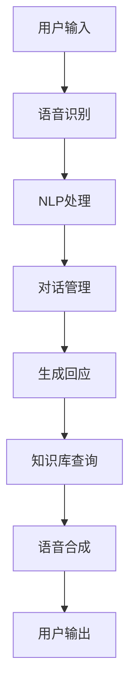
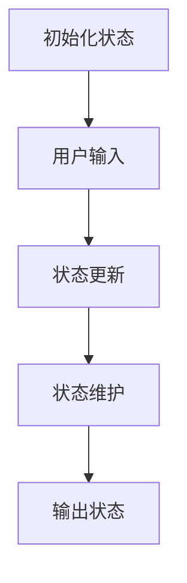
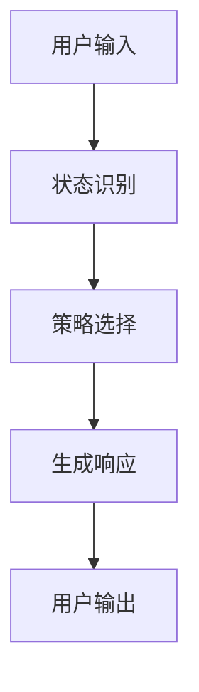
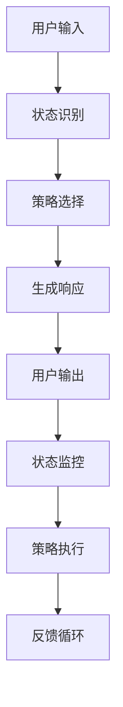

                 

### 第1章: 引言

#### 1.1 对话流控制的背景与意义

对话流控制是人工智能领域中的一个重要课题，特别是在对话系统日益普及的今天。随着技术的进步，对话系统已经深入到我们的日常生活中，从智能客服到智能家居，再到虚拟助手和语音助手，这些系统的共同特点是需要与用户进行高效、自然的交互。而对话流控制正是实现这一目标的关键。

在早期的计算机时代，程序与用户的交互主要是基于命令行或图形界面的输入和输出。这种方式虽然简单，但缺乏灵活性，难以实现自然语言的理解和回应。随着自然语言处理技术的不断发展，计算机逐渐具备了理解自然语言的能力，这使得对话系统成为可能。然而，对话流控制并非一个简单的任务，它涉及到多个层面的复杂问题，如如何确保对话的连贯性、理解用户的意图、以及有效地管理对话流程等。

对话流控制的背景可以追溯到人工智能的早期发展。在20世纪80年代，基于知识的系统（Knowledge-Based Systems）开始兴起，这些系统试图通过模拟专家的知识和推理能力来解决问题。然而，这些系统的交互方式往往比较僵硬，用户需要按照预设的格式输入信息，这使得交互体验大打折扣。随着自然语言处理技术的发展，对话流控制开始成为研究的热点。

对话流控制的意义在于，它能够显著提升对话系统的用户体验。有效的对话流控制可以确保对话的连贯性和流畅性，使得系统能够更好地理解用户的意图，从而提供更加精准和个性化的服务。例如，在智能客服中，对话流控制能够帮助系统识别用户的问题，并提供相关的解决方案，从而提高问题解决的效率和准确性。

此外，对话流控制还在其他领域有着广泛的应用。例如，在医疗领域，对话系统可以帮助医生进行诊断和治疗方案的推荐；在教育领域，对话系统可以作为个性化学习助手，为学生提供定制化的学习建议。在这些应用中，对话流控制不仅能够提升交互体验，还能为专业领域的工作提供有力的支持。

总之，对话流控制是人工智能领域中一个重要且具有挑战性的问题。它不仅涉及到自然语言处理、知识表示和推理等技术，还需要解决如何在复杂环境中实现高效、自然的交互等实际问题。随着技术的不断进步，对话流控制有望在未来带来更加智能、高效的交互体验。

#### 1.2 对话系统的基本概念与架构

对话系统是一种能够与人类进行自然语言交互的计算机系统，它通常包括多个模块，如语音识别、自然语言处理、对话管理和语音合成等。理解这些基本概念和架构对于深入探讨对话流控制至关重要。

首先，我们来讨论对话系统的定义。对话系统是一种通过自然语言交互与人类用户进行沟通的计算机程序。它不仅仅是一个简单的问答机器，而是一个能够理解用户意图、进行推理和生成合理回应的智能系统。对话系统的主要目标是提供一种自然、流畅的交互体验，使用户能够以一种类似与人交谈的方式与计算机进行交流。

接下来，我们来看看对话系统的组成部分。一个典型的对话系统通常包括以下几个核心模块：

1. **语音识别（Speech Recognition）**：语音识别模块负责将用户的语音输入转换为文本。这一过程涉及到语音信号的处理、特征提取和模型匹配。语音识别技术的发展使得计算机能够更准确地理解用户的语音指令，从而为后续的自然语言处理打下基础。

2. **自然语言处理（Natural Language Processing, NLP）**：自然语言处理模块负责对转换后的文本进行分析和理解。这一过程包括分词、词性标注、句法分析、语义分析和情感分析等。自然语言处理的核心任务是让计算机理解文本的含义，从而生成合理的回应。

3. **对话管理（Dialogue Management）**：对话管理模块负责协调和指导整个对话过程。它根据用户的行为和系统的状态，决定系统的下一步行动，包括理解用户的意图、生成回应以及执行相应的操作。对话管理模块的核心任务是确保对话的连贯性和流畅性。

4. **语音合成（Text-to-Speech, TTS）**：语音合成模块负责将生成的文本转换为语音输出。这一过程涉及到语音合成算法和语音数据库的运用，使得系统能够以一种自然、流畅的方式与用户进行交流。

5. **知识库（Knowledge Base）**：知识库是对话系统的重要组成部分，它存储了大量的信息和知识，供对话系统在处理用户问题时进行查询和利用。知识库可以包括事实数据、规则和模型，它为对话系统提供了丰富的背景知识和推理依据。

这些模块之间相互协作，共同实现对话系统的功能。具体来说，当一个用户发起语音或文本输入时，语音识别模块首先将语音转换为文本。接下来，自然语言处理模块对文本进行分析和理解，识别用户的意图和需求。对话管理模块根据这些信息，生成相应的回应，并可能调用知识库中的数据来支持决策。最后，语音合成模块将生成的文本转换为语音输出，返回给用户。

为了更好地理解这些模块之间的相互作用，我们可以借助一个Mermaid流程图来展示对话系统的基本架构：



这个流程图清晰地展示了用户输入、各个模块的处理过程以及最终的输出。通过这种直观的方式，我们可以更好地理解对话系统的整体架构和工作原理。

总之，对话系统是一个复杂且高度协作的系统，它需要多个模块共同发挥作用，才能实现与用户的高效、自然交互。了解对话系统的基本概念和架构，是进一步探讨对话流控制的重要基础。

### 1.3 本书结构安排与主要内容

本书旨在全面探讨对话流控制的各个方面，帮助读者深入了解对话系统的设计与实现。本书结构分为以下几个主要部分，每个部分都针对不同的核心主题进行详细探讨：

#### 第1章：引言

本章首先介绍了对话流控制的背景与意义，探讨了其在现代沟通和交互场景中的重要性。接着，详细讨论了对话系统的基本概念与架构，为后续章节的深入学习打下基础。

#### 第2章：对话流控制的核心概念

本章将介绍对话流控制中的核心概念，包括对话状态跟踪（DST）、对话策略（DP）、对话管理（DM）等。我们将通过具体的实例和Mermaid流程图，详细阐述这些概念之间的关系和作用。

#### 第3章：对话流控制算法原理

本章将深入探讨对话流控制的核心算法，包括基于规则的方法、机器学习方法等。我们将使用伪代码和详细的数学模型，解释这些算法的工作原理和实现过程。

#### 第4章：对话流控制的实现技术

本章将介绍实现对话流控制所需的技术，包括自然语言处理（NLP）、语音识别（ASR）和语音合成（TTS）等。我们将通过具体的代码示例，展示如何在实际项目中应用这些技术。

#### 第5章：多轮对话的技巧与策略

本章将讨论多轮对话中的关键技巧和策略，如上下文维护、意图识别、灵活回应等。我们将结合实际案例，分析这些技巧和策略的应用效果，并提供优化建议。

#### 第6章：对话流控制的应用场景

本章将探讨对话流控制在不同应用场景中的具体应用，包括智能客服、虚拟助手、语音助手等。我们将通过实际项目案例，分析对话流控制在这些场景中的实现和优化。

#### 第7章：对话流控制的挑战与未来趋势

本章将讨论对话流控制面临的主要挑战和未来发展趋势。我们将分析现有技术的局限性，探讨未来可能的研究方向和解决方案。

通过以上七个章节的详细探讨，本书旨在为读者提供一个全面、系统的对话流控制学习资源，帮助读者掌握对话流控制的核心概念、算法和实现技术，为在实际项目中应用对话流控制提供指导。

### 第2章：对话流控制的核心概念

#### 2.1 对话状态跟踪（Dialogue State Tracking）

对话状态跟踪（DST）是对话流控制中的一项关键技术，它旨在实时跟踪和更新对话过程中的用户状态。DST的核心目标是通过分析用户的输入和系统的响应，持续更新对话状态，确保对话系统能够在多轮对话中保持上下文的连贯性和一致性。

**DST的概念与原理：**

DST的基本概念是建立一个对话状态跟踪器，该跟踪器能够记录并更新对话中的关键信息。这些信息通常包括用户的意图、已提供的信息、系统已执行的操作等。DST的原理可以概括为以下三个步骤：

1. **状态初始化**：在对话开始时，系统需要初始化对话状态，通常基于预设的初始状态或用户提供的初始信息。
2. **状态更新**：随着对话的进行，系统需要根据用户的输入和系统的响应，持续更新对话状态。这一过程通常涉及自然语言处理技术，如实体识别和意图分类，以识别用户的新信息和意图。
3. **状态维护**：系统需要定期检查对话状态的完整性和准确性，确保状态信息是最新的，并在必要时进行调整。

**DST的算法与实现：**

DST的算法实现通常基于概率图模型、序列模型或基于规则的方法。以下是一个简单的基于概率图模型的伪代码示例：

```python
function DialogueStateTracking(input, dialogue_history):
    # 初始化状态变量
    current_state = initialize_state(input, dialogue_history)
    
    # 更新状态
    current_state = update_state(input, current_state)
    
    # 维护状态
    current_state = maintain_state(current_state)
    
    return current_state
```

**DST的应用场景：**

DST在多个应用场景中发挥着重要作用，例如：

- **智能客服**：DST可以帮助智能客服系统在多轮对话中记住用户的问题和需求，提供更加个性化的服务。
- **虚拟助手**：虚拟助手需要跟踪用户的指令和偏好，以便提供定制化的帮助。
- **语音助手**：语音助手通过DST来理解和回应用户的连续提问，提高交互的自然性和流畅性。

**Mermaid流程图：**

为了更直观地展示DST的工作流程，我们可以使用Mermaid流程图来表示：



#### 2.2 对话策略（Dialogue Policy）

对话策略（DP）是对话流控制中的另一个核心概念，它定义了系统如何根据当前的状态和用户的行为选择合适的响应。对话策略旨在确保对话过程的连贯性、灵活性和有效性。

**DP的概念与原理：**

对话策略的定义涉及多个方面：

1. **策略空间**：策略空间是指系统可以采取的所有可能行动的集合。这些行动包括生成回应、请求更多信息、执行操作等。
2. **状态空间**：状态空间是指系统在对话过程中可能遇到的全部状态。这些状态包括用户的意图、已提供的信息、系统的响应等。
3. **策略函数**：策略函数定义了系统在给定状态和策略空间中，如何选择最优的响应行动。策略函数通常基于成本函数或效用函数来评估不同行动的优劣。

DP的工作原理可以概括为以下步骤：

1. **状态识别**：系统需要识别当前的状态，这通常依赖于对话状态跟踪器。
2. **策略选择**：系统根据当前状态和策略空间，使用策略函数选择最佳响应行动。
3. **响应生成**：系统根据选定的响应行动，生成合适的回应并返回给用户。

**DP的算法与实现：**

DP的算法实现可以根据不同的应用场景和需求采用不同的方法。以下是一个简单的基于决策树的伪代码示例：

```python
function DialoguePolicy(state, policy_space):
    # 识别当前状态
    current_state = identify_state(state)
    
    # 选择最佳策略
    best_action = select_best_action(current_state, policy_space)
    
    # 生成响应
    response = generate_response(best_action)
    
    return response
```

**DP的应用场景：**

对话策略在多个应用场景中具有重要应用，例如：

- **智能客服**：通过对话策略，智能客服可以更有效地与用户沟通，提供定制化的解决方案。
- **虚拟助手**：虚拟助手利用对话策略来理解用户的意图，并生成合理的回应，提高用户的满意度。
- **语音助手**：语音助手通过对话策略来响应用户的连续提问，保持对话的连贯性和流畅性。

**Mermaid流程图：**

以下是DST和DP结合的Mermaid流程图：



#### 2.3 对话管理（Dialogue Management）

对话管理（DM）是对话流控制的总体框架，它负责协调和指导整个对话过程。DM旨在确保对话系统在不同情境下能够有效地与用户交互，实现预期的目标。

**DM的概念与原理：**

对话管理的核心概念包括对话流程控制、用户状态跟踪、策略执行和反馈循环。DM的工作原理可以概括为以下步骤：

1. **对话初始化**：系统启动时，DM初始化对话流程，并设置初始状态。
2. **状态监控**：DM持续监控对话状态，并根据用户的输入和系统的响应，更新对话状态。
3. **策略执行**：DM根据当前状态和预设的策略，选择并执行适当的行动。
4. **反馈循环**：DM收集用户的反馈，调整策略和状态，以优化对话效果。

**DM的算法与实现：**

DM的算法实现通常基于多任务学习（Multi-Task Learning）、强化学习（Reinforcement Learning）或混合方法。以下是一个简单的基于强化学习的伪代码示例：

```python
function DialogueManagement(state, action_space, reward_function):
    # 初始化对话
    current_state = initialize_dialogue()
    
    while not dialogue_end(current_state):
        # 选择最佳动作
        action = select_best_action(current_state, action_space)
        
        # 执行动作
        next_state, reward = execute_action(action, current_state)
        
        # 更新状态
        current_state = next_state
        
        # 反馈循环
        update_policy(action, reward)
        
    return current_state
```

**DM的应用场景：**

对话管理在多个应用场景中具有重要应用，例如：

- **智能客服**：通过对话管理，智能客服系统能够更好地处理用户的复杂需求，提供高效的服务。
- **虚拟助手**：虚拟助手利用对话管理来理解用户的意图，并生成合理的回应，提高用户的满意度。
- **语音助手**：语音助手通过对话管理来响应用户的连续提问，保持对话的连贯性和流畅性。

**Mermaid流程图：**

以下是DST、DP和DM结合的Mermaid流程图：



通过以上对对话状态跟踪（DST）、对话策略（DP）和对话管理（DM）的详细探讨，我们能够更深入地理解对话流控制的核心概念和原理。这些概念和原理是构建高效对话系统的基础，为后续章节的深入讨论提供了必要的理论基础。

### 第3章：对话流控制算法原理

#### 3.1 基于规则的方法

基于规则的方法（Rule-Based Methods）是对话流控制中最传统和广泛应用的一种方法。这种方法通过预定义的规则来指导对话流程，确保对话的连贯性和一致性。虽然这种方法在处理简单任务时表现良好，但在处理复杂、多变的对话场景时，可能存在规则过于繁琐和难以维护的问题。

**基本概念与原理：**

基于规则的方法的核心在于规则库的构建。规则库由一系列条件-动作对组成，每个条件-动作对描述了在特定情况下系统应该采取的行动。例如：

```
条件：用户输入 "我想要订餐"
动作：查询菜单并询问用户口味偏好
```

**算法流程：**

1. **规则匹配**：系统根据用户的输入，匹配规则库中的条件。如果找到匹配的规则，则执行相应的动作。
2. **动作执行**：系统执行匹配到的规则中的动作，可能是生成响应、请求更多信息或执行某个操作。
3. **规则更新**：系统可以根据对话的进展和用户的反馈，动态更新规则库中的规则。

**伪代码示例：**

```python
function RuleBasedDialogueControl(input, rule_base):
    for rule in rule_base:
        if matches_condition(input, rule.condition):
            execute_action(rule.action)
            return "Response based on rule"
    return "No rule matches"
```

**优点与局限性：**

- **优点**：实现简单、易于理解和维护，适用于规则明确且对话场景相对简单的应用。
- **局限性**：在面对复杂和多变的对话场景时，规则库可能过于庞大且难以维护，灵活性较差。

#### 3.2 机器学习方法

随着人工智能技术的发展，机器学习方法（Machine Learning Methods）逐渐成为对话流控制的重要手段。这种方法通过学习用户的历史数据和对话模式，自动生成对话策略和响应，从而提高对话的灵活性和适应性。

**基本概念与原理：**

机器学习方法的核心在于训练模型。模型通过分析大量的对话数据，学习如何根据当前状态生成最佳的响应。常见的机器学习方法包括监督学习、无监督学习和强化学习。

1. **监督学习（Supervised Learning）**：模型在标记数据集上训练，学习输入和输出之间的映射关系。例如，使用已标记的用户输入和系统响应来训练模型，使其能够预测新的用户输入的响应。

2. **无监督学习（Unsupervised Learning）**：模型在没有标记数据的情况下训练，学习数据中的模式和结构。例如，通过聚类算法将类似的对话场景归类，以便在后续对话中提供更个性化的服务。

3. **强化学习（Reinforcement Learning）**：模型通过与环境的交互学习最优策略。例如，通过奖励机制来激励模型生成更加有效的对话策略。

**算法流程：**

1. **数据收集与预处理**：收集大量的对话数据，并对数据进行清洗和标注，以便用于模型的训练。
2. **模型训练**：使用预处理后的数据集训练模型，使其能够学习对话模式和策略。
3. **策略评估与调整**：通过模拟或实际对话评估模型的性能，并根据反馈调整模型。

**伪代码示例（监督学习）：**

```python
function TrainModel(training_data):
    # 初始化模型
    model = initialize_model()
    
    # 训练模型
    for data in training_data:
        input, target = data
        model.train(input, target)
    
    return model

function GenerateResponse(model, input):
    prediction = model.predict(input)
    return prediction
```

**优点与局限性：**

- **优点**：能够自动学习对话模式和策略，提高对话的灵活性和适应性，适用于复杂和多变的对话场景。
- **局限性**：训练数据的质量和数量对模型的性能有重要影响，且模型训练和调整过程较为复杂。

#### 3.3 混合方法

混合方法（Hybrid Methods）结合了基于规则的方法和机器学习方法的优势，旨在提高对话流控制的效率和灵活性。这种方法通常在规则方法无法处理或效果不佳的场景中，利用机器学习模型来补充和优化规则。

**基本概念与原理：**

混合方法的核心在于将规则和机器学习模型相结合。具体实现时，系统首先使用规则方法处理简单的对话场景，对于无法处理的复杂场景，则利用机器学习模型进行决策。

**算法流程：**

1. **规则匹配**：系统根据用户的输入，尝试匹配规则库中的规则。
2. **模型决策**：如果无法通过规则匹配，系统调用机器学习模型进行决策。
3. **结果融合**：将规则匹配的结果和机器学习模型的输出进行融合，生成最终的响应。

**伪代码示例：**

```python
function HybridDialogueControl(input, rule_base, model):
    # 规则匹配
    rule_response = RuleBasedDialogueControl(input, rule_base)
    
    # 如果规则匹配失败，使用模型决策
    if rule_response == "No rule matches":
        model_response = GenerateResponse(model, input)
        response = model_response
    else:
        response = rule_response
    
    return response
```

**优点与局限性：**

- **优点**：结合了规则方法和机器学习方法的优点，能够处理简单和复杂的对话场景，提高系统的灵活性和适应性。
- **局限性**：实现相对复杂，需要同时维护规则库和机器学习模型，且模型训练和调整过程较为耗时。

通过以上对基于规则的方法、机器学习方法和混合方法的详细讨论，我们可以看到，每种方法都有其独特的优势和局限性。在实际应用中，可以根据具体需求和场景，选择合适的方法来实现对话流控制。

### 第4章：对话流控制的实现技术

#### 4.1 自然语言处理（NLP）

自然语言处理（Natural Language Processing, NLP）是构建对话系统的基础技术之一，它旨在使计算机能够理解、处理和生成人类语言。NLP技术包括文本预处理、实体识别、语义分析、情感分析等多个方面。

**文本预处理：**  
文本预处理是NLP中的第一步，其目标是清洗和标准化输入文本，以便后续处理。主要任务包括分词（Tokenization）、去除停用词（Stopword Removal）和词性标注（Part-of-Speech Tagging）。

**实体识别：**  
实体识别（Named Entity Recognition, NER）是识别文本中的特定实体，如人名、地名、组织名、时间等。NER技术对于理解用户意图和提供个性化服务至关重要。

**语义分析：**  
语义分析（Semantic Analysis）旨在理解文本的深层含义，包括句法分析（Syntactic Parsing）、语义角色标注（Semantic Role Labeling）和语义相似度计算（Semantic Similarity Calculation）等。

**情感分析：**  
情感分析（Sentiment Analysis）用于识别文本中的情感倾向，如正面、负面或中性。情感分析对于了解用户情感状态和优化对话体验具有重要意义。

**技术实现：**  
常见的NLP工具和库包括NLTK、spaCy、Stanford NLP和BERT等。以下是一个简单的情感分析示例代码：

```python
import nltk
from nltk.sentiment import SentimentIntensityAnalyzer

nltk.download('vader_lexicon')

def sentiment_analysis(text):
    analyzer = SentimentIntensityAnalyzer()
    sentiment_score = analyzer.polarity_scores(text)
    return sentiment_score

text = "I love this product!"
score = sentiment_analysis(text)
print(score)
```

**应用场景：**  
- **智能客服**：通过情感分析，智能客服可以识别用户的情感状态，提供更有针对性的服务。
- **舆情分析**：媒体和政府机构可以利用情感分析监测公众情绪，了解社会热点和趋势。
- **个性化推荐**：电商平台利用情感分析，为用户提供个性化的商品推荐。

#### 4.2 语音识别（ASR）

语音识别（Automatic Speech Recognition, ASR）是将语音转换为文本的技术，它使得计算机能够理解和处理语音输入。语音识别技术广泛应用于智能助手、智能客服和语音控制等领域。

**技术原理：**  
语音识别过程包括声学模型、语言模型和声学-语言模型三个阶段。声学模型负责分析语音信号的特征，语言模型负责理解语音的含义，声学-语言模型结合两者的信息，生成文本输出。

**技术实现：**  
常见的语音识别工具和库包括Google的TensorFlow和Kaldi等。以下是一个简单的ASR示例代码：

```python
import speech_recognition as sr

# 初始化语音识别器
recognizer = sr.Recognizer()

# 读取音频文件
with sr.AudioFile('audio_file.wav') as source:
    audio = recognizer.record(source)

# 使用Google语音识别API
text = recognizer.recognize_google(audio)
print(text)
```

**应用场景：**  
- **智能助手**：如苹果的Siri、亚马逊的Alexa和谷歌助手，它们通过语音识别与用户进行交互。
- **智能客服**：语音识别使得智能客服系统能够理解用户的语音输入，提高交互的便利性和效率。
- **语音控制**：在智能家居和汽车领域，语音识别技术用于控制设备的开关、调节音量等。

#### 4.3 语音合成（TTS）

语音合成（Text-to-Speech, TTS）是将文本转换为自然语音输出的技术，它使得计算机能够生成语音响应。语音合成技术广泛应用于语音助手、智能客服和多媒体内容生成等领域。

**技术原理：**  
语音合成过程包括文本处理、语音合成和语音处理三个阶段。文本处理将文本转换为适合合成的格式，语音合成生成语音信号，语音处理对生成的语音进行修饰和优化。

**技术实现：**  
常见的语音合成工具和库包括百度云TTS、Google Text-to-Speech和WaveNet等。以下是一个简单的TTS示例代码：

```python
from gtts import gTTS

# 初始化语音合成器
tts = gTTS('Hello, how are you today?')

# 保存音频文件
tts.save('hello.mp3')

# 播放音频
os.system('mpg321 hello.mp3')
```

**应用场景：**  
- **智能助手**：如苹果的Siri和谷歌助手，它们通过语音合成生成语音响应，提高用户体验。
- **智能客服**：语音合成使得智能客服系统能够以自然语音与用户进行交互。
- **多媒体内容**：如电影、电视剧和游戏中的语音角色配音，语音合成技术用于生成自然流畅的语音输出。

通过以上对自然语言处理（NLP）、语音识别（ASR）和语音合成（TTS）的实现技术的详细讨论，我们可以看到这些技术在对话流控制中扮演着关键角色。了解这些技术原理和实现方法，对于构建高效、智能的对话系统具有重要意义。

### 第5章：多轮对话的技巧与策略

多轮对话是现代对话系统中的一个重要特点，它允许用户和系统之间进行多次交互，从而更深入地了解用户的需求和意图。为了实现高效的多轮对话，我们需要掌握一系列关键的技巧和策略。

#### 5.1 上下文维护

上下文维护是确保多轮对话连贯性的关键。在每次交互中，系统需要保持对话的历史信息，以便在下一次交互中使用。上下文信息可以包括用户的意图、已提供的信息、系统的响应以及对话的状态等。

**上下文维护的技巧：**

1. **使用对话状态跟踪器**：对话状态跟踪器（Dialogue State Tracker）是维护上下文的核心工具。它记录并更新对话过程中的关键信息，确保系统能够在多轮对话中保持一致性和连贯性。

2. **长期上下文记忆**：对话系统需要具备长期上下文记忆的能力，以处理复杂和长时间对话。这可以通过将上下文信息存储在数据库或缓存中来实现，以便在后续对话中使用。

3. **上下文敏感的回应**：系统在生成响应时，需要考虑上下文信息，以确保回应与对话的当前状态和用户的历史信息保持一致。例如，如果用户之前提到了某个话题，系统在后续对话中应继续讨论该话题。

**策略示例：**

```python
class DialogueStateTracker:
    def __init__(self):
        self.context = {}

    def update_context(self, new_context):
        self.context.update(new_context)

    def get_context(self):
        return self.context

# 示例对话
tracker = DialogueStateTracker()
tracker.update_context({"user_intent": "订餐", "preference": "辣"})

response = "请问您想订哪一家的辣味餐点？"
print(response)

tracker.update_context({"selected_restaurant": "川菜馆"})
response = "您选择了川菜馆，我们为您推荐的是香辣牛肉，还需要其他菜品吗？"
print(response)
```

#### 5.2 意图识别

意图识别（Intent Recognition）是理解用户输入和需求的核心环节。在多轮对话中，系统需要准确识别用户的意图，以提供适当的响应。

**意图识别的技巧：**

1. **使用机器学习模型**：通过训练大量的对话数据，可以使用机器学习模型（如分类器、序列模型）来识别用户的意图。这有助于提高识别的准确性和效率。

2. **利用词向量模型**：词向量模型（如Word2Vec、BERT）可以用于提取输入文本的特征，这些特征有助于提高意图识别的精度。

3. **多意图识别**：用户可能在一次输入中表达多个意图，系统需要能够同时识别这些意图，并在后续对话中处理它们。

**策略示例：**

```python
from sklearn.feature_extraction.text import CountVectorizer
from sklearn.naive_bayes import MultinomialNB

# 准备训练数据
X_train = ["我要订餐", "帮我安排行程", "查天气"]
y_train = ["订餐", "行程安排", "查天气"]

# 创建向量器
vectorizer = CountVectorizer()

# 创建分类器
clf = MultinomialNB()

# 训练模型
X_train_vectorized = vectorizer.fit_transform(X_train)
clf.fit(X_train_vectorized, y_train)

# 测试数据
input_text = "我想订个餐厅"

# 预测意图
input_vectorized = vectorizer.transform([input_text])
predicted_intent = clf.predict(input_vectorized)[0]
print(predicted_intent)
```

#### 5.3 灵活回应

灵活回应是提高用户满意度的重要因素。系统需要能够根据对话的不同阶段和上下文，生成合适的回应，以保持对话的自然性和流畅性。

**灵活回应的技巧：**

1. **多模态交互**：结合文本、语音、图像等多种模态进行交互，可以提供更加丰富和自然的用户体验。

2. **上下文感知的回应**：系统应考虑对话的上下文，生成与当前情境相关的回应。例如，如果用户正在讨论某个具体的话题，系统应继续围绕该话题进行回应。

3. **个性化回应**：根据用户的历史数据和偏好，生成个性化的回应，以提高用户的满意度和参与度。

**策略示例：**

```python
def generate_response(context):
    if "user_intent" in context and context["user_intent"] == "订餐":
        return "请问您想订哪一家的餐点？"
    elif "selected_restaurant" in context:
        return "了解了，您选择了{restaurant}，请问还有其他需要帮忙的吗？".format(restaurant=context["selected_restaurant"])
    else:
        return "您好，有什么可以帮助您的？"

context = {"user_intent": "订餐"}
response = generate_response(context)
print(response)

context["selected_restaurant"] = "川菜馆"
response = generate_response(context)
print(response)
```

通过以上对上下文维护、意图识别和灵活回应的详细讨论，我们可以看到这些技巧和策略对于实现高效的多轮对话至关重要。掌握这些技巧和策略，可以帮助构建更加智能、自然的对话系统，提高用户体验。

### 第6章：对话流控制的应用场景

#### 6.1 智能客服

智能客服是对话流控制最为广泛的应用场景之一，其核心目标是通过对话系统提供高效、个性化的服务，提高客户满意度。智能客服通常包括多个模块，如聊天机器人、语音助手和自动化应答系统等，这些模块协同工作，实现与用户的自然交互。

**实现步骤：**

1. **用户输入处理**：智能客服系统首先接收用户的输入，这可以是文本或语音形式。语音识别模块将语音转换为文本，以便进行后续处理。

2. **意图识别**：系统使用自然语言处理技术对用户输入进行分析，识别用户的意图。常见的意图包括查询信息、投诉、订购产品等。

3. **对话策略生成**：根据识别到的意图和当前对话状态，系统生成对话策略。对话策略定义了系统如何回应用户，包括提供信息、请求更多信息或执行操作。

4. **响应生成与发送**：系统根据对话策略生成合适的响应，并返回给用户。语音合成模块将文本响应转换为自然语音，通过聊天界面或语音输出返回给用户。

**案例解析：**

一个典型的案例是某电商平台的智能客服系统。用户通过聊天界面询问某款产品的价格，智能客服系统首先识别用户的意图为“查询价格”。系统查询数据库，获取该产品的价格信息，然后生成响应：“您好，该产品的价格为人民币XX元。”

**优化建议：**

1. **提升意图识别准确率**：通过增加训练数据和优化算法，提升意图识别的准确率，减少误识别和漏识别的情况。

2. **个性化服务**：根据用户的历史购买记录和偏好，提供个性化的推荐和解决方案，提高用户体验。

3. **多轮对话支持**：系统应支持多轮对话，能够记住用户的上下文信息，提供连贯的服务。

#### 6.2 虚拟助手

虚拟助手是一种集成在应用程序或设备中的智能对话系统，旨在为用户提供个性化帮助和自动化服务。虚拟助手广泛应用于智能手机、智能家居、电子邮件管理等领域。

**实现步骤：**

1. **用户交互**：虚拟助手通过聊天界面或语音与用户进行交互。语音识别模块将用户的语音输入转换为文本，以便进行后续处理。

2. **任务识别**：系统识别用户输入的任务，如发送邮件、预约日程、播放音乐等。

3. **任务处理**：虚拟助手根据识别到的任务，调用相应的功能模块进行任务处理。例如，发送邮件需要调用邮件客户端，播放音乐需要调用音乐播放器。

4. **响应生成与发送**：系统生成任务完成的响应，并通过聊天界面或语音输出返回给用户。

**案例解析：**

一个常见的案例是智能手机中的虚拟助手，如苹果的Siri或谷歌助手。用户可以询问Siri明天天气如何，Siri会通过语音合成模块生成天气信息，并返回给用户。

**优化建议：**

1. **提升交互自然性**：通过改进自然语言处理和语音合成技术，提高交互的自然性和流畅性。

2. **智能任务预测**：通过分析用户的历史行为和习惯，预测用户可能需要完成的任务，提前做好准备，提供更加主动和高效的服务。

3. **多模态交互**：支持多种输入和输出方式，如文本、语音、图像等，以满足不同用户的需求。

#### 6.3 语音助手

语音助手是专门为语音交互设计的对话系统，广泛应用于智能家居、汽车、电话客服等领域。语音助手通过语音识别和自然语言处理技术，理解用户的语音指令，并生成相应的语音响应。

**实现步骤：**

1. **语音识别**：语音助手首先通过语音识别模块将用户的语音输入转换为文本。

2. **意图识别**：系统对转换后的文本进行分析，识别用户的意图，如开关家居设备、设置日程等。

3. **任务处理**：根据识别到的意图，系统调用相应的功能模块进行任务处理，如控制智能家居设备、拨打电话等。

4. **语音合成**：系统生成语音响应，通过语音合成模块将文本转换为自然语音，返回给用户。

**案例解析：**

一个典型的案例是亚马逊的Echo智能音箱。用户可以通过语音命令询问Echo今天的天气预报，Echo会通过语音合成模块生成语音响应，并播放给用户。

**优化建议：**

1. **提升语音识别准确率**：通过改进语音识别算法和增加训练数据，提升语音识别的准确率，减少误解和错误。

2. **多语言支持**：支持多种语言，满足不同地区用户的需求。

3. **上下文理解能力**：通过提升上下文理解能力，使语音助手能够更好地处理复杂和多轮对话。

通过以上对智能客服、虚拟助手和语音助手三个应用场景的详细讨论，我们可以看到对话流控制在这些场景中的应用不仅提高了效率，还提供了更加自然和个性化的用户体验。了解这些应用场景的实现步骤和优化建议，对于构建高效、智能的对话系统具有重要意义。

### 第7章：对话流控制的挑战与未来趋势

#### 7.1 当前对话流控制的挑战

对话流控制虽然取得了显著进展，但仍然面临诸多挑战。以下是一些主要的挑战：

1. **复杂性问题**：对话流控制需要处理的信息量庞大，包括语音识别、自然语言处理、意图识别等多个环节。每个环节都可能存在复杂性，例如语音识别的准确性、自然语言处理的上下文理解等。

2. **上下文理解**：对话流控制需要能够准确理解和维持对话上下文，以确保对话的连贯性和一致性。然而，实际应用中，上下文信息的处理和维持仍然是一个难点，特别是在多轮对话和复杂场景下。

3. **个性化服务**：为了提供高质量的对话服务，对话系统需要根据用户的历史数据和偏好，提供个性化的服务。然而，如何准确获取和利用用户数据，避免隐私泄露，是一个需要解决的难题。

4. **错误处理**：对话流控制需要能够有效处理错误，例如用户的误解、系统响应错误等。如何在错误发生时快速恢复并保持对话的流畅性，是一个具有挑战性的问题。

5. **计算资源**：对话流控制需要大量的计算资源，尤其是在处理高并发、实时对话时。如何优化算法和系统架构，以降低计算资源的消耗，是一个需要关注的问题。

#### 7.2 未来趋势与解决方案

面对上述挑战，对话流控制领域正在朝着以下几个方向发展：

1. **深度学习与强化学习**：深度学习和强化学习技术在对话流控制中具有巨大潜力。通过利用大规模数据和复杂的神经网络，可以显著提升对话系统的性能和智能化水平。未来的研究可以进一步探索这些技术在对话流控制中的应用，以及如何有效地整合多种学习技术。

2. **多模态交互**：多模态交互（如文本、语音、图像、视频等）可以提供更加丰富和自然的用户体验。未来对话流控制的研究可以专注于如何有效地融合多种模态的信息，提高对话系统的理解和响应能力。

3. **语义理解与推理**：对话流控制的未来需要更加依赖语义理解和推理技术。通过深入理解用户的意图和上下文，系统可以生成更加准确和个性化的响应。未来的研究可以探索如何构建更加强大和灵活的语义理解模型，以及如何将这些模型有效地集成到对话流控制中。

4. **人机协同**：随着人工智能技术的不断发展，人机协同将成为对话流控制的一个重要趋势。系统可以与人类专家或用户共同完成复杂任务，提高对话系统的智能水平和可靠性。未来的研究可以探讨如何设计高效的人机协同机制，以及如何确保用户和系统的有效沟通。

5. **可解释性和透明性**：随着对话系统的智能化程度提高，其决策过程可能变得复杂和不可解释。未来需要关注如何提高对话系统的可解释性和透明性，使得用户能够理解系统的决策过程，增强用户对系统的信任。

6. **隐私保护**：在处理用户数据时，隐私保护是一个重要且敏感的问题。未来的研究可以探索如何在确保用户隐私的前提下，有效利用用户数据来提升对话系统的性能。

通过上述未来趋势的探讨，我们可以看到对话流控制领域充满了机遇和挑战。随着技术的不断进步和研究的深入，对话流控制有望在未来实现更加智能、高效和个性化的交互体验。

### 结论与展望

通过本书的详细探讨，我们系统地了解了对话流控制的核心概念、算法和实现技术，以及其在智能客服、虚拟助手和语音助手等应用场景中的具体应用。对话流控制不仅提升了用户体验，还极大地提高了沟通效率和智能化水平。然而，面对复杂的交互环境和多变的需求，对话流控制仍然面临诸多挑战，如上下文理解、个性化服务和错误处理等。

展望未来，深度学习和强化学习技术的应用将显著提升对话系统的性能和智能化水平。多模态交互、人机协同和隐私保护等方向的研究也将为对话流控制带来新的机遇。通过不断探索和创新，我们有理由相信，对话流控制将在人工智能领域发挥越来越重要的作用，为人们带来更加智能、高效和自然的交互体验。

### 最佳实践 Tips

1. **优化规则库**：定期审查和更新规则库，确保规则简明且高效，减少冗余和冲突。

2. **增强数据质量**：提高训练数据的质量和多样性，有助于提升模型的学习效果和泛化能力。

3. **利用自然语言处理库**：充分利用现有的NLP库（如spaCy、NLTK、BERT等）来处理文本数据，提升意图识别和上下文理解的准确性。

4. **持续迭代与优化**：定期收集用户反馈，持续迭代和优化对话系统，以适应不断变化的需求和场景。

5. **确保隐私保护**：在设计对话系统时，确保用户隐私得到有效保护，遵循相关法律法规。

### 小结

本书从对话流控制的核心概念出发，详细介绍了对话状态跟踪、对话策略和对话管理等关键技术，并通过实际案例展示了其应用场景。通过对基于规则的方法、机器学习方法和混合方法的探讨，我们了解了不同方法的优缺点及其适用场景。最后，我们展望了对话流控制的未来趋势，并提出了最佳实践建议。希望读者能够通过本书，深入理解对话流控制，为实际项目提供有益的指导。

### 注意事项

1. **对话系统的安全性**：确保对话系统在处理用户输入和输出时，不会泄露用户隐私或造成安全隐患。

2. **对话系统的可维护性**：设计对话系统时，要考虑到系统的可维护性，便于后续的更新和优化。

3. **对话系统的可扩展性**：对话系统应具备良好的扩展性，能够适应未来技术和需求的变化。

4. **用户反馈的重要性**：用户反馈是改进对话系统的重要资源，应积极收集和分析用户反馈，以不断提升系统质量。

### 拓展阅读

- 《对话系统设计与实现》
- 《深度学习与自然语言处理》
- 《人机交互技术导论》
- 《人工智能：一种现代方法》

通过阅读这些书籍，读者可以进一步拓展对话流控制的知识体系，深入理解相关技术原理和实践方法。作者：AI天才研究院/AI Genius Institute & 禅与计算机程序设计艺术 /Zen And The Art of Computer Programming。

