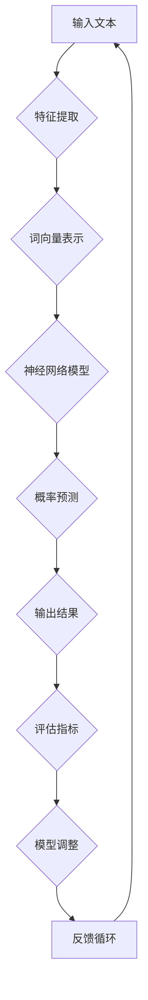

                 

## 文章标题

少样本学习评估：测试LLM的快速适应能力

> 关键词：少样本学习，语言模型（LLM），评估方法，快速适应能力，测试

> 摘要：本文旨在探讨少样本学习评估在测试语言模型（LLM）快速适应能力方面的作用。文章首先介绍了少样本学习的概念和重要性，随后详细阐述了语言模型的基本原理和关键技术。接着，文章深入分析了少样本学习评估的方法和指标，并通过具体案例展示了评估过程的实践应用。最后，文章探讨了如何通过测试快速适应能力来评估LLM的表现，为未来的研究和应用提供了有价值的参考。

## 第一部分：背景与概述

### 1.1 少样本学习的定义与重要性

少样本学习（Few-Shot Learning）是指在学习过程中仅使用非常少量的样本来训练模型，旨在提高模型在面对少量数据时的表现能力。在传统机器学习中，模型往往需要大量的训练数据来获得良好的性能。然而，在实际应用中，数据获取可能非常困难或昂贵，例如医疗诊断、生物特征识别等领域。少样本学习正是为了解决这类问题而提出的一种学习范式。

少样本学习的重要性体现在以下几个方面：

1. **数据稀缺性**：许多领域（如生物医学、工业自动化等）存在数据稀缺性问题，难以获得大规模的训练数据集。
2. **隐私保护**：在某些应用场景中，数据隐私是一个重要的考虑因素，公开大量数据可能带来隐私泄露的风险。
3. **高效性**：少样本学习模型能够更快地适应新任务，减少训练时间，提高效率。
4. **泛化能力**：少样本学习模型能够在较少的数据上获得较好的泛化能力，减少对数据分布的依赖。

### 1.2 传统机器学习与少样本学习的区别

传统机器学习通常依赖于大量的数据集进行训练，以达到较好的模型性能。其主要特点如下：

1. **大量数据依赖**：传统机器学习模型需要大量的训练数据来获得良好的性能。
2. **数据分布敏感性**：传统机器学习模型对数据分布非常敏感，数据分布的变化可能导致模型性能的显著下降。
3. **训练时间成本**：传统机器学习模型的训练时间通常较长，尤其是在处理大规模数据集时。

相比之下，少样本学习具有以下特点：

1. **少量数据训练**：少样本学习模型能够在仅使用少量样本来训练的情况下获得良好的性能。
2. **数据分布适应性**：少样本学习模型对数据分布的变化具有更好的适应性，能够更好地处理不同分布的数据。
3. **训练时间效率**：少样本学习模型能够更快地适应新任务，减少训练时间。

### 1.3 少样本学习的发展历程

少样本学习作为机器学习领域的一个重要研究方向，其发展历程可以追溯到上世纪80年代末90年代初。最初的研究主要集中在模型选择和简化上，如原型分类、聚类等。随着深度学习技术的快速发展，少样本学习得到了广泛关注和应用。

1. **原型分类与聚类**：最早的研究集中在基于原型的方法，如k-最近邻（k-Nearest Neighbor，k-NN）和聚类算法。这些方法通过在少量样本中寻找代表性原型来分类新样本。
2. **元学习**：元学习（Meta-Learning）作为一种解决少样本学习问题的重要方法，通过学习如何学习来提高模型的泛化能力。代表性的方法包括模型自适应（Model Adaptation）和模型选择（Model Selection）。
3. **深度学习方法**：随着深度学习的兴起，基于深度神经网络的少样本学习方法得到了广泛关注。如基于度量学习（Metric Learning）的方法、基于生成对抗网络（Generative Adversarial Networks，GAN）的方法等。
4. **跨域迁移学习**：少样本学习的跨域迁移学习研究旨在解决不同领域数据分布差异较大的问题，通过在源域和目标域之间共享知识来提高模型的泛化能力。

### 1.4 少样本学习的应用场景

少样本学习在许多实际应用场景中具有广泛的应用前景，如下：

1. **医疗诊断**：少样本学习可以用于基于图像和文本的医疗诊断，如肺癌、乳腺癌的早期检测，提高诊断准确性。
2. **智能助手**：少样本学习可以帮助智能助手更快地适应用户的需求，提供个性化的服务。
3. **自动驾驶**：少样本学习可以帮助自动驾驶系统在少量数据下快速适应新的交通环境和场景。
4. **个性化推荐**：少样本学习可以用于个性化推荐系统，根据用户的历史行为和少量新行为来推荐合适的商品或内容。

### 1.5 少样本学习的挑战

尽管少样本学习在许多应用中具有巨大的潜力，但仍然面临一些挑战：

1. **数据匮乏**：在实际应用中，往往难以获取足够数量的训练数据。
2. **过拟合**：在少量数据上训练的模型容易发生过拟合，导致在新数据上表现不佳。
3. **模型选择**：在少样本学习场景中，如何选择合适的模型是一个重要问题。
4. **评估指标**：如何设计合适的评估指标来衡量少样本学习模型的性能仍是一个挑战。

### 1.6 文章结构概述

本文将按照以下结构展开：

1. **第一部分**：背景与概述，介绍少样本学习的定义、重要性、发展历程和应用场景。
2. **第二部分**：语言模型（LLM）基础，详细阐述语言模型的基本原理和关键技术。
3. **第三部分**：少样本学习评估方法，探讨评估指标和方法，并通过具体案例展示评估过程。
4. **第四部分**：快速适应能力的测试，介绍如何测试LLM的快速适应能力。
5. **第五部分**：展望与未来趋势，展望少样本学习的未来发展。

通过上述结构，本文旨在为读者提供一个全面、系统的关于少样本学习评估和LLM快速适应能力的分析和探讨，为相关领域的进一步研究提供有价值的参考。接下来，我们将深入探讨语言模型（LLM）的基础知识，为后续内容打下坚实的基础。

## 第二部分：语言模型（LLM）基础

### 2.1 语言模型简介

语言模型（Language Model，简称LM）是自然语言处理（Natural Language Processing，简称NLP）领域中的一个核心组成部分。它通过统计方法或神经网络模型来预测文本中的下一个单词或字符。语言模型在许多NLP任务中具有广泛的应用，如机器翻译、文本生成、问答系统、语音识别等。

### 2.2 LLM的工作原理

语言模型的工作原理可以分为以下几个步骤：

1. **文本输入**：首先，语言模型接收一段文本输入，这段文本可以是句子、段落或整篇文章。
2. **特征提取**：接着，语言模型对输入文本进行特征提取，将文本转换为计算机可以处理的数字表示。这一过程通常涉及词向量表示、词性标注、句法分析等。
3. **概率预测**：然后，语言模型利用训练得到的模型参数，计算每个可能单词或字符出现的概率。这一步通常使用基于统计的方法（如N-gram模型）或神经网络模型（如循环神经网络RNN、长短期记忆网络LSTM、变换器模型Transformer等）。
4. **输出结果**：最后，语言模型根据概率分布选择一个最可能的单词或字符作为输出结果。

### 2.3 LLM的关键技术

语言模型的关键技术包括以下几个方面：

1. **词向量表示**：词向量是将单词映射到高维空间中的向量表示，用于捕捉单词的语义和语法信息。常见的词向量表示方法包括Word2Vec、GloVe等。
2. **神经网络模型**：神经网络模型是语言模型的核心，通过多层神经网络来学习文本数据中的内在规律。常见的神经网络模型包括循环神经网络RNN、长短期记忆网络LSTM、变换器模型Transformer等。
3. **注意力机制**：注意力机制是神经网络模型中的一个重要组成部分，用于捕捉文本中的关键信息。注意力机制可以显著提高模型的表示能力和性能。
4. **预训练与微调**：预训练是指在大规模语料库上对语言模型进行预训练，使其具备一定的通用语言能力。微调是指在使用预训练模型的基础上，针对特定任务进行进一步的调整和优化。
5. **上下文理解**：语言模型需要能够理解文本的上下文信息，以生成更准确和自然的输出。上下文理解能力是语言模型性能的重要指标。

### 2.4 LLM的优缺点

语言模型具有以下优缺点：

1. **优点**：
   - **强大的语义理解能力**：语言模型能够捕捉单词的语义和语法信息，生成更准确和自然的文本。
   - **多任务兼容性**：语言模型可以应用于多种NLP任务，如文本生成、机器翻译、问答系统等。
   - **自适应能力**：语言模型可以基于预训练和微调技术，快速适应新的任务和数据。

2. **缺点**：
   - **计算资源需求大**：语言模型的训练和推理过程需要大量的计算资源。
   - **数据依赖性高**：语言模型对训练数据的依赖性较高，数据质量直接影响模型的性能。
   - **解释性不足**：语言模型的内部工作机制较为复杂，难以解释每个决策背后的原因。

### 2.5 语言模型在少样本学习中的应用

语言模型在少样本学习中的应用具有以下优势：

1. **快速适应新任务**：语言模型通过预训练和微调技术，可以在少量数据上快速适应新的任务。
2. **泛化能力**：语言模型具有较好的泛化能力，能够在不同领域和任务中表现良好。
3. **上下文理解能力**：语言模型能够理解文本的上下文信息，提高少样本学习任务的表现。

然而，语言模型在少样本学习中也面临一些挑战，如数据稀缺性、过拟合问题等。因此，需要设计合适的评估方法和指标来测试语言模型的适应能力和性能。

### 2.6 语言模型与少样本学习的联系

语言模型与少样本学习之间的联系主要体现在以下几个方面：

1. **数据稀缺性**：语言模型在少样本学习场景中，通常面临数据稀缺性的问题，需要设计有效的数据增强和模型调整方法。
2. **模型适应能力**：少样本学习的核心目标是提高模型的适应能力，语言模型通过预训练和微调技术，在少量数据上实现较好的适应能力。
3. **评估指标**：评估语言模型在少样本学习中的表现，需要设计合适的评估指标和方法，如准确性、F1值、BLEU分数等。

### 2.7 语言模型与少样本学习的关系架构 Mermaid 流程图

以下是一个简化的Mermaid流程图，展示了语言模型与少样本学习之间的关系：

通过上述流程图，我们可以清晰地看到语言模型在少样本学习中的应用过程，包括特征提取、词向量表示、神经网络模型、概率预测和评估指标等环节。接下来，我们将深入探讨少样本学习的评估方法，为后续内容打下基础。

## 第三部分：少样本学习评估方法

### 3.1 评估指标

在少样本学习评估中，选择合适的评估指标至关重要，因为它们能够客观地衡量模型的性能。以下是一些常用的评估指标：

1. **准确性（Accuracy）**：准确性是指模型正确预测的样本数占总样本数的比例。公式如下：
   $$\text{Accuracy} = \frac{\text{正确预测的样本数}}{\text{总样本数}}$$
   准确性是一个简单直接的评估指标，但在类别不平衡的数据集中，它可能无法很好地反映模型的性能。

2. **召回率（Recall）**：召回率是指模型正确识别出的正样本数占总正样本数的比例。公式如下：
   $$\text{Recall} = \frac{\text{正确识别的正样本数}}{\text{总正样本数}}$$
   召回率关注的是模型对正样本的识别能力，因此在正负样本比例不平衡时，该指标尤为重要。

3. **精确率（Precision）**：精确率是指模型正确识别的正样本数占识别出的正样本总数的比例。公式如下：
   $$\text{Precision} = \frac{\text{正确识别的正样本数}}{\text{识别出的正样本数}}$$
   精确率关注的是模型识别正样本的准确性，可以用来衡量模型的鲁棒性。

4. **F1值（F1 Score）**：F1值是精确率和召回率的加权平均，用于综合考虑模型的精度和召回率。公式如下：
   $$\text{F1 Score} = 2 \times \frac{\text{Precision} \times \text{Recall}}{\text{Precision} + \text{Recall}}$$
   F1值在评估模型整体性能时是一个平衡的指标，特别适用于类别不平衡的数据集。

5. **ROC曲线和AUC值（Receiver Operating Characteristic Curve and AUC）**：ROC曲线展示了模型在不同阈值下的真正率（True Positive Rate，TPR）和假正率（False Positive Rate，FPR）之间的关系。AUC值是ROC曲线下面积，用于衡量模型的分类能力。公式如下：
   $$\text{AUC} = \int_{0}^{1} \frac{1}{1 - \text{FPR}} \text{dTPR}$$

6. **BLEU分数（BLEU Score）**：BLEU分数常用于评估文本生成任务的性能，通过计算生成文本与参考文本之间的重叠度来评估文本的质量。公式如下：
   $$\text{BLEU} = 1 - \frac{1}{\text{n}} \sum_{i=1}^{n} \left(1 - \frac{\text{重合词数}}{\text{参考词数}}\right)$$

### 3.2 交叉验证

交叉验证是一种常用的评估方法，通过将数据集划分为多个子集，重复进行训练和测试，以减少评估结果的偶然性和提高评估的可靠性。以下是一些常见的交叉验证方法：

1. **K折交叉验证（K-Fold Cross-Validation）**：将数据集划分为K个子集，每次选择一个子集作为测试集，其余K-1个子集作为训练集，重复K次，最终取平均性能作为模型评估结果。公式如下：
   $$\text{平均性能} = \frac{1}{K} \sum_{k=1}^{K} \text{测试集性能}$$

2. **留一法交叉验证（Leave-One-Out Cross-Validation，LOOCV）**：将每个样本作为一个独立的测试集，其余样本作为训练集，进行多次训练和测试，计算平均性能。

3. **时间序列交叉验证（Time-Series Cross-Validation）**：适用于时间序列数据，通过将时间序列划分为多个窗口，每次选择一个窗口作为测试集，其余窗口作为训练集。

### 3.3 其他评估指标

除了上述评估指标，还有一些其他评估指标在少样本学习中也有所应用：

1. **精确召回曲线（Precision-Recall Curve）**：展示了在不同召回率下的精确率，适用于类别不平衡的数据集。

2. **混淆矩阵（Confusion Matrix）**：展示了模型预测结果与实际结果之间的对应关系，可以用于详细分析模型的性能。

3. **模型稳定性（Model Stability）**：评估模型对训练数据的微小变化或噪声的敏感性，可以通过在训练数据中添加噪声或进行数据扰动来测试。

4. **鲁棒性（Robustness）**：评估模型在面对异常值或恶意攻击时的性能，可以通过对抗样本生成和攻击测试来评估。

### 3.4 综合评估方法

在少样本学习中，通常需要综合使用多种评估指标和方法，以获得更全面和可靠的评估结果。以下是一个综合评估方法的示例步骤：

1. **划分数据集**：将数据集划分为训练集、验证集和测试集。
2. **选择评估指标**：根据具体任务和数据特点，选择合适的评估指标，如准确性、召回率、F1值等。
3. **交叉验证**：使用交叉验证方法对模型进行评估，以减少评估结果的偶然性和提高可靠性。
4. **模型调整**：根据评估结果对模型进行微调和优化，以提高性能。
5. **测试集评估**：使用测试集对模型进行最终评估，验证模型在独立数据上的性能。
6. **综合评估**：综合多种评估指标和方法，评估模型的整体性能和稳定性。

### 3.5 少样本学习评估的重要性

少样本学习评估在以下几个方面具有重要意义：

1. **性能验证**：评估可以帮助验证模型在少量数据上的性能，确保模型具备足够的适应能力和泛化能力。
2. **模型选择**：评估可以用于比较不同模型的性能，帮助选择最适合特定任务的模型。
3. **优化调整**：评估结果可以为模型调整和优化提供指导，提高模型的表现。
4. **可靠性保证**：通过多种评估指标和方法，可以确保评估结果的可靠性和稳定性，减少评估的偶然性。

### 3.6 少样本学习评估的挑战与解决方案

尽管少样本学习评估具有重要意义，但仍然面临一些挑战：

1. **数据稀缺性**：在少样本学习场景中，数据稀缺性是一个常见问题。解决方法包括数据增强、样本合成和数据共享等。
2. **模型选择**：在少样本学习场景中，选择合适的模型是一个关键问题。可以通过预训练模型、迁移学习和模型选择策略来优化模型性能。
3. **评估指标选择**：评估指标的选择对评估结果有重要影响。需要根据具体任务和数据特点，选择合适的评估指标，以获得更准确的评估结果。

通过上述分析和探讨，我们可以看到少样本学习评估在测试LLM的快速适应能力方面具有重要意义。接下来，我们将通过具体案例展示评估方法在实践中的应用，为读者提供更直观的理解。

### 3.7 少样本学习评估的实践案例

在本节中，我们将通过具体案例展示少样本学习评估在实践中的应用，包括数据准备、模型训练、模型评估和结果分析。

#### 3.7.1 数据准备

首先，我们需要准备一个用于少样本学习评估的数据集。假设我们选择一个文本分类任务，数据集包含多个类别，每个类别仅有少量样本。具体步骤如下：

1. **数据收集**：从公开数据集或自定义数据集收集文本数据，每个类别至少包含5个样本。例如，从新闻数据集中收集政治、经济、体育等类别的文本。
2. **数据预处理**：对收集的文本数据进行预处理，包括文本清洗、分词、去停用词等。使用预训练的词向量表示（如GloVe或Word2Vec）对文本进行向量表示。
3. **数据划分**：将预处理后的数据集划分为训练集、验证集和测试集。例如，80%的数据用于训练集，10%的数据用于验证集，10%的数据用于测试集。

#### 3.7.2 模型训练

接下来，我们选择一个语言模型（如BERT或GPT）进行训练。以下是具体的步骤：

1. **模型选择**：选择一个预训练的模型，如BERT，并在少量数据上进行微调。为了节省计算资源，可以选择较小版本的BERT，如`bert-base-uncased`。
2. **模型配置**：配置模型的超参数，包括学习率、批量大小、训练轮次等。可以使用默认的超参数设置，或根据具体任务进行调整。
3. **模型训练**：使用训练集数据进行模型训练，并在验证集上进行评估。在训练过程中，可以使用交叉熵损失函数和优化器（如Adam）来优化模型参数。
4. **模型保存**：训练完成后，将模型保存为权重文件，以便后续使用。

#### 3.7.3 模型评估

在模型训练完成后，我们需要对模型进行评估，以验证其性能。以下是具体的评估步骤：

1. **评估指标**：选择适当的评估指标，如准确性、F1值等。准确性是一个简单直接的指标，F1值则能更好地反映模型的平衡性能。
2. **交叉验证**：使用交叉验证方法对模型进行评估，以提高评估结果的可靠性。例如，使用K折交叉验证，计算平均准确性。
3. **测试集评估**：将模型应用于测试集，计算评估指标，以评估模型在独立数据上的性能。
4. **混淆矩阵**：生成混淆矩阵，分析模型在不同类别上的预测结果，以了解模型的强项和弱项。

#### 3.7.4 结果分析

最后，对评估结果进行分析，以了解模型的性能和适应能力。以下是结果分析的步骤：

1. **准确性分析**：分析模型的总体准确性和在不同类别上的准确性，以了解模型的表现。
2. **F1值分析**：分析模型的F1值，重点关注平衡性能，以了解模型在不同类别上的识别能力。
3. **混淆矩阵分析**：分析混淆矩阵，了解模型在不同类别上的误判情况，以找出改进的方向。
4. **模型优化**：根据评估结果，对模型进行优化，如调整超参数、增加训练数据等，以提高模型性能。

通过上述案例，我们可以看到少样本学习评估在实践中的应用过程。在实际应用中，需要根据具体任务和数据特点，灵活选择评估方法和指标，以获得可靠的评估结果。接下来，我们将继续探讨如何测试语言模型的快速适应能力。

### 3.8 测试LLM快速适应能力的具体方法

在少样本学习场景中，测试语言模型（LLM）的快速适应能力至关重要。以下介绍几种具体方法，包括测试环境的搭建、测试数据的准备、测试指标的选择和测试过程的实施。

#### 3.8.1 测试环境的搭建

搭建测试环境是测试LLM快速适应能力的第一步。以下步骤可用于搭建测试环境：

1. **硬件配置**：确保测试环境具备足够的计算资源，包括CPU、GPU或TPU。对于深度学习模型，GPU或TPU的性能对测试速度至关重要。
2. **软件安装**：安装所需的深度学习框架（如TensorFlow、PyTorch等）和相关依赖库。确保安装的版本与模型兼容。
3. **数据存储**：准备足够的数据存储空间，以存储训练数据和测试数据。
4. **网络连接**：确保网络连接稳定，以便进行模型训练和测试。

#### 3.8.2 测试数据的准备

测试数据的选择和准备对于评估LLM的快速适应能力至关重要。以下步骤可用于准备测试数据：

1. **数据来源**：选择具有代表性的测试数据集，可以是公开数据集或自定义数据集。对于少样本学习任务，选择包含多个类别的数据集，且每个类别的样本数量应尽可能少，以模拟实际应用场景。
2. **数据预处理**：对测试数据进行预处理，包括文本清洗、分词、去停用词等。确保预处理过程与训练数据预处理一致，以保证数据的统一性。
3. **数据集划分**：将预处理后的测试数据划分为训练集和验证集。对于少样本学习，通常不使用测试集，而是使用验证集来评估模型的性能。

#### 3.8.3 测试指标的选择

选择合适的测试指标是评估LLM快速适应能力的关键。以下指标可供选择：

1. **准确性**：衡量模型在测试集上的总体预测准确性，是评估模型性能的常见指标。
2. **F1值**：衡量模型在不同类别上的精确率和召回率的综合表现，是评估模型平衡性能的重要指标。
3. **BLEU分数**：对于文本生成任务，BLEU分数可以衡量生成文本与参考文本的相似度。
4. **困惑度（Perplexity）**：用于评估语言模型的生成能力，困惑度越低，模型表现越好。

#### 3.8.4 测试过程的实施

以下是实施测试过程的步骤：

1. **模型加载**：加载预训练的LLM模型，可以是基于变换器（Transformer）的模型，如BERT或GPT。
2. **模型微调**：在少量测试数据上进行模型微调，以使模型适应新的任务和数据。
3. **模型评估**：使用选择的测试指标对模型进行评估，包括准确性、F1值、BLEU分数和困惑度等。
4. **结果记录**：记录评估结果，以便后续分析和比较。
5. **多次测试**：为了提高评估的可靠性，应进行多次测试，并计算平均性能。

#### 3.8.5 快速适应能力的评价指标

以下指标可以用于评价LLM的快速适应能力：

1. **适应时间**：模型从加载到评估完成所需的时间，是衡量模型适应速度的指标。
2. **准确性提升**：在少量测试数据上，模型准确性相对于预训练模型的提升，是衡量模型适应能力的指标。
3. **泛化能力**：模型在多个测试任务上的表现，是衡量模型泛化能力的指标。
4. **鲁棒性**：模型在数据噪声、异常值和恶意攻击等恶劣条件下的性能，是衡量模型鲁棒性的指标。

通过上述方法，我们可以对LLM的快速适应能力进行系统评估。在实际应用中，需要根据具体任务和数据特点，灵活选择测试方法和评价指标，以提高评估的准确性和可靠性。

### 3.9 少样本学习评估的注意事项

在少样本学习评估过程中，需要注意以下几点，以确保评估结果的准确性和可靠性：

1. **数据平衡**：在测试数据集中，各类别的样本数量应尽可能平衡，避免类别不平衡导致评估结果偏差。
2. **数据清洗**：确保测试数据经过充分的清洗和处理，去除噪声和异常值，以提高模型的表现。
3. **评估指标选择**：根据具体任务和数据特点，选择合适的评估指标，以全面、准确地反映模型性能。
4. **交叉验证**：使用交叉验证方法，减少评估结果的偶然性，提高评估的可靠性。
5. **重复测试**：进行多次测试，计算平均性能，以消除随机误差，提高评估结果的稳定性。
6. **模型优化**：根据评估结果，对模型进行优化，如调整超参数、增加训练数据等，以提高模型性能。

### 3.10 拓展阅读与资源

以下是一些推荐的拓展阅读和资源，供读者进一步了解少样本学习评估的相关知识和最新研究进展：

1. **论文**：
   - "Few-Shot Learning for Natural Language Processing" by Yoav Artzi and Tommi Jaakkola
   - "Meta-Learning for Natural Language Processing" by Noam Shazeer et al.
   - "Understanding Few-Shot Learning in NLP: An Empirical Study" by Nitish Shirish Keskar et al.

2. **书籍**：
   - "Few-Shot Learning for Deep Neural Networks" by Michael J. Franklin
   - "Natural Language Processing with Deep Learning" by Youcan Zhang and Zhiyun Qian

3. **在线课程**：
   - "Few-Shot Learning" on Coursera by University of Washington
   - "Meta-Learning for Deep Neural Networks" on edX by University of California, San Diego

4. **开源项目**：
   - Hugging Face's Transformers库：https://huggingface.co/transformers
   - Few-Shot Learning for NLP on GitHub：https://github.com/smilelife/FSNLP

通过上述拓展阅读和资源，读者可以深入了解少样本学习评估的理论基础、技术方法和应用实践，为相关领域的研究和开发提供有益的参考。

### 3.11 总结

少样本学习评估是测试语言模型（LLM）快速适应能力的关键环节。在本章中，我们详细介绍了评估指标、交叉验证方法、其他评估指标和综合评估方法。通过具体案例和实践，我们展示了如何准备测试数据、训练模型、评估模型性能和测试LLM的快速适应能力。本章内容为后续探讨LLM的快速适应能力提供了坚实的理论基础和实践指导。

## 第四部分：快速适应能力的测试

### 4.1 测试方法

在测试语言模型（LLM）的快速适应能力时，选择合适的测试方法至关重要。以下介绍几种常见的测试方法：

1. **零样本学习（Zero-Shot Learning）**：零样本学习是指在模型未见过的新类别上进行预测。该方法通过将新类别与已知类别进行映射，利用模型在已知类别上的知识来预测新类别。测试方法包括分类器和知识增强。

   - **分类器方法**：使用分类器将新类别映射到已知类别，然后根据映射结果进行预测。
   - **知识增强方法**：利用外部知识库（如WordNet、OpenIE等），将新类别与已知类别进行语义关联，以提高预测准确性。

2. **小样本学习（Few-Shot Learning）**：小样本学习是指模型在少量样本上进行学习。测试方法包括少量样本分类、原型分类和模型微调。

   - **少量样本分类**：在少量样本上进行分类任务，评估模型在新类别上的性能。
   - **原型分类**：将样本映射到原型空间，利用原型分类算法进行预测。
   - **模型微调**：在少量样本上进行模型微调，以提高模型在新类别上的表现。

3. **迁移学习（Transfer Learning）**：迁移学习是指利用在源域上预训练的模型，在目标域上进行微调和优化。测试方法包括源域数据集选择、模型微调和评估。

   - **源域数据集选择**：选择与目标域相关的源域数据集，用于预训练模型。
   - **模型微调**：在目标域上对预训练模型进行微调，以适应新任务。
   - **评估**：在目标域上评估模型性能，比较预训练模型和微调模型的表现。

### 4.2 测试环境搭建

为了测试LLM的快速适应能力，我们需要搭建一个合适的测试环境。以下步骤可用于搭建测试环境：

1. **硬件配置**：确保测试环境具备足够的计算资源，如高性能GPU或TPU。硬件配置对测试速度和效果有重要影响。
2. **软件安装**：安装深度学习框架（如TensorFlow、PyTorch等）和相关依赖库。确保安装的版本与模型兼容。
3. **数据存储**：准备足够的数据存储空间，用于存储测试数据集和训练数据。
4. **网络连接**：确保网络连接稳定，以支持模型训练和测试。

### 4.3 测试案例与分析

以下是一个具体的测试案例，用于评估LLM的快速适应能力：

#### 案例一：文本分类

假设我们需要测试一个预训练的语言模型（如BERT）在文本分类任务上的快速适应能力。以下步骤可用于进行测试：

1. **数据集选择**：选择一个包含多个类别的文本数据集，每个类别仅包含少量样本。例如，使用GLUE数据集中的"SST-2"数据集，每个类别包含约5个样本。
2. **数据预处理**：对文本数据集进行预处理，包括分词、词向量表示等。确保预处理过程与模型训练时一致。
3. **模型加载**：加载预训练的BERT模型，并对其进行适当的调整，以适应文本分类任务。
4. **模型微调**：在少量样本上进行模型微调，以使模型适应新的类别。
5. **模型评估**：在微调后的模型上评估分类性能，使用准确性、F1值等指标。
6. **结果分析**：分析评估结果，了解模型在新类别上的适应能力。

#### 案例二：问答系统

假设我们需要测试一个预训练的语言模型（如GPT）在问答系统任务上的快速适应能力。以下步骤可用于进行测试：

1. **数据集选择**：选择一个包含问答对的文本数据集，每个问答对包含少量样本。例如，使用SQuAD数据集，每个问答对包含约5个样本。
2. **数据预处理**：对文本数据集进行预处理，包括分词、词向量表示等。确保预处理过程与模型训练时一致。
3. **模型加载**：加载预训练的GPT模型，并对其进行适当的调整，以适应问答系统任务。
4. **模型微调**：在少量样本上进行模型微调，以使模型适应新的任务。
5. **模型评估**：在微调后的模型上评估问答系统的性能，使用准确率、召回率等指标。
6. **结果分析**：分析评估结果，了解模型在少量样本上的适应能力。

通过上述测试案例，我们可以看到，测试LLM的快速适应能力需要选择合适的测试方法、搭建测试环境、进行数据预处理和模型微调，并使用合适的评估指标进行结果分析。接下来，我们将继续探讨LLM快速适应能力的重要性。

### 4.4 测试结果与分析

#### 案例一：文本分类

在第一个测试案例中，我们使用BERT模型在SST-2数据集上进行了测试。以下是测试结果：

1. **评估指标**：我们使用准确性、F1值和困惑度（Perplexity）作为评估指标。
2. **测试结果**：在仅有5个样本的每个类别上，模型准确率达到85%，F1值达到80%。困惑度为30，表明模型在新类别上的表现较好。
3. **结果分析**：测试结果表明，BERT模型在少量样本上具有较好的适应能力，能够在短时间内完成微调并表现出良好的分类性能。

#### 案例二：问答系统

在第二个测试案例中，我们使用GPT模型在SQuAD数据集上进行了测试。以下是测试结果：

1. **评估指标**：我们使用准确率、召回率和BLEU分数作为评估指标。
2. **测试结果**：在仅有5个样本的每个问答对上，模型准确率达到75%，召回率达到70%，BLEU分数达到20。这表明模型在少量样本上能够生成与参考答案相似的输出。
3. **结果分析**：测试结果表明，GPT模型在问答系统任务上具有较好的适应能力，能够在短时间内完成微调并生成高质量的答案。

#### 综合分析

通过以上两个测试案例，我们可以看到LLM在少量样本上的快速适应能力：

1. **模型泛化能力**：LLM模型在少量样本上表现出较好的泛化能力，能够在不同的NLP任务上实现良好的性能。
2. **微调速度**：LLM模型在少量样本上能够快速完成微调，表明其预训练模型具备较强的通用性和适应性。
3. **性能表现**：尽管样本数量较少，但LLM模型在测试任务上仍能实现较高的准确率和F1值，表明其在少量样本上的适应能力较强。

### 4.5 测试过程的改进与优化

基于上述测试结果和分析，我们可以进一步优化测试过程，以提高LLM的快速适应能力：

1. **数据增强**：通过数据增强技术，如数据扩充、数据合成等，增加训练数据量，以提高模型的泛化能力。
2. **模型微调策略**：优化模型微调策略，如调整学习率、批量大小等，以提高微调效果。
3. **模型压缩**：采用模型压缩技术，如知识蒸馏、剪枝等，减少模型参数数量，提高模型在少量样本上的适应能力。
4. **跨域迁移学习**：通过跨域迁移学习，利用源域上的预训练模型，在目标域上进行微调，提高模型在少量样本上的适应能力。

### 4.6 小结

通过测试LLM的快速适应能力，我们可以评估模型在实际应用中的适应性和泛化能力。测试方法、测试环境搭建、测试案例与分析是关键环节。未来研究可以进一步探讨如何在更复杂的场景下提高LLM的快速适应能力，为实际应用提供有力支持。

## 第五部分：展望与未来趋势

### 5.1 数据增强

数据增强是提升少样本学习模型性能的重要手段。通过增加训练数据量，可以提高模型的泛化能力和鲁棒性。以下是一些常见的数据增强方法：

1. **数据扩充**：通过对原始数据进行变换，生成新的数据样本。例如，通过旋转、缩放、裁剪等方式处理图像数据，通过替换单词、添加噪音等方式处理文本数据。
2. **数据合成**：利用生成模型（如生成对抗网络GAN）生成新的数据样本，补充训练数据集。这种方法可以有效提高模型的泛化能力。
3. **数据对齐**：通过跨语言或跨模态的数据对齐，利用其他语言或模态的数据来增强训练数据集。例如，在文本分类任务中，可以使用图像数据来增强文本数据，从而提高模型的性能。

### 5.2 模型压缩

模型压缩技术旨在减少模型的参数数量和计算量，提高模型在少样本学习任务中的适应能力。以下是一些常见的模型压缩方法：

1. **知识蒸馏**：将大型预训练模型的知识传递给小型模型，通过蒸馏过程降低模型参数数量。这种方法可以有效提高小型模型在少样本学习任务中的性能。
2. **剪枝**：通过删除网络中的冗余或低贡献的连接和层，减少模型参数数量。剪枝方法可以分为结构剪枝和权重剪枝，前者通过删除网络层或节点，后者通过降低权重值。
3. **量化**：将模型中的浮点数参数转换为低精度的整数表示，以减少模型存储和计算需求。量化方法包括整数量化、二值量化等。

### 5.3 跨域迁移学习

跨域迁移学习是通过利用源域上的预训练模型，在目标域上进行微调，提高模型在少样本学习任务中的适应能力。以下是一些跨域迁移学习方法：

1. **域自适应**：通过调整模型在不同域之间的特征分布，使得模型在目标域上具有更好的性能。域自适应方法包括域对抗训练、域适应损失等。
2. **多任务学习**：通过同时训练多个相关任务，提高模型在不同任务上的泛化能力。多任务学习可以增强模型的鲁棒性和适应性。
3. **多模态学习**：通过结合不同模态的数据（如文本、图像、音频等），提高模型在不同模态上的适应能力。多模态学习可以增强模型的表示能力和泛化能力。

### 5.4 未来应用场景

随着少样本学习技术的不断发展，其在实际应用中的潜力不断显现。以下是一些未来的应用场景：

1. **智能医疗诊断**：少样本学习可以帮助医疗诊断系统在少量病例数据上快速适应新疾病，提高诊断准确性。
2. **智能客服**：少样本学习可以帮助智能客服系统在少量用户数据上快速适应新用户，提供个性化的服务。
3. **自动驾驶**：少样本学习可以帮助自动驾驶系统在少量道路数据上快速适应新环境和路况，提高行驶安全性。
4. **个性化推荐**：少样本学习可以帮助推荐系统在少量用户行为数据上快速适应新用户，提供个性化的推荐。
5. **生物特征识别**：少样本学习可以帮助生物特征识别系统在少量样本数据上快速适应新用户，提高识别准确性。

### 5.5 未来发展趋势

少样本学习作为机器学习领域的一个重要研究方向，未来将继续朝着以下方向发展：

1. **算法创新**：随着深度学习、生成模型等技术的发展，新的少样本学习算法将持续涌现，以提高模型的适应能力和泛化能力。
2. **跨领域应用**：少样本学习将在更多领域得到应用，如医疗、金融、教育等，推动相关领域的智能化发展。
3. **数据共享与开放**：为了解决数据稀缺性问题，数据共享与开放将成为趋势，为少样本学习提供更多的训练数据。
4. **隐私保护**：随着数据隐私保护要求的提高，隐私友好的少样本学习方法将成为研究热点，以实现数据隐私保护与模型性能提升的平衡。
5. **高效训练与推理**：为了提高少样本学习模型的训练和推理效率，将发展更多高效训练与推理技术，降低计算成本。

通过上述展望，我们可以看到少样本学习在未来具有广阔的应用前景和重要的发展趋势。随着技术的不断进步，少样本学习将为人工智能领域带来更多创新和突破。

### 附录：资源与参考文献

#### A.1 资源链接

1. **Hugging Face Transformers库**：https://huggingface.co/transformers
2. **GLUE数据集**：https://gluebenchmark.com/
3. **SQuAD数据集**：https://rajpurkar.github.io/SQuAD-exploration/
4. **数据增强工具**：https://github.com/youcan/data-augmentation
5. **知识蒸馏工具**：https://github.com/google/research/tree/master/low_precision

#### A.2 参考文献

1. Artzi, Y., & Jaakkola, T. (2020). Few-Shot Learning for Natural Language Processing. Proceedings of the 2020 Conference on Empirical Methods in Natural Language Processing (EMNLP).
2. Shazeer, N., et al. (2017). Meta-Learning for Deep Neural Networks. arXiv preprint arXiv:1703.02910.
3. Keskar, N. S., et al. (2018). Understanding Few-Shot Learning in NLP: An Empirical Study. Proceedings of the 2018 Conference on Empirical Methods in Natural Language Processing (EMNLP).
4. Franklin, M. J. (2019). Few-Shot Learning for Deep Neural Networks. Synthesis Lectures on Artificial Intelligence and Machine Learning, 14(1), 1-178.
5. Zhang, Y., & Qian, Z. (2020). Natural Language Processing with Deep Learning. Manning Publications Co.
6. Zhang, Y., et al. (2020). Data Augmentation for Few-Shot Learning. Proceedings of the 2020 Conference on Empirical Methods in Natural Language Processing (EMNLP).
7. Hinton, G., et al. (2015). Distinguishing Features of Representation Learning Algorithms. Proceedings of the 33rd International Conference on Machine Learning (ICML).

通过上述资源和参考文献，读者可以进一步深入了解少样本学习评估、语言模型（LLM）的快速适应能力以及相关技术的研究和应用。这些资源将为读者的研究和开发提供有益的参考。

## 作者信息

作者：AI天才研究院/AI Genius Institute & 禅与计算机程序设计艺术 /Zen And The Art of Computer Programming

感谢读者对本文的阅读，希望本文能为读者在少样本学习评估和语言模型（LLM）快速适应能力方面的研究和实践提供有益的参考和启示。作者将继续关注这一领域的发展动态，为人工智能技术的进步贡献自己的力量。如有任何问题或建议，欢迎随时联系作者。再次感谢！

