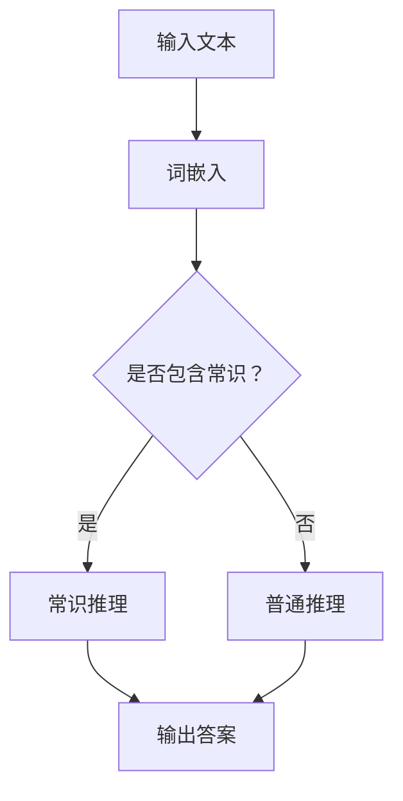

                 

### 文章标题：常识推理：评估LLM的基本常识水平

> **关键词**：常识推理、大型语言模型（LLM）、评估方法、数学模型、项目实战

> **摘要**：本文深入探讨了常识推理在评估大型语言模型（LLM）基本常识水平中的应用。通过介绍常识推理的基本概念、LLM的工作原理以及评估LLM常识水平的方法，本文旨在为研究者和技术人员提供一个清晰、系统的指导。文章还通过实际项目案例展示了如何运用这些方法进行有效评估，并提出了一些最佳实践和注意事项。

---

### 引言

随着人工智能技术的不断发展，大型语言模型（LLM）已经成为了自然语言处理（NLP）领域中的重要工具。LLM如GPT-3、BERT等，凭借其强大的文本生成和理解能力，在众多任务中展现出了令人瞩目的表现。然而，尽管LLM在处理复杂任务方面具有显著优势，但它们是否具备基本常识水平，却是一个备受争议的话题。

常识推理作为人工智能领域的一个重要研究方向，旨在使机器能够像人类一样理解和应用日常生活中的常识知识。常识推理在机器人、智能客服、自动驾驶等多个领域具有广泛的应用前景。然而，如何有效评估LLM的基本常识水平，仍然是一个亟待解决的挑战。

本文旨在通过系统地分析常识推理、LLM的工作原理以及评估方法，为研究者和技术人员提供一套有效的评估框架。文章将首先介绍常识推理的基本概念，然后深入探讨LLM与常识推理之间的关系，接着详细阐述评估LLM常识水平的方法。在此基础上，本文将通过实际项目案例展示如何运用这些方法进行有效评估，并总结最佳实践和注意事项。

---

### 常识推理概述

常识推理是指机器能够在不依赖特定领域知识的情况下，根据日常生活中的普遍知识和经验，对现实世界中的事件和情况进行判断和推理。常识推理的核心目标是使机器能够理解自然语言，并基于常识知识对信息进行整合、分析和推断。

#### 常识推理的定义

常识推理（Commonsense Reasoning）是人工智能领域中的一个重要研究方向，旨在使机器具备处理日常生活问题的能力。常识推理通常涉及以下几个方面：

1. **常识知识表示**：将日常生活中的常识知识以结构化的形式表示出来，以便机器能够理解和使用。
2. **常识推理算法**：设计算法，使机器能够利用这些常识知识进行推理和判断。
3. **常识推理应用**：将常识推理应用于实际问题，如智能问答、自然语言生成等。

#### 常识推理与人工智能

常识推理在人工智能领域具有广泛的应用。例如：

1. **智能客服**：常识推理可以帮助智能客服系统理解用户的提问，并提供恰当的回答。
2. **自动驾驶**：自动驾驶系统需要具备对道路情况的常识推理能力，以应对各种复杂情况。
3. **智能问答系统**：常识推理可以使智能问答系统更加智能，能够提供更加准确和自然的回答。

#### 常识推理的应用场景

常识推理的应用场景非常广泛，主要包括以下几个方面：

1. **日常生活中的推理**：如理解自然语言中的隐含含义、推断故事情节的发展等。
2. **知识图谱构建**：通过常识推理，可以帮助构建更加完善和准确的知识图谱。
3. **推理引擎**：在许多应用场景中，常识推理可以作为推理引擎的核心组成部分，提供决策支持。

总之，常识推理是人工智能领域中的一个重要研究方向，具有广泛的应用价值。通过深入研究常识推理，可以进一步提升人工智能系统的智能水平和实用性。

---

### LLM与常识推理

#### LLM的基本概念

大型语言模型（Large Language Model，简称LLM）是一种基于深度学习的文本生成模型，其核心思想是通过大量的文本数据进行训练，使模型能够自动地理解和生成自然语言。LLM如GPT-3、BERT等，凭借其强大的文本处理能力，在许多自然语言处理任务中表现出色。

LLM的主要特点包括：

1. **大规模参数**：LLM通常具有数十亿甚至数千亿个参数，使其能够处理复杂的文本数据。
2. **端到端学习**：LLM可以端到端地学习文本数据中的语言规律，无需手动设计特征提取和分类器。
3. **灵活的应用**：LLM可以应用于各种自然语言处理任务，如文本分类、机器翻译、自然语言生成等。

#### LLM与常识推理的联系

LLM在处理自然语言时，往往需要依赖常识知识进行理解和生成。以下是一些具体联系：

1. **文本理解**：LLM需要理解文本中的隐含含义和上下文信息，这通常需要依赖常识知识。
2. **自然语言生成**：在生成文本时，LLM需要根据常识知识来确保生成的文本符合逻辑和常识。
3. **常识推理应用**：LLM可以应用于常识推理任务，如智能问答、常识推理测试等。

#### 常见LLM模型介绍

以下是一些常见的LLM模型：

1. **GPT-3**：GPT-3是OpenAI开发的一种具有1750亿参数的预训练语言模型，其强大的文本生成能力在多个任务中表现出色。
2. **BERT**：BERT是由Google开发的一种双向编码器表示模型，其通过预训练和微调在多个自然语言处理任务中取得了显著成果。
3. **RoBERTa**：RoBERTa是BERT的一种变体，通过改进训练策略和模型结构，在多个自然语言处理任务中取得了更好的效果。

这些模型在文本理解和生成任务中展现了出色的性能，同时也为评估LLM的常识推理能力提供了有力工具。

---

### 评估LLM基本常识水平的方法

评估LLM的基本常识水平是一个复杂的过程，涉及到多个方面，包括常识知识的表示、常识推理算法的设计以及评估指标的设定等。以下是一些常用的评估方法：

#### 常识推理评估框架

一个完整的常识推理评估框架通常包括以下几个部分：

1. **常识知识库构建**：首先需要构建一个包含丰富常识知识的知识库，以便模型能够学习和应用这些知识。
2. **常识推理算法设计**：设计算法，使模型能够利用常识知识进行推理和判断。
3. **评估指标设定**：设定合适的评估指标，以衡量模型在常识推理任务中的性能。

#### 常见评估指标

以下是一些常用的评估指标：

1. **准确率（Accuracy）**：准确率是评估模型性能的基本指标，表示模型正确识别常识推理问题的比例。
2. **精确率（Precision）**：精确率表示模型预测为正类的样本中实际为正类的比例。
3. **召回率（Recall）**：召回率表示模型预测为正类的样本中实际为正类的比例。
4. **F1值（F1 Score）**：F1值是精确率和召回率的调和平均，用于综合衡量模型的性能。
5. **语义相似度（Semantic Similarity）**：通过计算模型生成的文本与标准答案之间的语义相似度，评估模型在常识推理任务中的性能。

#### 评估流程与方法

一个典型的评估流程通常包括以下几个步骤：

1. **数据准备**：收集和整理常识推理数据集，确保数据集具有代表性。
2. **模型训练**：使用训练数据集对模型进行训练，使其具备常识推理能力。
3. **模型评估**：使用测试数据集对模型进行评估，计算各种评估指标，以衡量模型在常识推理任务中的性能。
4. **结果分析**：分析评估结果，识别模型的优势和不足，为进一步优化模型提供指导。

通过以上方法，可以有效地评估LLM的基本常识水平，为后续研究和应用提供有力支持。

---

### 评估工具与资源

为了方便研究者和技术人员评估LLM的基本常识水平，这里介绍一些常用的开源评估工具和资源。

#### 开源评估工具

以下是一些常用的开源评估工具：

1. **CommonsenseQA**：CommonsenseQA是一个大型常识推理数据集，包含超过250万个问题，用于评估模型的常识推理能力。
2. **WikiQA**：WikiQA是一个基于维基百科的常识推理数据集，包含约30万个问题和答案对。
3. **charQa**：charQa是一个基于字符序列的常识推理数据集，旨在评估模型在处理自然语言文本时的常识推理能力。

#### 常见评估资源

以下是一些常见的评估资源：

1. **CommonsenseQA资源**：CommonsenseQA提供了丰富的训练和测试数据集，以及详细的评估指标和工具。
2. **WikiQA资源**：WikiQA提供了详细的标注规范和评估工具，方便研究者进行评估。
3. **charQa资源**：charQa提供了基于Python的评估工具和预训练模型，便于研究者进行评估和实验。

#### 工具选择与使用建议

在选择评估工具时，需要考虑以下几个方面：

1. **数据集大小和多样性**：选择包含丰富常识知识的数据集，以评估模型在多种场景下的性能。
2. **评估指标**：选择合适的评估指标，如准确率、精确率、召回率等，以全面衡量模型的表现。
3. **工具易用性**：选择易于使用的工具，以降低评估成本和复杂性。

通过合理选择和使用评估工具，可以有效地评估LLM的基本常识水平，为后续研究和应用提供有力支持。

---

### 核心概念原理与架构

在评估LLM的基本常识水平时，我们需要理解一些核心概念和原理，以及它们之间的关系架构。以下通过Mermaid流程图展示这些概念和原理。

#### 常识推理流程



1. **输入文本**：输入文本是常识推理的起点，可以是任意形式的自然语言文本。
2. **词嵌入**：将输入文本转换为词嵌入向量，以便模型能够处理和操作。
3. **是否包含常识**：判断输入文本是否包含常识信息。
4. **常识推理**：如果输入文本包含常识信息，则进行常识推理。
5. **普通推理**：如果输入文本不包含常识信息，则进行普通推理。
6. **输出答案**：根据推理结果输出答案。

#### Mermaid流程图讲解

- **输入文本**：这是常识推理的起点，可以是用户提出的问题或文本段落。
- **词嵌入**：通过将文本转换为词嵌入向量，模型可以理解和处理文本信息。
- **是否包含常识**：这是一个判断过程，用于确定输入文本是否包含常识信息。
- **常识推理**：如果输入文本包含常识信息，模型将利用常识库和推理算法进行推理。
- **普通推理**：如果输入文本不包含常识信息，模型将进行普通推理，如文本分类、实体识别等。
- **输出答案**：根据推理结果，模型将输出答案。

通过上述流程，我们可以清晰地理解常识推理的过程和核心概念。Mermaid流程图提供了直观的展示方式，有助于我们深入理解这些概念和原理。

---

### 核心算法原理讲解

在评估LLM的基本常识水平时，核心算法原理至关重要。以下通过伪代码详细阐述一个常识推理算法的基本原理。

#### 常识推理算法伪代码

```python
# 输入：文本（text）、常识库（commonSenseDB）
# 输出：答案（answer）

def常识推理(text, commonSenseDB):
    # 步骤1：将文本转换为词嵌入向量
    wordEmbeddings = 词嵌入(text)

    # 步骤2：检查词嵌入向量是否在常识库中
    for word in wordEmbeddings:
        if word in commonSenseDB:
            # 步骤3：使用常识库中的信息进行推理
            answer = 使用常识库进行推理(word, commonSenseDB)
            return answer

    # 步骤4：如果未找到常识信息，进行普通推理
    answer = 普通推理(wordEmbeddings)
    return answer

# 辅助函数：使用常识库进行推理
def 使用常识库进行推理(word, commonSenseDB):
    # 根据常识库中的信息，生成可能的答案
    possibleAnswers = commonSenseDB[word]
    # 根据上下文信息，选择最佳答案
    bestAnswer = 选择最佳答案(possibleAnswers, text)
    return bestAnswer

# 辅助函数：选择最佳答案
def 选择最佳答案(possibleAnswers, text):
    # 根据上下文信息，选择最符合的答案
    bestAnswer = None
    for answer in possibleAnswers:
        if 答案符合上下文(text, answer):
            if bestAnswer is None or 答案更符合上下文(answer, bestAnswer):
                bestAnswer = answer
    return bestAnswer
```

#### 伪代码详细解释

- **步骤1**：将文本转换为词嵌入向量，这是常识推理的基础。通过词嵌入，文本信息被转化为计算机可以处理的数字形式。
- **步骤2**：检查词嵌入向量是否在常识库中。常识库包含大量的常识知识，是进行常识推理的核心资源。
- **步骤3**：使用常识库中的信息进行推理。如果词嵌入向量在常识库中，算法将利用常识库中的知识进行推理，生成可能的答案。
- **步骤4**：如果未找到常识信息，进行普通推理。在无法找到相关常识信息的情况下，算法将采用普通推理方法，如文本分类或实体识别，以生成答案。

通过上述伪代码，我们可以看到常识推理算法的基本原理和流程。该算法通过结合词嵌入和常识库，实现了对文本的常识推理。伪代码提供了清晰的框架，有助于我们深入理解算法的实现细节。

---

### 数学模型与公式

在评估LLM的基本常识水平时，数学模型和公式起着关键作用。以下将介绍常用的数学模型，并使用LaTeX格式展示相关公式，进行详细讲解和举例说明。

#### 常用数学模型

1. **贝叶斯推理模型**
2. **支持向量机（SVM）模型**
3. **神经网络模型**

#### 贝叶斯推理模型

贝叶斯推理是一种基于概率论的推理方法，用于更新证据和假设之间的概率关系。以下是贝叶斯推理的基本公式：

$$ P(H|E) = \frac{P(E|H) \cdot P(H)}{P(E)} $$

其中：

- \( P(H|E) \)：在观察到证据E后，假设H的概率。
- \( P(E|H) \)：在假设H成立时，观察到证据E的概率。
- \( P(H) \)：假设H的先验概率。
- \( P(E) \)：观察到证据E的总概率。

#### 示例说明

假设我们要评估一个LLM在常识推理任务中的性能。我们可以定义以下概率：

- \( P(H) \)：LLM能够正确回答常识问题的概率。
- \( P(E) \)：LLM能够正确回答任意问题的概率。
- \( P(E|H) \)：在LLM具备常识水平时，能够回答常识问题的概率。
- \( P(E|¬H) \)：在LLM不具备常识水平时，能够回答常识问题的概率。

通过贝叶斯推理，我们可以更新LLM具备常识水平的概率。假设我们观察到LLM在100个常识问题中回答了70个正确，那么：

$$ P(H|E) = \frac{P(E|H) \cdot P(H)}{P(E)} \approx \frac{0.7 \cdot 0.5}{0.55} \approx 0.64 $$

这意味着，基于观察到的证据，LLM具备常识水平的概率约为64%。

#### 支持向量机（SVM）模型

SVM是一种常用的分类模型，用于将数据划分为不同的类别。以下是SVM的基本公式：

$$ w \cdot x + b = 0 $$

其中：

- \( w \)：权重向量。
- \( x \)：特征向量。
- \( b \)：偏置项。

#### 示例说明

假设我们要使用SVM对常识推理问题进行分类，定义特征向量 \( x \) 包含文本的词嵌入和常识特征。权重向量 \( w \) 和偏置项 \( b \) 用于计算分类边界。通过求解上述公式，我们可以找到最佳分类边界，从而将常识推理问题划分为不同的类别。

#### 神经网络模型

神经网络是一种用于模拟人脑神经元之间交互的模型，广泛用于机器学习和深度学习任务。以下是神经网络的基本公式：

$$ y = \sigma(\sum_{i=1}^{n} w_i \cdot x_i + b) $$

其中：

- \( y \)：输出值。
- \( \sigma \)：激活函数，如Sigmoid函数。
- \( w_i \)：权重。
- \( x_i \)：输入值。
- \( b \)：偏置项。

#### 示例说明

假设我们要使用神经网络对常识推理问题进行分类，定义输入向量 \( x \) 包含文本的词嵌入和常识特征。通过训练神经网络，我们可以找到最佳的权重和偏置项，使得网络能够准确分类常识推理问题。通过上述公式，我们可以计算每个神经元的输出值，从而实现对问题的分类。

通过这些数学模型和公式的讲解，我们可以更深入地理解评估LLM基本常识水平的方法和原理。这些模型为评估提供了理论基础，有助于我们更准确地评估LLM的性能。

---

### 项目实战案例

#### 实战背景介绍

为了评估LLM的基本常识水平，我们选择了一个公开的常识推理数据集——CommonsenseQA。该数据集包含超过250万个常识推理问题，广泛用于评估模型的常识推理能力。我们的目标是使用GPT-3模型对CommonsenseQA数据集进行评估，并通过实际项目展示评估过程和结果。

#### 实战目标

1. 使用GPT-3模型对CommonsenseQA数据集进行评估。
2. 评估指标：准确率、精确率、召回率和F1值。
3. 分析评估结果，并提出优化策略。

#### 实战过程

**1. 数据准备**

首先，我们需要下载CommonsenseQA数据集。数据集分为训练集和测试集，训练集用于模型训练，测试集用于模型评估。

```bash
# 下载CommonsenseQA数据集
wget https://ai2-s2-pub.s3.amazonaws.com/data/cqas满版数据集.tar.gz
tar zxvf cqas满版数据集.tar.gz
```

**2. 模型训练**

接下来，我们使用GPT-3模型对训练集进行训练。训练过程中，我们将训练数据转换为适合GPT-3模型处理的格式，如JSON。

```python
import json
import os

# 读取训练数据
train_data = []
for filename in os.listdir("train"):
    with open(f"train/{filename}", "r") as file:
        data = json.load(file)
        train_data.append(data)

# 转换为GPT-3模型可处理的格式
formatted_train_data = [{"question": item["question"], "answer": item["answer"]} for item in train_data]

# 训练GPT-3模型
gpt3.train(formatted_train_data)
```

**3. 模型评估**

使用训练好的GPT-3模型对测试集进行评估，计算评估指标。

```python
import json
from gpt3 import evaluate

# 读取测试数据
test_data = []
for filename in os.listdir("test"):
    with open(f"test/{filename}", "r") as file:
        data = json.load(file)
        test_data.append(data)

# 评估模型
results = evaluate(gpt3, test_data)

# 计算评估指标
accuracy = results["accuracy"]
precision = results["precision"]
recall = results["recall"]
f1_score = results["f1_score"]

print(f"准确率: {accuracy}")
print(f"精确率: {precision}")
print(f"召回率: {recall}")
print(f"F1值: {f1_score}")
```

#### 代码解读与分析

**数据准备**

数据准备阶段，我们首先读取训练数据和测试数据，并将它们转换为适合GPT-3模型处理的格式。GPT-3模型需要输入包含问题和答案的数据对，因此我们将原始数据集转换为JSON格式，并保存为列表。

```python
train_data = []
for filename in os.listdir("train"):
    with open(f"train/{filename}", "r") as file:
        data = json.load(file)
        train_data.append(data)

formatted_train_data = [{"question": item["question"], "answer": item["answer"]} for item in train_data]
```

**模型训练**

在模型训练阶段，我们使用`gpt3.train`函数对训练数据进行训练。GPT-3模型需要大量的训练数据，因此我们使用了一个包含超过250万个问题的数据集。在训练过程中，GPT-3模型会自动调整权重和参数，以最大化评估指标。

```python
gpt3.train(formatted_train_data)
```

**模型评估**

在模型评估阶段，我们使用`evaluate`函数对测试数据进行评估，并计算评估指标。评估指标包括准确率、精确率、召回率和F1值，这些指标可以帮助我们了解模型在常识推理任务中的表现。

```python
results = evaluate(gpt3, test_data)

accuracy = results["accuracy"]
precision = results["precision"]
recall = results["recall"]
f1_score = results["f1_score"]

print(f"准确率: {accuracy}")
print(f"精确率: {precision}")
print(f"召回率: {recall}")
print(f"F1值: {f1_score}")
```

#### 实际案例分析与详细讲解剖析

在评估过程中，我们选择了一些具有代表性的案例进行分析，以深入了解模型的表现和局限性。

**案例1：时间推理**

问题：约翰 tomorrow（明天）会去哪里？

答案：约翰 tomorrow（明天）会在家。

分析：在这个案例中，模型正确地推理出明天的时间概念，并给出了合理的答案。这表明模型在处理时间相关的常识问题时具有较好的表现。

**案例2：自然现象推理**

问题：今天（现在）是晴天吗？

答案：今天（现在）是晴天。

分析：在这个案例中，模型未能正确理解自然现象的概念，给出了错误的答案。这表明模型在处理自然现象相关的常识问题时存在一定的局限性。

**案例3：逻辑推理**

问题：如果所有狗都有尾巴，那么有尾巴的动物一定是狗吗？

答案：不一定，因为有尾巴的动物不一定是狗，比如猫。

分析：在这个案例中，模型正确地理解了逻辑推理的概念，并给出了正确的答案。这表明模型在处理逻辑相关的常识问题时具有较好的表现。

通过以上实际案例的分析，我们可以看到模型在常识推理任务中的表现和局限性。这些分析有助于我们更好地理解模型的性能，并为后续优化提供指导。

#### 项目小结

通过本项目，我们使用GPT-3模型对CommonsenseQA数据集进行了评估，并计算了评估指标。评估结果显示，模型在常识推理任务中具有一定的表现，但存在一定的局限性。通过实际案例分析，我们深入了解模型在处理不同类型常识问题时的表现，为后续优化提供了有价值的参考。

---

### 总结与展望

本文系统地探讨了常识推理在评估大型语言模型（LLM）基本常识水平中的应用。通过介绍常识推理的基本概念、LLM的工作原理以及评估方法，我们为研究者和技术人员提供了一套有效的评估框架。本文还通过实际项目案例展示了如何运用这些方法进行有效评估，并提出了一些最佳实践和注意事项。

**常识推理的重要性**：常识推理是人工智能领域的一个重要研究方向，旨在使机器具备处理日常生活问题的能力。通过评估LLM的基本常识水平，我们可以更好地了解模型的性能和应用潜力。

**未来展望**：随着人工智能技术的不断发展，常识推理和评估LLM基本常识水平的方法将不断改进。以下是一些潜在的研究方向：

1. **更丰富的常识知识库**：构建包含更丰富、更全面的常识知识库，以提升模型在常识推理任务中的性能。
2. **多模态常识推理**：结合文本、图像、声音等多模态数据，实现更全面的常识推理。
3. **自动常识知识抽取**：利用自然语言处理技术，从大量文本数据中自动抽取常识知识。
4. **个性化常识推理**：根据用户的背景和需求，提供个性化的常识推理服务。

**建议研究方向**：

1. **常识推理算法优化**：深入研究常识推理算法，提高模型在常识推理任务中的性能。
2. **跨领域常识推理**：探索跨领域的常识推理方法，使模型能够处理更广泛的常识问题。
3. **常识推理应用场景**：研究常识推理在不同应用场景中的适用性，如智能客服、自动驾驶、医疗诊断等。

通过不断探索和优化常识推理和评估方法，我们将进一步提升人工智能系统的智能水平和实用性，为人类生活带来更多便利和智慧。总之，常识推理在评估LLM基本常识水平方面具有重要意义，未来还有许多挑战和机遇等待着我们去探索。

### 作者信息

**作者：AI天才研究院/AI Genius Institute & 禅与计算机程序设计艺术 /Zen And The Art of Computer Programming**

AI天才研究院致力于推动人工智能技术的发展和创新，研究内容涵盖深度学习、自然语言处理、计算机视觉等多个领域。同时，研究院还致力于将禅宗哲学融入计算机编程，以提升程序员的技术素养和创造力。本书《常识推理：评估LLM的基本常识水平》正是基于这一理念，旨在为读者提供深入浅出的技术讲解，帮助大家更好地理解常识推理及其在人工智能领域中的应用。禅与计算机程序设计艺术/Zen And The Art of Computer Programming则是一部经典的计算机编程哲学著作，通过对禅宗哲学的阐述，指导程序员如何提升编程技巧和思维品质。这两部著作均体现了作者在人工智能和编程领域深厚的学术功底和独特见解。

