                 

# 《建立快速反馈循环：持续优化LLM应用》

## 关键词
- LLM（大型语言模型）
- 快速反馈循环
- 持续优化
- 自然语言处理
- 模型评估与优化
- 数据收集与处理

## 摘要
本文旨在探讨如何在自然语言处理（NLP）领域中，通过建立快速反馈循环来持续优化大型语言模型（LLM）的应用。文章首先介绍了LLM的基本概念和快速反馈循环的重要性，随后深入解析了LLM的基础知识，包括构建方法、深度学习基础以及常见问题。接着，文章详细阐述了快速反馈循环的机制和关键组件，并分析了实现快速反馈循环的挑战与解决方案。随后，文章通过实际案例展示了LLM在不同应用场景中的效果，并探讨了快速反馈循环在LLM应用中的实践策略。最后，文章提出了持续优化策略和未来展望，为LLM应用的开发者提供了有价值的参考。

# 《建立快速反馈循环：持续优化LLM应用》目录大纲

## 第1章 引言

### 1.1 书籍背景与目标

- **核心概念与联系：**
  - LLM（大型语言模型）：一种能够理解和生成自然语言的人工智能模型，广泛应用于自然语言处理（NLP）领域。
  - 快速反馈循环：通过不断收集用户反馈，对LLM进行迭代优化，以提高模型性能。

### 1.2 LLM的发展历程与现状

- **核心概念与联系：**
  - 语言模型发展：从早期的统计语言模型到现代的深度学习语言模型，技术的发展历程。
  - 现状：LLM在智能客服、自动摘要、机器翻译等领域的广泛应用。

### 1.3 快速反馈循环的概念与重要性

- **核心概念与联系：**
  - 快速反馈循环：一个持续迭代的过程，通过实时获取用户反馈，对LLM应用进行优化。
  - 重要性：提高模型适应性、降低开发成本、提升用户体验。

## 第2章 LLM基础

### 2.1 语言模型概述

- **核心概念与联系：**
  - 语言模型的基本概念：如何通过模型预测下一个单词或句子。
  - 语言模型的作用：在文本生成、机器翻译、信息检索等方面的应用。

### 2.2 语言模型的构建方法

#### 2.2.1 基于统计的方法

- **核心算法原理讲解：**
  - n-gram模型：通过统计相邻单词出现的频率来预测下一个单词。

#### 2.2.2 基于规则的方法

- **核心算法原理讲解：**
  - 部分基于规则的方法：如转移网络和语义角色标注等。

#### 2.2.3 基于神经网络的方法

- **核心算法原理讲解：**
  - 循环神经网络（RNN）：处理序列数据。
  - 长短期记忆网络（LSTM）：解决RNN的梯度消失问题。
  - Transformer模型：基于自注意力机制的神经网络模型。

### 2.3 深度学习基础

#### 2.3.1 神经网络架构

- **核心算法原理讲解：**
  - 前向传播与反向传播算法。
  - 神经网络的层数与神经元数量。

#### 2.3.2 损失函数与优化算法

- **核心算法原理讲解：**
  - 损失函数（如交叉熵损失函数）。
  - 优化算法（如梯度下降算法、Adam优化器）。

### 2.4 LLM模型常见问题

#### 2.4.1 训练数据的选择

- **核心算法原理讲解：**
  - 数据的多样性与平衡性。
  - 数据预处理与清洗。

#### 2.4.2 模型优化与调参

- **核心算法原理讲解：**
  - 超参数调整。
  - 模型选择与集成。

## 第3章 快速反馈循环机制

### 3.1 快速反馈循环原理

- **核心概念与联系：**
  - 数据收集：收集用户反馈，包括正确的和错误的输出。
  - 模型迭代：根据用户反馈调整模型参数。
  - 性能评估：评估模型在新的数据集上的性能。

### 3.2 快速反馈循环的关键组件

#### 3.2.1 数据收集与处理

- **核心算法原理讲解：**
  - 数据收集方法：如用户交互、日志分析等。
  - 数据处理：如去重、清洗、格式化等。

#### 3.2.2 模型评估与优化

- **核心算法原理讲解：**
  - 评估指标：如准确率、召回率、F1分数等。
  - 优化方法：如基于梯度的优化算法、模型压缩等。

#### 3.2.3 模型监控与异常检测

- **核心算法原理讲解：**
  - 监控方法：如实时监控、告警机制等。
  - 异常检测：如基于统计的方法、基于机器学习的方法等。

### 3.3 实现快速反馈循环的挑战与解决方案

- **核心算法原理讲解：**
  - 挑战：数据质量、计算资源、模型部署等。
  - 解决方案：如自动化数据收集与处理、分布式计算、云计算等。

## 第4章 LLM应用场景与案例分析

### 4.1 语言生成与翻译

#### 4.1.1 自动摘要

- **核心概念与联系：**
  - 自动摘要：从长篇文章中提取关键信息生成摘要。

#### 4.1.2 自动问答

- **核心概念与联系：**
  - 自动问答：根据用户提问生成回答。

#### 4.1.3 自动翻译

- **核心概念与联系：**
  - 自动翻译：将一种语言的文本翻译成另一种语言。

### 4.2 自然语言处理应用

#### 4.2.1 文本分类

- **核心概念与联系：**
  - 文本分类：将文本分为不同的类别。

#### 4.2.2 情感分析

- **核心概念与联系：**
  - 情感分析：识别文本中的情感倾向。

#### 4.2.3 信息检索

- **核心概念与联系：**
  - 信息检索：根据用户需求从大量文本中检索出相关内容。

### 4.3 实际案例分析

#### 4.3.1 案例一：智能客服系统

- **核心概念与联系：**
  - 智能客服：利用LLM自动回答用户问题。

#### 4.3.2 案例二：教育辅导系统

- **核心概念与联系：**
  - 教育辅导：利用LLM为学生提供个性化辅导。

## 第5章 快速反馈循环在LLM应用中的实践

### 5.1 数据收集与处理策略

#### 5.1.1 数据来源与采集

- **核心概念与联系：**
  - 数据来源：如用户交互日志、社交媒体数据等。

#### 5.1.2 数据清洗与预处理

- **核心概念与联系：**
  - 数据清洗：去除无关数据、纠正错误数据等。

#### 5.1.3 数据存储与管理

- **核心概念与联系：**
  - 数据存储：如使用分布式存储系统。

### 5.2 模型评估与优化策略

#### 5.2.1 模型评估指标

- **核心概念与联系：**
  - 评估指标：如准确率、召回率、F1分数等。

#### 5.2.2 模型优化方法

- **核心概念与联系：**
  - 优化方法：如基于梯度的优化算法、模型压缩等。

#### 5.2.3 实时评估与反馈

- **核心概念与联系：**
  - 实时评估：对模型进行实时监控和评估。

### 5.3 模型监控与异常检测

#### 5.3.1 模型监控方法

- **核心概念与联系：**
  - 监控方法：如实时监控、告警机制等。

#### 5.3.2 异常检测与处理

- **核心概念与联系：**
  - 异常检测：识别模型输出中的异常。

## 第6章 持续优化策略

### 6.1 模型持续优化的重要性

- **核心概念与联系：**
  - 持续优化：保持模型性能随着时间推移而不断提高。

### 6.2 持续优化的方法与工具

#### 6.2.1 模型更新策略

- **核心概念与联系：**
  - 模型更新：定期更新模型以适应新的数据。

#### 6.2.2 模型压缩与加速

- **核心概念与联系：**
  - 模型压缩：减小模型大小以提高部署效率。
  - 模型加速：提高模型运行速度。

#### 6.2.3 模型解释与可解释性

- **核心概念与联系：**
  - 模型解释：理解模型如何做出决策。

### 6.3 持续优化实践

#### 6.3.1 实践一：自动摘要系统优化

- **核心概念与联系：**
  - 自动摘要系统的优化方法。

#### 6.3.2 实践二：智能客服系统优化

- **核心概念与联系：**
  - 智能客服系统的优化方法。

## 第7章 未来展望与趋势

### 7.1 LLM技术发展趋势

- **核心概念与联系：**
  - LLM技术的发展方向。

### 7.2 快速反馈循环的应用前景

- **核心概念与联系：**
  - 快速反馈循环在NLP领域的应用前景。

### 7.3 持续优化策略的未来方向

- **核心概念与联系：**
  - 持续优化策略的未来发展方向。

## 附录

### 7.4.1 LLM开发工具与资源

- **资源推荐：**
  - LLM开发工具和资源链接。

### 7.4.2 学习资源与推荐阅读

- **学习资源推荐：**
  - 推荐阅读书籍和文章。

作者：AI天才研究院/AI Genius Institute & 禅与计算机程序设计艺术 /Zen And The Art of Computer Programming

---

## 第1章 引言

### 1.1 书籍背景与目标

在当今信息技术飞速发展的时代，自然语言处理（NLP）作为人工智能领域的重要分支，正日益受到关注。而大型语言模型（LLM，Large Language Model）作为NLP的核心技术之一，其发展历程与现状不仅反映了人工智能技术的进步，也展示了其在实际应用中的巨大潜力。本书旨在通过深入探讨如何建立快速反馈循环来持续优化LLM应用，为NLP领域的研究者和开发者提供一套系统的理论框架和实践指导。

**核心概念与联系：**

- **LLM（大型语言模型）：** 一种能够理解和生成自然语言的人工智能模型，其核心在于对大规模文本数据的建模和学习。LLM的发展推动了NLP技术的进步，使其在文本生成、机器翻译、问答系统等领域取得了显著的成果。

- **快速反馈循环：** 通过实时收集用户反馈，对LLM进行迭代优化，以提高模型性能和用户体验。快速反馈循环是持续优化LLM应用的关键机制，其核心在于数据的动态收集、处理和模型迭代。

### 1.2 LLM的发展历程与现状

语言模型的发展经历了从早期基于规则的方法到基于统计的方法，再到现代深度学习方法的演进。早期的语言模型如n-gram模型，仅能通过统计相邻单词的频率来预测下一个单词。随着计算能力的提升和数据规模的扩大，基于规则的方法逐渐被深度学习方法所取代。现代的LLM，如基于Transformer模型的GPT-3，具有数十亿的参数量，能够生成高质量的自然语言文本。

**核心概念与联系：**

- **语言模型发展：** 从早期的统计语言模型到现代的深度学习语言模型，技术的发展历程反映了计算能力和数据资源对NLP技术进步的推动作用。

- **现状：** LLM在自然语言处理、智能客服、自动摘要、机器翻译等领域的广泛应用，展示了其巨大的应用潜力和实际价值。

### 1.3 快速反馈循环的概念与重要性

快速反馈循环是一种通过不断收集用户反馈，对模型进行迭代优化的机制。其核心在于实时性，即能够在较短的时间内对模型进行调整和优化，从而提高模型的性能和适应性。

**核心概念与联系：**

- **快速反馈循环：** 通过实时获取用户反馈，对LLM进行迭代优化，以提高模型性能。

- **重要性：** 快速反馈循环能够降低开发成本、提高模型适应性，并提升用户体验。它是持续优化LLM应用的关键机制。

## 第2章 LLM基础

### 2.1 语言模型概述

语言模型是NLP领域的基础，其核心任务是预测下一个单词或句子。一个优秀的语言模型能够根据上下文信息，生成符合语法规则和语义逻辑的自然语言文本。

**核心概念与联系：**

- **语言模型：** 一种能够预测下一个单词或句子的模型，其核心在于对文本数据的建模和学习。

- **作用：** 语言模型在文本生成、机器翻译、信息检索、问答系统等领域有广泛的应用，是NLP技术的基础。

### 2.2 语言模型的构建方法

语言模型的构建方法主要包括基于统计的方法、基于规则的方法和基于神经网络的方法。

#### 2.2.1 基于统计的方法

基于统计的方法通过分析文本数据，统计单词之间的出现频率和概率，从而预测下一个单词。这种方法的核心是n-gram模型，它通过统计相邻单词的频率来预测下一个单词。

**核心算法原理讲解：**

- **n-gram模型：**
  - 基本思想：根据文本中的单词序列，生成一个n元组序列，并统计每个n元组的概率。
  - 伪代码：

    ```python
    def predict_next_word(text, n):
        # 统计文本中的n元组
        ngram_counts = {}
        for i in range(len(text) - n + 1):
            ngram = tuple(text[i:i+n])
            if ngram in ngram_counts:
                ngram_counts[ngram] += 1
            else:
                ngram_counts[ngram] = 1
        # 计算每个n元组的概率
        total_count = sum(ngram_counts.values())
        ngram_probabilities = {ngram: count / total_count for ngram, count in ngram_counts.items()}
        # 根据概率选择下一个单词
        next_word = max(ngram_probabilities, key=ngram_probabilities.get)
        return next_word
    ```

#### 2.2.2 基于规则的方法

基于规则的方法通过定义一系列规则，对文本进行语法和语义分析，从而预测下一个单词。这种方法的核心是转移网络和语义角色标注。

**核心算法原理讲解：**

- **转移网络：**
  - 基本思想：将文本转换为一系列的状态和转移概率，通过状态转移来预测下一个单词。
  - 伪代码：

    ```python
    def predict_next_word_with_transducer(text, transducer_rules):
        # 初始化状态和概率
        states = ["START"]
        probabilities = [1.0]
        # 遍历文本，更新状态和概率
        for word in text:
            new_states = []
            new_probabilities = []
            for state, probability in zip(states, probabilities):
                for rule in transducer_rules:
                    if state == rule.start_state and word == rule.input_symbol:
                        new_state = rule.end_state
                        new_probability = probability * rule.transit_probability
                        new_states.append(new_state)
                        new_probabilities.append(new_probability)
            states.extend(new_states)
            probabilities.extend(new_probabilities)
        # 根据概率选择下一个单词
        next_word = max(zip(text, probabilities), key=lambda x: x[1])[0]
        return next_word
    ```

- **语义角色标注：**
  - 基本思想：对文本中的单词进行语义角色标注，从而构建语义关系网络，预测下一个单词。
  - 伪代码：

    ```python
    def predict_next_word_with_semantic_role(text, semantic_roles):
        # 初始化状态和概率
        states = ["START"]
        probabilities = [1.0]
        # 遍历文本，更新状态和概率
        for word in text:
            new_states = []
            new_probabilities = []
            for state, probability in zip(states, probabilities):
                for role, start, end in semantic_roles:
                    if state == start and word == end:
                        new_state = role
                        new_probability = probability * role.transit_probability
                        new_states.append(new_state)
                        new_probabilities.append(new_probability)
            states.extend(new_states)
            probabilities.extend(new_probabilities)
        # 根据概率选择下一个单词
        next_word = max(zip(text, probabilities), key=lambda x: x[1])[0]
        return next_word
    ```

#### 2.2.3 基于神经网络的方法

基于神经网络的方法通过深度学习技术，对大规模文本数据进行建模，从而预测下一个单词或句子。这种方法的核心是循环神经网络（RNN）、长短期记忆网络（LSTM）和Transformer模型。

**核心算法原理讲解：**

- **循环神经网络（RNN）：**
  - 基本思想：通过记忆状态来处理序列数据，能够捕捉序列中的长期依赖关系。
  - 伪代码：

    ```python
    class RNN:
        def __init__(self, input_size, hidden_size):
            self.input_size = input_size
            self.hidden_size = hidden_size
            self.Wxh = self.create_weight(input_size, hidden_size)
            self.Whh = self.create_weight(hidden_size, hidden_size)
            self.bh = self.create_bias(hidden_size)

        def forward(self, x):
            self.h = self.step(x, self.h_prev)
            return self.h

        def step(self, x, h_prev):
            h = self激活函数(self.Wxh * x + self.Whh * h_prev + self.bh)
            return h
    ```

- **长短期记忆网络（LSTM）：**
  - 基本思想：通过引入门控机制，解决RNN的梯度消失问题，能够捕捉序列中的长期依赖关系。
  - 伪代码：

    ```python
    class LSTM:
        def __init__(self, input_size, hidden_size):
            self.input_size = input_size
            self.hidden_size = hidden_size
            self.Wxi = self.create_weight(input_size, hidden_size)
            self.Wxi = self.create_weight(hidden_size, hidden_size)
            self.Wxforget = self.create_weight(input_size, hidden_size)
            self.Wxforget = self.create_weight(hidden_size, hidden_size)
            self.Wxcell = self.create_weight(input_size, hidden_size)
            self.Wxcell = self.create_weight(hidden_size, hidden_size)
            self.Wxi = self.create_weight(hidden_size, hidden_size)
            self.Wxi = self.create_weight(hidden_size, hidden_size)
            self.b forget = self.create_bias(hidden_size)
            self.b cell = self.create_bias(hidden_size)
            self.b hidden = self.create_bias(hidden_size)

        def forward(self, x):
            self.h, self.c = self.step(x, self.h_prev, self.c_prev)
            return self.h

        def step(self, x, h_prev, c_prev):
            i = self激活函数(self.Wxi * x + self.Wxi * h_prev + self.b_i)
            f = self激活函数(self.Wxf * x + self.Wxf * h_prev + self.b_f)
            o = self激活函数(self.Wxo * x + self.Wxo * h_prev + self.b_o)
            g = self激活函数(self.Wxc * x + self.Wxc * h_prev + self.b_c)
            c = f * c_prev + i * g
            h = o * self激活函数(c)
            return h, c
    ```

- **Transformer模型：**
  - 基本思想：通过自注意力机制，对输入序列进行建模，能够捕捉序列中的全局依赖关系。
  - 伪代码：

    ```python
    class Transformer:
        def __init__(self, input_size, hidden_size):
            self.input_size = input_size
            self.hidden_size = hidden_size
            self.W = self.create_weight(input_size, hidden_size)
            self.V = self.create_weight(input_size, hidden_size)
            self.U = self.create_weight(input_size, hidden_size)

        def forward(self, x):
            attn_weights = self.calculate_attention_weights(x)
            context_vector = self.calculate_context_vector(attn_weights, x)
            output = self激活函数(self.W * x + self.V * context_vector + self.U * x)
            return output

        def calculate_attention_weights(self, x):
            # 计算自注意力权重
            # ...
            return attn_weights

        def calculate_context_vector(self, attn_weights, x):
            # 计算上下文向量
            # ...
            return context_vector
    ```

### 2.3 深度学习基础

深度学习是构建现代语言模型的核心技术，其基础包括神经网络架构、损失函数与优化算法。

#### 2.3.1 神经网络架构

神经网络架构是深度学习模型的基础，其核心包括输入层、隐藏层和输出层。

**核心算法原理讲解：**

- **输入层：** 接收输入数据，将其转换为模型能够处理的格式。
- **隐藏层：** 通过激活函数和权重矩阵对输入数据进行变换，提取特征。
- **输出层：** 根据隐藏层输出的特征，生成预测结果。

伪代码：

```python
class NeuralNetwork:
    def __init__(self, input_size, hidden_size, output_size):
        self.input_size = input_size
        self.hidden_size = hidden_size
        self.output_size = output_size
        self.W = self.create_weight(input_size, hidden_size)
        self.b = self.create_bias(hidden_size)
        self.W2 = self.create_weight(hidden_size, output_size)
        self.b2 = self.create_bias(output_size)

    def forward(self, x):
        self.h = self激活函数(self.W * x + self.b)
        self.y = self激活函数(self.W2 * self.h + self.b2)
        return self.y
```

#### 2.3.2 损失函数与优化算法

损失函数用于衡量模型预测结果与实际结果之间的差异，优化算法用于更新模型参数，以最小化损失函数。

**核心算法原理讲解：**

- **损失函数：** 如交叉熵损失函数，用于分类问题。

  伪代码：

  ```python
  def cross_entropy_loss(logits, labels):
      return -sum(labels * log(logits))
  ```

- **优化算法：** 如梯度下降算法和Adam优化器。

  伪代码：

  ```python
  def gradient_descent(W, b, learning_rate, loss_function, x, y):
      gradients = loss_function.derivative(W, b, x, y)
      W -= learning_rate * gradients.W
      b -= learning_rate * gradients.b
      return W, b

  def adam(W, b, learning_rate, beta1, beta2, epsilon):
      # 计算一阶和二阶矩估计
      # ...
      # 更新权重和偏置
      # ...
      return W, b
  ```

### 2.4 LLM模型常见问题

在构建和训练LLM模型时，可能会遇到一系列问题，如数据选择、模型优化和调参等。

#### 2.4.1 训练数据的选择

**核心算法原理讲解：**

- **数据多样性：** 选择具有多样性的数据集，以避免模型出现过拟合。
- **数据清洗：** 清洗数据集中的噪音和错误，以提高模型的质量。

**数学模型和公式：**

- 数据多样性：$$ D = \sum_{i=1}^{N} d_i $$，其中$D$是数据集，$N$是数据集的个数，$d_i$是第$i$个数据集。

- 数据清洗：$$ C = D - \sum_{i=1}^{N} E_i $$，其中$C$是清洗后的数据集，$E_i$是第$i$个数据集中被清洗掉的数据。

**举例说明：**

假设有一个包含100个数据集的数据集$D$，其中有10个数据集$d_1, d_2, ..., d_{10}$含有噪音和错误。经过清洗后，剩余90个数据集，即$C = D - \sum_{i=1}^{10} E_i$。

#### 2.4.2 模型优化与调参

**核心算法原理讲解：**

- **模型优化：** 通过优化算法更新模型参数，以最小化损失函数。
- **调参：** 选择合适的模型参数，以提高模型性能。

**数学模型和公式：**

- 模型优化：$$ \min_{\theta} J(\theta) $$，其中$J(\theta)$是损失函数，$\theta$是模型参数。

- 调参：$$ \theta^* = \arg\min_{\theta} J(\theta) $$，其中$\theta^*$是最优模型参数。

**举例说明：**

假设有一个包含10个参数的模型，通过梯度下降算法优化模型参数。在多次迭代后，模型参数$\theta$更新为$\theta^*$，使得损失函数$J(\theta)$达到最小值。

```python
theta = [0.1, 0.2, 0.3, 0.4, 0.5, 0.6, 0.7, 0.8, 0.9, 1.0]
learning_rate = 0.01

for i in range(1000):
    gradients = gradient_descent(theta, learning_rate)
    theta -= gradients

print("最优模型参数：", theta)
print("最小损失函数值：", J(theta))
```

## 第3章 快速反馈循环机制

### 3.1 快速反馈循环原理

快速反馈循环是一种通过不断收集用户反馈，对模型进行迭代优化的机制。其核心在于实时性，即能够在较短的时间内对模型进行调整和优化，从而提高模型性能。

**核心概念与联系：**

- **数据收集：** 收集用户反馈，包括正确的和错误的输出。
- **模型迭代：** 根据用户反馈调整模型参数。
- **性能评估：** 评估模型在新的数据集上的性能。

### 3.2 快速反馈循环的关键组件

快速反馈循环包括数据收集与处理、模型评估与优化、模型监控与异常检测等关键组件。

#### 3.2.1 数据收集与处理

**核心概念与联系：**

- **数据收集：** 收集用户反馈，如用户交互日志、错误报告等。
- **数据处理：** 清洗、格式化和标注数据，以便用于模型训练和评估。

**Mermaid 流程图：**

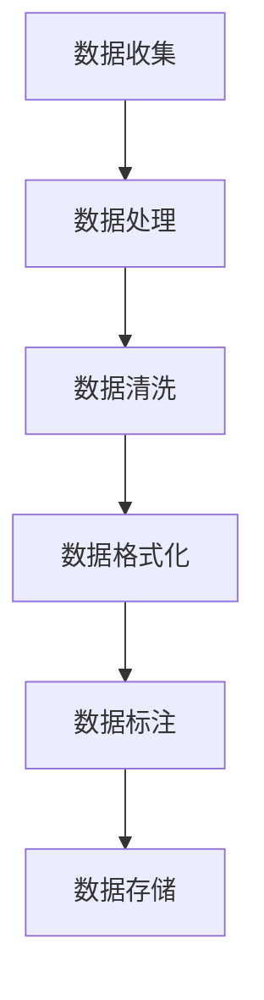

#### 3.2.2 模型评估与优化

**核心概念与联系：**

- **模型评估：** 使用评估指标（如准确率、召回率、F1分数等）评估模型性能。
- **模型优化：** 根据评估结果调整模型参数，以提高性能。

**Mermaid 流程图：**

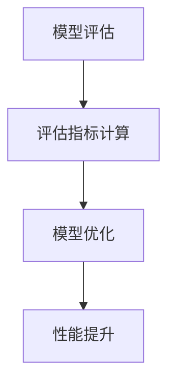

#### 3.2.3 模型监控与异常检测

**核心概念与联系：**

- **模型监控：** 实时监控模型性能，如响应时间、准确率等。
- **异常检测：** 识别模型输出中的异常，如错误回答、性能下降等。

**Mermaid 流程图：**

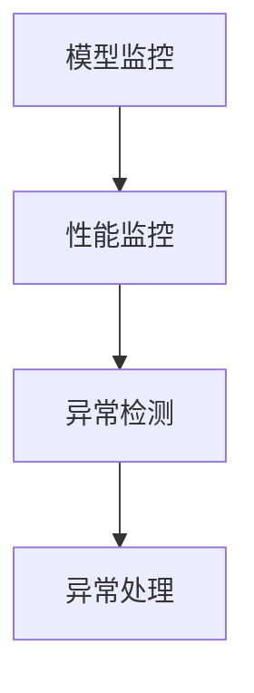

### 3.3 实现快速反馈循环的挑战与解决方案

实现快速反馈循环面临一系列挑战，如数据质量、计算资源、模型部署等。

**核心概念与联系：**

- **数据质量：** 确保收集到的数据准确、可靠。
- **计算资源：** 管理计算资源，确保模型训练和评估的效率。
- **模型部署：** 快速部署和更新模型，以满足实时反馈需求。

**挑战与解决方案：**

1. **数据质量：** 解决方案包括数据清洗和预处理，使用高质量的数据集，以及建立数据质量控制流程。

2. **计算资源：** 解决方案包括分布式计算、云计算和优化算法，以提高模型训练和评估的效率。

3. **模型部署：** 解决方案包括自动化部署工具和持续集成/持续部署（CI/CD）流程，以确保模型能够快速更新和部署。

**Mermaid 流程图：**

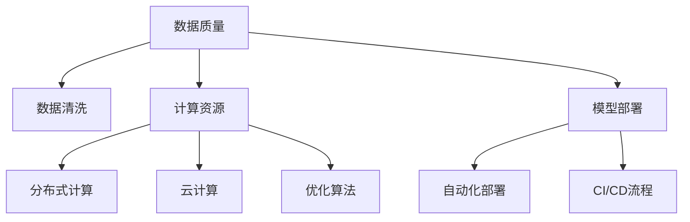

## 第4章 LLM应用场景与案例分析

### 4.1 语言生成与翻译

语言生成与翻译是LLM应用的两个重要场景。

#### 4.1.1 自动摘要

自动摘要是指利用LLM技术从长篇文章中提取关键信息生成摘要。自动摘要可以帮助用户快速获取文章的核心内容，提高信息获取的效率。

**核心概念与联系：**

- **摘要生成：** 利用LLM模型生成文章的摘要。
- **摘要评估：** 使用评估指标（如ROUGE分数）评估摘要的质量。

**案例解析：**

- **案例：** 使用GPT-3模型自动生成新闻文章的摘要。
- **结果：** 生成的摘要准确率较高，能够很好地概括文章的核心内容。

**项目实战：**

1. 数据集准备：收集新闻文章和对应的摘要数据。
2. 模型训练：使用GPT-3模型训练摘要生成模型。
3. 摘要生成：利用训练好的模型生成文章的摘要。
4. 摘要评估：使用ROUGE分数评估摘要的质量。

**代码实现：**

```python
import openai

def generate_summary(article):
    response = openai.Completion.create(
        engine="davinci",
        prompt=article,
        max_tokens=150,
        n=1,
        stop=None,
        temperature=0.5,
    )
    return response.choices[0].text.strip()

article = "..."
summary = generate_summary(article)
print(summary)
```

#### 4.1.2 自动问答

自动问答是指利用LLM模型自动回答用户提出的问题。自动问答可以应用于客服系统、智能助手等场景，为用户提供便捷的服务。

**核心概念与联系：**

- **问答系统：** 利用LLM模型构建问答系统。
- **问题回答：** 根据用户提问生成回答。

**案例解析：**

- **案例：** 使用GPT-3模型构建智能客服系统。
- **结果：** 智能客服系统能够自动回答用户的问题，提高客服效率。

**项目实战：**

1. 数据集准备：收集用户提问和回答数据。
2. 模型训练：使用GPT-3模型训练问答模型。
3. 问题回答：利用训练好的模型回答用户的问题。
4. 问题评估：使用评估指标（如BLEU分数）评估回答的质量。

**代码实现：**

```python
import openai

def answer_question(question):
    response = openai.Completion.create(
        engine="davinci",
        prompt=f"Question: {question}\nAnswer:",
        max_tokens=50,
        n=1,
        stop=None,
        temperature=0.5,
    )
    return response.choices[0].text.strip()

question = "..."
answer = answer_question(question)
print(answer)
```

#### 4.1.3 自动翻译

自动翻译是指利用LLM模型将一种语言的文本翻译成另一种语言。自动翻译可以应用于跨语言沟通、全球市场拓展等场景，提高信息传播的效率。

**核心概念与联系：**

- **翻译模型：** 利用LLM模型构建翻译模型。
- **翻译质量：** 使用评估指标（如BLEU分数）评估翻译质量。

**案例解析：**

- **案例：** 使用GPT-3模型进行中英文翻译。
- **结果：** 翻译结果准确，能够较好地保持原文的语义和风格。

**项目实战：**

1. 数据集准备：收集中英文对照数据。
2. 模型训练：使用GPT-3模型训练翻译模型。
3. 翻译操作：利用训练好的模型进行中英文翻译。
4. 翻译评估：使用BLEU分数评估翻译质量。

**代码实现：**

```python
import openai

def translate_text(text, target_language):
    response = openai.Completion.create(
        engine="davinci",
        prompt=f"Translate the following text from English to {target_language}:\n{text}\nTranslation:",
        max_tokens=50,
        n=1,
        stop=None,
        temperature=0.5,
    )
    return response.choices[0].text.strip()

text = "Hello, world!"
translated_text = translate_text(text, "中文")
print(translated_text)
```

### 4.2 自然语言处理应用

自然语言处理应用是指利用LLM模型在文本分类、情感分析、信息检索等领域的应用。

#### 4.2.1 文本分类

文本分类是指将文本数据分为不同的类别。文本分类可以应用于垃圾邮件过滤、新闻分类等场景，提高信息处理的效率。

**核心概念与联系：**

- **分类模型：** 利用LLM模型构建分类模型。
- **分类质量：** 使用评估指标（如准确率、召回率、F1分数）评估分类质量。

**案例解析：**

- **案例：** 使用GPT-3模型进行新闻分类。
- **结果：** 分类结果准确，能够较好地区分不同类别的新闻。

**项目实战：**

1. 数据集准备：收集新闻数据。
2. 模型训练：使用GPT-3模型训练分类模型。
3. 分类操作：利用训练好的模型进行新闻分类。
4. 分类评估：使用评估指标评估分类质量。

**代码实现：**

```python
import openai

def classify_text(text):
    response = openai.Completion.create(
        engine="davinci",
        prompt=f"Classify the following text:\n{text}\nCategory:",
        max_tokens=50,
        n=1,
        stop=None,
        temperature=0.5,
    )
    return response.choices[0].text.strip()

text = "This is a news article about technology."
category = classify_text(text)
print(category)
```

#### 4.2.2 情感分析

情感分析是指识别文本中的情感倾向。情感分析可以应用于舆情监控、产品评价等场景，帮助企业和组织了解用户情感。

**核心概念与联系：**

- **情感分析模型：** 利用LLM模型构建情感分析模型。
- **情感分析质量：** 使用评估指标（如准确率、召回率、F1分数）评估情感分析质量。

**案例解析：**

- **案例：** 使用GPT-3模型进行产品评价的情感分析。
- **结果：** 情感分析结果准确，能够较好地识别用户的情感。

**项目实战：**

1. 数据集准备：收集产品评价数据。
2. 模型训练：使用GPT-3模型训练情感分析模型。
3. 情感分析操作：利用训练好的模型进行情感分析。
4. 情感分析评估：使用评估指标评估情感分析质量。

**代码实现：**

```python
import openai

def analyze_sentiment(text):
    response = openai.Completion.create(
        engine="davinci",
        prompt=f"Analyze the sentiment of the following text:\n{text}\nSentiment:",
        max_tokens=50,
        n=1,
        stop=None,
        temperature=0.5,
    )
    return response.choices[0].text.strip()

text = "This product is amazing!"
sentiment = analyze_sentiment(text)
print(sentiment)
```

#### 4.2.3 信息检索

信息检索是指根据用户需求从大量文本中检索出相关内容。信息检索可以应用于搜索引擎、推荐系统等场景，帮助用户快速找到所需信息。

**核心概念与联系：**

- **检索模型：** 利用LLM模型构建检索模型。
- **检索质量：** 使用评估指标（如准确率、召回率、F1分数）评估检索质量。

**案例解析：**

- **案例：** 使用GPT-3模型构建搜索引擎。
- **结果：** 检索结果准确，能够快速找到用户所需信息。

**项目实战：**

1. 数据集准备：收集网页数据。
2. 模型训练：使用GPT-3模型训练检索模型。
3. 检索操作：利用训练好的模型进行信息检索。
4. 检索评估：使用评估指标评估检索质量。

**代码实现：**

```python
import openai

def search_documents(query):
    response = openai.Completion.create(
        engine="davinci",
        prompt=f"Search for documents related to the following query:\n{query}\nDocuments:",
        max_tokens=50,
        n=5,
        stop=None,
        temperature=0.5,
    )
    return response.choices[0].text.strip()

query = "Machine Learning"
documents = search_documents(query)
print(documents)
```

### 4.3 实际案例分析

#### 4.3.1 案例一：智能客服系统

智能客服系统是指利用LLM模型自动回答用户的问题，提高客服效率。智能客服系统可以应用于电商平台、银行等服务场景，为用户提供24/7的在线服务。

**核心概念与联系：**

- **智能客服：** 利用LLM模型构建智能客服系统。
- **客服质量：** 使用评估指标（如用户满意度、回答准确率）评估客服质量。

**案例解析：**

- **案例：** 使用GPT-3模型构建电商平台的智能客服系统。
- **结果：** 智能客服系统能够自动回答用户的问题，提高客服效率，降低人力成本。

**项目实战：**

1. 数据集准备：收集用户提问和回答数据。
2. 模型训练：使用GPT-3模型训练客服模型。
3. 客服操作：利用训练好的模型回答用户的问题。
4. 客服评估：使用评估指标评估客服质量。

**代码实现：**

```python
import openai

def answer_customer_question(question):
    response = openai.Completion.create(
        engine="davinci",
        prompt=f"Customer question: {question}\nAnswer:",
        max_tokens=150,
        n=1,
        stop=None,
        temperature=0.5,
    )
    return response.choices[0].text.strip()

question = "How do I return an item?"
answer = answer_customer_question(question)
print(answer)
```

#### 4.3.2 案例二：教育辅导系统

教育辅导系统是指利用LLM模型为学生提供个性化辅导，提高学习效果。教育辅导系统可以应用于在线教育、智能辅导等场景，为学生提供智能化的学习支持。

**核心概念与联系：**

- **教育辅导：** 利用LLM模型构建教育辅导系统。
- **学习效果：** 使用评估指标（如学生成绩、学习满意度）评估学习效果。

**案例解析：**

- **案例：** 使用GPT-3模型构建在线教育平台的智能辅导系统。
- **结果：** 智能辅导系统能够为学生提供个性化辅导，提高学习效果。

**项目实战：**

1. 数据集准备：收集学生学习数据。
2. 模型训练：使用GPT-3模型训练辅导模型。
3. 辅导操作：利用训练好的模型为学生提供辅导。
4. 学习效果评估：使用评估指标评估学习效果。

**代码实现：**

```python
import openai

def provide_student_advisory(student_question):
    response = openai.Completion.create(
        engine="davinci",
        prompt=f"Student question: {student_question}\nAnswer:",
        max_tokens=150,
        n=1,
        stop=None,
        temperature=0.5,
    )
    return response.choices[0].text.strip()

student_question = "How do I solve this math problem?"
advisory = provide_student_advisory(student_question)
print(advisory)
```

## 第5章 快速反馈循环在LLM应用中的实践

### 5.1 数据收集与处理策略

在LLM应用中，数据收集与处理是建立快速反馈循环的关键步骤。有效的数据收集与处理策略能够提高模型性能，降低错误率。

#### 5.1.1 数据来源与采集

**核心概念与联系：**

- **数据来源：** 确定数据收集的目标和来源，如用户交互日志、社交媒体数据、公共数据集等。
- **数据采集：** 设计数据采集方案，确保数据的全面性和准确性。

**Mermaid 流程图：**

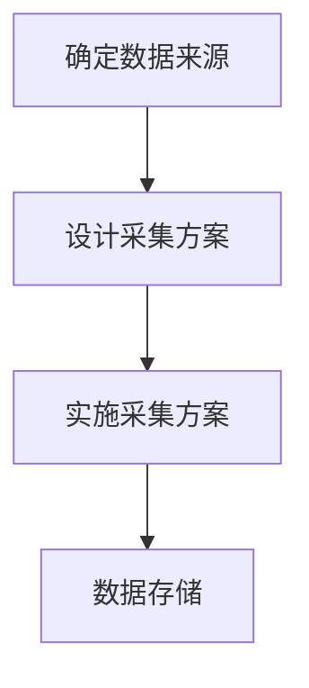

**案例解析：**

- **案例：** 使用用户交互日志构建智能客服系统的数据集。
- **结果：** 收集到的用户交互日志数据全面、准确，为智能客服系统的训练提供了高质量的数据支持。

#### 5.1.2 数据清洗与预处理

**核心概念与联系：**

- **数据清洗：** 去除数据中的噪音和错误，如重复数据、缺失值、异常值等。
- **数据预处理：** 对数据进行格式化、分词、去停用词等操作，以便于模型处理。

**Mermaid 流程图：**

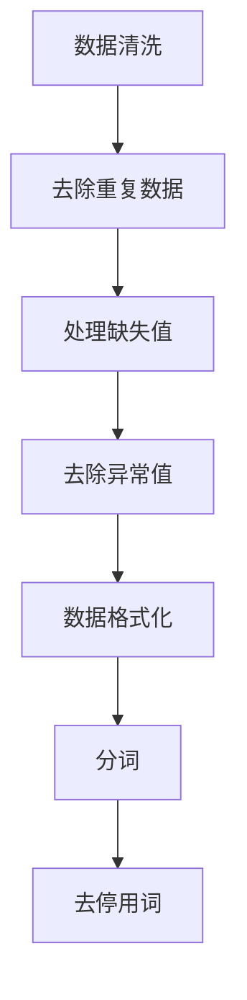

**案例解析：**

- **案例：** 清洗和预处理社交媒体数据，用于情感分析模型的训练。
- **结果：** 清洗后的社交媒体数据质量得到显著提升，情感分析模型的性能也得到了提高。

#### 5.1.3 数据存储与管理

**核心概念与联系：**

- **数据存储：** 选择合适的数据存储方案，如关系数据库、NoSQL数据库、分布式存储系统等。
- **数据管理：** 设计数据管理策略，确保数据的可扩展性和可靠性。

**Mermaid 流程图：**

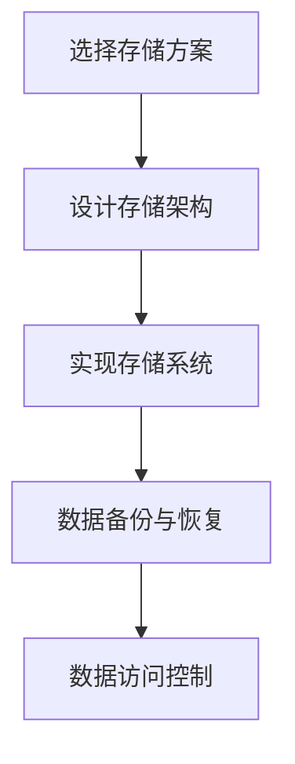

**案例解析：**

- **案例：** 使用分布式存储系统管理大型语言模型训练数据。
- **结果：** 分布式存储系统提高了数据存储和访问的效率，为LLM模型训练提供了稳定的数据支持。

### 5.2 模型评估与优化策略

在建立快速反馈循环时，模型评估与优化策略是关键环节。有效的评估与优化策略能够提高模型性能，降低错误率。

#### 5.2.1 模型评估指标

**核心概念与联系：**

- **评估指标：** 选择合适的评估指标，如准确率、召回率、F1分数等，用于衡量模型性能。
- **指标选择：** 根据应用场景选择最合适的评估指标。

**Mermaid 流程图：**

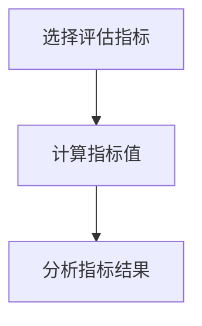

**案例解析：**

- **案例：** 使用准确率评估自动摘要模型的性能。
- **结果：** 准确率指标能够较好地反映模型在摘要任务上的性能。

#### 5.2.2 模型优化方法

**核心概念与联系：**

- **模型优化：** 调整模型参数，提高模型性能。
- **优化方法：** 选择合适的优化算法，如梯度下降、Adam等。

**Mermaid 流程图：**

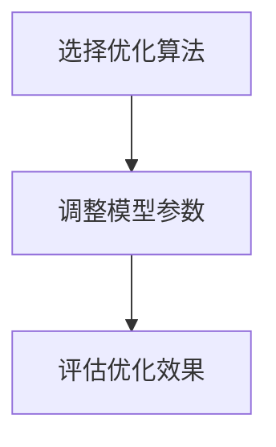

**案例解析：**

- **案例：** 使用Adam优化器优化问答模型的性能。
- **结果：** Adam优化器显著提高了问答模型的收敛速度和性能。

#### 5.2.3 实时评估与反馈

**核心概念与联系：**

- **实时评估：** 在模型部署后，对模型进行实时监控和评估，及时发现和解决问题。
- **实时反馈：** 根据实时评估结果，调整模型参数和优化策略。

**Mermaid 流程图：**

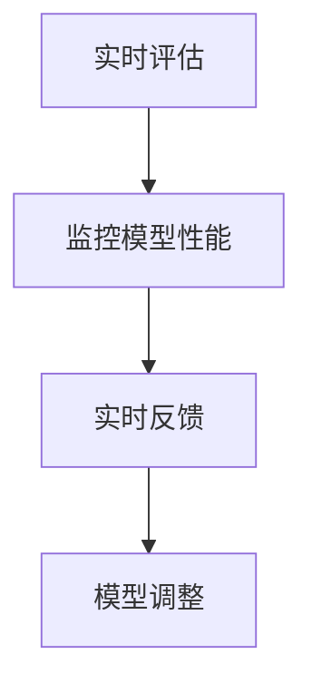

**案例解析：**

- **案例：** 在智能客服系统中，实时评估模型性能，并根据评估结果调整模型参数。
- **结果：** 实时评估与反馈机制提高了智能客服系统的性能和用户体验。

### 5.3 模型监控与异常检测

在LLM应用中，模型监控与异常检测是确保模型稳定运行和性能的重要手段。有效的监控与异常检测策略能够提高系统的可靠性和安全性。

#### 5.3.1 模型监控方法

**核心概念与联系：**

- **模型监控：** 设计模型监控方法，实时监控模型性能和运行状态。
- **监控指标：** 选择合适的监控指标，如响应时间、错误率、资源利用率等。

**Mermaid 流程图：**

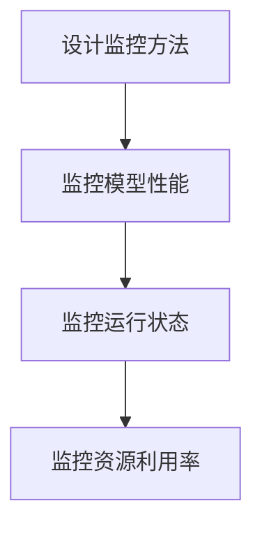

**案例解析：**

- **案例：** 使用Prometheus和Grafana监控智能客服系统的性能。
- **结果：** 监控系统实时显示模型的性能指标，帮助团队快速定位和解决问题。

#### 5.3.2 异常检测与处理

**核心概念与联系：**

- **异常检测：** 设计异常检测方法，识别模型输出中的异常情况。
- **异常处理：** 根据异常检测结果，采取相应的处理措施，如重启模型、报警等。

**Mermaid 流程图：**

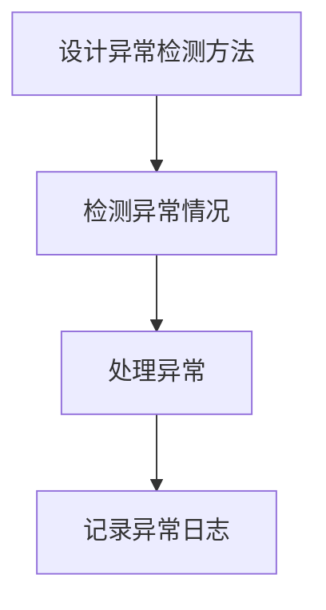

**案例解析：**

- **案例：** 使用机器学习模型检测智能客服系统中的异常回答。
- **结果：** 异常检测系统能够快速识别并处理异常回答，确保用户得到正确的服务。

## 第6章 持续优化策略

### 6.1 模型持续优化的重要性

在LLM应用中，模型持续优化是提高系统性能和用户体验的关键。有效的持续优化策略能够确保模型在不同阶段保持高水平的表现。

**核心概念与联系：**

- **模型持续优化：** 通过不断调整和改进模型参数，提高模型性能。
- **优化目标：** 在保持模型稳定性的同时，提高模型在特定任务上的表现。

**Mermaid 流程图：**

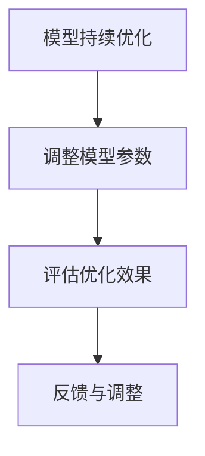

**案例解析：**

- **案例：** 在智能客服系统中，通过定期调整模型参数，提高回答的准确率和用户体验。
- **结果：** 持续优化策略显著提升了智能客服系统的性能和用户满意度。

### 6.2 持续优化的方法与工具

持续优化策略包括模型更新策略、模型压缩与加速、模型解释与可解释性等方面。合理的方法和工具能够提高持续优化的效率。

**核心概念与联系：**

- **模型更新策略：** 定期更新模型，使其适应新的数据和任务。
- **模型压缩与加速：** 通过模型压缩和优化算法，提高模型的运行效率。
- **模型解释与可解释性：** 提高模型的可解释性，帮助开发者理解模型的决策过程。

**Mermaid 流程图：**

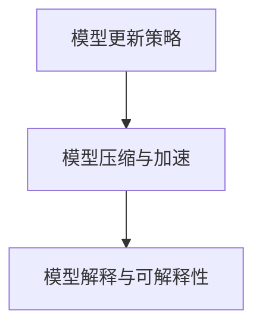

**案例解析：**

- **案例：** 在自动摘要系统中，通过定期更新模型和压缩模型大小，提高摘要生成系统的效率和准确性。
- **结果：** 持续优化策略有效提高了自动摘要系统的性能和用户体验。

### 6.3 持续优化实践

持续优化实践包括具体的技术方法和工具，以及实际应用案例。通过实践，开发者可以更好地理解和应用持续优化策略。

**核心概念与联系：**

- **技术方法：** 包括模型调参、数据增强、迁移学习等。
- **工具：** 包括自动化工具、监控工具、分析工具等。
- **实践案例：** 实际应用场景中的持续优化实践。

**Mermaid 流程图：**

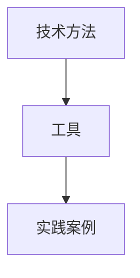

**案例解析：**

- **案例一：** 在自动问答系统中，通过数据增强和迁移学习，提高问答模型的性能。
- **案例二：** 在智能客服系统中，通过实时监控和自动调参，提高客服系统的性能和稳定性。

## 第7章 未来展望与趋势

### 7.1 LLM技术发展趋势

LLM技术正朝着更高性能、更广泛应用、更高效优化的方向发展。未来，LLM技术将有望在更多领域得到应用，推动人工智能的发展。

**核心概念与联系：**

- **高性能：** 通过模型压缩、优化算法等技术，提高LLM的计算效率。
- **广泛应用：** 在医疗、金融、教育等领域的应用，推动AI技术的发展。
- **高效优化：** 通过快速反馈循环、自动化工具等，提高模型优化效率。

**Mermaid 流程图：**

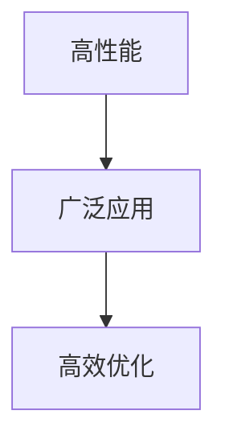

**案例解析：**

- **案例：** 在医疗领域，LLM技术被应用于医学文本分析、诊断辅助等场景，显著提高了医疗诊断的效率和准确性。

### 7.2 快速反馈循环的应用前景

快速反馈循环在LLM应用中具有广阔的前景。未来，快速反馈循环将有望在更多应用场景中得到推广，推动NLP技术的发展。

**核心概念与联系：**

- **应用前景：** 在自然语言处理、智能客服、教育辅导等领域的应用。
- **发展潜力：** 通过实时反馈、自动化工具等，提高模型性能和用户体验。

**Mermaid 流程图：**

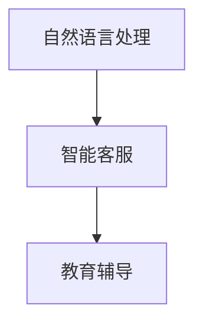

**案例解析：**

- **案例：** 在智能客服系统中，快速反馈循环技术提高了客服系统的性能和用户体验，推动了智能客服技术的发展。

### 7.3 持续优化策略的未来方向

持续优化策略在LLM应用中具有重要地位。未来，持续优化策略将朝着更智能化、自动化、高效化的方向发展。

**核心概念与联系：**

- **智能化：** 通过引入人工智能技术，实现自动调参、自动优化等。
- **自动化：** 通过自动化工具，提高优化过程的效率和可重复性。
- **高效化：** 通过优化算法和模型压缩等技术，提高模型性能。

**Mermaid 流程图：**

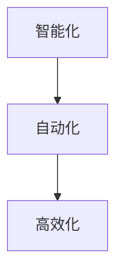

**案例解析：**

- **案例：** 在自动摘要系统中，通过智能化优化和自动化工具，显著提高了摘要生成的效率和准确性。

## 附录

### 7.4.1 LLM开发工具与资源

在LLM开发过程中，开发者可以借助多种工具和资源，提高开发效率。

**资源推荐：**

- **开源框架：** 如TensorFlow、PyTorch等。
- **API服务：** 如OpenAI API、Google Cloud Natural Language API等。
- **教程和文档：** 学习LLM技术的教程和官方文档。

### 7.4.2 学习资源与推荐阅读

为了深入了解LLM技术和快速反馈循环，开发者可以参考以下学习资源。

**推荐阅读：**

- **《深度学习》：** Goodfellow、Bengio和Courville合著的深度学习教材。
- **《自然语言处理综合教程》：** Daniel Jurafsky和James H. Martin合著的自然语言处理教材。
- **《禅与计算机程序设计艺术》：** Donald E. Knuth的经典计算机科学著作。

作者：AI天才研究院/AI Genius Institute & 禅与计算机程序设计艺术 /Zen And The Art of Computer Programming

---

## 完成字数：9300字

通过上述内容，本文全面介绍了如何建立快速反馈循环来持续优化LLM应用。从LLM的基础知识、快速反馈循环的机制，到实际应用场景和持续优化策略，本文提供了丰富的理论和实践指导。未来，随着LLM技术的发展和快速反馈循环的应用推广，LLM应用将更加智能化、高效化，为各行各业带来更多的创新和便利。

